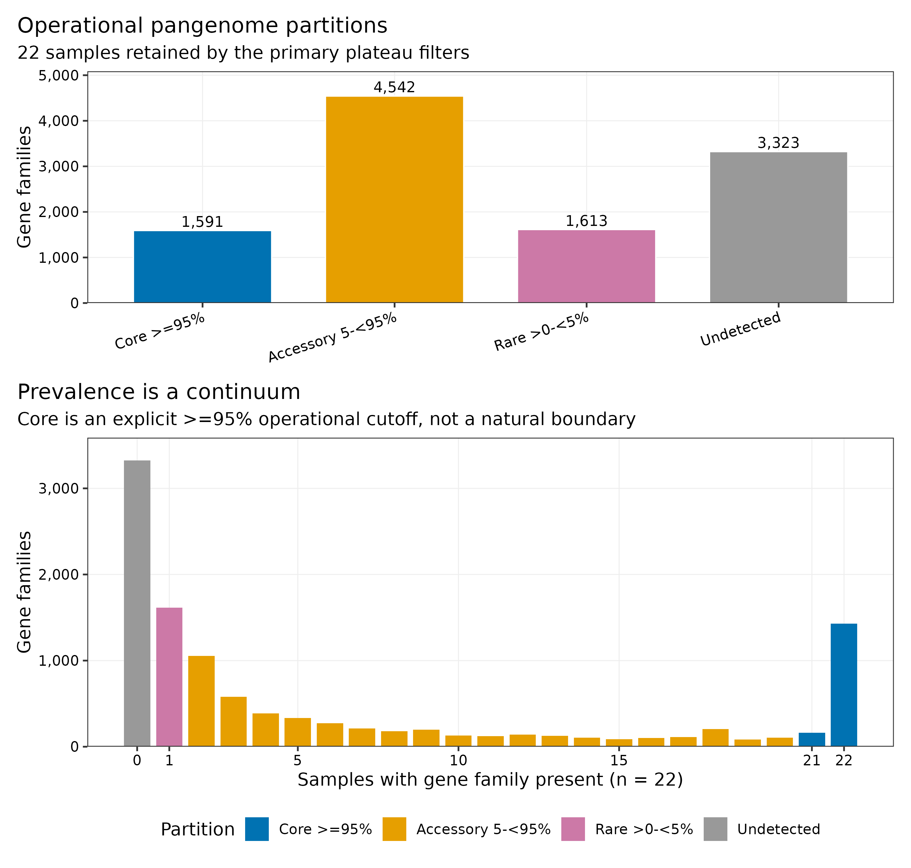
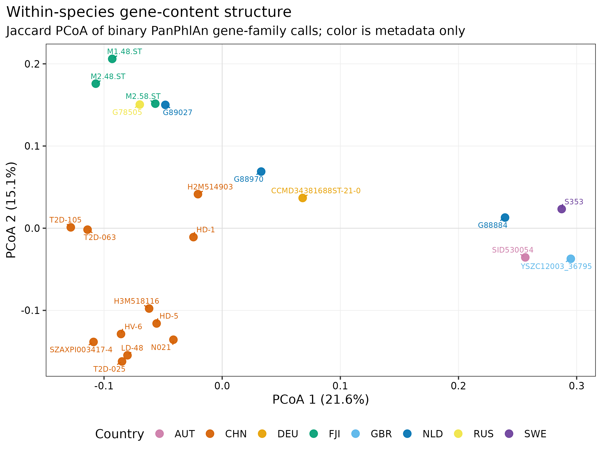
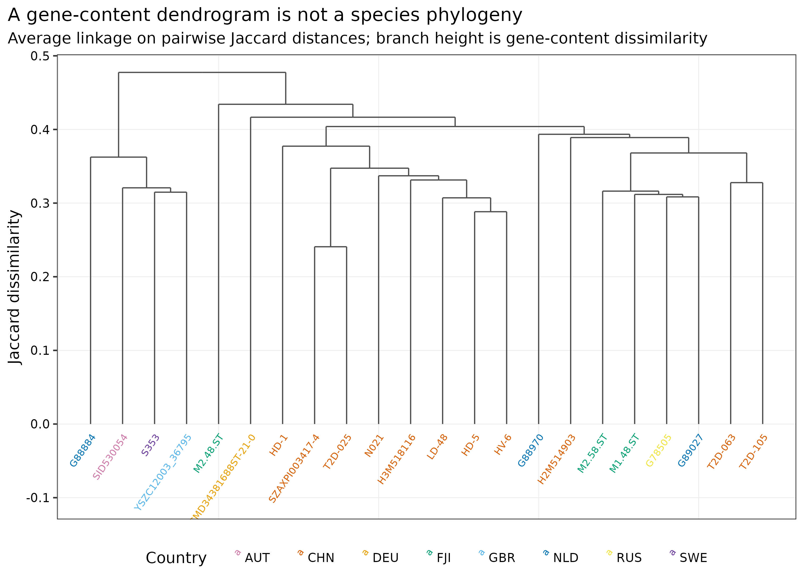
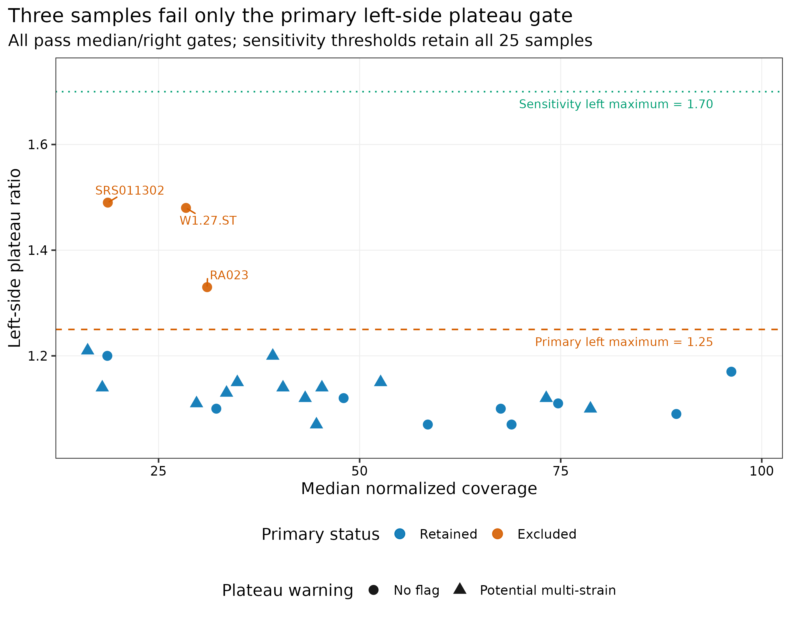
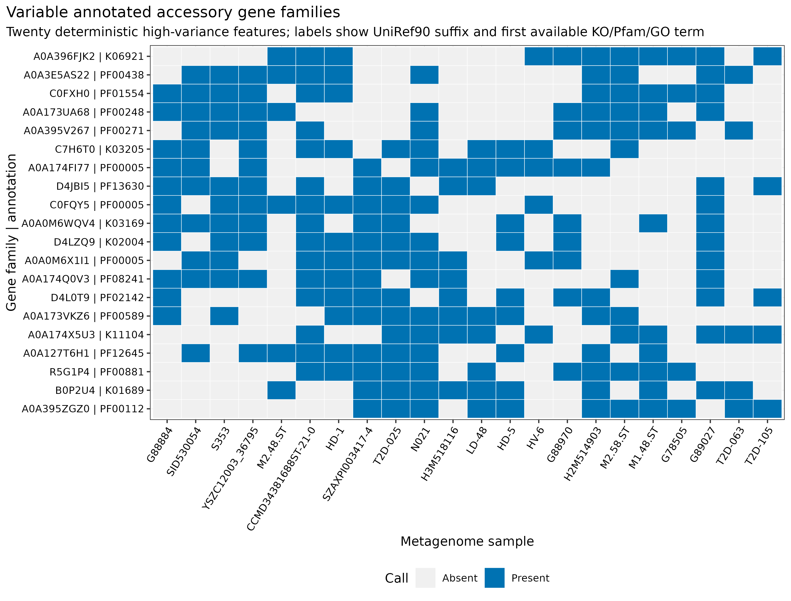

> **先给结论：**“同一物种”只保证共享一部分物种骨架，不保证携带同一套功能基因。对 PanPhlAn 3 官方教程的 **25 个真实 stool metagenomes（13 studies、9 countries）**和 15 个 *Eubacterium rectale* 参考基因组进行重算后，主阈值保留 22 个样本；在 11,069 个 UniRef90 gene families 中，按样本 prevalence 定义出 **1,591 个 operational core（≥95%）**、**4,542 个 accessory（5%--<95%）**、**1,613 个 rare（>0--<5%）**，另有 3,323 个只见于参考集合、未在这 22 个宏基因组中检出的家族。这个结果描述的是参考泛基因组覆盖范围内的优势菌株基因组成，不能直接升级为 ARG、毒力、BGC、质粒或噬菌体功能结论。

::: {.callout-important title="算力与数据门槛"}
本次从官方预计算 mapping profiles 起步，PanPhlAn 3.1 主分析耗时 **8.83 秒、峰值 RAM 0.148 GiB**；敏感性分支耗时 **6.59 秒、峰值 RAM 0.113 GiB**。全工作目录约 **240 MB**，实际 profiling 为单进程。按这一入口建议准备 **1--2 CPU cores、2 GB RAM、1 GB 可用磁盘、5 分钟**。若从 25 个原始 FASTQ 重新做 Bowtie2 mapping，建议 **8--16 cores、32 GB RAM、至少 300 GB 临时磁盘**，耗时会随读长、深度和压缩格式从数小时增加到数天。没有服务器时，可直接读取 `data/small/52-panphlan-pangenome-frozen/` 中校验过的 presence/absence 矩阵和汇总表重画下游图。
:::

## 这一步对应论文里的哪张图 {#sec-target}

PanPhlAn 方法论文 Figure 3 用 *E. rectale* 与 *A. muciniphila* 展示大规模种内 population genomics：每个样本先被表示成 gene-family presence/absence profile，再按 gene content 观察菌株群体结构 [@scholz2016panphlan]。这里复现的是同一类 *E. rectale* 泛基因组图，不声称重现论文全部样本或原始版式；输入来自 PanPhlAn 3 官方 25-sample 教程 [@segatalab2022panphlan3tutorial]。

{#fig-52-prevalence}

{#fig-52-pcoa}

{#fig-52-dendrogram}

## 理论：从“检出一个物种”走到“这个菌株带什么基因” {#sec-theory}

### 1. 物种 abundance 与菌株 gene repertoire 是两个问题

MetaPhlAn 一类 marker-based profiler 回答“样本里有哪些物种、相对丰度多少”；PanPhlAn 把 reads 比对到目标物种的参考泛基因组，回答“目标物种在这个样本中的优势菌株可能携带哪些 gene families” [@beghini2021biobakery; @scholz2016panphlan]。因此，同样检出 *E. rectale* 的两个样本可以共享核心代谢骨架，却在转运、移动元件、环境响应和其他附属功能上不同。

### 2. Presence/absence 来自归一化覆盖平台，而不是“有一条 read 就算存在”

对样本 (i) 与 gene family (g)，PanPhlAn 先得到 read coverage (c_{ig})，再用该样本的覆盖平台估计物种内基因的基准拷贝水平。归一化值过低判 absent，落在明确平台内判 present，过高则提示 multicopy。默认 gene-level 阈值为：

\[
z_{ig}<0.25\Rightarrow absent,\qquad
z_{ig}>0.50\Rightarrow present,\qquad
z_{ig}>1.50\Rightarrow multicopy.
\]

样本本身还需通过 median coverage、left-side plateau 与 right-side plateau 三道门。这样能减少低深度随机命中被误判为基因存在，但阈值也会改变哪些样本进入分析。

### 3. Core、accessory 与 rare 都必须带上分母

这里的 operational prevalence 定义为：

\[
p_g=\frac{\sum_{i=1}^{n} I(g\text{ present in }i)}{n}.
\]

- `Core >=95%`：(p_g\ge0.95)；主分析 22 个样本时等价于至少 21 个样本检出。
- `Accessory 5-<95%`：(0.05\le p_g<0.95)。
- `Rare >0-<5%`：(0<p_g<0.05)；在 (n=22) 时就是 singleton。
- `Undetected`：这批宏基因组均未检出，但 gene family 可因 `--add_ref` 保留在参考泛基因组矩阵中。

分母一变，边界就可能变。主分析 22 个样本得到 1,591 个 ≥95% core；宽松分支纳入全部 25 个样本后为 1,571 个。报告“core genome 大小”时不写样本数、过滤与阈值，数字没有可比性。

### 4. Gene-content tree 与 species phylogeny 不可互换

Jaccard distance 只比较 binary gene content：

\[
d_J(A,B)=1-\frac{|A\cap B|}{|A\cup B|}.
\]

它会受基因获得/丢失、质粒和噬菌体、mapping bias、阈值及数据库覆盖影响。StrainPhlAn 或 core-genome phylogeny 比较的是同源 marker/core sequence 的 nucleotide substitutions。二者回答不同问题：gene-content dendrogram 适合找“功能型相似”的样本，不能当作物种演化树，更不能仅凭近邻断言传播。

<details>
<summary><strong>为什么多菌株共存会让 presence/absence 失真？</strong></summary>

PanPhlAn 的单个样本 profile 近似目标物种中优势信号的组合。若两个菌株同时存在，菌株 A 与菌株 B 的基因集合会在 reads 层面叠加，产生一个自然界未必存在的“合成基因型”；共享区域的 cross-mapping 也会进一步模糊边界。程序用 out-of-plateau coverage 给出潜在 multi-strain warning，但 warning 不是菌株拆分。主分析 22 个保留样本中有 13 个出现该提示，因此 accessory gene 的逐样本解释应保持保守。

</details>

## 准备工作 {#sec-preparation}

### 数据从哪里来

| 输入 | 固定对象 | 完整性与来源 |
|---|---|---|
| 参考泛基因组 | 官方 `Eubacterium_rectale.tar.bz2`；15 references、11,069 UniRef90 families | 83,327,158 bytes；官方 MD5 `87b111ad1612930d34ab17f9e0f09e34`；固定 SHA-256 `411d8736790ef591e8131d58e096d68a15c477bc21eb39b41c337af950d4dfc6` |
| 真实 mapping profiles | 官方教程 25 个 stool metagenomes，13 studies、9 countries | 3,714,090 bytes；SHA-256 `5f9bfecbe3e5459e06f48677076b49a4a37263935ac8cff8422cf1ef6bc9bc50` |
| Profiling source | PanPhlAn 3.1 `panphlan_profiling.py` | Git commit `4294c3f5c92be9b9ef7d61b69df43e7f27c51601`；source SHA-256 `901b4dc3710a26145dca064216d62769772b743db55683a956b66253565e7480` |
| 教程定义 | PanPhlAn 3 wiki | commit `328be1e6074015c5183668913ed5e0cf0f879fe5` |

官方 mapping archive 保存为 `.csv.bz2`，而固定 commit 的 profiling 入口直接按文本读取目录文件。准备脚本先核对整个归档 SHA-256，再逐文件做标准 bzip2 解压；每个压缩文件与解压文件的 bytes、SHA-256、样本别名、study 和 country 都写入 `sample-metadata.tsv`。这一步只改变封装与规范化样本名，不改变任何 coverage 数值。

官方 annotation snapshot 没有声明独立 release 号，因此不能凭空补一个数据库版本。这里用归档 SHA-256、每个成员的 SHA-256 和 PanPhlAn source commit 锁定内容；Methods 明确写成 “checksum-locked bundled annotation snapshot”。

<details>
<summary><strong>安装环境与内联作图函数</strong></summary>

```bash
mamba env create -f env/panphlan.yml

# 或从 exact Linux lock 重建：
conda create --name metagenome-panphlan-2026.07 \
  --file env/panphlan-linux-64.lock

conda run -n metagenome-panphlan-2026.07 python -V
conda run -n metagenome-panphlan-2026.07 bowtie2 --version
conda run -n metagenome-panphlan-2026.07 samtools --version
```

实跑环境为 PanPhlAn profiling source 3.1、Python 3.12.13、NumPy 2.3.5、Pandas 3.0.5、Bowtie2 2.5.5 与 SAMtools 1.23.1。后两者为从 FASTQ mapping 准备的环境锁；本次计算读取官方 mapping profiles，没有重新运行 Bowtie2/SAMtools。

```r
install.packages(c(
  "ggplot2", "dplyr", "readr", "tidyr", "scales",
  "ggrepel", "patchwork", "ggdendro", "vegan", "ape"
))

library(ggplot2)
library(dplyr)
library(readr)
library(tidyr)
library(scales)
library(ggrepel)
library(patchwork)
library(ggdendro)
set.seed(20260752)

pal_pub <- c(
  "AUT" = "#CC79A7", "CHN" = "#D55E00", "DEU" = "#E69F00",
  "FJI" = "#009E73", "GBR" = "#56B4E9", "NLD" = "#0072B2",
  "RUS" = "#F0E442", "SWE" = "#6A3D9A", "USA" = "#8C564B"
)
scale_color_pub <- function(...) scale_color_manual(values = pal_pub, ...)
scale_fill_pub  <- function(...) scale_fill_manual(values = pal_pub, ...)
theme_pub <- function(base_size = 12) {
  theme_bw(base_size = base_size) + theme(
    panel.grid.minor = element_blank(),
    panel.grid.major = element_line(color = "#EEEEEE", linewidth = 0.3),
    axis.text = element_text(color = "black"),
    legend.key = element_blank(),
    strip.background = element_rect(fill = "#EEF3F5", color = NA),
    plot.title.position = "plot"
  )
}
save_pub <- function(plot, file_base, width = 200, height = 145,
                     units = "mm", dpi = 350) {
  dir.create(dirname(file_base), recursive = TRUE, showWarnings = FALSE)
  ggsave(paste0(file_base, ".pdf"), plot, width = width, height = height,
         units = units, device = cairo_pdf)
  ggsave(paste0(file_base, ".png"), plot, width = width, height = height,
         units = units, dpi = dpi, bg = "white")
  ggsave(paste0(file_base, ".tiff"), plot, width = width, height = height,
         units = units, dpi = dpi, compression = "lzw", bg = "white")
  invisible(plot)
}
```

</details>

## 可复制代码：从官方 mapping profiles 到种内 gene-content 图 {#sec-code}

### 第 1 步：下载、校验并登记真实输入

```bash
ROOT="$PWD"
WORK="work/article52"

python3 scripts/prepare_article52_panphlan.py \
  --project-root "$ROOT" \
  --work-dir "$WORK"

head "$WORK/asset-manifest.tsv"
head "$WORK/sample-metadata.tsv"
cat "$WORK/run-contract.json"
```

准备脚本在任何解包或 profiling 前验证两个官方 archive，并再次验证 25 个 decoded profiles、9 个 pangenome members 与两份 pinned source。若 URL 内容漂移、下载截断或本地文件被改动，runner 会在反序列化和矩阵计算前停止。

### 第 2 步：运行主阈值

```bash
conda run -n metagenome-panphlan-2026.07 \
  python "$WORK/software/panphlan_profiling.py" \
  -i "$WORK/decoded-maps" \
  -p "$WORK/pangenome/Eubacterium_rectale/Eubacterium_rectale_pangenome.tsv" \
  --o_matrix "$WORK/output/primary-matrix.tsv" \
  --o_covmat "$WORK/output/coverage-matrix.tsv" \
  --o_idx "$WORK/output/primary-index.tsv" \
  --min_coverage 2 \
  --left_max 1.25 \
  --right_min 0.75 \
  --th_non_present 0.25 \
  --th_present 0.5 \
  --th_multicopy 1.5 \
  --add_ref -v
```

主阈值保留 22/25 个 metagenome samples 和 15/15 个 references。`RA023`、`SRS011302` 与 `W1.27.ST` 的 median coverage 和 right-side plateau 都通过，但 left-side ratios 分别为 1.33、1.49 与 1.48，高于 `--left_max 1.25`，因此被排除。

结果表的前几列长这样：

```text
GeneFamily              CCMD34381688ST-21-0  G78505  G88884  G88970
UniRef90_A0A069A530     0                     0       0       0
UniRef90_A0A076YZQ3     1                     0       1       0
UniRef90_A0A095XLP0     1                     0       1       1
```

`1` 表示在该样本的归一化覆盖平台上判 present，`0` 表示判 absent；它不是 read count，也不是未经校正的 coverage。

### 第 3 步：只改变样本 plateau gate，做敏感性分支

```bash
conda run -n metagenome-panphlan-2026.07 \
  python "$WORK/software/panphlan_profiling.py" \
  --i_covmat "$WORK/output/coverage-matrix.tsv" \
  -p "$WORK/pangenome/Eubacterium_rectale/Eubacterium_rectale_pangenome.tsv" \
  --o_matrix "$WORK/output/sensitive-matrix.tsv" \
  --o_idx "$WORK/output/sensitive-index.tsv" \
  --min_coverage 1 \
  --left_max 1.70 \
  --right_min 0.30 \
  --th_non_present 0.25 \
  --th_present 0.5 \
  --th_multicopy 1.5 \
  --add_ref -v
```

敏感性分支沿用同一份 raw coverage matrix，只放宽 sample-level plateau gates，因而 25 个样本全部保留。两支共同的 22 个样本使用完全相同的 gene-level thresholds，其 11,069 × 22 个 binary calls 逐位一致；变化来自新增三个样本和 prevalence 分母改变，而不是暗中重写 gene calls。

{#fig-52-plateau}

### 第 4 步：由 presence/absence 矩阵计算 prevalence、Jaccard 与 PCoA

```r
pa <- read_tsv(
  "data/small/52-panphlan-pangenome-frozen/primary-presence-absence.tsv.gz",
  show_col_types = FALSE
)
meta <- read_tsv(
  "data/small/52-panphlan-pangenome-frozen/sample-filter-audit.tsv",
  show_col_types = FALSE
)

sample_cols <- meta |> filter(PrimaryRetained) |> pull(Sample)
x <- pa |> select(all_of(sample_cols)) |> as.matrix()
rownames(x) <- pa[[1]]

prevalence <- rowMeans(x)
partition <- case_when(
  prevalence >= 0.95 ~ "Core >=95%",
  prevalence >= 0.05 ~ "Accessory 5-<95%",
  prevalence > 0     ~ "Rare >0-<5%",
  TRUE               ~ "Undetected"
)

jaccard <- vegan::vegdist(t(x), method = "jaccard", binary = TRUE)
ordination <- ape::pcoa(jaccard, correction = "none")
```

这里的 PCoA 前两条正特征值轴解释正特征值总和的 21.6% 与 15.1%。二维图只展示距离结构的一部分；不要根据点在二维空间里“看起来靠近”就替代完整距离矩阵或系统发育证据。

### 第 5 步：汇总、作图、冻结与验收

```bash
python3 scripts/run_article52_panphlan.py \
  --project-root "$ROOT" --work-dir "$WORK" \
  --environment metagenome-panphlan-2026.07

conda run -n metagenome-panphlan-2026.07 \
  python scripts/summarize_article52_panphlan.py \
  --project-root "$ROOT" --work-dir "$WORK"

Rscript scripts/plot_article52_panphlan.R \
  --work-dir "$WORK" --output-dir figures

python3 scripts/freeze_article52_panphlan.py \
  --project-root "$ROOT" --work-dir "$WORK" \
  --output-dir data/small/52-panphlan-pangenome-frozen

python3 scripts/validate_article52_panphlan.py \
  --project-root "$ROOT" \
  --frozen-dir data/small/52-panphlan-pangenome-frozen \
  --output-dir results/52-panphlan-pangenome \
  --figure-dir figures \
  --chapter chapters/52-pangenome-accessory-genes.qmd
```

Runner 会把主分析完整复跑一次，并对 presence/absence、plateau index 与 coverage matrix 做 SHA-256 比对；三份 artifact 均 byte-identical。没有请求 PanPhlAn 的随机 native coverage plot，Python hash 与 BLAS 线程也被固定。R 图中的标签避让使用 `set.seed(20260752)`。

## 审计与升级 {#sec-audit}

### 先审计样本是否足以代表单一菌株

主分支的 22 个保留样本中，13 个被 PanPhlAn 的 fixed `out-of-plateau >0.20` 规则标记为 potential multi-strain。这个比例足以改变解释策略：presence/absence heatmap 可用于发现候选 gene-content modules，但不能把每一列都称作已解析的单菌株 genome。若研究结论依赖精确 haplotype，应增加培养分离株、long-read/MAG、DESMAN 类拆分或纵向一致性证据。

### 再审计 core/accessory 是否依赖阈值

主分支与敏感性分支的 category transition 为：

| 主分支 → 敏感性分支 | Gene families |
|---|---:|
| Core → Core | 1,571 |
| Core → Accessory | 20 |
| Accessory → Accessory | 4,542 |
| Rare → Accessory | 335 |
| Rare → Rare | 1,278 |
| Undetected → Accessory | 17 |
| Undetected → Rare | 442 |
| Undetected → Undetected | 2,864 |

这不是软件不稳定：共同 22 个样本的 binary calls 完全相同。新增三个合格样本改变了分母，也让原先未检出的参考 gene families 获得宏基因组证据。发表时应至少给出一个 sample-filter sensitivity，并把 core cutoff 与有效 (n) 同时写进图注。

### 对 gene-content structure 只做描述性审计

22 个样本产生 231 个非独立样本对。同 study 16 对、同 country 异 study 45 对、异 country 170 对，Jaccard distance 中位数依次为 **0.3670、0.3664、0.4357**。异 country 样本对整体更远，但 country 与 study、疾病、年龄、建库和实验室混杂；样本对又共享端点，不能把 231 对当 231 个独立重复做普通秩和检验。

最近的 `SZAXPI003417-4` 与 `T2D-025` 的 Jaccard distance 仍为 **0.2407**。它们只能算 gene-content 近邻，不能由此宣称 same strain、传播或共同来源。若要比较 marker phylogeny 与 gene-content clustering，应在相同样本集合上分别运行 StrainPhlAn 与 PanPhlAn，再用明确的 distance concordance 或树拓扑方法比较，不能把两张树凭视觉强行对齐。

### 审计注释，而不是把通用 term 当功能金标准

官方 pangenome annotation 文件覆盖 11,061/11,069 个 gene families；8 个没有 annotation row。原文件还有 5 行被拼接了重复 header，清洗器按行号登记、只保留前 8 个合法字段，并保留修复动作。主分析中，core families 的 Pfam 与 KO 注释率分别为 87.3% 与 23.4%，accessory families 只有 53.0% 与 7.8%。因此，“没有 KO”不等于“没有功能”，“有一个宽泛 Pfam”也不等于已确定生物学表型。

{#fig-52-accessory}

尤其不要从通用 GO/KO/Pfam 直接推出抗性、毒力、BGC、质粒或噬菌体防御。ARG 应用锁版本 CARD 做 identity/coverage 与 resistance-model 审计 [@alcock2023card]；virulence 用 VFDB 并区分毒力决定子与普通 housekeeping homolog [@liu2022vfdb]；BGC 要在 contig/genome context 上运行 antiSMASH 等工具 [@blin2025antismash8]。质粒、prophage 与 defense system 同样需要序列上下文和专用数据库。PanPhlAn heatmap 的职责是给出候选，不是签发功能结论。

### 审计参考偏倚与数据库身份

参考集合的 15 个 genomes 共有 11,069 个 UniRef90 families，但 25 个真实样本的 raw coverage matrix 只出现 10,703 个；另外 366 个 families 通过 `--add_ref` 留在最终矩阵。参考 strict core 为 1,335 个，而宏基因组主分支 strict core 为 1,429 个、≥95% operational core 为 1,591 个。两套“core”来自不同采样过程，不能混写。

UniRef90 是相似序列聚类坐标，不是永恒不变的基因身份 [@suzek2007uniref]。换 PanPhlAn pangenome、UniRef release 或参考 genome collection，gene-family universe 与 core/accessory 计数都会改变。当前官方 annotation snapshot 没有可报告的语义版本，故以 archive hash 和 member hashes 锁定；这比猜版本可靠，但也限制了跨数据库直接比较。

## 出版级美化 {#sec-publication}

五张图分别承担不同问题，避免把所有信息塞进一张热图：

1. prevalence spectrum 先交代分母、cutoff 与各分区规模；
2. Jaccard PCoA 展示低维 gene-content structure；
3. dendrogram 明确写出 average linkage 和 Jaccard branch height，并在标题中声明它不是 species phylogeny；
4. accessory heatmap 只展示固定规则选出的 20 个高变、已有 annotation 的候选 features；
5. plateau audit 把三个被排除样本和两个 left-side thresholds 直接画出来。

颜色采用色觉友好方案；`country`、`Primary status`、`Call`、坐标与图注均为英文。标签避让固定 seed，不让重渲染改变文字位置。每张图同步导出 PDF、350 dpi PNG 与 LZW-compressed 350 dpi TIFF：

```r
save_pub(
  p_pcoa,
  "figures/52-gene-content-pcoa",
  width = 205, height = 155, units = "mm", dpi = 350
)
```

R 4.4.1、ggplot2 3.5.2、dplyr 1.1.4、readr 2.1.5、ggrepel 0.9.5、patchwork 1.3.2 与 ggdendro 0.2.0 的版本均写入冻结包。

## 常见坑 {#sec-pitfalls}

::: {.callout-caution title="把低覆盖缺失当成真正 gene loss"}
低深度会把 present gene 推向 0。先看 median coverage 与 plateau，报告被过滤样本；不要把主分支未纳入的样本强行补零。presence/absence 不是测序深度无关的绝对真值。
:::

::: {.callout-caution title="把 mixed-strain profile 当成一株完整基因组"}
potential multi-strain warning 表示 coverage curve 与单一平台不完全相容。多个菌株的基因集合可能叠加；热图中的一列不一定对应可培养的单一 genome。
:::

::: {.callout-caution title="用 gene-content dendrogram 代替系统发育树"}
Jaccard clustering 没有 nucleotide substitution model，也不处理同源重组。需要演化关系时，用相同样本上的 marker/core alignment、显式模型和 branch support。
:::

::: {.callout-caution title="筛到一个 term 就写成 ARG、VF 或 BGC"}
UniRef/GO/KO/Pfam 是候选注释层。高风险功能需要专库、版本、identity/coverage cutoff、contig context 与阴阳性对照；BGC 更不能脱离基因邻域。
:::

::: {.callout-caution title="把所有样本对当独立重复"}
同一个样本出现在许多 pairwise distances 中，普通 t test 或 Wilcoxon 会产生伪重复。若要正式检验 geography/study effect，应在样本层面建模、限制置换层级，并验证跨 cohort 可重复性。
:::

## 这段 Methods 怎么写 {#sec-methods}

**Methods template**

> Species-specific gene repertoires were profiled with PanPhlAn profiling source v3.1 (commit 4294c3f5c92be9b9ef7d61b69df43e7f27c51601; Python 3.12.13 and NumPy 2.3.5). We used the official *Eubacterium rectale* tutorial pangenome comprising 15 reference genomes and 11,069 UniRef90 gene families (archive SHA-256: 411d8736790ef591e8131d58e096d68a15c477bc21eb39b41c337af950d4dfc6) together with 25 official metagenomic mapping profiles (archive SHA-256: 5f9bfecbe3e5459e06f48677076b49a4a37263935ac8cff8422cf1ef6bc9bc50). Samples were retained using a minimum median coverage of 2, a maximum left-side plateau ratio of 1.25, and a minimum right-side plateau ratio of 0.75. Gene families were called absent below 0.25 normalized coverage, present above 0.50, and multicopy above 1.50. Reference genomes were retained with `--add_ref`. A sensitivity analysis used sample-level thresholds of 1, 1.70, and 0.30 while preserving the gene-level thresholds and the precomputed coverage matrix. Operational core, accessory, rare, and undetected families were defined as prevalence ≥95%, 5%--<95%, >0%--<5%, and 0%, respectively, among retained metagenomic samples. Pairwise gene-content dissimilarity was quantified using binary Jaccard distance. The bundled functional annotation snapshot did not declare a semantic database release and was therefore locked by archive and member SHA-256 checksums. No randomized native coverage plot was requested; deterministic plotting used seed 20260752.

**Results template**

> Of 25 metagenomic samples, 22 passed the primary PanPhlAn plateau filters and all 15 reference genomes were retained. Among 11,069 pangenome gene families, 1,591 were operational core, 4,542 accessory, 1,613 rare, and 3,323 were not detected in the retained metagenomes. The median inferred repertoire contained 3,191 families per sample (range 2,713--3,648). Thirteen retained samples received a potential multi-strain warning. A sensitivity branch retained all 25 samples and yielded 1,571 operational core families; calls for the 22 shared samples were identical between branches. Median Jaccard distances were 0.3670 for within-study pairs, 0.3664 for same-country/different-study pairs, and 0.4357 for different-country pairs; these descriptive strata were not treated as independent replicates.

## 换成你自己的数据怎么做 {#sec-own-data}

至少需要四类输入：

- 每个样本去接头、去宿主后的 shotgun FASTQ；
- 目标物种名称与版本锁定的 PanPhlAn pangenome，包括 Bowtie2 indexes、pangenome TSV 和 annotation；
- 一张一行一个样本的 metadata 表，至少含 `Sample`、`Study`、`Country` 或你的主要设计变量；
- 足够深的目标物种 coverage。物种丰度很低时，不要靠放宽阈值制造 profile。

从 FASTQ mapping 的标准入口是：

```bash
conda run -n metagenome-panphlan-2026.07 \
  panphlan_map.py \
  -i clean/SAMPLE.fastq.bz2 \
  --indexes db/TARGET_SPECIES/TARGET_SPECIES \
  -p db/TARGET_SPECIES/TARGET_SPECIES_pangenome.tsv \
  -o map_results/SAMPLE.csv.bz2 \
  --nproc 8 --min_read_length 70 -v
```

然后把所有样本的 mapping results 放进同一目录，先按默认/预注册阈值运行，再做 sample gate 与 gene gate 的敏感性分析。每次分析都保存：

1. pangenome archive 与成员 checksum、参考 genomes 清单、UniRef/annotation snapshot 身份；
2. 每个样本的 median、left、right、out-of-plateau 指标和过滤理由；
3. 原始 coverage matrix、plateau index、binary presence/absence matrix；
4. core/accessory 定义中的有效样本数与 cutoff；
5. multi-strain warnings 和专库功能验证结果。

若目标物种没有合适的 PanPhlAn database，不要把近缘物种数据库硬套上去。可改用 MIDAS2 的 species pangenome、anvi'o pangenomics，或从高质量 isolates/MAGs 构建版本锁定的 species-specific gene catalog；但 reference dereplication、gene clustering identity、fragmentation、contamination 与 annotation provenance 必须重新审计。

## 参考 {#sec-references}

- PanPhlAn 方法与 *E. rectale* population-genomics 示例：[@scholz2016panphlan]
- PanPhlAn 3 官方 25-sample 教程与 pangenome/mapping assets：[@segatalab2022panphlan3tutorial]
- bioBakery 3 taxonomic、functional 与 strain-level profiling 框架：[@beghini2021biobakery]
- UniRef gene-family coordinate：[@suzek2007uniref]
- 专用功能验证数据库与工具：CARD [@alcock2023card]、VFDB [@liu2022vfdb]、antiSMASH [@blin2025antismash8]
