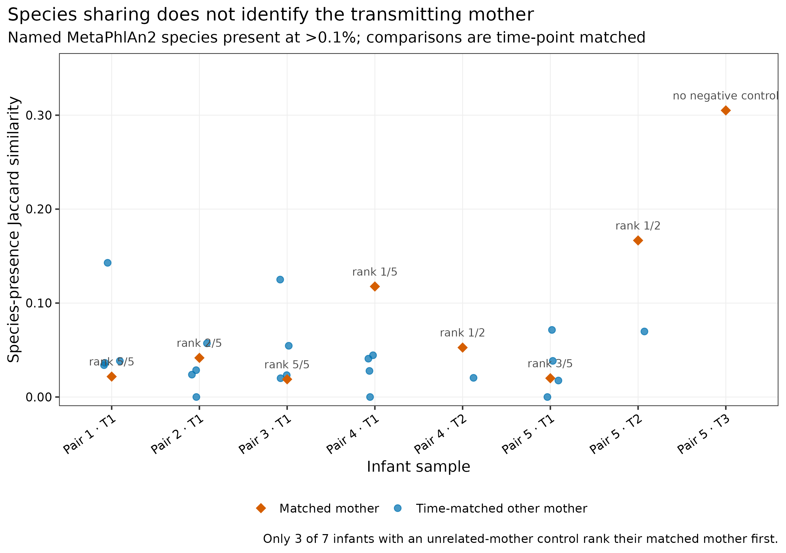
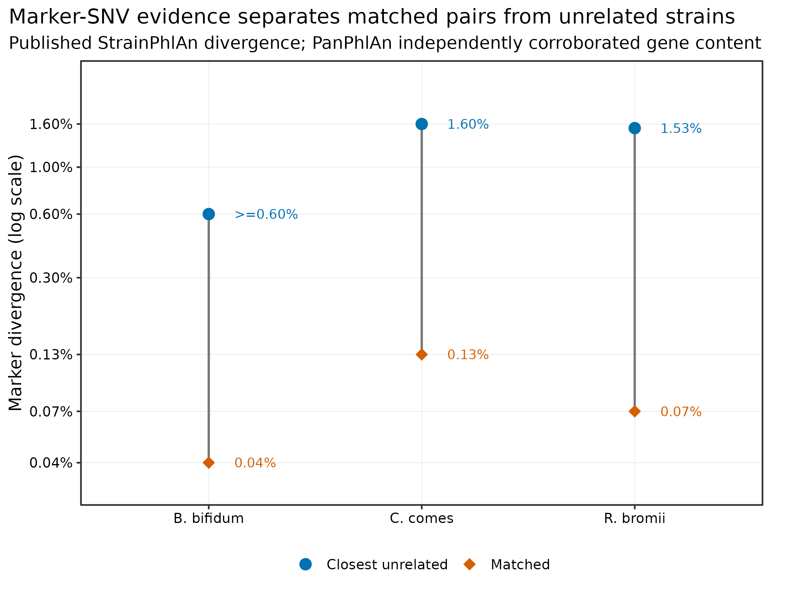
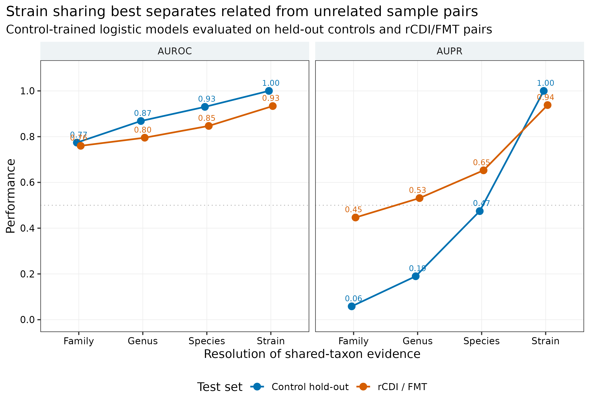
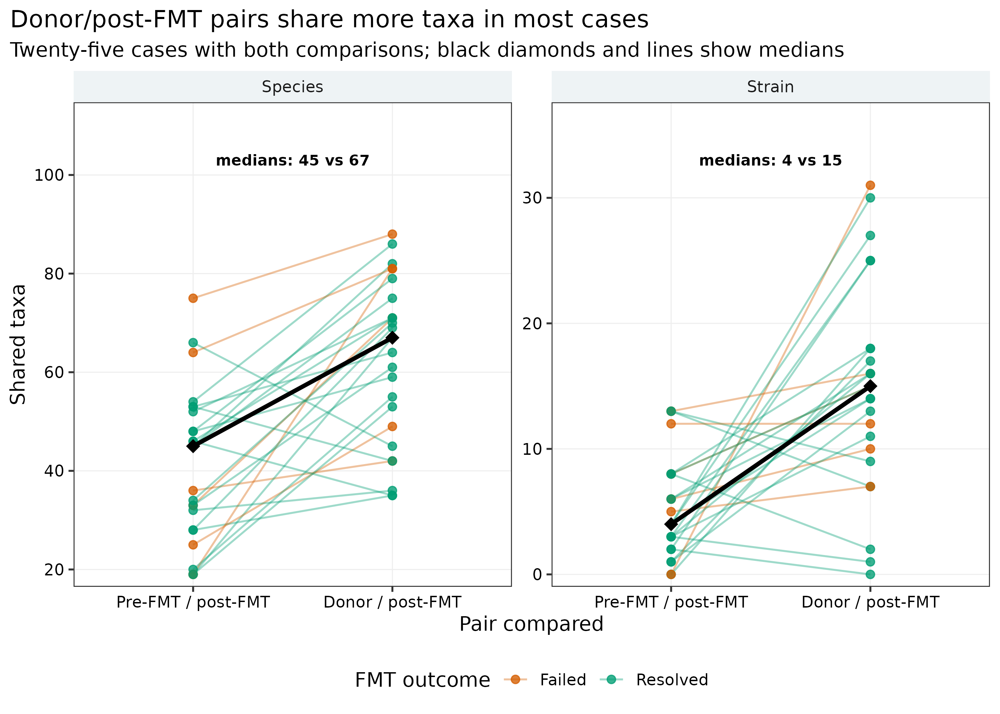
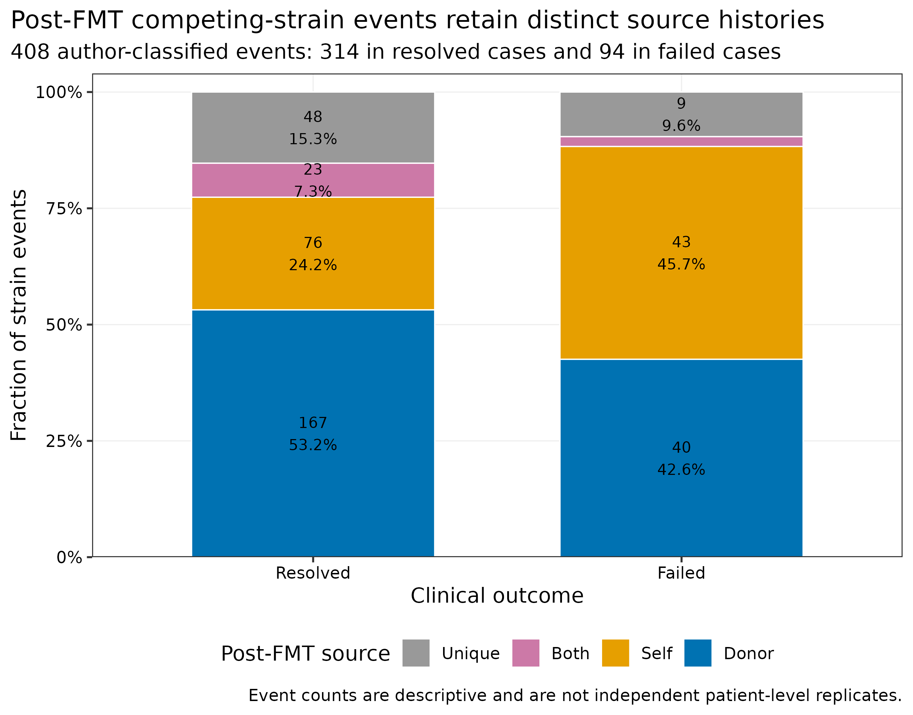

> **先给结论：**“两个人都有同一个物种”只能证明共现，不能证明传播。Asnicar 母婴队列的 24 个真实 shotgun profiles 中，以论文使用的 **>0.1%** 作为命名物种 presence 门槛后，8 个婴儿—匹配母亲的共享物种数中位数为 2，22 个同时间点婴儿—其他母亲组合的中位数同样为 2；在 7 个至少有一位其他母亲可作负对照的婴儿中，匹配母亲只有 **3/7** 次取得最高 Jaccard similarity。真正把证据推进到菌株层的是 species-specific marker SNV：论文报告的三个母婴事件中，匹配对 divergence 为 **0.04%--0.13%**，最近的非匹配菌株为至少 **0.60%--1.60%**，并由 PanPhlAn gene repertoire 交叉支持。即便如此，原研究仍明确承认共同环境来源未被排除 [@asnicar2017transmission]。传播结论至少需要“同菌株 + 足够 callable overlap + 时间方向 + 无关配对/环境负对照”；FMT 的 **engraftment** 还需要移植后持续检出，而不是一次阳性。

::: {.callout-important title="算力与数据门槛"}
开放补充表重分析实测每次 **3.21--3.29 秒、峰值 RAM 0.073--0.074 GiB**，完整工作目录约 **4.4 MB**；准备 **1 CPU core、1 GB RAM、20 MB 磁盘、1 分钟**即可。若从 FASTQ 重新生成 SameStr SNV profiles，论文报告 SameStr 本身平均增加约 **4.3 CPU minutes/sample**，但前置 QC、去宿主和 MetaPhlAn marker alignment 才是主要 I/O；单批建议 **8--32 cores、32--64 GB RAM**，磁盘至少覆盖压缩 FASTQ、SAM/BAM 与临时文件总量，百样本项目通常需要数百 GB。没有服务器时，直接使用 <code>data/small/53-strain-transmission-frozen/</code> 中的校验表重画统计图；不要用低覆盖 laptop 结果放宽阈值后宣称传播。
:::

## 这一步对应论文里的哪张图 {#sec-target}

母婴分支锚定 Asnicar 等的 Figure 2 与 Figures S3--S5：StrainPhlAn marker trees 给出 nucleotide-level sharing，PanPhlAn 用 gene repertoire 作独立维度的支持 [@asnicar2017transmission; @truong2017strainphlan]。FMT 分支锚定 Podlesny 等的 Figures 1、3、4 以及 Tables S6--S8：SameStr 用 maximum variant profile similarity（MVS）在 donor、pre-FMT recipient 和 post-FMT recipient 之间追踪 dominant 与 subdominant strains [@podlesny2022samestr]。

先看“种水平相似为何不够”。每个婴儿都与同一名义时间点可用的全部母亲比较；橙色菱形才是配对母亲。

{#fig-53-species-negative}

再把分辨率提升到 marker SNV。纵轴是 divergence 而不是 identity，并用对数尺度避免 0.04% 与 1.60% 被压在同一条线附近。

{#fig-53-mother-strains}

SameStr 论文把“相关样本对”与“无关样本对”当作可检验目标。仅看 family、genus 或 species 都会产生较多背景共享；strain resolution 在 held-out controls 与独立 rCDI/FMT 数据上均有更高 AUROC/AUPR。

{#fig-53-classifier}

## 理论：传播不是一个相似度阈值，而是一条证据链 {#sec-theory}

### 1. 同种只说明两个样本进入了同一个粗坐标

若样本 `A` 与 `B` 检出的命名物种集合分别为 `S_A`、`S_B`，binary Jaccard similarity 为：

\[
J(A,B)=\frac{|S_A\cap S_B|}{|S_A\cup S_B|}.
\]

成年人之间本来就共享常见 gut species；同一物种又可包含大量彼此独立的 strains。Jaccard 高可以来自饮食、年龄、地理、药物和数据库覆盖，也可以仅因某些常见物种高丰度。它适合筛候选 source-recipient pairs，不足以指定传播者。

### 2. “同菌株”必须同时看相似度与可比较区域

SameStr 在物种特异 marker alignment 中保留达到最低 allele fraction 的多个等位基因。对两个样本 `i` 与 `j`，MVS 可写成：

\[
\mathrm{MVS}_{ij}
=
\frac{\sum_k I(\text{position }k\text{ is covered in both and shares at least one allele})}
{\sum_k I(\text{position }k\text{ is covered in both})}.
\]

原论文用两道联合门槛调用 shared strain：

- `MVS ≥ 0.999`；
- jointly covered marker positions `≥5,000 bp`。

只报 99.9% 而不报 overlap 是不完整的。若仅比较 80 bp，100% identity 也没有足够证据；反过来，100 kb callable overlap 上的 99.99% 才更有说服力。inStrain、StrainPhlAn 与 SameStr 的 similarity 定义、参考坐标和 coverage gate 不同，阈值不能跨工具照搬 [@olm2021instrain; @truong2017strainphlan; @podlesny2022samestr]。

### 3. 同菌株仍不自动等于“由 A 传给 B”

shared strain 是对称关系，\(A\leftrightarrow B\)；传播是带方向的事件，\(A\rightarrow B\)。方向至少要靠时间设计建立：

1. source 在 recipient 首次检出前已经携带该菌株；
2. recipient 基线为阴性或携带不同菌株；
3. 传播后有一个以上时间点重复检出；
4. 同 household、food、water、clinic、donor batch 等共同来源被采样或进入模型；
5. unrelated pairs、跨 household pairs 和批次阴性对照不出现同样高的 sharing rate。

母婴研究天然提供“母亲早于婴儿”的方向，但父亲、照护者、医院、乳汁、食物与家庭环境仍可能是未采样来源。FMT 的 donor、recipient baseline 与 post-FMT 形成更强的三角设计；若 donor/post 匹配而 pre/post 不匹配，才支持 donor-derived strain。

### 4. Engraftment 比 transmission 多一层“持续存在”

一次 post-FMT 阳性可能是短暂 passage、死菌 DNA 或阈值附近波动。稳健的 engraftment 定义应预注册最短随访期、至少几个 post time points、是否要求连续检出，以及 coverage/overlap gates。若只保留最后一次 post-FMT 样本，能做的是 case-wise snapshot，不应改写成完整 colonization trajectory [@smillie2018engraftment; @podlesny2022samestr]。

### 5. 五级证据及可允许的表述

| 等级 | 最低证据 | 最多可以写到哪里 |
|---|---|---|
| 1 | 同一 species | “co-occurred / was shared at species level” |
| 2 | 同一 strain；SNV similarity + callable overlap/coverage | “shared strain” |
| 3 | source 先出现、recipient 后出现，有 baseline | “transmission-compatible direction” |
| 4 | unrelated + household/environment/food controls | “direct-source inference strengthened” |
| 5 | 多时间点 persistence + 独立 genome/gene-content 支持 | “durable transmission / engraftment” |

::: {.callout-note title="证据等级不是自动打分器"}
五级表用于约束语言，不是把五项勾选后自动产生因果结论。任何一级都可能受 reference bias、strain mixture、测序深度、共同来源和样本标签错误影响；最弱的一环决定最终措辞。
:::

## 准备工作 {#sec-preparation}

### 两套真实开放数据

| 对象 | 分析坐标 | 固定身份 |
|---|---|---|
| Asnicar Table S1 | 5 个 family pairs、8 个生物时间点组合 | 10,992 bytes；SHA-256 `8aa0eb1e386eb78b983fac927a1ba1ab2099956570688704d3f9a8a6ca7299a3` |
| Asnicar Table S2 | 24 个 MetaPhlAn2 profiles；8 infant、8 mother、8 milk | 118,131 bytes；SHA-256 `12b5dc05b3237b65512c3221812dffef9b749287f46af32ca9d983835c0e9144` |
| Asnicar JATS XML | 论文方法、定量 identity/divergence 与限制 | 201,829 bytes；SHA-256 `1891a7c22bcb3616e77dd94757f1ef6be6b2a04bd7271a0deea1c4a87a8d17bf` |
| Podlesny Tables S1--S11 | 294 profiles；Table S7 27 cases；Table S8 408 strain events | 168,598 bytes；SHA-256 `0f51d05906a2a574970070cab4302204c0f04c2a040bce5d923cd921d91ce757` |
| Podlesny JATS XML | SameStr MVS、overlap、filter 与数据库定义 | 141,847 bytes；SHA-256 `382a06a553b33b4e6edbcdba900f476986794d699eced2d00ad96caa62219411` |

两篇论文均为 CC BY 开放获取 [@asnicar2017transmission; @podlesny2022samestr]。Europe PMC 的 supplementary ZIP 是动态生成的：重复下载时 ZIP timestamp 会改变，整个归档 SHA-256 因而不稳定；两个 XLSX member 的字节与 SHA-256 在独立下载间一致。校验器锁 member，而不把动态 envelope 误当数据身份。

<strong>安装解析环境与内联作图函数</strong>

~~~bash
mamba env create -f env/strain-transmission.yml

# 或按 exact Linux lock 重建
conda create --name metagenome-strain-transmission-2026.07 \
  --file env/strain-transmission-linux-64.lock

conda run -n metagenome-strain-transmission-2026.07 \
  python -c 'import sys, openpyxl, lxml; print(sys.version, openpyxl.__version__, lxml.__version__)'
~~~

实跑解析环境为 Python 3.12.13、openpyxl 3.1.5 与 lxml 6.0.2。

~~~r
install.packages(c(
  "ggplot2", "dplyr", "readr", "tidyr",
  "scales", "patchwork"
))

library(ggplot2)
library(dplyr)
library(readr)
library(tidyr)
library(scales)
library(patchwork)
set.seed(20260753)

pal_pub <- c(
  "Primary" = "#0072B2",
  "Contrast" = "#D55E00",
  "Neutral" = "#999999"
)
scale_color_pub <- function(...) scale_color_manual(values = pal_pub, ...)
scale_fill_pub  <- function(...) scale_fill_manual(values = pal_pub, ...)
theme_pub <- function(base_size = 12) {
  theme_bw(base_size = base_size) + theme(
    panel.grid.minor = element_blank(),
    panel.grid.major = element_line(color = "#EEEEEE", linewidth = 0.3),
    axis.text = element_text(color = "black"),
    legend.key = element_blank(),
    strip.background = element_rect(fill = "#EEF3F5", color = NA),
    plot.title.position = "plot"
  )
}
save_pub <- function(plot, file_base, width = 200, height = 145,
                     units = "mm", dpi = 350) {
  dir.create(dirname(file_base), recursive = TRUE, showWarnings = FALSE)
  ggsave(paste0(file_base, ".pdf"), plot, width = width, height = height,
         units = units, device = cairo_pdf)
  ggsave(paste0(file_base, ".png"), plot, width = width, height = height,
         units = units, dpi = dpi, bg = "white")
  ggsave(paste0(file_base, ".tiff"), plot, width = width, height = height,
         units = units, dpi = dpi, compression = "lzw", bg = "white")
  invisible(plot)
}
~~~

## 可复制代码：从物种负对照到 donor-derived strain {#sec-code}

### 第 1 步：下载、按成员校验并登记来源

~~~bash
ROOT="$PWD"
WORK="work/article53"

conda run -n metagenome-strain-transmission-2026.07 \
  python scripts/prepare_article53_transmission.py \
  --project-root "$ROOT" \
  --work-dir "$WORK"

column -ts $'\t' "$WORK/asset-manifest.tsv"
cat "$WORK/run-contract.json"
~~~

准备脚本从 Europe PMC 取两篇 JATS XML 和母婴 supplementary bundle，从 Springer static content 只取 168,598-byte 的 FMT workbook，不下载夹带视频的大型附件包。所有 XML/XLSX 都在反序列化前核对 size 与 SHA-256。

### 第 2 步：先用 species table 做失败得很有价值的负对照

Table S2 同时包含 kingdom 到 strain 的多层行。只保留 taxonomy 末级为 `s__`、没有 `t__`、且不是 `*_unclassified` 的 247 个命名物种；relative abundance 严格大于 0.1% 才记为 present。每个 infant 只与相同 `T1/T2/T3` 的 mothers 比较，避免把发育时间与 source 身份混在一起。

~~~bash
conda run -n metagenome-strain-transmission-2026.07 \
  python scripts/summarize_article53_transmission.py \
  --project-root "$ROOT" \
  --work-dir "$WORK"

column -ts $'\t' \
  "$WORK/summary/mother-infant-sharing-summary.tsv"

column -ts $'\t' \
  "$WORK/summary/mother-infant-rank-sensitivity.tsv" | head
~~~

主分支输出的前几行长这样：

~~~text
Threshold  Infant          Mother          Matched  SharedSpecies  Jaccard
>0.1%      MV_FEI1_t1Q14  MV_FEM1_t1Q14  True     1              0.021739
>0.1%      MV_FEI1_t1Q14  MV_FEM2_t1Q14  False    2              0.043478
>0.1%      MV_FEI1_t1Q14  MV_FEM4_t1Q14  False    6              0.142857
~~~

这不是“分析失败”，而是一个必要的 falsification step：若连匹配 source 都不能由 species sharing 从背景人群中稳定分出，species overlap 就没有传播特异性。

### 第 3 步：把论文报告的 marker-SNV 证据单独登记

母婴 supplementary tables 没有发布可直接重算 Figure 2 的 per-marker alignments。因此不能从 species abundance workbook “推回”99.96% identity。解析器在固定 JATS XML 中断言原文数值后，生成独立 provenance table：

~~~bash
column -ts $'\t' \
  "$WORK/summary/published-mother-infant-strain-evidence.tsv"
~~~

| Species | Matched divergence | Closest non-matched divergence | Independent support |
|---|---:|---:|---|
| *B. bifidum* | 0.04% | ≥0.60% | PanPhlAn Figure S5 |
| *C. comes* | 0.13% | 1.60% | PanPhlAn Figure S5 |
| *R. bromii* | 0.07% | 1.53% | PanPhlAn Figure S5 |

表内 `ReportedP` 是原论文报告值，不是用补充 XLSX 重算的 p 值。三个事件不能当作独立外部验证；PanPhlAn 与 StrainPhlAn 虽使用不同特征层，仍来自同一批样本。

### 第 4 步：审计 SameStr 的相关/无关负对照与 FMT 三角设计

~~~bash
column -ts $'\t' \
  "$WORK/summary/relatedness-classifier-performance.tsv"

column -ts $'\t' \
  "$WORK/summary/fmt-casewise-sharing-summary.tsv"

column -ts $'\t' \
  "$WORK/summary/fmt-source-event-summary.tsv"
~~~

Table S6 的 strain-level classifier 在 control hold-out 上 AUROC/AUPR 均为 1.00，在 rCDI/FMT 上为 0.9337/0.9380。Table S7 的 25 个完整 cases 中，pre/post 与 donor/post 共享菌株数中位数分别为 4 与 15；donor/post 高于 pre/post 的病例为 19，低于的为 5，另有 1 个相等。双侧 exact sign test 为 0.00661，但它只是对该 case table 的描述性重分析，不替代随机化 FMT 因果试验。

{#fig-53-fmt-paired}

Table S8 的 408 个 author-classified competing-strain events 包含 207 donor、119 self、25 both 与 57 unique。纯 `donor` 事件全部满足 donor/post 的 `MVS≥0.999 + overlap≥5 kb`、且不满足 pre/post gate；纯 `self` 反之；纯 `unique` 两边都不满足。“both”表示复杂的竞争菌株历史，不应强行用一对布尔条件重编码。

{#fig-53-fmt-source}

### 第 5 步：自己的 FASTQ 用当前 SameStr 工作流完整生成 SNV profiles

原论文使用 MetaPhlAn2 2.6.0、`db_v20 / mpa_v20_m200`、SAMtools 0.1.19 与 kpileup 1.0。现代 SameStr 1.2025.111 已支持 MetaPhlAn SGB 与 mOTUs markers，`samestr align` 已弃用；FASTQ 应先独立 QC，再由 MetaPhlAn 用 `--samout` 保存 marker alignments [@samestr2025software]。

<strong>从去宿主 FASTQ 到 shared-strain table 的服务器命令</strong>

先固定软件源码；commit 对应 SameStr 1.2025.111：

~~~bash
git clone https://github.com/danielpodlesny/SameStr.git
cd SameStr
git checkout ada3ca5a30ce3e0d869fb304182916e302f7ee56
conda env create -f environment.yml
conda activate samestr
pip install .
samestr --version
~~~

MetaPhlAn alignment database与 SameStr marker database 必须来自同一 release。下面沿用该 commit README 中固定的 `mpa_vJun23_CHOCOPhlAnSGB_202307` 坐标；数据库文件应另记 SHA-256。

~~~bash
DB=mpa_vJun23_CHOCOPhlAnSGB_202307
THREADS=24

metaphlan clean/SAMPLE_R1.fastq.gz,clean/SAMPLE_R2.fastq.gz \
  --bowtie2db db/metaphlan \
  --index "$DB" \
  --input_type fastq \
  --nproc "$THREADS" \
  -t rel_ab \
  --bowtie2out "align/SAMPLE.${DB}.bowtie2.bz2" \
  --samout "align/SAMPLE.${DB}.sam.bz2" \
  -o "align/SAMPLE.profile.txt"

# 从与 alignment 完全相同的 pkl + marker FASTA 生成 SameStr DB
samestr db \
  --markers-info "db/metaphlan/${DB}.pkl" \
  --markers-fasta "db/metaphlan/${DB}.fna.bz2" \
  --db-version "$DB" \
  --output-dir "db/samestr_$DB"

samestr convert \
  --input-files align/*.sam.bz2 \
  --marker-dir "db/samestr_$DB" \
  --nprocs "$THREADS" \
  --min-base-qual 20 \
  --min-vcov 5 \
  --output-dir snv/convert

samestr merge \
  --input-files snv/convert/*.npz \
  --marker-dir "db/samestr_$DB" \
  --nprocs "$THREADS" \
  --output-dir snv/merge

samestr filter \
  --input-files snv/merge/*.npy \
  --input-names snv/merge/*.names.txt \
  --marker-dir "db/samestr_$DB" \
  --clade-min-n-hcov 5000 \
  --clade-min-samples 2 \
  --marker-trunc-len 20 \
  --global-pos-min-n-vcov 2 \
  --sample-pos-min-n-vcov 5 \
  --sample-var-min-f-vcov 0.10 \
  --nprocs "$THREADS" \
  --output-dir snv/filter

samestr compare \
  --input-files snv/filter/*.npy \
  --input-names snv/filter/*.names.txt \
  --marker-dir "db/samestr_$DB" \
  --nprocs "$THREADS" \
  --output-dir snv/compare

samestr summarize \
  --input-dir snv/compare \
  --tax-profiles-dir align \
  --marker-dir "db/samestr_$DB" \
  --aln-pair-min-overlap 5000 \
  --aln-pair-min-similarity 0.999 \
  --output-dir snv/summary
~~~

逐样本循环 MetaPhlAn 时，`sample_id`、`source_id`、`role`、`time`、`household`、`donor_batch` 与 `library_batch` 必须来自独立 metadata，不能靠文件名临时猜。若改为 mOTUs marker coordinate，所有样本、数据库和阈值敏感性分支一起重跑，不能把两套 marker universe 的 MVS 拼在一张表。

### 第 6 步：复跑、作图、冻结与验收

~~~bash
python3 scripts/run_article53_transmission.py \
  --project-root "$ROOT" \
  --work-dir "$WORK" \
  --environment metagenome-strain-transmission-2026.07

Rscript scripts/plot_article53_transmission.R \
  --work-dir "$WORK" \
  --output-dir figures

python3 scripts/freeze_article53_transmission.py \
  --project-root "$ROOT" \
  --work-dir "$WORK" \
  --output-dir data/small/53-strain-transmission-frozen

python3 scripts/validate_article53_transmission.py \
  --project-root "$ROOT" \
  --frozen-dir data/small/53-strain-transmission-frozen \
  --output-dir results/53-strain-transmission \
  --figure-dir figures \
  --chapter chapters/53-strain-transmission.qmd
~~~

主运行与 replay 分别耗时 3.21 和 3.29 秒，18 个汇总对象逐文件 byte-identical。Python hash seed 固定为 0；线程数固定为 1；所有作图随机位置固定 `set.seed(20260753)`。

## 审计与升级 {#sec-audit}

### 审计 1：species presence threshold 改变结果，但不挽救 source identification

| Presence gate | 匹配母亲 Jaccard 中位数 | 其他母亲中位数 | 匹配母亲排第一 / 7 |
|---|---:|---:|---:|
| >0% | 0.0769 | 0.0604 | 2 |
| >0.01% | 0.0811 | 0.0451 | 4 |
| >0.1% | 0.0471 | 0.0351 | 3 |
| >1% | 0.0161 | 0.0000 | 4（其中 2 个是并列第一） |

门槛越高，低丰度噪声减少，同时也丢失真正共享的低丰度物种。`>1%` 时两个“第一名”只是全部 candidate mothers 的 similarity 都为 0，不能算 source identification。主分支沿用原论文在相关段落使用的 `>0.1%`，而四个门槛全量保留在 sensitivity table。

### 审计 2：marker divergence 的“远近”必须有队列背景

*B. bifidum* 匹配母婴 0.04% divergence，而其他 infant strains 至少 0.60%；*C. comes* 为 0.13% 对 1.60%；*R. bromii* 为 0.07% 对 1.53%。比值很大，但不是全物种通用 cut-off：不同 species 的 mutation rate、recombination、marker diversity 与 reference representation 不同。最稳妥的策略是在每个 species 内用 unrelated pairs 构造 empirical null，再预注册 similarity 与 overlap gate。

Asnicar 分析使用当时尚处于 early release 的 StrainPhlAn，alignment 为 MUSCLE 3.8.1551，tree 为 RAxML 8.1.15，`GTRCAT` 且 seed `-p 1234`；PanPhlAn 参数为 `--min_coverage 1 --left_max 1.70 --right_min 0.30`。今天可用 StrainPhlAn 4 或 SameStr 重跑，但新版数据库、marker universe 与 mixed-strain handling 已改变；新版结果是升级分析，不是原图的字节级复现。

### 审计 3：AUPR 暴露 species sharing 的假阳性背景

control hold-out 的 species-level AUROC 已达 0.9302，看似不错，但 AUPR 只有 0.4745；strain level 的两项均为 1.00。到了 rCDI/FMT，species AUROC/AUPR 为 0.8469/0.6528，strain 为 0.9337/0.9380。相关 pairs 在全部 pairs 中稀少时，AUPR 比 AUROC 更直接反映“一个 shared call 有多可信”。传播工具只报 ROC、不给 precision-recall 与 unrelated negatives，会掩盖常见物种造成的 false positives。

### 审计 4：FMT 的 donor signal 不等于临床疗效机制

25 个完整 cases 的 donor/post shared strains 中位数为 15，pre/post 为 4；species 层分别为 67 与 45。Table S8 的 resolved cases 有 314 个事件，其中 donor 167（53.2%）；failed cases 有 94 个事件，其中 donor 40（42.6%）。这些事件不是 408 位患者：同一 case、species 和时间点结构产生重复，resolved/failed 又只有 18/6 个 cases 进入该事件表。不能对 408 行做普通 chi-square 后写“donor engraftment 导致治愈”。

更稳的临床模型以 case 为单位，保留 treatment protocol、antibiotics、bowel preparation、donor、baseline diversity、sequencing depth 和 follow-up time；多时间点用 mixed model、survival/colonization model 或预定义 case-level endpoint。菌株来源比例可以是机制中介候选，但不是随机化 exposure。

### 审计 5：共同来源、替换与 detection limit

Asnicar 原文明确指出 shared environmental source 不能排除，并观察到部分早期 maternal strains 在后续时间点被替换。SameStr 论文的模拟与经验分析提示可靠 strain detection 通常需要目标 strain genome coverage >5×；在 5 Gbp、平均 genome 2.5 Mbp 的示例假设下，约对应 0.25% community abundance [@podlesny2022samestr]。低于 detection limit 的 baseline “阴性”不能证明 recipient 原先没有该菌株。

升级后的 source model至少保留四种不确定状态：

- `donor-derived`：donor/post 过 gate，pre/post 不过 gate；
- `self-persistent`：pre/post 过 gate，donor/post 不过 gate；
- `both-compatible`：两边均有证据，可能存在共同 strain 或多菌株；
- `unresolved`：两边都未过 gate，可能是真正新来源，也可能只是 source 低覆盖。

`unresolved` 不应直接命名为“environment-derived”。没有环境样本时，来源就是未知。

### 审计 6：数据库升级与隐私

Podlesny 原分析固定 MetaPhlAn2 2.6.0 与 `db_v20 / mpa_v20_m200`，保留 ≥10% alleles、Q20 bases、≥40-bp mappings，marker 两端各裁 20 nt，并把超过平均 coverage 5 SD 的位置清零。当前 SameStr 1.2025.111 支持更新的 MetaPhlAn SGB 和 mOTUs coordinates [@samestr2025software]。更新数据库通常提高覆盖，却会改变 clade IDs、marker lengths、callable overlap 和 empirical null；Methods 必须写数据库 identity，不能只写“SameStr default”。

菌株 sharing graph 还可能重识别个人、发现样本调换或暴露未声明的家庭/临床关联。发布 pairwise calls 前应去除直接标识符，限制细粒度时间地点字段，检查知情同意是否覆盖 microbiome-derived identification，并把 contamination/mislabelling 结果走项目的临床与数据治理流程。

## 出版级美化 {#sec-publication}

五张图各自承担一层证据，不把所有信息挤进一张 network：

1. species-negative-control 图把匹配母亲与同时间点其他母亲放在同一纵轴，并直接标 rank；
2. marker-divergence 图用 log scale，同时显示 matched 与 closest unrelated；
3. classifier 图把 AUROC 与 AUPR 分面，避免用一个漂亮 ROC 遮蔽类别不平衡；
4. FMT paired plot 用每位 case 的连线与黑色中位数，不用 bar mean 掩盖方向相反的病例；
5. source composition 明确分母是 strain events，并在 caption 中禁止当独立患者。

颜色采用色觉友好的 blue/orange/green/magenta/gray；图题、坐标、图例和 annotation 全为英文。每张图同步导出 PDF、350 dpi PNG 与 LZW TIFF：

~~~r
save_pub(
  p_classifier,
  "figures/53-relatedness-classifier",
  width = 210, height = 145, units = "mm", dpi = 350
)
~~~

实跑绘图环境为 R 4.4.1、ggplot2 3.5.2、dplyr 1.1.4、readr 2.1.5、tidyr 1.3.1、scales 1.3.0 与 patchwork 1.3.2。

## 常见坑 {#sec-pitfalls}

::: {.callout-caution title="把同一物种写成垂直传播"}
常见 gut species 在无关个体间也大量共享。先做 unrelated-pair null，再进入 SNV；species abundance 或 Bray--Curtis 相似不能替代 strain call。
:::

::: {.callout-caution title="只报 identity，不报 callable overlap"}
99.99% identity 在几十 bp 上没有足够证据。图、表与 Methods 同时报告 similarity 定义、overlap、coverage、base quality、allele fraction 和 marker database。
:::

::: {.callout-caution title="把 baseline 未检出当作真正不存在"}
低丰度 source strain 可能低于 5× coverage。baseline negative 必须附 detection limit；必要时增加深度、targeted validation、culture/isolate 或多个 pre time points。
:::

::: {.callout-caution title="把 shared strain 自动赋予方向"}
MVS 是对称比较。母婴、同住者或 FMT 的方向来自 sampling time、role 与 baseline，而不是相似度本身。
:::

::: {.callout-caution title="把共同来源漏出设计"}
母婴可共同接触食物、家庭成员和环境；FMT cases 可共享 donor、病房、批次和处理流程。能采样的共同来源直接采，不能采的写入 limitation 并限制为“transmission-compatible”。
:::

::: {.callout-caution title="把一次 post 阳性叫 engraftment"}
一次阳性最多支持 transfer-compatible detection。预注册持续时间和重复时间点；对 replacement、temporary passage 与 dropout 分开编码。
:::

::: {.callout-caution title="把 408 个事件当 408 位患者"}
Table S8 的行共享 case、species 和时间结构。临床推断在 case/subject 层建模，并处理 donor 与 repeated measures。
:::

::: {.callout-caution title="数据库换了却沿用旧阈值和旧物种名"}
MetaPhlAn2 `db_v20` 与现代 SGB database 的 marker universe 不同。先在新版 unrelated controls 上重新校准 specificity，再谈跨版本复现。
:::

## 这段 Methods 怎么写 {#sec-methods}

**Published-output reanalysis template**

> Mother-infant species sharing was reanalysed from the openly licensed MetaPhlAn2 taxonomic profile in Asnicar et al. (Table S2; 24 profiles; XLSX SHA-256: 12b5dc05b3237b65512c3221812dffef9b749287f46af32ca9d983835c0e9144). We retained 247 named species-level rows, excluding strain-level and unclassified-species rows, and defined presence as relative abundance >0.1%. Each infant was compared with all mothers available at the same nominal time point using binary Jaccard similarity; mother identity was not used in feature construction. No pairwise inferential test was performed because comparison rows share infants and mothers. Published mother-infant marker divergences were transcribed only after assertion against the checksum-locked JATS XML (SHA-256: 1891a7c22bcb3616e77dd94757f1ef6be6b2a04bd7271a0deea1c4a87a8d17bf) and were not presented as recomputed values. FMT shared-taxon counts, relatedness-classifier performance and competing-strain source labels were reanalysed from Podlesny et al. Tables S6--S8 (XLSX SHA-256: 0f51d05906a2a574970070cab4302204c0f04c2a040bce5d923cd921d91ce757). The original SameStr analysis used MetaPhlAn2 v2.6.0 with db_v20/mpa_v20_m200, retained alleles at ≥10% frequency, and called shared strains at MVS ≥99.9% with ≥5,000 overlapping marker positions. Workbook/XML parsing used Python 3.12.13, openpyxl 3.1.5 and lxml 6.0.2. Deterministic processing and plotting used seed 20260753.

**Results template**

> At a >0.1% species-presence threshold, matched mother-infant pairs and time-matched unrelated mother-infant pairs shared a median of 2 species in both strata; median Jaccard similarities were 0.0471 and 0.0351, respectively. The matched mother ranked first for only 3 of 7 infants with at least one unrelated-mother control. In contrast, three published StrainPhlAn-supported mother-infant events showed within-pair marker divergence of 0.04%--0.13%, compared with ≥0.60%--1.60% for the closest reported non-matched strains, with PanPhlAn gene-repertoire corroboration. In the SameStr benchmark, strain-level relatedness classifiers achieved AUROC/AUPR values of 1.000/1.000 in held-out controls and 0.9337/0.9380 in rCDI/FMT data. Among 25 FMT cases with both comparisons, the median numbers of shared strains were 4 for pre-FMT/post-FMT and 15 for donor/post-FMT pairs. These observations support strain sharing and donor-compatible engraftment but do not alone exclude unsampled common sources or establish clinical causality.

**Raw-data SameStr insert**

> Quality-controlled, host-depleted paired-end reads were aligned to the MetaPhlAn mpa_vJun23_CHOCOPhlAnSGB_202307 marker database with SAM output enabled. SNV profiles were generated with SameStr v1.2025.111 (commit ada3ca5a30ce3e0d869fb304182916e302f7ee56), requiring base quality ≥20 and vertical coverage ≥5. Marker ends were trimmed by 20 nt; alleles below 10% within-position frequency were removed. Shared strains required MVS ≥0.999 across ≥5,000 jointly covered marker positions. Database files and all sample-role/time metadata were checksum-locked. Donor-derived, recipient-persistent, both-compatible and unresolved states were assigned from donor/post-FMT and pre-FMT/post-FMT calls according to a prespecified longitudinal design.

## 换成你自己的数据怎么做 {#sec-own-data}

最少准备三类对象：

1. **去宿主 shotgun FASTQ**：每个 source、recipient baseline 和 post-transfer time point 都有独立文件；保存 reads、bases、host-removal rate 与 library batch。
2. **方向性 metadata**：`sample_id`、`subject_id`、`source_id`、`role`、`collection_time`、`household/room`、`donor_batch`、`antibiotic`、`clinical_outcome`。
3. **共同来源与负对照**：unrelated pairs、同 batch 阴性对照；母婴研究尽量加入父亲/照护者/乳汁/食物/家庭环境，FMT 加入 donor aliquot、处理批次和病房背景。

先预注册输出单位：

- 一行一个 `sample × species` 的 coverage/callability table；
- 一行一个 `sample pair × species` 的 MVS、overlap、shared-strain call；
- 一行一个 `recipient × species × post time` 的 source state；
- 一行一个 subject/case 的 engraftment endpoint。

推荐的判读顺序是：

1. species 共现只生成候选 comparisons；
2. 过滤 base/mapping quality、marker ends、coverage outliers 与低频 alleles；
3. 在 unrelated pairs 上校准每个数据库版本的 empirical false-positive rate；
4. 联合 MVS 与 overlap 调用 shared strain；
5. 用 source/baseline/post 时间三角赋予方向；
6. 要求预定义的多时间点 persistence 才称 engraftment；
7. 用 gene-content、MAG/isolate、culture 或 targeted sequencing 交叉验证最重要事件；
8. 对共同来源、低覆盖阴性与多菌株 ambiguity 保留不确定状态。

如果只有 source 与 recipient 各一个横断面样本，最高只能得到“shared strain”；如果没有 unrelated negatives，不能量化该数据库和队列中的 specificity；如果没有 recipient baseline，不能区分 donor-derived 与原有低丰度 strain；如果没有随访，不能称 engraftment。

## 参考 {#sec-references}

- 母婴垂直传播与原始限制：[@asnicar2017transmission]。
- StrainPhlAn marker-SNV population genomics：[@truong2017strainphlan]。
- SameStr 方法、负对照与 FMT 输出：[@podlesny2022samestr]。
- FMT strain engraftment 的独立研究：[@smillie2018engraftment]。
- current SameStr software snapshot：[@samestr2025software]。
- genome-wide population comparison的替代坐标：[@olm2021instrain]。
