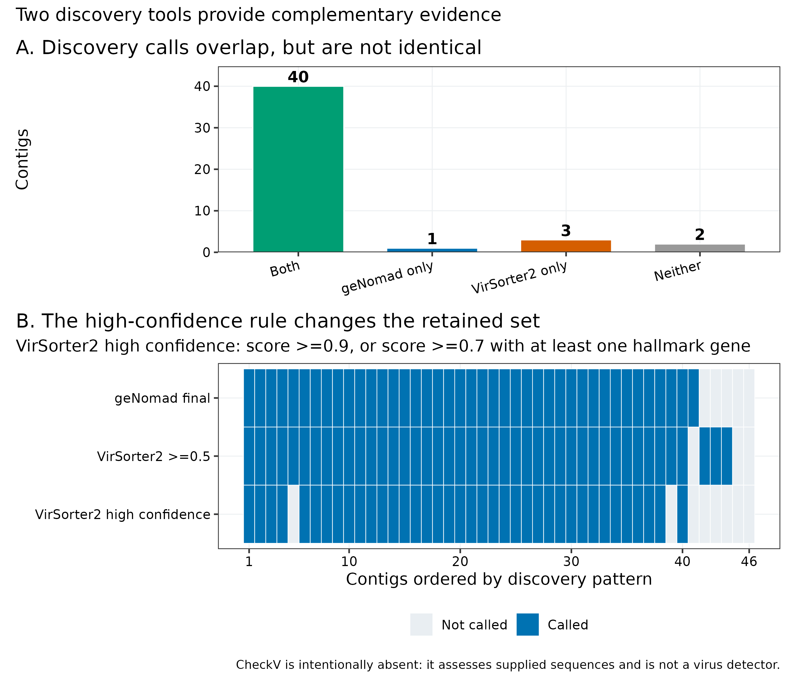
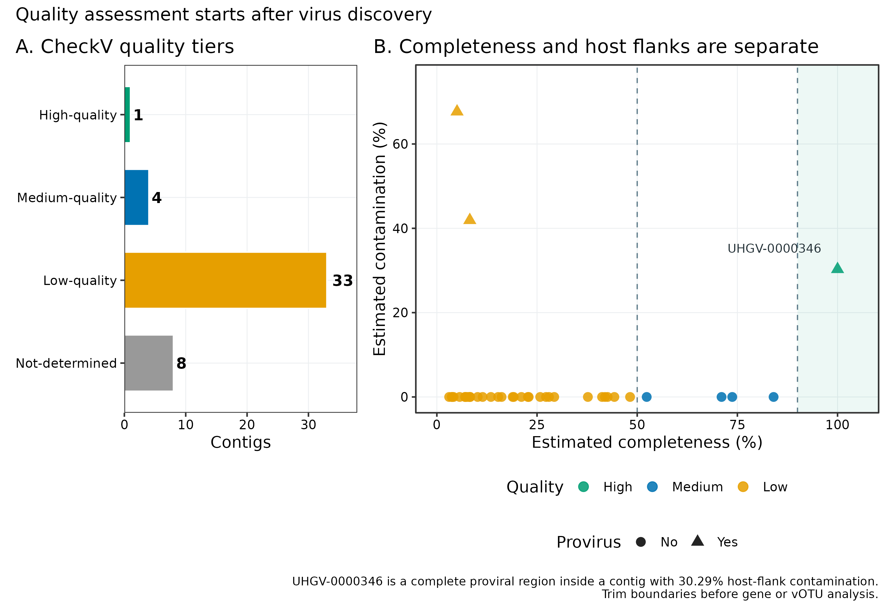
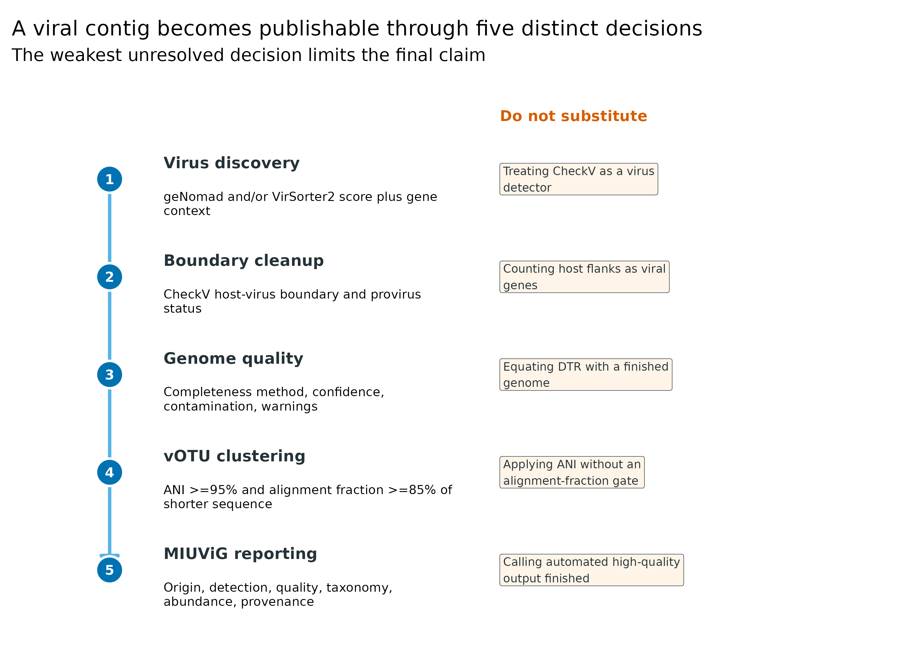
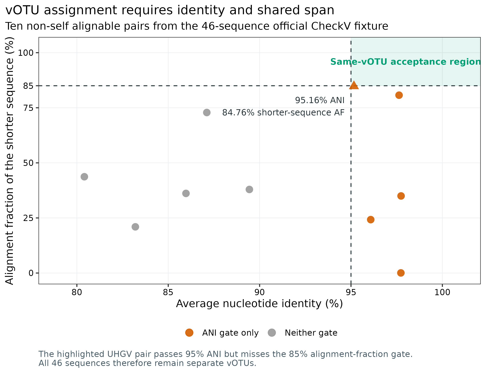
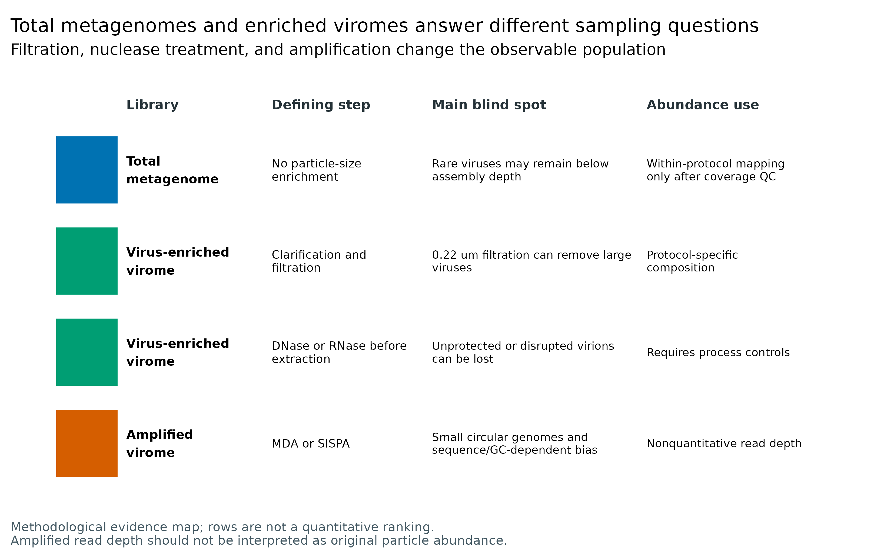

> **先给结论：**病毒发现（virus discovery）、质量评估（quality assessment）和物种级去冗余（vOTU clustering）是三道不同的门。对 CheckV 软件仓库固定的 46 条真实回归序列，geNomad 检出 **41** 条，VirSorter2 默认 `score ≥ 0.5` 检出 **43** 条，二者交集 **40**、并集 **44**；VirSorter2 按官方 high-confidence 规则只保留 **38** 条。CheckV 随后给出 **1 high-quality、4 medium-quality、33 low-quality、8 not-determined**，并识别 **3 条前病毒**。它不能替代病毒发现工具。全长两两比较得到 10 对非自身可比序列，但没有一对同时满足 MIUViG 建议的 **≥95% ANI + 较短序列 ≥85% alignment fraction**；最靠近边界的一对为 **95.16% ANI、84.76% AF**，所以 46 条仍是 46 个 vOTU。实验端同样不能混为一谈：total metagenome 与经过 filtration、nuclease、WGA/MDA/SISPA 的 virus-enriched virome 观察的是不同抽样总体，尤其扩增型 virome 的 read depth 不是原始病毒颗粒丰度。

::: {.callout-important title="算力与数据门槛"}
同一台 Linux 服务器、同一批 46 条序列、16 threads 的 GNU `time -v` 实测：**geNomad 1.12.0：131.88 秒、3.809 GiB 峰值 RAM；CheckV 1.1.1：37.18 秒、1.945 GiB；VirSorter2 2.2.4：881.50 秒、0.366 GiB**。三个清理后结果目录分别约 2.1、10.9、24.0 MB。数据库才是磁盘大头：geNomad v1.9 安装后约 **1.47 GB**，CheckV v1.5 约 **6.83 GB**，VirSorter2 v0.4 核心文件约 **10.52 GB**，另需其 Snakemake 运行环境。真实百万级 contig 项目建议准备 **16--32 CPU cores、64 GB RAM、至少 50 GB 数据库/临时磁盘空间**；耗时取决于 contig 数、总 ORF 数和 HMM 拆分策略。没有服务器时，可从 `data/small/54-virus-discovery-quality-frozen/` 的逐 contig 证据矩阵重画统计图；不要把这个小规模回归集的资源消耗外推成大型队列承诺。
:::

## 这一步对应论文里的哪张图 {#sec-target}

这一流程同时锚定四类论文结果：

- geNomad 的分类评估与 mobile genetic element 工作流，用于回答“这条序列是否具有病毒证据” [@camargo2024genomad]；
- VirSorter2 的多分类器与 score/hallmark 证据，用于给第二条独立发现路径 [@guo2021virsorter2]；
- CheckV 的完整度、前病毒宿主侧边界与 terminal-repeat 检查，用于回答“候选序列质量如何” [@nayfach2021checkv]；
- MIUViG Figure 2、Figure 3 与 Table 2 的 UViG 来源、质量等级和报告清单，以及其 vOTU 物种级阈值 [@roux2019miuvig]。

先看两个发现工具的逐条交叉。VirSorter2 的默认阳性不自动等于 high confidence，geNomad 与 VirSorter2 的分数也不是同一概率标尺。

{#fig-54-discovery}

再看 CheckV。横轴完整度与纵轴宿主侧污染不能压成一个“质量分”；尤其前病毒必须先定边界，再做基因功能和聚类。

{#fig-54-checkv}

## 理论：从“像病毒”到“可报告 UViG”要过五道门 {#sec-theory}

{#fig-54-ladder}

### 1. 发现工具回答“像不像病毒”，不是“有多完整”

geNomad 综合 marker enrichment、基因组成和神经网络分类，并同时区分 chromosome、plasmid 与 virus；VirSorter2 将不同病毒群的基因与 HMM 特征送入专门分类器。二者使用的训练集、特征、score calibration 和后处理不同，所以：

- `geNomad score = 0.95` 与 `VirSorter2 score = 0.95` 不能直接相减或取平均；
- 交集可作为更保守的候选集，并集可作为更敏感的人工审查集；
- “两个工具都阳性”是 evidence convergence，不是无条件真值；
- 单工具阳性不能只因另一个工具阴性就删除，应回看 hallmark genes、cellular genes、长度、基因排列和数据库命中。

VirSorter2 2.2.4 的默认门槛是 `max_score ≥ 0.5`。其 `--high-confidence-only` 等价于：

\[
\text{high confidence}=
I(s\ge 0.9)\;\lor\;I(s\ge 0.7\ \land\ h\ge 1),
\]

其中 $s$ 是最大分类分数，$h$ 是 hallmark gene 数。46 条序列中默认分支保留 43 条，高置信分支保留 38 条；这 5 条差值应显式记录，而不是悄悄换阈值。

### 2. CheckV 假定输入已经是病毒候选

CheckV 解决三个问题：

1. 用病毒参考基因组的 amino-acid identity（AAI）或病毒 HMM 推断 completeness；
2. 比较相邻窗口的 viral/host genes，寻找 integrated provirus 的宿主侧序列；
3. 检查 direct terminal repeat（DTR）、inverted terminal repeat（ITR）和其他闭合信号。

它不会先证明输入一定是病毒。把全部 assembly contigs 丢给 CheckV，再按 `high-quality` 反向定义“病毒”，会把“质量模型有参考命中”偷换成“病毒发现”。正确顺序是发现 → 边界 → 质量。

CheckV 的四级输出与 MIUViG 的三级标签也不能逐字互换：

| CheckV 输出 | 常用解释 | MIUViG 允许的上限 |
|---|---|---|
| `High-quality` | estimated completeness ≥90% 或可信闭合证据 | high-quality draft；仍不自动是 finished |
| `Medium-quality` | 50%--<90% | genome fragment |
| `Low-quality` | <50% | genome fragment |
| `Not-determined` | 无可靠 completeness estimate | genome fragment / 未定；不能当阴性 |

MIUViG 的 **finished genome** 还要求单 contig（分节病毒每个 segment 一条）、广泛人工审查与注释，包括结构、复制/溶原模块和转录单元 [@roux2019miuvig]。自动程序输出 `Complete`、`DTR` 或 `High-quality` 都不能跳过这一步。

### 3. DTR 是闭合线索，不是自动“完整基因组”

重复序列可让不完整 contig 被错误环化。当前回归集里，geNomad 报告 3 个 DTR；CheckV `complete_genomes.tsv` 记录 5 个 DTR 候选，但 **5 个全是 low confidence**，原因都是 repeat 中存在过多 `N`。只有 3 条被两个工具同时标为 DTR。这个结果正好说明：

- topology prediction 与 completeness estimate 是不同字段；
- DTR 要结合 raw-read spanning、覆盖均匀性、重复序列质量、长度与基因模块人工检查；
- “circular contig”描述装配结构；许多生物学上为线性基因组的病毒也可在装配时呈现 terminal redundancy。

### 4. vOTU 必须同时跨过 ANI 和 alignment fraction

MIUViG 建议以 **95% average nucleotide identity（ANI）覆盖较短序列的 85%** 作为病毒物种级 operational taxonomic unit（vOTU）阈值 [@roux2019miuvig]。对序列 $(i,j)$，令 $A_{ij}$ 为去重后的对齐碱基数，$L_s=\min(L_i,L_j)$，则：

\[
AF_{short}=\frac{A_{ij}}{L_s},\qquad
\text{same vOTU}=I(ANI\ge95\%)I(AF_{short}\ge85\%).
\]

只看 ANI 会把“一个高度保守短片段”误当全基因组同种。这里 `UHGV-0001702` 与 `UHGV-0001715` 的 ANI 为 95.16%，但较短序列 AF 只有 84.76%，严格说不能合并。

{#fig-54-votu}

### 5. Total metagenome 与 enriched virome 的分母不同

Total metagenome 通常从完整样本提取核酸，能同时看到细胞内、细胞相关、整合前病毒和部分游离病毒，但低丰度病毒可能达不到组装深度。Virus-enriched virome 通过离心、过滤、核酸酶和/或颗粒富集提高 viral fraction，却主动改变了“谁能被看到”：

- `0.22 µm` filtration 会损失一部分大病毒；filter material 也会影响回收；
- nuclease treatment 偏向保留被完整 capsid 保护的核酸，破损颗粒和游离病毒核酸可能消失；
- MDA 常过度扩增小型环状基因组，并受 GC 与模板量影响；SISPA 也会产生序列依赖的 coverage peaks；
- amplified dataset 的 coverage 不再与原样本粒子数成比例 [@parrasmolto2018viromebias; @conceicaoneto2015netovir; @roux2019miuvig]。

{#fig-54-library}

因此，两类 library 的 raw richness、relative abundance、presence rate 和 assembly recovery 不能直接并表比较。配对 aliquot 设计可以估计 protocol effect，但仍须分层报告，并把 extraction、filter、nuclease、amplification 和 input mass 写入元数据。

## 准备工作 {#sec-preparation}

### 真实公开数据与固定身份

这组数据来自 CheckV 源码仓库的官方 regression fixture，而不是模拟随机序列。它用于检查工具行为与边界条件；由于输入本来就是 CheckV 的病毒候选测试集，**不能**用 41/46 或 43/46 估计自然样本 sensitivity、specificity 或病毒流行率。

| 对象 | 固定身份 | 用途 |
|---|---|---|
| CheckV `test_sequences.fna` | 46 records；910,376 bytes；SHA-256 `4347d1f5f52d4e2b6986845afb8e401fd146bb5a9628768e0ba125ec380144f5` | 三工具共同输入与 vOTU 边界测试 |
| CheckV upstream `quality_summary.tsv` | 5,518 bytes；SHA-256 `f0d692ab02446bca007722b0f97a928b4cc893c94bcd311e151196bb9afa5a76` | CheckV 回归真值 |
| MIUViG JATS XML | 183,966 bytes；SHA-256 `289c221ece18f17a0a8930a354cfc3e01b712751abfdd52ff7b054c6f31c36fa` | 质量、vOTU、实验来源与非定量扩增定义 |

两份 CheckV 文件固定在源码 commit `6a118f20e895105ce0e4f10257955494c60f1293`；MIUViG 全文固定为 PMCID `PMC6871006`。

### 数据库锁

`data/small/54-virus-database-manifest.tsv` 登记了每个下载资产的 URL、压缩字节数和发布方 MD5：

- geNomad database **v1.9 / ICTV MSL39**，archive MD5 `67244b528bb8bed464d1ca147136d33e`；
- CheckV database **v1.5 / 2023-01-10**，archive MD5 `c25ae80bbf7da538bee10cd436530cd9`；
- VirSorter2 database **Zenodo 4269607 v0.4**，包括 core archive、3 个 combined-HMM 分卷和 6 个 Pfam 文件。

CheckV 官方 NERSC 目录在本次获取时持续返回 HTTP 503，因此使用 Zenodo record 15116682 明确标注的 **UNOFFICIAL MIRROR**；archive MD5、解压结构、`database_version=v1.5`、README release date，以及 46 条 regression output 全部通过本地核验。这个 provenance 必须留在 Methods/数据登记中，不能把镜像写成官方发布站。

<strong>安装锁定环境、下载数据库与内联作图函数</strong>

~~~bash
# 数据库与 VirSorter2 runtime 都放在 Git 仓库之外
export DB_MANIFEST="$PWD/data/small/54-virus-database-manifest.tsv"
export DB_ROOT="/srv/metagenome-db/article54"

# 主发现 / CheckV / vOTU 环境
mamba env create -f env/virus-discovery.yml
# 或按 Linux exact lock 重建
conda create --name metagenome-virus-discovery-2026.07 \
  --file env/virus-discovery-linux-64.lock

# VirSorter2 wrapper；其 Snakemake runtime 另有 exact lock
mamba env create -f env/virsorter2.yml
conda create --name metagenome-virsorter2-2026.07 \
  --file env/virsorter2-linux-64.lock
conda create --prefix "$DB_ROOT/databases/virsorter2/conda_envs/328974fc" \
  --file env/virsorter2-runtime-linux-64.lock

db/download_db.sh audit
while IFS=$'\t' read -r database_id _; do
  [[ "$database_id" == "database_id" ]] && continue
  db/download_db.sh download "$database_id"
done < "$DB_MANIFEST"
~~~

VirSorter2 的 `combined.hmm.gz.split_00/01/02` 是同一 gzip stream 的连续字节段，必须按数字顺序拼接后再解压；不能分别 `gunzip`。解压后再核对 manifest notes 中的 final MD5。

~~~bash
VS2_ARCH="$DB_ROOT/archives"
VS2_DB="$DB_ROOT/databases/virsorter2"
mkdir -p "$VS2_DB"

tar -xzf "$VS2_ARCH/virsorter2-db-core/db.tgz" \
  -C "$VS2_DB" --strip-components=1

cat \
  "$VS2_ARCH/virsorter2-combined-hmm-00/combined.hmm.gz.split_00" \
  "$VS2_ARCH/virsorter2-combined-hmm-01/combined.hmm.gz.split_01" \
  "$VS2_ARCH/virsorter2-combined-hmm-02/combined.hmm.gz.split_02" \
  > "$VS2_DB/hmm/viral/combined.hmm.gz"
gzip -df "$VS2_DB/hmm/viral/combined.hmm.gz"
md5sum "$VS2_DB/hmm/viral/combined.hmm"
# expected: 9bb6d4e968aede068aa9fc414496473f

mkdir -p "$VS2_DB/hmm/pfam"
for item in \
  "virsorter2-pfam-archaea:Pfam-A-Archaea.hmm" \
  "virsorter2-pfam-bacteria:Pfam-A-Bacteria.hmm" \
  "virsorter2-pfam-eukaryota:Pfam-A-Eukaryota.hmm" \
  "virsorter2-pfam-mixed:Pfam-A-Mixed.hmm" \
  "virsorter2-pfam-viruses:Pfam-A-Viruses.hmm" \
  "virsorter2-pfam-accessions:Pfam-A-acc2desc.tsv"; do
  archive_id="${item%%:*}"
  output_name="${item#*:}"
  gzip -dc "$VS2_ARCH/$archive_id/$output_name.gz" \
    > "$VS2_DB/hmm/pfam/$output_name"
done

md5sum "$VS2_DB/hmm/pfam/"*
# 4ac89aba0a383b4e12957f260762820c  Pfam-A-Archaea.hmm
# 13a47f8966737d456d27381ad0983cb0  Pfam-A-Bacteria.hmm
# 3675151b16e675a4f979c76e7e6f5d18  Pfam-A-Eukaryota.hmm
# 450e93a2aa29463c8bee9ca5b1c55c79  Pfam-A-Mixed.hmm
# 7c0901ac28b3ba86561d0da06e97ee7b  Pfam-A-Viruses.hmm
# a67245759c1529aee6485825ae5c3912  Pfam-A-acc2desc.tsv
~~~

~~~r
install.packages(c(
  "ggplot2", "dplyr", "readr", "tidyr",
  "scales", "patchwork"
))

library(ggplot2)
library(dplyr)
library(readr)
library(tidyr)
library(scales)
library(patchwork)
set.seed(20260754)

pal_pub <- c(
  "Blue" = "#0072B2", "Orange" = "#D55E00",
  "Green" = "#009E73", "Sky" = "#56B4E9",
  "Yellow" = "#E69F00", "Purple" = "#CC79A7",
  "Gray" = "#999999", "Light" = "#E9EEF2",
  "Dark" = "#253238"
)
scale_color_pub <- function(...) scale_color_manual(values = pal_pub, ...)
scale_fill_pub  <- function(...) scale_fill_manual(values = pal_pub, ...)
theme_pub <- function(base_size = 12) {
  theme_bw(base_size = base_size) + theme(
    panel.grid.minor = element_blank(),
    panel.grid.major = element_line(color = "#ECEFF1", linewidth = 0.3),
    axis.text = element_text(color = "black"),
    legend.key = element_blank(),
    strip.background = element_rect(fill = "#EEF3F5", color = NA),
    plot.title.position = "plot"
  )
}
save_pub <- function(plot, file_base, width = 205, height = 145,
                     units = "mm", dpi = 350) {
  dir.create(dirname(file_base), recursive = TRUE, showWarnings = FALSE)
  ggsave(paste0(file_base, ".pdf"), plot, width = width, height = height,
         units = units, device = cairo_pdf)
  ggsave(paste0(file_base, ".png"), plot, width = width, height = height,
         units = units, dpi = dpi, bg = "white")
  ggsave(paste0(file_base, ".tiff"), plot, width = width, height = height,
         units = units, dpi = dpi, compression = "lzw", bg = "white")
  invisible(plot)
}
~~~

## 可复制代码：发现、边界、质量与 vOTU {#sec-code}

### 第 1 步：下载并校验三份小型公开输入

~~~bash
ROOT="$PWD"
WORK="$ROOT/work/article54"
RESULTS="$ROOT/results/54-virus-discovery-quality"

python3 scripts/prepare_article54_virus_discovery.py \
  --project-root "$ROOT" \
  --work-dir "$WORK"

column -ts $'\t' "$WORK/asset-check-audit.tsv"
cat "$WORK/run-contract.json"
~~~

脚本先验证 byte count 与 SHA-256，再允许 FASTA/XML 进入解析器。输出的 `input-lineage.tsv` 记录“哪个公开文件 → 哪个分析步骤”，防止以后把测试 fixture 误写成自然人群队列。

### 第 2 步：对同一 FASTA 跑两个发现工具与 CheckV

~~~bash
GENOMAD_DB="/srv/metagenome-db/article54/databases/genomad_db"
CHECKV_DB="/srv/metagenome-db/article54/databases/checkv"
VIRSORTER2_DB="/srv/metagenome-db/article54/databases/virsorter2"

python3 scripts/run_article54_virus_discovery.py \
  --project-root "$ROOT" \
  --work-dir "$WORK" \
  --results-dir "$RESULTS" \
  --genomad-db "$GENOMAD_DB" \
  --checkv-db "$CHECKV_DB" \
  --virsorter2-db "$VIRSORTER2_DB" \
  --threads 16
~~~

运行契约等价于下面三条核心命令：

~~~bash
genomad end-to-end \
  --cleanup --restart --threads 16 --splits 8 \
  "$WORK/input/checkv-test-sequences.fna" \
  "$RESULTS/genomad" "$GENOMAD_DB"

virsorter run \
  -w "$RESULTS/virsorter2" \
  -d "$VIRSORTER2_DB" \
  -i "$WORK/input/checkv-test-sequences.fna" \
  --min-length 1500 --keep-original-seq \
  --include-groups dsDNAphage,ssDNA \
  --min-score 0.5 -j 16 all

checkv end_to_end \
  "$WORK/input/checkv-test-sequences.fna" \
  "$RESULTS/checkv" \
  -d "$CHECKV_DB" -t 16 --restart
~~~

这组输入以 DNA viruses 为主，VirSorter2 因而只启用 `dsDNAphage,ssDNA`。RNA virome / metatranscriptome 要在实验端保留 RNA、记录 reverse transcription，并启用相应 classifier；不能把这里的参数无修改套到 RNA 病毒研究。

### 第 3 步：先比较发现集合，再看各自证据列

~~~bash
python3 scripts/summarize_article54_virus_discovery.py \
  --project-root "$ROOT" \
  --work-dir "$WORK" \
  --results-dir "$RESULTS"

column -ts $'\t' "$WORK/summary/discovery-overlap.tsv"
column -ts $'\t' "$WORK/summary/virus-evidence-matrix.tsv" | head
~~~

固定输出为：

| Pattern | Contigs |
|---|---:|
| Both | 40 |
| geNomad only | 1 |
| VirSorter2 only | 3 |
| Neither | 2 |

geNomad-only 序列是 `2013338001_____MeugFOFF_C1475`；VirSorter2-only 有 3 条。`Neither` 的两条也不能标成“已证伪非病毒”，因为此 fixture 没有独立 gold-standard label，且两个模型共享病毒数据库知识。

### 第 4 步：用 upstream fixture 检查 CheckV 是否精确复现

~~~bash
diff -u \
  "$WORK/input/checkv-upstream-ground-truth-quality-summary.tsv" \
  "$RESULTS/checkv/quality_summary.tsv"

column -ts $'\t' "$WORK/summary/checkv-quality-counts.tsv"
column -ts $'\t' "$WORK/summary/terminal-repeat-audit.tsv"
~~~

`diff` 无输出，两个文件逐字节一致。质量计数为 1/4/33/8；3 条 `provirus=Yes`。`UHGV-0000346` 的病毒区长度为 4,899 bp、completeness 100%，但原 contig 长 7,028 bp、host-flank contamination 30.29%。生产分析应使用 CheckV 切出的 viral region，而不是把 2,129 bp 宿主侧序列带入 AMGs、蛋白家族或 vOTU。

### 第 5 步：用 all-vs-all BLASTN 计算 ANI 与严格 vOTU

~~~bash
mkdir -p "$RESULTS/votu"

makeblastdb \
  -in "$WORK/input/checkv-test-sequences.fna" \
  -dbtype nucl \
  -out "$RESULTS/votu/checkv-test"

blastn \
  -query "$WORK/input/checkv-test-sequences.fna" \
  -db "$RESULTS/votu/checkv-test" \
  -out "$RESULTS/votu/all-vs-all-blast.tsv" \
  -outfmt '6 std qlen slen' \
  -max_target_seqs 10000 \
  -num_threads 16

anicalc \
  -i "$RESULTS/votu/all-vs-all-blast.tsv" \
  -o "$RESULTS/votu/ani.tsv"

aniclust \
  --fna "$WORK/input/checkv-test-sequences.fna" \
  --ani "$RESULTS/votu/ani.tsv" \
  --out "$RESULTS/votu/votu-clusters.tsv" \
  --min_ani 95 \
  --min_tcov 85
~~~

这里故意在原始 46 条 fixture sequences 上展示阈值边界；生产数据应先用 CheckV 切除前病毒宿主侧序列，再对 cleaned viral sequences 聚类。`--min_tcov 85` 在 `aniclust` 中对应较短序列 coverage gate；汇总表同时保留 ANI、shorter-sequence AF 和两个独立 pass flags。

### 第 6 步：固化证据、导出图并执行门禁

~~~bash
Rscript scripts/plot_article54_virus_discovery.R \
  "$WORK/summary" figures

python3 scripts/freeze_article54_virus_discovery.py \
  --project-root "$ROOT" \
  --work-dir "$WORK" \
  --output-dir data/small/54-virus-discovery-quality-frozen

python3 scripts/validate_article54_virus_discovery.py \
  --project-root "$ROOT" \
  --frozen-dir data/small/54-virus-discovery-quality-frozen \
  --output-dir results/54-virus-discovery-quality/validation \
  --figure-dir figures \
  --chapter chapters/54-virus-discovery-quality.qmd
~~~

## 审计与升级：哪些结果能信到哪一层 {#sec-audit}

### 1. 这不是 detector benchmark 的 sensitivity/specificity

46 条输入来自 CheckV 的质量回归测试，不含设计好的 cellular/plasmid negatives，也没有 blind truth labels。因此能审计的是“两个当前版本对同一输入如何分歧”，不能声称 geNomad 灵敏度 89.1% 或 VirSorter2 灵敏度 93.5%。正式 benchmark 需要保留 taxonomically held-out viruses、近缘 plasmids/cellular regions、长度分层和 train/test 去泄漏设计。

### 2. VirSorter2 v0.4 数据库可复现，但已老

VirSorter2 2.2.4 的官方 v0.4 database 发布于 2020 年，适合复现其 classifier 行为，不适合把 `group` 列当 2026 年可靠 taxonomy；工具日志也明确提醒 `group` 不应作为可信分类。当前 taxonomy 应另用锁版本的 geNomad/ICTV 或专门病毒分类流程，并把数据库日期写进表头。旧数据库结果与新数据库结果应作为 sensitivity analysis，而不是覆盖旧文件。

### 3. CheckV 的 `Not-determined` 不是低质量同义词

8 条 not-determined 表示模型不能给可靠 completeness；其中可能有高度新颖的病毒，也可能有非病毒候选。把它们全部删除会产生 reference bias。至少保留长度、viral/host genes、hallmarks、coverage、发现工具共识与 warning，必要时单列“quality unresolved”。

### 4. 前病毒边界必须早于功能注释

若宿主 flank 保留到后面，宿主代谢基因会被错写成 auxiliary metabolic genes（AMGs），contig length 与 coverage 也会被污染。这里 `UHGV-0000346` 直接展示了“病毒区完整但母 contig 污染高”的组合；一个总 quality label 无法表达它。

### 5. Threshold sensitivity 要围绕两个轴展开

对 95% ANI 附近的 pair，只做 `94/95/96% ANI` 敏感性还不够；应同时报告 AF 的 `80/85/90%`。`UHGV-0001702`/`UHGV-0001715` 在 85% AF 处只差 0.24 percentage point，适合人工检查 alignment fragmentation、低复杂区、N-rich regions 与 assembler breakpoints。

### 6. Library protocol 不是可以事后完全校正的 batch

Total metagenome 与 VLP virome 的差异包含 biological capture mechanism，不只是测序中心批次。把 `library_type` 放入线性模型不能恢复过滤掉的大病毒，也不能反推出 MDA 前的 particle counts。最稳方案是同一样本配对 aliquots、process blanks、mock virome、spike-ins 和 protocol-stratified primary analysis；跨 protocol 的丰度效应只能作受限探索。

::: {.callout-caution title="审稿人最常追问的五个证据缺口"}
1. 只报“用了 VirSorter2/CheckV”，未给 score、hallmark、长度、数据库 release 与筛选规则；
2. 把 CheckV 当 detector，或把 `Not-determined` 当非病毒；
3. 把 DTR/circular 自动写成 complete/finished，却没有 raw-read spanning 和人工注释；
4. vOTU 只报 95% ANI，没有写 alignment fraction 是相对较短序列还是较长序列；
5. 合并 total metagenome 与 amplified virome 的 relative abundance，却未记录 filtration、nuclease、amplification 和 input mass。
:::

## 出版级美化 {#sec-publication}

五张图分别服务五个问题，不把全部字段塞进一张“总览”：

- discovery overlap 用同一 contig coordinate 展示两个 detector 和 VirSorter2 high-confidence 收缩；
- quality plot 把 completeness 与 host-flank contamination 分成两个轴；
- vOTU 图把 95% ANI 与 85% AF 画成二维 acceptance region；
- evidence ladder 约束发现、边界、质量、聚类与 MIUViG 的措辞；
- library map 明确它是 methodological evidence map，不伪装成定量效应图。

颜色采用色觉友好的 Okabe--Ito 系列；图内全部英文。每张图同时导出 PDF、350 dpi PNG 和 LZW TIFF。正文图注写清分母是 **46 regression sequences** 或 **10 non-self alignable pairs**，避免读者误以为条形高度来自自然队列。

~~~r
evidence <- readr::read_tsv(
  "data/small/54-virus-discovery-quality-frozen/virus-evidence-matrix.tsv",
  show_col_types = FALSE
)
votu_pairs <- readr::read_tsv(
  "data/small/54-virus-discovery-quality-frozen/votu-pairwise-threshold-audit.tsv",
  show_col_types = FALSE
)

stopifnot(nrow(evidence) == 46)
stopifnot(nrow(votu_pairs) == 10)
stopifnot(sum(votu_pairs$SameVOTU) == 0)
~~~

## 常见坑 {#sec-pitfalls}

::: {.callout-warning title="坑 1：把并集叫真值、把交集叫完整集"}
并集偏向 sensitivity，交集偏向 specificity，但方向不等于可量化性能。没有独立 negatives、held-out viruses 和 truth labels 时，只能写“consensus candidate”或“supported by both tools”。
:::

::: {.callout-warning title="坑 2：先 vOTU，后切前病毒"}
宿主 flank 会降低 ANI/AF、制造虚假的 singleton vOTU，并污染功能。先固定 viral boundaries，再聚类、建库和回帖 reads。
:::

::: {.callout-warning title="坑 3：把 medium-quality 写成 MIUViG 中等质量"}
MIUViG 质量类别不是 CheckV 四级标签的同名复制。当前 CheckV medium-quality 仍映射为 MIUViG genome fragment；表中应同时保留 `checkv_quality` 与 `miuvig_quality`。
:::

::: {.callout-warning title="坑 4：把 DTR 中的 N 当可靠 terminal repeat"}
本次 5 个 CheckV DTR 候选全部因 repeat 中 `N` 过多被标为 low confidence。只 grep `prediction_type=DTR` 会把软件 warning 丢掉。
:::

::: {.callout-warning title="坑 5：直接比较 total metagenome 与 WGA virome"}
WGA/MDA/SISPA 后的 coverage 是技术放大结果。可比较的是按相同 protocol 处理、通过 controls 的样本；跨 protocol 的原始 read count、RPM 或 relative abundance 没有共同分母。
:::

::: {.callout-tip title="诊断顺序"}
遇到异常候选时依次检查：原 contig 与 cleaned viral region 是否混用 → 两个 detector 的 score/hallmark/cellular genes → CheckV completeness method 与 confidence → provirus/DTR warning → raw-read coverage 与 spanning → ANI 和 shorter-sequence AF。这样能定位是哪一道门失败，而不是反复调一个总分阈值。
:::

## 这段 Methods 怎么写 {#sec-methods}

### Discovery、quality 与 vOTU 的英文模板

> Viral sequences were identified from assembled contigs (minimum length, 1,500 bp) using geNomad v1.12.0 with database v1.9 (ICTV MSL39) and VirSorter2 v2.2.4 with database v0.4. VirSorter2 was run for the dsDNAphage and ssDNA groups at a minimum score of 0.5; high-confidence calls were defined as a maximum score ≥0.9 or a score ≥0.7 with at least one hallmark gene. Candidate viral sequences were assessed with CheckV v1.1.1 and database v1.5. Proviral host flanks were removed before gene-content analysis and sequence clustering. Cleaned viral sequences were compared by all-versus-all BLASTN v2.17.0, and vOTUs were formed with CheckV `anicalc`/`aniclust` at ≥95% ANI across ≥85% of the shorter sequence. Genome origin, detection evidence, quality, completeness method, contamination, topology warnings, taxonomy, and abundance provenance were reported following MIUViG recommendations.

### Results template（当前固定结果）

> Among 46 sequences in the CheckV regression fixture, geNomad and VirSorter2 identified 41 and 43 viral candidates, respectively; 40 were supported by both tools and 44 by at least one tool. Thirty-eight VirSorter2 calls met its high-confidence rule. CheckV classified one sequence as high quality, four as medium quality, 33 as low quality, and eight as not determined, and identified three proviral contigs. Five direct-terminal-repeat candidates were low confidence because their repeats contained excessive ambiguous bases. Ten non-self sequence pairs yielded reportable nucleotide alignments, but none passed both vOTU gates. The closest boundary case showed 95.16% ANI across 84.76% of the shorter sequence and was therefore retained as two vOTUs.

若研究使用 amplified virome，Methods 还必须增加一句：

> Read depth from amplified virome libraries was treated as nonquantitative and was not directly compared with relative abundance from unamplified total-metagenome libraries.

工具版本不够；Methods 或 supplement 还应列出 database release、archive checksum、contig length gate、score gate、hallmark rule、前病毒是否切边界、ANI/AF 相对哪个序列，以及 DTR 的人工复核方法。

## 换成你自己的数据怎么做 {#sec-own-data}

### 最少需要四类输入

1. `contigs.fna`：每样本或 co-assembly contigs；header 唯一且不能含会被下游截断的空格；
2. `samples.tsv`：至少含 `sample_id`、`subject_id`、`library_type`、`extraction_batch`、`sequencing_run`；
3. `wetlab_protocol.tsv`：记录 filter pore/material、centrifugation、nuclease、VLP enrichment、WGA/MDA/SISPA、input mass 与 cycle/time；
4. raw-read alignment：用于 coverage、breadth、contig ends、DTR/ITR、污染与跨样本 abundance 审计。

### 建议主流程

~~~text
assembled contigs
  -> geNomad + VirSorter2 candidate ledger
  -> score / hallmark / cellular-gene review
  -> CheckV boundary trimming and quality
  -> raw-read coverage and terminal-repeat review
  -> cleaned viral FASTA
  -> 95% ANI + 85% shorter-sequence AF vOTUs
  -> representative catalog
  -> competitive read mapping and abundance filters
  -> protocol-stratified statistics and MIUViG table
~~~

每个候选保留一行 ledger，不要只留下最终 FASTA。建议字段至少包括 `original_contig_id`、`cleaned_viral_id`、两个 detector scores、hallmarks、viral/cellular genes、provirus coordinates、CheckV quality、completeness method/confidence、contamination、topology/warning、vOTU representative、library type、数据库 release 和软件 commit。

### Total metagenome 与 virome 的统计策略

- 同 protocol 的样本：用统一代表序列库 competitive mapping，预注册 identity、breadth、minimum covered bases 和 multi-mapping 规则；
- 配对 aliquots：在同一样本内估计 protocol-associated recovery，但分别展示两类 library 的 richness 与 abundance；
- 非配对 protocol：primary analysis 分层，跨层只做 presence/absence 或经过 controls 支持的有限比较；
- amplified virome：不把 read depth 当 particle abundance；若研究目标必须定量，加入已知浓度 spike-ins、未扩增对照和 ddPCR/qPCR 校准。

无法获得 wet-lab protocol 时，不能把缺失字段默认成“未过滤/未扩增”。把 protocol 标为 `unknown`，做敏感性分析，并在结论中降低丰度比较的证据等级。

## 参考 {#sec-references}

- geNomad 原理与评估：@camargo2024genomad；软件版本：@genomad2026software。
- VirSorter2 多分类器：@guo2021virsorter2；软件版本：@virsorter22026software。
- CheckV 完整度、宿主边界与质量：@nayfach2021checkv；软件版本：@checkv2026software。
- MIUViG 质量类别、vOTU 与报告清单：@roux2019miuvig。
- Virome filtration、nuclease 与 amplification 偏倚：@parrasmolto2018viromebias；@conceicaoneto2015netovir。
