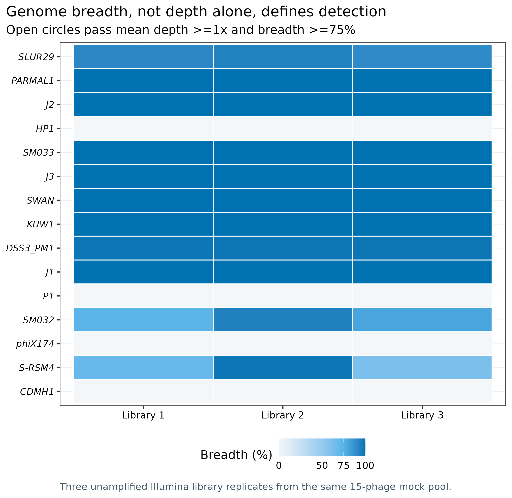
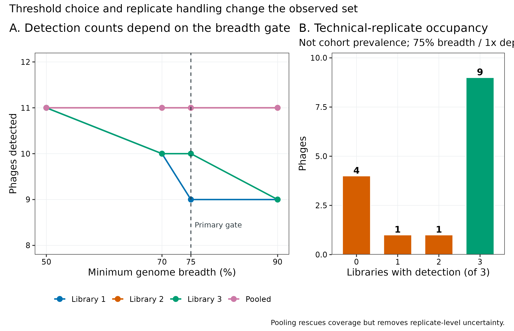
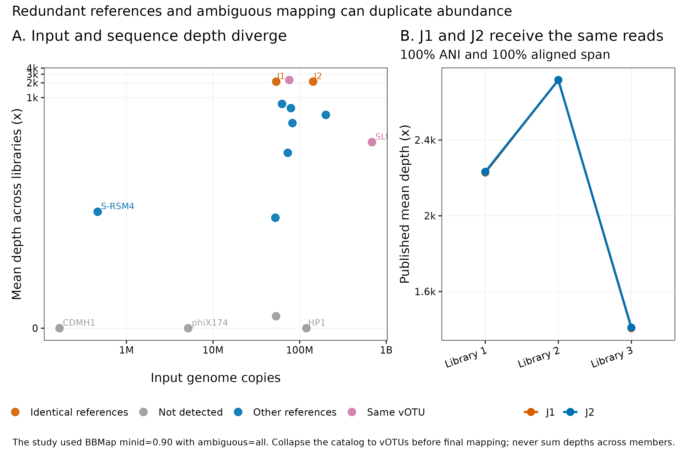
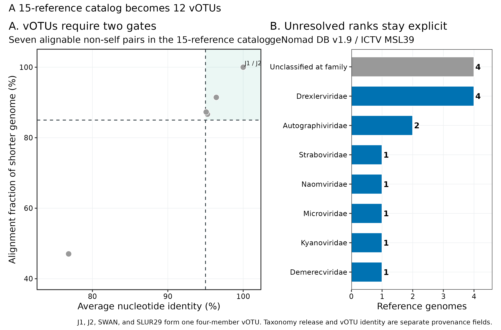
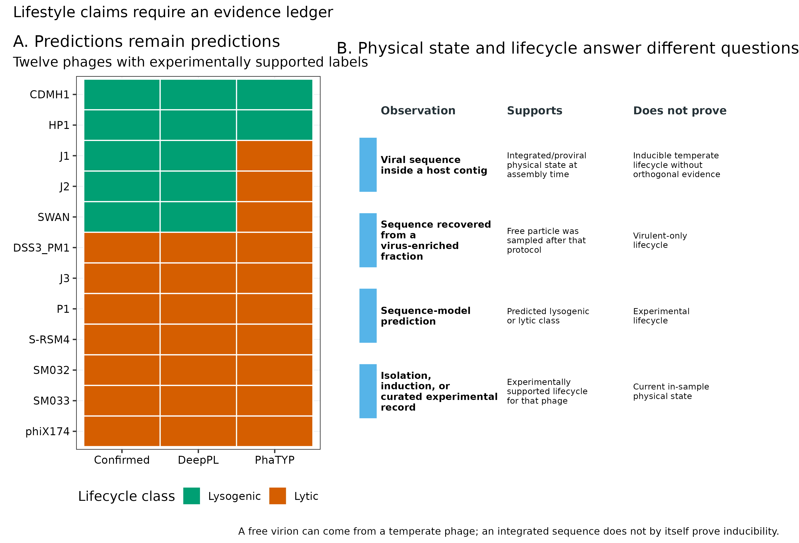

> **先给结论：**病毒“检出”至少要同时限定 read mapping identity、genome breadth 和 depth；病毒“丰度”还必须先固定非冗余 vOTU 目录与 multi-mapping 规则。Cook 等构建的 15 噬菌体真实 mock virome 中，三次未扩增 Illumina 建库在 **mean depth ≥1× 且 breadth ≥75%** 时分别检出 **9、11、10** 个，合并 reads 后检出 **11** 个；9 个在三次都检出，4 个始终未检出。15 条当前参考序列经 **95% ANI + 85% alignment fraction** 聚成 **12 个 vOTU**，其中 J1、J2、SWAN 与 SLUR29 属于同一四成员 vOTU；J1/J2 更是全长 100% 相同。若在冗余目录上使用 `ambiguous=all`，逐参考 depth 没有可辨识的生物学归属，绝不能把成员 depth 相加。Taxonomy、lifestyle 与 physical state 也是三张不同的表：family 未分类不等于“非病毒”，模型预测的 lytic/lysogenic 不等于实验确认，游离病毒颗粒也不等于 virulent-only lifecycle。

::: {.callout-important title="算力与数据门槛"}
只读取固化的 Supplementary Table S4 并重画 5 组图，**4 CPU、4 GB RAM、100 MB 可用磁盘、约 1 分钟**足够。重新下载三次 Illumina paired-end libraries 需要 **1.94 GiB 压缩 FASTQ**；建议预留 **8 CPU、8 GB RAM、15--20 GB 临时磁盘、约 1--2 小时**完成下载、校验、BBMap 与 BAM 汇总。15 条参考序列的 geNomad v1.12.0 实测为 **145.36 秒、2.654 GiB 峰值 RAM、16 threads**；geNomad DB v1.9 约 **1.4 GB**。BBMap v38.69 的实现烟雾测试使用 `-Xmx2g`，实测 **29.29 秒、1.395 GiB**。大型队列应按总 reads 与 vOTU 目录规模预留 32--64 GB RAM 和充足 BAM 空间；没有服务器时，从 `data/small/55-virus-taxonomy-abundance-frozen/` 的逐噬菌体 breadth/depth 表开始统计，不必下载 FASTQ。
:::

## 这一步对应论文里的哪张图 {#sec-target}

主要锚定 Cook 等 2024 年 mock-virome benchmark 的三类结果 [@cook2024viromicsbenchmark]：

- **Figure 1a**：每条噬菌体在三种测序平台、三次建库中的 genome breadth；
- **Figure 1b**：以 `≥1× depth over ≥75% genome length` 定义检出，并比较单次建库与 pooled library；
- **Figure 2d**：输入 genome copies 与观测 depth 的关系；
- **Supplementary Table S4**：逐 library、逐参考 genome 的 breadth 与 mean depth，是这里的数值权威源。

为了把“跨样本共享”讲清楚，主分析只用没有 MDA 的三次 Illumina 建库；它们来自**同一个 mock pool**，所以只能评估技术重复 occupancy，不能当三名受试者或三个生态样本。

{#fig-55-breadth}

Figure 1 的核心不是“哪个平台柱子最高”，而是同一条参考序列有两个不同覆盖统计量：mean depth 很高仍可能只堆在局部，只有 breadth 说明多少基因组位置真正被 reads 覆盖。

{#fig-55-sensitivity}

## 理论：从病毒目录到可比较丰度要过六道门 {#sec-theory}

### 1. 先定义计量单位：sequence、vOTU 还是 taxon

病毒组学至少有三种常见行单位：

1. **viral sequence/contig**：装配得到的一条序列；可能只是片段，也可能与另一条 contig 同种；
2. **vOTU**：按预注册 ANI 与 alignment-fraction 阈值合并后的操作性物种单位；
3. **taxon**：按固定 ICTV release 赋到 realm、phylum、class、order、family 或更低层级的分类单元。

三者不能互换。两个 sequences 可以属于同一 vOTU，却因数据库证据不足只能分类到 class；两个不同 vOTU 也可以同属一个 family。丰度矩阵必须把行 ID 写成 `votu_id`，另设 `representative_sequence`、`member_sequences` 和 `taxonomy_release`，不要让一个模糊的 `virus` 列承担全部含义。

### 2. Identity、breadth 与 depth 是三个门

令病毒参考长度为 (L)，位置 (i) 的覆盖深度为 (d_i)，进入计数的 reads 已通过最小 alignment identity (q)。则：

\[
B_{1\times}=\frac{1}{L}\sum_{i=1}^{L}I(d_i\ge1),\qquad
\bar d=\frac{1}{L}\sum_{i=1}^{L}d_i.
\]

- **identity gate** 防止远缘序列因局部相似而错误进入；
- **breadth** (B_{1\times}) 防止 reads 只堆在保守基因或低复杂区；
- **mean depth** (\bar d) 防止把零星单碱基覆盖叫稳定检出。

本数据忠实采用论文的 `minimum identity = 90%`，再以 (\bar d\ge1\) 且 (B_{1\times}\ge75\%\) 定义 presence。`samtools coverage` 的 `coverage` 是 depth ≥1 的位置比例，`meandepth` 才是平均深度 [@li2009samtools]；两列不能拿错。

### 3. Presence gate 必须预注册，不能看图后挑

同一批数据把 breadth 从 50% 改到 75%，Library 1 的阳性从 11 个降到 9 个；Library 2 不变，Library 3 从 11 个降到 10 个。阈值改变的是生物学集合，而不只是图形外观。

| Dataset | 50% breadth | 70% breadth | 75% breadth | 90% breadth |
|---|---:|---:|---:|---:|
| Illumina library 1 | 11 | 10 | 9 | 9 |
| Illumina library 2 | 11 | 11 | 11 | 11 |
| Illumina library 3 | 11 | 10 | 10 | 9 |
| Pooled Illumina | 11 | 11 | 11 | 11 |

所有格子同时要求 mean depth ≥1×。主阈值写入 `run-contract.json`，其他阈值只作 sensitivity analysis；不能为每个样本单独挑一个最有利门槛。

### 4. vOTU 去冗余必须早于最终定量

MIUViG 建议用 ≥95% ANI、覆盖较短序列 ≥85% 定义近似物种级 vOTU [@roux2019miuvig]。本次 15 条当前 accession 并非 15 个独立计量单位：

- J1 与 J2 是 **100% ANI、100% shorter-genome alignment fraction**；
- SWAN 与 J1/J2 为约 95.06--95.09% ANI、约 87% AF；
- SLUR29 与 SWAN 为 96.43% ANI、91.44% AF；
- `aniclust` 因而把 J1、J2、SWAN、SLUR29 聚成同一 vOTU，目录由 15 条降为 12 个 vOTU。

当 reads 对多个参考同样好时，真实来源不可由这些 reads 单独辨识。`ambiguous=all` 会让一个 read 对多个成员贡献信号；`ambiguous=random` 又引入随机分配；只保留一个任意 primary alignment 则把目录顺序变成结果。最稳的主路径是：**先去冗余成 vOTU representative catalog，再做 competitive mapping**；剩余跨 vOTU ambiguous reads 用 `toss` 作保守主分析，并把 `all` 或其他分配法作为敏感性支路。

{#fig-55-multimap}

### 5. Taxonomy 是带版本的注释，不是永久真名

geNomad 用 marker-gene consensus 给出层级 taxonomy [@camargo2024genomad]。在 geNomad DB v1.9 / ICTV MSL39 下，15 条参考均被判为病毒，但 **4 条在 family rank 未分类**；这表示证据只支持到更高层级，不表示序列质量差或不是病毒。表里要保留完整 lineage、最后可靠 rank、agreement score、数据库 release 和运行日期。将来 ICTV 改名或拆分 taxon 时，应新建 taxonomy version 列，不能覆盖旧分析。

{#fig-55-taxonomy}

### 6. Temperate/virulent 与 prophage/free virus 是两条轴

**Lifestyle** 描述复制策略能力：temperate phage 可进入溶原状态，也可诱导后裂解；virulent phage 不建立稳定溶原。**Physical state** 描述采样时看到了什么：host contig 中的 integrated provirus，或病毒富集部分中的 free particle。两者不能一一对应：temperate phage 被诱导后同样会以游离颗粒出现。

DeepPL 论文 Table 3 为其中 12 条给出实验支持的标签，并比较 DeepPL 与 PhaTYP prediction [@zhang2024deeppl]。当前小集合中，DeepPL 对 12/12 与确认标签一致，PhaTYP 为 9/12；J1、J2 与 SWAN 是已知 temperate，但 PhaTYP 预测 lytic。PARMAL1 与 KUW1 的确认标签为 unknown，SLUR29 未在该表报告；它们的模型输出必须继续写作 **predicted**，不能拿预测填补真值。

{#fig-55-lifestyle}

## 准备工作 {#sec-preparation}

### 真实公开数据与身份锁

数据来自 Cook 等的 15 噬菌体 mock virome（BioProject `PRJEB56639`）及其 supplement [@cook2024viromicsbenchmark]。三次 Illumina MiSeq paired-end library 是对同一 pool 的独立建库，没有 MDA：

| Run | Read pairs | Sequenced bases | Compressed FASTQ bytes |
|---|---:|---:|---:|
| ERR10359653 | 668,776 | 791,188,037 | 674,630,723 |
| ERR10359656 | 929,673 | 1,089,598,698 | 936,070,546 |
| ERR10359658 | 463,563 | 540,787,645 | 467,159,492 |
| **Total** | **2,062,012** | **2,421,574,380** | **2,077,860,761** |

主统计读取论文公开的 Supplementary Table S4；FASTQ 只用于完整重映射。所有核心来源均先核对 bytes 与 SHA-256：

| Asset | Bytes | SHA-256 | Role |
|---|---:|---|---|
| `PMC10926689.xml` | 140,775 | `74d28ef0c7d21a14eaf80a8f517f5f9eadf5385f586b8f20cf280535491d4c4e` | paper methods and assertions |
| `mgen-10-1198-s002.xlsx` | 376,869 | `4f7b44c6c276a6b2b60142543c5f2515917370ddac340a40bd85b37f13475642` | input, breadth, depth, libraries |
| `ena-prjeb56639-filereport.tsv` | 3,158 | `c56c6b024f43dccbb56b22b8aeccdd7b3345a00081b7b19afce713b099eeb096` | FASTQ URL, bytes and publisher MD5 |
| `PMC11521287.xml` | 157,363 | `a28b8f2478ace607d497eb61f23e5c097107e30810d2ee077473cfd36b6f44eb` | lifecycle labels and predictions |

15 条参考 FASTA 的 accession、下载 URL、bytes 和 SHA-256 记录在 `data/small/55-phage-reference-manifest.tsv`。其中 14 条当前长度与论文 Table S1 一致；`NC_054895.1`（SLUR29）当前为 48,466 bp，比论文记录的 48,593 bp 少 127 bp。因此 accession 号不够，必须同时锁 FASTA checksum。

<strong>安装环境、下载数据与内联作图函数</strong>

~~~bash
# 论文映射口径：BBMap 38.69；coverage 复核：SAMtools 1.24
mamba env create -f env/virus-abundance.yml
# Linux exact lock
conda create --name metagenome-virus-abundance-2026.07 \
  --file env/virus-abundance-linux-64.lock

# taxonomy 与 vOTU 工具
mamba env create -f env/virus-discovery.yml
conda create --name metagenome-virus-discovery-2026.07 \
  --file env/virus-discovery-linux-64.lock

# 小型论文资产与 15 条参考序列
python3 scripts/prepare_article55_virus_abundance.py \
  --project-root "$PWD" \
  --work-dir work/article55

# 可选：完整下载 3 个 Illumina runs，1.94 GiB compressed
DOWNLOAD_ARTICLE55_ILLUMINA=1 bash data/download.sh
~~~

~~~r
install.packages(c(
  "ggplot2", "dplyr", "readr", "tidyr",
  "scales", "patchwork"
))

library(ggplot2)
library(dplyr)
library(readr)
library(tidyr)
library(scales)
library(patchwork)
set.seed(20260755)

pal_pub <- c(
  "Blue" = "#0072B2", "Orange" = "#D55E00",
  "Green" = "#009E73", "Sky" = "#56B4E9",
  "Yellow" = "#E69F00", "Purple" = "#CC79A7",
  "Gray" = "#999999", "Light" = "#E9EEF2",
  "Dark" = "#253238"
)
scale_color_pub <- function(...) scale_color_manual(values = pal_pub, ...)
scale_fill_pub  <- function(...) scale_fill_manual(values = pal_pub, ...)
theme_pub <- function(base_size = 12) {
  theme_bw(base_size = base_size) + theme(
    panel.grid.minor = element_blank(),
    panel.grid.major = element_line(color = "#ECEFF1", linewidth = 0.3),
    axis.text = element_text(color = "black"),
    legend.key = element_blank(),
    strip.background = element_rect(fill = "#EEF3F5", color = NA),
    plot.title.position = "plot",
    plot.caption = element_text(color = "#455A64", hjust = 0)
  )
}
save_pub <- function(plot, file_base, width = 205, height = 145,
                     units = "mm", dpi = 350) {
  dir.create(dirname(file_base), recursive = TRUE, showWarnings = FALSE)
  ggsave(paste0(file_base, ".pdf"), plot, width = width, height = height,
         units = units, device = cairo_pdf)
  ggsave(paste0(file_base, ".png"), plot, width = width, height = height,
         units = units, dpi = dpi, bg = "white")
  ggsave(paste0(file_base, ".tiff"), plot, width = width, height = height,
         units = units, dpi = dpi, compression = "lzw", bg = "white")
  invisible(plot)
}
~~~

## 可复制代码：从 15 条参考到 12 个 vOTU 的丰度表 {#sec-code}

### 第 1 步：解析 supplement，校验来源与 accession

~~~bash
ROOT="$PWD"
WORK="$ROOT/work/article55"
RESULTS="$ROOT/results/55-virus-taxonomy-abundance"

python3 scripts/prepare_article55_virus_abundance.py \
  --project-root "$ROOT" \
  --work-dir "$WORK"

column -ts $'\t' "$WORK/asset-check-audit.tsv"
column -ts $'\t' "$WORK/reference-audit.tsv"
column -ts $'\t' "$WORK/illumina-library-metadata.tsv"
cat "$WORK/run-contract.json"
~~~

脚本从 workbook 的 S1、S3、S4 sheets 构造 15 条 phage metadata、3 条 library metadata 和 180 行 platform/library/genome coverage-depth ledger；其中 60 行为 Illumina，45 行来自三次单独建库，15 行来自 pooled reads。`head` 应呈现明确的 `Dataset`、`Library`、`Platform`、`PhageID`、`BreadthPct`、`MeanDepthX` 与 input-copy 字段。

~~~text
Dataset        Library  Platform  PhageID  BreadthPct  MeanDepthX
lib1_illumina  1        Illumina  CDMH1    0           0
lib2_illumina  2        Illumina  CDMH1    0           0
lib3_illumina  3        Illumina  CDMH1    0           0
pooled_illumina pool     Illumina  CDMH1    0           0
lib1_illumina  1        Illumina  DSS3_PM1 98.5509     708.746
~~~

### 第 2 步：先确认病毒、加 taxonomy，再聚成 vOTU

~~~bash
GENOMAD_DB="$ROOT/db/virus-discovery-cache/databases/genomad_db"

python3 scripts/run_article55_virus_abundance.py \
  --project-root "$ROOT" \
  --work-dir "$WORK" \
  --results-dir "$RESULTS" \
  --genomad-db "$GENOMAD_DB" \
  --threads 16
~~~

核心命令为：

~~~bash
genomad end-to-end \
  --cleanup --restart --threads 16 --splits 16 \
  "$WORK/input/cook15-phage-reference.fna" \
  "$RESULTS/genomad" \
  "$GENOMAD_DB"

mkdir -p "$RESULTS/votu"
makeblastdb \
  -in "$WORK/input/cook15-phage-reference.fna" \
  -dbtype nucl \
  -out "$RESULTS/votu/cook15"

blastn \
  -query "$WORK/input/cook15-phage-reference.fna" \
  -db "$RESULTS/votu/cook15" \
  -out "$RESULTS/votu/all-vs-all-blast.tsv" \
  -outfmt '6 std qlen slen' \
  -max_target_seqs 10000 \
  -num_threads 16

anicalc \
  -i "$RESULTS/votu/all-vs-all-blast.tsv" \
  -o "$RESULTS/votu/ani.tsv"

aniclust \
  --fna "$WORK/input/cook15-phage-reference.fna" \
  --ani "$RESULTS/votu/ani.tsv" \
  --out "$RESULTS/votu/votu-clusters.tsv" \
  --min_ani 95 \
  --min_tcov 85
~~~

实际 `votu-clusters.tsv` 有 12 行；唯一多成员行是：

~~~text
vB_EcoS_swan01|LT841304.1    vB_EcoS_swan01|LT841304.1,vB_Eco_mar002J2|LR027385.1,vB_Eco_mar001J1|LR027388.1,vB_Eco_SLUR29|NC_054895.1
~~~

生产数据还要在此之前完成病毒发现、CheckV 质量和前病毒宿主侧边界切除。若把 host flank 留在序列中，ANI/AF 与 abundance denominator 都会被污染。

### 第 3 步：忠实复现论文的 reference-level mapping

Cook 等使用 BBMap v38.69、`minid=0.90`、`ambiguous=all` [@cook2024viromicsbenchmark; @bushnell2014bbmap]。下面保留这条支路用于复现 Figure 1/Table S4；输出文件名显式标为 `author_policy`，防止进入升级后的主丰度矩阵。

~~~bash
MAP_ENV="metagenome-virus-abundance-2026.07"
REF15="$WORK/input/cook15-phage-reference.fna"
mkdir -p "$WORK/author-policy"

for run in ERR10359653 ERR10359656 ERR10359658; do
  conda run -n "$MAP_ENV" bbmap.sh -Xmx6g \
    ref="$REF15" \
    in1="$ROOT/data/raw/article55/fastq/${run}_1.fastq.gz" \
    in2="$ROOT/data/raw/article55/fastq/${run}_2.fastq.gz" \
    outm="$WORK/author-policy/${run}.sam" \
    covstats="$WORK/author-policy/${run}.bbmap-covstats.tsv" \
    minid=0.90 ambiguous=all overwrite=t threads=8

  conda run -n "$MAP_ENV" samtools sort -@ 8 \
    -o "$WORK/author-policy/${run}.sorted.bam" \
    "$WORK/author-policy/${run}.sam"
  conda run -n "$MAP_ENV" samtools index -@ 8 \
    "$WORK/author-policy/${run}.sorted.bam"
  conda run -n "$MAP_ENV" samtools coverage \
    "$WORK/author-policy/${run}.sorted.bam" \
    > "$WORK/author-policy/${run}.samtools-coverage.tsv"
done
~~~

`BBMap covstats` 用于忠实复现论文；`samtools coverage` 是独立口径审计。若 SAM 中保留了所有等优 alignments，不能再把各 reference 的 `numreads` 相加解释成总 reads。日志必须保留 BBMap 的 ambiguous-read 数与 mapping policy。

### 第 4 步：升级为非冗余 vOTU representative catalog

从每个 cluster 只保留 representative，再重新竞争性映射。主分支用 `ambiguous=toss`：它会牺牲无法区分的共享 reads，但不会复制总量，且不引入随机分配。

~~~bash
cut -f1 "$RESULTS/votu/votu-clusters.tsv" \
  > "$WORK/votu-representative-ids.txt"

conda run -n "$MAP_ENV" seqkit grep \
  -f "$WORK/votu-representative-ids.txt" \
  "$REF15" \
  -o "$WORK/cook12-votu-representatives.fna"

mkdir -p "$WORK/votu-policy"
for run in ERR10359653 ERR10359656 ERR10359658; do
  conda run -n "$MAP_ENV" bbmap.sh -Xmx6g \
    ref="$WORK/cook12-votu-representatives.fna" \
    in1="$ROOT/data/raw/article55/fastq/${run}_1.fastq.gz" \
    in2="$ROOT/data/raw/article55/fastq/${run}_2.fastq.gz" \
    outm="$WORK/votu-policy/${run}.sam" \
    covstats="$WORK/votu-policy/${run}.bbmap-covstats.tsv" \
    minid=0.90 ambiguous=toss overwrite=t threads=8

  conda run -n "$MAP_ENV" samtools sort -@ 8 \
    -o "$WORK/votu-policy/${run}.sorted.bam" \
    "$WORK/votu-policy/${run}.sam"
  conda run -n "$MAP_ENV" samtools index -@ 8 \
    "$WORK/votu-policy/${run}.sorted.bam"
  conda run -n "$MAP_ENV" samtools coverage \
    "$WORK/votu-policy/${run}.sorted.bam" \
    > "$WORK/votu-policy/${run}.coverage.tsv"
done
~~~

这里的 12-vOTU 结果与论文 15-reference Table S4 不是同一个 estimand，必须放在不同结果表。若研究问题必须拆分同一 vOTU 内 strains，需要更长 reads、成员特异 k-mers/SNVs 或专门 strain model；不能从 100% 相同的 J1/J2 reference 上凭空恢复两个丰度。

### 第 5 步：计算 presence、threshold sensitivity 与 technical occupancy

~~~bash
python3 scripts/summarize_article55_virus_abundance.py \
  --project-root "$ROOT" \
  --work-dir "$WORK" \
  --results-dir "$RESULTS"

column -ts $'\t' "$WORK/summary/breadth-threshold-sensitivity.tsv"
column -ts $'\t' "$WORK/summary/replicate-prevalence.tsv"
column -ts $'\t' "$WORK/summary/taxonomy-votu-ledger.tsv"
column -ts $'\t' "$WORK/summary/lifecycle-evidence-ledger.tsv"
~~~

三次重复在 75% 主阈值下的 occupancy 账本为：

| Libraries detected | Phages | Interpretation |
|---:|---:|---|
| 0/3 | 4 | CDMH1, HP1, phiX174, P1 |
| 1/3 | 1 | S-RSM4 |
| 2/3 | 1 | SM032 |
| 3/3 | 9 | stable technical detection |

Pooled reads 把 S-RSM4 与 SM032 都推过门槛，所以 pooled set 为 11 个；它提高检出能力，同时删除了“是否在每次建库都出现”的不确定性信息。

### 第 6 步：重画、固化并执行门禁

~~~bash
Rscript scripts/plot_article55_virus_abundance.R \
  "$WORK/summary" \
  figures

python3 scripts/freeze_article55_virus_abundance.py \
  --project-root "$ROOT" \
  --work-dir "$WORK" \
  --results-dir "$RESULTS" \
  --output-dir data/small/55-virus-taxonomy-abundance-frozen

python3 scripts/validate_article55_virus_abundance.py \
  --project-root "$ROOT" \
  --frozen-dir data/small/55-virus-taxonomy-abundance-frozen \
  --output-dir "$RESULTS/validation" \
  --figure-dir figures \
  --chapter chapters/55-virus-taxonomy-abundance.qmd
~~~

## 审计与升级：从论文复现到当前可投稿标准 {#sec-audit}

### 1. 论文内部有 75% 与 70% 两种 breadth 表述

Methods、Figure 1 caption 与 limit-of-detection 正文均用 `≥1× across ≥75%`；后面的 diversity 段落却写 vOTU 需 reads 覆盖 `≥70%`。这里以 75% 作为 Figure 1/Table S4 主分析，以 70% 列为预先命名的 sensitivity branch。Methods 必须说清哪张图用哪个门槛，不能只写“standard threshold”。

### 2. 三次 library 不是三个独立生物样本

三次 Illumina library 来自同一 mock pool。将它们作为 (n=3) biological replicates 计算群落差异、置信区间或 prevalence，会构成 pseudoreplication。这里的 9/15“全重复检出”只能称 technical occupancy；真实跨样本共享至少要以独立 subject/site/timepoint 为分母，并处理每名受试者的重复采样。

### 3. `ambiguous=all` 与冗余 reference catalog 会复制证据

论文 Table S4 中，J1 与 J2 的三次 mean depth 分别为 2228.27/2716.82/1406.65× 与 2232.39/2717.09/1409.77×，几乎重合，而输入 genome copies 相差约 2.67 倍。当前 accession 显示它们全长 100% 相同，因此 reads 无法识别来源。BBMap 38.69 的固定烟雾测试还显示，reference order/index implementation 可把同一信号集中到 J2（2×）而让 J1 为 0×。两种表现都指向同一个结论：**逐成员 abundance 不可辨识**。升级路径是先聚 vOTU，再映射；不能把 J1+J2 depth 当成该群体的 2 倍丰度。

### 4. 高输入仍可能完全未检出

HP1 输入约 (1.20\times10^8) genome copies，P1 约 (5.35\times10^7)，却在三次 Illumina 中都未跨过门槛；phiX174 与 CDMH1 也始终未检出。输入 copies 与 depth 不成简单正比，可能叠加 extraction、library chemistry、GC/结构、参考序列、竞争映射与污染等因素。不能用单一 detection limit 按 copies 从高到低切线，也不能把未检出直接写成 input absent。

### 5. Pooled sample 不是第四个独立样本

`pooled_illumina` 是三次建库 reads 的合并，不应与 Library 1--3 一起作为四个观测进入统计模型。它适合展示加深测序后的 achievable detection；effect size、variance 与 prevalence 仍应从独立单位计算。

### 6. Taxonomy release 与 reference sequence 都会漂移

当前 geNomad DB v1.9 对 4/15 只能分到 family 以上；后续数据库也许能下钻或改名。SLUR29 同一 accession 与论文长度已差 127 bp，更说明“accession 固定”不等于“输入字节固定”。可复现表至少包含 accession.version、FASTA SHA-256、taxonomy DB release 和完整 lineage。

### 7. Lifestyle benchmark 不能外推成通用准确率

12 条已确认 phages 是小型、人工选择的 mock set；它不覆盖大量 novel viral clades、短 contigs、宿主污染与不同 genome completeness。`DeepPL 12/12` 只能描述这张固定表，不能写成 100% sensitivity/specificity。对 unknown labels，模型间一致也不是真值；正式评价还需独立 held-out、clade-stratified benchmark。

### 8. Prophage 与 free-virus evidence 不能互相替代

host contig 中的整合边界支持“provirus candidate”；VLP fraction 中检出支持“free-particle recovery under this protocol”。前者不自动证明可诱导，后者不自动证明 virulent。需要 lifestyle claim 时，至少组合 integrase/repressor/att-site evidence、宿主上下文、诱导实验、分离培养或可靠 curated record，并标注证据来源。

::: {.callout-caution title="审稿人最容易击中的六个缺口"}
1. 只报 read counts/RPM，不报 mapping identity、breadth、depth 与最短 alignment；
2. 在冗余病毒目录上使用 `ambiguous=all`，随后把成员 counts 相加；
3. 把 pooled reads 当第四个独立样本，或把技术建库重复当 cohort prevalence；
4. 不锁 ICTV/database release，把 unclassified rank 误写成无分类证据；
5. 把 sequence-model 的 `lytic` 输出写成 experimentally confirmed virulent；
6. 用 prophage/free-virus 物理状态直接替代 temperate/virulent lifecycle。
:::

## 出版级美化 {#sec-publication}

五组图各自回答一个问题：

- breadth heatmap 在同一坐标中显示 15 genomes × 3 libraries，并用空心圆标记同时通过 1×/75% 的格子；
- threshold plot 把 50/70/75/90% 四个门槛并列，避免只展示选中的阈值；
- input-depth plot 用 log/pseudo-log 坐标同时保留高 abundance、低 abundance 与 zero，并高亮同 vOTU references；
- ANI--AF 图画出二维 acceptance region，family bar 将 unresolved rank 保留为显式类别；
- lifecycle matrix 把 confirmed、DeepPL prediction 与 PhaTYP prediction 分列，不用一个颜色混合证据等级。

图内只使用英文，配色采用色觉友好的 Okabe--Ito 系列。所有图同时导出矢量 PDF、350 dpi PNG 与 LZW TIFF；图注写清分母是 **15 input phages**、样本是 **three technical library replicates**，而不是自然队列。

~~~r
frozen <- "data/small/55-virus-taxonomy-abundance-frozen"
abundance <- read_tsv(
  file.path(frozen, "illumina-abundance-evidence.tsv"),
  show_col_types = FALSE
)
clusters <- read_tsv(
  file.path(frozen, "votu-cluster-summary.tsv"),
  show_col_types = FALSE
)

stopifnot(n_distinct(abundance$PhageID) == 15)
stopifnot(n_distinct(abundance$Dataset) == 4)
stopifnot(nrow(clusters) == 12)
stopifnot(max(clusters$MemberCount) == 4)

Rscript <- file.path(frozen, "scripts", "plot_article55_virus_abundance.R")
system2("Rscript", c(Rscript, frozen, "figures"))
~~~

## 常见坑 {#sec-pitfalls}

::: {.callout-warning title="坑 1：depth 很高就判阳性"}
保守基因、低复杂区或 cross-mapping 可产生局部高峰。先过 identity，再同时报告 breadth 与 mean depth；必要时再加 coverage evenness、covered windows 和 contig-end exclusion。
:::

::: {.callout-warning title="坑 2：先映射 15 条，再把同 vOTU 四条相加"}
同一 read 可能已对四条参考重复贡献。正确做法是先生成 12-vOTU representative catalog，再从 FASTQ 重新 competitive mapping；旧 reference-level depths 只能做审计，不能相加修正。
:::

::: {.callout-warning title="坑 3：用 75% breadth，却不写 depth 定义"}
`coverage ≥75%` 可能指位置至少 1×、5×或 10×，也可能指 read-aligned fraction。Methods 必须写成类似 `≥1× depth across ≥75% of the reference length`，并说明工具字段。
:::

::: {.callout-warning title="坑 4：把 occupancy 写成 prevalence"}
同一 pool 的三次建库只能估计技术稳定性。真实 prevalence 的分母是预先定义的独立样本；同一受试者多时间点还要用 subject-aware model。
:::

::: {.callout-warning title="坑 5：把 unclassified family 当作过滤理由"}
分类解析度受数据库覆盖与 sequence completeness 影响。保留高层 lineage 与 agreement，除非病毒发现/质量证据本身失败，不因缺 family 名就删除。
:::

::: {.callout-warning title="坑 6：把 lysogenic prediction 与 prophage detection 合成一个标签"}
一个是 lifecycle prediction，一个是当前 physical state evidence。分别建列，并为每列记录方法、阈值和 evidence source。
:::

::: {.callout-tip title="最短诊断顺序"}
出现异常丰度时依次检查：catalog 是否去冗余 → reference FASTA checksum → read identity 与 aligned fraction → ambiguous/secondary policy → breadth 与 depth 是否拿反 → pooled/technical/biological replicate 是否混用 → taxonomy/lifestyle 是否越过证据边界。
:::

## 这段 Methods 怎么写 {#sec-methods}

### Abundance、taxonomy 与 lifestyle 英文模板

> Per-genome coverage breadth and mean depth for the 15-phage mock virome were obtained from Supplementary Table S4 of Cook et al. (2024). The primary analysis used three unamplified Illumina MiSeq library replicates (ERR10359653, ERR10359656, and ERR10359658). Following the published mapping policy, reads were aligned to the study reference catalog with BBMap v38.69 at a minimum nucleotide identity of 90%; the published `ambiguous=all` branch was retained for figure reproduction only. Presence was defined a priori as a mean depth of at least 1× across at least 75% of the reference length, with 50%, 70%, and 90% breadth thresholds evaluated as sensitivity analyses. Current accession sequences were classified with geNomad v1.12.0 and database v1.9 (ICTV MSL39), compared by all-versus-all BLASTN v2.17.0, and clustered with CheckV v1.1.1 `anicalc`/`aniclust` at at least 95% ANI and at least 85% alignment fraction of the shorter genome. For the upgraded abundance workflow, reads were remapped competitively to one representative per vOTU and equally optimal cross-vOTU mappings were discarded. Technical-library occupancy was reported separately from biological prevalence. Sequence-based lifecycle calls were reported as predictions and were not used as substitutes for experimentally supported temperate/virulent labels or for provirus/free-particle state.

### Results template（当前固定结果）

> At a mean-depth threshold of 1× and a breadth threshold of 75%, 9, 11, and 10 of the 15 input phages were detected in Illumina libraries 1, 2, and 3, respectively; 11 were detected after pooling. Nine phages were detected in all three technical library replicates, one in two, one in one, and four in none. geNomad identified all 15 accession sequences as viral under database v1.9, although four lacked a family-level assignment. Sequence clustering reduced the 15 references to 12 vOTUs. J1 and J2 were identical across their complete current references, and J1, J2, SWAN, and SLUR29 formed one four-member vOTU, demonstrating that their reference-level depths could not be interpreted as independent abundances under an all-ambiguous mapping policy. Among 12 phages with experimentally supported lifecycle labels in the DeepPL comparison table, DeepPL and PhaTYP agreed with the labels for 12 and 9 phages, respectively; predictions for phages with unknown or unreported labels remained unvalidated.

Methods 还要附上 FASTA SHA-256、geNomad database release、vOTU representative list、multi-mapping policy、presence thresholds、每个样本的总 reads/有效 mapped reads、是否 pooled，以及 taxonomy/lifestyle 的 evidence provenance。只给软件名与版本仍不足以复现 abundance matrix。

## 换成你自己的数据怎么做 {#sec-own-data}

### 最少需要五类输入

1. **cleaned viral FASTA**：已完成病毒发现、CheckV 质量与前病毒宿主侧切边界；
2. **sample manifest**：`sample_id`、`subject_id`、`site`、`timepoint`、`library_type`、`extraction_batch`、`sequencing_run`；
3. **raw reads 或审计级 BAM**：必须知道 identity、MAPQ、secondary/supplementary 与 ambiguous policy；
4. **vOTU catalog ledger**：representative、members、ANI、AF、sequence checksum 与 clustering version；
5. **taxonomy/lifestyle ledger**：完整 lineage、database release、prediction model、confirmed evidence source 与 physical state 分列。

### 建议主流程

~~~text
cleaned viral sequences
  -> 95% ANI + 85% shorter-genome AF clustering
  -> one representative per vOTU
  -> competitive read mapping with explicit identity and ambiguity rules
  -> per-sample breadth + mean depth + mapped-read ledger
  -> preregistered presence gate
  -> abundance normalization only among eligible vOTUs
  -> technical QC and biological prevalence as separate summaries
  -> versioned taxonomy
  -> prediction and experimental lifestyle evidence in separate columns
~~~

### 丰度矩阵的最低审计列

每个 `sample_id × votu_id` 至少保留：`input_read_pairs`、`mapped_primary_reads`、`ambiguous_reads`、`reference_length_bp`、`covered_bases_1x`、`breadth_pct`、`mean_depth_x`、`presence_flag`、`identity_threshold`、`ambiguity_policy`、`catalog_version`。最终相对丰度或 CPM 是派生列，不能替换这些原始审计量。

### 跨样本共享怎么定义

- 横断面 cohort：分母是通过统一 QC 的独立样本；报告 prevalence 与 Wilson/binomial interval，并按病例/对照或 site 分层；
- longitudinal cohort：先定义 subject-level ever/consistently detected，或用 mixed model；不要把所有 timepoints 当独立样本；
- 多 protocol 数据：primary analysis 按 protocol 分层；只有在 paired controls 支持时才估计 protocol effect；
- 低 biomass/virome：加入 extraction blank、library blank、mock/spike-in，并对 batch-associated detections 做污染审计。

如果只拿到 abundance table 而没有 breadth、mapping policy 与 catalog version，最多把它当探索性输入；不能据此宣称低丰度病毒真实存在，也无法判断同一 vOTU 是否被重复计数。

## 参考 {#sec-references}

- 15-phage mock virome、Figure 1/2 与 Supplementary Table S4：@cook2024viromicsbenchmark。
- MIUViG 的 vOTU 与报告标准：@roux2019miuvig。
- geNomad 病毒识别与 taxonomy：@camargo2024genomad；数据库 taxonomy release：@ictv2024msl39。
- BBMap：@bushnell2014bbmap；SAM/BAM 与 coverage：@li2009samtools。
- DeepPL lifecycle prediction 与 mock-phage comparison：@zhang2024deeppl。
