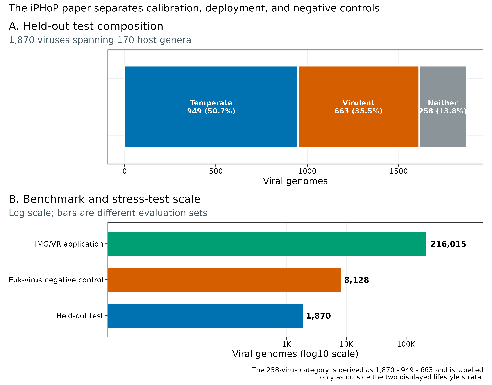
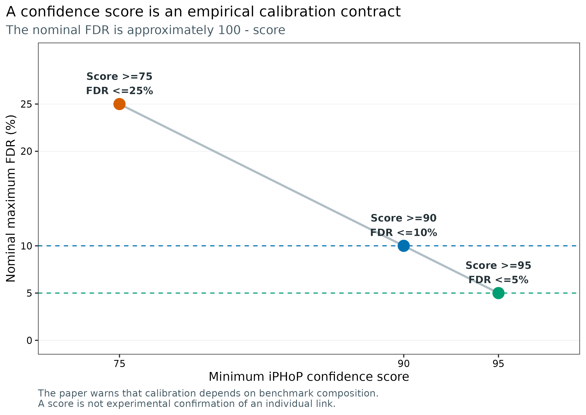
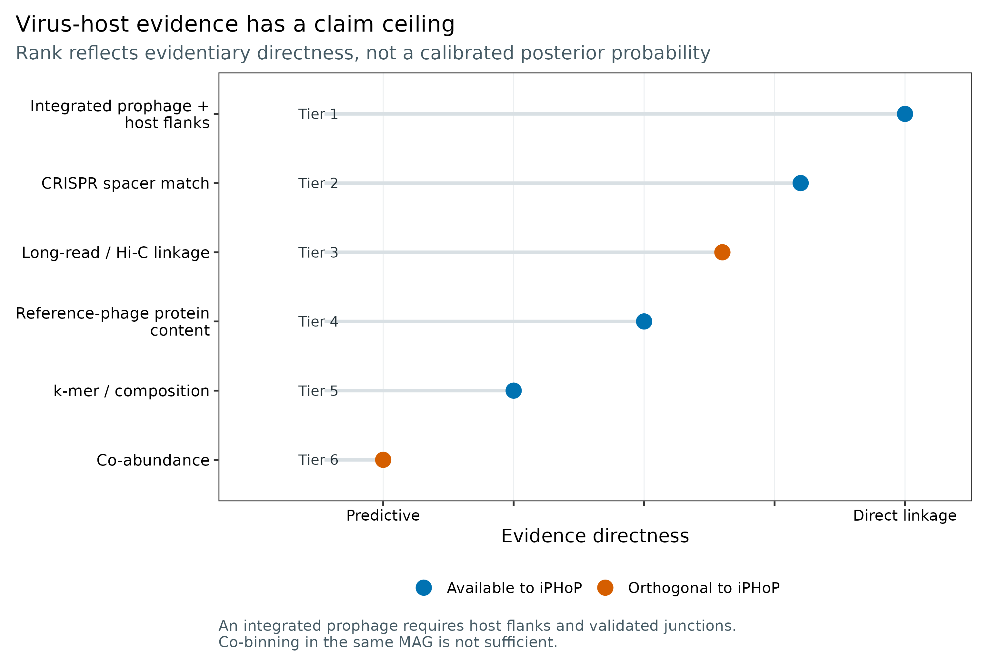
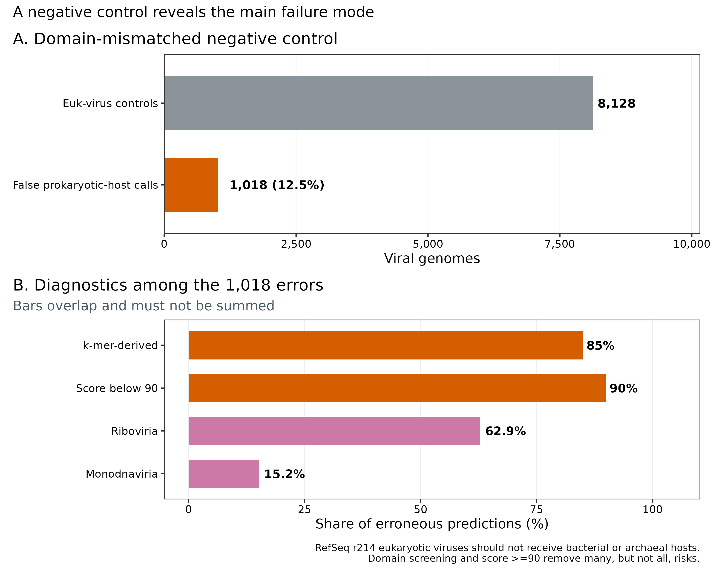
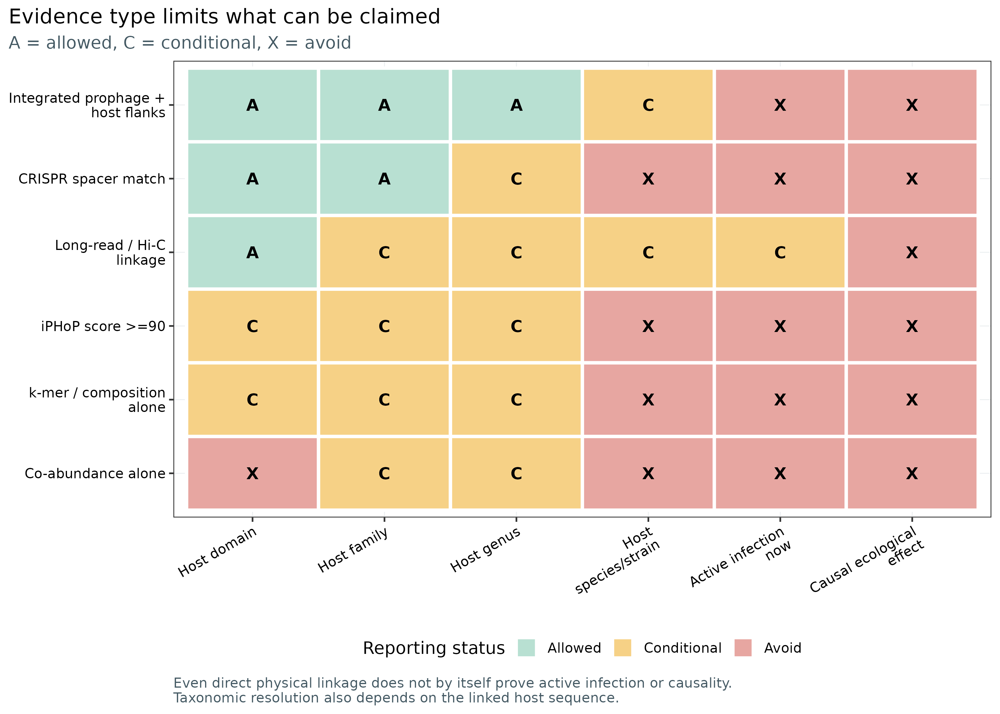

> **先给结论：**病毒—宿主关联不是一列 `host`，而是一张带证据来源、阈值、数据库版本、候选层级与冲突状态的表。默认优先级是：**带宿主两侧序列与整合边界的 prophage > 严格 CRISPR spacer match > 经阴性对照校准的 long-read/Hi-C linkage > reference-phage/protein-content prediction > k-mer/composition prediction > co-abundance**。仅仅“病毒 contig 和宿主 contig 被分进同一个 MAG”不等于前噬菌体证据；iPHoP score ≥90 代表约 `<10%` 的经验 FDR 目标，仍是**属水平预测**而非实验确认。Roux 等用 8,128 条真核病毒做域错配负对照时，有 1,018 条错误获得细菌或古菌宿主；85% 的错误来自 k-mer 比较，90% 的错误分数低于 90 [@roux2023iphop]。因此，先做病毒宿主域筛选、再看主导证据、最后才画网络。

::: {.callout-important title="算力与数据门槛"}
只读取固化证据表并重画 5 组图，**4 CPU、4 GB RAM、100 MB 磁盘、耗时约 1 分钟**。已验证的 iPHoP v1.4.2 Conda 软件环境本身占约 **4.9 GB**；程序下载器提示完整宿主库约需 **300 GB**，测试库约 **9 GB**。论文报告的 `Sept_2021_pub` 数据库上，5 条完整噬菌体、6 CPU 的完整预测约 **12 分钟**，但未报告 RAM。队列级正式运行可保守预留 **16--32 CPU、32--64 GB RAM、至少 400 GB 磁盘，耗时数小时到数天**；这是规划上界，不冒充实测 benchmark。没有服务器时，用 `data/small/56-virus-host-evidence-frozen/` 完成证据审计和出图；命令烟雾测试可用官方 test database，正式生物学结论转到 HPC 或云端的完整、锁版本数据库运行。
:::

## 这一步对应论文里的哪张图 {#sec-target}

主要锚定 Roux 等 2023 年 iPHoP 论文 [@roux2023iphop]：

- **Figure 1**：10 种单方法在 1,870 条测试病毒、170 个宿主属上的 recall、PPV/FDR 与 reference bias；
- **Figure 3**：BLAST、CRISPR、combined-hosts RF 与 RaFAH 如何合成 iPHoP confidence score；
- **Figure 4**：216,015 条 IMG/VR v3 高质量病毒上的预测覆盖率、信号来源与环境差异；
- **Figure 5**：5,711 个至少含两个基因组的宿主属中，参考病毒与 iPHoP 新增关联覆盖了哪些谱系；
- **Supplementary Figure 12--13**：短片段、低完整度以及“正确宿主属不在数据库”时的性能边界；
- **Supplementary Table 7**：8,128 条真核病毒的域错配负对照。

校准测试集含 949 条 temperate 与 663 条 virulent 病毒；余下 258 条只可写成“未进入这两个展示分层”，不能擅自补成第三种生活史。论文把校准、真实数据库应用和负对照分开，网络文章也应保留这三层。

{#fig-56-scope}

MIUViG 对 host prediction 的归纳提供了更上位的判读框架：宿主—病毒序列相似性通常最可靠；composition 方法通常难以可靠下探到 genus 以下；跨样本 abundance profile 仍属预测，并需要稳健 FDR [@roux2019miuvig]。

## 理论：每种证据都有自己的“结论天花板” {#sec-theory}

### 1. 最高等级不是“同一 MAG”，而是可检查的整合边界

真正强的 integrated prophage 证据应同时看到：

1. 病毒区段两侧为可归属宿主的 cellular sequence；
2. 左右 junction 与 assembly graph 不支持明显嵌合；
3. 宿主片段的 coverage、GC、taxonomy 与 MAG 主体一致；
4. 病毒区段没有被单独 viral contig 误分箱进 MAG；
5. 若有 reads，跨 junction 的 paired-end 或 long-read 支持可复核。

“同一 bin”只说明分箱器根据 coverage/composition 把 contigs 放在一起，而这些特征恰好也是病毒 contig 最容易误导分箱器的地方。没有 flanks 和 junction，只能写 **co-binned candidate**，不能写 “the virus infects this MAG”。

### 2. CRISPR 很强，但强度取决于 spacer 所属与错配门槛

CRISPR spacer 是宿主免疫记忆，方向上比 composition 更接近真实接触。iPHoP 论文的基准流程要求 spacer 长度 ≥25 nt、总体少于 8 个 mismatch、complexity score <0.6；Figure 1 的严格比较只接受 ≤2 mismatches。短 spacer、低复杂序列、宽松错配和错误归属的 CRISPR array 都会抬高假阳性。SpacePHARER 等工具可提高搜索灵敏度，但仍需报告 spacer 长度、mismatch、alignment coverage 与承载 array 的 host contig [@zhang2021spacepharer]。

### 3. Long-read 与 Hi-C 是物理连接，但并非天然无偏

单条高质量 long read 跨过病毒—宿主边界时，证据接近整合 junction；Hi-C/meta3C 则测量同一细胞内或空间邻近 DNA 的 proximity contact [@marbouty2017proximity; @bickhart2019assignment]。两者都需要独立质控：

- long read 要检查 mapping quality、跨界长度、嵌合 read 与重复序列；
- Hi-C 要控制交联、restriction-site density、宿主与病毒 abundance、index hopping、跨样本污染；
- 至少报告支持 read/contact 数、标准化方法、空白/模拟群落与重复一致性。

Hi-C 接触支持“物理共处或关联”，不自动证明正在复制；单一时间点也不能证明感染方向。

### 4. iPHoP 是证据整合器，不是独立实验

iPHoP v1.0 的 composite score 汇总四路分数：最佳 BLAST、最佳 CRISPR、十个 host-based classifiers 形成的 combined-hosts RF，以及 RaFAH [@coutinho2021rafah]。它没有把 long-read、Hi-C 或 co-abundance 纳入同一分数。因此，报告 `score=94` 时必须同时保留 `List of methods`，不能只留宿主名与总分。

模型输出的 confidence score 是测试集上经验 PPV 的重新标定。名义关系可写为：

\[
\widehat{\mathrm{FDR}} \approx 1-\widehat{\mathrm{PPV}}
\approx 1-\frac{\mathrm{score}}{100}.
\]

所以 score ≥90 对应约 ≤10% FDR，score ≥95 对应约 ≤5% FDR；论文也明确提醒，这个 FDR 依赖测试集组成，只能视作近似校准，不是某一条边“90% 真实”的实验概率。

{#fig-56-confidence}

### 5. Reference-phage 与 composition 的失败方式不同

在论文基准中，score-filtered alignment-based 方法可达到 >80% PPV；RaFAH 的 FDR <5% 且 recall 最高，但明显偏向有近缘参考噬菌体的 query。相反，WIsH 等 k-mer/composition 方法 [@galiez2017wish] 对 novel viruses 覆盖更广，却更容易把共享生态位、短 contig 或错误宿主域当成宿主适应信号。两种方法一致是加分，方法共享同一参考库或同一 composition 特征时却不能当作完全独立的“两票”。

### 6. Co-abundance 是候选生成器，不是感染证明

病毒与细菌在多个样本或时间点同升同降，可能来自真实感染，也可能来自共同饮食、抗生素暴露、批次、环境梯度、组成型数据闭合效应或同一受试者的重复测量。相关网络尤其容易产生间接边与符号反转 [@coenen2018limitations]。主结果至少要有足够独立样本、协变量控制、重复测量结构、multiple-testing FDR，以及 leave-one-subject/cohort 或 lagged sensitivity analysis。

{#fig-56-ladder}

## 准备工作 {#sec-preparation}

### 真实来源与身份锁

数值来自两份可引用的开放全文 XML，先按 bytes 与 SHA-256 锁定，再抽取唯一段落坐标：

| Asset | Bytes | SHA-256 | Role |
|---|---:|---|---|
| `PMC10155999.xml` | 260,284 | `c2194569972cc1572a0d709e58916c69fd7f1603c7f4645098194d641319e378` | iPHoP benchmark, methods, calibration, limitations |
| `PMC6871006.xml` | 183,966 | `289c221ece18f17a0a8930a354cfc3e01b712751abfdd52ff7b054c6f31c36fa` | MIUViG host-evidence classes and claim limits |

这里没有使用未取得的 supplementary spreadsheets，也不从论文 aggregate counts 伪造逐病毒预测网络。`source-assertions.tsv` 为每项核心事实保存 source、paragraph index、短 validation needle 与整段 SHA-256；10 项均通过唯一性检查。

<strong>安装环境、准备来源与内联作图函数</strong>

~~~bash
# 已实装并验证的当前环境：iPHoP 1.4.2
mamba env create -f env/virus-host.yml

# Linux exact lock，包含 347 行显式软件坐标
conda create --name metagenome-virus-host-2026.07 \
  --file env/virus-host-linux-64.lock

mamba run -n metagenome-virus-host-2026.07 iphop --version
mamba run -n metagenome-virus-host-2026.07 iphop predict --help

# 论文历史坐标：iPHoP v1.0 + iPHoP_db_Sept21
mamba env create -f env/virus-host-paper.yml

# 校验并结构化两份论文 XML
python3 scripts/prepare_article56_host_evidence.py \
  --project-root "$PWD" \
  --work-dir work/article56
~~~

~~~r
install.packages(c(
  "ggplot2", "dplyr", "readr", "tidyr",
  "scales", "patchwork"
))

library(ggplot2)
library(dplyr)
library(readr)
library(tidyr)
library(scales)
library(patchwork)
set.seed(20260756)

pal_pub <- c(
  "Blue" = "#0072B2", "Orange" = "#D55E00",
  "Green" = "#009E73", "Sky" = "#56B4E9",
  "Yellow" = "#E69F00", "Purple" = "#CC79A7",
  "Gray" = "#8A9499", "Light" = "#E9EEF2",
  "Dark" = "#253238", "White" = "#FFFFFF"
)
scale_color_pub <- function(...) scale_color_manual(values = pal_pub, ...)
scale_fill_pub  <- function(...) scale_fill_manual(values = pal_pub, ...)
theme_pub <- function(base_size = 12) {
  theme_bw(base_size = base_size) + theme(
    panel.grid.minor = element_blank(),
    panel.grid.major = element_line(color = "#ECEFF1", linewidth = 0.3),
    axis.text = element_text(color = "black"),
    legend.key = element_blank(),
    strip.background = element_rect(fill = "#EEF3F5", color = NA),
    plot.title.position = "plot",
    plot.caption = element_text(color = "#455A64", hjust = 0)
  )
}
save_pub <- function(plot, file_base, width = 210, height = 145,
                     units = "mm", dpi = 350) {
  dir.create(dirname(file_base), recursive = TRUE, showWarnings = FALSE)
  ggsave(paste0(file_base, ".pdf"), plot, width = width, height = height,
         units = units, device = cairo_pdf)
  ggsave(paste0(file_base, ".png"), plot, width = width, height = height,
         units = units, dpi = dpi, bg = "white")
  ggsave(paste0(file_base, ".tiff"), plot, width = width, height = height,
         units = units, dpi = dpi, compression = "lzw", bg = "white")
  invisible(plot)
}
~~~

### 数据库必须单独锁版本

论文的 benchmark 与 IMG/VR 应用使用 `iPHoP_db_Sept21`，其组成是 GTDB release 202、截至 2021-07-07 的 IMG isolate genomes 与 GEM catalog。历史数值不能无声换成 mutable `latest` 数据库重跑。

~~~bash
# 数据库必须放在 Git 仓库之外
DB_PARENT=/data/db/iphop-sept21
mkdir -p "$DB_PARENT"

# 下载器逐块做 publisher MD5；--split 支持中断续传
mamba run -n metagenome-virus-host-2026.07 iphop download \
  --db_dir "$DB_PARENT" \
  --db_version iPHoP_db_Sept21 \
  --split

# 解压后的真正数据库目录应同时含 db/、db_infos/、md5checkfile.txt
IPHOP_DB="$DB_PARENT/Sept_2021_pub"
mamba run -n metagenome-virus-host-2026.07 iphop download \
  --db_dir "$IPHOP_DB" \
  --full_verify

du -sh "$IPHOP_DB"
sha256sum "$IPHOP_DB/md5checkfile.txt"
~~~

::: {.callout-warning title="版本选择"}
忠实复现论文时固定 `iPHoP v1.0 + Sept_2021_pub`；分析新队列时可以用 iPHoP v1.4.2 与新的**明确 release**，但要把软件、数据库目录名、`Date_and_version.log`、数据库 manifest checksum 与运行日期一起保存。不能把两种结果放进同一表后声称它们只差软件版本。
:::

## 可复制代码：从 iPHoP 输出到证据账本 {#sec-code}

### 第 1 步：重建论文级 aggregate evidence

~~~bash
ROOT="$PWD"
WORK="$ROOT/work/article56"
FROZEN="$ROOT/data/small/56-virus-host-evidence-frozen"

python3 scripts/prepare_article56_host_evidence.py \
  --project-root "$ROOT" \
  --work-dir "$WORK"

column -ts $'\t' "$WORK/asset-check-audit.tsv"
column -ts $'\t' "$WORK/source-assertions.tsv"
column -ts $'\t' "$WORK/benchmark-scope.tsv"
column -ts $'\t' "$WORK/negative-control.tsv"
cat "$WORK/summary.json"

# 不下载数据库时，直接读取已固化的同一组小表
column -ts $'\t' "$FROZEN/evidence-hierarchy.tsv"
column -ts $'\t' "$FROZEN/confidence-contract.tsv"
~~~

`benchmark-scope.tsv` 的开头应为 1,870 条 held-out viruses、170 个 host genera、949 条 temperate 与 663 条 virulent；`negative-control.tsv` 应给出 8,128、1,018 与派生的 12.524606%。派生值和论文直接报告值由 `ValueStatus` 分开。

### 第 2 步：在真实 vOTU 目录上运行 iPHoP

输入必须是经过病毒识别、质量评估和 95% ANI / 85% AF 去冗余后的 vOTU representatives；不要把同一病毒的近重复 contigs 当独立 query。下面用第 55 篇固化的 15 噬菌体公开参考目录作为命令输入，运行结果写到仓库外或 `results/`，不在渲染时重算。

~~~bash
ROOT="$PWD"
VIRUSES="$ROOT/data/small/55-virus-taxonomy-abundance-frozen/raw/cook15-phage-reference.fna"
IPHOP_DB=/data/db/iphop-sept21/Sept_2021_pub
OUT="$ROOT/results/56-virus-host-evidence/iphop"

test -s "$VIRUSES"
test -s "$IPHOP_DB/md5checkfile.txt"

# 以 75 输出完整候选集合，再在统计脚本中预注册 90 为主阈值、95 为敏感性阈值
mamba run -n metagenome-virus-host-2026.07 iphop predict \
  --fa_file "$VIRUSES" \
  --db_dir "$IPHOP_DB" \
  --out_dir "$OUT" \
  --num_threads 16 \
  --min_score 75 \
  --add_tsv_output

cp "$OUT/Date_and_version.log" "$OUT/analysis-version.log"
sha256sum "$VIRUSES" "$IPHOP_DB/md5checkfile.txt" > "$OUT/input-database.sha256"
~~~

这段命令只定义可复现路径，不把未实际取得的逐病毒输出写进结果段。正式运行完成后，至少保留：

- `Host_prediction_to_genus_m75.csv/tsv`；
- `Host_prediction_to_genome_m75.csv/tsv`；
- `Detailed_output_by_tool.csv/tsv`；
- `Date_and_version.log`、命令、FASTA 与数据库 manifest checksum；
- 未通过 90 的候选，供 75/90/95 sensitivity analysis，而不是删掉后失去审计能力。

### 第 3 步：每条病毒只选一个预注册主候选，同时保留证据串

~~~r
library(readr)
library(dplyr)
library(stringr)

pred_all <- read_csv(
  "results/56-virus-host-evidence/iphop/Host_prediction_to_genus_m75.csv",
  show_col_types = FALSE
) %>%
  transmute(
    virus_id = Virus,
    rafah_nearest_aai = `AAI to closest RaFAH reference`,
    host_lineage = `Host genus`,
    iphop_score = as.numeric(`Confidence score`),
    method_scores = `List of methods`
  ) %>%
  arrange(virus_id, desc(iphop_score), host_lineage)

# 一条病毒可能有多个候选属；主表按 score 最大、host lineage 字典序稳定破平
pred_best <- pred_all %>%
  group_by(virus_id) %>%
  slice_head(n = 1) %>%
  ungroup() %>%
  mutate(
    primary_method = str_extract(method_scores, "^[^; ]+"),
    score_class = case_when(
      iphop_score >= 95 ~ "Very high (>=95)",
      iphop_score >= 90 ~ "High (90-94.9)",
      TRUE ~ "Exploratory (75-89.9)"
    ),
    main_signal = case_when(
      primary_method == "blast" ~ "Virus-host sequence alignment",
      primary_method == "CRISPR" ~ "CRISPR spacer match",
      primary_method == "RaFAH" ~ "Reference-phage protein content",
      primary_method %in% c("iPHoP-RF", "iPHoP_RF") ~ "Integrated host-based prediction",
      TRUE ~ "Inspect detailed output"
    ),
    primary_report = iphop_score >= 90
  )

write_tsv(
  pred_best,
  "results/56-virus-host-evidence/virus-host-predictions-audited.tsv"
)
~~~

若同一 query 有两个 ≥90 的候选 host genera，不要把第二名静默删掉。主网络可保留最高分，supplement 仍应列出全部候选、分差与 evidence string；差值很小时标记 `ambiguous_host=TRUE`。

### 第 4 步：把物理证据放在独立列，不塞回 iPHoP score

最终账本一条边一行，至少包含：

| Column | Meaning |
|---|---|
| `virus_id`, `votu_id` | stable query and nonredundant viral unit |
| `host_genome_id`, `host_lineage` | exact host candidate and versioned taxonomy |
| `prophage_both_flanks`, `junction_reads` | integrated-prophage evidence |
| `crispr_spacer_id`, `spacer_length`, `mismatches` | CRISPR evidence and threshold audit |
| `long_read_count`, `hic_contacts_norm` | physical linkage, kept outside iPHoP |
| `iphop_score`, `primary_method`, `method_scores` | calibrated computational prediction |
| `coabundance_rho`, `coabundance_q` | ecological association, never direct proof |
| `evidence_rank`, `conflict_flag`, `claim_ceiling` | final reporting contract |
| `software_version`, `database_release` | provenance |

~~~r
rank_order <- c(
  "Integrated prophage + host flanks" = 1L,
  "CRISPR spacer match" = 2L,
  "Long-read / Hi-C linkage" = 3L,
  "Reference-phage protein content" = 4L,
  "k-mer / composition" = 5L,
  "Co-abundance" = 6L
)

# evidence_long 应来自真实工具输出，每行是一条 virus-host-evidence 记录
edge_audit <- read_tsv(
  "results/56-virus-host-evidence/evidence-long.tsv",
  show_col_types = FALSE
) %>%
  mutate(evidence_rank = unname(rank_order[evidence_type])) %>%
  group_by(virus_id, host_genome_id) %>%
  summarise(
    best_evidence_rank = min(evidence_rank, na.rm = TRUE),
    evidence_types = paste(sort(unique(evidence_type)), collapse = ";"),
    independent_channels = n_distinct(evidence_channel),
    .groups = "drop"
  )

stopifnot(!anyNA(edge_audit$best_evidence_rank))
write_tsv(edge_audit, "results/56-virus-host-evidence/edge-audit.tsv")
~~~

`independent_channels` 统计实验或信号家族，不统计软件数量。同一组 k-mer 特征被三个分类器重复使用仍是一类 composition evidence。

### 第 5 步：重画证据等级、校准与负对照

~~~bash
Rscript scripts/plot_article56_host_evidence.R \
  data/small/56-virus-host-evidence-frozen \
  figures
~~~

图形脚本固定 `set.seed(20260756)`、因子顺序、色盲友好配色和 350 dpi。所有图中文字为英文。

## 审计与升级 {#sec-audit}

### 1. 把“作者使用的工具”升级为“今天可审计的边”

iPHoP 的重要进步不是简单投票，而是用 held-out test set 把不同工具分数转为经验 PPV，再组合一致的证据。当前分析仍需补三件事：

1. 在每条边上保存 **main method**，因为 score 92 的 CRISPR 主导边与 k-mer/RF 主导边并不等价；
2. 把 long-read、Hi-C、prophage junction 与 co-abundance 作为**外部证据列**加入，而不是篡改 iPHoP score；
3. 报告冲突，例如 CRISPR 指向属 A、Hi-C 指向属 B；不能只保留更符合故事的一票。

### 2. 域错配负对照必须进入常规 QA

8,128 条 RefSeq r214 真核病毒中，1,018 条得到错误的细菌/古菌宿主，错误率为 12.5%；其中 85% 来自 k-mer comparison，90% 的 score <90。640 条错误属于 Riboviria，155 条属于 Monodnaviria。这四个百分比的 denominator 不完全相同、类别也可重叠，不能加成 100%。

{#fig-56-negative}

正式流程应先用病毒 taxonomy/host-domain classifier 排除明确 eukaryotic viruses，再跑 iPHoP；同时混入已知 eukaryotic-virus negatives、随机打乱 query labels 或跨样本空白作为错误监控。域筛选不是为了让网络更“干净”，而是因为 iPHoP 的目标域本来就是 bacteriophages 与 archaeoviruses。

### 3. Host database 缺属时，属名会显得过度精确

论文移除真实宿主属后，score 90/95 下多数 query 不再给预测；仍给出的候选常落在真实宿主同 family。作者因此建议：novel host genera 较多时用 score ≥90，并按 **family rank** 解释。对环境样本，local MAGs 能增加候选宿主覆盖，但 MAG contamination、CRISPR array 缺失与分类错误也会进入数据库。加入 local MAGs 前必须完成 CheckM2/GUNC/GTDB-Tk 质量与 taxonomy 审计，并把 custom database 当成新 release。

### 4. Partial genomes 主要损失 recall，不允许因此降低主阈值

iPHoP 对 20 kb、10 kb、5 kb、1 kb 以及多种 completeness 的片段做过重复抽样。片段越短，high-score prediction 越少；score 90/95 的 FDR 与完整 genome 大致相近，而 score 75 的错误略升。正确升级方式是承认“不出结果”，而不是为短 contig 把阈值降到 75 再当主结论。长度、CheckV completeness 与末端状态应进入每条边的 supplement。

### 5. 不让网络图越过证据天花板

{#fig-56-ceiling}

即使整合型 prophage 或 Hi-C 物理连接很强，也不能单凭这一条边声称“当前正在裂解感染”或“病毒导致宿主表型”。active infection 需要转录、复制中间体、时间序列、VLP/细胞分级或培养证据；causality 需要干预与合适对照。

## 出版级美化 {#sec-publication}

一张可投稿的病毒—宿主图应把视觉编码留给证据，而不是只按 phylum 上色：

- **edge color** 表示最强 evidence class；
- **edge width** 表示标准化 physical support 或预注册 confidence，但不要混用两种量纲；
- **edge linetype** 区分 direct/physical 与 predictive；
- **node shape** 区分 virus、bacterium、archaeon；
- **node fill** 才用于 taxonomy 或 condition；
- score 75--89.9 的 exploratory edges 放 supplement 或淡灰，不与 ≥90 主边同权；
- 冲突边保留标记，网络旁同时给 evidence-count barplot；
- 图注写明数据库 release、score gate、候选选择规则与 edge denominator。

PDF 保留矢量文本，PNG 供网页，LZW TIFF 供期刊；默认 350 dpi。等级图与 claim matrix 使用蓝/橙及低饱和绿/黄/红，避免仅靠红绿区分。

## 常见坑 {#sec-pitfalls}

::: {.callout-caution title="审稿人最常攻击的十个点"}
1. 把 `same MAG/bin` 写成 integrated prophage，却没有 host flanks、junction reads 或 assembly graph；
2. 只报告 iPHoP score，不报告 `List of methods` 与 main method；
3. 使用 mutable `latest` database，不留 release、manifest 与运行日期；
4. 把 score 90 解释成这条边有 90% 实验真实性；
5. 混入真核病毒后仍强制分配细菌/古菌宿主；
6. 对短、低完整度 contigs 降阈值，却不做 sensitivity analysis；
7. 认为三个 composition classifiers 是三份独立证据；
8. 用几十个高度相关样本做 co-abundance，并忽略 subject、batch 与 compositionality；
9. 网络只保留最高分候选，不披露近分第二候选和证据冲突；
10. 从 host linkage 直接跳到 active infection、host range 或 causal effect。
:::

::: {.callout-tip title="最小审计表"}
至少交付 `virus_id`、`host_id/lineage`、`best_evidence_rank`、每类原始证据列、iPHoP score、main method、all method scores、query length/completeness、domain screen、database release、conflict flag 与 claim ceiling。网络图只是这张表的视图。
:::

## 这段 Methods 怎么写 {#sec-methods}

### Methods template

> Viral host links were evaluated using a preregistered evidence hierarchy. Integrated prophage assignments required viral sequence bounded by taxonomically consistent host sequence and support for both integration junctions; co-binning within a MAG alone was not considered sufficient. CRISPR links retained spacers of at least 25 nt and recorded spacer length, mismatch count, complexity, and the genome carrying the array. Physical links from long reads or Hi-C were stored as independent evidence channels and were not incorporated into computational confidence scores. Host-genus predictions were generated with iPHoP v1.4.2 using the `{DATABASE_RELEASE}` database and `{N_THREADS}` threads. All candidates were exported at a minimum score of 75; score ≥90 was preregistered for the primary analysis and score ≥95 for a stringent sensitivity analysis. The highest-scoring host genus was used in the primary network with deterministic lexical tie-breaking, while all alternative candidates and per-method scores were retained. Viral host-domain classification was performed before prokaryotic host prediction. Host links based only on composition or co-abundance were labelled predictive, and multiple testing in co-abundance analysis was controlled by the Benjamini--Hochberg procedure. Software, database manifests, commands, and input checksums were archived.

忠实复现论文 benchmark 时，把软件与数据库改成 `iPHoP v1.0` 和 `iPHoP_db_Sept21 (GTDB r202; IMG as of 2021-07-07; GEM catalog)`，不要写 v1.4.2。

### Results template

> Of {N_VOTU} nonredundant vOTUs, {N_SCORE90} received at least one iPHoP host-genus prediction with a confidence score ≥90 and {N_SCORE95} remained at ≥95. The primary predictions were supported mainly by {MAIN_METHOD_SUMMARY}. Orthogonal evidence supported {N_ORTHOGONAL} links: {N_PROPHAGE} integrated-prophage junctions, {N_CRISPR} strict CRISPR matches, and {N_PHYSICAL} long-read or Hi-C links. {N_CONFLICT} links showed disagreement between evidence channels and were reported as ambiguous. Composition-only and co-abundance-only links were treated as candidate associations. After host-domain screening, {N_EUK_EXCLUDED} putative eukaryotic viruses were excluded from prokaryotic-host assignment. Predictions for host lineages poorly represented in the reference database were interpreted at family rather than genus rank.

对当前固化的论文 benchmark，可写：

> The held-out benchmark comprised 1,870 viruses spanning 170 host genera. iPHoP confidence scores were empirically calibrated, with the default score threshold of 90 corresponding to an estimated FDR below 10%. In a domain-mismatched negative control, 1,018 of 8,128 eukaryotic viruses received an erroneous bacterial or archaeal host prediction; 85% of these errors originated from k-mer comparisons and 90% had scores below 90.

## 换成你自己的数据怎么做 {#sec-own-data}

开始前准备六类输入：

1. **非冗余病毒目录**：vOTU representative FASTA、95% ANI/85% AF clustering、CheckV quality/completeness、virus taxonomy 与 host-domain label；
2. **候选宿主目录**：高质量 bacterial/archaeal MAGs 或 isolates、GTDB taxonomy、CheckM2/GUNC 审计、稳定 genome IDs；
3. **整合证据**：prophage coordinates、两侧 host flanks、junction reads、assembly graph；
4. **CRISPR 证据**：array 所属 contig/genome、spacer sequence/length、mismatch、coverage、complexity；
5. **物理证据**：long-read alignments 或 Hi-C contacts、MAPQ、contact normalization、controls 与 replicate；
6. **生态证据**：同一批样本中的病毒与宿主 abundance、subject/time/batch/covariates；样本不足时不画共丰度网络。

推荐按以下顺序落表：

1. 先做病毒域分类，明确排除 eukaryotic-virus queries；
2. 用明确 release 的完整 iPHoP database 跑所有 vOTU，导出 score ≥75 候选；
3. 预注册 90 主阈值与 95 敏感性阈值，保留 main method 和全部 method scores；
4. 加入 local MAGs 时生成新 database release，分别比较 default/custom database；
5. 独立计算 prophage、CRISPR、long-read/Hi-C 与 co-abundance 表；
6. 按最高证据等级选主边，同时保留 alternative hosts 和 conflict flag；
7. 先交付 evidence ledger，再从它生成主图网络和 supplement；
8. 用已知真核病毒、空白、打乱标签和 leave-one-subject/cohort 做假阳性与稳健性审计。

如果只有短 contigs 和少量横断面样本，最诚实的结果常是“若干 score ≥90 的预测候选，属级解释受数据库覆盖限制”，而不是一张密集的感染网络。

## 参考 {#sec-references}

- iPHoP integrated host prediction、benchmark、score calibration 与负对照：[@roux2023iphop]
- 病毒—宿主计算预测方法综述：[@edwards2016phagehost]
- MIUViG 的 host-prediction 证据分类与报告边界：[@roux2019miuvig]
- CRISPR spacer 搜索：[@zhang2021spacepharer]
- WIsH composition-based prediction：[@galiez2017wish]
- RaFAH protein-content host prediction：[@coutinho2021rafah]
- Meta3C/Hi-C 与 long-read/proximity linkage：[@marbouty2017proximity; @bickhart2019assignment]
- correlation-based virus--microbe inference 的局限：[@coenen2018limitations]
- 当前锁定软件坐标：[@iphop2026software]
