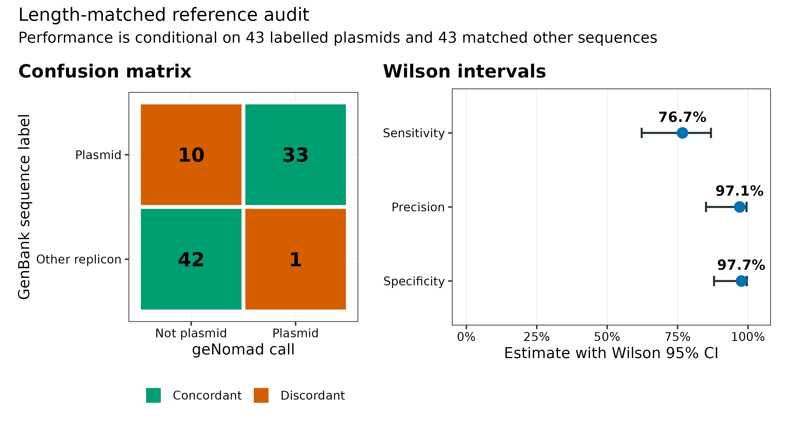
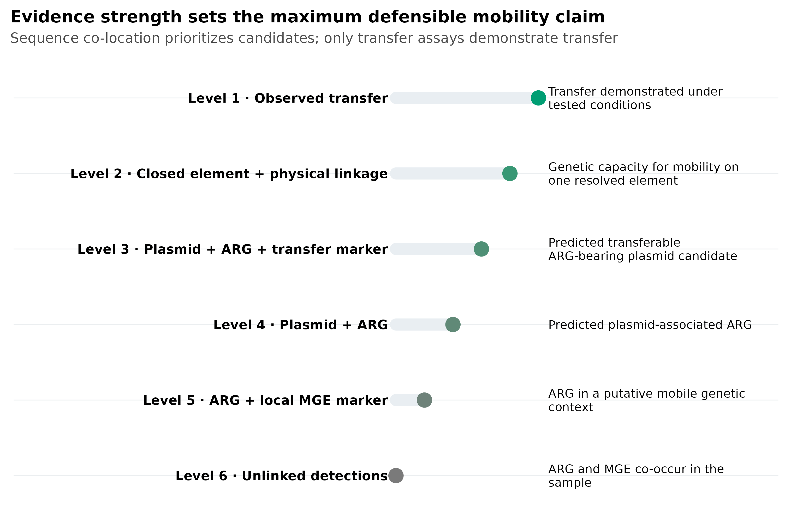
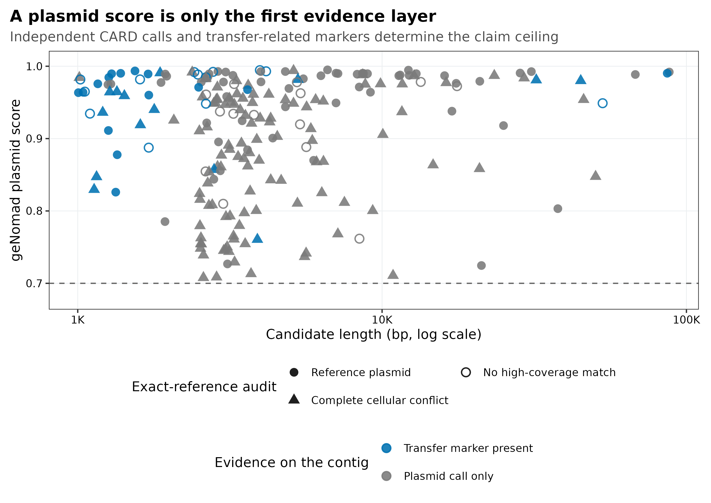
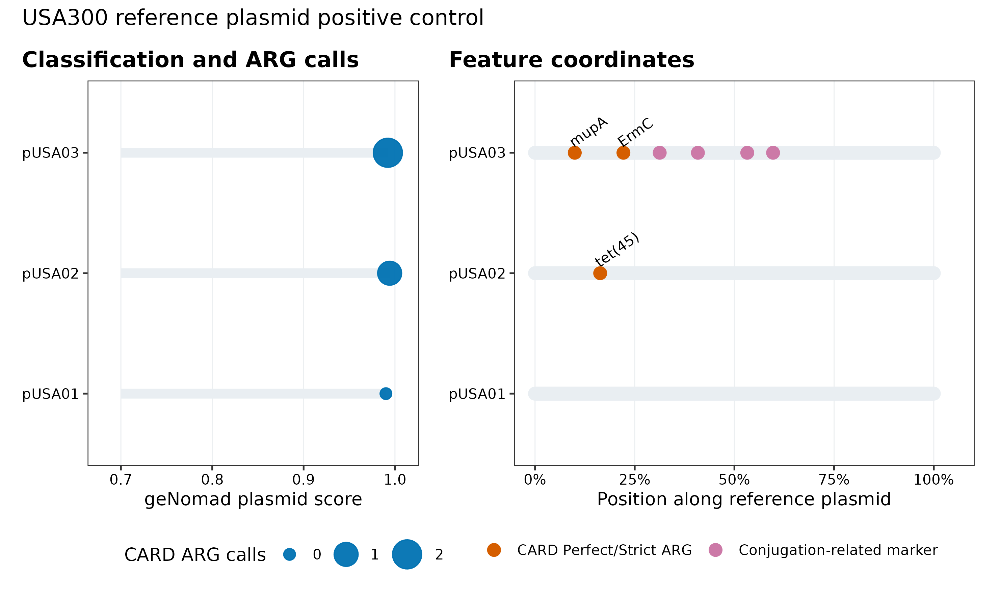
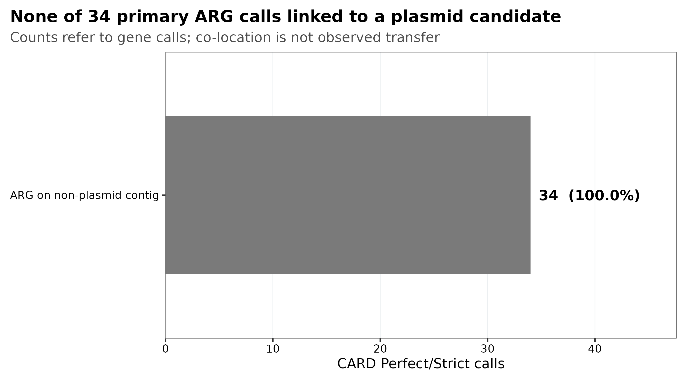

> **先给结论：**geNomad 的 plasmid call 是候选生成器，不是“这条 DNA 已经在细菌间传播”的证明。可靠的 ARG 可移动性结论至少要分开回答四件事：序列像不像质粒、ARG 是否与该元件发生物理连接、元件是否具备完整转移模块、转移是否被实验观察。PRJEB52977 两个 mock 样本的共组装中，geNomad 给出 218 条候选，其中 42 条带 transfer-related marker；但 CARD-RGI 的 34 个 Perfect/Strict ARG 调用没有一个位于这些候选上。精确参考比对又显示，70 条候选由已标注质粒支持，120 条高覆盖匹配完整细胞复制子，28 条没有高覆盖参考支持。相反，USA300 阳性对照的 3 条已标注质粒全部被检出，且 pUSA02 上有 `tet(45)`，pUSA03 上有 `mupA`、`ErmC` 与 4 个 conjugation-related markers。阴性结果与阳性对照必须一起报告。

::: {.callout-important title="算力与数据门槛"}
只读取固化表并重画 5 组图，**4 CPU、4 GB RAM、200 MB 磁盘、耗时约 1 分钟**。本次 geNomad 实跑使用 **16 CPU、16 splits**：10.22 Mb 的匹配参考集耗时 186.63 s、峰值 2.75 GiB RAM；84.81 Mb 共组装耗时 1,092.21 s、峰值 2.83 GiB；USA300 对照耗时 182.64 s、峰值 2.71 GiB。geNomad database v1.9 解压后约 **1.47 GB**。正式队列建议预留 **16--32 CPU、32--64 GB RAM、至少 30 GB 临时磁盘，单个中等共组装约几十分钟至数小时**；样本数、contig 数和共享存储速度都会改变耗时。没有服务器时，直接读取 `data/small/57-plasmids-mobile-elements-frozen/` 完成审计和作图；全量发现任务放到 HPC 或云端。
:::

## 这一步对应论文里的哪张图 {#sec-target}

主要锚定两篇研究：

- geNomad 论文 **Figure 1a**：sequence branch、marker branch、聚合、score calibration 与输出表的完整框架；**Figure 1d** 展示 calibration 前后 score 与经验阳性比例的关系；**Figure 3a** 比较不同长度片段上的质粒分类性能 [@camargo2024genomad]。
- Forster 等 2022 年研究的 **Figure 1c**：MGE 跨 genus、class 和 phylum 的共享范围；**Figure 2**：15 个 broad-host-range 元件的宿主分布、类型与 ARG；**Figure 3c--e**：ICE 与 plasmid 的体外 conjugation assay，把“序列预测”推进到“观察到转移” [@pike2022broadhostmge]。

两篇论文承担不同任务：geNomad 回答“怎样从序列筛出 plasmid candidates”，Forster 等回答“怎样证明 ARG-bearing MGE 仍能跨宿主转移”。不能把前者的分类分数写成后者的实验结论。

本次长度匹配基准由 43 条 GenBank header 明确含 `plasmid` 的参考复制子，以及 43 条按长度确定性一对一匹配的其他参考序列构成。geNomad 检出 33/43 条已标注质粒，同时在 43 条匹配序列中产生 1 个阳性调用：sensitivity 76.7%（Wilson 95% CI 62.3--86.8%）、precision 97.1%（85.1--99.5%）、specificity 97.7%（87.9--99.6%）。这些指标只适用于这 86 条、这一标签定义和当前数据库，不是自然群落的普适性能。

{#fig-57-reference}

## 理论：从质粒命中到可移动性结论 {#sec-theory}

### 1. “MGE”不是“质粒”的同义词

可移动遗传元件（mobile genetic element, MGE）至少包括 plasmid、insertion sequence、transposon、integron-associated cassette、integrative and conjugative element（ICE）、integrative and mobilizable element（IME）与 prophage。它们的复制位置、边界和移动机制不同 [@partridge2018mgeamr]：

| 对象 | 常见位置 | 自主复制 | 自主转移 | 最低可主张结论 |
|---|---|---|---|---|
| Plasmid | 染色体外，也可能整合 | 常见但非必然 | 取决于完整 conjugation module | predicted plasmid sequence |
| ICE | 染色体整合态 | 否 | 可编码完整 conjugation machinery | putative ICE；需边界与模块 |
| IME | 染色体整合态 | 否 | 借用其他元件 machinery | putative mobilizable element |
| Integron | 染色体或质粒 | 否 | 本身通常不自主移动 | integron-associated gene cassette |
| IS/transposon | 多种复制子 | 否 | 在分子内或分子间转位 | transposition-associated context |
| Prophage | 染色体整合态 | 随宿主复制 | 诱导后可形成病毒粒子 | integrated provirus/prophage candidate |

IntegronFinder 识别 integrase、attC 与 cassette array [@cury2016integronfinder]；它检测的是基因捕获系统，不应自动改写成“可接合质粒”。同样，看到一个 transposase 也只能说明局部移动相关标记，不能证明整条 contig 会跨细胞转移。

### 2. geNomad score 是分类证据，不是转移概率

geNomad 把 nucleotide sequence model 与 marker-content model 聚合为 chromosome、plasmid 和 virus scores [@camargo2024genomad]。短 contig 的基因少，marker branch 信息不足；重复、保守 housekeeping 区域、chromid 与染色体整合元件又会模糊类别边界。因此，分类结果要保留：

- `plasmid_score`、候选长度和 topology；
- plasmid/chromosome/virus markers 与 hallmarks；
- 是否启用 score calibration；
- 数据库 release 与 filtering parameters；
- 与完整参考、assembly graph 和 reads 的独立核验。

这里固定默认 `score ≥ 0.7`，但没有启用 score calibration，所以输出中的 `FDR` 为 `NA`。未经 calibration 的 0.90 不能写成“90% 为真”，更不能写成“90% 可转移”。即使启用 calibration，FDR 也是特定输入批次与校准假设下的经验量，不是单条序列的实验成功率。

### 3. 同一 contig 提供物理共定位，但不等于已经发生转移

ARG 与 plasmid call 位于同一 contig，比“同一样本同时检出 ARG 和质粒”强，因为至少有 assembly-level linkage；但它仍可能来自：

- 短 contig 被错误分类；
- repeat 导致的 chimeric assembly；
- 染色体整合的 plasmid/ICE 片段；
- chromid、secondary chromosome 或其他 cellular replicon；
- ARG 只落在元件边界外的宿主 flank；
- 样本中存在该结构，却没有发生当下或跨宿主转移。

因此，最稳妥的数据结构不是一列 `mobile = TRUE/FALSE`，而是一张 evidence ledger：分别记录 plasmid classifier、ARG caller、transfer module、element boundary、read support、host linkage 与 experimental validation。

### 4. transfer-related marker 不等于完整 conjugation system

geNomad 的 `conjugation_genes` 来自 marker 注释，可用于筛候选；官方输出说明也明确提醒，单凭这一列不足以判断元件是 conjugative 还是 mobilizable。正式分类应检查 relaxase、type IV coupling protein、mating-pair formation system 与 oriT 是否构成一致模块，可用 MacSyFinder/CONJscan 做系统级检测 [@abby2014macsyfinder]。质粒重建和 typing 可再用 MOB-suite [@robertson2018mobsuite]，整合元件则结合 IntegronFinder、ICE/IME 边界与宿主染色体上下游。

### 5. “有移动潜力”与“观察到转移”之间还差实验

证据强度可以写成一个结论天花板：

\[
C_{max}=\min(C_{identity},C_{linkage},C_{machinery},C_{host},C_{experiment}).
\]

只要某一层缺失，最终措辞就不能越过它。Forster 等先用跨基因组共享与完整元件结构提出 broad-host-range candidates，再用 mating/conjugation assay、受体选择和基因型确认展示跨宿主转移 [@pike2022broadhostmge]。这正是序列文章最容易漏掉的一层。

{#fig-57-ladder}

## 准备工作 {#sec-preparation}

### 真实公开数据与固定身份

主数据来自 Meslier 等的标准化 mock-community 平台研究 PRJEB52977 [@meslier2022platforms]。共组装使用 ERR9765746（MOCK1）与 ERR9765747（MOCK2）各确定性抽取 2,000,000 对 reads，经 fastp 后以 MEGAHIT 1.2.9 `meta-sensitive` 共组装，并保留 ≥1 kb contigs。参考序列固定在公开 `benchmark_mock` 仓库 commit `a429a3724d4593f35b8d7323b20252a6be90e1cd`。

| 输入 | 固定身份 | 规模 | 作用 |
|---|---|---:|---|
| MOCK2 complete reference inventory | `MOCK_002.fasta.gz`; SHA-256 `5617cc377fc503141d7a27d7c52ce874e3393e3939a9fdcbbd43fe0268c6092c` | 399 sequences; 292,802,018 bp | 真实复制子标签与候选精确比对 |
| Length-matched benchmark | 43 labelled plasmids + 43 matched other sequences | 86 sequences; 10,224,313 bp | 控制长度泄漏的分类审计 |
| MEGAHIT co-assembly | SHA-256 `904f92521ff0ce9f12bd52d153bb249ec816fc900051e06b4b12bc5da74a270a` | 18,354 contigs; 84,811,518 bp | metagenomic candidate discovery |
| USA300 FPR3757 | `GCA_000013465.1` | 1 cellular replicon + 3 labelled plasmids | plasmid-borne ARG 阳性对照 |
| CARD-RGI calls | RGI 6.0.8 + CARD 4.0.1 | co-assembly 34；USA300 21 primary calls | 独立 ARG 证据 |

43 个 positives 是 header 中明确写有 `plasmid` 的序列；43 个 comparators 是不含该词、按绝对 log-length ratio 最小且不放回匹配的序列。固定 `SeqName` 打破并列，因此不需要随机抽样。它们是可审计标签，不是假装完美的生物学 ground truth。

<strong>安装锁定环境、数据库和内联作图函数</strong>

~~~bash
# geNomad 1.12.0；Linux exact lock 可消除 solver 漂移
mamba env create -f env/virus-discovery.yml
conda create --name metagenome-virus-discovery-2026.07 \
  --file env/virus-discovery-linux-64.lock

# RGI 6.0.8 / CARD 4.0.1，以及 minimap2 2.31-r1302
mamba env create -f env/resistome.yml
conda create --name metagenome-resistome-2026.07 \
  --file env/resistome-linux-64.lock
conda create --name metagenome-assembly-2026.07 \
  --file env/assembly-linux-64.lock

# geNomad database v1.9 / ICTV MSL39，固定 Zenodo archive
db/download_db.sh audit
db/download_db.sh download genomad-db-v1.9

# database manifest 中应看到 archive MD5 与解压体积
rg '^genomad-db-v1.9' data/small/54-virus-database-manifest.tsv
test "$(cat db/virus-discovery-cache/databases/genomad_db/version.txt)" = "1.9"

# CARD 4.0.1：下载、校验并加载本地模型
CARD_ROOT=/data/db/card-4.0.1
mkdir -p "$CARD_ROOT/archive" "$CARD_ROOT/rgi-db"
curl -fL --retry 5 \
  https://card.mcmaster.ca/download/0/broadstreet-v4.0.1.tar.bz2 \
  -o "$CARD_ROOT/archive/broadstreet-v4.0.1.tar.bz2"
echo "d80520c51ef3bae1098cd00e0c3d1d013e5785f8d8df787dcc5f435927557df9  $CARD_ROOT/archive/broadstreet-v4.0.1.tar.bz2" | sha256sum -c -
tar -xjf "$CARD_ROOT/archive/broadstreet-v4.0.1.tar.bz2" -C "$CARD_ROOT/rgi-db"
DATA_PATH="$CARD_ROOT/rgi-db" \
  mamba run -n metagenome-resistome-2026.07 \
  rgi load --card_json "$CARD_ROOT/rgi-db/card.json" --local
~~~

~~~r
install.packages(c(
  "ggplot2", "dplyr", "readr", "tidyr",
  "scales", "patchwork"
))

library(ggplot2)
library(dplyr)
library(readr)
library(tidyr)
library(scales)
library(patchwork)
set.seed(20260757)

pal_pub <- c(
  "Blue" = "#0072B2", "Orange" = "#D55E00",
  "Green" = "#009E73", "Sky" = "#56B4E9",
  "Yellow" = "#E69F00", "Purple" = "#CC79A7",
  "Gray" = "#7A7A7A", "Light" = "#E9EEF2",
  "Dark" = "#253238", "White" = "#FFFFFF"
)
scale_color_pub <- function(...) scale_color_manual(values = pal_pub, ...)
scale_fill_pub  <- function(...) scale_fill_manual(values = pal_pub, ...)
theme_pub <- function(base_size = 12) {
  theme_bw(base_size = base_size) + theme(
    panel.grid.minor = element_blank(),
    panel.grid.major = element_line(color = "#ECEFF1", linewidth = 0.3),
    axis.text = element_text(color = "black"),
    legend.key = element_blank(),
    strip.background = element_rect(fill = "#EEF3F5", color = NA),
    plot.title.position = "plot",
    plot.caption = element_text(color = "#455A64", hjust = 0)
  )
}
save_pub <- function(plot, file_base, width = 205, height = 145,
                     units = "mm", dpi = 350) {
  dir.create(dirname(file_base), recursive = TRUE, showWarnings = FALSE)
  ggsave(paste0(file_base, ".pdf"), plot, width = width, height = height,
         units = units, device = cairo_pdf, bg = "white")
  ggsave(paste0(file_base, ".png"), plot, width = width, height = height,
         units = units, dpi = dpi, bg = "white")
  ggsave(paste0(file_base, ".tiff"), plot, width = width, height = height,
         units = units, dpi = dpi, compression = "lzw", bg = "white")
  invisible(plot)
}
~~~

### 固化产物怎样读取

`data/small/57-plasmids-mobile-elements-frozen/` 保存了 checksum manifest、完整命令账本、资源日志、geNomad summary/gene tables、RGI primary calls、minimap2 PAF、环境 exact locks 和绘图脚本。完整 FASTQ、292.8 Mb 参考 FASTA、84.8 Mb 共组装及数据库不重复打包；它们的公开身份和 checksum 都在 `asset-check-audit.tsv`。

~~~bash
FROZEN="$PWD/data/small/57-plasmids-mobile-elements-frozen"

sha256sum -c "$FROZEN/file-checksums.sha256"
column -ts $'\t' "$FROZEN/input-lineage.tsv"
column -ts $'\t' "$FROZEN/tool-versions.tsv"
column -ts $'\t' "$FROZEN/database-audit.tsv"
cat "$FROZEN/summary.json"

# 直接从固化小表重画全部图片
Rscript "$FROZEN/scripts/plot_article57_plasmids.R" \
  "$FROZEN" figures
~~~

## 可复制代码：建立质粒—ARG—转移证据账本 {#sec-code}

### 第 1 步：下载参考并验证上游身份

~~~bash
ROOT="$PWD"
WORK="$ROOT/work/article57"

# 下载固定 commit 的 PRJEB52977 reference repository
DOWNLOAD_ARTICLE57_PLASMIDS=1 bash data/download.sh

# 若要从 FASTQ 重建同一共组装，下载 ERR9765746/ERR9765747 后运行锁定流程
DOWNLOAD_ARTICLE30_ASSEMBLY=1 bash data/download.sh

# 四个输入均经过 bytes + SHA-256 gate；RGI 输入来自同一 co-assembly 和 USA300
python3 scripts/prepare_article57_plasmids.py \
  --project-root "$ROOT" \
  --work-dir "$WORK" \
  --benchmark-repo data/raw/article57/benchmark_mock \
  --coassembly data/small/30-short-read-assembly-frozen/contigs/megahit-coassembly.ge1000.fna.gz \
  --rgi-coassembly work/article38/coassembly/coassembly.txt \
  --rgi-staphylococcus work/article38/staphylococcus/staphylococcus.txt

column -ts $'\t' "$WORK/asset-check-audit.tsv"
column -ts $'\t' "$WORK/reference-benchmark-labels.tsv" | head -n 12
~~~

准备脚本不会根据结果重抽 negatives。43 条已标注质粒先按长度、`SeqName` 排序，再对每条质粒选择尚未使用且绝对 log-length ratio 最小的 comparator；并列时依次按绝对 bp 差和 `SeqName` 决定。

### 第 2 步：运行 geNomad 三条分支与精确参考审计

~~~bash
GENOMAD_ENV="$HOME/miniconda3/envs/metagenome-virus-discovery-2026.07"
ASSEMBLY_ENV="$HOME/miniconda3/envs/metagenome-assembly-2026.07"
GENOMAD_DB="$ROOT/db/virus-discovery-cache/databases/genomad_db"

python3 scripts/run_article57_plasmids.py \
  --project-root "$ROOT" \
  --work-dir "$WORK" \
  --genomad-db "$GENOMAD_DB" \
  --genomad-env "$GENOMAD_ENV" \
  --minimap2-exe "$ASSEMBLY_ENV/bin/minimap2" \
  --threads 16 \
  --splits 16

column -ts $'\t' "$WORK/command-log.tsv"
~~~

核心 geNomad 命令为：

~~~bash
genomad end-to-end \
  --cleanup \
  --restart \
  --disable-find-proviruses \
  --threads 16 \
  --splits 16 \
  coassembly.fna.gz \
  results/coassembly \
  "$GENOMAD_DB"
~~~

没有设置 `--enable-score-calibration`，所以主阈值是未校准的 score ≥ 0.7，`FDR=NA`。`--disable-find-proviruses` 只关闭病毒区段边界寻找，不关闭 plasmid classification。精确参考审计使用 `minimap2 -x asm5 --secondary=no`，并预注册 identity ≥95%、query coverage ≥80% 为高覆盖支持；best hit 的 label 来自固定参考 header。

### 第 3 步：用 CARD-RGI 独立识别 ARG

geNomad gene table 中的 AMR marker 适合提示局部功能，但不是完整 resistome 结果。ARG 主结果来自 RGI 6.0.8 + CARD 4.0.1 [@alcock2023card]，并只保留 model-specific threshold 已通过的 Perfect/Strict calls：

~~~bash
RGI_ENV="$HOME/miniconda3/envs/metagenome-resistome-2026.07"
CARD_ROOT=/data/db/card-4.0.1
COASSEMBLY=work/article57/inputs/coassembly.fna.gz
RGI_OUT=work/article57/rgi/coassembly
mkdir -p "$(dirname "$RGI_OUT")"

env PATH="$RGI_ENV/bin:/usr/bin:/bin" \
    DATA_PATH="$CARD_ROOT/rgi-db" \
  rgi main \
    -i "$COASSEMBLY" \
    -o "$RGI_OUT" \
    -t contig \
    -a DIAMOND \
    -n 16 \
    --include_loose \
    --clean \
    --low_quality \
    -g PYRODIGAL \
    -d wgs

# Loose 只留作 sensitivity ledger，不进入主 ARG 集
awk -F $'\t' 'NR==1 || $6=="Perfect" || $6=="Strict"' \
  "$RGI_OUT.txt" > "$RGI_OUT.primary.tsv"
~~~

RGI 的阈值是每个 CARD model 自己定义的规则，不应再用统一 identity 矩形取代。`--include_loose` 便于审计召回边界，但主图和主结论始终只用 Perfect/Strict。

### 第 4 步：合并候选、ARG、转移标记和参考支持

~~~bash
python3 scripts/summarize_article57_plasmids.py \
  --project-root "$ROOT" \
  --work-dir "$WORK"

column -ts $'\t' "$WORK/summary/reference-metrics.tsv"
column -ts $'\t' "$WORK/summary/arg-context-summary.tsv"
column -ts $'\t' "$WORK/summary/usa300-replicon-audit.tsv"
cat "$WORK/summary/summary.json"
~~~

共组装的 218 条候选长 1,005--87,818 bp，中位数 3,459.5 bp；210 条无 terminal repeat，7 条 DTR，1 条 ITR。42 条有 conjugation-related marker，2 条有 geNomad 内部 AMR marker，但 **0/34** 个外部 CARD Perfect/Strict calls 位于 geNomad plasmid candidates 上。两套 AMR 注释不一致时，不能择一套更“好看”的结果；应保留 marker source、阈值和候选坐标，必要时人工复核蛋白域和 alignment。

{#fig-57-candidates}

对 218 条候选与 399 条完整 mock 参考做精确比对后：

- 70 条在 identity ≥95%、query coverage ≥80% 时 best-hit 到已标注质粒；
- 120 条在同一阈值下 best-hit 到完整细胞复制子；
- 28 条没有高覆盖参考支持。

第二类是 **complete-cellular-reference conflict**，不是一句话判死刑：染色体可能含整合元件或与质粒共享区段；但在这个拥有精确组成参考的 mock 中，它是非常强的短片段误分类/边界混淆警报。主结果必须把它与“reference-plasmid supported”分开。

### 第 5 步：让阳性对照检查整条证据链

USA300 `GCA_000013465.1` 有 4 条参考复制子，其中 3 条 header 标为 plasmid。geNomad 全部检出：pUSA01 score 0.9901，pUSA02 0.9942，pUSA03 0.9922。RGI 在 pUSA02 检出 `tet(45)`，在 pUSA03 检出 `mupA` 和 `ErmC`；pUSA03 同时有 4 个 transfer-related markers。

{#fig-57-positive}

这个对照证明当前软件、数据库和 join key 能找回真实 plasmid-borne ARG；它不把 mock 共组装中的 0/34 自动解释成“样本里绝无移动 ARG”。短读长组装可能没有把 ARG 与 plasmid backbone 连在同一 contig，低丰度质粒也可能未组装出来。

### 第 6 步：冻结、绘图并做 fail-closed QA

~~~bash
Rscript scripts/plot_article57_plasmids.R \
  "$WORK/summary" figures

python3 scripts/freeze_article57_plasmids.py \
  --project-root "$ROOT" \
  --work-dir "$WORK" \
  --output-dir data/small/57-plasmids-mobile-elements-frozen

python3 scripts/validate_article57_plasmids.py \
  --project-root "$ROOT" \
  --frozen-dir data/small/57-plasmids-mobile-elements-frozen \
  --output-dir /tmp/article57-validation \
  --figure-dir figures \
  --chapter chapters/57-plasmids-mobile-elements.qmd
~~~

{#fig-57-arg-context}

## 审计与升级 {#sec-audit}

### 1. 从“跑一个分类器”升级为三层 benchmark

论文 Figure 3a 在严格训练/测试拆分和不同长度片段上比较工具；真实项目还要加两层：

1. **完整参考标签层**：检查已知 plasmid 与 non-plasmid replicons；
2. **fragmented assembly 层**：检查短 contig 上的 label conflict 与 unresolved fraction；
3. **生物阳性对照层**：检查 ARG、plasmid 和 transfer marker 的 join 是否能成功。

本次完整序列匹配基准 precision 为 97.1%，但共组装候选中 120/218 与完整细胞复制子冲突。两者不矛盾：前者测试完整/较长参考序列，后者暴露 fragment-level failure mode。

### 2. 把 score calibration 当成分析设计，不是装饰选项

若一个 batch 足够大且组成适合 calibration，可启用并用 maximum FDR 过滤；若 batch 很小或由人为挑选的候选构成，composition-based calibration 也可能失真。无论选择哪条路径，都要在 Methods 写出是否 calibration、score/FDR cutoff 和序列是否先按长度过滤。当前分析明确关闭 calibration，因此绝不从 `NA` 推断 FDR。

### 3. 质粒重建不能只靠 contig 分类

对于 short-read metagenome，优先升级为：

- assembly graph + paired-read linkage，检查分支与重复；
- MOB-suite 做 plasmid reconstruction/typing，并报告 unresolved/novel replicons [@robertson2018mobsuite]；
- long-read 或 hybrid assembly 跨越 repeat、ARG 与 backbone；
- coverage consistency、circularization junction 与 raw-read spanning；
- 与宿主 MAG 的 differential coverage/Hi-C/long-read linkage 分开记录。

`DTR` 或 circular contig 是结构支持，不自动说明能 conjugate；没有 circular signal 也不排除线性 plasmid 或未闭合片段。

### 4. transfer module 要做系统级而非单基因判读

把 `conjugation_genes` 展开为 gene coordinates，随后用 CONJscan/MacSyFinder 检查模块是否完整、方向是否合理、是否跨 contig 断裂。只有 relaxase 而没有 mating-pair formation system 时，更适合写 mobilizable candidate；完整 conjugation machinery 也只说明 genetic capacity，不是 transfer rate。

### 5. ARG mobility 要区分六个等级

- **Level 6**：ARG 与 MGE 只在样本层共现；
- **Level 5**：ARG 附近有 integrase/transposase/integron marker；
- **Level 4**：ARG 与独立 plasmid call 在同一 contig；
- **Level 3**：再加系统级 transfer marker；
- **Level 2**：closed/boundary-resolved element、read support 与宿主连接齐全；
- **Level 1**：mating、transformation 或 transduction 实验确认受体获得该元件。

图表、Results 与摘要中的动词必须跟等级一致：`co-occurred`、`was located on a predicted plasmid contig`、`encoded a putative transfer module`、`was experimentally transferred` 不能互换。

## 出版级美化 {#sec-publication}

候选图的视觉变量各承担一个问题：x 轴为长度、y 轴为 geNomad score、颜色为 contig 上附加证据、点形为 exact-reference audit。不要再用点大小编码第五个连续变量；读者会失去判读顺序。

配色使用色盲友好的蓝、橙、绿、紫与中性灰；所有图内文字为英文。主图导出 vector PDF，同时保存 350 dpi PNG 和 LZW-compressed TIFF：

~~~r
source_table <- readr::read_tsv(
  "data/small/57-plasmids-mobile-elements-frozen/coassembly-plasmid-candidates.tsv",
  show_col_types = FALSE
)

table(source_table$ReferenceSupport)
table(source_table$EvidenceContext)

# 完整出版图由已冻结脚本生成
system2(
  "Rscript",
  c(
    "data/small/57-plasmids-mobile-elements-frozen/scripts/plot_article57_plasmids.R",
    "data/small/57-plasmids-mobile-elements-frozen",
    "figures"
  )
)
~~~

图注应写清 denominator 与 unit。例如 `34 CARD Perfect/Strict gene calls` 不能缩写成 `34 ARGs`，因为同一 ARG 家族可能有多个调用；`218 candidate contigs` 也不能写成 218 个独立 plasmids。

## 常见坑 {#sec-pitfalls}

::: {.callout-caution title="审稿人最常攻击的十二个点"}
1. 把每条 plasmid-positive contig 当成完整、独立质粒；
2. 把 geNomad score 当成转移概率；
3. calibration 关闭却报告 FDR，或把 `NA` 当 0；
4. 只报默认 threshold，不报软件和 database release；
5. 用 `conjugation_genes` 单列宣称完整 conjugation system；
6. ARG 与质粒仅在样本层共现，却写成 plasmid-borne ARG；
7. 同一 contig 就写“已经发生水平转移”；
8. 用 geNomad 内部 AMR marker 代替独立 CARD/AMRFinderPlus screen；
9. 只展示候选，不做完整 cellular replicon 负对照；
10. 没有 ARG-bearing plasmid 阳性对照，无法区分真阴性与 join/pipeline 失败；
11. 把 DTR、环状 assembly 或 replicon marker 等同于可接合；
12. 短读长无法解析 repeat 和宿主连接，却把宿主与 host range 写到种/菌株级。
:::

::: {.callout-tip title="最小结果表"}
至少保留 `candidate_id, length_bp, plasmid_score, calibrated_fdr, topology, hallmark_count, reference_support, arg_caller, arg_model, arg_tier, arg_coordinates, transfer_system, element_boundary, read_support, host_evidence, evidence_level, claim_ceiling`。缺失值写 `NA/not tested`，不要默认为阴性。
:::

## 这段 Methods 怎么写 {#sec-methods}

### Methods template

> Plasmid candidates were identified from 18,354 ≥1-kb MEGAHIT v1.2.9 co-assembly contigs (84,811,518 bp) derived from deterministic two-million-pair subsets of PRJEB52977 runs ERR9765746 and ERR9765747. geNomad v1.12.0 was run with database v1.9 (ICTV MSL39), 16 threads, 16 splits, the default minimum plasmid score of 0.7, and score calibration disabled; consequently, calibrated FDR values were not available. Candidate contigs were aligned to the fixed MOCK2 reference inventory (benchmark repository commit a429a3724d4593f35b8d7323b20252a6be90e1cd) using minimap2 v2.31-r1302 (`asm5`, secondary alignments disabled). Reference support required ≥95% alignment identity and ≥80% query coverage. ARGs were independently called with RGI v6.0.8 and CARD v4.0.1, retaining Perfect and Strict calls. Transfer-related marker annotations were retained as candidate evidence and were not interpreted as complete conjugation systems or observed transfer. All input assets and frozen outputs were SHA-256 audited.

### Results template

> geNomad identified 218 plasmid-candidate contigs (1,005--87,818 bp), including 42 candidates with conjugation-related markers. Exact-reference auditing classified 70 candidates as reference-plasmid supported, 120 as conflicting with complete cellular reference replicons, and 28 as lacking high-coverage reference support. None of the 34 CARD Perfect/Strict calls occurred on a geNomad plasmid candidate. In the USA300 positive control (GCA_000013465.1), all three reference-labelled plasmids were detected; tet(45) occurred on pUSA02, whereas mupA and ErmC occurred on pUSA03, which also contained four transfer-related markers. These observations support candidate prioritization but do not demonstrate horizontal transfer.

## 换成你自己的数据怎么做 {#sec-own-data}

需要准备五类输入：

1. **组装与 graph**：每个样本组装或预注册的 co-assembly，保留 contig length、coverage、GFA 与 assembler version；
2. **reads**：原始 paired reads，最好再有 long reads，用于 junction、breadth、chimerism 与 circularization 检查；
3. **独立 ARG 表**：CARD-RGI 或 AMRFinderPlus 的 model、identity、coverage、coordinates 与 database release；
4. **宿主证据**：MAG/linkage/Hi-C/long-read 信息，缺失时不要填宿主；
5. **对照**：至少一个已知 plasmid-borne ARG 阳性对照和一组完整 cellular replicons 负对照。

推荐的分析顺序是：

1. 先锁定最小 contig length、geNomad score/FDR policy 与数据库；
2. 分别运行 plasmid classifier 和 ARG caller，不在第一次 join 前人工挑候选；
3. 用坐标连接同一 contig 上的 ARG、transfer marker 与 element boundary；
4. 对候选运行 MOB-suite、CONJscan 和 IntegronFinder，并查看 assembly graph；
5. 用 raw reads/long reads 验证物理连接与闭合；
6. 为每条候选赋 evidence level 和 claim ceiling；
7. 跨队列分析时按 study/library/assembler 分层，不直接比较 raw candidate counts；
8. 真正要写“transferable”或“broad host range”时，增加受体选择、空白对照和元件基因型确认的实验。

::: {.callout-warning title="短读长的结论边界"}
如果 ARG 和 transfer machinery 分落在不同 contigs，即使两者 coverage 高度相关，也只能写 sample-level co-occurrence 或待验证 linkage。优先补 long-read/hybrid assembly、Hi-C 或 targeted closure；不要用 abundance correlation 填补物理连接。
:::

## 参考 {#sec-references}

- geNomad 方法、marker/sequence 双分支、calibration 与 benchmark：[@camargo2024genomad; @genomad2026software]
- PRJEB52977 真实 mock-community 平台与参考序列：[@meslier2022platforms]
- ARG ontology、model-specific thresholds 与 CARD-RGI：[@alcock2023card]
- ARG-associated MGE 类型与术语边界：[@partridge2018mgeamr]
- Broad-host-range MGE、完整结构与体外转移验证：[@pike2022broadhostmge]
- Plasmid reconstruction/typing、integron 与 conjugation-system 检测：[@robertson2018mobsuite; @cury2016integronfinder; @abby2014macsyfinder]
