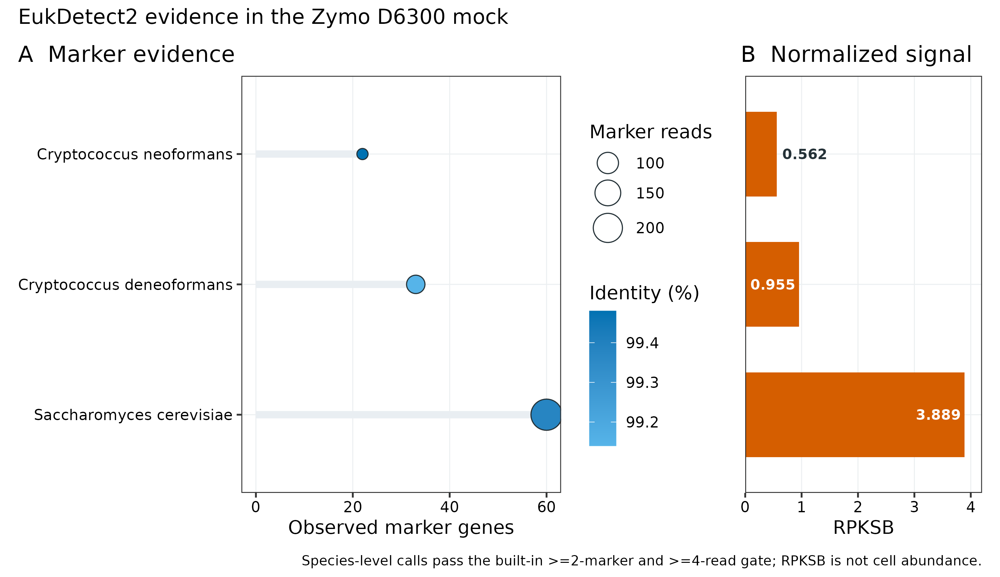
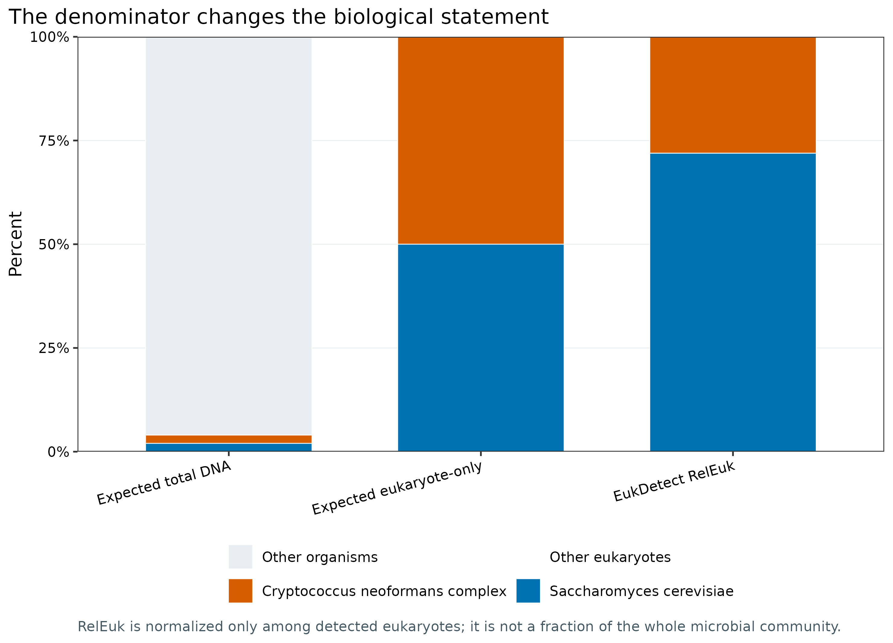
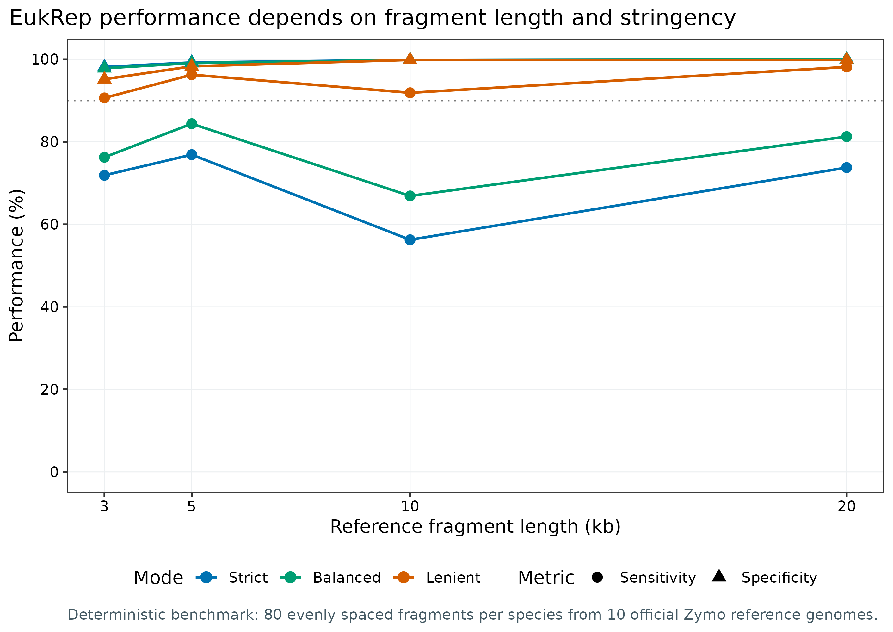
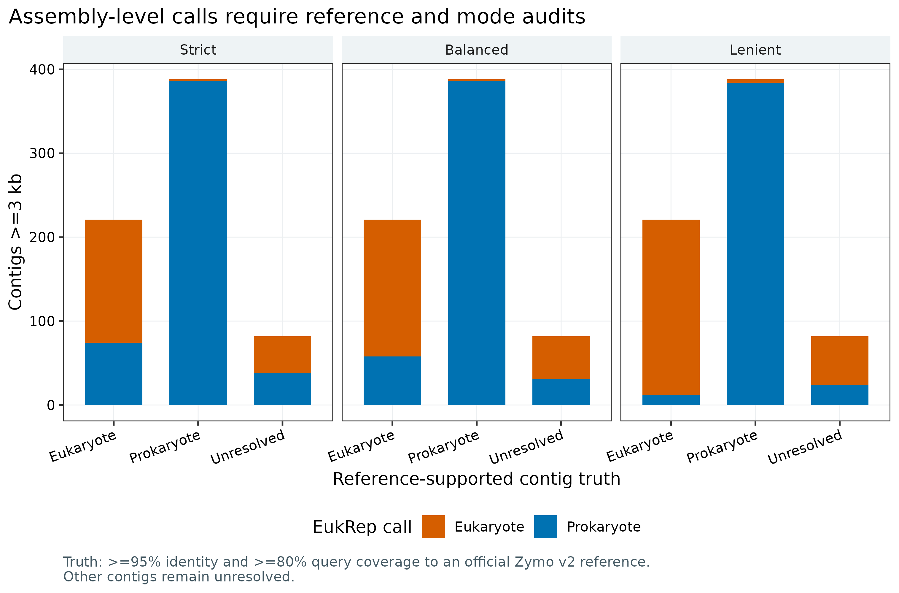
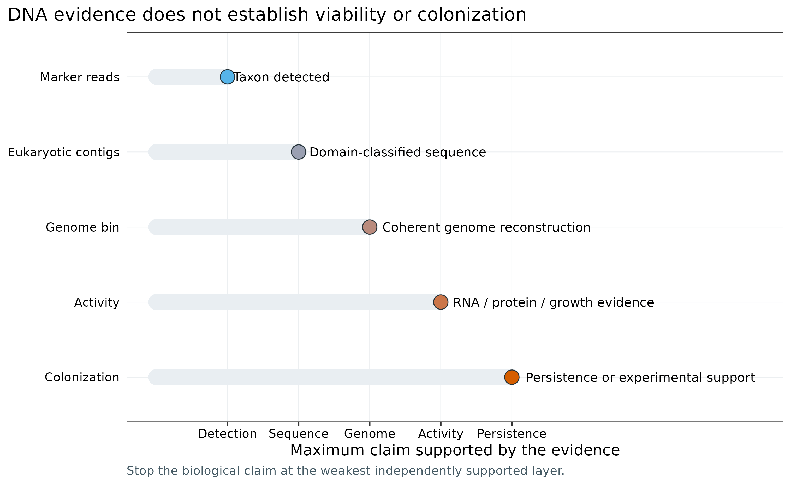

> **先给结论：**EukDetect2 与 EukRep 回答的是两个不同问题。EukDetect2 从 reads 到真核 marker genes，适合回答“样本中检出了哪个真菌或原生生物”；EukRep 从 assembled contigs 到 Eukaryote/Prokaryote，适合回答“哪些序列可进入真核后续分析”。前者不能恢复基因组，后者不提供物种分类，也不提供丰度。两者都只处理 DNA 证据：不能证明活性，不能证明定植，更不能把一次粪便检出直接写成宿主共生。

真实 ZymoBIOMICS D6300 数据给出了一个有真值的压力测试。EukDetect2 在前 100 万对 reads 中找回 *Saccharomyces cerevisiae* 和 *Cryptococcus neoformans* complex 两个预期目标，没有非预期物种通过最终过滤。前 2000 万对 reads 经 MEGAHIT 组装后得到 4,222 条 ≥1 kb contigs；691 条达到 EukRep 的 3 kb 门槛，其中 609 条可用官方参考基因组定真值。Balanced 模式对 221 条真核 contigs 的 sensitivity 为 73.76%，对 388 条原核 contigs 的 specificity 为 99.48%。这组数字是当前 mock、当前组装与当前真值门限下的审计结果，不是自然群落的通用性能承诺。

::: {.callout-important title="算力、磁盘与数据门槛"}
只读取 `data/small/58-microbial-eukaryotes-frozen/` 并重画 5 组图，建议 **4 CPU、4 GB RAM、1 GB 可用磁盘，耗时约 1 分钟**。完整复现需要下载约 **6.02 GB** 压缩双端 FASTQ、21.45 MB 官方参考压缩包和 **7,123,869,920 bytes** 的 EukDetect2 数据库；解压 FASTQ、质控副本、组装中间图与日志会继续占用空间，建议至少 **100 GB 磁盘**。

本次实跑中，fastp 的 100 万对/2000 万对分支分别耗时 88.09 s/121.56 s，峰值 1.27/1.37 GiB RAM；EukDetect2 耗时 59.32 s、峰值 3.25 GiB；MEGAHIT 使用 **32 CPU、显式 60 GB memory ceiling**，实际耗时 1,599.23 s、峰值 7.08 GiB。正式队列建议 **16--32 CPU、32--64 GB RAM、每样本或每共组装 100 GB 以上临时磁盘**。没有服务器时，先用固化证据表完成统计与作图；read-based 检出可在小型云主机跑子集，组装和大队列放到 HPC/云端批处理。
:::

## 这一步对应论文里的哪张图 {#sec-target}

EukDetect 原始论文的 **Figure 1** 展示细菌数据库会怎样把真核 reads 错配为细菌信号，**Figure 2** 描述 marker 数据库的构建，**Figure 3** 用模拟与真实数据校准多 marker 检出阈值 [@lind2021eukdetect]。这三部分共同说明：低丰度真核检出不能只看“有几条 reads 命中”，必须同时检查 marker 分散度、reads 数、比对质量与近缘分类单元之间的重分配。

EukDetect2 在 2026 年预印本中扩充参考库并加入跨样本可比的 RPKSB 与真核内部相对丰度 RelEuk；其 Figures 1--3 分别覆盖方法更新、定量评估和全球人群应用 [@shih2026eukdetect2]。截至本分析日期，它仍是预印本，因此软件输出可以用于可重复分析，但新指标的外部验证状态要在 Methods 与 Discussion 中如实说明。数据库使用 2026-03-16 release，共 14 个文件、6,948 个代表基因组、6,594 个 species-level units；完整 release 以 Zenodo DOI 和逐文件 MD5 锁定 [@shih2026eukdetect2db]。

EukRep 论文以 k-mer composition 与 linear SVM 把 metagenomic scaffolds 分为 eukaryotic/prokaryotic，并展示序列长度和 stringency 对 sensitivity/false-positive rate 的影响；后续再从真核序列中进行基因组重建 [@west2018eukrep]。它对应的是 **sequence partitioning**，不是物种 profiling。

本次复现把三类论文图合成一条可审计证据链：marker-read 物种证据、不同定量分母、EukRep 长度/模式基准、真实组装审计，以及“当前证据最多允许写到哪里”。

{#fig-58-marker-evidence}

## 理论：同一份 shotgun DNA 的两条真核路线 {#sec-theory}

### 1. 为什么真核微生物容易在常规宏基因组流程里消失

真菌、原生生物与微型后生动物不是“另一批细菌”。它们常同时具有以下难点：

- 细胞壁、孢子或囊体造成裂解效率差异，提取偏倚可能大于统计效应；
- 宿主、食物和环境真核 DNA 与目标微生物同属 Eukaryota，简单的“去人 reads”不能完成生物学归属；
- 真核基因组更大，重复、杂合、倍性变化与内含子增加组装和 gene calling 难度；
- 数据库覆盖远低于细菌，近缘物种可能共享保守 marker，而未知类群没有可映射参考；
- DNA 在样本中出现，可能来自活细胞、死细胞、食物、环境暴露或短暂停留。

粪便 eukaryome 的系统研究已经显示，检出率强烈依赖 reference database、过滤规则和样本处理，低流行率结果尤其需要阴性对照与人工审计 [@crouch2024eukaryome]。

### 2. EukDetect2：用多个 marker 支持“检出哪个 taxon”

EukDetect2 把 reads 比对到真核 marker reference，去除低质量、低复杂度和重复证据，再处理祖先/后代 taxon 的共享 reads。最终 species-level call 至少需要 **2 个 marker genes** 和 **4 条 reads**；因此“20 条 reads 全落在同一个保守 marker”仍不能通过主过滤。结果表应同时保留：

- `Observed_markers`：独立 marker 的数量；
- `Reads_aligned`：直接分配的 reads；
- `Reads_reassigned`：从共享/祖先节点重分配的 reads；
- `Total_reads`：直接与重分配证据之和；
- percent identity 与 marker coverage；
- RPKS、RPKSB 和 RelEuk。

三个丰度字段的分母不同。令 taxon 的 assigned marker reads 为 (r_t)，可用 marker 总长度为 (L_t) kb，样本质控后总测序碱基为 (B)：

\[
\mathrm{RPKS}_t = \frac{r_t}{L_t}, \qquad
\mathrm{RPKSB}_t = \frac{\mathrm{RPKS}_t}{B/10^9}, \qquad
\mathrm{RelEuk}_t = 100\frac{\mathrm{RPKSB}_t}{\sum_j \mathrm{RPKSB}_j}.
\]

RPKSB 适合在 library size 不同的样本间比较 marker signal；RelEuk 的分母只有通过过滤的真核 taxa。它们都不是细胞丰度：不同物种的 genome copy number、ploidy、marker recovery、裂解效率与 DNA 输入量不相同。

Zymo D6300 的理论 genomic DNA 组成为八种细菌各 12%、*S. cerevisiae* 2%、*C. neoformans* 2% [@zymo2026d6300]。因此，“总 DNA 分母”下两个真核各占 2%；改成“预期真核内部”才是 50%/50%。本次 EukDetect RelEuk 为 71.93%/28.07%，只能解释为 marker-space 内部比例发生偏移，不能说酵母细胞数是隐球菌的 2.56 倍。

{#fig-58-denominator}

### 3. EukRep：用 sequence composition 回答“哪条 contig 像真核”

EukRep 将 scaffold 切成最长 **5 kb chunk**，计算 k-mer frequency，由训练好的 linear SVM 对每个 chunk 分类，再用多数票给整条 scaffold 定类 [@west2018eukrep]。三种 mode 的方向是：

| Mode | 目标 | 常见代价 | 适合场景 |
|---|---|---|---|
| Strict | 降低原核误报 | 漏掉更多真核序列 | 构建高置信真核候选集 |
| Balanced | 折中 sensitivity/specificity | 两类错误都存在 | 默认探索与审计 |
| Lenient | 提高真核召回 | 原核误报增加 | 后续还有强力验证时 |

`--min` 的含义容易误读：EukRep 0.6.7 把它应用于**内部 5 kb chunk**，不是只在输入 scaffold 层做长度过滤。若设置 `--min 10000`，每个 5 kb chunk 都小于门槛，程序会产生两个空文件并返回 **exit code 0**。所以 3/5/10/20 kb benchmark 全部固定 `--min 3000`，只改变输入 fragment length。

另一个确定性风险是 tie。两块 5 kb 序列一真一原时，默认把平票判为 eukaryotic；这里显式使用 `--tie prok`，避免把平票悄悄推向目标类别。不要使用随机 tie；若确有需要，先确认工具能固定 seed，并把规则写入 Methods。

### 4. 两条路线怎样衔接

```{=html}
<table class="table table-striped">
<thead><tr><th>证据对象</th><th>工具</th><th>直接输出</th><th>能支持的结论</th><th>不能支持的结论</th></tr></thead>
<tbody>
<tr><td>Marker reads</td><td>EukDetect2</td><td>Taxon、marker/read counts、RPKSB、RelEuk</td><td>Taxon detected</td><td>完整 genome、活性、定植</td></tr>
<tr><td>Assembled contigs</td><td>EukRep</td><td>Eukaryote/Prokaryote partition</td><td>Domain-classified sequence</td><td>物种分类、丰度、MAG 质量</td></tr>
<tr><td>Eukaryotic bin</td><td>binning + BUSCO/EukCC</td><td>Genome completeness/contamination</td><td>Coherent genome reconstruction</td><td>活性、致病性</td></tr>
<tr><td>RNA/protein/growth</td><td>正交实验</td><td>表达或生长证据</td><td>Activity/viability supported</td><td>长期定植，除非有纵向证据</td></tr>
</tbody>
</table>
```

EukRep 筛出的序列若要继续 gene discovery，可用 MetaEuk 处理真核 gene structure [@levykarin2020metaeuk]；若进一步重建 genome，应使用 BUSCO 的谱系标志基因 [@manni2021busco] 或 EukCC 的真核 MAG 完整度/污染评估 [@saary2020eukcc]。细菌 MAG 的单套 marker 规则不能直接搬来给真核 genome 定级。

## 准备工作 {#sec-preparation}

真实输入包括 BioProject **PRJNA648136** 的 run **SRR12324253** 和 ZymoBIOMICS reference genomes v2（DOI **10.5281/zenodo.3935737**）[@zymo2020refgenomes]。双端 FASTQ 的固定身份是：

| File | Bytes | MD5 |
|---|---:|---|
| `SRR12324253_1.fastq.gz` | 3,013,365,268 | `1485049c9792c7e43d267fe7bb84a2bd` |
| `SRR12324253_2.fastq.gz` | 3,010,771,717 | `fbd8494da79fc796d6725a4e242a9b9c` |
| `ZymoBIOMICS.STD.refseq.v2.zip` | 21,453,226 | `be18fd9195379082096061b8249489b3` |

SRR12324253 原始数据含 51,466,358 reads（约 25.73 million pairs）。为使两条路线的成本清楚可控，EukDetect2 使用确定性的前 1,000,000 pairs；组装使用前 20,000,000 pairs。不是随机下采样，run contract 仍记录 `seed = 20260758`，且 `random_output_requested = false`。

<details>
<summary><strong>安装精确环境、数据库与内联作图函数</strong></summary>

~~~bash
# EukDetect2：211-URL Linux exact lock + 单独 hash-locked compatibility wheel
conda create --name metagenome-microbial-eukaryotes-2026.07 \
  --file env/microbial-eukaryotes-linux-64.lock
conda run -n metagenome-microbial-eukaryotes-2026.07 \
  python -m pip install --require-hashes \
  -r env/microbial-eukaryotes-pip-lock.txt

# EukRep 的已发表模型依赖 Python 3.6 / scikit-learn 0.19.2，单独隔离
conda create --name metagenome-eukrep-legacy-2026.07 \
  --file env/eukrep-legacy-linux-64.lock

# fastp、MEGAHIT 与 minimap2 的 exact locks
conda create --name metagenome-read-qc-2026.07 \
  --file env/read-qc-linux-64.lock
conda create --name metagenome-assembly-2026.07 \
  --file env/assembly-linux-64.lock

# EukDetect2 database release 2026-03-16：14 files / 7,123,869,920 bytes
db/download_db.sh eukdetect2-install
db/download_db.sh eukdetect2-verify
~~~

~~~r
install.packages(c(
  "ggplot2", "dplyr", "readr", "tidyr",
  "scales", "patchwork"
))

library(ggplot2)
library(dplyr)
library(readr)
library(tidyr)
library(scales)
library(patchwork)
set.seed(20260758)

pal_pub <- c(
  "Blue" = "#0072B2", "Orange" = "#D55E00",
  "Green" = "#009E73", "Sky" = "#56B4E9",
  "Yellow" = "#E69F00", "Purple" = "#CC79A7",
  "Gray" = "#7A7A7A", "Light" = "#E9EEF2",
  "Dark" = "#253238", "White" = "#FFFFFF"
)
scale_color_pub <- function(...) scale_color_manual(values = pal_pub, ...)
scale_fill_pub  <- function(...) scale_fill_manual(values = pal_pub, ...)
theme_pub <- function(base_size = 12) {
  theme_bw(base_size = base_size) + theme(
    panel.grid.minor = element_blank(),
    panel.grid.major = element_line(color = "#ECEFF1", linewidth = 0.3),
    axis.text = element_text(color = "black"),
    legend.key = element_blank(),
    strip.background = element_rect(fill = "#EEF3F5", color = NA),
    plot.title.position = "plot",
    plot.caption = element_text(color = "#455A64", hjust = 0)
  )
}
save_pub <- function(plot, file_base, width = 205, height = 145,
                     units = "mm", dpi = 350) {
  dir.create(dirname(file_base), recursive = TRUE, showWarnings = FALSE)
  ggsave(paste0(file_base, ".pdf"), plot, width = width, height = height,
         units = units, device = cairo_pdf, bg = "white")
  ggsave(paste0(file_base, ".png"), plot, width = width, height = height,
         units = units, dpi = dpi, bg = "white")
  ggsave(paste0(file_base, ".tiff"), plot, width = width, height = height,
         units = units, dpi = dpi, compression = "lzw", bg = "white")
  invisible(plot)
}
~~~

</details>

### 先核验固化证据

`data/small/58-microbial-eukaryotes-frozen/` 保存输入/数据库审计、命令与资源账本、EukDetect2 核心输出、EukRep name partitions、所有汇总表、环境锁和脚本。大型 FASTQ、7.12 GB 数据库、未压缩 2000 万对 reads 与 MEGAHIT assembly 不重复打包；其来源、bytes、checksum、命令和派生结果都保留在证据包中。

~~~bash
FROZEN="$PWD/data/small/58-microbial-eukaryotes-frozen"

sha256sum -c "$FROZEN/file-checksums.sha256"
column -ts $'\t' "$FROZEN/asset-check-audit.tsv"
column -ts $'\t' "$FROZEN/database-audit.tsv" | head
column -ts $'\t' "$FROZEN/eukdetect-species-evidence.tsv"
column -ts $'\t' "$FROZEN/assembly-summary.tsv"
cat "$FROZEN/summary.json"
~~~

物种证据表的前三行应为：

~~~text
Name                       ObservedMarkers  TotalMarkerReads  RPKSB     RelEukPercent
Saccharomyces cerevisiae   60               235               3.888756  71.9328
Cryptococcus deneoformans  33               77                0.954751  17.6621
Cryptococcus neoformans    22               53                0.562387  10.4050
~~~

## 可复制代码：从公开 reads 到双路线证据表 {#sec-code}

### 第 1 步：下载并通过 bytes + MD5 gate

~~~bash
ROOT="$PWD"
WORK="$ROOT/work/article58"

# 三个源文件约 6.05 GB；脚本支持断点续传，最终必须通过 byte/MD5 gate
DOWNLOAD_ARTICLE58_EUKARYOTES=1 bash data/download.sh

# 14 个数据库文件逐一校验；中途网络中断不会把 .part 文件当成完成品
db/download_db.sh eukdetect2-install
db/download_db.sh eukdetect2-verify
~~~

下载脚本同时检查文件大小和 MD5。一次 TLS/代理中断最多留下可续传的 `.part`；只有完整 checksum 通过后才原子重命名为正式文件。因此，“命令退出过一次”与“数据已损坏”不能画等号，最终 checksum gate 才是判据。

### 第 2 步：准备两个 read branches 与确定性 reference benchmark

~~~bash
python3 scripts/prepare_article58_eukaryotes.py \
  --project-root "$ROOT" \
  --work-dir "$WORK" \
  --raw-dir data/raw/article58 \
  --source-manifest data/small/58-eukaryote-source-manifest.tsv \
  --eukdetect-pairs 1000000 \
  --assembly-pairs 20000000

column -ts $'\t' "$WORK/prepared-fastq-audit.tsv"
column -ts $'\t' "$WORK/reference-sequence-ledger.tsv" | head
column -ts $'\t' "$WORK/eukrep-fragment-ledger.tsv" | head
~~~

官方 v2 reference archive 含 10 个物种、7,218 条 reference sequences；两个真核 draft references 贡献 7,205 条序列，八个原核 references 共 13 条。EukRep 校准集在每个物种内确定性选择 80 个互不重叠、均匀分布的 3/5/10/20 kb fragments，共 3,200 条。每个长度层有 160 条 Eukaryote truth 与 640 条 Prokaryote truth。

这个 benchmark 刻意不靠随机抽样；它回答“同一 mock 的不同长度区域在三种 mode 下怎样被分类”。它不等于独立外部测试集，也不代表数据库未知的环境真核。

### 第 3 步：运行 EukDetect2、MEGAHIT、EukRep 与参考审计

~~~bash
EUK_DB="$ROOT/db/microbial-eukaryotes-cache/eukdetect2-v2026-03-16"

python3 scripts/run_article58_eukaryotes.py \
  --project-root "$ROOT" \
  --work-dir "$WORK" \
  --eukdetect-db "$EUK_DB" \
  --database-manifest data/small/58-eukdetect2-database-manifest.tsv \
  --eukdetect-env "$HOME/miniconda3/envs/metagenome-microbial-eukaryotes-2026.07" \
  --eukrep-env "$HOME/miniconda3/envs/metagenome-eukrep-legacy-2026.07" \
  --assembly-env "$HOME/miniconda3/envs/metagenome-assembly-2026.07" \
  --read-qc-env "$HOME/miniconda3/envs/metagenome-read-qc-2026.07" \
  --threads 16 \
  --assembly-threads 32

column -ts $'\t' "$WORK/tool-versions.tsv"
column -ts $'\t' "$WORK/command-log.tsv"
~~~

核心 read-based 命令是：

~~~bash
eukdetect single \
  -1 eukdetect.R1.fastq.gz \
  -2 eukdetect.R2.fastq.gz \
  -n Zymo_D6300 \
  --outdir results/eukdetect \
  --database "$EUK_DB" \
  --cores 16 \
  --force

eukdetect-normalize \
  --eukfrac results/eukdetect/Zymo_D6300_filtered_hits_eukfrac.txt \
  --library-sizes results/library-sizes-post-qc.tsv \
  --output results/eukdetect/Zymo_D6300.normalized.tsv
~~~

`library-sizes-post-qc.tsv` 必须有 header，且本次分母是两端合计的 **298,193,028 post-QC bases**，不是 reads 数。EukDetect conda record 报 2.0.2，Python distribution metadata 报 2.0.0，CLI banner 报 `v2.0.1`；三者不一致，所以 `tool-versions.tsv` 原样保留全部值。Python 3.13 还需要 hash-locked `legacy-cgi 2.6.4` 才能让依赖 ETE3 的 taxonomy step 正常运行。

核心 contig-based 命令是：

~~~bash
megahit \
  -1 assembly.R1.fastq \
  -2 assembly.R2.fastq \
  -o results/megahit-memory60g \
  --presets meta-sensitive \
  --min-contig-len 1000 \
  --memory 60000000000 \
  -t 32

EukRep \
  -i results/megahit-contigs.oneline.fna \
  -o results/eukrep-assembly/megahit.balanced.euk.names \
  --prokarya results/eukrep-assembly/megahit.balanced.prok.names \
  --seq_names \
  --min 3000 \
  -m balanced \
  --tie prok \
  -ff

minimap2 -x asm5 --secondary=no -t 32 \
  -o results/megahit-to-zymo-v2.paf \
  references/zymo-v2-all-references.fna \
  results/megahit-contigs.oneline.fna
~~~

MEGAHIT 若不显式限制 memory，会把机器总内存的默认比例当作预算；在大内存节点上这会申请远高于任务实际需要的空间。本次固定 60,000,000,000 bytes ceiling，并把曾中止的默认配置日志单独保留。真实 reference truth gate 预先固定为 identity ≥95% 且 query coverage ≥80%。PAF identity 用 matches/alignment block，query coverage 用 `(qend-qstart)/query length`；不能用 alignment block/query length，因为 indel 会制造 >100% 的假覆盖率。

### 第 4 步：汇总并核对真实结果

~~~bash
python3 scripts/summarize_article58_eukaryotes.py \
  --project-root "$ROOT" \
  --work-dir "$WORK"

column -ts $'\t' "$WORK/summary/eukdetect-detection-audit.tsv"
column -ts $'\t' "$WORK/summary/eukrep-reference-metrics.tsv"
column -ts $'\t' "$WORK/summary/eukrep-assembly-metrics.tsv"
column -ts $'\t' "$WORK/summary/resource-usage.tsv"
~~~

EukDetect2 最终表有三个 species names：

- *S. cerevisiae*：60 markers、235 total marker reads、99.38% mean identity、RPKSB 3.888756、RelEuk 71.9328%；
- *C. deneoformans*：33 markers、77 reads、99.14% identity、RPKSB 0.954751、RelEuk 17.6621%；
- *C. neoformans*：22 markers、53 reads、99.48% identity、RPKSB 0.562387、RelEuk 10.4050%。

标准品标签中的 *C. neoformans* 在当前数据库中跨越两个近缘 species labels。主图把后两者合并为 **Cryptococcus neoformans complex = 28.0671% RelEuk**，但原始名称、TaxID 与各自证据列仍保留。`all_hits` 中 *C. tetragattii*、*S. arboricola* 和 *S. mikatae* 只有 1 个 marker；它们没有被提升为最终物种检出，说明多 marker gate 正在阻止近缘/共享信号过度解释。

参考片段 benchmark 的 Balanced sensitivity/specificity 分别为：3 kb 76.25%/97.81%，5 kb 84.38%/99.06%，10 kb 66.88%/99.84%，20 kb 81.25%/100%。10 kb 并未比 5 kb 更好，因为它正好由两个 5 kb chunks 投票，冲突时 `--tie prok` 会降低 eukaryote sensitivity。长度效应不是必然单调关系。

{#fig-58-reference-benchmark}

真实组装含 4,222 条 ≥1 kb contigs、总长 37,166,382 bp、N50 122,804 bp；691 条达到 3 kb。参考审计把其中 221/388 条分别定为 Eukaryote/Prokaryote，82 条保留 Unresolved。三种 mode 在已解析 truth 上的表现为：

| Mode | Sensitivity | Specificity | Precision |
|---|---:|---:|---:|
| Strict | 66.52% | 99.48% | 98.66% |
| Balanced | 73.76% | 99.48% | 98.79% |
| Lenient | 94.57% | 98.97% | 98.12% |

这些指标只对能被官方 mock references 高覆盖解释的 609 条 contigs 计算。82 条 Unresolved 仍显示 EukRep calls，但不强行计入真阳/假阳；它们可能是低覆盖、组装误差、参考差异或低复杂度片段。

{#fig-58-assembly-audit}

### 第 5 步：冻结、作图与 fail-closed 验收

~~~bash
Rscript scripts/plot_article58_eukaryotes.R \
  "$WORK/summary" figures

python3 scripts/freeze_article58_eukaryotes.py \
  --project-root "$ROOT" \
  --work-dir "$WORK" \
  --output-dir data/small/58-microbial-eukaryotes-frozen

python3 scripts/validate_article58_eukaryotes.py \
  --project-root "$ROOT" \
  --frozen-dir data/small/58-microbial-eukaryotes-frozen \
  --output-dir /tmp/article58-validation \
  --figure-dir figures \
  --chapter chapters/58-microbial-eukaryotes.qmd
~~~

验收器会重新计算 frozen checksums，并硬检查 14 个数据库文件、3 个源资产、3,200 个 fragments、9,600 条 reference calls、2,073 条 assembly-mode calls、21 条资源记录、版本三联表、figure DPI/尺寸，以及每个 EukRep euk/prok 输出是否互斥且完整覆盖预期序列。空输出即使 exit code 0 也不能通过。

## 审计与升级 {#sec-audit}

### 1. 先忠实复现，再区分 EukDetect 与 EukDetect2

EukDetect 的核心贡献是用多个 conserved marker genes 防止单个位点噪声和细菌错配 [@lind2021eukdetect]。EukDetect2 沿用 marker 证据框架，但扩充数据库、调整工作流并加入 RPKSB/RelEuk [@shih2026eukdetect2]。报告时不能只写“EukDetect”而省略代际；数据库 release 与软件构建共同决定 taxon names、marker space 和数值分母。

当前环境还有一个不能掩盖的 packaging discrepancy：conda record 2.0.2、Python metadata 2.0.0、CLI `v2.0.1`。这不自动说明分析错误，但说明单写一个“version 2”不足以复现。最稳做法是同时保存 exact lock、conda record、CLI banner、database DOI 与命令日志。

### 2. Taxonomy upgrade 不能破坏原始证据

标准品写 *C. neoformans*，当前数据库把 reads 分到 *C. deneoformans* 与 *C. neoformans*。合并到 species complex 有利于与 mock truth 对齐，但必须满足两点：

1. 原始 name、TaxID、marker/read counts 与 database release 不被覆盖；
2. aggregation rule 在看组间差异前固定，并在所有样本一致执行。

真实队列还应处理 synonym、species complex 与 database update；否则同一生物信号可能因版本变更被拆成两行，制造假时间趋势或假队列差异。

### 3. 定量升级：报告三个分母，加入 spike-in/绝对量

RPKS 是 marker-length normalized signal；RPKSB 再除以总测序碱基；RelEuk 再归一到已检出真核内部。论文主表至少保留 `marker count + total reads + RPKSB + RelEuk + prevalence`，而不是只留百分比。

若研究问题是 absolute load，应加入已知量的外源 spike-in、样本质量/体积、提取回收率或 qPCR/ddPCR。即使如此，也要验证不同真核细胞壁和 ploidy 的回收偏倚。标准品理论 genomic DNA 比例也不是细胞比例。

### 4. EukRep 升级：候选生成后必须有第二证据

EukRep 0.6.7 是 2018 年模型，依赖旧版 Python/scikit-learn；它适合作为快速 sequence partition，但不应成为最终 taxonomic or genome-quality judge。升级路径取决于目标：

- 只要真核 coding sequences：EukRep partition 后运行 MetaEuk，并用蛋白域/同源证据复核；
- 要真核 MAG：结合 coverage、composition、paired/long-read links 分箱，再用 BUSCO/EukCC 评估谱系完整度与污染；
- 要 species assignment：用 protein-level phylogeny、marker phylogeny 或与高质量 reference 的全基因组证据，不能把 `Eukaryote` 标签改名成某个物种；
- 要 cohort abundance：reads 回比到经去冗余、去污染的真核 references，预注册 identity、breadth 和 multimapping policy。

本次 exact-reference benchmark 的 references 可能与模型训练空间相近，且只有 10 个标准品物种；因此可用于发现参数陷阱和比较 modes，不能宣称自然环境 sensitivity 是 73.76%。

### 5. 生物学升级：把存在、活性与定植分开

DNA marker reads 的结论上限是 “taxon detected”；eukaryotic contigs 的上限是 “domain-classified sequence”；高质量 genome bin 才能谈 genome reconstruction。RNA、protein、代谢或培养证据可支持 activity/viability，纵向重复、干预或空间证据才开始支持 persistence/colonization。

{#fig-58-evidence-ladder}

阴性 extraction controls、library blanks 和 batch controls 必须与样本一起走完整流程；真菌孢子、环境酵母和实验室试剂污染不能仅靠“不是人 DNA”排除。人体样本还要记录饮食、抗真菌药、免疫状态和采样时间，避免把瞬时摄入误写为稳定共生。

## 出版级美化 {#sec-publication}

五组图使用色盲友好的 blue/orange/green 体系，图内文字全部为英文。每张图只承担一个判断：

1. marker evidence 图同时展示 marker breadth、read support、identity 与 RPKSB；
2. denominator 图把 total DNA、eukaryote-only 与 RelEuk 并排，防止百分比偷换分母；
3. reference benchmark 用 color 表示 mode、shape 表示 metric，避免 6 条线仅靠颜色区分；
4. assembly audit 把 resolved truth 与 unresolved 分开，不把未知强行当负类；
5. evidence ladder 直接标出 claim ceiling，适合作为 Discussion 或 graphical checklist。

~~~r
frozen <- "data/small/58-microbial-eukaryotes-frozen"

evidence <- readr::read_tsv(
  file.path(frozen, "eukdetect-species-evidence.tsv"),
  show_col_types = FALSE
)
metrics <- readr::read_tsv(
  file.path(frozen, "eukrep-reference-metrics.tsv"),
  show_col_types = FALSE
)

# 完整绘图代码读取同一 frozen tables，并导出 PDF + 350-dpi PNG/TIFF
system2("Rscript", c(
  "scripts/plot_article58_eukaryotes.R",
  frozen,
  "figures"
))
~~~

投稿时优先使用 `.pdf` 矢量图；需要 raster 的期刊使用 350 dpi `.tiff` 且 `compression = "lzw"`。不要把 species name 缩成只剩首字母；*Cryptococcus* 的两个原始 labels 对解释数据库分类拆分至关重要。图注应写清 mock、read subset、database release、过滤阈值和分母，不能只写 “relative abundance”。

## 常见坑：审稿人会追问什么 {#sec-pitfalls}

::: {.callout-caution title="坑 1：把 RelEuk 写成群落细胞比例"}
RelEuk 的分母是通过过滤的真核 taxa，不含 96% 理论细菌 DNA；RPKSB 也只是 marker signal 的 library-size normalization。正文、轴标签与 Methods 都要写出分母。
:::

::: {.callout-caution title="坑 2：看到一个近缘 species name 就宣布污染或新定植"}
共享 marker、taxonomy split 和 reassigned reads 会把一个标准品目标分散到多个近缘 labels。先看 `Observed_markers`、TaxID、direct/reassigned reads、identity 与 all-hits tree，再按预注册规则汇总 species complex。
:::

::: {.callout-caution title="坑 3：把 EukRep 输出当物种分类或 abundance table"}
EukRep 不提供物种分类，也不提供丰度。它输出的是 sequence names 的 Eukaryote/Prokaryote partition；物种归属和定量都需要独立流程。
:::

::: {.callout-caution title="坑 4：把 scaffold length 直接传给 --min"}
EukRep 0.6.7 在内部 5 kb chunk 上应用 `--min`。`--min 10000` 会得到空 euk/prok files 并返回 exit code 0。应固定 `--min 3000`，并验证两个输出互斥且 union 等于全部预期 IDs。
:::

::: {.callout-caution title="坑 5：忽略 tie 与随机性"}
默认 tie 会偏向 eukaryotic。这里用 `--tie prok` 明确处理偶数 chunks 的平票，并使用 `seed = 20260758` 的 run contract。分类 benchmark 不能在看完结果后更换 mode。
:::

::: {.callout-caution title="坑 6：把 mock 的 reference audit 当自然群落 ground truth"}
官方 references 让 identity ≥95%、query coverage ≥80% 的 contigs 可以定真值；自然样本没有同等完备的 truth。Unknown/Unresolved 必须保留，不能全部记成 false positive。
:::

::: {.callout-caution title="坑 7：DNA 检出升级成活性、致病或定植"}
一次 DNA 检出可以来自死细胞、食物、环境暴露或试剂污染。活性要 RNA/protein/growth，定植要纵向持续或实验支持，致病还要宿主与机制证据。
:::

## 这段 Methods 怎么写 {#sec-methods}

下面模板中的数字来自 checksum-locked SRR12324253 实跑；换数据时同步替换 accession、subsampling rule、read counts、database release、命令参数和硬件。

**Methods template**

~~~text
Microbial eukaryotes were evaluated using complementary read- and
contig-based workflows. Paired-end reads from ZymoBIOMICS D6300 run
SRR12324253 (BioProject PRJNA648136) and the ZymoBIOMICS reference genomes v2
(Zenodo doi:10.5281/zenodo.3935737) were verified against fixed byte counts
and MD5 checksums. The first 1,000,000 read pairs were quality filtered with
fastp 1.3.6 and analysed with EukDetect2. The installed EukDetect package was
recorded as conda 2.0.2, Python distribution metadata 2.0.0, and CLI banner
v2.0.1. Bowtie2 2.5.4 and the EukDetect2 database release 2026-03-16
(Zenodo doi:10.5281/zenodo.19056625; 14 checksum-verified files) were used.
Species-level calls were retained after the built-in EukDetect2 filtering,
including support from at least two marker genes and four reads. RPKSB was
normalized by 298,193,028 post-QC sequenced bases, whereas RelEuk was
normalized among detected eukaryotic taxa.

For contig-level classification, the first 20,000,000 read pairs were quality
filtered and assembled with MEGAHIT 1.2.9 using the meta-sensitive preset, a
1-kb minimum contig length, 32 threads, and a 60,000,000,000-byte memory
ceiling. Contigs at least 3 kb were classified with EukRep 0.6.7 in strict,
balanced, and lenient modes using --min 3000 and --tie prok. EukRep was run in
an isolated Python 3.6.15/scikit-learn 0.19.2 environment. For a deterministic
reference benchmark, 80 evenly spaced, non-overlapping fragments per species
were selected at each of 3, 5, 10, and 20 kb from ten official reference
genomes (seed contract 20260758; no random selection). Assembly truth was
assigned by minimap2 2.31-r1302 only when the best alignment had >=95%
identity and >=80% query coverage; all other contigs remained unresolved.
~~~

**Results template**

~~~text
EukDetect2 recovered both expected eukaryotic targets. Saccharomyces
cerevisiae was supported by 60 markers and 235 marker reads (RPKSB 3.888756;
RelEuk 71.93%). Cryptococcus evidence was split between C. deneoformans
(33 markers, 77 reads) and C. neoformans (22 markers, 53 reads); the two raw
labels were retained and grouped as the C. neoformans complex for comparison
with the mock specification (combined RelEuk 28.07%). No unexpected species
passed the final species-level filter.

Assembly of 20 million read pairs yielded 4,222 contigs >=1 kb (37.17 Mb;
N50 122,804 bp), of which 691 were >=3 kb. The prespecified reference gate
resolved 221 eukaryotic, 388 prokaryotic, and 82 unresolved contigs. In
balanced mode, EukRep sensitivity, specificity, and precision on the resolved
contigs were 73.76%, 99.48%, and 98.79%, respectively. These estimates are
mock- and threshold-specific and were not interpreted as performance in
reference-incomplete natural communities.
~~~

## 换成你自己的数据怎么做 {#sec-own-data}

### 1. 先按研究问题选路线

- 问“哪些已知真菌/原生生物被检出”：从 clean paired FASTQ 运行 EukDetect2；主表保留 marker breadth、read support、RPKSB、RelEuk 与 prevalence。
- 问“哪些 contigs 可能来自真核”：先组装，再用 EukRep strict/balanced/lenient 产生候选；至少用 protein homology、coverage 或 reference alignment 做第二审计。
- 问“能否恢复真核 genome”：需要更深测序，最好有 long reads；在 sequence partition 后做真核分箱、MetaEuk gene calling、BUSCO/EukCC 质量评估。
- 问“是否活跃/定植/致病”：增加 RNA、protein、培养、显微、纵向或干预证据；DNA 分支不能代替这些数据。

### 2. 你至少还需要这些 metadata 与 controls

| 类型 | 最低要求 | 作用 |
|---|---|---|
| 样本信息 | sample ID、batch、site、时间、宿主/环境 covariates | 控制混杂与重复测量 |
| 提取信息 | kit、bead beating、输入质量/体积 | 解释真菌/囊体裂解差异 |
| 阴性对照 | extraction blank、library blank | 识别低丰度环境/试剂真核 |
| 阳性对照 | mock 或已知 spike-in | 检查 marker 与 sequence branches 是否失效 |
| 测序信息 | paired/single、read length、总 bases、lane | 计算 RPKSB 与 batch audit |
| 生物学证据 | 饮食、药物、免疫状态、时间序列 | 区分暴露、活性与定植 |

### 3. 把 run contract 改成你的项目

复制两个 manifest，并只修改可验证字段：URL/accession、bytes、checksum、database release、预期样本数和下采样规则。不要把“取前 N 对 reads”悄悄换成随机抽样；若需要随机抽样，固定 seed 并记录软件版本。自然样本没有官方 truth 时，可保留以下三级标签：

1. `Reference-supported`：达到预注册 identity/breadth gate；
2. `Orthogonally supported`：protein/marker/coverage 等另一方法支持；
3. `Unresolved candidate`：只有 EukRep 或单一 mapping 证据。

队列分析时，先做 sample × taxon detection/marker matrix，再做 prevalence gate；RPKSB 与 RelEuk 分开建模。病例/对照差异必须纳入 batch、read depth、药物、饮食和其他关键协变量。极低 prevalence taxon 不适合直接套普通 t-test；报告零值结构、有效样本数和多重检验校正。

### 4. 输出最少要交付什么

- software/database/lockfile ledger；
- source asset 与 database checksum manifests；
- species-level marker/read/RPKSB/RelEuk table；
- 原始 taxonomy labels 与预注册 aggregation map；
- EukRep euk/prok partitions 及完整性检查；
- assembly/reference audit 和 Unresolved 列表；
- negative/positive control summary；
- PDF、350 dpi PNG 和 LZW TIFF figures；
- Methods/Results 中明确的 evidence ceiling。

## 参考 {#sec-references}

除上述方法论文外，ZymoBIOMICS 标准品的设计与参考资源背景可参见 @nicholls2019zymo、@zymo2020refgenomes 与 @zymo2026d6300。数据库和软件 release 应随每次分析一起冻结，而不是只引用工具主页。

::: {#refs}
:::
