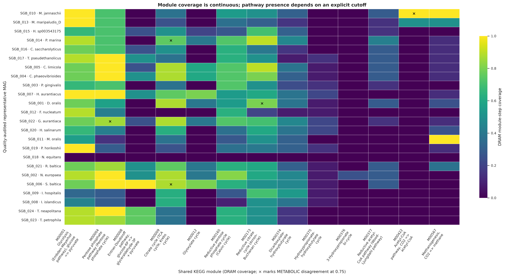
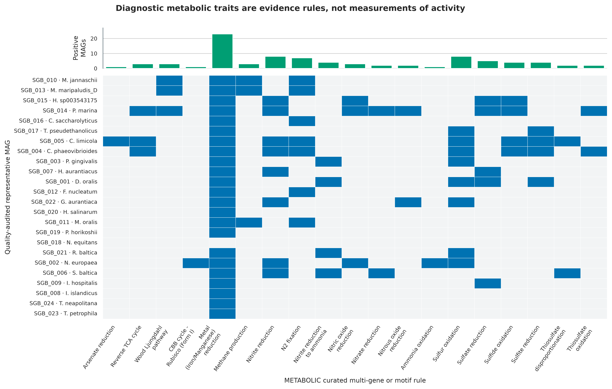
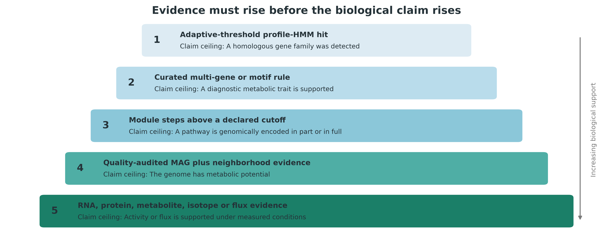
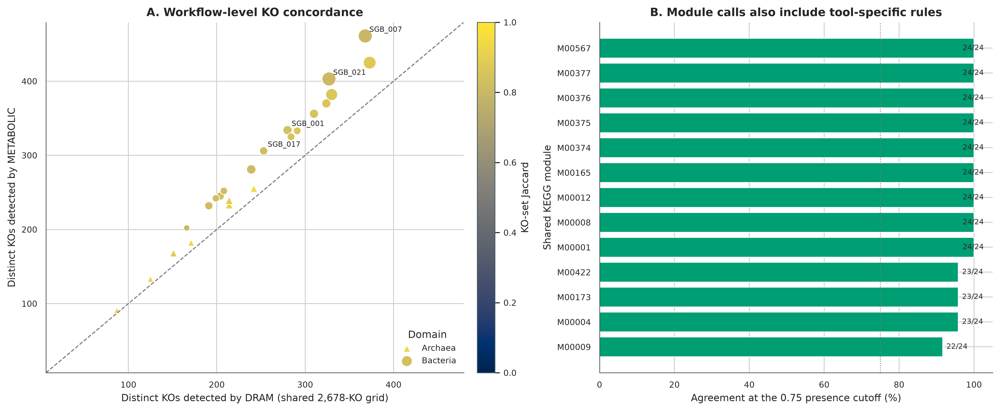
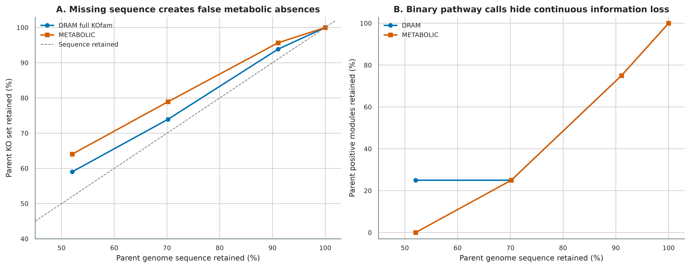
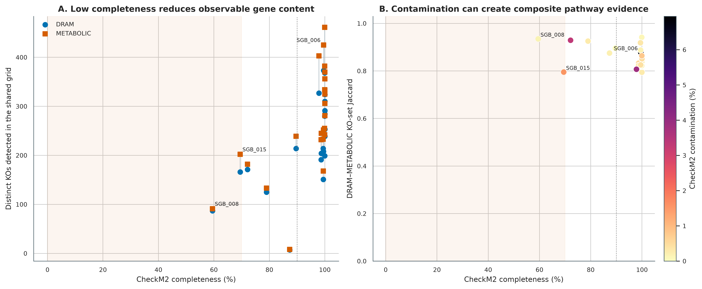

> **先给结论：**DRAM 和 METABOLIC 都能把 MAG 转成代谢注释，但“检出一个同源基因”“一条规则通过”“模块达到完整度阈值”“该 MAG 具有代谢潜力”和“群落正在产生通量”是五个不同强度的结论。这里把 24 个真实、经 CheckM2 和 GTDB-Tk R232 审计的非冗余 MAG 同时交给 DRAM 1.5.0 与 METABOLIC-G v4.0，并用同一份 KOfam 2026-06-01 快照控制数据库差异。在共同 2,678-KO ID 域内，每个 MAG 的 KO-set Jaccard 中位数为 **0.853**（范围 0.794--0.941）；13 个共享 modules 的 312 个 genome-level 判定中有 **307 个一致（98.4%）**。工具间不一致不是应被抹平的噪声，而是需要回到阈值、模块规则、motif、基因邻域和 MAG 质量逐项解释的审计入口。

同一批数据还加入了 *Nitrosomonas europaea* MAG 的 50%、70%、90% 和 100% 确定性 contig 截短分支。这个对照把“基因没有被观察到”与“生物学上真正缺失”分开：序列越不完整，可观察 KO 和完整模块越少；污染偏高时则可能把来自不同细胞的基因拼成一条表面完整的复合通路。DNA 注释最多支持 **metabolic potential**，活性与 flux 必须增加同条件 RNA、蛋白、代谢物、同位素或实验验证。

::: {.callout-important title="算力、磁盘与数据库门槛"}
只读取 `data/small/59-dram-metabolic-frozen/`、复算汇总并重画 6 组图，建议 **4 CPU、8 GB RAM、2 GB 可用磁盘，耗时约 2--5 分钟**。完整复现需要约 **31 GB** 的 KOfam 原始/解压文件与 DRAM pressed database，另需 METABOLIC、dbCAN、MEROPS 和运行中间文件；建议至少 **80 GB 高速磁盘**。

本次 28 个 genome inputs 在大内存节点上使用 DRAM **24 个并行分片 × 每片 3 threads**，总 CPU ceiling 为 72；METABOLIC-G 使用 32 threads。建议为这一并行配置预留 **192--256 GB RAM、72 CPU、80 GB 磁盘和 30--60 分钟**。普通服务器可把 `--dram-jobs` 降到 4--8，并为每个 KOfam scan 预留约 8 GB RAM，代价是延长 wall time。实测 DRAM annotation wall time 为 **41 min 50.94 s**，merge 为 2.85 s，distill 为 56.98 s；METABOLIC 的独立 Prodigal 步骤为 **2 min 10.39 s**，METABOLIC-G 为 **13 min 01.69 s**。数据库构建与全部步骤的 GNU-time 账本保存在固化包。没有服务器时，先用固化的 `annotations.tsv.gz`、`product.tsv`、六张 METABOLIC worksheets 和每基因组 KO 表完成统计与作图；完整 HMM 搜索放到 HPC 或云端批处理。
:::

## 这一步对应论文里的哪张图 {#sec-target}

DRAM 原始论文的 **Figure 1** 是从 raw genomes 到 annotation、distillate 与 product 的工作流，**Figure 2** 展示单基因与代谢类别的 genome-centric 汇总，**Figure 3** 用 module completion、subunit completion 和 presence/absence heatmaps 比较 genomes，**Figure 4** 把这种证据用于肠道碳利用生态解释 [@shaffer2020dram]。本次首先复现 Figure 3 的核心思想：保留连续 module-step coverage，再在明确的 0.75 cutoff 上比较二元结论。

METABOLIC 论文的 **Figure 1** 给出 genome、HMM、motif、module 与 network 的分析路线，**Figure 2** 将基因组证据组织成 carbon、nitrogen、sulfur 和其他元素循环图 [@zhou2022metabolic]。本次不把循环图当作“实测通量图”，而是把 26 个关键功能规则拆回 genome × function matrix，检查每个 positive cell 的证据来源。

{#fig-59-module-heatmap}

## 理论：从同源基因到代谢潜力，中间有四道门 {#sec-theory}

### 1. Profile HMM 命中首先是序列证据

KOfamKOALA 为每个 KEGG Ortholog（KO）建立 profile hidden Markov model，并提供 profile-specific adaptive score threshold [@aramaki2020kofamkoala]。HMMER 搜索给出的 score、E-value 和 domain alignment 是“该蛋白与某个家族相似”的证据 [@eddy2011hmmer]，但单次命中仍可能遇到：

- 同一保守 domain 被多个功能共享；
- 截短基因只覆盖 HMM 的局部；
- paralog 与真正催化亚基难以区分；
- gene calling 跨 contig 边界而丢失 N/C 端；
- contamination 把另一类群的命中带入当前 bin。

因此第一层结果应保存 gene ID、contig、坐标、strand、score、threshold、alignment 与 competing annotations，不能只留下一个扁平的 KO presence/absence 表。

### 2. 诊断性过程常需要组合规则、motif 与邻域

氮循环、甲烷代谢、硫循环和金属还原常由多亚基复合物、相似酶家族和方向不同的反应共同决定。METABOLIC 在通用 KOfam 之外使用 curated HMMs、multi-gene rules 与部分 motif gates，将 gene-level hits 汇总成 function presence [@zhou2022metabolic]。这比“任意一个 KO 命中即阳性”更接近生物学，但仍需要人工检查：

1. 必需亚基是否齐全，还是只有 accessory subunit；
2. diagnostic residue 或 motif 是否位于高质量 alignment 区域；
3. 基因是否位于合理 operon/neighborhood，而不是分散在可疑 contigs；
4. 同一 contig 的 coverage、GC 和 taxonomy 是否与 MAG 主体一致；
5. 反应方向是否能由基因家族本身确定。

### 3. Module completeness 是连续量，presence 是人为决策

设 module 有 \(S\) 个逻辑 steps，第 \(s\) 个 step 由一个 KO、多个可替代 KO，或多亚基组合满足。DRAM 的简化 module coverage 可写为：

\[
C_m = \frac{1}{S}\sum_{s=1}^{S} I(\text{step }s\text{ is supported}), \qquad 0 \le C_m \le 1.
\]

本次为跨工具审计预先固定 \(C_m \ge 0.75\) 作为 DRAM presence，并使用 METABOLIC-G 的 `-m-cutoff 0.75`。同一个数字不保证两个工具会给出相同结论，因为它们对 alternative routes、complex subunits、module definitions 和上游 gene hits 的处理不同。应同时报告连续 coverage、cutoff 和 missing steps，而不是只导出彩色格子。

对于 genome \(g\)，两套 KO 集合的一致性用 Jaccard 指数：

\[
J_g = \frac{|K_g^{DRAM}\cap K_g^{METABOLIC}|}
{|K_g^{DRAM}\cup K_g^{METABOLIC}|}.
\]

Jaccard 不等于准确率；当两套流程共享数据库但 gene calling、threshold parsing 或 curated rules 不同，它衡量的是 workflow-level concordance。

### 4. MAG 质量限定了“absence”和“完整 pathway”的可信度

本次每个 SGB 都带回 CheckM2 completeness/contamination 与 GTDB-Tk R232 taxonomy。解释规则是：

| MAG 状态 | 对阴性结果的解释 | 对阳性 pathway 的审计 |
|---|---|---|
| Completeness <70% | 不把未检出写成生物学缺失 | 检查是否只剩少数保守步骤 |
| Completeness 70--90% | absence 仅作弱证据 | 报告 missing steps 与 contig 边界 |
| Completeness >=90% | absence 仍是暂定结论 | 检查 gene call、motif 与替代路线 |
| Contamination >=5% | 可能额外检出外源基因 | 检查 pathway 是否由异质 contigs 拼成 |

`SGB_006` 的 CheckM2 contamination 为 6.95%，因此被显式标成 composite-pathway risk；`SGB_008` 和 `SGB_015` completeness 分别为 59.51% 和 69.48%，因此其阴性结果不能升级为物种层面的基因缺失。

{#fig-59-key-processes}

### 5. 证据阶梯决定结论上限

{#fig-59-evidence-ladder}

一个 gene hit 的结论上限是 homologous family detected；curated rule 可以支持 diagnostic trait；达到 cutoff 的模块支持 pathway encoded in part or in full；结合 MAG 质量与邻域审计后才可写“the genome has metabolic potential”。只有 RNA、protein、metabolite、isotope 或 flux evidence 才能把结论推进到 measured condition 下的 activity 或 flux。

## 准备工作 {#sec-preparation}

### 真实输入与固定身份

主分析从 PRJEB52977 的 ERR9765746/ERR9765747 真实 uneven microbial mocks 重建结果开始 [@meslier2022platforms]。124 个通过 minimum QC gate 的候选经 95% ANI dRep 得到 24 个 representatives；这里直接读取 checksum-locked representative FASTA 与 GTDB-Tk R232 ledger，不依赖内存中的上一步对象。

| Analysis set | 数量 | 作用 |
|---|---:|---|
| Primary real MAG | 24 | DRAM/METABOLIC 主比较；含 16 Bacteria、8 Archaea |
| `TRUNC_050/070/090/100` | 4 | `SGB_002` 的确定性 contig-retention sensitivity |
| 合计 | 28 | 两套工具使用序列完全相同、扩展名分别适配各自入口 |

截短以 seed **59002** 打乱 contig order，再依次保留到目标累计长度；实际 sequence retention 为 52.036793%、70.175068%、91.069344% 和 100%。`TRUNC_100` 与 parent FASTA 的序列内容完全相同，是流程确定性的 positive control。随机过程之外，所有输入按 basename 字典序处理。

### 数据库快照

| 资源 | 锁定版本 | 压缩文件身份 |
|---|---|---|
| KOfam profiles | 2026-06-01 | 1,557,643,213 bytes；SHA-256 `038cb13c...c19606f` |
| KOfam `ko_list` | 2026-06-01 | 909,392 bytes；SHA-256 `d418b074...27041a` |
| METABOLIC rules/HMM | v4.0 commit `9723633...191fdbb3` | 三个 source archives 逐文件 SHA-256 |
| dbCAN HMM | 5.2.9, 2026-05-05 | 129,842,960 bytes；SHA-256 `396c791f...baa7a5` |
| MEROPS `pepunit.lib` | file dated 2023-02-22 | 457,531,072 bytes；SHA-256 `5deb3c49...dcd74` |
| DRAM forms | 1.5.0 commit `fe61d75...41b03f1` | 5 个 TSV 逐文件 SHA-256 |

METABOLIC v4.0 请求 2,644 个 KOfam profiles；锁定快照中 `K18513.hmm` 已不存在，因此兼容层只纳入 2,643 个实际存在的 profiles，并把 `K18513` 标为 fail-closed exclusion。METABOLIC 的 per-genome KO grid 有 2,678 行，因为另有 35 个 curated HMM rules 映射到 KO；不能把 2,678 误写成 KOfam profile 数。

<details>
<summary><strong>安装精确环境、下载数据库并内联作图函数</strong></summary>

```bash
# 两套工具隔离，避免 DRAM 的 Python ABI 与 METABOLIC 的 Perl/R 依赖互相覆盖
conda create --name metagenome-dram-2026.07 \
  --file env/dram-linux-64.lock
conda create --name metagenome-metabolic-2026.07 \
  --file env/metabolic-linux-64.lock
# Figure environment: pandas 2.2.3 / matplotlib 3.11.1 / seaborn 0.13.2 / Pillow 12.3.0
conda create --name metagenome-drep-2026.07 \
  --file env/drep-linux-64.lock

# DRAM 1.5.0 必须屏蔽 user-site；环境锁固定 NumPy 1.23.5 与 setuptools 80.10.2
PYTHONNOUSERSITE=1 conda run -n metagenome-dram-2026.07 \
  DRAM-setup.py version
conda run -n metagenome-metabolic-2026.07 hmmsearch -h | head
conda run -n metagenome-metabolic-2026.07 diamond version

# 大数据库不进入 Git；先按 manifest 下载，再以 bytes + SHA-256 双门核验
db/download_db.sh metabolism-install
db/download_db.sh metabolism-verify
column -ts $'\t' data/small/59-metabolism-database-manifest.tsv
sha256sum work/article59/database/kofam-2026-06-01/profiles.tar.gz
sha256sum work/article59/database/kofam-2026-06-01/ko_list.gz
sha256sum work/article59/database/merops-2023-02-22/pepunit.lib
```

```{r}
install.packages(c("ggplot2", "dplyr", "readr", "tidyr", "scales", "patchwork"))
library(ggplot2); library(dplyr); library(readr); library(tidyr); library(scales)
set.seed(20260759)

pal_pub <- c(
  "DRAM" = "#0072B2", "METABOLIC" = "#D55E00",
  "Agreement" = "#009E73", "Review" = "#E69F00",
  "Discordance" = "#CC79A7", "Gray" = "#7A7A7A",
  "Light" = "#EEF3F5", "Dark" = "#253238"
)
scale_color_pub <- function(...) scale_color_manual(values = pal_pub, ...)
scale_fill_pub  <- function(...) scale_fill_manual(values = pal_pub, ...)
theme_pub <- function(base_size = 12) {
  theme_bw(base_size = base_size) + theme(
    panel.grid.minor = element_blank(),
    panel.grid.major = element_line(color = "#ECEFF1", linewidth = 0.3),
    axis.text = element_text(color = "black"),
    legend.key = element_blank(),
    strip.background = element_rect(fill = "#EEF3F5", color = NA),
    plot.title.position = "plot",
    plot.caption = element_text(color = "#455A64", hjust = 0)
  )
}
save_pub <- function(plot, file_base, width = 205, height = 145,
                     units = "mm", dpi = 350) {
  dir.create(dirname(file_base), recursive = TRUE, showWarnings = FALSE)
  ggsave(paste0(file_base, ".pdf"), plot, width = width, height = height,
         units = units, device = cairo_pdf, bg = "white")
  ggsave(paste0(file_base, ".png"), plot, width = width, height = height,
         units = units, dpi = dpi, bg = "white")
  ggsave(paste0(file_base, ".tiff"), plot, width = width, height = height,
         units = units, dpi = dpi, compression = "lzw", bg = "white")
  invisible(plot)
}
```

</details>

### 先核验固化证据

`data/small/59-dram-metabolic-frozen/` 保存输入 ledger、数据库 manifest/compatibility audit、压缩后的 DRAM annotations、DRAM distillate、METABOLIC 六张 worksheets、28 组 KO result/hit tables、命令、日志、资源账本、环境锁和全部汇总表。31 GB 数据库与完整 MAG FASTA 不重复打包；其来源、bytes、checksum 和派生关系均在证据包中。

```bash
FROZEN="$PWD/data/small/59-dram-metabolic-frozen"
sha256sum -c "$FROZEN/file-checksums.sha256"
column -ts $'\t' "$FROZEN/input-mag-ledger.tsv" | head
column -ts $'\t' "$FROZEN/kofam-compatibility-audit.tsv" | grep K18513
column -ts $'\t' "$FROZEN/ko-counts-by-genome.tsv" | head
column -ts $'\t' "$FROZEN/module-agreement-summary.tsv"
cat "$FROZEN/summary.json"
```

## 可复制代码：从 MAG FASTA 到可审计代谢矩阵 {#sec-code}

### 第 1 步：准备 MAG、数据库链接与确定性 sensitivity inputs

```bash
ROOT="$PWD"
WORK="$ROOT/work/article59"
CACHE="$ROOT/db/metabolism-cache"
DRAM_ENV="$HOME/miniconda3/envs/metagenome-dram-2026.07"
METABOLIC_ENV="$HOME/miniconda3/envs/metagenome-metabolic-2026.07"

python3 scripts/prepare_article59_metabolism.py \
  --project-root "$ROOT" \
  --work-dir "$WORK" \
  --kofam-dir "$CACHE/kofam-2026-06-01" \
  --metabolic-dir "$CACHE/sources/METABOLIC" \
  --merops-file "$CACHE/merops-2023-02-22/pepunit.lib" \
  --dbcan-hmm "$CACHE/dbcan-5.2.9/dbCAN.hmm" \
  --dram-source "$CACHE/sources/DRAM" \
  --dram-env "$DRAM_ENV" \
  --metabolic-env "$METABOLIC_ENV"

column -ts $'\t' "$WORK/database-audit.tsv"
column -ts $'\t' "$WORK/input-mag-ledger.tsv" | head
column -ts $'\t' "$WORK/kofam-compatibility-audit.tsv" | grep -E 'Profile|K18513'
```

脚本先核验 12 个数据库资产，再从 `data/small/45-drep-dereplication-frozen/representative-genomes/` 解压 24 个真实 FASTA，并与 `data/small/46-gtdbtk-taxonomy-frozen/taxonomy-summary.tsv` 的 payload SHA-256 对齐。任何一个 genome、release 或 checksum 不匹配都会停止，不会产生部分有效的完成标记。

送入 METABOLIC 的 contig 与 protein identifiers 都带 `genome_id__` 前缀。这个 gate 很重要：parent MAG 与截短 sensitivity genomes 共享原始 contig names；若 gene IDs 不加 genome prefix，合并 HMM 搜索会把重复 ID 归到错误 genome，制造整列假阴性。

### 第 2 步：构建 KOfam-only DRAM database 与 METABOLIC indexes

```bash
python3 scripts/setup_article59_dram_database.py \
  --work-dir "$WORK" \
  --kofam-dir "$CACHE/kofam-2026-06-01" \
  --dram-source "$CACHE/sources/DRAM" \
  --dram-env "$DRAM_ENV" \
  --threads 32

python3 scripts/setup_article59_metabolic_database.py \
  --work-dir "$WORK" \
  --metabolic-dir "$CACHE/sources/METABOLIC" \
  --metabolic-env "$METABOLIC_ENV"

column -ts $'\t' "$WORK/dram-database-file-audit.tsv" | head
column -ts $'\t' "$WORK/metabolic-database-file-audit.tsv"
column -ts $'\t' "$WORK/merops-normalization-audit.tsv"
```

DRAM database deliberately只启用 KOfam，以便工具比较不被 UniRef、Pfam 等额外资源混淆。MEROPS FASTA 的 whitespace cleanup 写入新文件，原始 `pepunit.lib` 不被修改；peptidase database 的生物学定义来自 MEROPS [@rawlings2014merops]。METABOLIC v4.0 安装说明中的 dbCAN v10 URL 已失效，因此这里使用当前 dbCAN 5.2.9 HMM，并把替换后的文件身份和兼容性审计写入 Methods [@zheng2023dbcan3]。

### 第 3 步：运行 DRAM 和 METABOLIC-G

```bash
python3 scripts/run_article59_metabolism.py \
  --work-dir "$WORK" \
  --metabolic-dir "$CACHE/sources/METABOLIC" \
  --dram-env "$DRAM_ENV" \
  --metabolic-env "$METABOLIC_ENV" \
  --dram-jobs 24 \
  --dram-threads-per-job 3 \
  --metabolic-threads 32

column -ts $'\t' "$WORK/command-log.tsv"
cat "$WORK/run-contract.json"
```

DRAM 1.5.0 对多 genome input 内部近似逐个做 KOfam scan；为利用节点 CPU，脚本把 28 个 FASTA 拆成独立、basename 固定的 shards，完成后再调用官方 `merge_annotations` 和 `distill`。若会话中断，只有同时存在非空 `annotations.tsv`、`genes.faa`、`genes.fna`、`genes.gff` 和 `scaffolds.fna` 的 shard 才可复用；不完整目录会被重新计算。

每个 DRAM 入口都设置 `PYTHONNOUSERSITE=1`。这是依赖隔离要求：否则用户目录中的 NumPy 可能先于 exact conda lock 被 import。DRAM environment 同时固定 `setuptools=80.10.2`，以保留 1.5.0 使用的 `pkg_resources` compatibility。

METABOLIC-G 使用官方支持的 protein-folder input：先由锁定的 Prodigal 2.6.3 `-p meta` 为 28 个 genomes 生成 `.faa`，再运行：

```bash
METABOLIC-G.pl \
  -t 32 \
  -m-cutoff 0.75 \
  -in "$WORK/metabolic-proteins" \
  -kofam-db small \
  -o "$WORK/metabolic-output"
```

这种入口不要求为 FASTA parsing 额外引入旧版 BioPerl，并保证两个 workflow 都使用同一版 Prodigal。完成 gate 同时要求 six worksheets、28 个 KO result/hit pairs，以及日志中的 HMM、dbCAN、MEROPS 和 `METABOLIC-G was done` 四类完成证据。

### 第 4 步：汇总 KO、modules、traits 与 MAG 质量

```bash
python3 scripts/summarize_article59_metabolism.py \
  --project-root "$ROOT" \
  --work-dir "$WORK"

column -ts $'\t' "$WORK/summary/ko-counts-by-genome.tsv"
column -ts $'\t' "$WORK/summary/module-agreement-summary.tsv"
column -ts $'\t' "$WORK/summary/completeness-absence-audit.tsv"
column -ts $'\t' "$WORK/summary/truncation-sensitivity.tsv"
```

DRAM 完整分支搜索全部 27,754 个 KOfam profiles，METABOLIC `small` 分支搜索其中 2,643 个 module-related profiles 并加入 35 个 curated HMM-to-KO rules。跨工具 KO 数与 Jaccard 因此严格限制在 METABOLIC 明示的共同 **2,678-KO grid**；DRAM full-KOfam KO 数另列，只用于自身的完整度/截短敏感性。Module comparison 只取两者共同覆盖的 13 个 KEGG modules，并把 DRAM coverage 在 0.75 上二值化。关键过程表固定 26 个 METABOLIC curated rules，未通过的格子仍保留为 `false`，避免只展示阳性命中造成选择性报告。

::: {.callout-note title="实跑结果"}
24 个真实 MAG 的 DRAM full-KOfam KO 数中位数为 **931.5**；限制到共同 KO ID 域后，DRAM 与 METABOLIC 的中位数分别为 **226.5** 和 **253.5**。13 个共享 modules 共形成 312 次比较，其中 307 次一致；5 次差异来自 `M00004`（1）、`M00009`（2）、`M00173`（1）和 `M00422`（1）。26 个 curated function rules 的 624 个 genome × rule cells 中有 **86 个阳性**。

截短对照保留 52.04%、70.18%、91.07% 和 100% parent sequence 时，DRAM full-KOfam parent KO retention 分别为 **59.04%、73.93%、93.87% 和 100%**，METABOLIC 分别为 **64.05%、78.92%、95.68% 和 100%**；所有截短分支的新 KO 数均为 0。序列完全相同的 `TRUNC_100` 在两套工具中都逐 KO 精确复现 parent，说明前三级的损失来自 contig removal，而不是随机漂移或 ID 冲突。
:::

### 第 5 步：出图、固化并做独立重算 QA

```bash
MPLCONFIGDIR=/tmp/article59-mpl \
conda run -n metagenome-drep-2026.07 \
python scripts/plot_article59_metabolism.py \
  --summary-dir "$WORK/summary" \
  --figure-dir figures

python3 scripts/freeze_article59_metabolism.py \
  --project-root "$ROOT" \
  --work-dir "$WORK" \
  --output-dir data/small/59-dram-metabolic-frozen

python3 scripts/validate_article59_metabolism.py \
  --project-root "$ROOT" \
  --frozen-dir data/small/59-dram-metabolic-frozen \
  --chapter chapters/59-dram-metabolic.qmd \
  --figure-dir figures \
  --output-dir results/59-dram-metabolic/validation \
  --stage-dir /tmp/article59-validation \
  --plot-python "$HOME/miniconda3/envs/metagenome-drep-2026.07/bin/python"
```

QA 先逐文件核验固化包，再从压缩 DRAM annotations、product、METABOLIC worksheets 和 KO tables 构造一个全新的 staging directory，重算全部 summary tables 和六组 plots。表格要求 byte-identical，PNG 要求 normalized pixel hash 一致；任何 KO arithmetic、module cutoff、TRUNC_100 positive control、figure DPI 或 checksum 失败都会返回非零状态。

{#fig-59-tool-concordance}

## 审计与升级 {#sec-audit}

### 1. 同一 KOfam snapshot 不等于同一 workflow

这次比较主动把 KOfam release 固定到 2026-06-01，因此数据库时间漂移被大幅压低，但搜索空间并不相同：DRAM 用完整 27,754-profile archive，METABOLIC 用 2,643-profile subset 加 35 条 curated KO rules。只有共同 2,678-KO grid 可以进入 KO Jaccard；全库 DRAM 数不能直接与 METABOLIC 数比较。共同域内的剩余差异主要来自 gene-to-KO parsing、profile threshold 应用、curated HMM、alternative steps 和 module logic。若两个工具不一致，正确顺序是回到 gene IDs 与 raw hits，再检查规则；不能投票后把少数结果删除。

### 2. DRAM 1.5.0 是稳定复现锚点，DRAM2 仍需分支验证

本次选择 DRAM 1.5.0，是因为已发表版本、exact conda lock 和输出 schema 可以一起锁定。DRAM2 提供重新设计的数据库与工作流，但截至本次环境审计仍以 beta release 迭代；不要把 DRAM2 beta 的命令、database manifest 或输出列与 DRAM 1.5.0 混写。迁移时应建立独立环境与数据库，先在同一批 checksum-identified MAGs 上验证 KO retention、module schema 和 resource use，再决定是否替换主流程。

### 3. 数据库更新必须与方法更新一起报告

KOfam、dbCAN、MEROPS 和 curated forms 都会变化。数据库版本改变可能比软件 minor version 更显著地改变 hits。这里遇到的 `K18513` 缺失采用 fail-closed exclusion，不下载来源不明的旧 profile；METABOLIC 旧 dbCAN URL 失效则以当前 5.2.9 替换，并完整记录 checksum。正式研究若必须忠实复现旧论文，应保留旧数据库快照；若采用新库，则把结果写成 method update 而非声称 byte-level replication。

### 4. 截短实验校准“阴性”结论

{#fig-59-truncation}

截短 sensitivity branch 不试图模拟所有组装错误；它只隔离 contig loss 这一机制。若一个 parent-positive KO 或 module 在 50%/70% sequence branch 消失，这就是假阴性的直接演示。相反，真实污染可能引入新 KO、创建虚假完整模块；因此 completeness 和 contamination 要在同一张审计图中呈现。

{#fig-59-absence-audit}

### 5. 今天怎样把 genome-centric potential 升级为生态结论

推荐的升级顺序是：

1. 对 key genes 检查 alignment、diagnostic motif、gene neighborhood 与 contig provenance；
2. 用 CoverM/read mapping 证明携带该 pathway 的 MAG 在相应样本中存在，并报告 unique/shared mapping 规则；
3. 用 metatranscriptomics 或 metaproteomics 检查同条件表达；
4. 用 targeted metabolite、stable-isotope probing、rate measurement 或培养实验验证产物/通量；
5. 若研究 community exchange，再构建 abundance-weighted network 或 genome-scale metabolic model，并显式列出 thermodynamic 与 medium assumptions。

## 出版级美化 {#sec-figures}

六组图采用 colorblind-safe palette、英文轴标签、嵌入式矢量字体，并同时导出 PDF、350 dpi PNG 和 LZW-compressed TIFF。图形编码遵循以下规则：

- module heatmap 用连续色阶表达 coverage，黑色 `×` 单独标记 cutoff-level disagreement；
- curated process heatmap 上方加 positive-MAG count，避免把稀有规则与普遍规则看成同等证据；
- KO comparison 同时显示 identity line、domain shape、genome-size point area 和 Jaccard color；
- completeness audit 不拟合小样本相关线，只标出预先定义的高风险 genomes；
- truncation plot 同时显示 sequence、KO 和 module retention，不把二元模块曲线当作连续恢复率；
- evidence ladder 的每一级只写允许的 claim ceiling。

若正文版面有限，优先保留 @fig-59-module-heatmap、@fig-59-tool-concordance 和 @fig-59-truncation；其余放补充材料。投稿时 PDF 用于排版，TIFF 满足期刊 raster 要求，PNG 用于网页和公众号。不要从网页截图回填论文。

## 常见坑 {#sec-pitfalls}

::: {.callout-caution title="1. 把 gene hit 写成 activity 或 flux"}
Genome annotation描述 DNA 编码潜力。即使某条 pathway 的所有 genes 都在，也不能证明它在采样条件下表达、产生代谢物或贡献净通量。结果中使用 `encoded`, `genomic potential`, `putative`；只有增加条件匹配的功能证据后再使用 `active` 或 `flux`。
:::

::: {.callout-caution title="2. 把不完整 MAG 的未检出写成物种缺失"}
低 completeness、contig break 和 truncated gene 都会制造 false absence。至少联报 CheckM2、contig count、missing module steps，并用完整度敏感性或高质量 genome 子集复核。
:::

::: {.callout-caution title="3. 让污染 contigs 拼出一条完整通路"}
若 pathway genes 分布在 coverage、GC 或 taxonomy 异常的 contigs 上，完整模块可能是 composite signal。对 contamination >=5% 或 GUNC 可疑的 MAG，先做 contig-level provenance，再讨论单细胞代谢能力。
:::

::: {.callout-caution title="4. 只看 KO 名，不检查 motif、亚基和邻域"}
氮、硫、甲烷和金属过程常有 homolog ambiguity。对决定性结论保留 raw HMM hit、alignment 与 gene coordinates；必要时用人工结构域/保守位点检查和独立工具验证。
:::

::: {.callout-caution title="5. 把 taxonomy 当成功能证据"}
GTDB-Tk R232 taxonomy 用于标记 genome lineage，不自动赋予该属/种的教科书代谢。功能结论必须来自当前 genome 的序列证据；反过来，一个孤立 gene hit 也不能推翻整套分类。
:::

::: {.callout-caution title="6. 混用数据库 release 或隐性更新"}
同一 cohort 中的 genomes 必须使用同一 KOfam、dbCAN、MEROPS 和 rule forms。不要让下载脚本指向 `latest` 后在队列中途更新；每个 archive 记录 release、bytes、SHA-256 和 retrieval date。
:::

::: {.callout-caution title="7. 把工具一致当成独立验证"}
DRAM 与 METABOLIC 共享 KOfam 和 Prodigal 时并非统计独立。两者一致可提高 workflow robustness，但不能替代独立 biochemical evidence；两者不一致则应触发 raw-hit review。
:::

::: {.callout-caution title="8. parent 与截短对照复用 gene IDs"}
同一 genome 的完整与截短 FASTA 会共享 contig names。若合并 HMM 搜索只用裸 gene ID，后出现的记录可能覆盖前面的归属，造成某些 genomes 整列为零。所有 protein IDs 必须全局唯一；这里强制使用 `genome_id__contig_gene`，并要求每个 genome 至少有一个 KO hit、100% control 精确复现 parent KO set。
:::

## 这段 Methods 怎么写 {#sec-methods}

### Methods template

> Twenty-four nonredundant metagenome-assembled genomes reconstructed from PRJEB52977 runs ERR9765746 and ERR9765747 were analysed. Genome identities were fixed by SHA-256, quality estimates were obtained with CheckM2, and taxonomy was assigned with GTDB-Tk R232. Protein-coding genes were predicted with Prodigal v2.6.3 in metagenomic mode. Genome-resolved metabolic annotation was performed independently with DRAM v1.5.0 (source forms from commit fe61d759303f30db058d5d505c448b28e41b03f1) and METABOLIC-G v4.0 (commit 97236332519180f1d76a242dedb0aaa8191fdbb3). Both workflows used the checksum-locked KOfamKOALA archive dated 1 June 2026; 2,643 of 2,644 METABOLIC-requested profiles were present, whereas K18513 was excluded under a fail-closed compatibility rule. METABOLIC additionally used its bundled curated HMMs, dbCAN v5.2.9 profiles and the MEROPS pepunit library dated 22 February 2023. Module presence was evaluated at a prespecified completeness cutoff of 0.75. Distinct KO sets, module calls and curated biogeochemical traits were retained at the genome level. A deterministic contig-retention analysis of one *Nitrosomonas europaea* MAG (seed 59002; target retention 50%, 70%, 90% and 100%) assessed false absences caused by incomplete genome recovery. All commands, database checksums, exact environment locks and GNU-time measurements were retained.

### Results template

> DRAM and METABOLIC-G produced non-empty genome-level annotations for all 24 primary MAGs and four prespecified truncation controls. Within the common 2,678-KO identifier universe, the median genome-level KO-set Jaccard index was 0.853 (range, 0.794--0.941). Of 312 genome-level comparisons across 13 shared KEGG modules at the prespecified 0.75 threshold, 307 agreed (98.4%). The median distinct-KO counts were 226.5 for DRAM within the comparison universe and 253.5 for METABOLIC; DRAM detected a median of 931.5 KOs when its full 27,754-profile KOfam search space was retained. At 52.04%, 70.18%, 91.07% and 100% retained parent sequence, DRAM retained 59.04%, 73.93%, 93.87% and 100% of the parent full-KOfam KO set, respectively, whereas METABOLIC retained 64.05%, 78.92%, 95.68% and 100%. No truncation branch gained a new KO, and the sequence-identical 100% control exactly reproduced both parent KO sets. Accordingly, negative pathway calls in lower-completeness MAGs were treated as missing-data-sensitive evidence, and all genome-derived functions were reported as metabolic potential rather than measured activity or flux.

Methods 中还应报告：输入 genome 数与选择规则、CheckM2/GUNC gate、GTDB release、gene caller、每个软件版本/commit、每个数据库 release/checksum、module cutoff、CPU/RAM、失败与重跑规则，以及 raw-hit/manual-review protocol。Results 则报告 numerator/denominator 与 disagreement，不能只写“多数 MAG 具有丰富代谢功能”。

## 换成你自己的数据怎么做 {#sec-own-data}

1. 准备每个 MAG 一个 FASTA，basename 唯一；建立 `genome_id / sample / binning branch / SHA-256 / CheckM2 / GUNC / GTDB-Tk` ledger。
2. 先定义研究问题：碳利用、氮循环、硫循环、甲烷、抗性或整体 module survey；据此预注册 key genes、必需亚基、motif 与 cutoff。
3. 用同一 Prodigal 和同一 database snapshot 批量注释所有 genomes；数据库在整个 cohort 冻结，不在中途更新。
4. 保存 gene-level raw hits 和 coordinates，再派生 KO/module/trait matrices；不要只保留 Excel summary。
5. 把 completeness、contamination、contig count、coverage 和 taxonomy 合并到每个功能格子；对 key pathways 做 contig-level review。
6. 预先定义 discordance rule：DRAM/METABOLIC 不一致时回看 raw alignment、alternative KO 和 module definition，不做盲目投票。
7. 若要比较样本或组别，再加入每样本 MAG abundance；presence/absence matrix 本身没有群落权重。
8. 若要写 activity、exchange 或 flux，增加同条件 metatranscriptome/metaproteome/metabolome/isotope evidence，或进入 genome-scale model，同时报告 medium 与 thermodynamic assumptions。

最低交付物应包括：input ledger、database manifest、exact environments、commands、gene-level annotations、KO matrix、module coverage matrix、curated-rule matrix、MAG quality audit、discordance review、固化图表和 Methods/Results 文本。这样审稿人可以从一张 pathway heatmap 回到具体 genome、contig、gene 与数据库阈值。

## 参考 {#sec-references}

- DRAM 工作流与 genome-centric distillation [@shaffer2020dram]
- METABOLIC-G、biogeochemical traits 与 community-scale framework [@zhou2022metabolic]
- KOfamKOALA adaptive-threshold profile HMM [@aramaki2020kofamkoala]
- HMMER profile-HMM search [@eddy2011hmmer]
- MEROPS peptidase database [@rawlings2014merops]
- dbCAN3 与 CAZyme/substrate annotation [@zheng2023dbcan3]
- CheckM2 genome quality prediction [@chklovski2023checkm2]
- GTDB-Tk genome taxonomy [@chaumeil2022gtdbtkv2]
- PRJEB52977 多平台 uneven microbial mocks [@meslier2022platforms]
