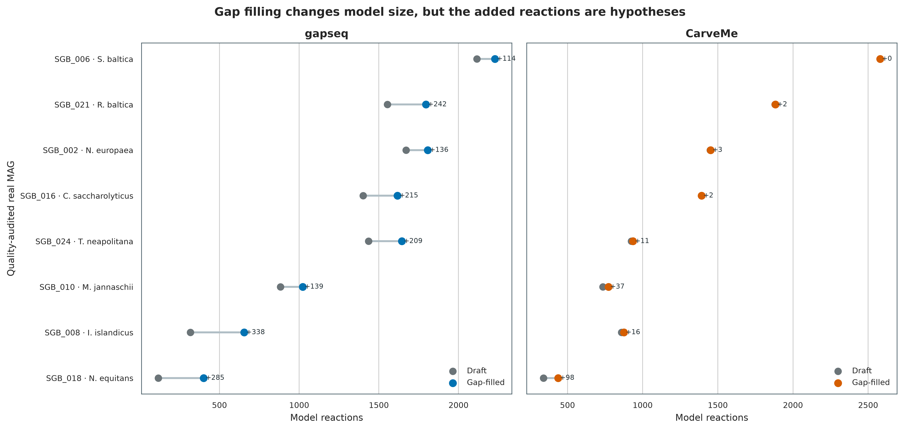
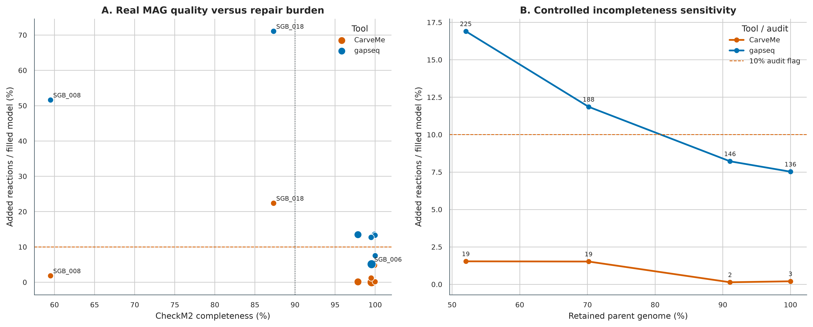
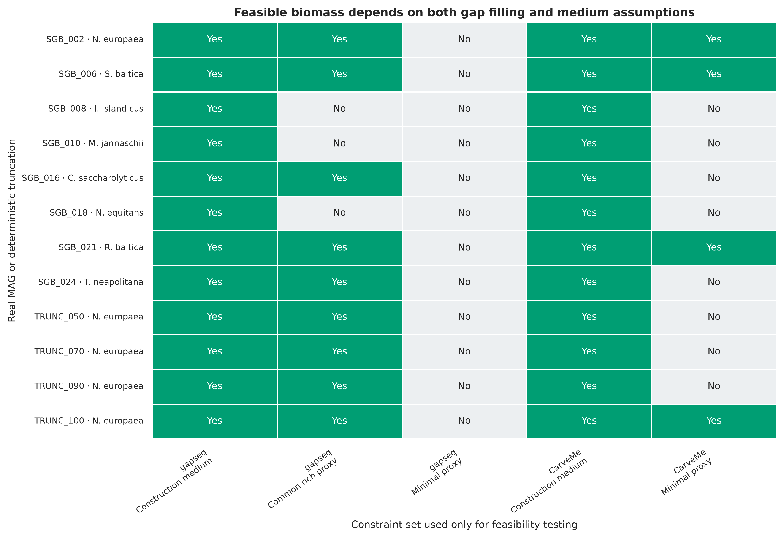
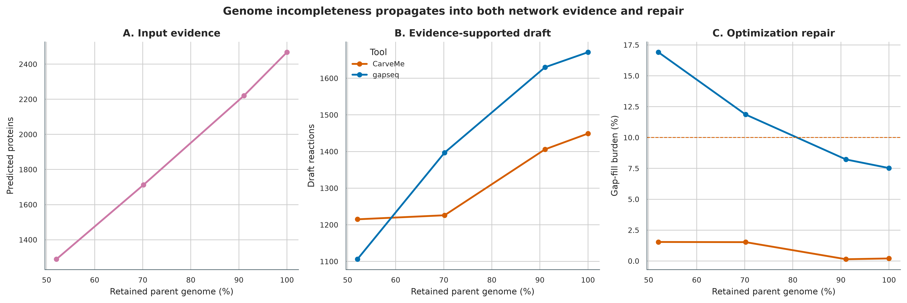
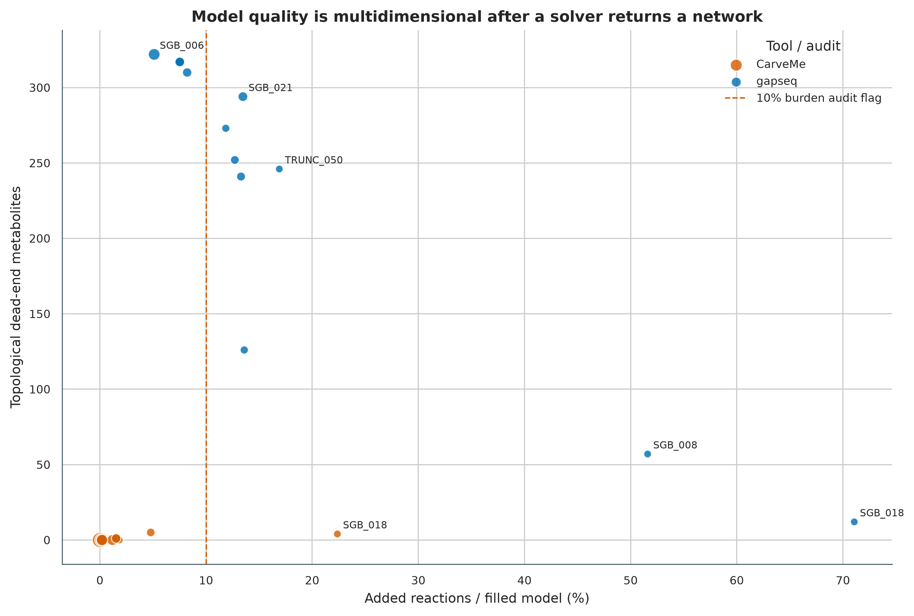
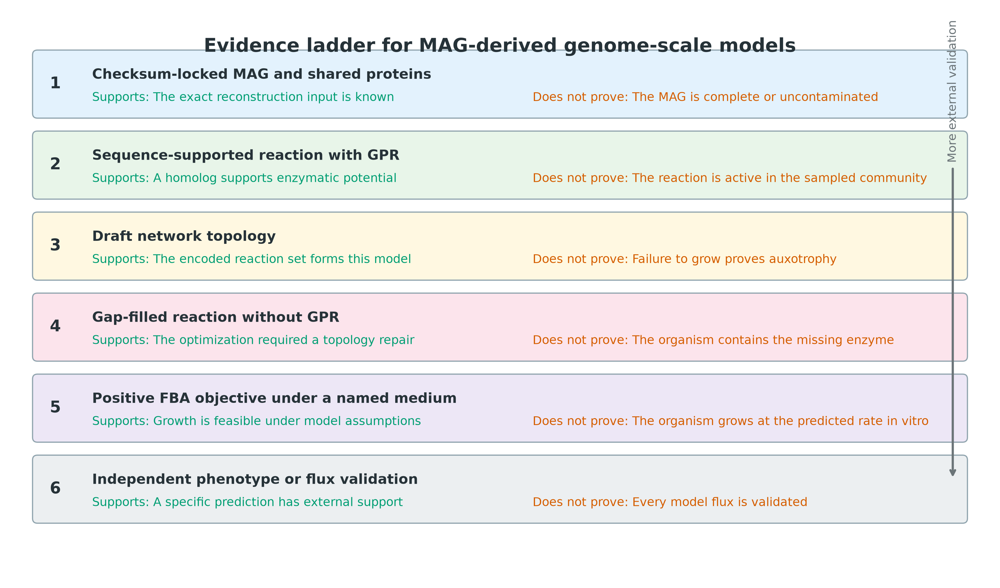

> **先给结论：**基因组尺度代谢模型（genome-scale metabolic model，GEM）不是“把 MAG 注释得更漂亮”，而是把有基因证据的反应、化学计量关系、反应方向、交换边界、培养基和 biomass objective 组合成可求解的约束系统。自动重建最值得报告的并非一个最大生长数值，而是三类不确定性：哪些反应有 gene--protein--reaction（GPR）证据、为了得到可行 biomass 解补了多少无 GPR 反应、结论会不会随 MAG 完整度和培养基假设改变。

这里使用 PRJEB52977 的 ERR9765746/ERR9765747 真实 mock-community 数据得到的 8 个非冗余 MAG，加上 *Nitrosomonas europaea* MAG 的 50%、70%、90% 和 100% 确定性 contig-retention 对照；两套工具共享同一批 Prodigal proteins。gapseq 2.1.0 和 CarveMe 1.6.6 各生成固定 draft 与独立 gap-filled model，共 **48 个 SBML 模型**，随后完成 **168 次 medium/no-uptake FBA audit**。`TRUNC_100` 与 parent 的蛋白序列完全相同，用来检查 reaction structure 是否确定性复现。所有 FBA 数值都解释为 **constraint feasibility**，不写成实测 growth rate 或 flux。

::: {.callout-important title="算力、磁盘与数据库门槛"}
只核验 `data/small/60-genome-scale-models-frozen/`、从压缩 SBML 重算表格并重画 6 组图，建议 **4 CPU、8 GB RAM、5 GB 可用磁盘，耗时约 3--8 分钟**。完整重建会下载 gapseq sequence DB v1.5：压缩文件约 **362 MB**，解压后约 **1.5 GB、82,560 个 reference FASTA**；CarveMe 的 universes、DIAMOND database 和 media library 随锁定环境安装。

12 个 inputs 并行运行时建议 **32 CPU、64 GB RAM、25 GB 高速磁盘和 30--120 分钟**。命令采用 8 个并行 jobs、每个 4 threads；若只有工作站，把 `--jobs` 降到 2，并先跑 `SGB_002 TRUNC_050 TRUNC_100`。没有服务器时，直接使用固化的 48 个 SBML、medium files、summary tables 和 resource ledgers；全量同源搜索放到 HPC 或云端批处理。

这组小 MAG 的成功步骤中，单任务峰值常驻内存最高为 **1,444,584 KB**，最长 wall time 为 **1,161.3 s**；并行峰值取决于同时运行的 jobs。真实人群 MAG 更大、数据库缓存与 solver 行为也不同，部署时仍按上述保守门槛预留资源。
:::

## 这一步对应论文里的哪张图 {#sec-target}

CarveMe 原始论文的 **Figure 1** 对比 bottom-up reconstruction、top-down carving 与 context-dependent gap filling：前两者回答“基因组支持什么反应”，补洞则回答“为了在指定条件下满足 biomass 约束，最少还要假设什么” [@machado2018carveme]。这里保留这个分层，先固定 CarveMe draft，再调用独立 `gapfill` 命令；不把两次独立 carving 的差异误算成补洞反应。

gapseq 论文用 enzyme activity、carbon-source utilization、fermentation products 和 community interactions 的外部 phenotype 数据评估自动模型，并强调 sequence homology、pathway topology 与 reaction-score-aware gap filling 的联合贡献 [@zimmermann2021gapseq]。这里不复刻其中某个 benchmark 百分比，而是重建审稿时更常用的审计面板：model size、gap-fill burden、medium sensitivity、no-uptake leakage、MAG quality 和 controlled incompleteness。

{#fig-60-model-size}

## 理论：GEM 在计算什么，又没有计算什么 {#sec-theory}

### 1. 从 MAG 到 GEM 至少经过五层对象

| 层级 | 典型对象 | 可以支持的结论 | 仍然不能证明 |
|---|---|---|---|
| MAG | contigs、quality、taxonomy | 该 bin 的序列身份与质量 | 每个基因都属于同一细胞 |
| Gene evidence | proteins、homology hits | 某 enzyme family 可能存在 | 该酶在目标条件下表达或有活性 |
| GPR | gene--protein--reaction rule | 反应与基因证据的逻辑连接 | 反应方向与通量已被测量 |
| Network | metabolites、reactions、bounds | 一组化学计量约束 | 网络在真实细胞中唯一正确 |
| Simulation | medium、objective、solver | 在这些假设下存在可行/最优解 | 预测值等于体外或原位速率 |

最关键的分界是“模型里有反应”不等于“基因组里有支持该反应的基因”。Draft 中也会有 biomass、exchange、demand、spontaneous 或 template reactions；gap filling 新增的反应往往没有 GPR。反应表必须同时保存 `GPRBackedReactions` 和 `NoGPRReactions`。

### 2. FBA 是带假设的可行域优化

设 $S \in \mathbb{R}^{m\times r}$ 为 metabolite × reaction 的 stoichiometric matrix，$v$ 为 reaction flux，稳态近似为：

\[
Sv=0.
\]

培养基、反应方向和容量写进上下界：

\[
\ell_j \le v_j \le u_j,
\]

常见 FBA 以 biomass reaction 为目标 [@orth2010fba]：

\[
\max_v c^Tv \quad \text{subject to } Sv=0,\; \ell\le v\le u.
\]

因此正的 biomass objective 只说明：在固定 stoichiometry、bounds、exchange set、biomass composition、steady-state assumption 和 objective 下，solver 找到一个可行解。它没有使用酶浓度、转录调控、动力学参数或群落空间结构，也不能把任意单位的 objective value 直接写成样本中的生长速率。

### 3. Gap filling 是“最小修复”，不是新基因发现

若 draft 在指定 medium 下无法达到最小 biomass，gap filling 从 reaction universe 中选择一组 $A$，使修复后的网络可行，并最小化代价：

\[
\min_A \sum_{j\in A} w_j y_j,
\]

其中 $y_j$ 表示是否加入 reaction $j$，$w_j$ 可由 gene evidence、pathway context 或默认 penalty 决定。这个问题通常有多个等价或近等价解；medium 越宽松，模型越容易找到生长路径，但它也更少测试具体 auxotrophy。新增 reaction 的正确表述是“optimization-required repair candidate”，不能倒推为“MAG 中存在该 enzyme”。

本次定义：

\[
B_g = 100\times \frac{|R_g^{filled}\setminus R_g^{draft}|}{|R_g^{filled}|},
\]

并用 $B_g>10\%$ 作为需要人工复核的 **audit flag**，不是普适质量标准。所有新增和删除 reaction IDs 都从两个已固定 SBML 的集合差得到。

### 4. 培养基是模型条件，不是装饰参数

gapseq 与 CarveMe 使用不同 reaction namespace 和内置 medium vocabulary：前者以 ModelSEED-style IDs 为主，后者以 BiGG IDs 为主。这里的 standardized reconstruction conditions 是：

| Tool | Draft reconstruction | Gap-fill medium | Post-hoc sensitivity |
|---|---|---|---|
| gapseq 2.1.0 | sequence + pathway + transporter evidence；Archaea 固定 `-m Archaea` | Bacteria: `ALLmed.csv`; SGB_008: `autotrophic.csv + highH2`; SGB_010: `MM_anaerobic_CO2_H2.csv + highH2`; SGB_018: `meerwasser.csv` | common `ALLmed.csv`, `MM_glu.csv`, no uptake |
| CarveMe 1.6.6 | bacteria/archaea universal model carving | built-in `LB` | built-in `M9`, no uptake |

这些 gapseq profiles 与 CarveMe `LB` 的化学组成不同；三个 archaeal profiles 之间也不同。因此跨工具或跨生态型只能比较结构规模、修复负担和“各自在声明条件下是否可行”，不能把 objective value 当成同一实验条件下的性能竞赛。若研究问题是某个培养基或环境样本，必须把 measured medium composition 映射到每套 namespace，再做 mass/charge、exchange 和 concentration-bound audit。

### 5. MAG 质量会同时制造 false absence 与 false completion

不完整 MAG 会丢失 genes、GPR 和 reactions，促使 gap filling 加入更多无基因证据的连接；污染则可能把两个 organism 的 enzymes 放进同一个 network，造成虚假的 pathway completion。面板故意包含：

- `SGB_008`：*Ignicoccus islandicus*，CheckM2 completeness 59.51%，用于 incomplete archaeal MAG stress；
- `SGB_006`：*Shewanella baltica*，contamination 6.95%，用于 composite-network risk；
- `SGB_018`：*Nanoarchaeum equitans*，reduced obligate symbiont，提醒“无法独立 biomass”可能是真实生态依赖；
- `TRUNC_050/070/090/100`：同一 parent 的确定性 contig retention，隔离 genome completeness 对模型的影响。

{#fig-60-gapfill-burden}

实际重建中，gapseq 的中位 repair burden 为 **13.00%**，12 个输入中 8 个超过 10% 审计线；CarveMe 的中位数为 **0.69%**，只有宿主依赖型 `SGB_018` 超过该线（22.37%）。这不是工具准确率排名：两者的 reaction universe、评分、biomass 和培养基都不同；它说明“补洞规模”必须和工具、条件及基因证据一起报告。

## 准备工作 {#sec-preparation}

### 真实输入与固定身份

主输入来自 PRJEB52977 uneven mock study [@meslier2022platforms]。第 45 步得到的 dRep representatives 与第 46 步的 GTDB-Tk R232 taxonomy ledger 都有 payload SHA-256；准备脚本先核对二者，再解压 8 个 MAG。两套 reconstruction tools 不各自调用 gene caller，而是共享 Prodigal 2.6.3 `-p meta` 的 proteins，避免 gene-calling difference 混入工具比较。

| Genome | GTDB R232 species | Domain | CheckM2 completeness | Contamination | 设计作用 |
|---|---|---:|---:|---:|---|
| SGB_002 | *Nitrosomonas europaea* | Bacteria | 100.00% | 0.04% | truncation parent / exact control |
| SGB_006 | *Shewanella baltica* | Bacteria | 99.55% | 6.95% | contamination stress |
| SGB_008 | *Ignicoccus islandicus* | Archaea | 59.51% | 0.00% | incompleteness stress |
| SGB_010 | *Methanocaldococcus jannaschii* | Archaea | 99.92% | 0.12% | methanogenic archaeon |
| SGB_016 | *Caldicellulosiruptor saccharolyticus* | Bacteria | 99.99% | 0.02% | anaerobic heterotroph |
| SGB_018 | *Nanoarchaeum equitans* | Archaea | 87.33% | 0.21% | reduced symbiont |
| SGB_021 | *Rhodopirellula baltica* | Bacteria | 97.85% | 3.87% | large genome |
| SGB_024 | *Thermotoga neapolitana* | Bacteria | 99.50% | 0.45% | thermophilic heterotroph |

Seed **59002** 固定 contig shuffle；50%、70%、90%、100% targets 的实际 retained bases 为 52.036793%、70.175068%、91.069344% 和 100%。另设绘图 seed **20260760**。`TRUNC_100` 与 `SGB_002` 的 sequence-set hash 和 protein-sequence multiset hash 必须相同，但 identifiers 保留各自 genome prefix，防止并行结果串样。

### 数据库与 solver 锁

| 资源 | 锁定版本 | 身份与规模 |
|---|---|---|
| gapseq | 2.1.0, source commit `53f3b612...f328a7d2` | `env/gapseq-linux-64.lock` |
| gapseq sequence DB | v1.5, UniProt 2026_01 [@zimmermann2026gapseqdb] | Zenodo 20446806；Bacteria SHA-256 `ec669d56...e1afeb`；Archaea `62e3cf8e...df51c7` |
| CarveMe | 1.6.6 | Bioconda package SHA-256 `fb1ebf83...e00a99` |
| CarveMe universe | 1.6.6 bacteria + archaea | exact compressed universe SHA-256 in manifest |
| Sequence aligner | DIAMOND 2.2.4 / 2.1.13 | tool-specific locked environments |
| LP/MILP solver | GLPK 5.0 / SCIP 10.0.3 | CarveMe SCIP limit 600 s, relative gap 0.001 |
| Exchange definitions | gapseq media CSV / CarveMe `media_db.tsv` | exact files included in frozen evidence |

<details>
<summary><strong>安装精确环境、下载数据库并内联作图函数</strong></summary>

```bash
conda create --name metagenome-gapseq-2026.08 \
  --file env/gapseq-linux-64.lock
conda create --name metagenome-carveme-2026.08 \
  --file env/carveme-linux-64.lock
conda create --name metagenome-drep-2026.07 \
  --file env/drep-linux-64.lock

conda run -n metagenome-gapseq-2026.08 gapseq test
conda run -n metagenome-carveme-2026.08 \
  python -c 'import carveme; print(carveme.__version__)'
conda run -n metagenome-carveme-2026.08 \
  python -c 'from reframed.solvers import get_default_solver; print(get_default_solver())'

# 大数据库不进入 Git；download 后自动核验 bytes、MD5 与 SHA-256
db/download_db.sh gem-install
db/download_db.sh gem-verify
column -ts $'\t' data/small/60-gem-database-manifest.tsv
```

```{r}
install.packages(c("ggplot2", "dplyr", "readr", "tidyr", "scales", "patchwork"))
library(ggplot2); library(dplyr); library(readr); library(tidyr); library(scales)
set.seed(20260760)

pal_pub <- c(
  "gapseq" = "#0072B2", "CarveMe" = "#D55E00",
  "Feasible" = "#009E73", "Audit" = "#E69F00",
  "Leak" = "#CC79A7", "Gray" = "#6B7478",
  "Light" = "#EDF2F4", "Dark" = "#263238"
)
scale_color_pub <- function(...) scale_color_manual(values = pal_pub, ...)
scale_fill_pub  <- function(...) scale_fill_manual(values = pal_pub, ...)
theme_pub <- function(base_size = 12) {
  theme_bw(base_size = base_size) + theme(
    panel.grid.minor = element_blank(),
    panel.grid.major = element_line(color = "#ECEFF1", linewidth = 0.3),
    axis.text = element_text(color = "black"),
    legend.key = element_blank(),
    strip.background = element_rect(fill = "#EDF2F4", color = NA),
    plot.title.position = "plot",
    plot.caption = element_text(color = "#455A64", hjust = 0)
  )
}
save_pub <- function(plot, file_base, width = 205, height = 145,
                     units = "mm", dpi = 350) {
  dir.create(dirname(file_base), recursive = TRUE, showWarnings = FALSE)
  ggsave(paste0(file_base, ".pdf"), plot, width = width, height = height,
         units = units, device = cairo_pdf, bg = "white")
  ggsave(paste0(file_base, ".png"), plot, width = width, height = height,
         units = units, dpi = dpi, bg = "white")
  ggsave(paste0(file_base, ".tiff"), plot, width = width, height = height,
         units = units, dpi = dpi, compression = "lzw", bg = "white")
  invisible(plot)
}
```

</details>

### 先核验固化证据

`data/small/60-genome-scale-models-frozen/` 保存 12 份共享 protein FASTA、48 个压缩 SBML、原始命令与 resource logs、6 份 gapseq media、CarveMe media library、environment locks、database manifest/audit、所有汇总表和重画脚本。1.5 GB sequence DB 与 CarveMe universe/DIAMOND database 不重复打包，但其 bytes、checksums、release 和 extracted-file counts 都被锁定。

```bash
FROZEN="$PWD/data/small/60-genome-scale-models-frozen"
sha256sum -c "$FROZEN/file-checksums.sha256"
column -ts $'\t' "$FROZEN/input-mag-ledger.tsv" | head
column -ts $'\t' "$FROZEN/gapfill-burden.tsv" | head
column -ts $'\t' "$FROZEN/determinism-control.tsv"
cat "$FROZEN/summary.json"
```

## 可复制代码：从真实 MAG 到可审计 SBML {#sec-code}

### 第 1 步：准备 8 个 MAG、4 个 sensitivity inputs 和共享 proteins

```bash
ROOT="$PWD"
WORK="$ROOT/work/article60"
GAPSEQ_ENV="$HOME/miniconda3/envs/metagenome-gapseq-2026.08"
CARVEME_ENV="$HOME/miniconda3/envs/metagenome-carveme-2026.08"
PRODIGAL_ENV="$HOME/miniconda3/envs/metagenome-drep-2026.07"
SEQDB="$ROOT/db/gem-cache/gapseq-seqdb-v1.5/seqdb"

python3 scripts/prepare_article60_gem.py \
  --project-root "$ROOT" \
  --work-dir "$WORK" \
  --prodigal-env "$PRODIGAL_ENV" \
  --gapseq-env "$GAPSEQ_ENV" \
  --carveme-env "$CARVEME_ENV"

column -ts $'\t' "$WORK/input-mag-ledger.tsv"
column -ts $'\t' "$WORK/protein-id-audit.tsv"
```

每个 protein identifier 都被改成 `genome_id__original_id`，并检查全局唯一性。准备过程拒绝以下情况：Article 45 representative payload SHA-256 不匹配、GTDB release 不是 R232、输入数不是 8+4、protein IDs 重复、`TRUNC_100` 无法精确重现 parent protein sequences。

### 第 2 步：固定 draft，再独立 gap filling

```bash
python3 scripts/run_article60_gem.py \
  --project-root "$ROOT" \
  --work-dir "$WORK" \
  --gapseq-env "$GAPSEQ_ENV" \
  --carveme-env "$CARVEME_ENV" \
  --seqdb "$SEQDB" \
  --jobs 8 \
  --threads-per-job 4

column -ts $'\t' "$WORK/model-plan.tsv"
column -ts $'\t' "$WORK/command-log.tsv" | head
cat "$WORK/run-contract.json"
```

核心命令等价于：

```bash
# gapseq bacterial branch: evidence -> fixed draft -> ALLmed repair
gapseq find -p all -t Bacteria -b 200 -i 0 -c 75 \
  -K 4 -A diamond -O -D "$SEQDB" -v 1 -f gapseq/SGB_002 SGB_002.faa
gapseq find-transport -b 50 -i 0 -c 75 -K 4 -A diamond \
  -v 1 -f gapseq/SGB_002 SGB_002.faa
gapseq draft -r SGB_002-all-Reactions.tbl -t SGB_002-Transporter.tbl \
  -p SGB_002-all-Pathways.tbl -b Bacteria -n SGB_002 \
  -u 200 -l 100 -f gapseq/SGB_002
gapseq fill -m SGB_002-draft.RDS \
  -n "$GAPSEQ_ENV/share/gapseq/dat/media/ALLmed.csv" \
  -b 100 -k 0.01 -z glpk -v -f gapseq/SGB_002/filled-permissive

# CarveMe：同一 protein FASTA 只做一次 DIAMOND；gapfill 作用于固定 draft
diamond blastp -d bigg_proteins.dmnd -q SGB_002.faa \
  -o SGB_002-diamond.tsv --more-sensitive --top 10 --quiet --threads 4
carve --diamond -u bacteria --fbc2 --solver scip \
  -v -o SGB_002-draft.xml SGB_002-diamond.tsv
gapfill -m LB -u bacteria --fbc2 -v \
  -o SGB_002-filled-LB.xml SGB_002-draft.xml
```

Archaea 自动切换到 gapseq `-t Archaea -m Archaea -b Archaea` 与 CarveMe `-u archaea`。`SGB_008` 使用 `autotrophic.csv -e highH2`，`SGB_010` 使用官方 methanogen tutorial 的 `MM_anaerobic_CO2_H2.csv -e highH2`，`SGB_018` 使用 `meerwasser.csv` 作为 marine host-rich proxy。最初把细菌型 `LBmed.csv`、继而把单一 `ALLmed.csv` 强加给全部 Archaea 时，三个初始补洞均不可行；这些失败日志被保留，最终模型只采用预先记录的 ecology-aware profiles。批处理具备 resume：只有 required output 非空才跳过；任何一步 return code 非零都不会写 `.article60-models-complete`。

### 第 3 步：统一解析、FBA audit、作图与冻结

```bash
"$CARVEME_ENV/bin/python" scripts/summarize_article60_gem.py \
  --project-root "$ROOT" \
  --work-dir "$WORK" \
  --gapseq-env "$GAPSEQ_ENV"

"$PRODIGAL_ENV/bin/python" scripts/plot_article60_gem.py \
  --summary-dir "$WORK" \
  --figure-dir "$ROOT/figures"

python3 scripts/freeze_article60_gem.py \
  --project-root "$ROOT" \
  --work-dir "$WORK" \
  --output-dir "$ROOT/data/small/60-genome-scale-models-frozen" \
  --gapseq-env "$GAPSEQ_ENV" \
  --carveme-env "$CARVEME_ENV" \
  --database-cache "$ROOT/db/gem-cache"
```

统一解析器读取 SBML-FBC2，分别计算 reactions、metabolites、genes、GPR-backed reactions、no-GPR reactions、topological dead ends 和 biomass reaction。FBA threshold 固定为 $10^{-6}$。对每个 tool × stage 都做 no-uptake audit；若在完全关闭 exchange uptake 后仍能产生正 biomass，则标记 leak/energy-generating-cycle risk。

### 第 4 步：fail-closed QA

```bash
"$PRODIGAL_ENV/bin/python" scripts/validate_article60_gem.py \
  --project-root "$ROOT" \
  --frozen-dir "$ROOT/data/small/60-genome-scale-models-frozen" \
  --chapter "$ROOT/chapters/60-genome-scale-models.qmd" \
  --figure-dir "$ROOT/figures" \
  --output-dir "$ROOT/qa/article60" \
  --stage-dir /tmp/article60-frozen-reanalysis \
  --gapseq-env "$GAPSEQ_ENV" \
  --model-python "$CARVEME_ENV/bin/python" \
  --plot-python "$PRODIGAL_ENV/bin/python"

cat qa/article60/validation-summary.json
```

验证器解压全部 48 个 models，在独立目录重算 8 份 summary artifacts、重新生成 6 组 PDF/PNG/TIFF，并比较 table SHA-256 与 PNG pixel hash。它还检查 draft 是否被完整保留、reconstruction medium 是否产生可行 biomass、no-uptake 是否为零、exact-control reaction Jaccard 是否为 1，以及 source/figure/Methods/数据库锁是否完整。

## 审计与升级 {#sec-audit}

### 1. 忠实复现后，先审计“补了什么”

自动工具论文通常用 phenotype benchmark 展示总体性能，但自己的 MAG 仍需逐模型检查：

1. draft 与 filled 的 reaction set difference；
2. 每个 added reaction 的 equation、reversibility、compartment 和 database annotation；
3. added reaction 是否有 GPR，是否只靠 transporter/exchange 解锁；
4. biomass precursors 缺失是否来自 MAG incompleteness、gene calling 或 database namespace；
5. 多个等价 repair sets 是否给出相同 phenotype。

本次 CarveMe 特意避免再次运行 `carve -g LB` 生成第二个独立 optimum；固定 draft 后再 `gapfill`，要求 `RemovedReactions == 0`。gapseq 也以 draft RDS 为唯一输入执行 `fill`。这样 `AddedReactions` 才能解释成相对于固定 draft 的 repair set。

24 组 draft--filled 差分均保留全部 draft reactions，新增反应全部没有 GPR；因此它们只能进入 repair-hypothesis 清单。9 个高负担模型既包括 gapseq 的不完整/截短输入，也包括多个高完整度输入及 CarveMe 的 `SGB_018`，说明不能用一个全局阈值替代逐反应审计。

### 2. 不把不同 namespace 的 reaction IDs 直接求 Jaccard

gapseq 以 ModelSEED-style reaction IDs 为主，CarveMe 使用 BiGG IDs。字符串交集会把同一化学反应当成不同，也会把 protonation、compartment 或 reversibility 不同的反应错误合并。跨工具比较若必须落到 reaction level，应先映射到 MetaNetX/EC/Rhea，并逐项处理：

- compartment normalization；
- proton/water balancing；
- directionality；
- generic compounds；
- one-to-many mappings；
- biomass 与 exchange pseudo-reactions。

因此这里只在各自 namespace 内比较 draft/filled 与 parent/exact control；跨工具图比较的是 counts、fractions、feasibility pattern 和 audit flags，不声称 reaction-set concordance。

### 3. 培养基敏感性优先于一个“漂亮生长率”

{#fig-60-medium}

修复后模型在各自 construction medium 中 **24/24** 达到阈值；换成 post-hoc proxy 后，gapseq 在共同 rich proxy 中为 **9/12**、在 `MM_glu` 中为 **0/12**，CarveMe 在 `M9` 中为 **4/12**。全部 **48/48** no-uptake audits 均未产生正 biomass。由同一模型在不同约束下得到不同结论，正是培养基敏感性，而不是可忽略的数值波动。

宽松 medium 下可行而 minimal proxy 下不可行，可能来自真实 auxotrophy、缺失 transporter、MAG 不完整、biomass composition 或 gap-fill medium bias。正确升级路线是：

1. 用实验配方或环境化学测量重建 medium；
2. 显式报告 exchange bounds 与单位；
3. 先跑 feasibility，再做 FVA/pFBA，检查 alternative optima；
4. 对关键 auxotrophy 做 gene/neighborhood 与培养实验验证；
5. 社区模型再增加 abundance、shared compartment 和 uptake-capacity assumptions。

### 4. Controlled incompleteness 比横截面相关更接近因果审计

{#fig-60-truncation}

真实 MAG 的 completeness 与 gap-fill burden 相关时，taxonomy、genome size 和 lifestyle 都是混杂因素。`TRUNC_050/070/090/100` 固定 parent、taxonomy、原始 contigs 和 gene caller，只改变 retained sequence；因此能直接展示缺失序列如何传导到 gene evidence、draft size 与 optimization repair。它仍不是完整的 assembly-error simulation：没有加入 misassembly、frameshift、strain mixture 或 differential coverage。

在 gapseq 中，retention 从 52.04% 增至 100% 时，predicted proteins 从 1,289 增至 2,468，draft reactions 从 1,106 增至 1,671，repair burden 从 16.90% 降至 7.53%；CarveMe 的对应负担从 1.54% 降至 0.21%，但中间点并非严格单调。`TRUNC_100` 与 parent 在两套工具、两个阶段的 reaction Jaccard 与结构哈希均完全一致（4/4），说明这条确定性控制没有把运行波动误当成缺失效应。

### 5. 一个通过求解的 SBML 仍可能质量很差

{#fig-60-audit}

至少增加以下升级检查：

- MEMOTE 的 stoichiometric consistency、annotation、mass/charge balance、biomass precursor 与 basic test suite [@lieven2020memote]；
- blocked reactions 与 dead-end metabolites；
- energy-generating cycles 和 no-carbon/no-nitrogen controls；
- phenotype arrays、growth/no-growth media、essential genes、secreted metabolites；
- reaction directionality 与 thermodynamic constraints；
- alternative gap-fill solutions 或 model ensemble。

CarveMe 当前 SCIP backend 对 carving 与 gap filling 使用 600 s time limit 和 0.001 relative gap，允许 suboptimal solution。这里固定 `ensemble_size = 1`，适合作为可审计的基线，不代表 repair set 唯一。关键 phenotype 应至少重建 20 个 alternative models 或枚举 near-optimal gap-fill sets，再报告 consensus prediction 与 uncertainty interval。

### 6. 证据阶梯限定 Results 的措辞

{#fig-60-evidence}

从 checksum-locked MAG 到 positive FBA objective，证据逐层增加，但每一层都有结论上限。最常见的越级是把 gap-filled reaction 写成 encoded pathway，或把 biomass objective 写成 measured growth。若没有同条件 phenotype/flux 数据，Results 应使用 `predicted`, `feasible`, `model-supported` 和 `under the specified constraints`。

## 出版级美化 {#sec-publication}

六组图遵守同一视觉语法：gapseq 为蓝色、CarveMe 为橙色、feasible 为绿色、audit threshold 为黄色/虚线、no-uptake flag 为叉号。所有轴、图例、annotations 和 species labels 使用英文；中文只在正文和 caption。输出包含矢量 PDF、350 dpi PNG 与 LZW-compressed TIFF。

作图前先把数据整理成长表，不在 plotting code 内重算生物学结论：

```r
library(readr); library(dplyr); library(ggplot2)
set.seed(20260760)

gap <- read_tsv(
  "data/small/60-genome-scale-models-frozen/gapfill-burden.tsv",
  show_col_types = FALSE
) %>%
  mutate(
    AddedFractionOfFilledPct = as.numeric(AddedFractionOfFilledPct),
    Tool = factor(Tool, levels = c("gapseq", "CarveMe"))
  )

p <- gap %>%
  filter(grepl("^SGB_", Genome)) %>%
  ggplot(aes(x = reorder(Genome, AddedFractionOfFilledPct),
             y = AddedFractionOfFilledPct, fill = Tool)) +
  geom_col(position = position_dodge(width = 0.75), width = 0.68) +
  geom_hline(yintercept = 10, linetype = 2, color = pal_pub[["Audit"]]) +
  scale_fill_pub() +
  labs(x = "Quality-audited real MAG", y = "Gap-fill burden (%)",
       fill = "Tool") +
  theme_pub() + coord_flip()

save_pub(p, "figures/60-gapfill-burden-replot")
```

模型大小使用 paired dumbbell，突出同一 genome 的 draft-to-filled 变化；feasibility 用 binary heatmap，不用连续渐变暗示 objective value 可跨工具比较；sensitivity 图保留实际 retained percentage；audit 图同时编码 repair、dead ends、genes 和 leaks，避免用单一分数盖住不同失败模式。

## 常见坑 {#sec-pitfalls}

::: {.callout-caution title="审稿人最常追问的八个问题"}
1. **把 gap-filled reaction 当作基因组证据**：必须分开 GPR-backed 与 no-GPR reactions，并列出 added set。
2. **培养基没有版本或配方**：名称相同也可能 composition 不同；保存 machine-readable medium file 与 checksum。
3. **把 FBA objective 叫作真实 growth rate**：没有 calibrated uptake bounds 与 phenotype validation 时，只写 feasibility。
4. **忽略 MAG completeness/contamination**：低完整度造成 false auxotrophy，高污染造成 composite metabolism。
5. **直接比较 gapseq/CarveMe reaction IDs**：ModelSEED 与 BiGG namespace 不能做字符串 Jaccard。
6. **两个独立重建结果相减当成 gap fill**：不同 MILP optimum 会混入差集；应固定 draft 后独立补洞。
7. **只测 rich medium**：rich feasibility 不能证明 minimal-medium phenotype；至少增加 minimal、no uptake 和目标环境条件。
8. **solver 返回结果就算质控通过**：还需 mass/charge、cycles、dead ends、MEMOTE、phenotype 和 alternative-solution audit。
:::

::: {.callout-warning title="Reduced symbiont 不是自动重建流程的错误对照"}
像 *Nanoarchaeum equitans* 这样的 obligate symbiont 可能依赖宿主提供 metabolites。强迫其单独在通用 medium 下合成完整 biomass，会把真实生态依赖“修复”为大量假设反应。此类 genome 应同时报告 single-organism infeasibility、host/community context 和 exchanged-metabolite hypotheses。
:::

::: {.callout-tip title="一个实用的发表门槛"}
正文主图至少给出 MAG quality、draft/filled size、gap-fill burden、medium sensitivity 和 no-uptake audit；Supplementary Data 交付 SBML、medium files、GPR/reaction tables、added reaction list、solver/version/database locks 与 phenotype validation table。
:::

## 这段 Methods 怎么写 {#sec-methods}

### Methods template

> Genome-scale metabolic models were reconstructed from eight non-redundant metagenome-assembled genomes recovered from the PRJEB52977 uneven mock-community data set (ERR9765746 and ERR9765747). MAG identities were checksum-locked, quality estimates were obtained with CheckM2, and taxonomy was assigned with GTDB-Tk release R232. Four deterministic contig-retention controls (52.036793%, 70.175068%, 91.069344%, and 100%) were generated from the *Nitrosomonas europaea* MAG using seed 59002. Protein-coding genes were predicted once for all reconstruction methods using Prodigal v2.6.3 in metagenomic mode, and genome-prefixed protein identifiers were used. Draft and gap-filled models were generated with gapseq v2.1.0 (GLPK v5.0; sequence database v1.5, Zenodo 20446806, UniProt 2026_01) and CarveMe v1.6.6 (DIAMOND v2.1.13; SCIP v10.0.3; bacterial or archaeal universe as appropriate). Bacterial gapseq drafts were gap-filled with the versioned ALLmed.csv definition; the three archaeal stress cases used versioned ecology-aware profiles (autotrophic plus highH2, MM_anaerobic_CO2_H2 plus highH2, or meerwasser). CarveMe's independent gapfill command was applied to fixed drafts using its versioned LB definition. ALLmed/MM_glu (gapseq), M9 (CarveMe), and no-uptake constraints were evaluated post hoc. Biomass feasibility was defined as an objective value greater than $10^{-6}$. Added reactions, GPR support, topological dead ends, medium-dependent feasibility, and no-uptake biomass production were audited for every model. All SBML files, medium definitions, command logs, software locks, database checksums, and derived tables were retained.

### Results template

> We reconstructed fixed draft and gap-filled models for 12 genome inputs with two automated pipelines, yielding 48 SBML models. Median gap-fill burdens were 13.00% for gapseq and 0.69% for CarveMe; 8/12 and 1/12 models, respectively, exceeded the prespecified 10% audit threshold. All 24 gap-filled models were feasible in their declared construction media, whereas feasibility under the common-rich/minimal proxies was 9/12 and 0/12 for gapseq and 4/12 under the CarveMe M9 proxy. None of the 48 gap-filled or draft models produced biomass when uptake was disabled. Deterministic truncation of the *Nitrosomonas europaea* parent reduced protein and draft-network evidence and increased repair burden, whereas the 100% retained control reproduced the parent reaction structure in all four tool-by-stage comparisons. Gap-filled reactions were interpreted as optimization-required hypotheses, and no objective value was interpreted as an experimentally measured growth rate or flux.

若使用自己的数据，Methods 还要补：sample accession、assembly/binning/refinement lineage、MAG quality gate、gene caller mode、每个 medium 的完整配方和 bounds、oxygen condition、biomass equation、solver tolerance/time limit、gap-fill penalty、ensemble size、MEMOTE version，以及 phenotype/flux validation 的来源。

## 换成你自己的数据怎么做 {#sec-own-data}

### 最少需要什么

1. 每个 MAG 一份 FASTA；建议同时有 CheckM2 completeness/contamination、GUNC contamination/chimerism 与 GTDB-Tk taxonomy。
2. 明确的 sample/MAG lineage：assembly、binning、refinement、dereplication 和 representative selection。
3. 研究条件的 medium composition；环境研究至少准备可测的 carbon、nitrogen、electron donor/acceptor、oxygen 与 salinity constraints。
4. 能验证模型的外部证据：culture growth/no-growth、Biolog、gene essentiality、metabolite uptake/secretion、isotope tracing 或 condition-matched transcript/protein data。

### 替换 input panel

```bash
# 目录中每个 basename 必须唯一；先固定 checksum ledger
find my_mags -maxdepth 1 -type f -name '*.fna' -print0 \
  | sort -z | xargs -0 sha256sum > my_mags.sha256

# 用相同 gene caller 为全部工具生成共享 proteins
for genome in my_mags/*.fna; do
  sample=$(basename "$genome" .fna)
  prodigal -q -p meta -i "$genome" \
    -a "my_proteins/${sample}.faa" \
    -d "my_genes/${sample}.fna" \
    -f gff -o "my_gff/${sample}.gff"
done
```

将 `prepare_article60_gem.py` 的 `PRIMARY_PANEL` 换成自己的 checksum ledger，不要删除 quality、taxonomy、domain 与 protein-ID gates。随机截短只用于 sensitivity analysis，不可替代 CheckM2/GUNC 的真实质量评估。

### 按研究问题改变模型，而不是只换 FASTA

| 研究问题 | 还要增加的约束/数据 | 推荐输出 |
|---|---|---|
| 培养条件优化 | 实际 medium、pH/oxygen、uptake bounds | growth feasibility + required nutrients + FVA |
| Auxotrophy | minimal media panel、transporter audit | gap-fill alternatives + culture validation |
| Cross-feeding | sample-specific MAG set、shared compartment、abundance | exchanged metabolites + donor/receiver sensitivity |
| Disease cohort | subject-level MAG/reaction abundance、diet/medication | stratified model predictions + external cohort validation |
| 环境过程 | electron donors/acceptors、temperature/salinity proxies | feasible redox routes + geochemical validation |

最终交付至少包括 `models/draft/`、`models/gapfilled/`、`media/`、`added-reactions.tsv`、`gpr-audit.tsv`、`model-qc.tsv`、`phenotype-validation.tsv`、environment locks、database manifests、commands 和 checksums。若模型将用于机制主张，优先验证关键 exchange/auxotrophy，而不是继续增加自动生成的网络图。

## 参考 {#sec-references}

- gapseq 方法、benchmark 与 gap-filling 设计：[@zimmermann2021gapseq]；本次 sequence DB 快照：[@zimmermann2026gapseqdb]；软件版本：[@gapseq2026software]。
- CarveMe top-down reconstruction、gap filling 与 phenotype benchmark：[@machado2018carveme]；软件版本：[@carveme2026software]。
- FBA 的约束、objective 与解释边界：[@orth2010fba]。
- GEM 的标准化质量测试与可复用性审计：[@lieven2020memote]。
- 真实 mock-community 数据：[@meslier2022platforms]。
