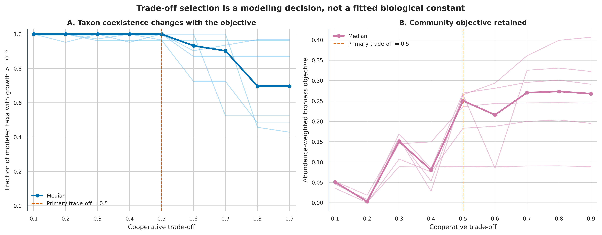
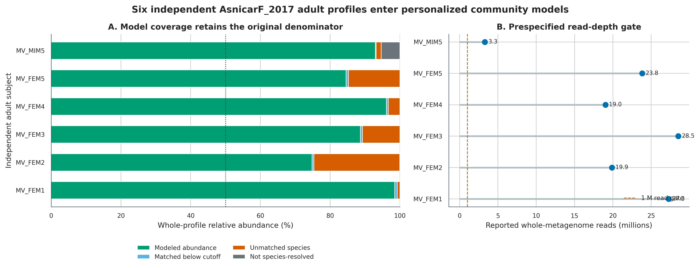
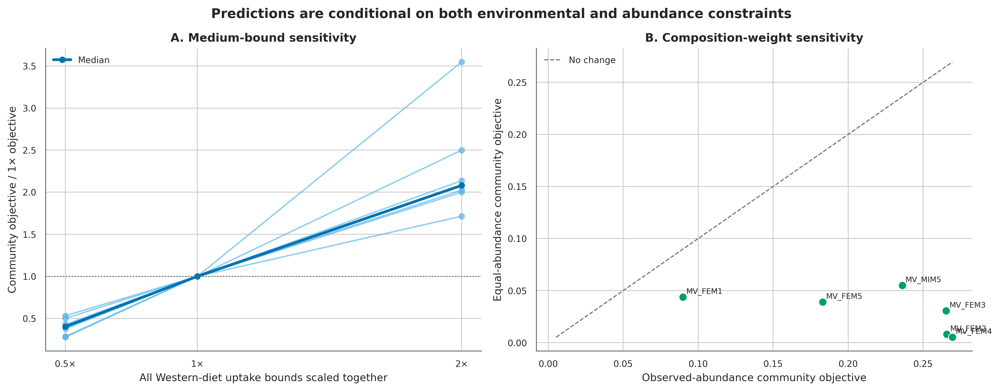
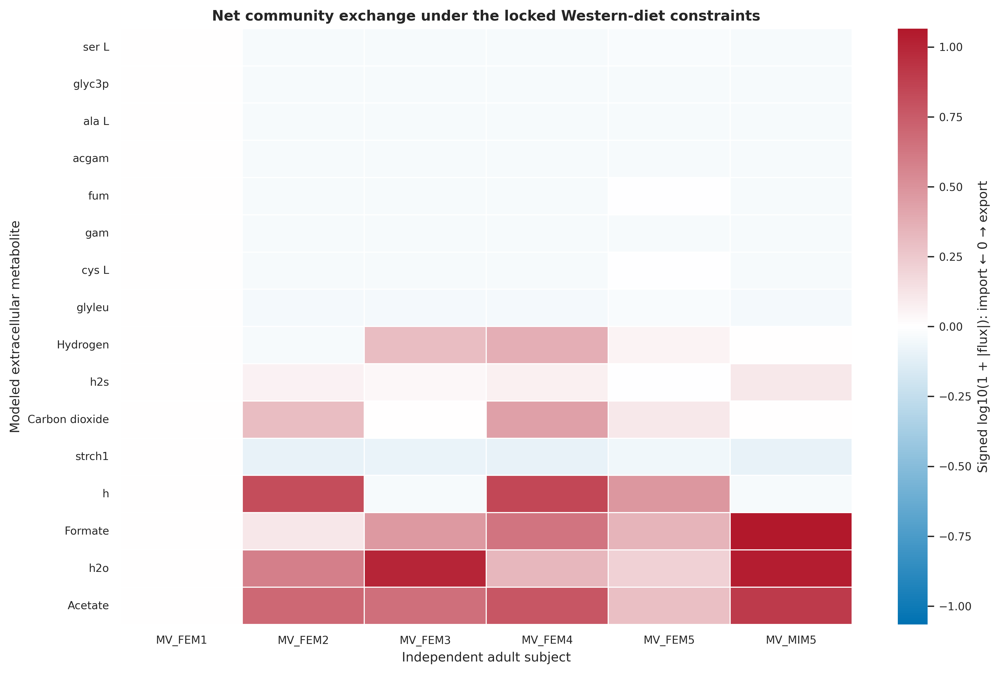
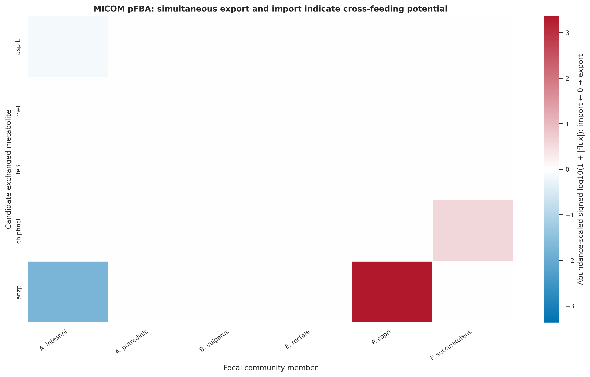
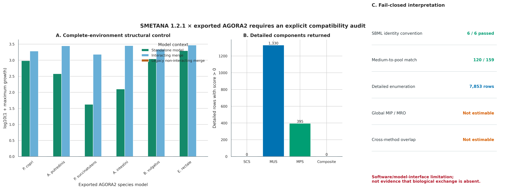

> **先给结论：**MICOM 能把“样本里有哪些物种”推进到“在指定代谢网络、培养基、丰度权重和优化目标下，哪些物种可能生长、哪些胞外代谢物可能被消费或输出”。SMETANA 可以补充营养依赖假设，但必须先通过模型标识、培养基映射和合并模型生长审计。本次 SMETANA 1.2.1 对导出的 AGORA2 SBML 返回 7,853 条 detailed component rows，却无法估计 global MIP/MRO；这个结果属于 **software/model-interface limitation**，不是“没有生物学交换”的证据。

这里使用 `curatedMetagenomicData` 3.12.0 中 AsnicarF_2017 的真实 MetaPhlAn 物种谱 [@asnicar2017transmission; @pasolli2017cmd]。预先限定成人、全宏基因组 reads 不少于 1,000,000、每位受试者保留最早一份合格样本，得到 **6 位独立成人**。MICOM 以 AGORA 2.01 / RefSeq 216 的 species-collapsed model database 建立 6 个丰度加权群落，在 0.1--0.9 cooperative trade-off、0.5×/1×/2× Western-diet bounds 和 observed/equal abundance 下求解。SMETANA 固定分析最早入选样本中模型覆盖的前 6 个优势物种，并保留与 MICOM 相同的正通量营养成分集合，但因其 medium interface 只接收成分成员关系而移除 trace oxygen。SMETANA 分支采用 fail-closed 原则：不对无法估计的 global score 填 0，也不把全零 composite score 当作阴性生物学结论。

::: {.callout-important title="算力、磁盘与数据库门槛"}
只核验 `data/small/61-community-metabolism-frozen/`、重算汇总并重画 6 组图，建议 **4 CPU、8 GB RAM、3 GB 可用磁盘，约 2--5 分钟**。完整流程需下载 `agora201_refseq216_species_1.qza`（264,422,408 bytes），解压后的 JSON model database、MICOM pickles、SMETANA SBML 和中间表会占用数 GB。

6 个个体化群落并行求解建议 **8 CPU、32 GB RAM、15 GB 可用磁盘和 1--4 小时**。命令固定 `--threads 6`，每个 worker 内部线性代数线程为 1，避免嵌套并行。没有服务器时，先只保留 `MV_FEM1_t1Q14` 跑通一个群落，或直接读取固化的模型审计、growth、exchange 和 interaction tables；大数据库解压与全样本求解放到 HPC 或云端临时磁盘。
:::

## 这一步对应论文里的哪张图 {#sec-target}

MICOM 原始论文的 **Figure 2** 展示 50% cooperative trade-off 下不同肠道菌属的非零预测生长率；Supplementary Figures S1--S2 则把 trade-off 改动与“多少成员能生长”、预测生长率和测序推断 replication rate 的一致性放在一起 [@diener2020micom]。本文把这条逻辑变成两级审计：先画 0.1--0.9 的完整曲线，再把 0.5 固定为主分析值。0.5 来自原论文的经验锚点，并非在这 6 个样本上重新调参；本数据没有 replication-rate measurement，因此不能声称它是本队列的最优生物学参数。

SMETANA 论文的 **Figure 3** 用 metabolic interaction potential（MIP）描述群落通过成员互补降低外界营养依赖的能力，**Figure 4** 进一步展示 co-occurring subcommunities 的 interaction potential、resource overlap 与候选交换物类别 [@zelezniak2015smetana]。这里忠实运行 global 与 detailed 两条分支，但只报告可审计的输出：global MIP/MRO 为 `not estimable`；detailed 分支有 7,853 行，MUS 1,330 行为正、MPS 395 行为正，而 SCS 与 composite score 全部为 0。由于跨方法比较的 SMETANA 端没有可用的正 composite score，MICOM--SMETANA overlap 不计算。

{#fig-61-tradeoff}

## 理论：群落模型到底多加了哪些假设 {#sec-theory}

### 1. 从相对丰度到群落模型有五道证据边界

| 输入层 | 本次对象 | 增加的假设 | 仍然不能证明 |
|---|---|---|---|
| Taxonomic profile | MetaPhlAn species relative abundance | marker-derived abundance 代表群落组成 | 绝对细胞数、活性或 biomass |
| Model matching | species name → AGORA model | species-collapsed network 可代表样本内 strains | 样本 strain 拥有全部 model reactions |
| Environment | Western-diet uptake bounds | 饮食成分可到达模拟 compartment | 个体真实摄入量与结肠可利用量 |
| Objective | community biomass + cooperative trade-off | 成员在约束下分配生长 | 真实生态选择只优化该目标 |
| Flux solution | pFBA / SMETANA score | 选定一组可行或简约解 | 原位通量、净浓度变化或因果互养 |

物种相对丰度只用于组装和加权。若样本总微生物 biomass 相差十倍，相同组成仍会得到相近的归一化模型；因此输出不能代替 qPCR、flow cytometry、spike-in absolute abundance 或 dry-weight calibration。

### 2. MICOM 的 cooperative trade-off 是两阶段优化

对群落成员 $i$，设相对丰度为 $a_i$、个体 biomass flux 为 $\mu_i$，community growth 为：

$$
\mu_c = \sum_i a_i\mu_i.
$$

第一阶段在化学计量、反应上下界与培养基约束下求最大群落生长 $\mu_c^{max}$。第二阶段给定 trade-off $\alpha$，至少保留最大值的一部分，并通过二次目标选择更分散的成员生长解 [@diener2020micom]：

$$
\min_{\mu,v}\sum_i \mu_i^2
\quad \text{subject to}\quad
\mu_c\ge \alpha\mu_c^{max},\; Sv=0,\; \ell\le v\le u.
$$

$\alpha$ 越接近 1，越强调最大 community objective；较低的 $\alpha$ 给个体成员更多让步空间。它不是“合作程度的实测百分比”，也不应只画一个值而隐藏曲线。主分析固定 0.5，同时报告 0.1--0.9 全曲线。

### 3. pFBA 只是在多个可行通量中选择一套简约解

给定同一 growth constraints，代谢网络通常有大量 alternate optima。parsimonious FBA（pFBA）在保持目标可行的前提下压低总 flux magnitude，使结果更易读，但“更短的通量路径”仍是数学偏好，而非细胞必然采用的 pathway。本文把某物种对同一胞外化合物的正 flux 记作 export、负 flux 记作 import；物种 flux 再乘相对丰度，得到对 community exchange 的 abundance-scaled contribution。

若同一 compound 在同一解中至少有一个 exporter 和一个 importer，就生成 **cross-feeding potential**：

$$
F_{d\rightarrow r,m}=\min(a_dv_{d,m}^{export},\;-a_rv_{r,m}^{import}).
$$

这只是 donor--receiver capacity overlap。要把它升级为交换证据，至少还需 flux variability analysis（FVA）、isotope tracing、paired metabolomics，或控制培养实验。

### 4. SMETANA 问的是“依赖潜力”，不是同一套 flux optimization

SMETANA 的 global 模式报告 metabolic resource overlap（MRO）与 metabolic interaction potential（MIP）。前者描述成员营养需求重叠，后者描述成员互补后可减少多少外部必需营养输入。detailed 模式针对 receiver $r$、donor $d$ 和 compound $m$ 组合三个 0--1 分数：

- species coupling score（SCS）：receiver 对群落其他成员的生存依赖；
- metabolite uptake score（MUS）：receiver 对该 compound 的摄取需求；
- metabolite production score（MPS）：donor 产生该 compound 的能力。

总分为：

$$
SMETANA_{r,d,m}=SCS_r\times MUS_{r,m}\times MPS_{d,m}.
$$

MICOM 的一套 pFBA flux 和 SMETANA 的 dependency enumeration 不是重复测量。只有两条分支均通过 feasibility 与接口审计时，两者同向支持才可提高候选优先级；不重叠可能来自 objective、medium encoding、community size 或 solution-space summary，也可能来自软件与模型标识约定不兼容。

本次兼容性对照把环境暂时放宽为 complete environment，只用于检查模型结构：6 个单独模型和 interacting merge 的 6 个成员均有正最大生长，而同一批 SBML 经 SMETANA 1.2.1 legacy `interacting=False` merge 后，6 个成员的最大生长全部为 0。MIP 正是从该 non-interacting community 开始求 minimal medium，因此不能把失败输出补成 0。MRO 还在 *Bacteroides vulgatus* 的 member minimal-medium solve 处失败。这个诊断是 **not evidence of biological absence**。

### 5. 结果必须按证据级别命名

| 表述 | 是否合适 | 原因 |
|---|---:|---|
| “The model permits acetate export under the declared constraints.” | 是 | 明确是可行解与固定条件 |
| “Acetate is a candidate cross-fed metabolite.” | 是 | 适合作为实验假设 |
| “This taxon produced acetate in the stool sample.” | 否 | 没有测量原位产物与 isotope flow |
| “The taxa are mutualists.” | 否 | flux compatibility 不等于双方 fitness benefit |
| “A positive biomass objective is the in vivo growth rate.” | 否 | 单位、biomass 与环境假设未被校准 |

## 准备工作 {#sec-preparation}

### 真实输入、独立单位与模型覆盖

AsnicarF_2017 资源含 24 份 longitudinal profiles、15 位受试者。只选 adult 后，先用 `number_reads >= 1,000,000` 排除极浅测序；同一 `subject_id` 有多份合格 profile 时按资源中的稳定顺序保留最早一份。最终 6 份样本均来自不同受试者，且均为女性；因此这里只验证方法链与个体化差异，不进行性别比较或人群外推。

| Subject | SRA | Reads | Taxa ≥0.1% | Matched taxa | Whole-profile model coverage |
|---|---|---:|---:|---:|---:|
| MV_FEM1 | SRR4052043 | 27,277,064 | 28 | 26 | 98.54% |
| MV_FEM2 | SRR4052044 | 19,883,080 | 60 | 42 | 74.79% |
| MV_FEM3 | SRR4052023 | 28,539,448 | 43 | 35 | 88.66% |
| MV_FEM4 | SRR4052024 | 19,038,206 | 28 | 23 | 96.11% |
| MV_FEM5 | SRR4052026 | 23,822,026 | 47 | 29 | 84.57% |
| MV_MIM5 | SRR4052037 | 3,289,927 | 35 | 31 | 92.98% |

`MV_MIM5_t3F15` 的 species-terminal entries 合计 94.65166%；剩余约 5.35% 是停在更高分类层级的 profile mass。coverage 使用原始 whole-profile denominator，不把 94.65% 强行 reclose 成 100%。MICOM 会在已建模成员内部处理权重，但审计表始终保留 unresolved、低丰度过滤和 database mismatch 三类损失。

{#fig-61-coverage}

### 数据库、培养基和 solver 身份

| 资源 | 锁定身份 | 本次核验 |
|---|---|---|
| AGORA model database | `agora201_refseq216_species_1.qza`；Zenodo 7739096 [@diener2023micommodels] | 264,422,408 bytes；MD5 `6a13...32b6`；SHA-256 `8fb2...4dc`；1,746 unique species models |
| Source manifest | MICOM databases commit `327d78f...612e` | 7,302 strain rows；1,746 unique RefSeq species names |
| Model biology | AGORA2 [@heinken2023agora2] | 7,302 curated strain reconstructions；论文报告 1,738 species |
| Western medium | MICOM media commit `0a1d471...dd9` | 171 reactions；160 positive bounds；oxygen bound 0.001 |
| MICOM | 0.39.0 [@micom2026software] | hybrid solver：OSQP QP + HiGHS LP |
| SMETANA | 1.2.1 [@smetana2026software] | SCIP 10.0.3 via PySCIPOpt 6.2.1；global score 未通过兼容性审计 |

论文、source manifest 和 species-collapsed artifact 的 species 数不完全相同，反映 taxonomy collapse 与发布对象差异；Methods 应记录实际使用 artifact 的 1,746 个 model，而不是只抄 AGORA2 论文摘要中的 1,738。

官方 Western-diet artifact 的说明仍指向 AGORA 1.03。本文不假设它与 AGORA 2.01 天然兼容，而是锁定 bytes、逐样本实跑 feasibility，并做 0.5×/1×/2× bounds sensitivity。SMETANA 的 medium 文件只能表达 compound membership，无法保存 MICOM 每个反应不同的 flux bound；因此它不是“同一培养基的完全等价编码”。

<details>
<summary><strong>安装精确环境、核验数据库并内联作图函数</strong></summary>

```bash
conda create --name metagenome-community-2026.08 \
  --file env/community-metabolism-linux-64.lock
conda run -n metagenome-community-2026.08 \
  python -m pip install -r env/community-metabolism-pip.lock

conda run -n metagenome-community-2026.08 python - <<'PY'
import cobra, micom, smetana
from cobra.util.solver import solvers
print("MICOM", micom.__version__)
print("SMETANA", smetana.__version__)
print("COBRApy", cobra.__version__)
print("solvers", sorted(solvers))
PY

db/download_db.sh community-install
db/download_db.sh community-verify
column -ts $'\t' data/small/61-community-database-manifest.tsv
```

```{r}
install.packages(c("ggplot2", "dplyr", "readr", "tidyr", "scales", "patchwork"))
library(ggplot2); library(dplyr); library(readr); library(tidyr); library(scales)
set.seed(20260761)

pal_pub <- c(
  "Import" = "#0072B2", "Export" = "#B2182B",
  "Modeled" = "#009E73", "Unmodeled" = "#E69F00",
  "MICOM" = "#56B4E9", "SMETANA" = "#D55E00",
  "Both" = "#CC79A7", "Gray" = "#6B7478"
)
scale_color_pub <- function(...) scale_color_manual(values = pal_pub, ...)
scale_fill_pub  <- function(...) scale_fill_manual(values = pal_pub, ...)
theme_pub <- function(base_size = 12) {
  theme_bw(base_size = base_size) + theme(
    panel.grid.minor = element_blank(),
    panel.grid.major = element_line(color = "#ECEFF1", linewidth = 0.3),
    axis.text = element_text(color = "black"),
    legend.key = element_blank(),
    strip.background = element_rect(fill = "#EDF2F4", color = NA),
    plot.title.position = "plot",
    plot.caption = element_text(color = "#455A64", hjust = 0)
  )
}
save_pub <- function(plot, file_base, width = 205, height = 145,
                     units = "mm", dpi = 350) {
  dir.create(dirname(file_base), recursive = TRUE, showWarnings = FALSE)
  ggsave(paste0(file_base, ".pdf"), plot, width = width, height = height,
         units = units, device = cairo_pdf, bg = "white")
  ggsave(paste0(file_base, ".png"), plot, width = width, height = height,
         units = units, dpi = dpi, bg = "white")
  ggsave(paste0(file_base, ".tiff"), plot, width = width, height = height,
         units = units, dpi = dpi, compression = "lzw", bg = "white")
  invisible(plot)
}
```

</details>

### 先核验固化证据

固化目录保存 checksum-gated cohort tables、sample/model/medium audits、6 个 SMETANA SBML、全部 compact MICOM/SMETANA outputs、软件版本、resource ledger、兼容性诊断、汇总脚本、绘图脚本和 QA report。2.1 GB 解压数据库与数百 MB community pickles 不重复进入 Git。`run-ledger.tsv` 中 8 个 MICOM 步骤为 `passed`，SMETANA global 为 `not_estimable`，detailed 为 `passed_with_limitation`；这两种状态不能批量改成 `passed`。

```bash
FROZEN="$PWD/data/small/61-community-metabolism-frozen"
sha256sum -c "$FROZEN/file-checksums.sha256"
column -ts $'\t' "$FROZEN/model-coverage.tsv"
column -ts $'\t' "$FROZEN/run-ledger.tsv"
cat "$FROZEN/analysis-metrics.json"
cat "$PWD/qa/article61/validation-summary.json"
```

## 可复制代码：从真实物种谱到互养候选 {#sec-code}

### 第 1 步：按受试者选择样本并保留原始分母

准备脚本先核对第 22 篇真实输入的 SHA-256，再执行 adult、read-depth 和 subject gate。input 是明确的谱表和 metadata，不依赖内存中残留对象。

```bash
ROOT="$PWD"
RUN="$ROOT/.tutorial_runs/article61"
CACHE="$ROOT/db/community-cache"

conda run -n metagenome-community-2026.08 python \
  scripts/prepare_article61_community.py \
  --project-root "$ROOT" \
  --cache-dir "$CACHE" \
  --work-dir "$RUN"

column -ts $'\t' "$RUN/selected-samples.tsv"
column -ts $'\t' "$RUN/model-coverage.tsv"
cat "$RUN/preparation-contract.json"
```

核心筛选与 coverage 计算可直接应用到自己的 metadata/profile：

```python
MIN_READS = 1_000_000
CUTOFF = 0.001                       # proportion = 0.1%

adult = metadata.loc[metadata.age_category.eq("adult")].copy()
adult = adult.loc[adult.number_reads.ge(MIN_READS)]
selected = (
    adult.sort_values(["subject_id", "SourceOrder"])
         .drop_duplicates("subject_id", keep="first")
)

# Do not reclose before coverage accounting.
sample_abundance = species_percent / 100.0
modeled = sample_abundance.index.isin(agora_species) & sample_abundance.ge(CUTOFF)
whole_profile_coverage = sample_abundance.loc[modeled].sum()
assert whole_profile_coverage >= 0.50
```

### 第 2 步：构建 abundance-weighted MICOM communities

`micom-taxonomy.tsv` 至少含 `sample_id`、稳定 `id`、`species` 和 `abundance`。模型数据库 taxonomy scheme 必须和 profile names 一致。

```python
import numpy as np
import pandas as pd
from micom.workflows import build

np.random.seed(61001)
taxonomy = pd.read_csv(".tutorial_runs/article61/micom-taxonomy.tsv", sep="\t")
manifest = build(
    taxonomy,
    ".tutorial_runs/article61/database/agora201/ce24d5f6-39ab-4abf-ad24-c4272006da01/data",
    ".tutorial_runs/article61/micom/models-observed",
    cutoff=0.001,
    threads=6,
    solver="hybrid",
)
manifest.to_csv(".tutorial_runs/article61/micom-observed-manifest.tsv", sep="\t", index=False)
```

数据库路径不要在 Methods 中只写 UUID；还要同时记录 QZA checksum、source taxonomy、summary rank 和 manifest count。准备脚本从 QZA metadata 读取 UUID，避免手工硬编码解压路径。

### 第 3 步：先扫 trade-off，再做主分析 pFBA

```python
from micom import load_pickle
from micom.workflows import grow, tradeoff
from micom.workflows.media import process_medium

medium = pd.read_csv(".tutorial_runs/article61/medium.tsv", sep="\t")[["reaction", "flux"]]
grid = [round(value, 1) for value in np.arange(0.1, 1.0, 0.1)]

rates = tradeoff(
    manifest,
    ".tutorial_runs/article61/micom/models-observed",
    medium,
    tradeoffs=grid,
    threads=6,
    atol=1e-6,
    rtol=1e-6,
    presolve=True,
)

primary = grow(
    manifest,
    ".tutorial_runs/article61/micom/models-observed",
    medium,
    tradeoff=0.5,
    threads=6,
    strategy="pFBA",
    atol=1e-6,
    rtol=1e-6,
    presolve=True,
)
primary.save(".tutorial_runs/article61/micom-primary-results.zip")
```

正生长的 operational threshold 固定为 $10^{-6}$。`growth_rate == 0` 在这里表示该 optimization solution 中未超过数值阈值，不应改写成“样本中不生长”或“物种死亡”。

### 第 4 步：对 medium bounds 与 abundance weights 做敏感性分析

```python
def one_tradeoff(manifest, model_dir, medium, fraction=0.5):
    """MICOM 0.39.0-safe singleton trade-off, evaluated sample by sample."""
    samples = manifest["sample_id"].astype(str).unique()
    prepared = process_medium(medium, samples)
    rows = []
    for sample_id in samples:
        filename = manifest.loc[
            manifest["sample_id"].eq(sample_id), "file"
        ].iloc[0]
        community = load_pickle(f"{model_dir}/{filename}")
        allowed = prepared.loc[prepared["sample_id"].eq(sample_id), "flux"]
        exchange_ids = {reaction.id for reaction in community.exchanges}
        community.medium = allowed[allowed.index.isin(exchange_ids)]
        community.solver.configuration.presolve = True
        community.optimize(atol=1e-6, rtol=1e-6)
        solution = community.cooperative_tradeoff(
            fraction=fraction, fluxes=False, pfba=False,
            atol=1e-6, rtol=1e-6,
        )
        rates = solution.members.loc[lambda x: x.index != "medium"].copy()
        rates["taxon"] = rates.index
        rates["sample_id"] = sample_id
        rates["tradeoff"] = fraction
        rows.append(rates.reset_index(drop=True))
    return pd.concat(rows, ignore_index=True)

medium_runs = []
for scale in (0.5, 1.0, 2.0):
    scaled = medium.copy()
    scaled["flux"] *= scale
    result = one_tradeoff(
        manifest, ".tutorial_runs/article61/micom/models-observed",
        scaled, fraction=0.5,
    )
    result["MediumScale"] = scale
    medium_runs.append(result)

# Equal-abundance sensitivity is rebuilt from the same matched taxon set.
equal_taxonomy = pd.read_csv(
    ".tutorial_runs/article61/micom-taxonomy-equal.tsv", sep="\t"
)
```

MICOM 0.39.0 的 workflow wrapper 在 `tradeoffs=[0.5]` 这种单元素输入上会访问
不存在的中间属性；完整曲线可继续用 `tradeoff()`，单值敏感性则直接调用上面的
community API。两条路径求解的是同一个两阶段目标，版本号和调用路径都应留在运行记录中。

`0.5×/2×` 是 global bound scaling stress test，不是“少吃一半/多吃一倍”的临床干预。equal abundance 也不是另一份观测数据，而是检验主要结论是否被 profile dominance 强烈驱动。

{#fig-61-sensitivity}

### 第 5 步：从 exchange table 提取 community net flux 与候选互养

MICOM 0.39.0 的 `GrowthResults.exchanges` 已带 `direction`、`taxon`、`abundance` 和 `flux`。除 `medium` 行外，taxon-specific flux 乘 abundance 后才能汇总成 community contribution。

```python
exchanges = primary.exchanges.copy()
exchanges["scaled_flux"] = np.where(
    exchanges.taxon.eq("medium"),
    exchanges.flux,
    exchanges.flux * exchanges.abundance,
)

taxa = exchanges.loc[~exchanges.taxon.eq("medium")]
candidate_rows = []
for (sample_id, metabolite), group in taxa.groupby(["sample_id", "metabolite"]):
    producers = group.loc[group.scaled_flux > 1e-6]
    consumers = group.loc[group.scaled_flux < -1e-6]
    if producers.empty or consumers.empty:
        continue
    candidate_rows.append({
        "sample_id": sample_id,
        "metabolite": metabolite,
        "producer_count": producers.taxon.nunique(),
        "consumer_count": consumers.taxon.nunique(),
        "potential_turnover": min(
            producers.scaled_flux.sum(), -consumers.scaled_flux.sum()
        ),
    })
```

{#fig-61-net-flux}

### 第 6 步：锁定 SMETANA subcommunity 与 medium adaptation

SMETANA 用文件 basename 作为 species identifier。若 6 个模型都叫 `gapfilled.xml`，后读入的对象会覆盖前面的物种；准备时必须把 SBML 固定为唯一名字：

| Rank | Species | Unique model ID |
|---:|---|---|
| 1 | *Prevotella copri* | `Prevotella_copri.xml` |
| 2 | *Alistipes putredinis* | `Alistipes_putredinis.xml` |
| 3 | *Phascolarctobacterium succinatutens* | `Phascolarctobacterium_succinatutens.xml` |
| 4 | *Acidaminococcus intestini* | `Acidaminococcus_intestini.xml` |
| 5 | *Bacteroides vulgatus* | `Bacteroides_vulgatus.xml` |
| 6 | *Eubacterium rectale* | `Eubacterium_rectale.xml` |

还要在写 SBML 前统一标识约定。AGORA JSON 的 extracellular metabolite 如 `ac[e]`、exchange reaction 如 `EX_ac(e)`；SMETANA 1.2.1 合并时按 `ac_e` 构造 pool。准备脚本只替换末端 compartment token：metabolite `[e]` → `_e`、reaction `(e)` → `_e`，并在写出前检查 ID collision。medium compound 中的 stereochemistry 双下划线按 SBML round-trip 后的单下划线映射。归一化后，159 个声明培养基成员中有 120 个能在这个六物种 subcommunity 找到 pooled exchange；其余 39 个是该子群落根本没有的营养物，不是字符串匹配失败。

SMETANA 接口把 medium database 解释为 compound membership，并给成分统一 uptake capacity；它不能接住 MICOM 中 160 个各不相同的 positive bounds。Western medium 含 `o2` 的 trace bound 0.001，若直接转成 membership，SMETANA 会把它放大成普通可摄取营养。这里固定 anoxic adaptation：保留相同正通量 compound set，只移除 oxygen，得到 159 个成员。

```python
from reframed import set_default_solver
from smetana.interface import main as run_smetana

set_default_solver("scip")
models = [
    ".tutorial_runs/article61/smetana/models/Prevotella_copri.xml",
    ".tutorial_runs/article61/smetana/models/Alistipes_putredinis.xml",
    ".tutorial_runs/article61/smetana/models/Phascolarctobacterium_succinatutens.xml",
    ".tutorial_runs/article61/smetana/models/Acidaminococcus_intestini.xml",
    ".tutorial_runs/article61/smetana/models/Bacteroides_vulgatus.xml",
    ".tutorial_runs/article61/smetana/models/Eubacterium_rectale.xml",
]
common = dict(
    output=".tutorial_runs/article61/smetana/western",
    flavor="fbc2",
    media="western_diet_gut_anoxic_membership",
    mediadb=".tutorial_runs/article61/smetana-media.tsv",
    aerobic=False, zeros=True, verbose=True,
    min_mol_weight=True, use_lp=False,
)
run_smetana(models, mode="global", **common)
run_smetana(models, mode="detailed", ignore_coupling=False, **common)
```

运行完成后必须检查数值列，而不是只检查文件存在。当前输出是 1 行 global table（MIP/MRO 均为 `n/a`）和 7,853 行 detailed table；后者含 1,330 个正 MUS、395 个正 MPS、0 个正 SCS，因此 composite score 全为 0。组件表证明 enumeration 已运行，但不能把 global 的 `n/a` 或接口受限的 composite 当成生物学零值。

### 第 7 步：一条命令重放完整分析与出版图

```bash
/usr/bin/time -v conda run -n metagenome-community-2026.08 python \
  scripts/run_article61_community.py \
  --work-dir .tutorial_runs/article61 \
  --threads 6

conda run -n metagenome-community-2026.08 python \
  scripts/audit_article61_smetana_compatibility.py \
  --work-dir .tutorial_runs/article61

conda run -n metagenome-community-2026.08 python \
  scripts/summarize_article61_community.py \
  --work-dir .tutorial_runs/article61 \
  --summary-dir .tutorial_runs/article61/summary

conda run -n metagenome-community-2026.08 python \
  scripts/plot_article61_community.py \
  --summary-dir .tutorial_runs/article61/summary \
  --figure-dir figures
```

{#fig-61-micom-crossfeeding}

## 审计与升级 {#sec-audit}

### 1. 先审计 sample universe，再看通量

原队列包含 mother/infant longitudinal design。若把 24 个 profiles 当作 24 个独立成人，会同时引入年龄混杂与重复测量伪重复。这里的 6 个单位来自 6 个 `subject_id`；所有图的点和线以 subject 为单位。代价是样本很少、且均为女性，因此结果只承担 descriptive hypothesis generation，不做疾病、性别或一般人群推断。

### 2. model coverage 必须和结论一起出现

6 个样本 whole-profile modeled abundance 为 **74.79%--98.54%**。最低 coverage 样本仍通过预设 50% gate，但它的结果比高 coverage 样本更依赖“未建模部分不会改变主要交换”的假设。禁止只把已匹配物种 reclose 后宣称“100% community modeled”。

species-collapsed AGORA 模型还会抹平 strain gain/loss、reaction copy 和 auxotrophy 差异。若 strain-level conclusion 是研究主线，应换成样本 MAG/isolates 或 strain-resolved models，并把第 60 篇的 gap-fill burden 与 model QC 一并带入。

### 3. trade-off 0.5 是预设锚点，不是本队列拟合结果

MICOM 原论文用测序推断 replication rates 比较不同 trade-off，0.5 在其 genus-level setting 中表现良好 [@diener2020micom]。数据库、taxonomic rank、medium 和样本均已改变，因此本文保留完整曲线，不用“原论文选 0.5”替代本队列验证。若有 iRep/GRiD/peak-to-trough ratio 或 time-series absolute growth，应在训练样本选择 $\alpha$，并在独立样本上验证；不能用最终要展示的 exchange outcome 反向调参。

### 4. Western diet 是 population-average constraint，不是个体饮食记录

固定 medium 让 6 个样本的 composition effect 可比较，却没有使用 food diary、代谢物吸收、结肠 transit 或 microbial load。0.5×/2× sensitivity 只检验统一容量缩放；更有生物意义的升级需要个体 nutrient flux、明确小肠吸收比例、reaction mapping 与单位审计，并用 fecal/serum metabolomics 验证方向和排序。

### 5. pFBA 不能替代 solution-space uncertainty

pFBA 给出一套 deterministic parsimonious solution，便于画 heatmap；但 alternate optima 可能改变 donor、receiver 或 compound。发表级升级至少对主候选做 FVA：若某 exchange 的允许区间跨过 0，就不能把方向写成稳定 prediction。进一步可比较 pFBA、minimal imports 与 loopless/FVA；候选优先级应由跨策略稳定性决定，而不是单个最大 flux。

### 6. medium 对齐通过，不代表整个 SMETANA 接口通过

MICOM 使用 160 个 positive reaction-specific bounds，并保留 0.001 trace oxygen；SMETANA 使用 159 个 anoxic compound memberships，内部为统一容量。ID 归一化后有 120/159 个 medium compounds 对应 pooled exchanges，说明培养基确实进入了六物种模型；39 个未匹配项可由 subcommunity 缺少相应 exchange 解释。这个检查只能排除“培养基完全没接上”，不能保证 minimal-medium MILP 与 legacy community merge 可用。

进一步的 complete-environment positive control 显示：standalone 6/6、interacting merge 6/6 均可生长，legacy non-interacting merge 却为 0/6。SMETANA 1.2.1 的 `mip_score()` 内部会复制出 `interacting=False` community，因而本次 MIP 无法估计；MRO 又在 *B. vulgatus* 的 member solve 处失败。应报告 `not estimable` 及原因，不应把 `n/a` 变成 0。

### 7. detailed components 可审计，但跨方法 overlap 暂停

detailed branch 返回 7,853 行，MUS 与 MPS 有正值，说明 uptake-need 与 production-capacity enumeration 运行过；SCS 全为 0，使 composite SMETANA score 全为 0。在当前 generous membership medium 下，这可以表现为没有检测到 obligatory donor coupling；但 global feasibility failure、medium-bound 不等价和接口诊断同时存在，所以零 composite 只能写成“未提供独立正支持”，不能写成“证明没有交换”。MICOM 候选仍可用于后续 FVA 与实验排序，本次不计算 `Both/MICOM only/SMETANA only` overlap。

{#fig-61-smetana}

## 出版级美化 {#sec-publication}

| 图 | 主视觉任务 | 不建议做法 |
|---|---|---|
| Model coverage | 以 whole-profile denominator 显示 modeled/unmodeled | 只画 reclosed modeled taxa |
| Trade-off curve | 显示每个 subject 与总体中位趋势 | 只报告单个 0.5 数值 |
| Sensitivity | 画相对 1× 与 equal-abundance 偏移 | 把 bounds scaling 写成真实膳食干预 |
| Net exchange | 用有方向的 diverging scale | 用绝对值抹掉 import/export |
| Taxon flux | 限制 focal community 与 top compounds | 全部物种全代谢物 hairball |
| Compatibility audit | 把 positive control、component count 与不可估计状态并排 | 把 `n/a` 画成 0 或硬算 overlap |

所有图内文字、图例、物种标签和 compound labels 使用英文；中文解释留在正文。PDF 保留矢量文字，PNG/TIFF 以 350 dpi 导出。signed-log color transform 只用于显示，不改动冻结表中的 native flux values；caption 必须写清 transform 和方向。

```bash
for stem in \
  61-model-coverage \
  61-tradeoff-curves \
  61-constraint-sensitivity \
  61-net-community-flux \
  61-micom-crossfeeding \
  61-smetana-concordance
do
  test -s "figures/${stem}.pdf"
  test -s "figures/${stem}.png"
  test -s "figures/${stem}.tiff"
done
```

## 常见坑 {#sec-pitfalls}

::: {.callout-caution title="坑 1：把预测 flux 写成 measured flux"}
宏基因组物种谱提供 composition，GEM 提供 reaction potential，solver 提供约束下的解。三者都不是 isotope-resolved metabolic flux。标题、纵轴和 Methods 使用 `predicted`、`modeled`、`permitted` 或 `candidate`。
:::

::: {.callout-caution title="坑 2：忽略未匹配丰度后 reclose"}
把 74.79% coverage 的模型成员归一到 100% 会隐藏四分之一 profile mass 未进入模型。保留 whole-profile coverage，同时在 MICOM 内部允许 modeled members 归一化，是两件不同的事。
:::

::: {.callout-caution title="坑 3：只跑一个 trade-off"}
不同 $\alpha$ 可能改变 positive taxa 和 exchange solution。至少画完整扫描，并说明主值是预设、外部验证选择还是结果驱动选择。
:::

::: {.callout-caution title="坑 4：把培养基文件名当作生物学描述"}
`western_diet_gut_agora.qza` 不等于某位受试者真实 Western diet。报告 artifact checksum、reaction count、positive bounds、oxygen handling 和版本兼容审计。
:::

::: {.callout-caution title="坑 5：SMETANA 模型文件同名"}
SMETANA 以 basename 区分 species。6 个 `gapfilled.xml` 可能静默折叠为 1 个成员。导出唯一文件名，并在运行前断言 `len(models) == len(set(basenames))`。
:::

::: {.callout-caution title="坑 6：只看输出文件存在，不看 score 是否可估计"}
SMETANA 可以写出带 `n/a` 的 global table，也可以写出 composite 全为 0 的 detailed table。必须分别核对 finite global values、SCS/MUS/MPS 正值数、单模型 positive control、interacting/non-interacting merge feasibility 和运行日志。`n/a` 不是 0，接口失败也不是阴性结果。
:::

::: {.callout-caution title="坑 7：把 network hairball 当作机制"}
边多只说明筛选不够严格。先按 model coverage、direction stability、compound plausibility、cross-method class 和外部 measurement 分层，再显示少量可验证候选。
:::

::: {.callout-caution title="坑 8：混淆 taxon flux 与 community flux"}
MICOM taxon exchange 是每个 taxon biomass basis 下的 flux。跨物种汇总前乘 abundance；`medium` 行已经是 community boundary exchange，不再乘 abundance。
:::

## 这段 Methods 怎么写 {#sec-methods}

> **Personalized community metabolic modeling.** Species-level relative-abundance profiles and harmonized metadata were obtained from the 2021-10-14 AsnicarF_2017 resource in curatedMetagenomicData v3.12.0. Adults with at least 1,000,000 reported whole-metagenome reads were eligible, and the earliest eligible profile per subject was retained, yielding six independent adult participants. Species with whole-profile relative abundance of at least 0.1% were mapped by exact species name to the species-collapsed AGORA 2.01 RefSeq 216 MICOM database (Zenodo 10.5281/zenodo.7739096; 1,746 models; archive SHA-256 `8fb2ade5b970aadefd7e3c381b2fca3854e32082361507cf0e6f8dc32a3394dc`). Whole-profile modeled abundance ranged from 74.79% to 98.54%; unresolved and unmatched abundance was not reclosed for coverage reporting. Personalized abundance-weighted communities were constructed with MICOM v0.39.0 using the hybrid OSQP/HiGHS solver. Cooperative trade-off values from 0.1 to 0.9 were evaluated; 0.5 was prespecified for primary analysis. Exchange fluxes were obtained by pFBA with absolute and relative tolerances of $10^{-6}$. The locked Western-diet medium comprised 171 exchange reactions (160 positive bounds; trace oxygen bound 0.001; MICOM media repository commit `0a1d47154973bf777467629542dd274e32834dd9`). Constraint sensitivity was assessed by scaling all medium bounds to 0.5×, 1×, and 2× and by replacing observed taxon weights with equal abundance over the same matched member set. For SMETANA v1.2.1, the earliest selected sample (`MV_FEM1_t1Q14`) and its six most abundant matched species were fixed before model results were inspected. Each AGORA model was exported to a uniquely named SBML file after normalizing terminal metabolite `[compartment]` and reaction `(compartment)` identifiers to `_compartment`; no identifier collisions were detected. The same positive-bound compound set was adapted to an anoxic membership medium by removing trace oxygen, yielding 159 declared components, of which 120 mapped to pooled exchanges in the six-member community. Global MIP/MRO and detailed SCS/MUS/MPS calculations used SCIP v10.0.3 through PySCIPOpt v6.2.1. Global MIP and MRO were not estimable: the SMETANA legacy non-interacting merge had zero complete-medium maximum growth for all six members despite positive standalone and interacting-merge controls, and the MRO member solve failed for *Bacteroides vulgatus*. The detailed branch returned 7,853 rows (1,330 positive MUS, 395 positive MPS, no positive SCS or composite scores); these zero composite scores were not interpreted as evidence that biological exchange was absent, and cross-method overlap with MICOM was withheld. Candidate MICOM cross-feeding required simultaneous taxon-specific export and import above $10^{-6}$ in the pFBA solution. All stochastic hooks used seed 61001; six sample-level workers were used with one numerical thread per worker. Predictions were interpreted as constraint-dependent metabolic potentials, not measured in vivo fluxes.

Methods 还应随稿件附上 `selected-samples.tsv`、`model-coverage.tsv`、database/medium manifest、solver versions、trade-off curve、native exchange table、SMETANA detailed table、compatibility audit 和原始 failure log。若修改 cutoff、medium、objective、solver 或 model database，模板中的维度、checksum、状态与版本必须同步替换。

## 换成你自己的数据怎么做 {#sec-own-data}

### 最少需要什么

1. samples × species 的非负 abundance table，明确百分比还是比例；
2. `sample_id`、`subject_id`、队列、时间点、read depth 和主要混杂因素；
3. 与 profile taxonomy scheme 匹配的 model database，或自己的 genome/MAG-derived SBML；
4. 与研究环境相符的 medium compounds、units 和 uptake bounds；
5. 若要验证 flux：paired metabolomics、absolute biomass、time series 或 isotope tracing。

### 建议的迁移顺序

```python
# 1. Audit units and independence.
assert abundance.ge(0).all().all()
assert metadata.sample_id.is_unique

# 2. Match first, and report coverage on the original denominator.
matched = abundance.columns.intersection(model_manifest.species)
coverage = abundance[matched].sum(axis=1) / abundance.sum(axis=1)

# 3. Prespecify exclusions and model gates.
eligible = metadata.query("number_reads >= 1000000")
eligible = eligible.sort_values(["subject_id", "timepoint"]).drop_duplicates("subject_id")

# 4. Scan trade-off before reading target exchange outcomes.
tradeoffs = [0.1, 0.2, 0.3, 0.4, 0.5, 0.6, 0.7, 0.8, 0.9]
```

若是环境宏基因组，AGORA 的人肠 model universe 通常不合适。应从高质量 isolates/MAG 构建环境特异模型，报告 completeness、contamination、gap-fill burden 和 medium chemistry，再做 community simulation。若 profile 只有 genus rank，不要把 genus 名硬匹配到任意 species model；应使用对应 rank 的 collapsed database，或明确 species imputation 的不确定性。

### 从候选走向机制

建议依次要求：model coverage 高且跨数据库稳定；trade-off、medium 与 abundance sensitivity 下方向稳定；FVA 区间不跨 0；每个外部模型工具先通过 ID、medium 与 growth feasibility 审计；通过审计后再看跨方法同向支持；paired metabolomics 有相应信号；defined-medium co-culture 与 isotope tracing 验证 donor、receiver 和方向；community dropout/rescue 证明 fitness consequence。做到 cross-method support 仍应称为 high-priority computational hypothesis，只有实验才能进一步证明真实交换和生态关系。

## 参考 {#sec-references}

- MICOM 方法、cooperative trade-off 与人体肠道建模：[@diener2020micom]。
- SMETANA、MRO/MIP 与 directional dependency score：[@zelezniak2015smetana]。
- AGORA2 的 7,302 个 curated microbial reconstructions：[@heinken2023agora2]。
- 本次 species-collapsed MICOM model artifact：[@diener2023micommodels]。
- AsnicarF_2017 队列与 curatedMetagenomicData 资源：[@asnicar2017transmission; @pasolli2017cmd]。
- FBA 的假设边界：[@orth2010fba]。
- [MICOM 0.39 documentation](https://micom-dev.github.io/micom/)
- [SMETANA software](https://github.com/cdanielmachado/smetana)
- [MICOM model databases](https://zenodo.org/records/7739096)
- [AGORA2 article and model availability](https://www.nature.com/articles/s41587-022-01628-0)
