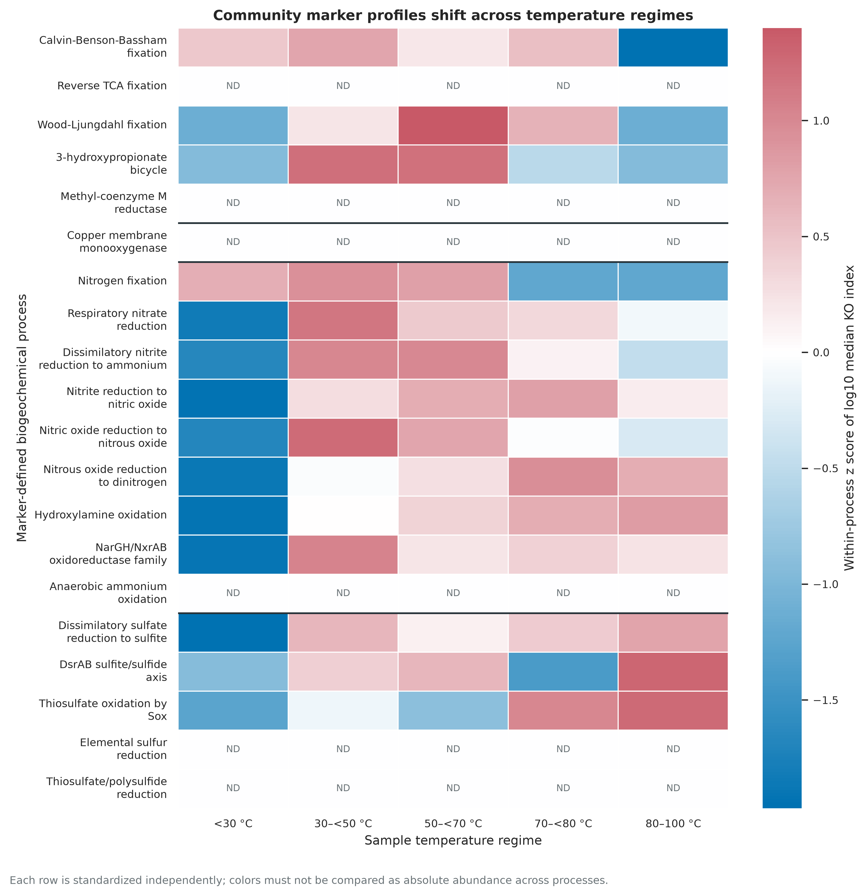
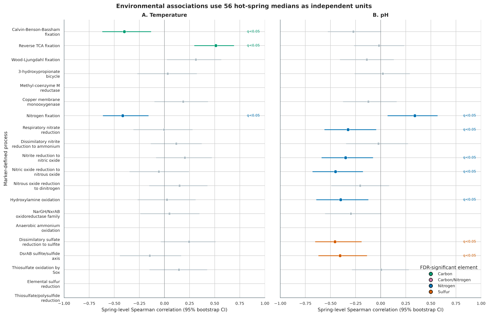
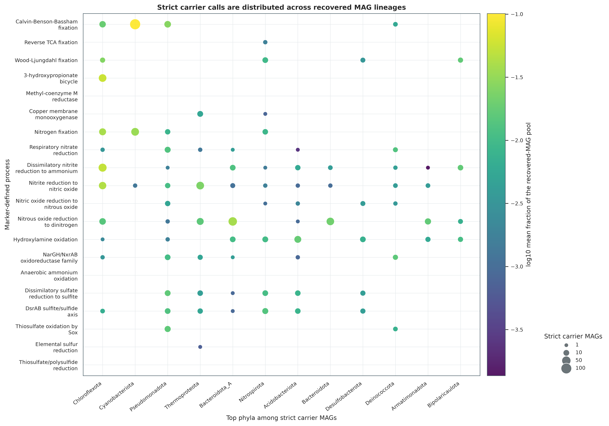
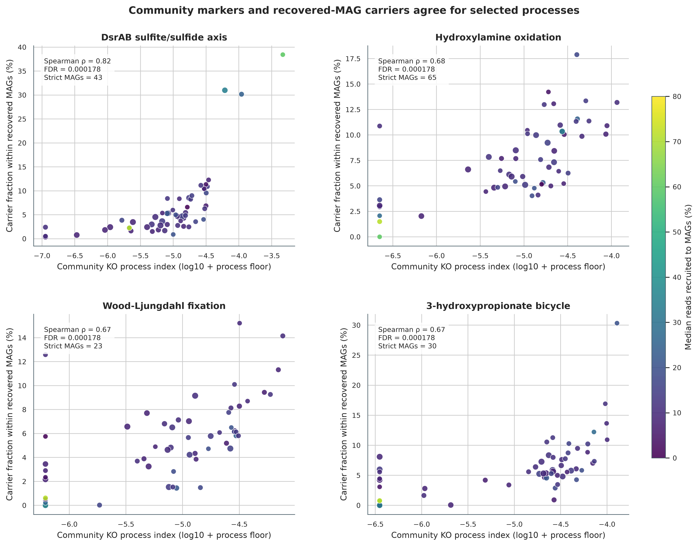
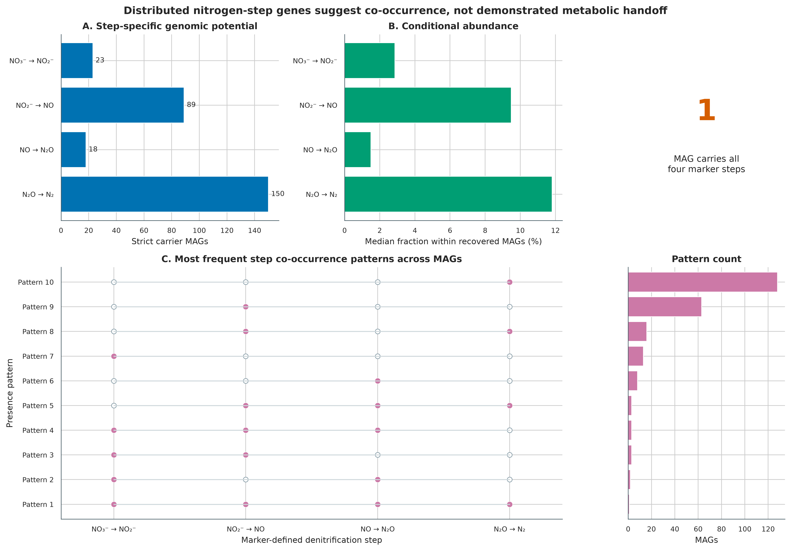
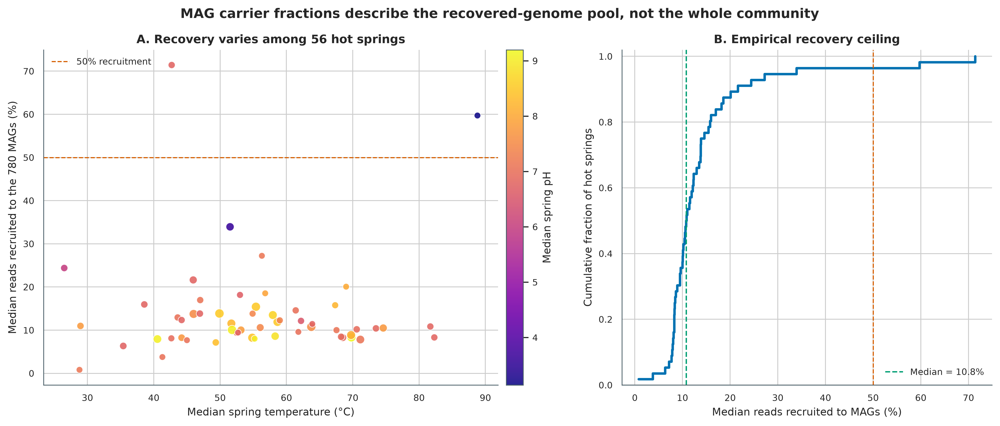

> **先给结论：**碳、氮、硫循环分析不能停在“检出一个 KO”。可靠的结果至少要同时交代：通路公式、必要标记是否齐全、同源蛋白能否区分反应方向、样本的独立层级、MAG 回收率，以及结论究竟来自 whole-community reads 还是 recovered-genome pool。这里把连续的群落 KO 指数和同一 MAG 内的严格载体判定分开；两层一致时提高候选优先级，两层不一致时优先检查不完整通路、MAG 丢失和同源歧义。

真实数据来自 2026 年发布的美国西部温泉调查：**500 份 shotgun metagenomes、56 个 hot springs、780 个 completeness ≥80% 且 contamination ≤5% 的 MAG** [@korchagina2026hotsprings; @louca2026hotsprings]。原研究的 community KO table 含 10,011 个 KOs，MAG KO table 含 6,841 个 KOs；本次预先登记 20 个 C/N/S 过程、68 个必要 marker KOs，并同时保留 DiTing-style raw index 与完整标记门控后的主分析指数。

::: {.callout-important title="算力、磁盘与数据门槛"}
核验 `data/small/62-element-cycling-frozen/`、重算 20 个过程、完成 9,999 次标签置换与 2,000 次 bootstrap、重画 6 组图，建议 **2 CPU、4 GB RAM、1 GB 可用磁盘，耗时约 1--3 分钟**。本次实跑峰值 RSS 为 168,344 KB；冻结包包含全部重分析输入，因此不需要联网。

从 Figshare v2 重新下载 5 张研究表和锁定的 DiTing formula file 共约 22 MB，建议 **2 CPU、8 GB RAM、2 GB 磁盘，耗时约 2--10 分钟**，网络速度决定下载时间。若从 500 份原始 FASTQ 重做组装、基因预测、read mapping、KOfam 注释和 780 个 MAG，则需要 HPC 或云计算：建议 **32--60 CPU、≥256 GB RAM、TB 级临时磁盘和数天到数周**。没有服务器时直接从论文发布的 KO/MAG tables 和本章冻结包起步；不要用几条手工序列冒充全流程验证。
:::

## 这一步对应论文里的哪张图 {#sec-target}

原研究 **Figure 3K** 汇总 500 个 metagenomes 的 community functional profiles，**Figure 4K--L** 把功能潜力定位到 780 个 MAG，并比较不同温泉与环境梯度 [@korchagina2026hotsprings]。这里忠实保留“community profile + MAG carrier”双层框架，同时增加三项审计：

1. 500 个样本嵌套在 56 个温泉中，环境关联以 **温泉中位数** 为独立单位；
2. DiTing-style 连续公式先保留为 `RawCommunityIndex`，主分析再要求必要 marker set 完整；
3. MAG abundance 只除以已回收 MAG 的总 abundance，并与 read recruitment 一起报告。

{#fig-62-landscape}

## 理论：从 marker gene 到元素循环结论要跨过哪些门 {#sec-theory}

### 1. 同一过程需要两个不同对象

| 分析层 | 输入 | 回答的问题 | 不能回答的问题 |
|---|---|---|---|
| Community KO profile | reads/contigs 汇总后的 KO proportions | 整个样本是否具备某组基因、相对过程指数如何变化 | 哪个基因组携带完整模块 |
| MAG carrier | 每个 MAG 的 KO presence/count | 哪个 recovered genome 同时携带必要标记 | 未回收基因组的功能、原位表达与速率 |
| MAG abundance | MAG × sample relative abundance | 已回收 MAG 池中 carrier 占多少 | carrier 占 whole community 的比例 |
| Environment association | 56 个温泉的中位数 | marker potential 与温度/pH 是否单调相关 | 温度或 pH 的因果效应 |

community 层允许不同物种共同提供一个群落过程所需基因；carrier 层要求必要基因出现在同一个 MAG。前者适合画生态梯度，后者适合寻找功能类群。两者不是彼此替代的结果。

### 2. 连续公式和完整性门控承担不同任务

对过程 $p$ 和样本 $s$，先按锁定公式 $f_p$ 计算原始过程指数：

$$
I^{raw}_{ps}=f_p(a_{K_1s},a_{K_2s},\ldots,a_{K_ms}),
$$

其中 $a_{Ks}$ 是论文发布的 KO proportion。以 Calvin--Benson--Bassham cycle 为例，连续指数为：

$$
I^{raw}_{CBB,s}=\frac{a_{K00855,s}+a_{K01601,s}}{2}.
$$

只做平均会让“不完整模块”得到正分。例如某条五基因通路只检出一个 KO，raw index 仍可能大于 0。因此再把必要标记写成析取范式（disjunctive normal form, DNF）：逗号表示 AND，分号表示 alternative OR。设 $G_{ps}=1$ 表示至少一个备选 marker set 全部出现，则主分析使用：

$$
I_{ps}=I^{raw}_{ps}\times G_{ps}.
$$

raw index 是对 DiTing formula 的忠实复现；complete-gated index 是面向“完整 genetic potential”的升级。两者都保留在 `sample-process-index.tsv.gz`，不能只留升级结果而抹掉审计轨迹 [@xue2021diting]。

### 3. MAG carrier 要求必要标记落在同一基因组

对 MAG $g$，严格载体定义为：

$$
C_{pg}^{strict}=\mathbb{1}\left[\bigvee_j\bigwedge_{K\in A_{pj}} x_{gK}>0\right],
$$

其中 $A_{pj}$ 是第 $j$ 套备选 marker set。主结果只使用 `StrictCarrier`。对含至少 3 个 marker 的模块，另做 `Relaxed80Carrier` sensitivity：最佳备选集合的 marker completeness ≥80% 即通过；二基因与单基因 marker 不做“80% 四舍五入”。relaxed call 用于评估 MAG incompleteness，不替代严格载体定义。

### 4. “有基因”不总能确定反应方向

| Marker | 可支持的谨慎表述 | 不能直接写成 |
|---|---|---|
| `McrABG` | methanogenesis 或 anaerobic methane oxidation potential | 净产甲烷速率 |
| `pmoCAB/amoCAB` | copper membrane monooxygenase family | 已区分甲烷氧化与氨氧化 |
| `NarGH/NxrAB` | nitrate/nitrite oxidoreductase family | 已确定硝酸盐还原或亚硝酸盐氧化方向 |
| `DsrAB` | sulfite/sulfide redox axis | 已确定还原型或 reverse oxidative sulfur metabolism |
| `NosZ` | N2O reduction genetic potential | 样本正在净消耗 N2O |

同源 KO、可逆酶、共享 subunit 和缺少 genomic context 都会造成方向歧义。可用 operon neighborhood、伴随亚基、taxonomy、reaction-specific HMM、protein phylogeny 和环境化学逐级收窄，但宏基因组 DNA 仍不能替代转录、蛋白、代谢物或 isotope rate measurement。

### 5. 独立单位决定有效样本量

500 个样本来自 56 个温泉，同一温泉的重复采样共享地理、地球化学和历史条件。把 500 行直接送入相关检验会把 technical/within-spring replication 误当成 500 个独立生态系统。主分析先对每个 spring × process 取中位数，再检验 56 个 spring medians：

$$
\rho_p=\operatorname{Spearman}\left(\widetilde I_{p, spring},\widetilde E_{spring}\right).
$$

两侧 $P$ 值来自 9,999 次固定 seed 的标签置换；95% 区间来自 2,000 次 spring-level bootstrap，每次重新计算 ranks；温度和 pH 各自做 Benjamini--Hochberg FDR。为避免由一两个阳性温泉驱动稀疏相关，推断前预设 **至少 12/56 个温泉（约 20%）为非零**；community--MAG concordance 则要求两轴都达到该门槛。temperature-regime heatmap 只是描述图，不承担独立推断。

### 6. MAG fraction 的分母必须写进名字

设 $b_{gs}$ 为发布 BIOM 表中 MAG $g$ 在样本 $s$ 的 abundance，载体的条件比例为：

$$
F_{ps}^{recovered}=\frac{\sum_g b_{gs}C_{pg}^{strict}}{\sum_g b_{gs}}.
$$

这不是 whole-community functional fraction。原研究报告 MAG recruitment 平均约 13%；本次 500 个样本的中位数为 **11.17%**，范围 **0.82%--77.90%**。因此正文统一称“已回收 MAG 池内的条件比例”，并把 recruitment 画成证据上限。

## 准备工作 {#sec-preparation}

### 真实数据与版本身份

| 资源 | 研究内对象 | 锁定身份 |
|---|---:|---|
| Data 01 | 500-row sample metadata | 133,160 bytes；SHA-256 `8dc11ab0...f1c37` |
| Data 05 | 500 × 10,011 community KO proportions | 15,712,433 bytes；SHA-256 `7a25f3bd...0c9d` |
| Data 07 | 780-row MAG metadata | 3,750,601 bytes；SHA-256 `fd667ac8...825f` |
| Data 08 | 780 × 500 sparse MAG abundance BIOM | 2,017,689 bytes；SHA-256 `d3188968...b131` |
| Data 15 | 780 × 6,841 MAG KO counts | 684,507 bytes；SHA-256 `4733be48...197c` |
| DiTing formulas | `Pathway_formulas.txt` | v0.3 commit `53e1d3e...b477`；SHA-256 `96e32f16...fecd` |

全部研究表来自 Figshare release `10.6084/m9.figshare.30284068.v2`。原研究先用 Prodigal 2.6.3 `-p meta` 预测基因，再用 HMMER 3.3 对 KOfam r111 profile HMM 注释，以 `E-value < 10^-10` 保留 KO；community KO proportions 来自 contig read mapping 与长度校正，MAG functional potential 来自 MAG KO inventory [@hyatt2010prodigal; @eddy2011hmmer; @aramaki2020kofamkoala; @korchagina2026hotsprings]。本章从这些论文发布表读起，不把二次表分析伪装成原始 reads 重注释。

<details>
<summary><strong>安装环境、下载/核验输入并内联作图函数</strong></summary>

```bash
# Exact environment actually used for the frozen analysis.
conda create --name metagenome-elements-2026.08 \
  --file env/drep-linux-64.lock

# Or install the required analysis/plotting packages explicitly.
mamba create -n metagenome-elements-2026.08 -c conda-forge -y \
  python=3.11 pandas=2.2.3 numpy=1.26.4 scipy=1.13.1 \
  matplotlib=3.11.1 seaborn=0.13.2 pillow=12.3.0

conda run -n metagenome-elements-2026.08 python \
  scripts/download_article62_element_data.py \
  --cache-dir db/element-cycle-cache

conda run -n metagenome-elements-2026.08 python \
  scripts/download_article62_element_data.py \
  --cache-dir db/element-cycle-cache --verify-only
```

```{r}
install.packages(c("ggplot2", "dplyr", "readr", "tidyr", "scales", "patchwork"))
library(ggplot2); library(dplyr); library(readr); library(tidyr); library(scales)
set.seed(20260762)

pal_pub <- c(
  "Carbon" = "#009E73", "Carbon/Nitrogen" = "#CC79A7",
  "Nitrogen" = "#0072B2", "Sulfur" = "#D55E00",
  "Significant" = "#0072B2", "Not significant" = "#B0BEC5",
  "Strict" = "#0072B2", "Relaxed" = "#E69F00", "Gray" = "#6B7478"
)
scale_color_pub <- function(...) scale_color_manual(values = pal_pub, ...)
scale_fill_pub  <- function(...) scale_fill_manual(values = pal_pub, ...)
theme_pub <- function(base_size = 12) {
  theme_bw(base_size = base_size) + theme(
    panel.grid.minor = element_blank(),
    panel.grid.major = element_line(color = "#ECEFF1", linewidth = 0.3),
    axis.text = element_text(color = "black"),
    legend.key = element_blank(),
    strip.background = element_rect(fill = "#EDF2F4", color = NA),
    plot.title.position = "plot",
    plot.caption = element_text(color = "#455A64", hjust = 0)
  )
}
save_pub <- function(plot, file_base, width = 210, height = 150,
                     units = "mm", dpi = 350) {
  dir.create(dirname(file_base), recursive = TRUE, showWarnings = FALSE)
  ggsave(paste0(file_base, ".pdf"), plot, width = width, height = height,
         units = units, device = cairo_pdf, bg = "white")
  ggsave(paste0(file_base, ".png"), plot, width = width, height = height,
         units = units, dpi = dpi, bg = "white")
  ggsave(paste0(file_base, ".tiff"), plot, width = width, height = height,
         units = units, dpi = dpi, compression = "lzw", bg = "white")
  invisible(plot)
}
```

</details>

### 先核验固化证据

冻结目录包含 7 个原始发布资源/manifest、20-process rule table、全部分析表、软件版本、脚本和环境 lock。先核验 checksum，再读结果；任何一个 payload 变化都应停止，而不是继续画图。

```bash
FROZEN="$PWD/data/small/62-element-cycling-frozen"
sha256sum -c "$FROZEN/file-checksums.sha256"
column -ts $'\t' "$FROZEN/run-ledger.tsv"
column -ts $'\t' "$FROZEN/missing-ko-columns.tsv"
cat "$FROZEN/analysis-metrics.json"
```

## 可复制代码：从发布 KO 表到过程指数与 MAG 载体 {#sec-code}

### 第 1 步：读取 68 个预登记 markers，同时审计完整表宽度

```python
from pathlib import Path
import hashlib
import re
import numpy as np
import pandas as pd

ROOT = Path.cwd()
CACHE = ROOT / "db/element-cycle-cache"
RULES = ROOT / "data/small/62-element-cycle-marker-rules.tsv"
SEED = 62001

def rng_for(label):
    payload = hashlib.sha256(f"{SEED}|{label}".encode()).digest()
    return np.random.default_rng(int.from_bytes(payload[:8], "little"))

rules = pd.read_csv(RULES, sep="\t", dtype=str)
assert len(rules) == 20 and rules.ProcessID.is_unique

ko_pattern = re.compile(r"K\d{5}")
required_kos = sorted(set().union(
    *(set(ko_pattern.findall(value)) for value in rules.CommunityFormula),
    *(set(ko_pattern.findall(value)) for value in rules.StrictCarrierDNF),
))
assert len(required_kos) == 68

community_header = pd.read_csv(
    CACHE / "ko-proportions-in-metagenomes.tsv.gz", sep="\t", nrows=0
)
mag_header = pd.read_csv(CACHE / "kos-in-mags.tsv.gz", sep="\t", nrows=0)
assert len(community_header.columns) - 1 == 10011
assert len(mag_header.columns) - 1 == 6841

def read_markers(path, id_column):
    available = set(pd.read_csv(path, sep="\t", nrows=0).columns)
    present = sorted(set(required_kos) & available)
    frame = pd.read_csv(path, sep="\t", usecols=[id_column] + present)
    missing = sorted(set(required_kos) - available)
    for ko in missing:
        frame[ko] = 0.0
    return frame[[id_column] + required_kos], missing

community_kos, missing_community = read_markers(
    CACHE / "ko-proportions-in-metagenomes.tsv.gz", "sample"
)
mag_kos, missing_mag = read_markers(CACHE / "kos-in-mags.tsv.gz", "MAG")
metadata = pd.read_csv(CACHE / "sample-metadata.tsv", sep="\t")
metadata["temperature"] = pd.to_numeric(metadata.temperature, errors="coerce")
metadata["pH"] = pd.to_numeric(metadata.pH, errors="coerce")
assert len(community_kos) == 500 and len(mag_kos) == 780
```

只加载 marker 列可以节省内存，但 Methods 仍要报告完整发布表的 10,011/6,841 KOs，不能把“本次读入 68 列”误写成数据库只有 68 个 KOs。发布表未出现的 9 个 community marker columns 和 10 个 MAG marker columns 被显式补 0，并写入 `missing-ko-columns.tsv`。

### 第 2 步：同时计算 raw formula 与 complete-gated index

```python
FORMULA_GRAMMAR = re.compile(r"^[K0-9+()*/.\-\s]+$")

def evaluate_formula(frame, formula):
    if FORMULA_GRAMMAR.fullmatch(formula) is None:
        raise ValueError(f"Unsafe formula: {formula}")
    names = sorted(set(ko_pattern.findall(formula)))
    local = {name: frame[name].to_numpy(float) for name in names}
    value = eval(formula, {"__builtins__": {}}, local)
    value = np.asarray(value, dtype=float)
    assert value.shape == (len(frame),)
    assert np.isfinite(value).all() and (value >= 0).all()
    return value

def parse_dnf(text):
    groups = [group.split(",") for group in text.split(";")]
    assert all(groups) and all(ko_pattern.fullmatch(ko) for g in groups for ko in g)
    return groups

def complete_gate(frame, dnf):
    alternatives = []
    for group in parse_dnf(dnf):
        alternatives.append((frame[group].to_numpy(float) > 0).all(axis=1))
    return np.column_stack(alternatives).any(axis=1)

community_rows = []
for rule in rules.itertuples(index=False):
    raw = evaluate_formula(community_kos, rule.CommunityFormula)
    gate = complete_gate(community_kos, rule.StrictCarrierDNF)
    community_rows.append(pd.DataFrame({
        "SampleID": community_kos["sample"],
        "ProcessID": rule.ProcessID,
        "RawCommunityIndex": raw,
        "CommunityCompleteGate": gate,
        "CommunityIndex": np.where(gate, raw, 0.0),
    }))
community_long = pd.concat(community_rows, ignore_index=True)
```

10,000 个 sample × process pairs 中，**6,504 个**通过完整标记门控。anammox 和 thiosulfate/polysulfide reduction 的核心 marker columns 在发布表中缺失，因而 gated index 为 0；raw formula 仍保留，避免把“门控升级”冒充原公式输出。

### 第 3 步：用 56 个温泉做置换与 bootstrap

```python
from scipy.stats import rankdata

spring = (
    community_long.merge(metadata, left_on="SampleID", right_on="sample")
    .groupby(["hotspring", "ProcessID"], as_index=False)
    .agg(
        CommunityIndex=("CommunityIndex", "median"),
        Temperature=("temperature", "median"),
        pH=("pH", "median"),
        Samples=("SampleID", "nunique"),
    )
)

def pearson_rows(x, y):
    xc = x - x.mean(axis=1, keepdims=True)
    yc = y - y.mean(axis=1, keepdims=True)
    numerator = (xc * yc).sum(axis=1)
    denominator = np.sqrt((xc**2).sum(axis=1) * (yc**2).sum(axis=1))
    return np.divide(numerator, denominator,
                     out=np.full(len(x), np.nan), where=denominator > 0)

def permutation_spearman(x, y, rng, n_perm=9999, n_boot=2000):
    keep = np.isfinite(x) & np.isfinite(y)
    x, y = np.asarray(x[keep]), np.asarray(y[keep])
    xr, yr = rankdata(x), rankdata(y)
    observed = pearson_rows(xr[None, :], yr[None, :])[0]
    permuted = np.vstack([rng.permutation(yr) for _ in range(n_perm)])
    null = pearson_rows(np.broadcast_to(xr, permuted.shape), permuted)
    p_value = (1 + (np.abs(null) >= abs(observed)).sum()) / (n_perm + 1)

    indices = rng.integers(0, len(x), size=(n_boot, len(x)))
    boot_xr = rankdata(x[indices], axis=1)
    boot_yr = rankdata(y[indices], axis=1)
    boot = pearson_rows(boot_xr, boot_yr)
    ci = np.nanquantile(boot, [0.025, 0.975])
    return observed, p_value, ci

# Apply before testing each process.
process_springs = spring.loc[spring.ProcessID.eq(process_id)]
if process_springs.CommunityIndex.gt(0).sum() < 12:
    result = (np.nan, np.nan, (np.nan, np.nan))
else:
    result = permutation_spearman(
        process_springs.CommunityIndex.to_numpy(float),
        process_springs.Temperature.to_numpy(float),
        rng_for(f"environment|Temperature|{process_id}"),
    )
```

温度通过 FDR 0.05 的过程为 reverse TCA fixation（$\rho=0.512$）、nitrogen fixation（$\rho=-0.416$）和 CBB fixation（$\rho=-0.399$）。pH 有 7 个过程通过 FDR 0.05，其中 nitric oxide → nitrous oxide（$\rho=-0.450$）和 sulfate → sulfite（$\rho=-0.454$）效应最大。它们仍是 observational associations，不能写成温度/pH 驱动通路活性的因果结论。

{#fig-62-environment}

### 第 4 步：对每个 MAG 调用严格载体与 80% sensitivity

```python
def carrier_evidence(frame, dnf):
    fractions, observed, totals, strict = [], [], [], []
    for group in parse_dnf(dnf):
        present = frame[group].to_numpy(float) > 0
        fractions.append(present.mean(axis=1))
        observed.append(present.sum(axis=1))
        totals.append(np.full(len(frame), len(group), dtype=int))
        strict.append(present.all(axis=1))
    fraction_matrix = np.column_stack(fractions)
    best = fraction_matrix.argmax(axis=1)
    rows = np.arange(len(frame))
    return pd.DataFrame({
        "StrictCarrier": np.column_stack(strict).any(axis=1),
        "BestMarkerCompleteness": fraction_matrix[rows, best],
        "ObservedMarkers": np.column_stack(observed)[rows, best],
        "BestAlternativeMarkerCount": np.column_stack(totals)[rows, best],
    })

evidence = []
for rule in rules.itertuples(index=False):
    called = carrier_evidence(mag_kos, rule.StrictCarrierDNF)
    maximum_markers = max(len(group) for group in parse_dnf(rule.StrictCarrierDNF))
    called["Relaxed80Carrier"] = (
        called.BestMarkerCompleteness.ge(0.8)
        if maximum_markers >= 3 else called.StrictCarrier
    )
    called["MAG"] = mag_kos.MAG
    called["ProcessID"] = rule.ProcessID
    evidence.append(called)
evidence = pd.concat(evidence, ignore_index=True)
```

20 个过程合计产生 **818 个严格 process--MAG calls**；这不是 818 个互不重复 MAG，因为同一个 MAG 可携带多个过程。80% sensitivity 为 852 calls。严格载体最多的是 nitrous oxide → dinitrogen（150 MAGs）、CBB fixation（134）、nitrite → nitric oxide（89）和 DNRA nitrite → ammonium（79）。

{#fig-62-carriers}

### 第 5 步：把 carrier 与 MAG abundance 合并，但保留 recovery ceiling

```python
import json

biom = json.loads((CACHE / "mag-abundances-per-sample.biom").read_text())
assert biom["matrix_type"] == "sparse" and biom["shape"] == [780, 500]

matrix = np.zeros(biom["shape"], dtype=float)
for row, column, value in biom["data"]:
    matrix[int(row), int(column)] = float(value)
abundance = pd.DataFrame(
    matrix,
    index=[row["id"] for row in biom["rows"]],
    columns=[column["id"] for column in biom["columns"]],
)

strict = evidence.pivot(index="MAG", columns="ProcessID", values="StrictCarrier")
denominator = abundance.sum(axis=0).replace(0, np.nan)
carrier_fraction = pd.DataFrame(index=abundance.columns)
for process_id in rules.ProcessID:
    carrier_mags = strict.index[strict[process_id]]
    carrier_fraction[process_id] = abundance.loc[carrier_mags].sum(axis=0) / denominator
```

community index 与 recovered-MAG carrier fraction 的检验同样要求两轴各有至少 12 个非零温泉，最终 **14 个过程**通过 FDR 0.05。这里的 concordance 说明两种数据表示对同一 marker signal 有一致排序，不是独立实验验证；两层都来自同一批 metagenomes，且都受 KO annotation 与 compositionality 影响。

{#fig-62-concordance}

### 第 6 步：氮循环“分工”先写成 co-occurrence

四个 denitrification marker steps 的严格载体数分别为 23、89、18 和 150；只有 **1 个 MAG** 同时通过四步严格门控。不同 MAG 分别携带相邻步骤，为“community-level division of genetic potential”提供候选，但尚未证明细胞之间发生 metabolite handoff。要升级为 handoff，需要同一时空尺度的 expression、NOx/N2O chemistry、isotope tracing 或受控共培养。

{#fig-62-nitrogen}

### 第 7 步：一条命令重放分析、出版图与冻结包

```bash
ROOT="$PWD"
RUN="$ROOT/.tutorial_runs/article62"
PYTHON="$CONDA_PREFIX/bin/python"
export MPLCONFIGDIR="/tmp/article62-matplotlib"
export OMP_NUM_THREADS=1 OPENBLAS_NUM_THREADS=1 MKL_NUM_THREADS=1

"$PYTHON" scripts/run_article62_element_cycles.py \
  --cache-dir db/element-cycle-cache \
  --rules data/small/62-element-cycle-marker-rules.tsv \
  --output-dir "$RUN"

"$PYTHON" scripts/plot_article62_element_cycles.py \
  --analysis-dir "$RUN" \
  --figure-dir figures

"$PYTHON" scripts/freeze_article62_element_cycles.py \
  --project-root "$ROOT" \
  --analysis-dir "$RUN" \
  --cache-dir db/element-cycle-cache \
  --output-dir data/small/62-element-cycling-frozen
```

## 审计与升级 {#sec-audit}

### 1. 先忠实保留公式，再增加完整性门控

DiTing 为 100 余条 biogeochemical pathways 提供可比较公式 [@xue2021diting]。连续公式适合保留定量信息，但加法/平均会给 partial pathway 正分。本章不暗改原值：`RawCommunityIndex` 保存公式结果，`CommunityCompleteGate` 保存必要 marker set 是否齐全，`CommunityIndex` 才是 gated primary outcome。投稿时应同时提供公式表、缺失 KO 表和 raw/gated sensitivity。

### 2. 缺失列必须区分“未发布”与“真零”

community table 缺少 `K08353`、`K08354`、`K20932`--`K20935`、`K22896`、`K22897`、`K22899`；MAG table 还缺 `K22898`。发布宽表只包含研究中观察到的 KOs，因此补 0 表示“该发布资源中没有非零记录”，而不是数据库从未定义该 KO。补零名单进入 frozen audit，不能静默填充。

### 3. 通路名必须服从 annotation specificity

`pmoCAB/amoCAB`、`NarGH/NxrAB`、`McrABG` 与 `DsrAB` 是最容易被标题写过头的四类。当前标准应增加 genomic neighborhood、伴随亚基、反应特异 HMM 或 protein tree；若做不到，图题保留 family/axis，Results 明写 direction unresolved。METABOLIC 或 DRAM 可作为独立 annotation framework 复核 marker context，但软件一致不等于生物学真值 [@zhou2022metabolic; @shaffer2020dram]。

### 4. 500 个样本不是 500 个独立温泉

原图可以展示 500 个 profiles，但推断必须尊重采样层级。这里用 56 个 spring medians，避免伪重复；如果研究设计还有 region、year、spring site 和 repeated visits，应使用 multilevel model、cluster bootstrap 或 within-spring permutation。只把 `n=500` 写进摘要而忽略 `56 springs`，会严重夸大精度。

### 5. MAG recovery 是结论上限，不是附录数字

500 个样本的 recruitment 中位数为 11.17%；56 个 spring medians 的中位数为 10.81%，仅少数温泉超过 50%。低 recruitment 下，“某过程载体占 recovered MAGs 的 30%”不能改写为“占 community 的 30%”。若要 whole-community attribution，应报告 read-to-gene、read-to-MAG、unbinned contig 和 assembly-free marker estimates，并对未回收部分做 sensitivity bounds。

{#fig-62-recovery}

### 6. 环境关联仍受共线与组成效应影响

温度、pH、地理区域、矿物、氧化还原状态和采样年份可能共同变化。单变量 Spearman 只能发现排序关联；FDR 也不能消除 omitted-variable bias。升级分析应先画环境变量相关矩阵，再用 spring-level partial/multivariable model、region-stratified sensitivity 和 compositional transformation。若温度与 pH 高度共线，不应把两张单变量图解释成两个独立机制。

### 7. incomplete MAG 会制造 false negative，宽松门控也会制造 false positive

780 个 MAG 已满足 completeness ≥80%、contamination ≤5%，仍可能恰好丢失关键 marker。80% sensitivity 让 multi-marker modules 多出 34 个 process--MAG calls，量化了这一风险；但两基因模块不能用“一缺一也算 50% 接近完整”的逻辑放宽。更稳的升级是按 MAG completeness 建模 detection probability，并结合 contig linkage、coverage covariance 和 close-reference pangenome 检查缺失是否可信。

### 8. community--MAG concordance 不是外部验证

14 个过程的显著一致性很高，但两个表示共享相同样本、KO annotation 与 compositional structure。它能发现 gross inconsistency，例如 community signal 很高但 recovered carriers 全为 0；不能充当 expression、process rate 或 external cohort replication。外部验证应换地点/年份/研究队列，机制验证应加入 metatranscriptomics、metaproteomics、chemistry 或 isotope data。

## 出版级美化 {#sec-publication}

| 图 | 视觉编码 | Caption 必须声明 |
|---|---|---|
| Process landscape | 每过程独立 log + z score heatmap | 不跨过程比较绝对颜色；ND 含义 |
| Environment forest | rho + bootstrap CI + FDR color | 56 springs，而不是 500 独立样本 |
| MAG carrier map | 点大小 = MAG 数；颜色 = conditional abundance | denominator 是 recovered MAG pool |
| Concordance panels | community index × carrier fraction；颜色 = recruitment | 两层非独立、仅 marker concordance |
| Nitrogen co-occurrence | step bars + presence-pattern matrix | co-occurrence 不等于 handoff |
| Recovery ceiling | spring recruitment scatter + ECDF | recruitment 限制 whole-community attribution |

所有轴、图例、过程名和注释使用英文。红蓝只用于有明确中心点的 diverging quantity；类别用 Okabe--Ito-compatible colors。原生数值保留在 TSV，log/z transform 只服务显示。PDF 保留矢量文字，PNG/TIFF 以 350 dpi 输出；TIFF 使用 LZW compression。

```bash
for stem in \
  62-process-landscape \
  62-environment-associations \
  62-mag-carrier-map \
  62-community-mag-concordance \
  62-nitrogen-step-cooccurrence \
  62-mag-recovery-ceiling
do
  test -s "figures/${stem}.pdf"
  test -s "figures/${stem}.png"
  test -s "figures/${stem}.tiff"
done
```

## 常见坑 {#sec-pitfalls}

::: {.callout-caution title="坑 1：一个 marker 就命名整条通路"}
单个 `nosZ`、`hao` 或 `dsrA` 适合写 marker/family potential，不足以证明完整 pathway、方向和速率。把必要复合体与备选路线写成机器可读规则，并报告完整性。
:::

::: {.callout-caution title="坑 2：把 raw formula 的正值当成完整通路"}
加法/平均公式允许 partial pathway 得分。保留 raw index 用于复现，同时用必要 marker gate 做主分析；不要二选一后隐藏另一层。
:::

::: {.callout-caution title="坑 3：把 500 个嵌套样本当作 500 个独立生态系统"}
重复采自同一温泉的样本共享环境。统计单位应由 sampling design 决定，而不是由表的行数决定。
:::

::: {.callout-caution title="坑 4：把 MAG 内条件比例写成 whole-community fraction"}
当 recruitment 中位数只有 11.17% 时，未回收部分占主导。图轴、列名和 Methods 都要出现 `within recovered MAGs`。
:::

::: {.callout-caution title="坑 5：忽略同源与反应方向"}
CuMMO、Nar/Nxr、Mcr 与 Dsr 都需要 context。若不能区分，宁可把过程名降级为 family/axis，也不要用箭头制造确定性。
:::

::: {.callout-caution title="坑 6：把 marker concordance 当作实验验证"}
community KO 和 MAG KO 来自同一测序资源。两者一致提高内部可信度，但不是独立队列、活性或因果验证。
:::

::: {.callout-caution title="坑 7：跨过程比较 heatmap 颜色"}
不同公式的 marker 数、分母和尺度不同。本章逐行标准化，只能比较同一过程在温度组之间的相对变化。
:::

::: {.callout-caution title="坑 8：把功能分工写成 metabolite handoff"}
不同 MAG 携带相邻氮循环步骤只说明 genes are distributed。真实 handoff 还需要共时空表达、底物/产物和方向性证据。
:::

## 这段 Methods 怎么写 {#sec-methods}

> **Element-cycle profiling.** Community-level and genome-resolved functional tables were obtained from Figshare release v2 (doi:10.6084/m9.figshare.30284068.v2), accompanying a survey of 500 shotgun metagenomes from 56 western-US hot springs. The source study predicted genes with Prodigal v2.6.3 in metagenomic mode and assigned KEGG Orthologs using HMMER v3.3 against KOfam release r111 at an E-value threshold of $10^{-10}$. The released inputs comprised a 500 × 10,011 community KO-proportion table, a 780 × 6,841 MAG KO-count table, metadata for 780 MAGs meeting ≥80% completeness and ≤5% contamination, and a 780 × 500 sparse MAG-abundance BIOM table. Twenty carbon, nitrogen and sulfur processes involving 68 preregistered marker KOs were evaluated using checksum-locked formulas informed by DiTing v0.3 (source commit `53e1d3edb84be08b7aacb79ac588be671250b477`). For each process, the published continuous formula was retained as a raw index, while the primary community index was set to zero unless at least one complete prespecified marker alternative was detected. A strict MAG carrier required all markers of at least one alternative to occur within the same MAG; an 80%-complete call was used only as a sensitivity analysis for marker sets containing at least three genes. Environmental associations were tested on one median per hot spring ($n=56$) using two-sided Spearman statistics, 9,999 label permutations and 2,000 spring-level bootstrap resamples with ranks recomputed in each resample. A process required nonzero values in at least 12 springs before inference; community-to-MAG concordance required this prevalence on both axes. Temperature and pH tests were adjusted separately by the Benjamini--Hochberg procedure. MAG carrier abundance was normalized only within the recovered-MAG pool and interpreted together with sample-specific metagenome-to-MAG read recruitment. Community-to-MAG concordance was assessed at the hot-spring level with the same resampling scheme. Random number generation used seed 62001. All outputs were interpreted as genetic potential and not as evidence of expression, reaction direction, process rate or metabolite transfer.

> **Results template.** Complete marker sets were detected in 6,504 of 10,000 sample--process combinations. Three temperature associations and seven pH associations passed a 5% false-discovery-rate threshold across 20 processes using 56 hot springs as independent units. Across 780 MAGs, 818 strict process--MAG carrier calls were observed, compared with 852 calls under the prespecified 80%-marker sensitivity rule. Community indices and carrier fractions within recovered MAGs were significantly concordant for 14 processes; these results were considered internal marker-level agreement rather than independent validation. The median fraction of metagenomic reads recruited to the MAG set was 11.17% (range 0.82%--77.90%), so carrier fractions were not extrapolated to the whole community. Only one MAG carried all four marker-defined denitrification steps, and step distributions were described as genomic co-occurrence rather than demonstrated metabolic handoff.

投稿附件至少应包含：source release 与 checksum manifest、20-process formula/DNF table、missing KO audit、raw/gated community indices、MAG strict/relaxed evidence table、56-spring aggregation table、全部 permutation/FDR results、MAG recruitment distribution、软件版本和随机种子。若更换 KEGG/KOfam release、KO threshold、process formula 或 MAG quality gate，Methods 中的版本、维度和结果计数必须同步重算。

## 换成你自己的数据怎么做 {#sec-own-data}

### 最少需要什么

1. samples × KO 的 abundance/proportion table，说明 read mapping、长度校正和分母；
2. MAG × KO 的 presence/count table，以及每个 MAG 的 completeness、contamination 和 taxonomy；
3. MAG × sample abundance table和每个样本的 read-to-MAG recruitment；
4. `sample_id`、独立 site/subject、batch、时间、temperature、pH 与主要共变量；
5. versioned process formula 与 strict marker rule table；
6. 若要谈活性或速率：metatranscriptomics、metaproteomics、环境化学、gas flux 或 isotope tracing。

### 迁移顺序

```python
# 1. Lock identifiers and units before scoring.
assert sample_metadata.sample_id.is_unique
assert mag_metadata.MAG.is_unique
assert set(ko_table.sample) == set(sample_metadata.sample_id)

# 2. Preserve the raw formula and add a separate completeness gate.
raw = evaluate_formula(ko_table, formula)
gate = complete_gate(ko_table, strict_dnf)
primary = np.where(gate, raw, 0.0)

# 3. Aggregate at the actual independent unit.
site_level = (
    sample_results.merge(sample_metadata)
    .groupby(["site_id", "ProcessID"], as_index=False)
    .agg(ProcessIndex=("CommunityIndex", "median"))
)

# 4. Keep the recovered-pool denominator explicit.
carrier_fraction_recovered = carrier_mag_abundance / all_recovered_mag_abundance
```

若没有 MAG，仍可做 community process index，但结论停在“样本层面的 marker-defined potential”；若只有 MAG 而没有 whole-community KO table，可以找 carriers，但不能判断未分箱部分是否携带同一功能。环境样本常存在 region/site/year hierarchy，优先用 cluster bootstrap 或 mixed model。人体数据则把 site 换成 subject，并处理重复时间点、药物、饮食与 batch。

### 把候选升级为机制

建议按以下证据阶梯推进：marker formula 与必要基因均通过；同源/方向由 neighborhood 或 phylogeny 缩窄；结果跨 annotation framework 与 database release 稳定；whole-community 与 MAG 层一致且 recruitment 足够；metatranscriptome/metaproteome 支持表达；环境化学与底物/产物方向一致；最后用 isotope tracing、incubation 或 isolate/community experiment 测速率和因果。任何一步缺失，都应把措辞停在对应证据层。

## 参考 {#sec-references}

- 500 个温泉宏基因组、56 个温泉与 780 个 MAG 的论文与数据：[@korchagina2026hotsprings; @louca2026hotsprings]。
- DiTing 的 biogeochemical pathway formulas 与证据边界：[@xue2021diting]。
- KOfamKOALA profile HMM 与 adaptive thresholds：[@aramaki2020kofamkoala]。
- HMMER profile search：[@eddy2011hmmer]。
- Prodigal metagenomic gene prediction：[@hyatt2010prodigal]。
- METABOLIC 的 genome/community biogeochemistry framework：[@zhou2022metabolic]。
- DRAM 的 metabolism distillation 与 contextual annotation：[@shaffer2020dram]。
- [Figshare v2 data release](https://doi.org/10.6084/m9.figshare.30284068.v2)
- [Scientific Data study](https://doi.org/10.1038/s41597-026-07139-w)
- [DiTing v0.3 source](https://github.com/xuechunxu/DiTing/tree/53e1d3edb84be08b7aacb79ac588be671250b477)
