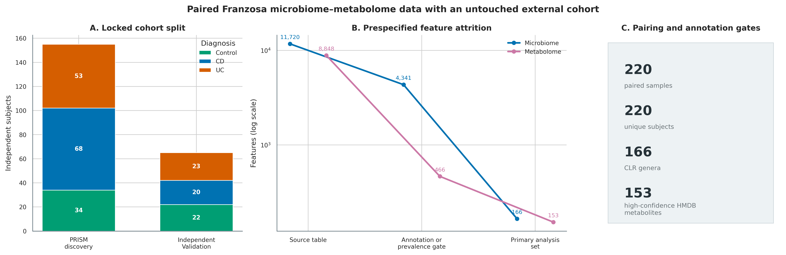
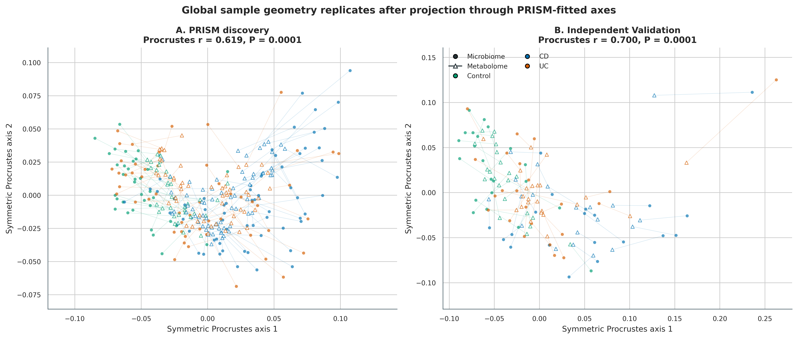
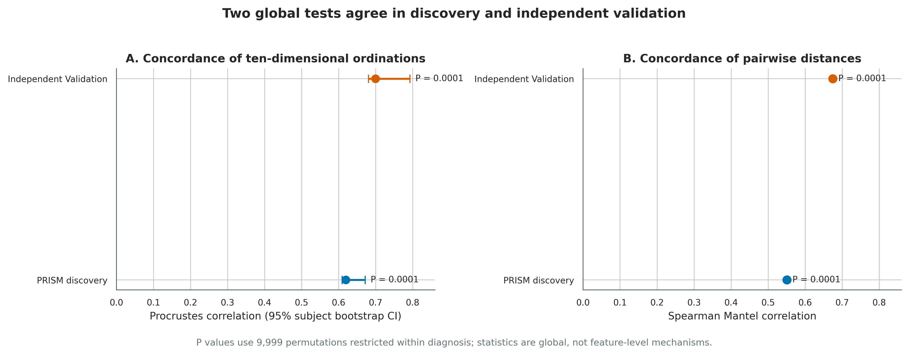
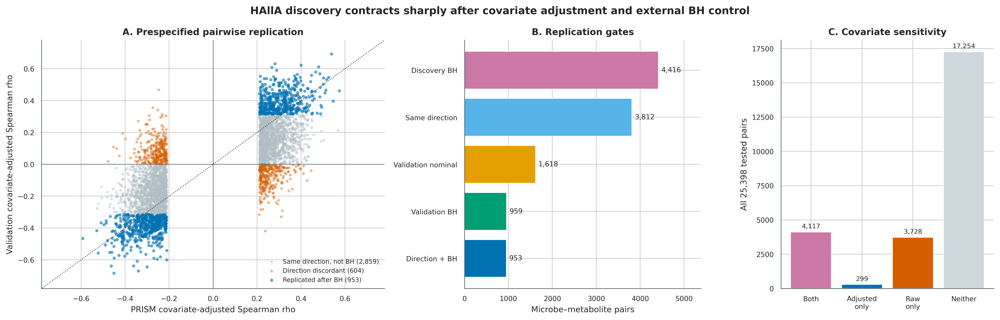
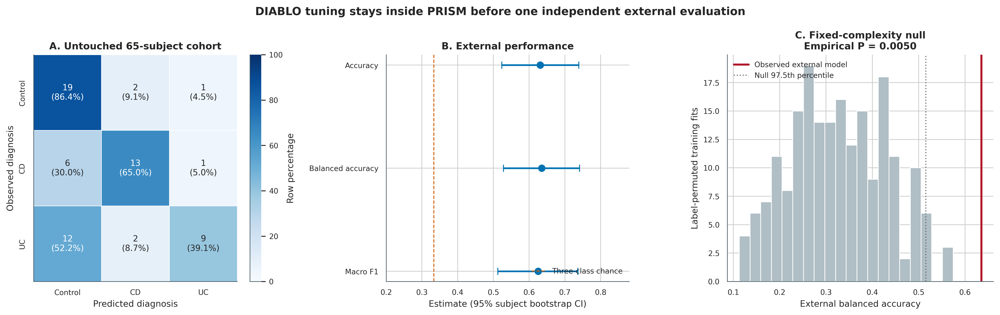
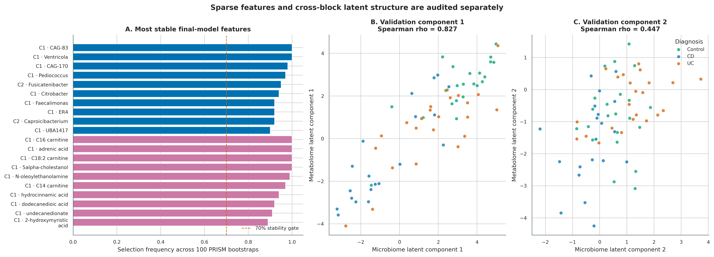

> **先给结论：**配对多组学整合至少要拆成三个问题。Procrustes/Mantel 检验两组数据的**全局样本几何**是否一致；HAllA 寻找并分层校正**特征对关联**；sPLS-DIABLO 检验两组稀疏特征能否共同完成**监督预测**。三者的统计对象不同，不能互相代替。最重要的升级不是再画一张相关热图，而是把 155 名 PRISM 受试者锁为 discovery/training、把 65 名 Validation 受试者留到最后，并明确 association 不能证明 microbial `production`、`consumption` 或 `causality`。

数据来自 Franzosa 等人的炎症性肠病（inflammatory bowel disease, IBD）研究，并使用 Muller 等人整理的 `FRANZOSA_IBD_2019` 统一数据表 [@franzosa2019ibd; @muller2022curatedmultiomics]。220 行样本对应 220 名独立受试者；主分析保留 PRISM 中 prevalence ≥20% 且 mean relative abundance ≥0.05% 的 166 个 genus features，以及 153 个 high-confidence、带唯一 HMDB identifier 的 metabolite features。

```{r}
#| label: load-article63-frozen-results
#| include: false
frozen63 <- "data/small/63-metabolomics-integration-frozen"
if (!dir.exists(frozen63)) frozen63 <- "../data/small/63-metabolomics-integration-frozen"

read63 <- function(...) {
  utils::read.delim(
    file.path(frozen63, ...), check.names = FALSE,
    quote = "", comment.char = "", stringsAsFactors = FALSE
  )
}

metadata63 <- read63("sample-metadata.tsv")
features63 <- read63("feature-audit.tsv")
global63 <- read63("global", "global-concordance.tsv")
replication63 <- read63("summary", "halla-replication-summary.tsv")
branch63 <- read63("summary", "halla-branch-summary.tsv")
tuning63 <- read63("diablo", "tuning-summary.tsv")
external63 <- read63("diablo", "external-metrics.tsv")
stability63 <- read63("summary", "diablo-selected-stability.tsv")
top_pairs63 <- read63("summary", "top-replicated-pairs.tsv")

stopifnot(
  nrow(metadata63) == 220L,
  length(unique(metadata63$Subject)) == 220L,
  sum(metadata63$Cohort == "PRISM") == 155L,
  sum(metadata63$Cohort == "Validation") == 65L,
  sum(features63$Modality == "Microbiome") == 166L,
  sum(features63$Modality == "Metabolome") == 153L,
  replication63$Pairs[replication63$Stage == "Same direction + Validation BH"] == 953L,
  sum(tolower(stability63$Stable70) == "true") == 32L
)
```

## 这一步对应论文里的哪张图 {#sec-target}

原研究 **Figure 1** 并排展示 clinical groups、microbiome ordination 与 metabolome ordination，核心问题是：CD、UC 和 non-IBD controls 在两种分子层是否呈现相互呼应的样本结构 [@franzosa2019ibd]。原文后续又把差异代谢物与菌种、酶和临床炎症联系起来；这种并行证据很有启发性，但“两个组学都随疾病变化”仍不等于某菌产生或消耗某代谢物。

{#fig-63-anchor}

这里先忠实保留“microbiome ordination 对照 metabolome ordination”的框架，再升级为 symmetric Procrustes、Spearman Mantel、HAllA hierarchical associations 和 sPLS-DIABLO。所有外部验证都使用原研究中的 Validation cohort，不把它随机拆回训练集。

{#fig-63-data-audit}

## 理论：三种整合方法分别在估计什么 {#sec-theory}

### 1. 第一条门是 sample alignment，不是相关系数

设微生物组矩阵为 $X\in\mathbb{R}^{n\times p}$，代谢组矩阵为 $Y\in\mathbb{R}^{n\times q}$。第 $i$ 行必须来自同一个受试者、同一个时间点、尽可能同一份 aliquot；仅仅让两张表都有 $n$ 行并不构成配对。主分析要求：

$$
\operatorname{rownames}(X)=\operatorname{rownames}(Y)=\operatorname{SampleID},
$$

并检查 SampleID、SubjectID 均不重复。若一名受试者有多个时间点，置换、bootstrap 和 train/test split 都必须以 subject 为 block；否则同一个人的信息会同时出现在训练和测试中。

### 2. 两个组学需要各自合适的尺度

微生物相对丰度是组成数据。对筛选后的 $p=166$ 个 genus features，加固定 pseudocount $\delta=10^{-6}$，再做 centered log-ratio（CLR）：

$$
\operatorname{clr}(x_{ij})=
\log(x_{ij}+\delta)-\frac{1}{p}\sum_{k=1}^{p}\log(x_{ik}+\delta).
$$

每行 CLR 和应接近 0。pseudocount、prevalence 和 abundance gate 改变时，几何也会改变，因此它们属于 Methods，不是无关紧要的清洗细节 [@gloor2017compositional]。代谢组输入已经过原作者的 peak processing 与非负强度归一化；这里使用 `log1p`，DIABLO 再在 PRISM 中 autoscale。不能把未经批次/漂移校正的原始峰面积直接与 CLR 表拼接。

### 3. Procrustes 与 Mantel 都是全局检验，但统计量不同

对两组学分别用 PRISM 拟合 PCA，保留前 **10 维**；Validation 只投影到这两套已拟合坐标，不重新估计载荷。symmetric Procrustes 寻找旋转、反射和尺度，使两个 score matrices 最接近。令归一化残差平方和为 $m^2$，报告：

$$
r_{Proc}=\sqrt{1-m^2}.
$$

Mantel 则比较同一批样本的两张距离矩阵；这里在 CLR microbial space 和 PRISM-scaled metabolite space 中计算 Euclidean distances，再对上三角距离做 Spearman correlation。Procrustes 强调低维样本配置，Mantel 强调整体 pairwise distance ordering；两者同向比只报一个更稳，但都不能定位具体 feature pair。

疾病本身会同时改变两个组学。主 $P$ 值因此用 **9,999 次 within diagnosis permutations**：只在 Control、CD、UC 内打乱一组学的样本标签，避免把组间差异当成个体层整合。95% CI 用 **2,000 次 subject bootstrap**，每次同步抽取 $X_i$ 和 $Y_i$。unrestricted permutation 作为 sensitivity；它和 restricted test 的 observed statistic 相同，只是 null distribution 不同。

### 4. HAllA 在大量 feature pairs 中寻找层级结构

逐一检验 $166\times153=25,398$ 个 Spearman correlations 会遇到强多重性，也忽略高度相关特征组成的 blocks。HAllA 先对两侧 features 做 average-linkage clustering，再在层级树上寻找满足 false-negative-rate（FNR）门槛的关联 blocks [@ghazi2022halla]。本次锁定：

- HAllA 0.8.40；Spearman association；average linkage；BH FDR 0.05；FNR 0.20；
- primary branch 在 PRISM 内分别对两组学回归 `Study.Group + Age + antibiotic + immunosuppressant + mesalamine + steroids`，使用标准化 residuals；
- raw, unadjusted branch 只做 sensitivity，不与 primary 混为一张显著性表；
- HAllA 0.8.40 对能直接返回 $P$ 值的 Spearman metric 使用 **analytic Spearman** $P$ 值；未启用 `--force_permutations`，因此不能在 Methods 中虚写“1,000 次 HAllA permutations”。

PRISM 中 primary branch 有 4,416 个 marginal BH pairs、1,970 个 hierarchical blocks；raw branch 有 7,845 个 pairs、2,387 个 blocks。Validation 不重新筛选 discovery family，而是对预先指定的 4,416 pairs 全部重算 residual Spearman correlation，并在这 4,416 个外测 $P$ 值内重新 BH。最终 **953 pairs** 同方向且 Validation BH $q<0.05$。

### 5. DIABLO 是监督模型，不是相关性检验

DIABLO 用多个 block 的稀疏 PLS components 同时追求类别分离与跨 block covariance [@singh2019diablo; @rohart2017mixomics]。设计矩阵 off-diagonal weight 固定为 0.1，避免为追求相关而压过分类目标。所有训练步骤只在 PRISM：

1. `keepX` grid 为 5、10、20，使用 **5-fold × 5 repeats**、balanced error rate 和 centroid distance；
2. 最终两 components 的 `keepX` 为 microbiome 20/20、metabolome 20/5；
3. 100 次 PRISM stratified bootstrap 衡量 feature-selection stability；
4. 200 次 training-label permutations 在固定模型复杂度下形成 external balanced-accuracy null；
5. 65 名 Validation 受试者只在最终模型上预测一次，95% CI 来自 2,000 次按 diagnosis 分层的 subject bootstrap。

Balanced accuracy 为三类 recall 的宏平均，避免 Control、CD、UC 数量不等时由大类主导。Validation balanced accuracy 为 **0.635**（95% CI 0.528--0.741），macro F1 为 0.625；training-label null 的 empirical $P=(1+0)/(200+1)=0.00498$。该结果是当前队列定义下的 transportability，不是临床部署性能。

### 6. 关联方向不是代谢通量方向

正相关可能来自共同饮食、炎症、药物、宿主吸收或第三个微生物；负相关也可能来自稀释、生态位替代、组成约束或批次。即使某菌基因组具有合成通路，也不能仅凭 stool abundance correlation 声称它在原位 production 或 consumption 某代谢物。要支持机制，至少还需要 strain-resolved pathway、代谢模型、培养/共培养、同位素示踪或扰动实验，并把 stool concentration 与 intestinal flux 区分开。

## 准备工作 {#sec-preparation}

### 数据谱系与计算门槛

| 对象 | 锁定内容 |
|---|---|
| Curated repository | `borenstein-lab/microbiome-metabolome-curated-data` commit `89a519d8c832008fbc6e650453e83e2f04858d02` |
| Metadata | 220 samples；155 PRISM + 65 Validation；220 unique subjects |
| Genus source table | 11,720 features；18,101,016 bytes；SHA-256 `c4a541fe...09d3f` |
| Metabolite source table | 8,848 peaks；12,485,385 bytes；SHA-256 `528b5e59...288c` |
| Metabolite map | 8,848 rows；695,256 bytes；SHA-256 `0dcdcce0...e5c65` |
| Primary matrices | 166 CLR genera + 153 log1p high-confidence HMDB metabolites |

核验冻结包、重算外部关联复现和重画图建议 **2 CPU、8 GB RAM、约 1--5 分钟**；重跑 9,999 次全局置换、2,000 次 bootstrap、HAllA 双分支和完整 DIABLO tuning/bootstraps 建议 **6 CPU、16 GB RAM、10 GB 磁盘、约 1--3 小时**。冻结包保留转换矩阵、全部 HAllA associations、DIABLO model objects 和脚本，不需要在网页渲染时联网。

<details>
<summary><strong>安装 Python/R 环境、下载数据并内联作图函数</strong></summary>

```{bash}
#| eval: false
mamba env create -f env/multiomics-python.yml

Rscript -e 'install.packages(c(
  "vegan", "permute", "ggplot2", "dplyr", "tidyr", "patchwork",
  "pheatmap", "jsonlite", "scales"
))'
Rscript -e 'if (!requireNamespace("BiocManager", quietly=TRUE)) install.packages("BiocManager"); BiocManager::install(c("mixOmics", "BiocParallel", "ComplexHeatmap"))'

conda run -n metagenome-multiomics-2026.08 python \
  scripts/download_article63_multiomics_data.py \
  --cache-dir db/multiomics-cache/franzosa-89a519d8
```

```{r}
#| label: article63-inline-theme
set.seed(20260763)

pal_pub <- c(
  "Control" = "#009E73", "CD" = "#0072B2", "UC" = "#D55E00",
  "Microbiome" = "#0072B2", "Metabolome" = "#CC79A7",
  "Replicated" = "#0072B2", "Sensitivity" = "#E69F00",
  "Not retained" = "#B0BEC5"
)
scale_color_pub <- function(...) ggplot2::scale_color_manual(values = pal_pub, ...)
scale_fill_pub  <- function(...) ggplot2::scale_fill_manual(values = pal_pub, ...)
theme_pub <- function(base_size = 12) {
  ggplot2::theme_bw(base_size = base_size) + ggplot2::theme(
    panel.grid.minor = ggplot2::element_blank(),
    panel.grid.major = ggplot2::element_line(color = "#ECEFF1", linewidth = 0.3),
    axis.text = ggplot2::element_text(color = "black"),
    legend.key = ggplot2::element_blank(),
    strip.background = ggplot2::element_rect(fill = "#EDF2F4", color = NA),
    plot.title.position = "plot",
    plot.caption = ggplot2::element_text(color = "#455A64", hjust = 0)
  )
}
save_pub <- function(plot, file_base, width = 210, height = 150,
                     units = "mm", dpi = 350) {
  dir.create(dirname(file_base), recursive = TRUE, showWarnings = FALSE)
  ggplot2::ggsave(paste0(file_base, ".pdf"), plot, width = width,
                  height = height, units = units, device = grDevices::cairo_pdf,
                  bg = "white")
  ggplot2::ggsave(paste0(file_base, ".png"), plot, width = width,
                  height = height, units = units, dpi = dpi, bg = "white")
  ggplot2::ggsave(paste0(file_base, ".tiff"), plot, width = width,
                  height = height, units = units, dpi = dpi,
                  compression = "lzw", bg = "white")
  invisible(plot)
}
```

</details>

### 先核验固化证据

```{bash}
#| eval: false
FROZEN="$PWD/data/small/63-metabolomics-integration-frozen"
sha256sum -c "$FROZEN/file-checksums.sha256"
sed -n '1,30p' "$FROZEN/source/download-manifest.json"
column -ts $'\t' "$FROZEN/summary/halla-replication-summary.tsv"
column -ts $'\t' "$FROZEN/diablo/external-metrics.tsv"
```

```{r}
#| label: article63-input-head
#| echo: true
#| tbl-cap: "配对样本与 feature ledger 的前五行；图内分组统一使用英文。"
utils::head(metadata63[c("Sample", "Subject", "Cohort", "Study.Group", "Age")], 5L) |>
  knitr::kable(digits = 2)
```

## 可复制代码：从配对表到三层整合 {#sec-code}

### 第 1 步：锁定 discovery 过滤、样本顺序和转换

```python
from pathlib import Path
import numpy as np
import pandas as pd

SEED = 63001
PSEUDOCOUNT = 1e-6
CACHE = Path("db/multiomics-cache/franzosa-89a519d8")

meta = pd.read_csv(CACHE / "metadata.tsv", sep="\t")
microbe = pd.read_csv(CACHE / "genera.tsv", sep="\t")
metabolite = pd.read_csv(CACHE / "mtb.tsv", sep="\t")
mapping = pd.read_csv(CACHE / "mtb.map.tsv", sep="\t")

order = meta["Sample"].astype(str).tolist()
assert microbe["Sample"].astype(str).tolist() == order
assert metabolite["Sample"].astype(str).tolist() == order
assert meta.Sample.nunique() == meta.Subject.astype(str).nunique() == 220

meta["Cohort"] = meta.Sample.str.split(".", n=1).str[0]
training = meta.Cohort.eq("PRISM").to_numpy()
assert training.sum() == 155 and (~training).sum() == 65

X_rel = microbe.set_index("Sample").astype(float)
assert np.allclose(X_rel.sum(axis=1), 1.0, atol=1e-10)
prevalence = X_rel.loc[meta.loc[training, "Sample"]].gt(0).mean(axis=0)
mean_abundance = X_rel.loc[meta.loc[training, "Sample"]].mean(axis=0)
keep_x = sorted(prevalence.index[(prevalence >= 0.20) &
                                 (mean_abundance >= 0.0005)])
assert len(keep_x) == 166

mapping = mapping.set_index("Compound", drop=False)
high_confidence = mapping["High.Confidence.Annotation"].astype(str).str.lower().eq("true")
keep_y = sorted(mapping.index[high_confidence & mapping.HMDB.notna()])
assert len(keep_y) == 153 and mapping.loc[keep_y, "HMDB"].is_unique

X_rel = X_rel[keep_x]
X_clr = np.log(X_rel + PSEUDOCOUNT)
X_clr = X_clr.sub(X_clr.mean(axis=1), axis=0)
Y_intensity = metabolite.set_index("Sample")[keep_y].astype(float)
Y_log1p = np.log1p(Y_intensity)
assert np.allclose(X_clr.sum(axis=1), 0.0, atol=1e-10)
```

下载与完整转换入口如下；gzip 的 `mtime=0`，相同输入可得到 byte-identical matrices。

```{bash}
#| eval: false
conda run -n metagenome-multiomics-2026.08 python \
  scripts/prepare_article63_multiomics.py \
  --cache-dir db/multiomics-cache/franzosa-89a519d8 \
  --output-dir .tutorial_runs/article63
```

### 第 2 步：只在 PRISM 拟合 ordination bases，再投影 Validation

```r
set.seed(63001)
training <- metadata$Cohort == "PRISM"
validation <- metadata$Cohort == "Validation"

microbe_pca <- prcomp(microbiome[training, ], center = TRUE,
                      scale. = FALSE, rank. = 10)
metabolite_pca <- prcomp(metabolome[training, ], center = TRUE,
                         scale. = TRUE, rank. = 10)

microbe_scores <- rbind(
  microbe_pca$x[, 1:10],
  predict(microbe_pca, microbiome[validation, ])[, 1:10]
)
metabolite_scores <- rbind(
  metabolite_pca$x[, 1:10],
  predict(metabolite_pca, metabolome[validation, ])[, 1:10]
)

# Observed configuration; the exact script builds 9,999 restricted
# permutations with permute::how(blocks = diagnosis).
fit <- vegan::procrustes(microbe_scores[training, ],
                         metabolite_scores[training, ], symmetric = TRUE)
restricted <- permute::how(nperm = 9999)
permute::blocks(restricted) <- metadata$Study.Group[training]
protest_fit <- vegan::protest(
  microbe_scores[training, ], metabolite_scores[training, ],
  permutations = restricted, symmetric = TRUE
)

microbe_distance <- dist(scale(microbiome[training, ], center = TRUE,
                               scale = FALSE))
metabolite_distance <- dist(scale(metabolome[training, ], center = TRUE,
                                  scale = TRUE))
mantel_fit <- vegan::mantel(
  microbe_distance, metabolite_distance, method = "spearman",
  permutations = restricted
)
```

完整命令固定 9,999 permutations 和 2,000 bootstraps：

```{bash}
#| eval: false
Rscript scripts/run_article63_global.R \
  --input_dir .tutorial_runs/article63 \
  --output_dir .tutorial_runs/article63/global \
  --permutations 9999 --bootstraps 2000 --seed 63001
```

PRISM 的 restricted Procrustes $r=0.619$（95% CI 0.609--0.671），Mantel $\rho=0.550$；Validation 分别为 $r=0.700$（0.680--0.792）和 $\rho=0.675$，四个 restricted $P$ 值均为 0.0001。

{#fig-63-procrustes}

{#fig-63-global}

### 第 3 步：先在各 cohort 内 residualize，再运行 HAllA

```python
def design_matrix(metadata):
    design = pd.DataFrame(index=metadata.index)
    design["Intercept"] = 1.0
    age = pd.to_numeric(metadata["Age"], errors="coerce")
    age = age.fillna(age.median())
    design["Age_z"] = (age - age.mean()) / age.std(ddof=0)
    for group in ("CD", "UC"):
        design[f"Group_{group}"] = metadata["Study.Group"].eq(group).astype(float)
    for medication in ("antibiotic", "immunosuppressant", "mesalamine", "steroids"):
        values = metadata[medication].fillna("Unknown").astype(str)
        for level in ("Yes", "Unknown"):
            column = values.eq(level).astype(float)
            if column.nunique() > 1:
                design[f"{medication}_{level}"] = column
    return design.astype(float)

def residualize(matrix, metadata):
    design = design_matrix(metadata)
    beta, *_ = np.linalg.lstsq(design.to_numpy(), matrix.to_numpy(), rcond=None)
    residual = matrix.to_numpy() - design.to_numpy() @ beta
    residual = (residual - residual.mean(axis=0)) / residual.std(axis=0, ddof=1)
    return pd.DataFrame(residual, index=matrix.index, columns=matrix.columns)
```

```{bash}
#| eval: false
PY="$(command -v python)"
HALLA="$(command -v halla)"
test -x "$PY"
test -x "$HALLA"

R_LIBS_USER=/path/to/R/library "$PY" scripts/run_article63_halla.py \
  --input-dir .tutorial_runs/article63 \
  --output-dir .tutorial_runs/article63/halla-results \
  --halla-cli "$HALLA" --r-library /path/to/R/library \
  --threads 6 --seed 63001
```

对 discovery significant pairs 的外部验证必须形成新的、预先指定的检验 family：

```python
from scipy.stats import spearmanr
from statsmodels.stats.multitest import multipletests

discovery = adjusted.loc[adjusted["q-values"] < 0.05].copy()
rho, p_value = [], []
for row in discovery.itertuples(index=False):
    result = spearmanr(validation_microbes.loc[row.X_features],
                       validation_metabolites.loc[row.Y_features])
    rho.append(result.statistic)
    p_value.append(result.pvalue)

discovery["ValidationRho"] = rho
discovery["ValidationP"] = p_value
discovery["ValidationQ"] = multipletests(p_value, method="fdr_bh")[1]
discovery["SameDirection"] = (
    np.sign(discovery.association) == np.sign(discovery.ValidationRho)
)
discovery["Replicated"] = (
    discovery.SameDirection & discovery.ValidationQ.lt(0.05)
)
```

{#fig-63-halla}

排名靠前的 replicated pairs 不是机制终点，而是实验优先级清单：

```{r}
#| label: article63-top-pairs
#| tbl-cap: "外部 BH 后、方向一致的前 8 个 microbe–metabolite pairs。"
top_pairs63[seq_len(min(8L, nrow(top_pairs63))),
            c("Microbe", "Metabolite", "HMDB", "DiscoveryRho",
              "ValidationRho", "ValidationQ")] |>
  knitr::kable(digits = 3)
```

### 第 4 步：DIABLO 只在 PRISM 调参，Validation 只预测一次

```r
set.seed(63101)
x_train <- list(
  microbiome = microbiome[training, , drop = FALSE],
  metabolome = metabolome[training, , drop = FALSE]
)
y_train <- factor(metadata$Study.Group[training],
                  levels = c("Control", "CD", "UC"))
design <- matrix(c(0, 0.1, 0.1, 0), 2, 2, byrow = TRUE,
                 dimnames = list(names(x_train), names(x_train)))

tuned <- mixOmics::tune.block.splsda(
  X = x_train, Y = y_train, ncomp = 2,
  test.keepX = list(microbiome = c(5, 10, 20),
                    metabolome = c(5, 10, 20)),
  validation = "Mfold", folds = 5, nrepeat = 5,
  dist = "centroids.dist", measure = "BER", weighted = TRUE,
  design = design, scale = TRUE, near.zero.var = FALSE,
  BPPARAM = BiocParallel::SerialParam(), seed = 63101
)

keep_x <- list(microbiome = c(20, 20), metabolome = c(20, 5))
set.seed(63201)
fit <- mixOmics::block.splsda(
  X = x_train, Y = y_train, ncomp = 2, keepX = keep_x,
  design = design, scale = TRUE, near.zero.var = FALSE
)

x_external <- list(
  microbiome = microbiome[validation, , drop = FALSE],
  metabolome = metabolome[validation, , drop = FALSE]
)
external_prediction <- predict(fit, newdata = x_external)
predicted <- external_prediction$WeightedVote$centroids.dist[, "comp2"]
```

```{bash}
#| eval: false
Rscript scripts/run_article63_diablo.R \
  --input_dir .tutorial_runs/article63 \
  --output_dir .tutorial_runs/article63/diablo \
  --folds 5 --repeats 5 --bootstraps 100 \
  --permutations 200 --metric_bootstraps 2000 --seed 63001

conda run -n metagenome-multiomics-2026.08 python \
  scripts/summarize_article63_multiomics.py \
  --input-dir .tutorial_runs/article63 \
  --output-dir .tutorial_runs/article63/summary
```

{#fig-63-diablo-validation}

{#fig-63-diablo-stability}

## 审计与升级 {#sec-audit}

### 从并排 ordination 升级到三个明确 estimands

| 问题 | 原研究可见证据 | 当前主分析 | 仍然不能声称 |
|---|---|---|---|
| 两组学整体是否同步 | 并排 PCoA、疾病组分离 | PRISM-fitted 10D projection；restricted Procrustes + Mantel；外部 cohort 重复 | 具体代谢通路或因果方向 |
| 哪些 feature pairs 相关 | 单变量/网络式联系 | HAllA adjusted discovery；raw sensitivity；4,416-pair external BH | 某菌生产/消耗该代谢物 |
| 两组学能否联合预测 | 组学各自疾病信号 | PRISM-only DIABLO tuning；65-subject one-shot external test | 临床筛查 PPV 或部署效用 |

### 1. 全局一致性在独立队列中保持

Validation 的 Procrustes $r=0.700$ 与 Mantel $\rho=0.675$ 均高于 PRISM 的 0.619 与 0.550。这里不做“验证队列更强”的显著性比较；样本量、组成和 disease spectrum 不同，点估计差异可能来自 sampling variation。可支持的结论是：在 PRISM 拟合的 feature/axis contract 下，两个 global concordance signals 没有在独立 cohort 消失。

```{r}
#| label: article63-global-table
#| tbl-cap: "全局整合结果；表中仅展示主 within-diagnosis permutation branch。"
global63[global63$Restriction == "Within diagnosis",
         c("Cohort", "Samples", "ProcrustesR", "ProcrustesBootLow",
           "ProcrustesBootHigh", "ProcrustesP", "MantelRho", "MantelP")] |>
  knitr::kable(digits = 3)
```

### 2. covariate adjustment 与 external BH 大幅收紧关联表

raw branch 的 7,845 个 marginal pairs 在 adjustment 后变成 4,416 个；其中 4,117 个两分支共有、299 个 adjusted-only、3,728 个 raw-only。外部 cohort 中 3,812/4,416 方向一致，959 个通过 Validation BH，953 个同时满足方向一致。若只展示 PRISM raw heatmap，证据量会被夸大约八倍。

调整也不是自动正确。把 disease 或 medication 放入设计矩阵，估计的是“这些变量条件下”的 residual association；若 medication 是 disease 的中介或 collider，过度调整同样会引入偏差。因此 raw/adjusted 两分支都保留，解释 primary estimand，并在新研究中用 DAG 预先决定 covariates。

### 3. DIABLO 的预测、跨 block correlation 与 feature stability 分开报告

Validation component 1/2 的跨 block Spearman correlations 为 0.827/0.447；这说明最终 model 的 latent structures 在外部样本仍有耦合，但不保证分类正确。最终 model 有 65 个 block-component selection rows，其中 32 行在 ≥70% 的 100 次 PRISM bootstraps 中被选中。论文主表宜突出稳定特征，把低稳定性特征保留在补充表，不应只按一次 full-training loading 排名。

::: {.callout-important title="可以写到摘要里的结论边界"}
在严格配对、PRISM-only feature selection/tuning 和独立 Validation testing 下，microbiome 与 metabolome 的全局结构一致性得到复现；953 个 covariate-adjusted feature pairs 在外部 BH 后方向一致；两 block DIABLO 的外部 balanced accuracy 为 0.635。结果支持 reproducible multiomic association 和 prediction，不支持 microbial metabolite flux 或 causal mechanism。
:::

## 出版级美化 {#sec-polish}

多组学图最容易因信息层级混乱而失去可读性。主文只保留三个视觉语法：

1. **全局图**：同一受试者一条 connector；点形区分 modality，颜色只表示 diagnosis；
2. **关联图**：横纵轴始终是 discovery/validation effect，不用颜色重复编码 effect size；
3. **预测图**：confusion matrix 用 row percentage，同时写原始人数；metric panel 强制显示 bootstrap CI 和 chance line。

所有轴、图例、panel titles 和注释使用英文。Control/CD/UC 在六张图中始终使用绿/蓝/橙；microbiome/metabolome 使用蓝/紫。输出同时保留 vector PDF、350-dpi PNG 和 LZW TIFF。长 feature names 在标签层换行，原始 taxonomy/peak ID 保留在补充表，不把截断名当成 feature identity。

```{bash}
#| eval: false
conda run -n metagenome-multiomics-2026.08 python \
  scripts/plot_article63_multiomics.py \
  --input-dir data/small/63-metabolomics-integration-frozen \
  --summary-dir data/small/63-metabolomics-integration-frozen/summary \
  --figure-dir figures
```

## 常见坑 {#sec-pitfalls}

::: {.callout-caution title="坑 1：两张表按当前行号拼接"}
任何 `cbind(X, Y)` 前都要 assert 完整 SampleID 顺序相同，并检查 SubjectID/timepoint。一个排序差异足以制造漂亮但无意义的相关图。
:::

::: {.callout-caution title="坑 2：先看完整数据，再划训练/验证"}
用 220 人共同做 prevalence filter、autoscaling、PCA、keepX 或 batch correction 会泄漏 Validation 信息。本次所有可学习参数都只在 155 人 PRISM 中拟合；外部 65 人只做 projection、预指定 pair retest 和 final prediction。
:::

::: {.callout-caution title="坑 3：对相对丰度直接做 Pearson"}
closure 会让一个 feature 上升时其他 features 被动下降。至少做 CLR/pseudocount sensitivity；若零值多、测序深度或检测限复杂，还要比较 prevalence-aware 或 count-aware 方法。
:::

::: {.callout-caution title="坑 4：把 HAllA block 数当作独立机制数"}
hierarchical blocks 可重叠，marginal pairs 也受相关 feature clusters 影响。报告 blocks、unique pairs、FDR family 和外部复现门，不把 1,970 blocks 写成 1,970 条生化反应。
:::

::: {.callout-caution title="坑 5：把 disease-adjusted association 当成 disease mechanism"}
adjustment 改变 estimand；medication、inflammation 和 diet 可能是 confounder、mediator 或 collider。raw/adjusted sensitivity 与明确 DAG 比“协变量越多越严谨”更可信。
:::

::: {.callout-caution title="坑 6：只报 DIABLO training accuracy"}
高维 supervised integration 很容易过拟合。必须交代 outer cohort、tuning folds/repeats、class-balanced metric、label-permutation null、subject bootstrap CI 和 feature stability；独立外测不能参与 keepX 选择。
:::

::: {.callout-caution title="坑 7：相关菌有通路，所以代谢物由它产生"}
stool metabolite 受宿主、饮食、药物、吸收和多物种 cross-feeding 共同影响。宏基因组功能潜力 + 相关性仍不是原位反应方向；机制结论需要额外实验或 flux evidence。
:::

## 这段 Methods 怎么写 {#sec-methods}

下面模板中的版本、样本数、阈值与 resampling 次数均对应实际运行。

> **Paired microbiome–metabolome integration.** Paired genus-level metagenomic profiles, processed metabolite intensities, compound annotations, and clinical metadata were obtained from the curated `FRANZOSA_IBD_2019` resource (repository commit `89a519d8c832008fbc6e650453e83e2f04858d02`; source study DOI: 10.1038/s41564-018-0306-4). The analysis included 220 samples from 220 unique subjects. PRISM (n = 155; 34 controls, 68 Crohn's disease, and 53 ulcerative colitis) was prespecified as the discovery/training cohort; Validation (n = 65; 22 controls, 20 Crohn's disease, and 23 ulcerative colitis) remained external. Genera were retained using PRISM prevalence ≥20% and mean relative abundance ≥0.05%, yielding 166 features. Relative abundances were transformed by centered log ratio after adding a fixed pseudocount of 10^-6. Metabolites were restricted to 153 high-confidence annotations with unique HMDB identifiers and transformed by log1p. Sample order and subject uniqueness were verified before integration.
>
> Global concordance was evaluated on ten-dimensional PCA representations fitted in PRISM; Validation samples were projected without refitting. Symmetric Procrustes correlation and Spearman Mantel correlation were tested with 9,999 permutations restricted within diagnosis, and Procrustes 95% confidence intervals were obtained from 2,000 paired-subject bootstrap replicates (vegan 2.6-6.1; permute 0.9-7; seed 63001). For feature-level discovery, each modality was residualized within cohort for diagnosis, age, antibiotic, immunosuppressant, mesalamine, and steroid use. HAllA 0.8.40 used Spearman association, average linkage, BH FDR 0.05, and FNR 0.20; its default analytic Spearman P values were retained. All 4,416 discovery pairs with marginal BH q < 0.05 were retested in Validation, followed by BH correction over the prespecified external family; replication required concordant effect direction and external q < 0.05.
>
> DIABLO was fitted with mixOmics 6.26.0 using two components and an off-diagonal design weight of 0.1. `keepX` was tuned exclusively in PRISM over 5, 10, and 20 features by 5-fold cross-validation repeated five times, balanced error rate, and centroid distance. Feature stability was estimated from 100 stratified PRISM bootstraps. The final model was evaluated once in Validation; accuracy, balanced accuracy, and macro F1 confidence intervals used 2,000 diagnosis-stratified subject bootstraps. A fixed-complexity null was generated with 200 PRISM training-label permutations. All stochastic steps used deterministic seeds derived from 63001.

> **Results template.** Paired global structure was reproducible in the independent Validation cohort (Procrustes r = 0.700, 95% CI 0.680–0.792, restricted-permutation P = 0.0001; Mantel rho = 0.675, P = 0.0001). Covariate-adjusted HAllA identified 4,416 discovery pairs, of which 953 retained direction and passed external BH correction. The PRISM-trained DIABLO model achieved an external balanced accuracy of 0.635 (95% CI 0.528–0.741) and macro F1 of 0.625; the training-label permutation P value was 0.00498. These results indicate reproducible cross-modal association and prediction but do not establish microbial production, consumption, or causality for individual metabolites.

## 换成你自己的数据怎么做 {#sec-own-data}

### 必需输入

| 文件 | 最少字段/形状 | 进入分析前的门控 |
|---|---|---|
| `microbiome.tsv` | samples × taxa/counts or relative abundances | feature IDs 唯一；说明 rank、denominator、zero policy |
| `metabolome.tsv` | 同一 samples × metabolites | 非负；完成 peak QC、drift/batch correction；缺失值策略预注册 |
| `metabolite_map.tsv` | feature ID、name、HMDB/KEGG、confidence | 一对多 annotation 不应静默去重 |
| `metadata.tsv` | Sample、Subject、cohort/site、outcome、covariates | 样本顺序、重复测量、药物和 batch 可审计 |

### 推荐执行顺序

1. 先画 sample intersection ledger，删除对象必须写理由；若不同 aliquot/timepoint，改称近似配对并做 time-gap sensitivity。
2. 按医院、国家、时间或平台指定完整外部 cohort。只有一个 cohort 时做 nested subject-level CV，并明确它不是外部验证。
3. 所有 feature filters、imputation、scaling、PCA、batch parameters 和 DIABLO tuning 只在 training split 拟合，再应用到 validation。
4. 把 global、pairwise、predictive 三类结果放在不同表中。每张表写清 sample unit、covariates、permutation blocks、FDR family 和 effect direction。
5. 对 top pairs 增加 pathway/strain evidence、饮食和药物 sensitivity；需要机制结论时设计培养、扰动或 isotope tracing，而不是继续堆相关方法。

冻结目录中的四张转换矩阵可替换为你自己的样本 × feature 表；`scripts/run_article63_global.R`、`run_article63_halla.py`、`run_article63_diablo.R` 和 `summarize_article63_multiomics.py` 都从显式路径读入，不依赖前一篇生成的 R/Python object。若类别不是 Control/CD/UC，需要同步修改 factor levels、restricted permutation blocks、confusion matrix order 和 stratified bootstrap，而不能只改图例文字。

## 参考 {#sec-references}

- 原始 IBD 配对宏基因组—代谢组研究：[@franzosa2019ibd]。
- 统一整理的 microbiome–metabolome 数据资源：[@muller2022curatedmultiomics]。
- HAllA 层级关联发现：[@ghazi2022halla]。
- DIABLO 与 mixOmics：[@singh2019diablo; @rohart2017mixomics]。
- 组成数据与 CLR 解释：[@gloor2017compositional]。
