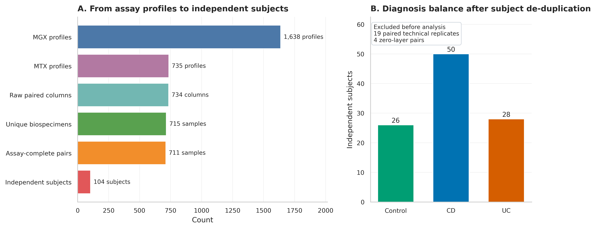
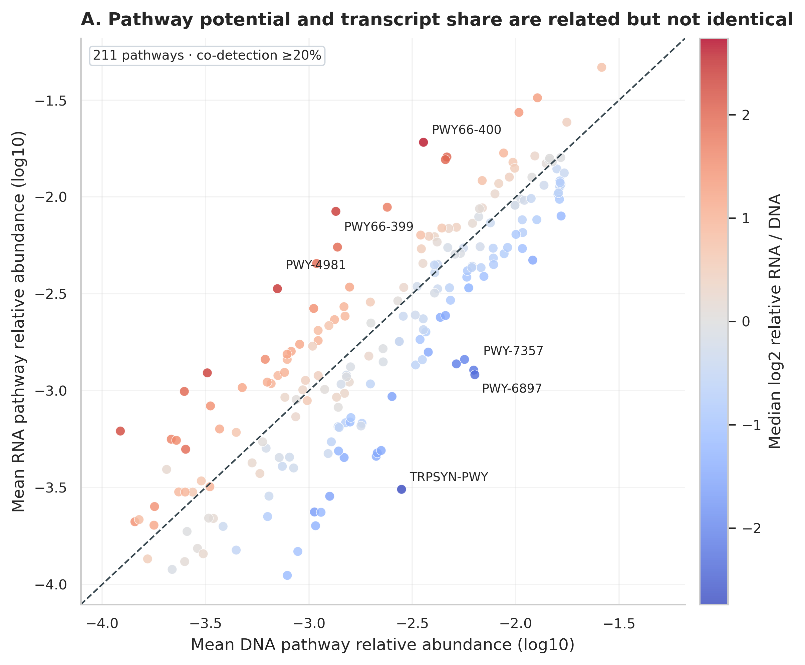
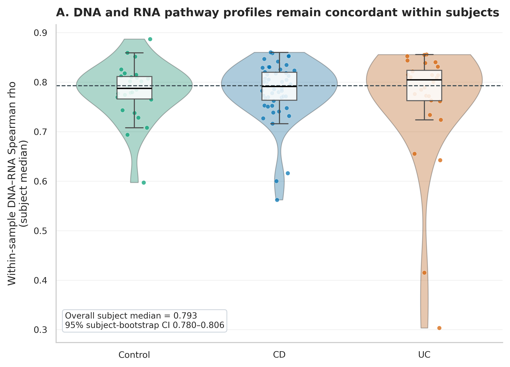
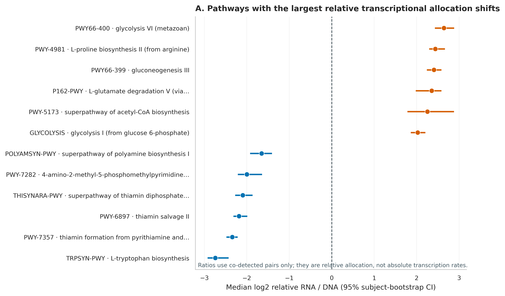
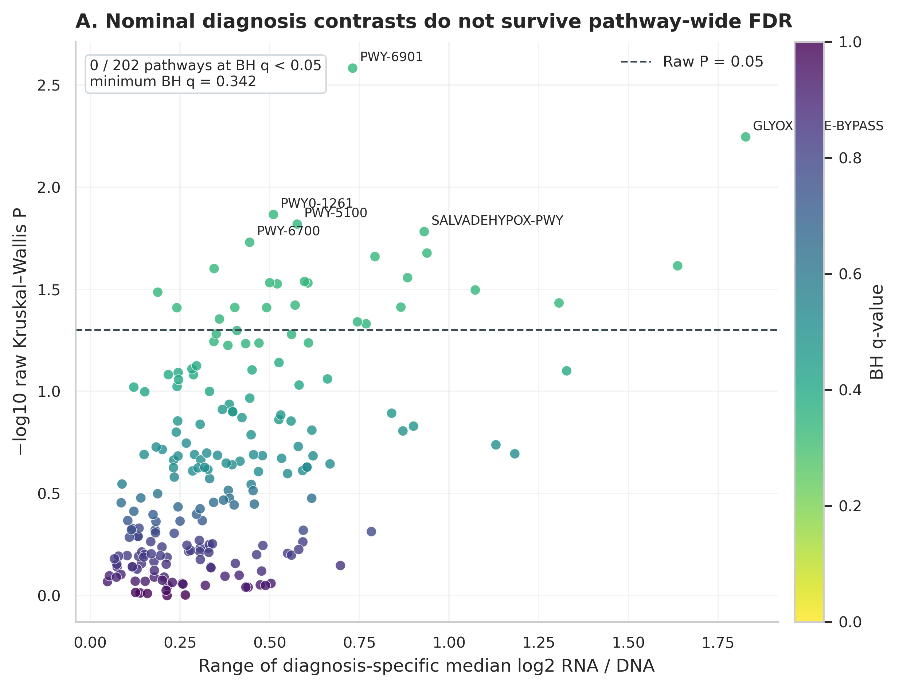
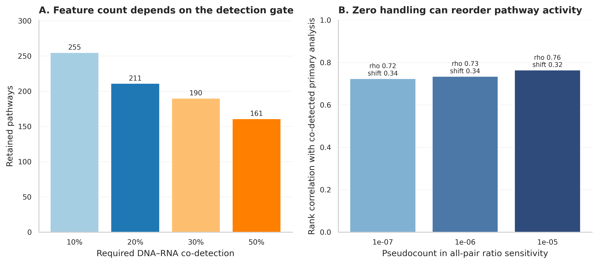

> **先给结论：**宏基因组 DNA 告诉你群落的功能**潜力**，宏转录组 RNA 告诉你测序时刻的转录本**相对分配**。`RNA / DNA` 能帮助识别“基因组份额不高、转录份额却偏高”的通路，但它不是 absolute transcription rate，也不是 per-cell regulation，更不能直接推出代谢 flux 或 causality。可靠分析要先锁定同一粪便样本、去掉技术重复，再把纵向样本折回受试者这个独立单位。

这里使用 Lloyd-Price 等人 IBD Multi'omics Database（IBDMDB/HMP2）的官方合并 HUMAnN2 通路相对丰度表 [@lloydprice2019multiomics]。1638 个 MGX profiles 与 735 个 MTX profiles 共有 734 个原始配对列；去掉 19 个配对 `_TR` 技术重复后得到 715 个唯一 biospecimens，再排除任一通路层总和为 0 的 4 个样本，最终是 **711 个样本、104 名受试者**。

```{r}
#| label: load-article64-frozen-results
#| include: false
frozen64 <- "data/small/64-metatranscriptomics-frozen"
if (!dir.exists(frozen64)) frozen64 <- "../data/small/64-metatranscriptomics-frozen"

read64 <- function(file) {
  utils::read.delim(
    file.path(frozen64, file), check.names = FALSE,
    quote = "", comment.char = "", stringsAsFactors = FALSE
  )
}

metadata64 <- read64("sample-metadata.tsv")
features64 <- read64("feature-audit.tsv")
concordance64 <- read64("concordance-summary.tsv")
activity64 <- read64("activity-results.tsv")
diagnosis64 <- read64("diagnosis-results.tsv")
sensitivity64 <- read64("sensitivity-summary.tsv")
flag64 <- function(x) tolower(as.character(x)) %in% c("true", "t", "1", "yes")

stopifnot(
  nrow(metadata64) == 711L,
  length(unique(metadata64$SubjectID)) == 104L,
  nrow(features64) == 418L,
  sum(flag64(features64$Selected)) == 211L,
  sum(flag64(activity64$BH05)) == 173L,
  sum(!is.na(diagnosis64$PValue)) == 202L,
  sum(flag64(diagnosis64$BH05)) == 0L,
  abs(concordance64$MedianSpearmanRho[concordance64$Diagnosis == "All"] - 0.7931968) < 1e-6
)
```

## 这一步对应论文里的哪张图 {#sec-target}

原研究 Figure 3 把 MGX、MTX、代谢组和蛋白组放进同一套纵向框架：同一受试者的群落组成相对稳定，而基因转录、蛋白和代谢物可以更快变化 [@lloydprice2019multiomics]。这正是 DNA 与 RNA 联动的核心——相似的功能潜力并不保证同样的当下活动。

{#fig-64-anchor}

复现不先挑“最漂亮”的通路，而是从全部官方合并表开始记录样本损失。`_TR` 列是技术重复，不是额外患者；四个全零层也不能靠加 pseudocount 伪装成有效测量。

{#fig-64-pairing}

## 理论：DNA、RNA 和 RNA/DNA 分别估计什么 {#sec-theory}

### 1. DNA 是功能潜力，RNA 是转录本份额

HUMAnN 把 reads 归到基因家族，再重建 MetaCyc pathways [@beghini2021biobakery; @caspi2023metacyc]。对第 $i$ 个样本、第 $j$ 条通路：

- $D_{ij}$：该通路在宏基因组通路表中的相对丰度，混合了携带者丰度、基因拷贝数与比对/注释效率；
- $R_{ij}$：该通路在宏转录组通路表中的相对丰度，进一步混合了 RNA 保存、rRNA 去除、逆转录和转录本稳定性；
- 二者都经过各自文库内归一化，是组成数据，而不是每克粪便的绝对分子数 [@gloor2017compositional]。

因此，DNA 中“有”表示当前参考数据库与测序深度下检测到功能潜力；RNA 中“没有”只表示未检出，不能自动解释成彻底沉默。

### 2. 主 activity index 只在双层共同检出时计算

对 $D_{ij}>0$ 且 $R_{ij}>0$ 的配对，定义相对转录分配指数：

$$
A_{ij}=\log_2\left(\frac{R_{ij}}{D_{ij}}\right).
$$

$A_{ij}>0$ 表示该通路占 RNA profile 的份额高于其占 DNA profile 的份额；$A_{ij}<0$ 则相反。这里把 **co-detection ≥20%** 作为预先规定的 feature gate，418 条两表共有的 unstratified pathways 中保留 211 条。

为什么不把 0 直接替换成一个很小的数再排序？因为对 $D=0,R>0$ 的格子，

$$
\log_2\frac{R+\delta}{D+\delta}
$$

几乎由 $delta$ 决定。把 $delta$ 从 $10^{-7}$ 改到 $10^{-5}$，全样本 pseudocount 排名与双层共同检出主分析的 Spearman 相关只有 0.724--0.764。零值处理足以改变故事主角，所以 primary analysis 用共同检出，pseudocount 只做 sensitivity。

### 3. 整体一致性与通路活性是两个 estimands

样本内 DNA–RNA concordance 对 211 条通路的 `log2(relative abundance + 10^-6)` 计算 Spearman 相关，回答“两个 profile 的通路排序整体有多像”。相对转录分配 $A_{ij}$ 则逐条通路回答“RNA 份额相对 DNA 份额偏向哪边”。高相关并不排除少数通路有很大的 ratio shift。

{#fig-64-dna-rna}

### 4. 纵向样本不能冒充独立重复

711 个样本来自 104 名受试者；若直接把 711 行送进普通秩和检验，采样次数多的人会获得更高统计权重，标准误也会过小。主分析先在每位受试者内取各通路 $A_{ij}$ 的时间中位数，再做：

- 对 0 的双侧 Wilcoxon signed-rank test，检验相对 RNA/DNA 分配是否系统偏移；
- Control、CD、UC 三组的 Kruskal–Wallis test；
- 在各自检验家族内用 Benjamini–Hochberg（BH）控制 FDR；
- 2,000 次 subject bootstrap 计算通路中位数和整体 concordance 的 95% CI，固定 `seed = 64001`。

若目标是利用每个时间点而不是先聚合，应该换成 participant random intercept 的 mixed model，或 participant-block permutation/GEE；不能把 `SampleID` 当随机独立抽样。

### 5. “通路名像真核”不等于宿主污染

MetaCyc 名称可能含 `plant`、`yeast`、`mammalian` 或 `metazoan`，但标签描述的是数据库中的 pathway variant，不自动说明 reads 来自宿主。解释前要回查 gene-family evidence、taxonomic stratification 和未映射比例；只凭名称删行同样会造成选择偏差。

## 准备工作 {#sec-preparation}

### 数据谱系与算力门槛

| 对象 | 锁定内容 |
|---|---|
| Study | IBDMDB/HMP2；Lloyd-Price et al., Nature 2019；DOI `10.1038/s41586-019-1237-9` |
| MGX | merged HUMAnN2 `pathabundance_relab.tsv.gz`，release path `2018-05-04`；9,037,246 bytes；SHA-256 `e840fb86...11216` |
| MTX | merged HUMAnN2 `pathabundance_relab.tsv.gz`，release path `2017-12-14`；1,715,915 bytes；SHA-256 `ee2a1afb...ac08` |
| Metadata | `hmp2_metadata_2018-08-20.csv`；9,074,342 bytes；SHA-256 `656b7bd9...2ec9` |
| Primary unit | 104 independent subjects；Control 26、CD 50、UC 28 |
| Feature gate | unstratified pathway；DNA–RNA co-detection ≥20%；211 pathways |

核验冻结结果：**2 CPU、4 GB RAM、约 1--2 分钟、1 GB 磁盘**。从三张官方合并表重算：**4 CPU、8 GB RAM、约 5--15 分钟**。若从原始 FASTQ 重跑去宿主、rRNA 处理和 HUMAnN2/3，建议 **16--32 CPU、64 GB RAM、数据库与临时空间 150--300 GB、每批数小时到数天**。没有服务器时直接用官方合并表完成统计，把原始 FASTQ 分析交给 HPC/云队列；不要在笔记本上下载全库后才发现磁盘不足。

<details>
<summary><strong>安装环境、下载官方表并内联作图函数</strong></summary>

```{bash}
#| eval: false
mamba env create -f env/multiomics-python.yml

Rscript -e 'install.packages(c(
  "ggplot2", "dplyr", "tidyr", "readr", "jsonlite",
  "scales", "patchwork", "knitr"
))'

python scripts/download_article64_metatranscriptomics_data.py \
  --cache-dir db/ibdmdb-cache/article64
```

```{r}
#| label: article64-inline-theme
set.seed(20260764)

pal_pub <- c(
  "Control" = "#009E73", "CD" = "#0072B2", "UC" = "#D55E00",
  "DNA" = "#0072B2", "RNA" = "#CC79A7",
  "Higher RNA share" = "#D55E00", "Higher DNA share" = "#0072B2",
  "Not significant" = "#9AA0A6"
)
scale_color_pub <- function(...) ggplot2::scale_color_manual(values = pal_pub, ...)
scale_fill_pub  <- function(...) ggplot2::scale_fill_manual(values = pal_pub, ...)
theme_pub <- function(base_size = 12) {
  ggplot2::theme_bw(base_size = base_size) + ggplot2::theme(
    panel.grid.minor = ggplot2::element_blank(),
    panel.grid.major = ggplot2::element_line(color = "#ECEFF1", linewidth = 0.3),
    axis.text = ggplot2::element_text(color = "black"),
    legend.key = ggplot2::element_blank(),
    strip.background = ggplot2::element_rect(fill = "#EDF2F4", color = NA),
    plot.title.position = "plot",
    plot.caption = ggplot2::element_text(color = "#455A64", hjust = 0)
  )
}
save_pub <- function(plot, file_base, width = 210, height = 150,
                     units = "mm", dpi = 350) {
  dir.create(dirname(file_base), recursive = TRUE, showWarnings = FALSE)
  ggplot2::ggsave(paste0(file_base, ".pdf"), plot, width = width,
                  height = height, units = units, device = grDevices::cairo_pdf,
                  bg = "white")
  ggplot2::ggsave(paste0(file_base, ".png"), plot, width = width,
                  height = height, units = units, dpi = dpi, bg = "white")
  ggplot2::ggsave(paste0(file_base, ".tiff"), plot, width = width,
                  height = height, units = units, dpi = dpi,
                  compression = "lzw", bg = "white")
  invisible(plot)
}
```

</details>

### 先核验冻结证据

```{bash}
#| eval: false
FROZEN="$PWD/data/small/64-metatranscriptomics-frozen"
sha256sum -c "$FROZEN/file-checksums.sha256"
sed -n '1,80p' "$FROZEN/source-manifest.json"
column -ts $'\t' "$FROZEN/sample-attrition.tsv"
column -ts $'\t' "$FROZEN/concordance-summary.tsv"
```

```{r}
#| label: article64-input-head
#| tbl-cap: "配对样本 ledger 的前五行；图内 diagnosis 已统一为英文。"
utils::head(
  metadata64[c("SampleID", "SubjectID", "Week", "Diagnosis", "DNAPathwaySum", "RNAPathwaySum")],
  5L
) |>
  knitr::kable(digits = 3)
```

## 可复制代码：从两张 HUMAnN 表到受试者级活性检验 {#sec-code}

### 第 1 步：只取 unstratified pathways，并严格配对样本

```python
from pathlib import Path
import numpy as np
import pandas as pd

SEED = 64001
CACHE = Path("db/ibdmdb-cache/article64")

def load_unstratified(path):
    x = pd.read_csv(path, sep="\t")
    feature = x.columns[0]
    x[feature] = x[feature].astype(str).str.strip()
    x = x.loc[~x[feature].str.contains("|", regex=False)]
    assert not x[feature].duplicated().any()
    return x.set_index(feature)

dna0 = load_unstratified(CACHE / "mgx-pathabundance-rela.tsv.gz")
rna0 = load_unstratified(CACHE / "mtx-pathabundance-rela.tsv.gz")

paired_raw = sorted(set(dna0.columns) & set(rna0.columns))
paired = [x for x in paired_raw if not x.endswith("_TR")]
features = sorted(set(dna0.index) & set(rna0.index))

dna = dna0.loc[features, paired].T.astype(float)
rna = rna0.loc[features, paired].T.astype(float)

# 整层为 0 代表 assay/pathway product 不可用，不用 pseudocount 救回来。
complete = dna.sum(axis=1).gt(0) & rna.sum(axis=1).gt(0)
dna, rna = dna.loc[complete], rna.loc[complete]

assert len(paired_raw) == 734
assert len(paired) == 715
assert dna.shape == rna.shape == (711, 418)
assert dna.index.equals(rna.index)
```

### 第 2 步：元数据一对一映射，禁止样本顺序漂移

```python
meta0 = pd.read_csv(CACHE / "hmp2-metadata.csv", low_memory=False)
meta = meta0.loc[
    meta0["data_type"].eq("metagenomics") &
    meta0["External ID"].isin(dna.index)
].copy()

assert not meta["External ID"].duplicated().any()
meta = meta.set_index("External ID").loc[dna.index]
meta["Diagnosis"] = meta["diagnosis"].replace({"nonIBD": "Control"})
meta["SubjectID"] = meta["Participant ID"].astype(str)

assert meta.index.equals(dna.index)
assert meta["SubjectID"].nunique() == 104
assert meta.groupby("SubjectID")["Diagnosis"].nunique().max() == 1
```

### 第 3 步：co-detection gate 与相对 RNA/DNA 指数

```python
codetected = dna.gt(0) & rna.gt(0)
codetection = codetected.mean(axis=0)
selected = codetection.index[codetection.ge(0.20)]

# 先创建 NaN，再只给双层共同检出的格子赋值；没有除零。
activity = pd.DataFrame(np.nan, index=dna.index, columns=selected)
for pathway in selected:
    keep = codetected[pathway]
    activity.loc[keep, pathway] = np.log2(
        rna.loc[keep, pathway] / dna.loc[keep, pathway]
    )

assert len(selected) == 211
assert np.isinf(activity.to_numpy()).sum() == 0
```

### 第 4 步：先聚合受试者，再做 Wilcoxon、BH 与 bootstrap

```python
from scipy.stats import wilcoxon
from statsmodels.stats.multitest import multipletests

activity.insert(0, "SubjectID", meta["SubjectID"])
subject_activity = activity.groupby("SubjectID").median(numeric_only=True)

rng = np.random.default_rng(SEED)
records = []
for pathway in selected:
    values = subject_activity[pathway].dropna().to_numpy()
    p = wilcoxon(values, alternative="two-sided").pvalue
    indices = rng.integers(0, len(values), size=(2000, len(values)))
    boot = np.median(values[indices], axis=1)
    records.append({
        "Feature": pathway,
        "Subjects": len(values),
        "MedianLog2RNAoverDNA": np.median(values),
        "CILow": np.quantile(boot, 0.025),
        "CIHigh": np.quantile(boot, 0.975),
        "PValue": p,
    })

activity_result = pd.DataFrame(records)
activity_result["QValue"] = multipletests(
    activity_result["PValue"], method="fdr_bh"
)[1]
```

### 第 5 步：疾病比较仍以受试者为独立单位

```python
from scipy.stats import kruskal

subject_meta = meta.drop_duplicates("SubjectID").set_index("SubjectID")
groups = ("Control", "CD", "UC")
tests = []
for pathway in selected:
    values = {
        group: subject_activity.loc[
            subject_meta["Diagnosis"].eq(group), pathway
        ].dropna().to_numpy()
        for group in groups
    }
    if min(map(len, values.values())) < 15:
        continue
    h, p = kruskal(*(values[group] for group in groups))
    tests.append({"Feature": pathway, "KruskalH": h, "PValue": p})

diagnosis_result = pd.DataFrame(tests)
diagnosis_result["QValue"] = multipletests(
    diagnosis_result["PValue"], method="fdr_bh"
)[1]
```

{#fig-64-concordance}

{#fig-64-activity}

## 审计与升级 {#sec-audit}

### 忠实复现到哪里

原研究的关键贡献是把 MGX、MTX、MPX、MBX 与临床纵向变化并置，强调 IBD 中不同分子层提供互补信息 [@lloydprice2019multiomics]。这里忠实使用其官方 HUMAnN2 merged relative-abundance products、原始样本标识和 diagnosis，不重新命名通路，也不把新版 HUMAnN3/MetaCyc 结果冒充原版复现。

### 今天必须补上的五层审计

1. **技术重复审计。**734 个原始交集列包含 19 个配对 `_TR`；保留它们会让同一 biospecimen 重复计权。
2. **整层失败审计。**4 个样本至少一个共享 unstratified pathway 层总和为 0；加小数无法恢复缺失 assay。
3. **零值审计。**主 ratio 只在共同检出格子计算；all-pair pseudocount 排名与主分析仅有 0.724--0.764 的相关。
4. **独立单位审计。**711 个样本折回 104 名受试者；主检验和 2,000 次 bootstrap 都在 subject level。
5. **多重性审计。**相对分配检验 211 条通路，其中 173 条 BH $q<0.05$（RNA 份额偏高 80、DNA 份额偏高 93）；疾病三组比较测试 202 条，**0 条**通过 BH $q<0.05$，最小 $q=0.342$。

{#fig-64-diagnosis}

173 条 ratio shift 不能写成“173 条通路被激活”。它们说明在这两套相对丰度产品与当前 feature gate 下，通路在 RNA profile 与 DNA profile 中的**相对份额**系统不同。绝对转录、单细胞调控和代谢通量仍需要 spike-in/总微生物负荷、细胞数、转录本绝对定量或同位素/代谢实验支持。

### 适合投稿的升级路线

- 采样时加入外源 RNA spike-in，记录每克粪便总细胞数或总 DNA/RNA，构建 absolute abundance sensitivity；
- 将 `SubjectID` 作为 random intercept，用 mixed model 纳入 week、site、antibiotics、steroids、inflammation 与 batch；
- 分开报告 unstratified pathway activity 与 taxon-stratified contributions，避免把群落功能变化误归给某个物种；
- 在 discovery cohort 预注册 co-detection、pseudocount、covariates 与 FDR family，再用独立 cohort 外测方向；
- 对候选通路回查 gene families、mapping rate、rRNA depletion、RNA integrity 和阴性对照。

## 出版级美化 {#sec-publication}

图中所有文字使用英文；DNA 与 RNA 固定使用蓝色/紫色，Control、CD、UC 跨图保持同色。ratio forest plot 画中位数和 subject-bootstrap CI，不用只显示柱高的 bar chart。零值敏感性与主结果分开，避免读者误以为 pseudocount 是唯一真值。

```{r}
#| label: article64-forest-reproduction
#| eval: false
library(ggplot2)
library(dplyr)

display64 <- bind_rows(
  slice_min(activity64, MedianLog2RNAoverDNA, n = 6),
  slice_max(activity64, MedianLog2RNAoverDNA, n = 6)
) |>
  arrange(MedianLog2RNAoverDNA) |>
  mutate(
    Direction = if_else(MedianLog2RNAoverDNA > 0,
                        "Higher RNA share", "Higher DNA share"),
    Label = factor(paste(PathwayID, Description, sep = " · "),
                   levels = paste(PathwayID, Description, sep = " · "))
  )

p64 <- ggplot(display64, aes(MedianLog2RNAoverDNA, Label, color = Direction)) +
  geom_vline(xintercept = 0, linetype = 2, color = "#455A64") +
  geom_errorbarh(aes(xmin = CILow, xmax = CIHigh), height = 0) +
  geom_point(size = 2.4) +
  scale_color_pub() +
  labs(
    x = "Median log2 relative RNA / DNA (95% subject-bootstrap CI)",
    y = NULL, color = NULL,
    title = "Relative transcriptional allocation"
  ) +
  theme_pub() +
  theme(legend.position = "top")

save_pub(p64, "figures/64-relative-activity-r", width = 225, height = 155)
```

{#fig-64-sensitivity}

```{.callout-tip}
投稿主图优先放样本配对流程、整体 DNA–RNA concordance、ratio forest 与疾病 FDR 审计。pseudocount/feature-gate sensitivity 放补充材料，但在 Methods 中必须写出具体阈值。
```

## 常见坑 {#sec-pitfalls}

::: {.callout-caution title="坑 1：把 RNA/DNA 直接叫‘表达量’"}
两个分母来自不同测序文库。`RNA relative abundance / DNA relative abundance` 是相对分配指数，不是每个细胞的 transcript copies，也不是绝对 expression。
:::

::: {.callout-caution title="坑 2：用 pseudocount 制造无限大的活性"}
当 DNA=0、RNA>0 时，ratio 的大小主要由 pseudocount 决定。先报告 detection pattern；主分析限定共同检出，至少同时做多个 pseudocount sensitivity。
:::

::: {.callout-caution title="坑 3：把 `_TR` 当成新样本"}
技术重复只能用于评估技术变异或先合并。将其作为独立患者会产生伪重复，尤其会污染训练/测试划分与置换检验。
:::

::: {.callout-caution title="坑 4：711 行就声称 n=711"}
这批数据只有 104 个独立 subjects。重复测量需要 subject aggregation、mixed model、GEE 或 block resampling；样本数和独立样本数都要写。
:::

::: {.callout-caution title="坑 5：看到 pathway label 就下机制结论"}
MetaCyc pathway 名称不是直接实验证据。回查构成基因、物种贡献、未分类 reads、数据库版本，再决定是否能讨论具体微生物机制。
:::

::: {.callout-caution title="坑 6：只报名义 P<0.05"}
202 条疾病比较中有若干 nominal P<0.05，但 BH 后 0 条显著，最小 q=0.342。挑其中一条写成疾病 marker 是典型 winner's curse。
:::

## 这段 Methods 怎么写 {#sec-methods}

**Metagenome–metatranscriptome integration.** Paired metagenomic (MGX; merged release path 2018-05-04) and metatranscriptomic (MTX; merged release path 2017-12-14) HUMAnN2 pathway relative-abundance tables and HMP2 metadata release 2018-08-20 were obtained from the IBDMDB study of Lloyd-Price et al. (Nature 2019; DOI: 10.1038/s41586-019-1237-9). Unstratified MetaCyc pathways shared by both assays were retained. Of 734 intersecting profile columns, 19 paired technical-replicate columns carrying the `_TR` suffix were excluded; four biospecimens with a zero total in either shared pathway layer were also excluded. The final analysis comprised 711 paired biospecimens from 104 participants (26 controls, 50 Crohn's disease, and 28 ulcerative colitis participants). Pathways co-detected in MGX and MTX in at least 20% of paired samples were retained (211 of 418 shared pathways). For co-detected sample–pathway pairs, relative transcriptional allocation was defined as $\log_2(RNA/DNA)$. Longitudinal values were summarized by the median within participant before inferential testing. Pathway-level deviations from zero were assessed using two-sided Wilcoxon signed-rank tests, and diagnosis effects were screened using Kruskal–Wallis tests when at least 15 participants were available in every diagnosis group. P values were adjusted within each test family using the Benjamini–Hochberg procedure. Median 95% confidence intervals were obtained from 2,000 participant-level bootstrap replicates with seed 64001. Sample-level DNA–RNA concordance was evaluated by Spearman correlation after adding a fixed $10^{-6}$ pseudocount solely for the concordance calculation; alternative pseudocounts were examined as sensitivity analyses.

**Results template.** After technical-replicate and assay-completeness filtering, 711 paired MGX–MTX profiles from 104 independent participants were analysed. The median participant-level within-sample DNA–RNA pathway concordance was 0.793 (95% participant-bootstrap CI 0.780–0.806). Among 211 pathways passing the 20% co-detection gate, 173 showed a non-zero relative RNA/DNA allocation after BH correction (80 higher RNA share and 93 higher DNA share). None of 202 pathways eligible for the three-group diagnosis screen remained significant after BH correction (minimum q=0.342). These ratios quantify relative allocation between independently normalized profiles and were not interpreted as absolute transcription, per-cell regulation, metabolic flux, or causality.

## 换成你自己的数据怎么做 {#sec-own-data}

你需要四类输入：

1. **同一 biospecimen 的 MGX 与 MTX 功能表**：行是相同数据库版本下的 gene families/pathways，列是样本；优先保留原始 CPM/RPK 与相对丰度两套表。
2. **映射表**：`DNA_ProfileID`、`RNA_ProfileID`、`BiospecimenID`、`SubjectID`、采样时间、技术重复标记和 batch。
3. **临床/环境协变量**：至少 diagnosis、site、antibiotics、diet、inflammation、RNA extraction batch、RIN 或可替代 RNA 质量指标。
4. **QC ledger**：DNA/RNA reads、host/rRNA removal、mapped/unmapped fraction、library size、阴性/阳性对照和数据库版本。

推荐执行顺序：先锁定一对一 biospecimen mapping；技术重复先评估一致性再合并/择一；分别做 DNA 与 RNA assay QC；预注册 detection gate 与零值策略；先画 detection quadrants 和整体 concordance；ratio 分析以 subject 为 block；最后才做疾病、表型或药物关联。若有 spike-in 或 microbial load，再把 relative allocation 与 absolute abundance sensitivity 并列报告。

完整重算与 QA：

```{bash}
#| eval: false
python scripts/prepare_article64_metatranscriptomics.py \
  --cache-dir db/ibdmdb-cache/article64 \
  --output-dir .tutorial_runs/article64-work

MPLCONFIGDIR=.tutorial_runs/article64-mpl \
python scripts/plot_article64_metatranscriptomics.py \
  --input-dir .tutorial_runs/article64-work \
  --figure-dir figures

python scripts/validate_article64_metatranscriptomics.py \
  --project-root "$PWD" \
  --frozen-dir data/small/64-metatranscriptomics-frozen \
  --chapter chapters/64-metatranscriptomics.qmd \
  --figure-dir figures \
  --output-dir qa/article64 \
  --stage-dir .tutorial_runs/article64-validation
```

## 参考 {#sec-references}

- 纵向 IBD 多组学队列、MGX/MTX/MPX/MBX 设计与 IBDMDB 数据入口：[@lloydprice2019multiomics]
- HUMAnN/bioBakery 功能 profiling 的现代实现与版本化原则：[@beghini2021biobakery]
- 组成数据解释边界：[@gloor2017compositional]
- MetaCyc pathway ontology 与数据库更新：[@caspi2023metacyc]
