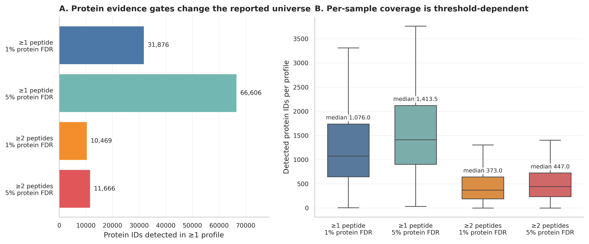
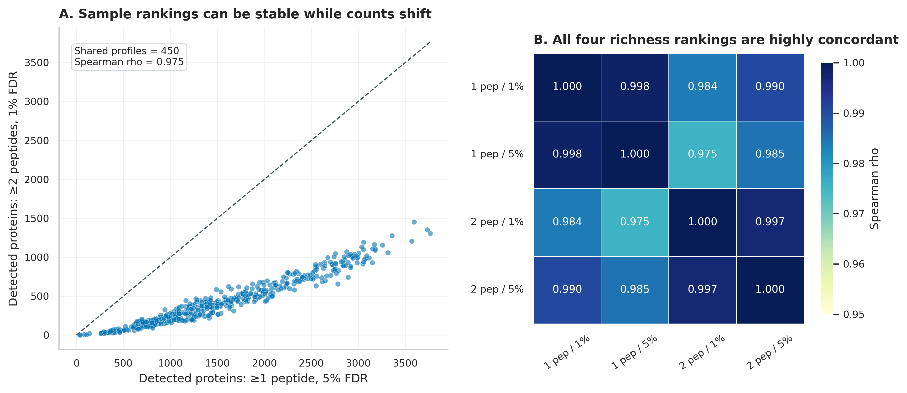
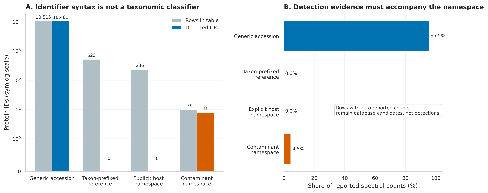
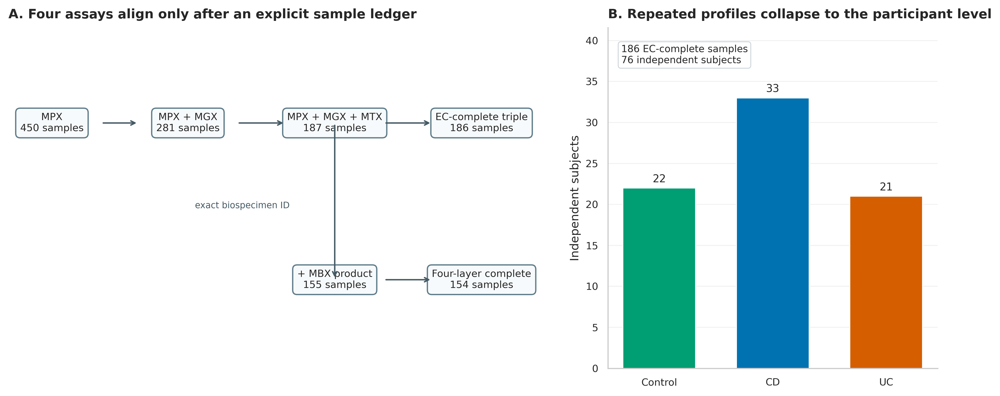
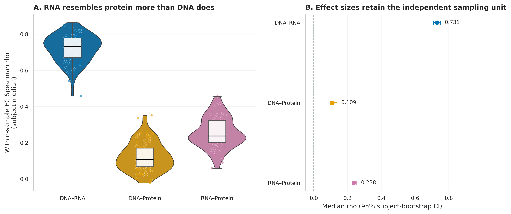
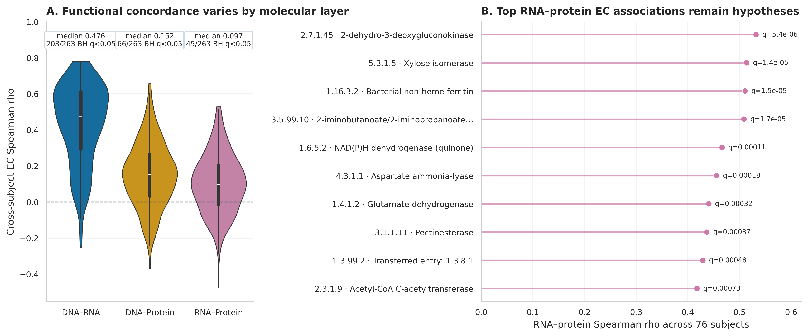

> **先给结论：**宏蛋白组（metaproteomics, MPX）最接近“样本里真正检测到哪些蛋白”，但它仍不是蛋白活性、酶速率或代谢通量。可靠结论必须保留从谱图、peptide-spectrum match（PSM，肽谱匹配）、肽段到 protein group 的证据链；shared peptide 不能同时给多个物种重复记账，搜索数据库的大小与组成也必须进入审计。

这里使用 Lloyd-Price 等人 IBD Multi'omics Database（IBDMDB/HMP2）的 450 份官方宏蛋白组产品，以及同一研究的 MGX、MTX、MPX EC 表和临床元数据 [@lloydprice2019multiomics]。官方同时提供“至少 1/2 条肽段 × protein FDR 1%/5%”四套蛋白表，正好用来展示：检出量会随证据门槛显著变化，但宽松表不能自动称为更真实。

## 这一步对应论文里的哪张图 {#sec-target}

原研究 Supplementary Figure 1 对每个候选 EC–metabolite 组合并排展示 MGX、MTX、MPX、MTX:MGX 与 MBX 的关系。下面第一页以 biotin synthase 与 biotin 为例，定位了四层问题：DNA 是功能潜力，RNA 是相对转录分配，蛋白是质谱可检测的翻译产物，代谢物则处在底物、产物、饮食和宿主共同影响的更下游位置。

{#fig-65-anchor}

复现先不挑最相关的一对酶和代谢物，而是审计四套官方 protein evidence gates。至少 1 条肽段、5% protein FDR 的表检出 66,606 个 protein IDs，中位每样本 1,413.5 个；至少 2 条肽段、1% protein FDR 的主表只保留 10,469 个，中位每样本 373 个。差异来自证据定义，不应包装成生物学变化。

{#fig-65-threshold}

## 理论：谱图怎样变成可解释的微生物蛋白 {#sec-theory}

### 1. PSM、peptide 与 protein group 是三个不同层级

bottom-up LC–MS/MS 先把蛋白酶切成肽段。搜索引擎比较实验碎片谱与 FASTA 理论肽段，得到 PSM；多个 PSM 汇总为 peptide evidence，再进入 protein inference（蛋白推断） [@kim2014msgfplus; @nesvizhskii2005proteinference]。因此：

- 一个高分 PSM 只说明某张谱与某条肽段相符；
- 同一肽段可能被多个蛋白、多个菌株甚至多个属共享；
- protein group 是在当前数据库和推断规则下无法由已观测肽段继续区分的一组候选蛋白；
- protein-level FDR 不是 PSM-level FDR 的同义词，二者都要明确控制。

把 PSM 数、unique peptide 数、protein group 数混成一个“蛋白数”，会让结果无法复核。

### 2. metagenome-informed 搜索库要“贴近样本”，也要控制搜索空间

宏蛋白组常把同批 MGX 的基因预测蛋白、参考肠道蛋白、宿主蛋白、常见污染物和 decoy 序列合成搜索库。样本特异库能覆盖未进入公共参考库的菌株蛋白；但把所有公共微生物蛋白无差别拼进去会急剧扩大候选空间，降低检出功效，并增加 shared peptide 与错误物种归属。

推荐把数据库拆成带来源标签的 FASTA header：

$$
\mathrm{DB}=\mathrm{sample\ gene\ catalog}+\mathrm{host}+\mathrm{contaminants}+\mathrm{decoys}.
$$

每个 protein accession 至少保留 `source`、`taxon`、`gene_catalog_cluster` 与 `is_decoy/is_contaminant`。后续“微生物 vs 宿主”的判定应来自数据库来源与 peptide mapping，而不是凭 accession 长相猜。

### 3. shared peptide 决定物种分辨率的上限

设肽段 $p$ 可映射到蛋白集合 $G(p)$：

- 若 $|G(p)|=1$，它是当前数据库中的 unique peptide，可支持该 protein group；
- 若 $|G(p)|>1$，它是 shared peptide，只能支持 $G(p)$ 的公共层级；
- 若这些蛋白跨多个物种，默认不应把同一 PSM 完整计给每个物种。

稳妥输出同时给三列：`unique_count`、`shared_count`、`ambiguous_fraction`。taxon-specific protein 只使用能在预先声明层级区分 taxon 的肽段，或将共享证据按 lowest common ancestor（LCA）停在更高分类阶元。没有可区分肽段时，正确答案是“无法分辨”，不是强行挑一个物种。

### 4. abundance 仍是相对且受可检测性影响

spectral count、MS1 intensity、LFQ intensity 或 DIA quantity 都受肽段电离、色谱、缺失值、酶切效率与仪器动态范围影响。对第 $i$ 个样本、第 $j$ 个 EC，这里的 MPX 表给出谱图计数 $P_{ij}$，主分析在 864 个 MGX/MTX/MPX 共有 EC 内归一化：

$$
P^*_{ij}=\frac{P_{ij}}{\sum_{k=1}^{864} P_{ik}}.
$$

它表示“可归类到这些共有 EC 的蛋白证据份额”，不是每克粪便蛋白分子数，更不是 catalytic flux。若要比较绝对蛋白负荷，需要外标、总蛋白量、细胞数或定量内标。

### 5. 三种相关回答三个不同问题

本章保留三种分子层的 263 个 EC（DNA、RNA、protein prevalence 均至少 10%），然后计算：

1. **样本内 profile correlation**：同一样本 263 个 EC 的排序是否相似；每名受试者再取其纵向样本中位数。
2. **EC 跨受试者 correlation**：同一个 EC 在 76 名受试者中的高低是否跨层同步。
3. **四层样本对齐**：只确认同一 biospecimen 是否同时有 MGX、MTX、MPX、MBX 产品；若要检验 EC–metabolite 对，还需预注册代谢物匹配与检验家族。

这两个相关 estimand 可以给出不同排序：样本内 RNA–protein 中位相关 0.238，高于 DNA–protein 的 0.109；但逐 EC 跨受试者的中位相关分别是 0.097 与 0.152。二者并不矛盾，因为一个比较每个样本内的功能构成，另一个比较每个功能在受试者间的协变。

## 准备工作 {#sec-preparation}

### 数据谱系与算力门槛

| 对象 | 锁定内容 |
|---|---|
| Study | IBDMDB/HMP2；Lloyd-Price et al., Nature 2019；DOI `10.1038/s41586-019-1237-9` |
| MPX protein tables | release path `2017-03-20`；四套 1/2-peptide × 1%/5%-protein-FDR 产品 |
| MPX functional table | `HMP2_proteomics_ecs.tsv.gz`；910 rows × 450 profiles；SHA-256 `6328db9b...65a7a` |
| MGX EC | merged release path `2018-05-04`；SHA-256 `23f81ec1...b220` |
| MTX EC | merged release path `2017-12-14`；SHA-256 `0a5da078...3a0` |
| Metadata | release `2018-08-20`；SHA-256 `656b7bd9...2ec9` |
| Primary protein gate | official `2pep-pro_1p_FDR_5ppm` table；不把它冒充原始 PSM 表 |
| Functional gate | unstratified EC；三层 prevalence 均 ≥10%；263 ECs |
| Independent unit | 76 subjects；Control 22、CD 33、UC 21 |

预计耗时与资源如下：核验冻结结果需 **2 CPU、4 GB RAM、1--2 分钟、约 2 GB 磁盘**；从 122 MB 官方压缩输入重算需 **4 CPU、12 GB RAM、10--30 分钟、5 GB 临时空间**。从原始 LC–MS/MS 与同批 MGX 建库重跑，建议 **16--32 CPU、64--128 GB RAM、0.5--2 TB SSD、每批数小时至数天**；搜索库越大，内存、I/O 与 FDR 负担越高。没有服务器时先用官方 protein/EC 表练习统计，将原始搜库提交 HPC/云队列。

<details>
<summary><strong>安装、下载官方数据并内联作图函数</strong></summary>

```{bash}
mamba env create -f env/multiomics-python.yml

Rscript -e 'install.packages(c(
  "ggplot2", "dplyr", "tidyr", "readr", "jsonlite",
  "scales", "patchwork", "knitr"
))'

python scripts/download_article65_metaproteomics_data.py \
  --cache-dir db/ibdmdb-cache/article65
```

```{r}
set.seed(20260765)

pal_pub <- c(
  "Control" = "#009E73", "CD" = "#0072B2", "UC" = "#D55E00",
  "DNA–RNA" = "#0072B2", "DNA–Protein" = "#E69F00",
  "RNA–Protein" = "#CC79A7", "Not significant" = "#9AA0A6"
)
scale_color_pub <- function(...) ggplot2::scale_color_manual(values = pal_pub, ...)
scale_fill_pub  <- function(...) ggplot2::scale_fill_manual(values = pal_pub, ...)
theme_pub <- function(base_size = 12) {
  ggplot2::theme_bw(base_size = base_size) + ggplot2::theme(
    panel.grid.minor = ggplot2::element_blank(),
    panel.grid.major = ggplot2::element_line(color = "#ECEFF1", linewidth = 0.3),
    axis.text = ggplot2::element_text(color = "black"),
    legend.key = ggplot2::element_blank(),
    strip.background = ggplot2::element_rect(fill = "#EDF2F4", color = NA),
    plot.title.position = "plot",
    plot.caption = ggplot2::element_text(color = "#455A64", hjust = 0)
  )
}
save_pub <- function(plot, file_base, width = 210, height = 150,
                     units = "mm", dpi = 350) {
  dir.create(dirname(file_base), recursive = TRUE, showWarnings = FALSE)
  ggplot2::ggsave(paste0(file_base, ".pdf"), plot, width = width,
                  height = height, units = units, device = grDevices::cairo_pdf,
                  bg = "white")
  ggplot2::ggsave(paste0(file_base, ".png"), plot, width = width,
                  height = height, units = units, dpi = dpi, bg = "white")
  ggplot2::ggsave(paste0(file_base, ".tiff"), plot, width = width,
                  height = height, units = units, dpi = dpi,
                  compression = "lzw", bg = "white")
  invisible(plot)
}
```

</details>

### 先核验冻结证据与输入结构

```{bash}
FROZEN="$PWD/data/small/65-metaproteomics-frozen"
sha256sum -c "$FROZEN/file-checksums.sha256"
sed -n '1,80p' "$FROZEN/source-manifest.json"
column -ts $'\t' "$FROZEN/threshold-audit.tsv"
column -ts $'\t' "$FROZEN/concordance-summary.tsv"
```

三层 EC-complete sample ledger 的前五行如下；`DNAECSum` 与 `RNAECSum` 是官方相对丰度表在 864 个共有 EC 上的覆盖总和，`ProteinECSum` 是对应谱图计数总和。

| SampleID | SubjectID | Week | Diagnosis | DNAECSum | RNAECSum | ProteinECSum | MBX available |
|---|---|---:|---|---:|---:|---:|---|
| CSM5MCVN | C3002 | 16 | CD | 0.952 | 0.978 | 524 | yes |
| CSM5MCX3 | C3006 | 15 | UC | 0.939 | 0.978 | 1283 | yes |
| CSM5MCXL | C3004 | 16 | UC | 0.955 | 0.983 | 219 | yes |
| CSM5MCY8 | C3005 | 15 | UC | 0.951 | 0.962 | 277 | yes |
| CSM5MCZ3 | C3008 | 16 | CD | 0.955 | 0.962 | 211 | yes |

## 可复制代码：从 PSM 证据边界到三层 EC 对齐 {#sec-code}

### 第 1 步：先建立带来源标签的 metagenome-informed FASTA

下面从已完成 QC 的同批 MGX contigs 起步。对每个样本单独搜库或先构建 cohort gene catalog，取决于样本数和研究问题；无论哪一种，都要保留样本/contig/ORF 到 protein accession 的映射。

```{bash}
mkdir -p work/article65/{genes,db,fragpipe,logs}

# 每个样本预测 ORF；样本 ID 写进 accession，避免合并后失去来源。
for fasta in data/contigs/*.fa; do
  sample=$(basename "$fasta" .fa)
  prodigal \
    -i "$fasta" \
    -a "work/article65/genes/${sample}.faa" \
    -d "work/article65/genes/${sample}.fna" \
    -f gff \
    -o "work/article65/genes/${sample}.gff" \
    -p meta
done

# 去除完全重复蛋白，但保留 cluster/member 映射文件。
seqkit concat work/article65/genes/*.faa > work/article65/db/cohort-proteins.raw.faa
seqkit rmdup -s \
  -D work/article65/db/exact-duplicate-members.tsv \
  -o work/article65/db/cohort-proteins.faa \
  work/article65/db/cohort-proteins.raw.faa

# 宿主与污染物必须是独立 namespace；下载日期与 checksum 写进 manifest。
seqkit replace -p '^(.+)$' -r 'MICROBE|$1' work/article65/db/cohort-proteins.faa \
  > work/article65/db/search-targets.fasta
seqkit replace -p '^(.+)$' -r 'HOST|$1' db/proteomics/human-reviewed.fasta \
  >> work/article65/db/search-targets.fasta
seqkit replace -p '^(.+)$' -r 'CONTAMINANT|$1' db/proteomics/cRAP.fasta \
  >> work/article65/db/search-targets.fasta

sha256sum work/article65/db/search-targets.fasta \
  > work/article65/db/search-targets.fasta.sha256
```

::: {.callout-important title="数据库越大，不等于覆盖越好"}
若 cohort FASTA 有数千万条高度相似蛋白，先做 exact duplicate removal，再评估 90%/95% clustering 的灵敏度；clustering 会节省搜索空间，却也可能抹掉 strain-specific peptide。主分析与敏感性分析必须使用各自锁定的 FASTA，并分别重新估计 FDR。
:::

### 第 2 步：原研究与现代重跑分开记录

HMP2 protocol 使用 Q-Exactive Orbitrap、tryptic digestion、MSGF+ v10072、HMP1 gut reference genomes（`HMP_Refgenome-gut_2015-06-18`）、target/reverse-decoy search，并以 1% protein FDR 和至少一条 unique peptide 作为发布流程的主要边界 [@ibdmdb2016proteomicsprotocol; @kim2014msgfplus]。原研究随后将 metaproteomic peptides 映射到 HUMAnN2/UniRef90 reference，使用 DIAMOND v0.8.22.84，最低 90% identity [@lloydprice2019multiomics]。

若今天从原始谱图重跑，可使用锁定的 FragPipe 24.0 / MSFragger 4.4 工作流 [@fragpipe2026v24; @kong2017msfragger]。先在 GUI 中保存 `workflow.workflow` 和 `samples.fp-manifest`，再用 headless 模式提交 HPC；manifest 的每一行绑定原始谱文件、experiment 与 bioreplicate，不能靠文件排序猜配对。

```{bash}
# FragPipe 24.0；workflow 内锁定 enzyme、mass tolerance、modifications、
# target-decoy、PSM/ion/peptide/protein 1% FDR 与 ProteinProphet inference。
fragpipe \
  --headless \
  --workflow work/article65/fragpipe/metaproteome.workflow \
  --manifest work/article65/fragpipe/samples.fp-manifest \
  --workdir work/article65/fragpipe/results \
  --config-tools-folder /opt/fragpipe/tools \
  > work/article65/logs/fragpipe.stdout.log 2>&1

# 这些审计产物不能只留最终 protein.tsv。
find work/article65/fragpipe/results -type f \
  \( -name 'psm.tsv' -o -name 'peptide.tsv' -o -name 'protein.tsv' \
     -o -name '*.log' -o -name '*.params' \) -print \
  > work/article65/fragpipe/output-inventory.txt
```

FragPipe 只是现代替代路线，不是 HMP2 原始结果的生成工具。若要声称“复现 HMP2”，必须使用原版协议、数据库和参数；若要声称“按当前标准重分析”，则完整报告新工作流，并把版本差异列为预期变异来源。

### 第 3 步：四套官方阈值表先做 sensitivity audit

```python
from pathlib import Path
import pandas as pd
from scipy.stats import spearmanr

CACHE = Path("db/ibdmdb-cache/article65")
tables = {
    "1 peptide · 1% FDR": "mpx-1pep-1pct.tsv.gz",
    "1 peptide · 5% FDR": "mpx-1pep-5pct.tsv.gz",
    "2 peptides · 1% FDR": "mpx-2pep-1pct.tsv.gz",
    "2 peptides · 5% FDR": "mpx-2pep-5pct.tsv.gz",
}

audit, richness, protein_ids = [], {}, {}
for label, filename in tables.items():
    x = pd.read_csv(CACHE / filename, sep="\t")
    values = x.iloc[:, 1:].astype(float)
    richness[label] = values.gt(0).sum(axis=0)
    protein_ids[label] = set(x.iloc[:, 0].astype(str))
    audit.append({
        "Threshold": label,
        "ProteinTableRows": len(x),
        "Profiles": values.shape[1],
        "DetectedProteinIDs": int(values.gt(0).any(axis=1).sum()),
        "MedianDetectedPerSample": float(richness[label].median()),
        "TotalReportedCounts": float(values.to_numpy().sum()),
    })

threshold_audit = pd.DataFrame(audit)
assert threshold_audit["DetectedProteinIDs"].tolist() == [31876, 66606, 10469, 11666]
```

四套表的每样本 protein-richness 排名相关为 0.975--0.998，看起来非常稳定；但每样本绝对检出数与 protein universe 大幅变化。更重要的是，表的 ID 集合不是严格嵌套：2-peptide/1%-FDR 表有 1 个 ID 不在 1-peptide/1%-FDR 表中，2-peptide/5%-FDR 表有 81 个 ID 不在后者中。不要只凭文件名假设子集关系，应对 accession 集合做机器核验。

{#fig-65-threshold-sensitivity}

### 第 4 步：protein namespace 只做来源审计，不冒充物种分类

```python
import numpy as np

primary = pd.read_csv(CACHE / "mpx-2pep-1pct.tsv.gz", sep="\t")
protein_id = primary["Protein"].astype(str)

namespace = np.select(
    [
        protein_id.str.startswith("HR:"),
        protein_id.str.startswith(("CNTM:", "Contaminant_")),
        protein_id.str.contains(":", regex=False),
    ],
    [
        "Explicit host namespace",
        "Contaminant namespace",
        "Taxon-prefixed reference",
    ],
    default="Generic accession",
)

values = primary.iloc[:, 1:].astype(float)
namespace_audit = pd.DataFrame({
    "Namespace": namespace,
    "Detected": values.gt(0).any(axis=1),
    "ReportedCounts": values.sum(axis=1),
}).groupby("Namespace").agg(
    ProteinIDs=("Detected", "size"),
    DetectedProteinIDs=("Detected", "sum"),
    ReportedCounts=("ReportedCounts", "sum"),
)
```

主表含 10,515 个 generic accessions、523 个 taxon-prefixed references、236 个显式 `HR:` host rows 与 10 个 contaminant rows；真正非零的只有 10,461 个 generic IDs 和 8 个 contaminant IDs。95.5% reported counts 落在 generic accession，4.5% 落在 contaminants。这个结果只能说明该发布表的 identifier namespace 与非零证据，**不能**仅凭 generic accession 把它们全部宣称为微生物蛋白。

{#fig-65-namespace}

### 第 5 步：严格用同一 biospecimen ID 对齐 MGX、MTX、MPX、MBX

```python
import gzip

def extract_unstratified(source, target):
    with gzip.open(source, "rt") as src, gzip.open(target, "wt") as dst:
        dst.write(src.readline())
        for line in src:
            if "|" not in line.split("\t", 1)[0]:
                dst.write(line)

extract_unstratified(CACHE / "mgx-ecs-rela.tsv.gz", "mgx-ec-unstrat.tsv.gz")
extract_unstratified(CACHE / "mtx-ecs-rela.tsv.gz", "mtx-ec-unstrat.tsv.gz")

def load(path):
    x = pd.read_csv(path, sep="\t")
    return x.set_index(x.columns[0]).astype(float)

dna0 = load("mgx-ec-unstrat.tsv.gz")
rna0 = load("mtx-ec-unstrat.tsv.gz")
protein0 = load(CACHE / "mpx-ecs.tsv.gz")

samples = sorted(set(dna0.columns) & set(rna0.columns) & set(protein0.columns))
ecs = sorted(set(dna0.index) & set(rna0.index) & set(protein0.index))
dna = dna0.loc[ecs, samples].T
rna = rna0.loc[ecs, samples].T
protein = protein0.loc[ecs, samples].T

complete = dna.sum(axis=1).gt(0) & rna.sum(axis=1).gt(0) & protein.sum(axis=1).gt(0)
dna, rna, protein = dna.loc[complete], rna.loc[complete], protein.loc[complete]

for layer in (dna, rna, protein):
    layer[:] = layer.div(layer.sum(axis=1), axis=0)

prevalence = pd.concat({
    "DNA": dna.gt(0).mean(),
    "RNA": rna.gt(0).mean(),
    "Protein": protein.gt(0).mean(),
}, axis=1)
selected = prevalence.index[prevalence.min(axis=1).ge(0.10)]

assert len(samples) == 187
assert dna.shape[0] == rna.shape[0] == protein.shape[0] == 186
assert len(ecs) == 864
assert len(selected) == 263
```

450 个 MPX profiles 中，281 个有同 ID MGX，187 个同时有 MTX；一个 triple profile 的共有 MPX EC 总和为 0，故三层主分析剩 186 个样本。155 个 triple profiles 还有同 ID MBX product，排除该零蛋白层后得到 **154 个四层 EC-complete biospecimens**。这比原论文按更宽松时间窗配对的样本口径更严格；两种口径不可混报。

{#fig-65-alignment}

### 第 6 步：先折回 subject，再计算相关与统一 FDR

```python
import numpy as np
from scipy.stats import spearmanr
from statsmodels.stats.multitest import multipletests

SEED = 65001
BOOTSTRAPS = 2000
layers = {"DNA": dna[selected], "RNA": rna[selected], "Protein": protein[selected]}
pairs = (("DNA", "RNA"), ("DNA", "Protein"), ("RNA", "Protein"))

# metadata 必须先按 SampleID 一对一重排；SubjectID 不从行号推断。
meta0 = pd.read_csv(CACHE / "hmp2-metadata.csv", low_memory=False)
meta = meta0.loc[
    meta0["data_type"].eq("proteomics") &
    meta0["External ID"].isin(dna.index)
].set_index("External ID").loc[dna.index]
subject = meta["Participant ID"].astype(str)
assert subject.nunique() == 76

sample_rho = []
for sample in dna.index:
    for first, second in pairs:
        sample_rho.append({
            "SampleID": sample,
            "SubjectID": subject.loc[sample],
            "LayerPair": f"{first}–{second}",
            "SpearmanRho": spearmanr(
                layers[first].loc[sample], layers[second].loc[sample]
            ).statistic,
        })

subject_rho = pd.DataFrame(sample_rho).groupby(
    ["SubjectID", "LayerPair"], as_index=False
)["SpearmanRho"].median()

# 对每个 EC：先在 subject 内取纵向中位数，再跨 76 subjects 相关。
subject_layers = {}
for name, layer in layers.items():
    x = layer.copy()
    x.insert(0, "SubjectID", subject.loc[x.index])
    subject_layers[name] = x.groupby("SubjectID").median(numeric_only=True)

tests = []
for first, second in pairs:
    for ec in selected:
        rho, p = spearmanr(subject_layers[first][ec], subject_layers[second][ec])
        tests.append({"EC": ec, "LayerPair": f"{first}–{second}",
                      "SpearmanRho": rho, "PValue": p})

tests = pd.DataFrame(tests)
tests["QValue"] = multipletests(tests["PValue"], method="fdr_bh")[1]
assert len(tests) == 3 * 263 == 789
```

subject-bootstrap 固定 `seed = 65001`，以 76 名受试者为抽样单位、重复 2,000 次。样本内 profile correlation 的受试者中位数为：DNA–RNA 0.731（95% CI 0.709--0.751）、DNA–protein 0.109（0.098--0.137）、RNA–protein 0.238（0.228--0.254）。RNA 比 DNA 更接近蛋白，但一致性仍很有限，不能把 transcript abundance 当成 protein abundance 的替代测量。

{#fig-65-concordance}

逐 EC 跨受试者相关的中位数为 DNA–RNA 0.476、DNA–protein 0.152、RNA–protein 0.097；在 789 个检验统一 BH 校正后，分别有 203、66、45 个 $q<0.05$。RNA–protein 最高的是 EC 2.7.1.45（2-dehydro-3-deoxygluconokinase，$\rho=0.532$，$q=5.4\times10^{-6}$），但它仍是观察性候选，不是翻译调控或疾病机制的因果证据。

{#fig-65-ec-correlation}

## 审计与升级 {#sec-audit}

### 忠实复现到哪里

本章忠实使用 HMP2 2017-03-20 MPX merged products、2018-05-04 MGX EC、2017-12-14 MTX EC 和 2018-08-20 metadata，不用现代重跑结果替换原版表。原协议的 MSGF+、HMP1 gut reference database、target/reverse decoy、protein FDR 与 unique-peptide 规则按官方 protocol 报告；FragPipe 24.0 只作为当前可执行的升级路线。

### 今天必须补上的七层审计

1. **PSM/peptide/protein-group 分层。**分别输出各层 target、decoy、FDR 与计数，不能只交最终 protein abundance matrix。
2. **数据库审计。**锁定 FASTA checksum、来源、构建脚本、host/contaminant/decoy namespace 与候选数量；换数据库必须重估 FDR。
3. **shared-peptide 审计。**报告 unique/shared/ambiguous fraction；跨 taxon shared peptide 不完整重复记账。
4. **阈值审计。**四套官方表的检出 protein IDs 从 10,469 到 66,606；主结论至少对 1/2 peptide 和 1%/5% FDR 做 sensitivity。
5. **命名空间审计。**显式 host/taxon-prefixed row 可以全为 0；generic accession 也不自动等于微生物。来源判断必须回到 FASTA manifest 和 peptide mapping。
6. **样本审计。**186 个三层 profiles 只有 76 个 independent subjects；相关、bootstrap、置换和训练/测试划分都按 subject block。
7. **多重性审计。**三类 × 263 EC 是一个预先声明的 789-test family；若再加入 231 个 metabolites，检验家族要在看结果前定义。

### 从“检测到蛋白”升级到“可信功能证据”

- 使用独立的 DDA/DIA workflow sensitivity，报告 missingness、batch、CV、blank 与 pooled QC；
- 对关键 protein group 展示 discriminating peptides、谱图质量、retention time 与 taxonomic ambiguity；
- 把 spectral count、MS1/LFQ intensity 和 presence/absence 作为不同 estimands，不混在一个热图；
- 用 taxon-stratified MGX/MTX 与 unique-peptide MPX 交叉核验携带者，而非只按 EC 名称归因；
- 用 targeted PRM/SRM、重肽内标或酶活实验验证候选蛋白；要谈 flux，再加入 isotope tracing、底物/产物与环境约束；
- discovery 与 validation cohort 分开锁定数据库和阈值，外测时不得用测试集样本重建 gene catalog。

## 出版级美化 {#sec-publication}

宏蛋白组图优先显示证据层级与不确定性：threshold sensitivity 用成对分布而非只报一个 protein count；shared/ambiguous peptide 用堆叠比例；跨层相关报告 subject-level points、median 与 bootstrap CI。DNA–RNA 固定蓝色、DNA–protein 橙色、RNA–protein 紫色；图内文字全部为英文。

```{r}
library(ggplot2)
library(readr)
library(dplyr)

frozen65 <- "data/small/65-metaproteomics-frozen"
if (!dir.exists(frozen65)) frozen65 <- "../data/small/65-metaproteomics-frozen"

summary65 <- read_tsv(file.path(frozen65, "concordance-summary.tsv"), show_col_types = FALSE) |>
  mutate(LayerPair = factor(LayerPair,
    levels = c("DNA–RNA", "DNA–Protein", "RNA–Protein")))

p65 <- ggplot(summary65, aes(MedianSpearmanRho, LayerPair, color = LayerPair)) +
  geom_vline(xintercept = 0, linetype = 2, color = "#455A64") +
  geom_errorbarh(aes(xmin = CILow, xmax = CIHigh), height = 0) +
  geom_point(size = 2.8) +
  scale_color_pub() +
  labs(
    x = "Median within-sample EC Spearman rho (95% subject-bootstrap CI)",
    y = NULL, color = NULL,
    title = "Cross-layer functional concordance"
  ) +
  theme_pub() +
  theme(legend.position = "none")

save_pub(p65, "figures/65-three-layer-concordance-r", width = 205, height = 105)
```

::: {.callout-tip}
主图建议依次放 sample alignment、evidence-gate sensitivity、三层 concordance 与 top EC forest；namespace、ID-set overlap、shared-peptide ambiguity 和 blank/QC 进入补充材料。每张图的 caption 都写清单位是 profiles、samples、subjects、PSMs、peptides 还是 protein groups。
:::

## 常见坑 {#sec-pitfalls}

::: {.callout-caution title="坑 1：一条肽段就等于一个物种特异蛋白"}
肽段可能被多个 homolog、菌株或物种共享。先检查 peptide-to-protein mapping；没有 discriminating peptide，就把结论停在 protein group 或 LCA。
:::

::: {.callout-caution title="坑 2：在多个物种中重复计算同一个 shared peptide"}
这会同时夸大总蛋白量和多个 taxon 的贡献。必须声明 parsimony、razor、fractional allocation 或 LCA 规则，并报告 ambiguous fraction。
:::

::: {.callout-caution title="坑 3：只控制 PSM FDR"}
PSM 通过 1% FDR 不代表 peptide 与 protein group 也自动是 1%。分别控制并报告 PSM、ion/peptide、protein-group FDR；小数据库与超大数据库的结果不能直接比较。
:::

::: {.callout-caution title="坑 4：把 accession 前缀当物种分类器"}
HMP2 主表中 523 个 taxon-prefixed 和 236 个显式 host rows 都是零计数候选；generic accession 才承载大部分非零证据。可靠来源必须由搜索库 manifest 和肽段映射支持。
:::

::: {.callout-caution title="坑 5：把 186 个 profiles 写成 n=186 患者"}
这批三层数据只有 76 名受试者。重复测量需 subject aggregation、mixed model、GEE 或 block resampling；训练/测试拆分也必须按 subject。
:::

::: {.callout-caution title="坑 6：看到 RNA–protein 相关就写‘翻译增强’"}
相关同时受相对归一化、protein detectability、shared peptide、数据库覆盖和受试者组成影响。没有绝对定量、时间先后和干预，不能推出 translation rate 或 causality。
:::

::: {.callout-caution title="坑 7：把 EC abundance 叫酶活或 flux"}
EC 汇总说明检测到与该功能注释相符的蛋白证据。酶是否活化、反应方向与通量还需要 PTM/复合体、底物产物、热力学、同位素或直接 activity assay。
:::

## 这段 Methods 怎么写 {#sec-methods}

**Metaproteomic processing and multi-omic alignment.** Merged metaproteomic products (MPX release path 2017-03-20), metagenomic EC relative-abundance profiles (MGX release path 2018-05-04), metatranscriptomic EC relative-abundance profiles (MTX release path 2017-12-14), and metadata release 2018-08-20 were obtained from the IBDMDB/HMP2 study of Lloyd-Price et al. (Nature 2019; DOI: 10.1038/s41586-019-1237-9). The published HMP2 proteomic protocol used tryptic LC–MS/MS, MSGF+ v10072, the HMP_Refgenome-gut_2015-06-18 target/reverse-decoy database, a 1% protein-level FDR, and at least one unique peptide per reported protein. Four official merged protein-filter products (minimum one or two peptides; 1% or 5% protein FDR; 5-ppm product labels) were audited without assuming nested accession sets. The two-peptide/1%-protein-FDR table was designated as the primary conservative protein product. For functional integration, unstratified ECs shared by MGX, MTX, and MPX were retained, and assay layers were aligned by exact biospecimen identifier. One of 187 intersecting profiles had zero total MPX evidence across the 864 shared ECs and was excluded. Each layer was normalized within the shared EC universe. ECs detected in at least 10% of the 186 assay-complete samples in every layer were retained (263 ECs). Within-sample cross-layer Spearman correlations were summarized by the median across longitudinal samples within each participant. EC-wise cross-layer correlations were calculated after participant-level median aggregation, and the resulting 789 P values (three layer pairs by 263 ECs) were adjusted jointly using the Benjamini–Hochberg procedure. Median confidence intervals were estimated using 2,000 participant-level bootstrap replicates with seed 65001. Metabolomic product availability was audited by exact biospecimen identifier; 154 assay-complete profiles had MGX, MTX, MPX, and MBX products.

**Results template.** The four official protein evidence gates yielded 10,469–66,606 protein identifiers detected in at least one profile, with median per-profile richness ranging from 373 to 1,413.5. Exact MGX–MTX–MPX alignment produced 186 assay-complete profiles from 76 independent participants (22 controls, 33 with Crohn's disease, and 21 with ulcerative colitis); 154 profiles additionally had an exact-ID metabolomic product. Across 263 ECs, the participant-level median within-sample Spearman correlations were 0.731 (95% participant-bootstrap CI 0.709–0.751) for DNA–RNA, 0.109 (0.098–0.137) for DNA–protein, and 0.238 (0.228–0.254) for RNA–protein. In EC-wise cross-participant analyses, 203, 66, and 45 associations, respectively, passed joint BH correction across 789 tests. These associations were interpreted as concordance among independently normalized functional profiles, not as absolute protein expression, translation rates, enzyme activity, metabolic flux, or causality.

## 换成你自己的数据怎么做 {#sec-own-data}

你需要六类输入：

1. **原始 LC–MS/MS 文件与 instrument metadata**：raw/mzML、fraction、batch、gradient、acquisition mode、blank、pooled QC 和 injection order。
2. **同批 MGX 及基因目录**：contigs、ORFs、protein FASTA、cluster/member mapping、样本来源与 FASTA checksum。
3. **完整搜索库**：microbial targets、host、contaminants、decoys，且 header namespace 可机器解析。
4. **证据表**：PSM、peptide、protein group 与 abundance；至少含 score/q-value、unique/shared mapping、decoy/contaminant、charge、mass error 和 run ID。
5. **多组学映射表**：`MGX_ID`、`MTX_ID`、`MPX_ID`、`MBX_ID`、`BiospecimenID`、`SubjectID`、time、batch 和技术重复。
6. **协变量与 QC**：diagnosis、药物、炎症、饮食、总蛋白量、protein yield、identified spectra fraction、missingness 和污染物比例。

推荐顺序是：预注册数据库构建与 FDR 层级；先跑 pooled QC/blank；冻结 FASTA 与 workflow checksum；检查 PSM/peptide/protein-group attrition；量化 shared-peptide ambiguity；分别输出 microbial/host/contaminant；在 protein group、EC/KO/pathway 三层做汇总；严格按 biospecimen 对齐 MGX/MTX/MPX/MBX；重复测量按 subject block；最后才做疾病关联和机制命名。

完整重算、固化与 QA：

```{bash}
python scripts/prepare_article65_metaproteomics.py \
  --cache-dir db/ibdmdb-cache/article65 \
  --output-dir .tutorial_runs/article65-work

MPLCONFIGDIR=.tutorial_runs/article65-mpl \
python scripts/plot_article65_metaproteomics.py \
  --input-dir .tutorial_runs/article65-work \
  --figure-dir figures

python scripts/freeze_article65_metaproteomics.py \
  --project-root "$PWD" \
  --work-dir .tutorial_runs/article65-work \
  --output-dir data/small/65-metaproteomics-frozen

python scripts/validate_article65_metaproteomics.py \
  --project-root "$PWD" \
  --frozen-dir data/small/65-metaproteomics-frozen \
  --chapter chapters/65-metaproteomics.qmd \
  --figure-dir figures \
  --output-dir qa/article65 \
  --stage-dir .tutorial_runs/article65-validation
```

## 参考 {#sec-references}

- HMP2 纵向多组学设计、MGX/MTX/MPX/MBX 产品与原始跨层分析：[@lloydprice2019multiomics]
- HMP2 LC–MS/MS、MSGF+、搜索数据库与 protein evidence protocol：[@ibdmdb2016proteomicsprotocol; @kim2014msgfplus]
- protein inference 与 shared peptide 的基本边界：[@nesvizhskii2005proteinference]
- 现代搜索引擎与锁定版本的可执行升级路线：[@kong2017msfragger; @fragpipe2026v24]
