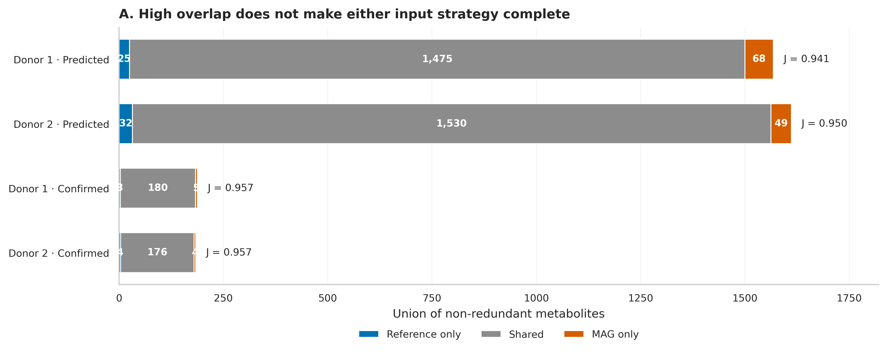
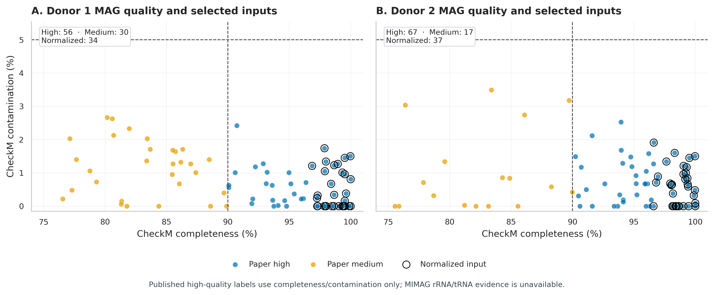
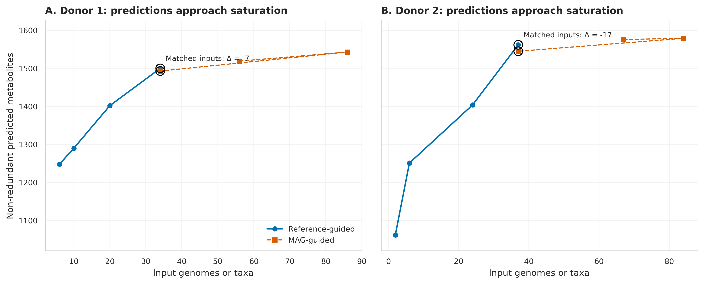
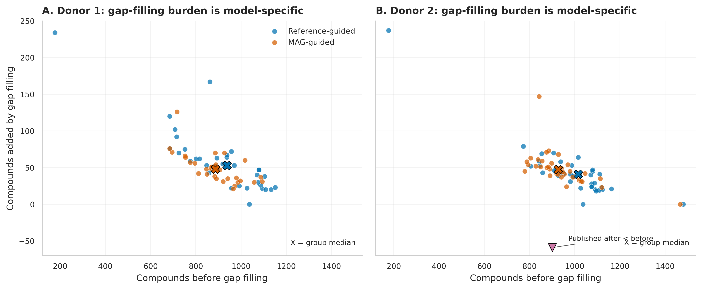
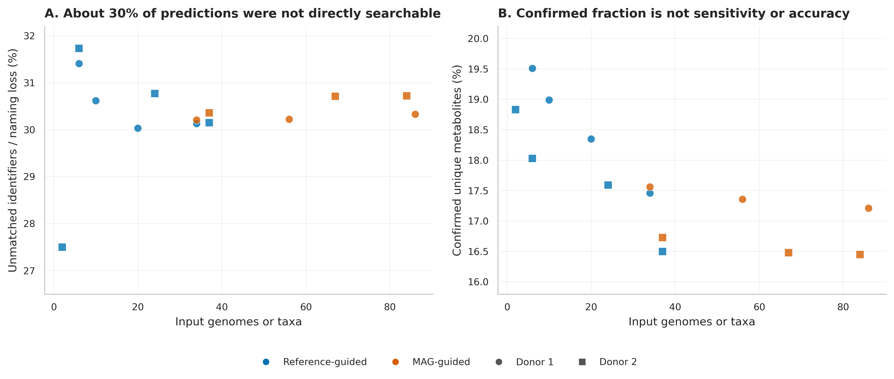
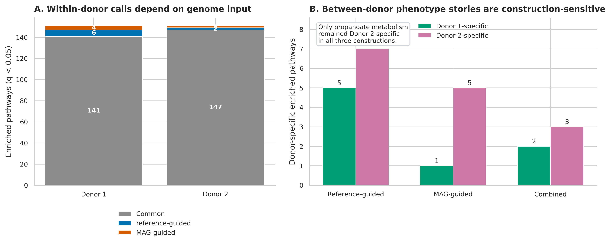

> **先给结论：**MAG（metagenome-assembled genome，宏基因组组装基因组）可以把代谢反应潜力定位到具体基因组，但 genome-scale metabolic model（GEM，基因组尺度代谢模型）输出仍是**在给定注释、培养基、目标函数和 gap filling 规则下可行的网络预测**，不是实测代谢速率。把 MAG 与代谢物、疗效连成证据链，至少要同时守住 MAG 质量、模型输入可比性、化合物 ID 映射、独立实验单位和外部验证五道门。

本章复核 Majzoub 等人的两位健康粪菌移植供体研究：170 个真实 MAG、两套参考基因组模型、11 个纵向粪便 LC–MS 样本，以及供体菌群在溃疡性结肠炎受试者中的既往疗效差异 [@majzoub2024metabolicmodels; @haifer2022donors]。论文数据非常适合回答“MAG 模型与实测代谢物能对上多少”，也同样适合展示一个常被忽略的边界：**供体只有两个，因此不能把供体间通路差异当成可推广的疗效机制。**

## 这一步对应论文里的哪张图 {#sec-target}

原研究 Figure 2 比较 reference-guided（物种丰度 ≥0.5%）与 MAG-guided（high + medium MAG）社区模型的非冗余代谢物。A/B 是预测集合，C/D 是在同一供体纵向非靶向代谢组中至少检出的“confirmed”集合。

{#fig-66-anchor}

把 Venn 图改写为可比较的 union bar 后，可以直接看到：预测集合的 Jaccard 相似度为 0.941 和 0.950，确认集合均约 0.957；但 reference-only 与 MAG-only 仍然存在。高重叠不意味着两种输入可以互换，更不意味着其中一套给出了完整真值。

{#fig-66-overlap}

论文补充表还给出了 170 个 MAG 的 CheckM completeness/contamination。Donor 1 有 56 个 paper-high 与 30 个 paper-medium MAG，Donor 2 有 67 个 paper-high 与 17 个 paper-medium MAG；等量比较分别选取最完整的 34 和 37 个 high MAG。

{#fig-66-mag-quality}

## 理论：从 MAG 到代谢物，再到表型，中间隔着什么 {#sec-theory}

### 1. 先把四个对象分开

一条可审计的链条应写成：

$$
\text{MAG sequence}
\rightarrow \text{gene/reaction annotation}
\rightarrow \text{GEM feasible set}
\rightarrow \text{predicted exchange metabolites}
\rightarrow \text{measured metabolome}
\rightarrow \text{phenotype}.
$$

每个箭头都有独立误差来源：MAG 会缺基因或混入别的基因组；annotation 会漏注或错注反应；GEM 受培养基、biomass objective、exchange bounds 与 gap filling 影响；粪便代谢物同时来自微生物、宿主、饮食和其他生物；临床表型还受受体基线、治疗方案与批次影响。前一层的“可能存在”不能直接改写成后一层的“实际产生”。

### 2. MAG 质量会改变反应网络的边界

若真实基因组含有 $R$ 个可注释反应，而 MAG 因不完整只保留其中一部分，得到的 draft GEM 会出现缺口；contamination 又可能加入并不属于该基因组的反应。原研究用 CheckM 定义：

- paper high：completeness $>90\%$ 且 contamination $<5\%$；
- paper medium：completeness $\ge 50\%$ 且 contamination $<10\%$；
- 通过 dRep v2.3.2 在 99% ANI 去冗余，再用 GTDB-Tk v1.5.1 / GTDB r207 分类。

这个 high-quality 是论文的操作性标签。MIMAG high-quality draft 还要求完整 23S/16S/5S rRNA 和至少 18 种 tRNA [@bowers2017mimag]。补充表只有 completeness、contamination 与 taxonomy，故 170 个 MAG 的 **MIMAG high-quality 状态均为 not assessable**，不能把“没有记录”写成“已经通过”。

### 3. 输入数量必须可比，但“等数量”仍不等于等信息量

参考模型用每位供体内 MetaPhlAn 4 平均物种丰度阈值选择物种；MAG 模型则使用组装、分箱和去冗余后的基因组。模型输入越多，预测的 non-redundant metabolites 会逐渐饱和。若直接比较 34 个参考物种与 86 个 MAG，差异同时混入了输入数目。

原研究因此选择最完整的 34/37 个 MAG，与 reference ≥0.5% 的 34/37 个物种匹配。等量后：

| Donor | Input | Total predicted | Unique predicted | Confirmed unique | Data loss | Confirmed fraction |
|---|---|---:|---:|---:|---:|---:|
| Donor 1 | Reference 34 | 28,583 | 1,500 | 183 | 30.13% | 17.46% |
| Donor 1 | MAG 34 | 28,172 | 1,493 | 183 | 30.21% | 17.56% |
| Donor 2 | Reference 37 | 33,661 | 1,562 | 180 | 30.15% | 16.50% |
| Donor 2 | MAG 37 | 31,902 | 1,545 | 180 | 30.36% | 16.73% |

等量后 unique predictions 只差 7 和 17，但等量并没有匹配 genome size、assembly coverage、菌株内多样性或有效反应数。因此它是必要的敏感性分析，不是完美的因果对照。

{#fig-66-normalization}

### 4. gap filling 是模型假设，不是发现新基因

draft GEM 常因注释缺口无法合成 biomass。gap filling 在候选反应库中寻找一组额外反应，使目标函数在指定培养基下可行。若 $R_{draft}$ 是基因支持反应，$R_{gap}$ 是补入反应，则：

$$
R_{model}=R_{draft}\cup R_{gap}.
$$

$R_{gap}$ 没有自动获得基因证据。每个模型都应分别导出 gap filling 前后反应、化合物与 exchange predictions，并报告 $|R_{gap}|$ 及其来源。原补充表中，Donor 1 单基因组模型的 gap-added compounds 中位数为 reference 53、MAG 48；Donor 2 为 reference 41、MAG 47.5。Donor 2 的 `bin.139` 被原表记录为 901→842，形成无法解释为“新增”的 −59；这里保留原值并写入 source-anomaly ledger，但从 gap-added summary 中排除。另有两条 Gemmiger 模型缺失 blocked-reaction count、同时把比例写为 0，也保留为 source anomaly。这里只有两位供体且模型嵌套在供体内，故只报告分布和中位差，不把 34/37 个模型误当成独立受试者做显著性检验。

{#fig-66-gapfill}

### 5. “代谢组确认”受化合物 ID 与实验设计限制

Donor 1 的 4 个纵向 LC–MS 样本检出 1,348 个代谢物，其中 489 个有 KEGG ID；加入同一化合物的 34 个别名 ID 后，搜索 523 个 ID。Donor 2 的 7 个样本检出 1,190 个代谢物，453 个有 KEGG ID；加入 35 个别名后搜索 488 个 ID。原研究把未插补的 abundance 转成**每位供体 presence/absence**，再与预测集合求交。

因此：

- 11 个时间点扩大了“曾经检出”的覆盖，但折叠后独立验证单位仍是两个供体；
- 约 30% 的预测因缺 KEGG ID 或命名不一致无法直接搜索；
- confirmed fraction 的分母受可映射 ID 集合影响；
- 粪便 LC–MS 检出并不能证明某个 MAG 产生了该化合物。

没有完整的 true-positive、true-negative 与可测量 universe，就不能计算 sensitivity、specificity 或 accuracy。Jaccard 只描述两个预测集合的相似程度：

$$
J(A,B)=\frac{|A\cap B|}{|A\cup B|}.
$$

### 6. 表型推断的独立单位是供体，不是模型数量

原研究引用既往结果：两套供体菌群用于 15 名溃疡性结肠炎受试者时，报告疗效为 100% 与 36.4%，Fisher's $P=0.026$ [@haifer2022donors]。这个检验描述受试者对两种供体暴露的差异；若问题变成“某个 MAG/通路是否解释供体疗效”，供体层面只有 $n=2$。

把每个 MAG、每条通路或每名受试者当作供体功能的独立重复，会产生 pseudoreplication（伪重复）。在两个供体上，一条通路与疗效方向一致只是一项假设生成观察；要获得可推广结论，需要更多独立供体/批次、受体协变量、预注册模型和留出供体验证。

## 准备工作 {#sec-preparation}

### 数据谱系与算力门槛

| 对象 | 锁定内容 |
|---|---|
| Study | Majzoub et al., mSystems 2024；DOI `10.1128/msystems.00746-24`；PMCID `PMC11406951` |
| Human raw reads | ENA `PRJEB50699` |
| Source tables | Europe PMC supplementary archive；Tables S1–S15；workbook SHA-256 `c740876e...d416` |
| MAGs | MetaWRAP v1.3.2；CheckM；dRep v2.3.2, 99% ANI；GTDB-Tk v1.5.1, GTDB r207 |
| GEMs | KBase；RASTtk v1.073, e-value `1e-6`；ModelSEED/OMEGGA；community merge；gap filling；FBA |
| Metabolomics | Metabolon global LC–MS；4 + 7 longitudinal samples；before-imputation donor-level presence/absence |
| Enrichment | MBROLE 2.0；SMPDB、KEGG、UniPathway；BH-adjusted $q<0.05$ |
| Independent units | 2 donors；不能用 71 个等量 MAG 或 11 个时间点替代供体数 |

预计耗时与资源如下：核验冻结结果需约 **2 CPU、4 GB RAM、1--2 分钟、<1 GB 磁盘**；从 101 KB 官方工作簿重新抽表、作图需 **2 CPU、4 GB RAM、<5 分钟、约 2 GB 临时空间**。从 `PRJEB50699` FASTQ 重新完成去宿主、组装、覆盖度计算、分箱与 MAG 质控，建议 **16--32 CPU、128 GB RAM、0.5--2 TB SSD、每个样本数小时至数天**；KBase GEM 构建还取决于服务队列。没有服务器时先核验冻结的 MAG/GEM/代谢物表，把 FASTQ 重算提交 HPC 或云队列。

<details>
<summary><strong>安装、下载官方补充材料并内联作图函数</strong></summary>

```{bash}
mamba env create -f env/multiomics-python.yml

Rscript -e 'install.packages(c(
  "ggplot2", "dplyr", "tidyr", "readr", "jsonlite",
  "scales", "patchwork", "knitr"
))'

python scripts/download_article66_mag_metabolite_data.py \
  --cache-dir db/majzoub-cache/article66
```

```{r}
set.seed(20260766)

pal_pub <- c(
  "Paper high" = "#0072B2", "Paper medium" = "#E69F00",
  "Reference-guided" = "#0072B2", "MAG-guided" = "#D55E00",
  "Shared" = "#8C8C8C", "Donor 1" = "#009E73",
  "Donor 2" = "#CC79A7"
)
scale_color_pub <- function(...) ggplot2::scale_color_manual(values = pal_pub, ...)
scale_fill_pub  <- function(...) ggplot2::scale_fill_manual(values = pal_pub, ...)
theme_pub <- function(base_size = 12) {
  ggplot2::theme_bw(base_size = base_size) + ggplot2::theme(
    panel.grid.minor = ggplot2::element_blank(),
    panel.grid.major = ggplot2::element_line(color = "#ECEFF1", linewidth = 0.3),
    axis.text = ggplot2::element_text(color = "black"),
    legend.key = ggplot2::element_blank(),
    strip.background = ggplot2::element_rect(fill = "#EDF2F4", color = NA),
    plot.title.position = "plot",
    plot.caption = ggplot2::element_text(color = "#455A64", hjust = 0)
  )
}
save_pub <- function(plot, file_base, width = 210, height = 150,
                     units = "mm", dpi = 350) {
  dir.create(dirname(file_base), recursive = TRUE, showWarnings = FALSE)
  ggplot2::ggsave(paste0(file_base, ".pdf"), plot, width = width,
                  height = height, units = units, device = grDevices::cairo_pdf,
                  bg = "white")
  ggplot2::ggsave(paste0(file_base, ".png"), plot, width = width,
                  height = height, units = units, dpi = dpi, bg = "white")
  ggplot2::ggsave(paste0(file_base, ".tiff"), plot, width = width,
                  height = height, units = units, dpi = dpi,
                  compression = "lzw", bg = "white")
  invisible(plot)
}
```

</details>

### 先核验冻结证据与输入结构

```{bash}
FROZEN="$PWD/data/small/66-mag-metabolite-frozen"
sha256sum -c "$FROZEN/file-checksums.sha256"
sed -n '1,100p' "$FROZEN/source-manifest.json"
column -ts $'\t' "$FROZEN/mag-quality-summary.tsv"
column -ts $'\t' "$FROZEN/metabolite-overlap-audit.tsv"
```

MAG ledger 的核心列如下；`MIMAGHighQualityStatus` 特意保留“not assessable”，而不是用空值掩盖缺失证据。

| Donor | MAGID | Completeness | Contamination | PaperQuality | Species | NormalizedInput | MIMAGHighQualityStatus |
|---|---|---:|---:|---|---|---|---|
| Donor 1 | bin.167 | 100.00 | 0.00 | Paper high | Methanobrevibacter_A smithii | yes | Not assessable: rRNA/tRNA evidence absent |
| Donor 1 | bin.179 | 100.00 | 0.81 | Paper high | Collinsella sp900544645 | yes | Not assessable: rRNA/tRNA evidence absent |
| Donor 1 | bin.151 | 99.98 | 1.50 | Paper high | Phascolarctobacterium faecium | yes | Not assessable: rRNA/tRNA evidence absent |
| Donor 2 | bin.103 | 100.00 | 0.00 | Paper high | Clostridium_Q fessum | yes | Not assessable: rRNA/tRNA evidence absent |
| Donor 2 | bin.130 | 100.00 | 0.00 | Paper high | Alistipes_A pullistercoris | yes | Not assessable: rRNA/tRNA evidence absent |

## 可复制代码：从 MAG 证据到社区代谢物审计 {#sec-code}

### 第 1 步：取得原始 reads，并固定样本清单

先下载 ENA run manifest，核对 biological sample、read layout、FASTQ MD5 与字节数，再选择用于演示的公开 run。不要按文件名猜供体与时间点。

```{bash}
mkdir -p data/raw/PRJEB50699 work/article66/{manifests,logs,mags,models}

curl -fsSL \
  'https://www.ebi.ac.uk/ena/portal/api/filereport?accession=PRJEB50699&result=read_run&fields=run_accession,sample_accession,fastq_ftp,fastq_md5,fastq_bytes&format=tsv&download=true' \
  -o work/article66/manifests/PRJEB50699-runs.tsv

# 在 manifests/selected-runs.txt 中放审核后的 run accession，每行一个。
while read -r run; do
  enaDataGet -f fastq -d data/raw/PRJEB50699 "$run"
done < work/article66/manifests/selected-runs.txt

find data/raw/PRJEB50699 -name '*.fastq.gz' -print0 \
  | sort -z \
  | xargs -0 sha256sum \
  > work/article66/manifests/downloaded-fastq.sha256
```

### 第 2 步：以固定 seed 重建 MAG，并保留完整质量证据

原研究用 MetaBAT2、MaxBin2 与 CONCOCT，经 MetaWRAP v1.3.2 refinement，再以 CheckM 过滤、dRep v2.3.2 在 99% ANI 去冗余 [@uritskiy2018metawrap; @parks2015checkm; @olm2017drep]。今天重跑时，先用固定的 `sample-manifest.tsv` 做逐样本 assembly/coverage；下面展示确定性的 MetaBAT2 主分支，`--seed 66001` 与排序后的输入清单必须进入 command log。

```{bash}
export PYTHONHASHSEED=66001
mkdir -p work/article66/{qc,assembly,depth,bins/metabat,checkm,drep,gtdb,mimag}

# 每个样本的 R1/R2 从审核后的 manifest 读取；示例以 SAMPLE01 表示一行。
fastp \
  -i data/raw/SAMPLE01_R1.fastq.gz \
  -I data/raw/SAMPLE01_R2.fastq.gz \
  -o work/article66/qc/SAMPLE01_R1.clean.fastq.gz \
  -O work/article66/qc/SAMPLE01_R2.clean.fastq.gz \
  --detect_adapter_for_pe --thread 16 --json work/article66/qc/SAMPLE01.fastp.json

# 去宿主时锁定人参考基因组 build 与 checksum；这里只展示索引已建好的路径。
bowtie2 -x db/host/GRCh38-noalt/GRCh38-noalt \
  -1 work/article66/qc/SAMPLE01_R1.clean.fastq.gz \
  -2 work/article66/qc/SAMPLE01_R2.clean.fastq.gz \
  --very-sensitive -p 16 \
  --un-conc-gz work/article66/qc/SAMPLE01.nonhost.fastq.gz \
  -S /dev/null 2> work/article66/logs/SAMPLE01.host-removal.log

megahit \
  -1 work/article66/qc/SAMPLE01.nonhost.fastq.1.gz \
  -2 work/article66/qc/SAMPLE01.nonhost.fastq.2.gz \
  --min-contig-len 2000 -t 32 --memory 0.9 \
  -o work/article66/assembly/SAMPLE01

coverm contig \
  -1 work/article66/qc/SAMPLE01.nonhost.fastq.1.gz \
  -2 work/article66/qc/SAMPLE01.nonhost.fastq.2.gz \
  -r work/article66/assembly/SAMPLE01/final.contigs.fa \
  --methods metabat --min-read-percent-identity 95 -t 32 \
  -o work/article66/depth/SAMPLE01.metabat-depth.tsv

metabat2 \
  -i work/article66/assembly/SAMPLE01/final.contigs.fa \
  -a work/article66/depth/SAMPLE01.metabat-depth.tsv \
  -o work/article66/bins/metabat/SAMPLE01.bin \
  -m 2000 --seed 66001 -t 32

checkm lineage_wf -x fa -t 32 \
  work/article66/bins/metabat work/article66/checkm

# 输入列表先 LC_ALL=C sort，避免同分值对象因文件遍历顺序改变。
find work/article66/bins/metabat -name '*.fa' -print | LC_ALL=C sort \
  > work/article66/drep/input-genomes.txt
dRep dereplicate work/article66/drep/dereplicated \
  -g $(tr '\n' ' ' < work/article66/drep/input-genomes.txt) \
  -comp 50 -con 10 -sa 0.99 -p 32

gtdbtk classify_wf \
  --genome_dir work/article66/drep/dereplicated/dereplicated_genomes \
  --out_dir work/article66/gtdb --extension fa --cpus 32
```

论文的 CheckM 标签可用于忠实复核，但提交前应增加 CheckM2、GUNC 与 MIMAG 元数据，尤其是 rRNA/tRNA：

```{bash}
checkm2 predict \
  --input work/article66/drep/dereplicated/dereplicated_genomes \
  --output-directory work/article66/mimag/checkm2 -x fa --threads 32

gunc run \
  --input_dir work/article66/drep/dereplicated/dereplicated_genomes \
  --out_dir work/article66/mimag/gunc -e .fa -t 32

for genome in work/article66/drep/dereplicated/dereplicated_genomes/*.fa; do
  id=$(basename "$genome" .fa)
  barrnap --kingdom bac --threads 4 "$genome" \
    > "work/article66/mimag/${id}.rrna.gff"
  tRNAscan-SE -B --thread 4 \
    -o "work/article66/mimag/${id}.trna.tsv" "$genome"
done
```

::: {.callout-important title="论文 high-quality 与完整 MIMAG high-quality 不能混写"}
若质量表没有 23S/16S/5S rRNA 与至少 18 种 tRNA 的证据列，Methods 应写“high completeness/low contamination MAGs according to the study-specific CheckM thresholds”，不要直接写“MIMAG high-quality MAGs”。
:::

### 第 3 步：构建单基因组与社区 GEM

原研究在 KBase 中依次运行：`Annotate Genome/Assembly with RASTtk v1.073`（similarity e-value `1e-6`）→ `MS2–Build Prokaryotic Metabolic Models with OMEGGA` → `Merge two or more metabolic models into a compartmentalized community model` → `MS2–Improved Gapfill Metabolic Models with OMEGGA` → `Run Flux Balance Analysis` [@arkin2018kbase; @henry2010modelseed]。

四个公开 narrative 可用于逐对象检查输入与 app provenance：

| Object | KBase narrative |
|---|---|
| Donor 1 reference | `https://kbase.us/n/133307/107/` |
| Donor 1 MAG | `https://kbase.us/n/136113/267/` |
| Donor 2 reference | `https://kbase.us/n/133504/88/` |
| Donor 2 MAG | `https://kbase.us/n/136114/199/` |

每个模型至少导出以下 ledger，而不是只保留最终代谢物名单：

```text
model_id  genome_id  reaction_id  compound_id  compartment  gene_rule
evidence  added_by_gapfill  medium_id  objective_id  app_version
```

对社区模型再增加 `member_genome` 与 shared extracellular compartment。若某个 exchange metabolite 只在 gap filling 后出现，结果表必须保留 `gapfill_supported = TRUE`；它不能与有基因和反应证据的预测混在同一置信层级。

### 第 4 步：从官方表重建质量、模型与验证审计

```{bash}
python scripts/prepare_article66_mag_metabolite.py \
  --cache-dir db/majzoub-cache/article66 \
  --output-dir work/article66/derived

python scripts/plot_article66_mag_metabolite.py \
  --input-dir work/article66/derived \
  --figure-dir figures
```

在 R 中读取冻结表并重新计算 matched-input 差异与 Figure 2 集合算术：

```{r}
library(readr)
library(dplyr)
library(tidyr)
library(ggplot2)

frozen <- "data/small/66-mag-metabolite-frozen"
community <- read_tsv(file.path(frozen, "community-model-audit.tsv"), show_col_types = FALSE)
overlap <- read_tsv(file.path(frozen, "metabolite-overlap-audit.tsv"), show_col_types = FALSE)
mag <- read_tsv(file.path(frozen, "mag-ledger.tsv"), show_col_types = FALSE)

stopifnot(
  nrow(mag) == 170,
  sum(mag$PaperQuality == "Paper high") == 123,
  sum(mag$NormalizedInput) == 71,
  all(overlap$ReferenceOnly + overlap$Shared == overlap$ReferenceTotal),
  all(overlap$MAGOnly + overlap$Shared == overlap$MAGTotal)
)

matched <- community |>
  filter(Approach %in% c("Reference ≥0.5%", "MAG normalized")) |>
  select(Donor, Approach, Taxa, `Total predicted metabolites`,
         `Unique metabolites`, `Confirmed unique metabolites (total)`)

matched |>
  select(Donor, Approach, `Unique metabolites`) |>
  pivot_wider(names_from = Approach, values_from = `Unique metabolites`) |>
  mutate(MAG_minus_reference = `MAG normalized` - `Reference ≥0.5%`)

overlap |>
  mutate(
    UnionCheck = ReferenceOnly + Shared + MAGOnly,
    JaccardCheck = Shared / UnionCheck
  ) |>
  select(Donor, Evidence, ReferenceOnly, Shared, MAGOnly, JaccardCheck)
```

### 第 5 步：先画证据边界，再解释差异

```{r}
p_quality <- ggplot(
  mag,
  aes(x = Completeness, y = Contamination, color = PaperQuality)
) +
  geom_point(aes(shape = NormalizedInput), size = 2.2, alpha = 0.8) +
  geom_vline(xintercept = 90, linetype = 2) +
  geom_hline(yintercept = 5, linetype = 2) +
  facet_wrap(~Donor) +
  scale_color_pub(name = "Published quality") +
  scale_shape_manual(values = c(`FALSE` = 16, `TRUE` = 1), name = "Normalized input") +
  labs(
    x = "CheckM completeness (%)",
    y = "CheckM contamination (%)",
    caption = "MIMAG rRNA/tRNA evidence is not available in the source table."
  ) +
  theme_pub()

overlap_long <- overlap |>
  mutate(Label = paste(Donor, Evidence, sep = " · ")) |>
  pivot_longer(c(ReferenceOnly, Shared, MAGOnly), names_to = "Set", values_to = "Count") |>
  mutate(Set = recode(Set,
    ReferenceOnly = "Reference-guided", Shared = "Shared", MAGOnly = "MAG-guided"
  ))

p_overlap <- ggplot(overlap_long, aes(x = Count, y = Label, fill = Set)) +
  geom_col(width = 0.65) +
  scale_fill_pub(name = "Prediction set") +
  labs(x = "Union of non-redundant metabolites", y = NULL) +
  theme_pub()

save_pub(p_quality, "figures/66-mag-quality-landscape-r", width = 220, height = 120)
save_pub(p_overlap, "figures/66-metabolite-overlap-r", width = 210, height = 120)
```

## 审计与升级 {#sec-audit}

### 1. 忠实复现与当前标准分开保存

| 层级 | 原研究做法 | 当前升级 |
|---|---|---|
| MAG quality | CheckM；>90/<5 为 high，≥50/<10 为 medium | CheckM2 + GUNC + assembly statistics；另列完整 MIMAG rRNA/tRNA evidence |
| Dereplication | dRep v2.3.2；99% ANI | 锁 exact input list、software/database、ANI backend；报告 cluster representative 选择规则 |
| Taxonomy | GTDB-Tk v1.5.1；GTDB r207 | 仍保留 r207 复现列，再用新 release 做敏感性分析，不覆盖旧分类 |
| Genome input | 参考物种阈值 vs high/medium MAG | 同时比较 equal count、coverage-weighted input、matched taxon 与 reaction-universe |
| GEM | RASTtk/ModelSEED/OMEGGA；KBase app | 导出 reaction/gene rules、medium、objective、solver、gapfill reactions 与 app provenance |
| Validation | 每供体 presence/absence | 保留每个时间点定量值、LC–MS annotation level、formula/adduct/RT/MS2 evidence 与 detection limit |
| Enrichment | MBROLE 2.0；BH $q<0.05$ | 明确 metabolite universe、ID collapse、pathway database version；报告效应量与跨构建稳健性 |
| Phenotype | 两个供体的描述性比较 | 多供体/批次层级模型、recipient covariates、leave-one-donor-out 与外部供体验证 |

### 2. 模型级行不是供体级重复

71 个等量 MAG 可以描述 genome-level distribution，却不能把供体样本量从 2 变成 71。单模型 compounds、blocked reactions 或 completeness 的相关只作为**范围受限的描述**；不报告模型行级 $P$ 值，也不为其构造伪精确置信区间。若有 $D$ 个独立供体，应先定义 donor-level summary，或在足够多供体下用分层模型显式写出 MAG 嵌套关系。

### 3. gap filling 前后都必须进主结果

社区模型在 gap filling 后的 unique predictions 为：Donor 1 reference 1,558、MAG 1,536；Donor 2 reference 1,599、MAG 1,574。只展示 gap-filled 终态会隐藏假设负担。推荐把结果分成三层：

1. gene-supported reaction/metabolite；
2. gapfill-dependent but feasible；
3. metabolomics-confirmed。

若某个表型故事只在第 2 层成立，应在标题和 Methods 中直接标明 gapfill dependence。

### 4. “确认比例”不能改名为 accuracy

论文明确未计算 accuracy、specificity 与 sensitivity，因为验证对象是 non-redundant metabolite presence，不是完整 community output。下面的审计图显示 ID/naming data loss 约 27.5%--31.7%，confirmed fraction 约 16.5%--19.5%；两者随输入阈值变化，但都不构成分类器性能。

{#fig-66-validation}

### 5. 通路结论必须通过“构建策略稳健性”

分开分析 reference 与 MAG 输出时，两位供体分别有 141 和 147 条共有显著通路，另有 10 和 4 条只在一种构建中出现。比较供体时，reference 得到 Donor 1/2 特异通路 5/7 条，MAG 得到 1/5 条；合并去重后为 2/3 条。只有 Donor 2 的 propanoate metabolism（`SMP00016`, $q=0.0071$）在 reference-only、MAG-only 与 combined 三种构建中方向一致。

{#fig-66-pathways}

这仍不是 propanoate metabolism 解释疗效的证据。它只是优先级更高的候选，下一步需要在更多独立供体上验证，并用靶向代谢组、基因/反应证据、菌株丰度与受体结局构成预注册链条。

## 出版级美化 {#sec-publication}

这类图最重要的是让证据层级一眼可见：

- MAG 质量图同时显示阈值线和 normalized input，caption 写明 MIMAG 缺失项；
- 输入饱和图用同一坐标范围，并用黑色空心圈突出 matched count；
- gap filling 图把 before-gapfill 与 added compounds 分轴，不把补入反应包装成基因支持；
- overlap 图使用 reference-only/shared/MAG-only 三段，而不是面积难以比较的 Venn；
- validation 图避免标题出现 accuracy；
- pathway 图把 construction strategy 放在横轴，稳定结论单独注释。

主图输出为带可编辑文字的 PDF、350 dpi PNG 与 LZW TIFF：

```{bash}
for stem in \
  66-mag-quality-landscape \
  66-input-normalization-audit \
  66-individual-gem-gapfill \
  66-metabolite-overlap \
  66-validation-boundary \
  66-pathway-robustness; do
  test -s "figures/${stem}.pdf"
  test -s "figures/${stem}.png"
  test -s "figures/${stem}.tiff"
done
```

图内轴、图例、分组与注释全部使用英文；Methods 与 caption 分别写清“published CheckM quality label”“MIMAG not assessable”“donor-level presence/absence”，避免读者把三个概念混为一个质量等级。

## 常见坑 {#sec-pitfalls}

::: {.callout-caution title="把预测代谢物写成分泌通量"}
GEM 的 feasible exchange 与实际 flux 不是一回事。至少报告培养基、exchange bounds、objective、solver、FVA/FBA 规则和 gapfill dependence；若没有定量代谢组或同位素示踪，使用“predicted”而不是“produced”。
:::

::: {.callout-caution title="只凭 completeness/contamination 宣称 MIMAG high-quality"}
MIMAG high-quality 还需要 rRNA/tRNA 证据。缺列时写 not assessable，并附 barrnap/tRNAscan-SE 输出；不要把缺失信息默认成通过。
:::

::: {.callout-caution title="比较 34 个参考模型与 86 个 MAG 后归因于方法"}
这同时改变输入数量。至少做 matched-count、coverage/abundance sensitivity，并比较共同 taxon 或共同 reaction universe；主结论应在多种匹配规则下方向一致。
:::

::: {.callout-caution title="把化合物同义词当成多个独立验证"}
一个代谢物可有多个 KEGG/HMDB/ModelSEED ID。先建立 canonical compound table，保留 one-to-many mapping，但按 canonical metabolite 去重；否则确认数和 enrichment universe 都会被重复放大。
:::

::: {.callout-caution title="用两个供体讲疗效机制"}
受试者级 Fisher's test 不会增加供体层面的自由度。两个供体只能产生候选机制；不能对大量 MAG/通路做供体表型回归，更不能把通路差异写成 causal mediator。
:::

::: {.callout-caution title="只报告显著 pathway，不报告输入策略"}
同一供体的 pathway call 会随 reference/MAG/combined 输出变化。结果表增加 `construction_strategy`、database version、background universe、raw $P$、BH $q$ 与 stability flag；正文优先解释跨策略复现的结果。
:::

## 这段 Methods 怎么写 {#sec-methods}

**MAG-guided metabolic modelling and metabolomics validation.** Human metagenomic reads were obtained from ENA project PRJEB50699. MAGs reported by Majzoub et al. were generated with MetaBAT2, MaxBin2 and CONCOCT within MetaWRAP v1.3.2, assessed with CheckM, dereplicated with dRep v2.3.2 at 99% ANI, and classified using GTDB-Tk v1.5.1 against GTDB release r207. Study-specific high- and medium-quality labels required >90% completeness/<5% contamination and ≥50% completeness/<10% contamination, respectively; these labels were not interpreted as complete MIMAG high-quality status because rRNA and tRNA evidence was unavailable in the published table. Genomes were annotated in KBase using RASTtk v1.073 (similarity e-value cutoff, $10^{-6}$), and genome-scale metabolic models were reconstructed with the ModelSEED/OMEGGA workflow. Predictions before and after gap filling were retained separately. Reference-guided and MAG-guided community models were compared both at their published input sizes and after matching 34 and 37 input genomes/taxa for donors 1 and 2, respectively. Predicted non-redundant metabolites were mapped to longitudinal untargeted stool metabolomics generated with the Metabolon global LC–MS platform. Pre-imputation metabolite abundance was collapsed to presence/absence within each donor; canonical compounds, synonymous KEGG identifiers and unmapped identifiers were tracked separately. Pathway enrichment used MBROLE 2.0 with SMPDB, KEGG and UniPathway and Benjamini–Hochberg correction at $q<0.05$. Model-level summaries were descriptive because models were nested within two independent donors.

**Results template.** We audited 170 published human MAGs (86 from donor 1 and 84 from donor 2), of which 56 and 67 met the study-specific high-completeness/low-contamination gate. Matching the number of MAG and reference inputs yielded 1,493 versus 1,500 non-redundant predicted metabolites for donor 1 and 1,545 versus 1,562 for donor 2. The published high-plus-medium MAG and reference prediction sets overlapped strongly (Jaccard $J=0.941$ and $0.950$), while retaining 68/49 MAG-only and 25/32 reference-only predictions. Longitudinal metabolomics confirmed 180 shared compounds in donor 1 and 176 in donor 2, but approximately 30% of predicted identifiers were not directly searchable. Pathway calls were sensitive to genome-input strategy; only donor 2 propanoate metabolism was donor-specific under the reference-guided, MAG-guided and combined constructions. Because the phenotype comparison contained two independent donor microbiotas, these pathway contrasts were treated as hypothesis-generating and not as evidence of causal mediation.

## 换成你自己的数据怎么做 {#sec-own-data}

### 需要准备哪些对象

| Object | Minimum columns/files | Blocking check |
|---|---|---|
| Sample manifest | `sample_id`, `subject_id`, `donor_id`, `time`, `batch`, FASTQ paths | biological sample 与技术重复不能混合 |
| MAG FASTA + quality | FASTA、completeness、contamination、GUNC、N50、rRNA、tRNA | 每个 MAG 有唯一 ID 与完整 lineage card |
| Taxonomy/abundance | GTDB release、classification、sample × MAG coverage/abundance | reference/MAG 比较使用预注册匹配规则 |
| GEM provenance | annotation DB、reaction/gene rules、medium、objective、solver、gapfill list | before/after gap filling 可分离 |
| Metabolomics | sample-level abundance、canonical metabolite、formula、adduct、RT、MS2 level、LOD | 化合物 ID 一对多映射显式保存 |
| Phenotype | independent donor/batch、recipient outcome、covariates、treatment | 供体数足够支持供体层面推断 |

### 推荐分析顺序

1. 对 MAG 建 lineage card，先完成 CheckM2/GUNC/MIMAG 审计；
2. 冻结 annotation、reaction database、medium、objective 与 solver；
3. 输出 before-gapfill 与 after-gapfill 两套预测；
4. 预注册 genome-input 匹配策略，至少做 equal count 与 abundance/coverage sensitivity；
5. 建 canonical compound mapping，分别记录 unmapped、ambiguous 与 synonymous IDs；
6. 先做每个独立供体/队列的定量关联，再做 donor-level meta-analysis 或 mixed model；
7. 将 pathway stability across constructions 作为筛选门；
8. 用独立供体、靶向 LC–MS 或同位素示踪验证优先候选。

```{r}
mag_quality <- read_tsv("results/mag-quality-lineage.tsv", show_col_types = FALSE)
model_metabolites <- read_tsv("results/model-metabolites.tsv", show_col_types = FALSE)
measured <- read_tsv("data/metabolomics-canonical.tsv", show_col_types = FALSE)
metadata <- read_tsv("data/sample-metadata.tsv", show_col_types = FALSE)

stopifnot(
  !anyDuplicated(mag_quality$mag_id),
  all(c("added_by_gapfill", "reaction_id", "compound_id") %in% names(model_metabolites)),
  all(c("sample_id", "canonical_metabolite_id", "abundance") %in% names(measured)),
  all(unique(measured$sample_id) %in% metadata$sample_id)
)

evidence <- model_metabolites |>
  left_join(mag_quality, by = "mag_id") |>
  left_join(measured, by = c("canonical_compound_id" = "canonical_metabolite_id")) |>
  left_join(metadata, by = "sample_id") |>
  mutate(
    evidence_tier = case_when(
      !added_by_gapfill & !is.na(abundance) ~ "Gene-supported + measured",
      added_by_gapfill & !is.na(abundance)  ~ "Gapfill-dependent + measured",
      !added_by_gapfill                     ~ "Gene-supported prediction",
      TRUE                                  ~ "Gapfill-dependent prediction"
    )
  )
```

若只有一个或两个供体，停止在 prediction/measurement concordance 与候选优先级；不要拟合 MAG-pathway-phenotype 模型。若有足够多供体，应把 recipient 嵌套于 donor/batch，并将供体留出验证作为最低外推门槛。MR、mediation 或 causal language 还需要各自额外假设与独立数据，不能由 GEM 与横断面相关自动获得。

## 参考 {#sec-references}

- 数据、两种 GEM 构建与代谢组验证：[@majzoub2024metabolicmodels]
- 供体菌群与溃疡性结肠炎疗效背景：[@haifer2022donors]
- MAG 最低信息与 MIMAG 质量标准：[@bowers2017mimag]
- MetaWRAP、CheckM、dRep 与 GTDB-Tk：[@uritskiy2018metawrap; @parks2015checkm; @olm2017drep; @chaumeil2020gtdbtk]
- KBase 与 ModelSEED：[@arkin2018kbase; @henry2010modelseed]
- 化合物通路富集 MBROLE 2.0：[@lopezibanez2016mbrole]
