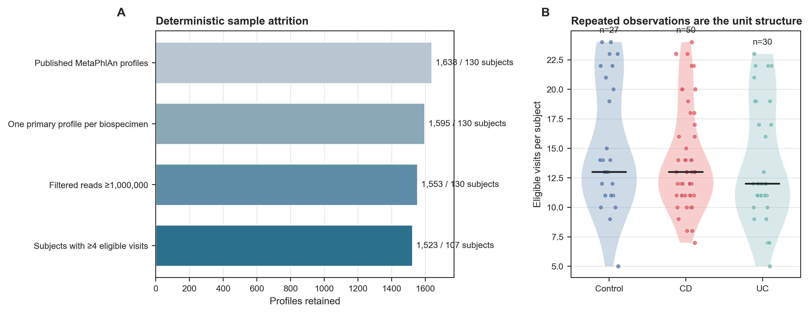
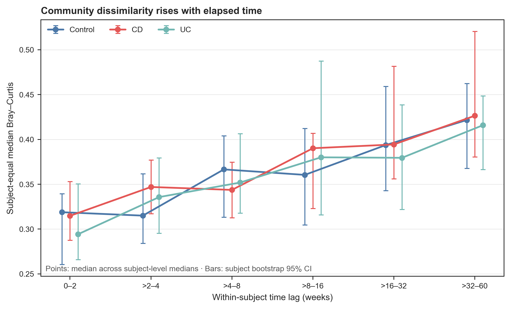
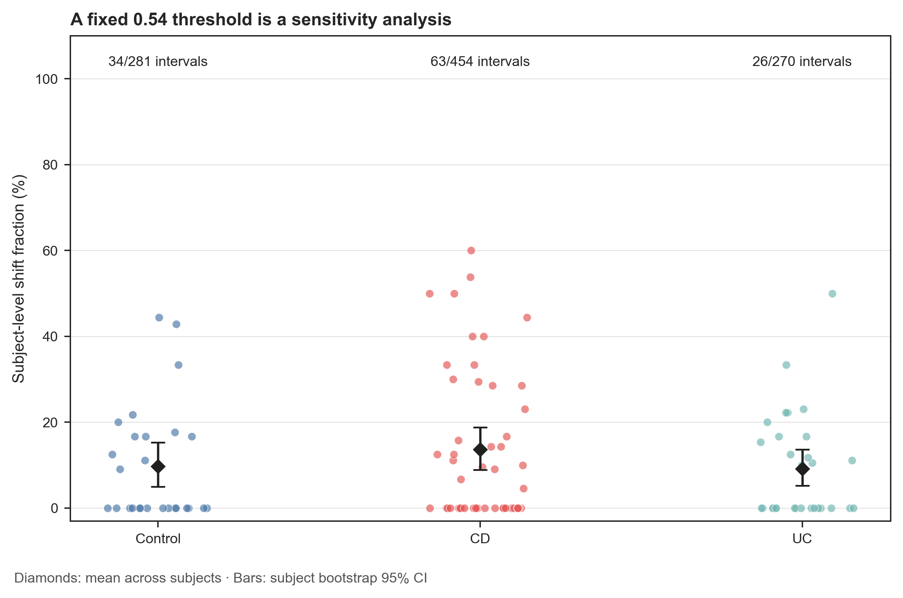
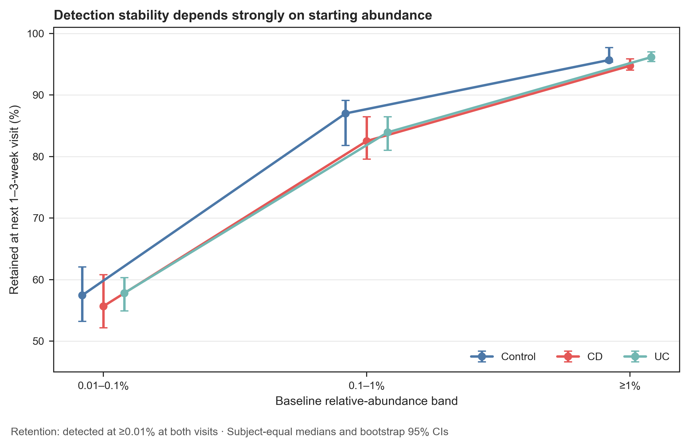
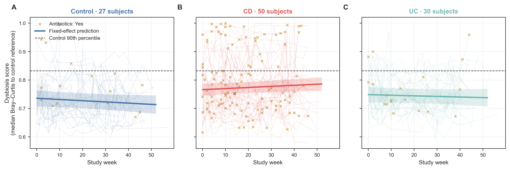
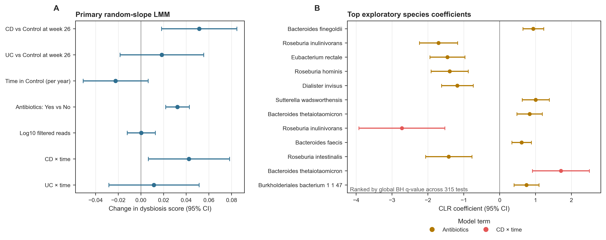
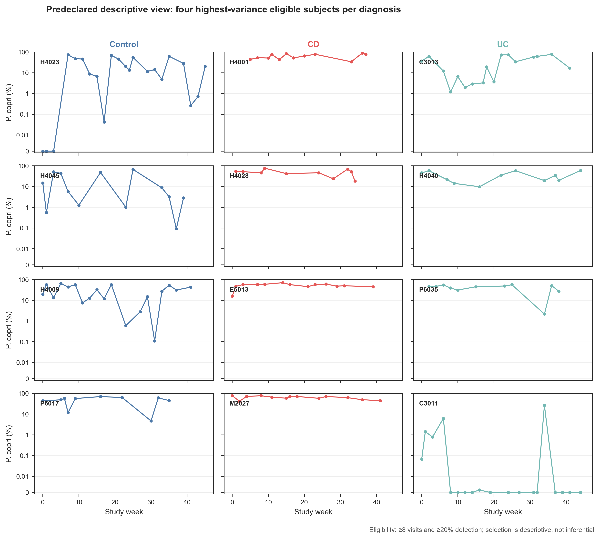

> **先给结论：**纵向设计的价值不是“样本数变多”，而是能把**人和人之间的差异**与**同一个人随时间的变化**分开。分析时必须把受试者作为聚类单位：轨迹图按人连线，效应模型至少有 subject random intercept（主体随机截距），时间趋势允许时再加 random slope（随机斜率），bootstrap 和交叉验证也按人重采样或切分。两次都检出某个物种，只能称为 detection stability（检出稳定），不能直接写成 permanent colonization（永久定植）。

这里使用 Lloyd-Price 等人 IBD Multi'omics Database（IBDMDB/HMP2）的官方 MetaPhlAn taxonomic profiles 与临床元数据 [@lloydprice2019multiomics]。公开产品含 1,638 个 profiles、130 名受试者；去除同一 biospecimen 的 43 个技术/处理重复，再施加 filtered reads ≥1,000,000 与每人至少 4 次合格随访的预设门槛，主分析保留 **1,523 个样本、107 名受试者**。

## 这一步对应论文里的哪张图 {#sec-target}

原研究 Figure 3 是本章的锚点：Figure 3a 比较不同时间间隔的 taxonomic Bray--Curtis dissimilarity，Figure 3b 展示稳定与 dysbiotic 时段的主要贡献物种，Figure 3c 追踪 *Prevotella copri* 的个体轨迹；后续面板把群落变化与其他组学层联系起来。论文主图使用 1,595 个独立 biospecimens、130 名受试者，并报告 CD 与 UC 中更多 dysbiotic periods [@lloydprice2019multiomics]。

{#fig-67-anchor}

本章先重建论文的分析骨架，再增加三个今天更应明确的契约：技术重复的确定性取舍、主体等权的不确定性、以及固定阈值 sensitivity analysis（敏感性分析）与论文原始 shift caller 的边界。

{#fig-67-sampling}

## 理论：纵向数据究竟多了什么信息 {#sec-theory}

### 1. 观测单位、实验单位与不确定性单位不是一回事

设受试者 $i$ 在时间 $t_{ij}$ 的群落指标为 $y_{ij}$。同一受试者的 $y_{i1},y_{i2},\ldots$ 共享遗传背景、长期饮食、生活环境和疾病史，通常满足：

$$
\operatorname{Cor}(y_{ij},y_{ik}) \neq 0, \qquad j\neq k.
$$

因此 1,523 次测量不能当作 1,523 个独立人。这里的层级是：

- **观测单位**：一次 stool metagenome；
- **聚类/实验单位**：受试者；
- **时间变化单位**：同一受试者相邻或成对的两次采样；
- **bootstrap 单位**：受试者，而非样本或物种。

若直接对 1,523 行做普通线性回归，standard error 往往过小，显著性被夸大；若先把每个人压成一个均值，又会丢掉时间信息。mixed-effects model（混合效应模型）在二者之间保留了正确层级 [@bates2015lme4; @kuznetsova2017lmertest]。

### 2. 随机截距回答“每个人基线不同”，随机斜率回答“每个人变化速度不同”

主模型写为：

$$
y_{ij}=\beta_0+\beta_1D_i+\beta_2t_{ij}+\beta_3D_i t_{ij}
+\beta_4A_{ij}+\beta_5Q_{ij}+b_{0i}+b_{1i}t_{ij}+\epsilon_{ij},
$$

其中 $D_i$ 是 diagnosis，$A_{ij}$ 是当次 antibiotics，$Q_{ij}$ 是中心化后的 $\log_{10}$ filtered reads；$b_{0i}$ 是主体随机截距，$b_{1i}$ 是主体时间随机斜率。时间以 week 26 为中心并换算成年，因此：

- diagnosis 主效应是**第 26 周**的组间差异，不是笼统的“疾病效应”；
- control 的时间系数是每年的变化；
- `Diagnosis × time` 是相对 control 的斜率差异；
- antibiotics 系数是同一模型条件下的 contemporaneous association（同期关联），不是药物因果效应。

random slope 需要每人有足够时间点，也可能出现 singular fit（奇异拟合）。这里用 maximum-likelihood likelihood-ratio test 比较随机截距与随机截距+斜率结构，再用 REML 拟合最终模型；主模型不奇异，随机斜率改进的 LRT $P=6.68\times10^{-12}$。

### 3. 不规则采样时间不能强行改成“第 1、2、3 次”

HMP2 的采样间隔并不完全相等。把 visit number 当连续时间会把 1 周和 8 周的间隔视为相同。这里始终使用真实 `week_num`：

- trajectory model 使用连续 study week；
- lag analysis 将所有正时间差分为 `0–2`, `>2–4`, `>4–8`, `>8–16`, `>16–32`, `>32–60` weeks；
- short-interval sensitivity analysis 只用间隔 1--3 周的相邻合格样本。

在每个 lag bin 内先对每位受试者的所有 pairwise distances 取中位数，再跨受试者取中位数和 subject bootstrap 95% CI。这样采样 24 次的人不会仅凭 pair 数量压过采样 5 次的人。

{#fig-67-lag}

### 4. “群落转换”必须先定义 estimand，再选择阈值

原论文依据 healthy reference distribution 与 time-lag relationship 识别 taxonomic shifts，并在扩展数据中讨论 2-week Bray--Curtis 约 0.54 的界限 [@lloydprice2019multiomics]。本章没有把固定 0.54 冒充原始 lag-dependent caller，而是预先声明一个更窄的问题：

$$
\text{Shift}_{ij}=I(1\le \Delta t_{ij}\le3 \ \text{weeks})
\times I(BC_{ij}>0.54).
$$

它只回答“在 1--3 周相邻样本中，超过固定 0.54 的比例是多少”。CD、UC 与 control 分别出现 63/454、26/270、34/281 个事件；图上的 diamonds 和 CI 均按受试者等权，不用 interval 数冒充独立样本。

{#fig-67-shifts}

### 5. 定植稳定性至少要区分 abundance、detection 与 strain identity

若物种在基线的相对丰度为 $p_{ijt}$，本章把 $p\ge10^{-4}$（0.01%）定义为 detected，并检查它在下一个 1--3 周样本是否仍达到同一门槛。结果主要由 baseline abundance 决定：

| Baseline abundance | Control | CD | UC |
|---|---:|---:|---:|
| 0.01--0.1% | 57.4% | 55.6% | 57.8% |
| 0.1--1% | 87.0% | 82.5% | 83.9% |
| ≥1% | 95.7% | 94.7% | 96.1% |

这说明低丰度物种更容易跨越 detection limit，却不能证明高丰度物种“永久定植”。物种层面连续检出仍可能是不同 strain；要主张 colonization，需要更长随访、strain-resolved SNV/haplotype 一致性、来源样本和传播方向证据 [@halfvarson2017dynamics]。

{#fig-67-retention}

## 准备工作 {#sec-preparation}

### 数据谱系、门槛与算力

| 对象 | 锁定内容 |
|---|---|
| Study | Lloyd-Price et al., Nature 2019；DOI `10.1038/s41586-019-1237-9`；PMCID `PMC6650278` |
| Cohort | IBDMDB/HMP2；CD、UC、non-IBD control；最多约 1 年随访 |
| Taxonomic profile | 官方 MGX merged product，release `2018-05-04`；SHA-256 `5728531...e72c` |
| Metadata | HMP2 metadata release `2018-08-20`；SHA-256 `656b7bd9...ec9` |
| Primary profile | 同一 `site_sub_coll` 内依次优先 non-`_TR`、`_P`、较高 filtered reads、字典序 SampleID |
| Eligibility | filtered reads ≥1,000,000；每位受试者 ≥4 个合格 primary profiles |
| Analysis | 572 个 terminal species rows，568 个曾检出；63 个物种进入探索性 LMM screen |
| Seeds | analysis/bootstrap `67001`；plot jitter `20260767`；bootstrap 2,000 次 |
| Independent unit | 107 名受试者；所有 CI、模型聚类与验证以 subject 为单位 |

预计耗时与资源如下：冻结结果复核需要约 **2 CPU、4 GB RAM、<3 分钟、<1 GB 磁盘**；从两个官方合并表重算距离矩阵与 63 个 mixed models 约需 **4 CPU、8 GB RAM、5--15 分钟、约 5 GB 临时空间**。从原始 FASTQ 重建 profile 建议 **8--16 CPU、32 GB RAM、100 GB 以上磁盘、数小时至数天**。下游问题通常不需要先重跑 1,638 个 FASTQ；先锁定官方 product release，只有方法比较或数据库升级才启动上游重算。

<details>
<summary><strong>安装依赖、下载真实数据，并内联统一作图函数</strong></summary>

```{bash}
#| eval: false
mamba env create -f env/multiomics-python.yml

Rscript -e 'install.packages(c(
  "ggplot2", "dplyr", "tidyr", "readr", "lme4", "lmerTest",
  "pbkrtest", "scales", "patchwork", "knitr"
))'

python scripts/download_article67_longitudinal_data.py \
  --cache-dir db/hmp2/article67
```

```{r}
set.seed(20260767)

pal_pub <- c("Control" = "#4C78A8", "CD" = "#E45756", "UC" = "#72B7B2")
scale_color_pub <- function(...) ggplot2::scale_color_manual(values = pal_pub, ...)
scale_fill_pub  <- function(...) ggplot2::scale_fill_manual(values = pal_pub, ...)
theme_pub <- function(base_size = 12) {
  ggplot2::theme_bw(base_size = base_size) + ggplot2::theme(
    panel.grid.minor = ggplot2::element_blank(),
    panel.grid.major = ggplot2::element_line(color = "#ECEFF1", linewidth = 0.3),
    axis.text = ggplot2::element_text(color = "black"),
    legend.key = ggplot2::element_blank(),
    strip.background = ggplot2::element_rect(fill = "#EDF2F4", color = NA),
    plot.title.position = "plot",
    plot.caption = ggplot2::element_text(color = "#455A64", hjust = 0)
  )
}
save_pub <- function(plot, file_base, width = 210, height = 150,
                     units = "mm", dpi = 350) {
  dir.create(dirname(file_base), recursive = TRUE, showWarnings = FALSE)
  ggplot2::ggsave(paste0(file_base, ".pdf"), plot, width = width,
                  height = height, units = units,
                  device = grDevices::cairo_pdf, bg = "white")
  ggplot2::ggsave(paste0(file_base, ".png"), plot, width = width,
                  height = height, units = units, dpi = dpi, bg = "white")
  ggplot2::ggsave(paste0(file_base, ".tiff"), plot, width = width,
                  height = height, units = units, dpi = dpi,
                  compression = "lzw", bg = "white")
  invisible(plot)
}
```

</details>

### 先验收 checksum、样本缩减与表结构

```{bash}
#| eval: false
FROZEN="$PWD/data/small/67-longitudinal-frozen"
sha256sum -c "$FROZEN/file-checksums.sha256"
column -ts $'\t' "$FROZEN/sample-attrition.tsv"
column -ts $'\t' "$FROZEN/dysbiosis-summary.tsv"
column -ts $'\t' "$FROZEN/primary-model-audit.tsv"
```

```{r}
frozen <- "data/small/67-longitudinal-frozen"
attrition <- read.delim(file.path(frozen, "sample-attrition.tsv"), check.names = FALSE)
samples <- read.delim(file.path(frozen, "sample-ledger.tsv"), check.names = FALSE)
knitr::kable(attrition, digits = 0, caption = "HMP2 profile 的确定性缩减")
stopifnot(nrow(samples) == 1523, length(unique(samples$SubjectID)) == 107)
```

## 可复制代码：从技术重复到主体随机斜率 {#sec-code}

### 第 1 步：确定性选择一个 biospecimen 的 primary profile

同一 `site_sub_coll` 可能有 `_TR` technical rerun、`_P` processing version 或其他重复。不能让文件系统顺序决定取舍，也不能事后挑“更符合预期”的 profile。下面的排序规则在查看结果前声明，并把所有入选/排除记录写入 ledger。

```{python}
#| eval: false
import numpy as np
import pandas as pd

profile = pd.read_csv("db/hmp2/article67/taxonomic_profiles.tsv.gz", sep="\t")
meta = pd.read_csv("db/hmp2/article67/hmp2-metadata.csv", low_memory=False)
sample_ids = profile.columns[1:].astype(str)

meta = meta.loc[
    meta["data_type"].eq("metagenomics") &
    meta["External ID"].astype(str).isin(sample_ids)
].copy()
meta["External ID"] = meta["External ID"].astype(str)
meta["TechnicalRerun"] = meta["External ID"].str.endswith("_TR")
meta["PreferredP"] = meta["External ID"].str.endswith("_P")

ranked = meta.sort_values(
    ["site_sub_coll", "TechnicalRerun", "PreferredP",
     "reads_filtered", "External ID"],
    ascending=[True, True, False, False, True]
)
ranked["SelectionRank"] = ranked.groupby("site_sub_coll").cumcount() + 1
primary = ranked.loc[ranked["SelectionRank"].eq(1)].copy()

depth_pass = primary.loc[primary["reads_filtered"].ge(1_000_000)].copy()
visits = depth_pass.groupby("Participant ID").size()
eligible = depth_pass.loc[
    depth_pass["Participant ID"].isin(visits[visits >= 4].index)
].copy()
assert (len(meta), len(primary), len(eligible)) == (1638, 1595, 1523)
```

这条规则先去掉 43 个 profile-level duplicates；测序深度门槛再去掉 42 个 profiles；最后有 23 名受试者因不足 4 次合格随访而整体退出，但其中只有 30 个已通过深度门槛的 profiles，所以最终是 1,523 个样本。完整 `profile-selection-ledger.tsv` 同时保留入选与排除行，不能只交最终矩阵。

### 第 2 步：只取 terminal species，并在样本内重归一化

MetaPhlAn 合并表同时包含 kingdom 到 strain 的层级行。若把 genus、species 与 strain 一起求距离，会重复计算同一 read evidence。这里选择含 `s__`、但不含 `t__` 的 terminal species rows；移除全队列从未检出的行后剩 568 个 species，并在这个明确的 feature universe 内重归一化。

```{python}
#| eval: false
taxon = profile["#SampleID"].astype(str)
keep = taxon.str.contains(r"(?:^|\|)s__", regex=True) & ~taxon.str.contains(
    r"\|t__", regex=True
)
species = profile.loc[keep].set_index("#SampleID")
species = species.loc[(species > 0).any(axis=1), eligible["External ID"]]
relative = species.T
relative = relative.div(relative.sum(axis=1), axis=0)
assert relative.shape == (1523, 568)
assert np.allclose(relative.sum(axis=1), 1.0)
```

这是原版 profile 的纵向再分析，不是用 MetaPhlAn 4 重跑的现代结果。若升级 taxonomy database，必须把新旧 profile 作为两个版本并行比较，不能静默覆盖。

### 第 3 步：构造可解释的 dysbiosis score

用 week ≥20 的 control samples 作为 reference pool（207 samples、26 subjects）。每个样本的 score 是它到 reference profiles 的 Bray--Curtis distance 中位数；若样本自身属于 reference pool，先删去 self-distance。dysbiotic threshold 定义为所有合格 control sample scores 的第 90 百分位，即 0.832358。

```{python}
#| eval: false
from scipy.spatial.distance import cdist

reference_ids = sample.loc[
    sample["Diagnosis"].eq("Control") & sample["Week"].ge(20), "SampleID"
]
distance = cdist(relative, relative.loc[reference_ids], metric="braycurtis")

scores = []
for row, sample_id in enumerate(relative.index):
    values = distance[row].copy()
    if sample_id in set(reference_ids):
        values[list(reference_ids).index(sample_id)] = np.nan
    scores.append(np.nanmedian(values))
sample["DysbiosisScore"] = scores
threshold = sample.loc[
    sample["Diagnosis"].eq("Control"), "DysbiosisScore"
].quantile(0.90)
sample["Dysbiotic"] = sample["DysbiosisScore"] > threshold
```

该 reference score 是透明、可复算的 reanalysis estimand，不声称逐位复原原论文的 dysbiosis classifier。主分析中 control、CD、UC 的 dysbiotic sample fraction 分别为 10.0%、25.5%、12.8%；这些是 sample fractions，不是“25.5% 的 CD 患者持续 dysbiotic”。

{#fig-67-dysbiosis}

### 第 4 步：拟合主模型，并验收随机效应结构

模型用 week 26 为中心、每 52 周为 1 单位。`Diagnosis` 以 control 为 reference；`Antibiotics` 以 No 为 reference。先固定 factor levels，避免不同机器因字母排序改变系数含义。

```{r}
Sys.setenv(TZ = "UTC")
set.seed(67001)
suppressPackageStartupMessages({
  library(lme4)
  library(lmerTest)
})

sample <- read.delim(
  "data/small/67-longitudinal-frozen/sample-ledger.tsv",
  check.names = FALSE
)
sample$Diagnosis <- factor(sample$Diagnosis, levels = c("Control", "CD", "UC"))
sample$Antibiotics <- factor(sample$Antibiotics, levels = c("No", "Yes"))
sample$SubjectID <- factor(sample$SubjectID)

control <- lmerControl(
  optimizer = "bobyqa", optCtrl = list(maxfun = 200000),
  check.conv.singular = "ignore"
)
model <- lmerTest::lmer(
  DysbiosisScore ~ Diagnosis * WeekYearCentered + Antibiotics +
    Log10ReadsCentered + (1 + WeekYearCentered | SubjectID),
  data = sample, REML = TRUE, control = control
)
stopifnot(!lme4::isSingular(model))

fixed <- as.data.frame(coef(summary(model)))
fixed$Term <- rownames(fixed)
fixed <- fixed[, c("Term", "Estimate", "Std. Error", "df", "Pr(>|t|)")]
knitr::kable(fixed, digits = 4, caption = "主体随机截距+时间随机斜率 LMM")
```

主模型的关键估计为：CD vs control at week 26 = 0.0514（95% CI 0.0182--0.0846，Satterthwaite $P=0.0030$）；antibiotics yes = 0.0322（95% CI 0.0218--0.0427，$P=1.97\times10^{-9}$）；CD × time = 0.0424/year（95% CI 0.0065--0.0783，$P=0.0228$）。Kenward--Roger Type III tests 对 diagnosis、antibiotics、diagnosis × time 给出 $P=0.00785$、$2.19\times10^{-9}$、0.0490。

这些结果描述在当前模型、reference score 和完整病例规则下的关联。antibiotics 可能是疾病活动、住院或其他治疗的 marker；没有 treatment initiation、适应证与 time-varying confounder 设计时，不写成“抗生素导致 dysbiosis”。

### 第 5 步：按主体等权计算 lag、shift 与 retention

```{python}
#| eval: false
from numpy.random import default_rng

rng = default_rng(67001)
lag_bins = [-np.inf, 2, 4, 8, 16, 32, 60]
lag_labels = ["0–2", ">2–4", ">4–8", ">8–16", ">16–32", ">32–60"]

# pairs: 同一受试者所有正时间差的样本对
pairs["LagBin"] = pd.cut(
    pairs["LagWeeks"], bins=lag_bins, labels=lag_labels, right=True
)
subject_lag = (
    pairs.groupby(["SubjectID", "Diagnosis", "LagBin"], observed=True)
    ["BrayCurtis"].median().reset_index()
)

def subject_bootstrap(values, iterations=2000):
    values = np.asarray(values, dtype=float)
    draws = np.array([
        np.median(rng.choice(values, size=len(values), replace=True))
        for _ in range(iterations)
    ])
    return np.median(values), *np.quantile(draws, [0.025, 0.975])

# consecutive: 同一受试者按真实 week 排序后的相邻合格样本
short = consecutive.loc[consecutive["LagWeeks"].between(1, 3)].copy()
short["Shift054"] = short["BrayCurtis"] > 0.54
subject_shift = short.groupby(["SubjectID", "Diagnosis"])["Shift054"].mean()

# 每人、每个 baseline abundance band 先汇总 retained/detected，
# 再跨人求中位数和 subject bootstrap CI。
```

### 第 6 步：物种层 screen 使用 CLR、随机截距与两层 FDR

先用全体样本预筛 prevalence ≥20% 且 mean relative abundance ≥0.1%，得到 63 个物种；加入固定 pseudocount $10^{-6}$ 后在**这 63 个物种构成的子组合**内做 closure 和 CLR。每个物种拟合：

```{r}
#| eval: false
FeatureCLR ~ Diagnosis * WeekYearCentered + Antibiotics +
  Log10ReadsCentered + (1 | SubjectID)
```

预先只提取 `DiagnosisCD`、`DiagnosisUC`、`AntibioticsYes`、`CD × time`、`UC × time` 五类系数，共 315 个 tests。`QValueWithinTerm` 回答同一 biological contrast 下的 63-feature screen；`QValueGlobal` 对 315 个结果一起做 Benjamini--Hochberg，更保守。63 个模型均收敛、均不奇异；图只展示 global q-value 最小的 12 个系数，不能只报图中结果而隐藏完整表。

{#fig-67-effects}

### 第 7 步：*P. copri* 轨迹只作预声明的描述性视图

为了对应原论文 Figure 3c，先要求每人 ≥8 个合格 visits 且 *P. copri* detection prevalence ≥20%，再在每个 diagnosis 内按 subject-level standard deviation 选前 4 名。这个选择会刻意突出高变异轨迹，因此不得对选中者再做显著性检验，也不得把它当作全队列典型模式。

{#fig-67-pcopri}

## 审计与升级 {#sec-audit}

### 忠实保留了什么

- 使用 HMP2 原版 MGX taxonomic product 与 2018-08-20 metadata，不用现代 MetaPhlAn 重跑静默替换原结果；
- 保留论文 Figure 3 的核心问题：时间间隔与 Bray--Curtis、dysbiotic periods、*P. copri* individual trajectories；
- profile-level 原始规模 1,638、biospecimen-level 规模 1,595 与 subject count 130 都与公开数据契约一致；
- diagnosis 只重编码图内英文：`nonIBD → Control`，不改变原 metadata；
- 固定 0.54 明确标为 sensitivity analysis，不称为论文原 shift caller。

### 今天应当补上的升级

1. **技术重复 ledger。** `_TR`、`_P` 与其他重复的取舍写成确定性排序，43 个排除 profile 仍保留原因。
2. **read-depth 与 visit gate。** 主模型只用 filtered reads ≥1,000,000 且每人 ≥4 次合格 visits 的 1,523 行；原论文 1,595 行结果作为外部锚点，不把两个 estimand 混在一起。
3. **主体等权。** pairwise lag 先在受试者内取中位数；CI 在 107 个 subject clusters 上 bootstrap。
4. **随机斜率验收。** 报告 singular status、optimizer gradient、random-effect variance，并用 ML 比较随机效应结构；固定效应用 REML + Kenward--Roger/Satterthwaite。
5. **composition-aware screen。** 物种筛选、pseudocount、CLR universe 和 315-test global BH 全部预先记录 [@gloor2017compositional]。
6. **时间变化混杂边界。** antibiotics 是同期暴露记录；没有 marginal structural model、time-varying propensity weights 或 target trial 时只报告关联。
7. **missingness sensitivity。** 正式投稿应补充：≥3/≥5 visits、0.5M/2M reads、complete-case vs inverse-probability-of-observation weighting、仅规则采样窗口等敏感性分析。

::: {.callout-important title="先定义 estimand，再决定用 LMM、GAMM 还是 survival model"}
LMM 适合连续结局的平均轨迹；非线性轨迹可用 spline/GAMM；“首次 dysbiosis 的时间”是 interval-censored time-to-event；“一次事件后是否恢复”可能需要 multi-state model。模型名称不能替代问题定义。
:::

## 出版级美化 {#sec-publication}

纵向图最容易被线条淹没。可投稿图遵循五点：

- 一人一条细线，alpha 0.1--0.2；总体 fixed-effect prediction 用粗线和 95% CI band；
- diagnosis 使用色盲友好蓝/朱红/青绿，antibiotics 用形状 `x`，不再新增相似颜色；
- 横轴始终写 `Study week` 或 `Within-subject time lag (weeks)`，不用模糊的 `Visit`；
- abundance 跨多个数量级时，0 与正值必须明确处理；*P. copri* 图用 symlog，而不是把 0 偷换成任意小数；
- 主图导出 vector PDF，同时交 350 dpi PNG 和 LZW TIFF；轴、图例、注释全部英文。

```{r}
#| eval: false
p <- ggplot2::ggplot(
  samples,
  ggplot2::aes(Week, DysbiosisScore, group = SubjectID, color = Diagnosis)
) +
  ggplot2::geom_line(alpha = 0.15, linewidth = 0.35) +
  ggplot2::geom_hline(yintercept = 0.832358, linetype = 2) +
  ggplot2::facet_wrap(~Diagnosis, nrow = 1) +
  scale_color_pub() +
  ggplot2::labs(x = "Study week", y = "Dysbiosis score", color = "Diagnosis") +
  theme_pub()

save_pub(p, "figures/67-dysbiosis-trajectories-r", width = 260, height = 95)
```

## 常见坑 {#sec-pitfalls}

::: {.callout-caution title="坑 1：把每次采样都当独立样本"}
普通 t test、Wilcoxon、PERMANOVA 或 bootstrap 若忽略 subject cluster，会产生伪重复。至少按人聚类；训练/测试切分也必须保证同一人的所有时间点只在一侧。
:::

::: {.callout-caution title="坑 2：先看轨迹，再挑最‘戏剧化’的人做检验"}
按方差选出的 *P. copri* 轨迹是描述性展示。若再在这些人上检验变化，属于 double dipping。推断必须回到预声明的全队列模型或独立验证集。
:::

::: {.callout-caution title="坑 3：把采样序号当真实时间"}
第 3 次到第 4 次可能隔 1 周，也可能隔 10 周。用真实日期或 week；若日期只精确到区间，应考虑 interval censoring，而不是伪造一个精确时间点。
:::

::: {.callout-caution title="坑 4：固定 shift threshold 却不说明适用时间窗"}
Bray--Curtis 随时间间隔增大。0.54 在 2 周和 40 周的含义不同；固定阈值只能在声明的 1--3 周窗口内解释，并与 lag-dependent threshold 做敏感性比较。
:::

::: {.callout-caution title="坑 5：连续检出就写成定植"}
物种层连续检出可能来自 detection limit、重复暴露或不同 strains。colonization/transmission 需要 strain-resolved identity、来源与方向证据；“retained detection”是更准确的结果词。
:::

::: {.callout-caution title="坑 6：随机斜率越复杂越好"}
时间点少、时间跨度窄或 slope variance 接近 0 时，模型可能 singular。报告 `isSingular()`、variance、gradient 与简化模型比较；不能只删 warning 后继续解释。
:::

::: {.callout-warning title="审稿人会追问：退出随访是否与疾病活动相关？"}
≥4 visits gate 可能选择更依从或病情更稳定的人。正文应给 attrition by diagnosis、退出时间和 missingness pattern；若缺失依赖既往结局或治疗，补 inverse-probability-of-observation weighting 或 joint model sensitivity analysis。
:::

## 这段 Methods 怎么写 {#sec-methods}

> **Longitudinal metagenomic analysis.** Published HMP2/IBDMDB metagenomic taxonomic profiles (MGX merged-product release 2018-05-04) and metadata (release 2018-08-20) were obtained from Lloyd-Price et al. (Nature 2019; DOI: 10.1038/s41586-019-1237-9). Profile and metadata SHA-256 digests were `5728531a...e72c` and `656b7bd9...ec9`, respectively. Within each biospecimen identifier (`site_sub_coll`), a single profile was selected deterministically by preferring non-technical-rerun columns, `_P` profiles, greater filtered-read count, and then lexicographic sample identifier. Samples with fewer than 1,000,000 filtered reads were excluded, and participants were required to contribute at least four eligible visits. The final analysis included 1,523 samples from 107 participants (27 controls, 50 with Crohn's disease, and 30 with ulcerative colitis). Terminal species-level MetaPhlAn rows were retained and renormalized within sample. A dysbiosis score was defined as the median Bray--Curtis distance to control profiles collected at week 20 or later, excluding self-distances; the 90th percentile of eligible control scores defined the descriptive dysbiosis threshold. The primary linear mixed-effects model included diagnosis, centered study time, their interaction, contemporaneous antibiotic exposure, centered log10 filtered reads, and participant-specific random intercepts and time slopes. The model was fitted by REML using R 4.4.1, lme4 1.1-35.4, lmerTest 3.1-3, and pbkrtest 0.5.2; fixed-effect tests used Satterthwaite or Kenward--Roger degrees of freedom as specified. Lag, shift, and retention summaries were first aggregated within participant. Ninety-five percent confidence intervals were estimated with 2,000 participant-level bootstrap replicates using seed 67001. Species-level exploratory models were restricted to species with prevalence ≥20% and mean relative abundance ≥0.1%, used a fixed $10^{-6}$ pseudocount and CLR transformation, and controlled false discovery using Benjamini--Hochberg adjustment both within term and across all 315 predeclared coefficients.

> **Results template.** After deterministic technical-replicate resolution and eligibility filtering, 1,523 metagenomic profiles from 107 participants were analysed. At study week 26, the dysbiosis score was 0.0514 units higher in Crohn's disease than in controls (95% CI 0.0182--0.0846; Satterthwaite $P=0.0030$). Contemporaneous antibiotic exposure was associated with a 0.0322-unit higher score (95% CI 0.0218--0.0427; $P=1.97\times10^{-9}$), and the Crohn's-disease time slope differed from the control slope by 0.0424 units per year (95% CI 0.0065--0.0783; $P=0.0228$). These estimates describe within-cohort longitudinal associations and were not interpreted as antibiotic treatment effects or causal disease mechanisms.

## 换成你自己的数据怎么做 {#sec-own-data}

最少需要三张表，而且 key 必须显式：

1. `feature_table.tsv`：rows = samples，columns = species/MAG/pathways；说明 raw count、relative abundance 还是 coverage；
2. `metadata.tsv`：`SampleID`, `SubjectID`, `CollectionDate` 或连续 `Time`, `Group`，以及 antibiotics、diet、treatment、batch 等时间变化协变量；
3. `sample_lineage.tsv`：原始文件、biospecimen、技术重复、测序批次、profile/database 版本与排除原因。

替换时按这个顺序：

```text
Lock IDs and timestamps
  → resolve technical replicates before viewing outcomes
  → draw visit-count, interval and missingness maps
  → define outcome and reference population
  → choose random-effect structure from the estimand
  → aggregate/resample/split by subject
  → run abundance/detection/lag sensitivities
  → reserve strain identity for colonization claims
```

若研究是 intervention，额外需要 treatment start/stop、dose、indication、adherence 与 time-varying disease activity；若研究 transplant/colonization，额外需要 donor/source strain profiles 和 pre-exposure baseline。只有 treatment 前后两个时间点时，复杂 random slope 通常不可识别，应优先报告 change score 或 group × time 模型，并把个体轨迹和 missing pairs 全部画出。

完整复算命令如下；analysis seed `67001` 与 plot seed `20260767` 已固定：

```{bash}
#| eval: false
python scripts/download_article67_longitudinal_data.py \
  --cache-dir .tutorial_runs/article67-source

python scripts/prepare_article67_longitudinal.py \
  --cache-dir .tutorial_runs/article67-source \
  --output-dir .tutorial_runs/article67-work \
  --bootstrap-iterations 2000

R_LIBS_USER=.r-lib Rscript scripts/run_article67_longitudinal_models.R \
  --input-dir .tutorial_runs/article67-work \
  --output-dir .tutorial_runs/article67-work

MPLCONFIGDIR=/tmp/article67-mpl \
python scripts/plot_article67_longitudinal.py \
  --input-dir data/small/67-longitudinal-frozen \
  --figure-dir figures
```

## 参考 {#sec-references}

- HMP2/IBDMDB 纵向多组学设计、Figure 3 与官方产品：[@lloydprice2019multiomics]
- IBD 肠道菌群长期个体动态与稳定性：[@halfvarson2017dynamics]
- 线性混合模型实现与固定效应检验：[@bates2015lme4; @kuznetsova2017lmertest]
- 微生物组 compositional data 的解释边界：[@gloor2017compositional]
