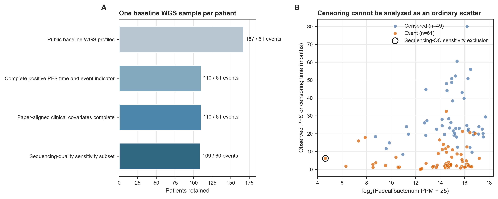
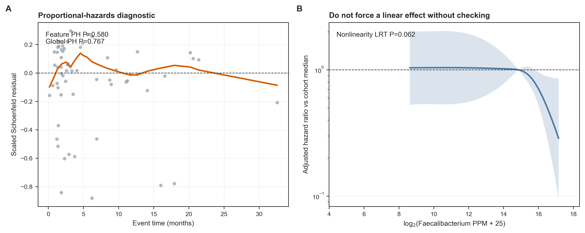
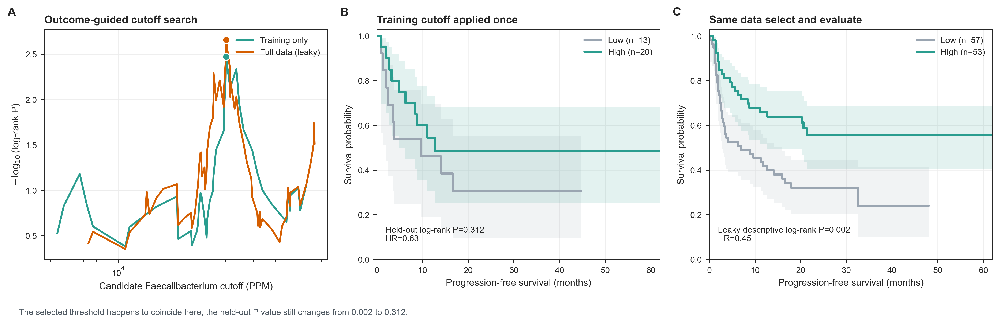
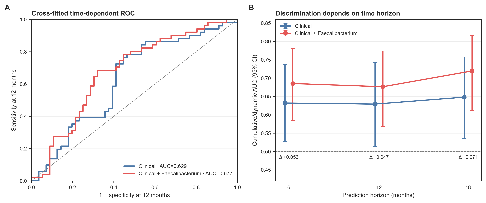
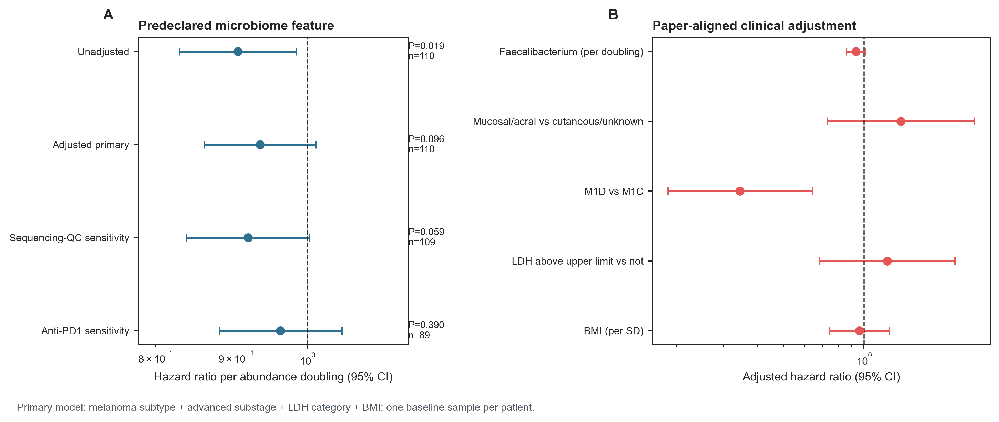
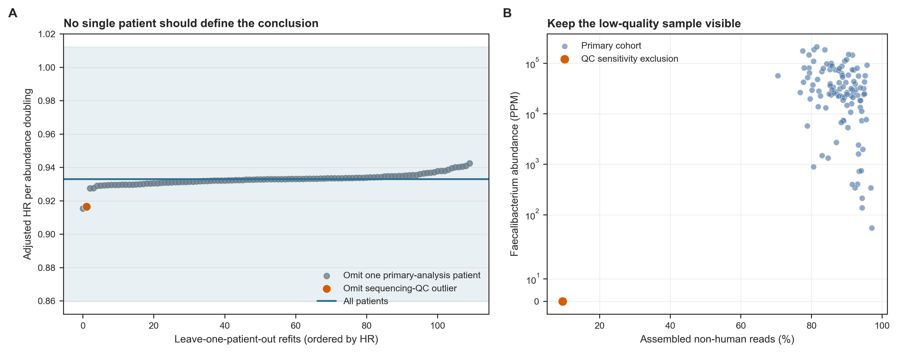
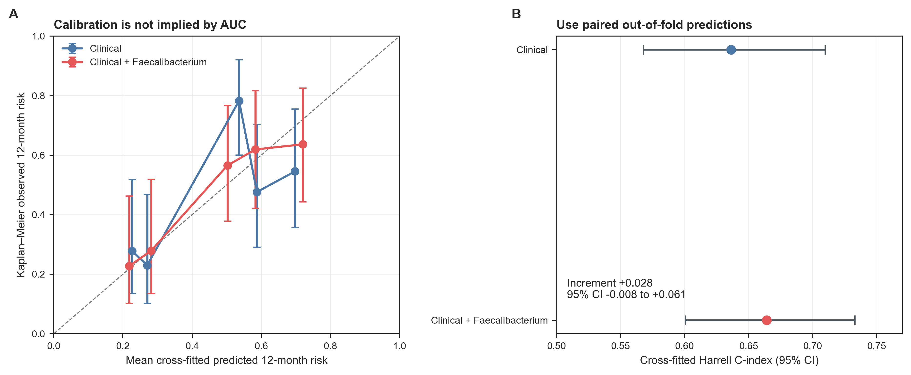

> **先给结论：**生存分析的主结果应当是**连续微生物特征的效应量与置信区间**，而不是先扫描几十个 cutoff，再把最显著的 Kaplan--Meier 曲线当作发现。Spencer 队列中，*Faecalibacterium* 每增加 1 个 $log_2$ 单位，未校正 Cox 的风险比为 0.903（95% CI 0.828--0.984，$P=0.019$）；按论文预设的临床变量校正后，风险比变为 0.933（0.860--1.012，$P=0.096$）。这个结果支持“值得外部验证”，不支持“已经得到独立预后标志物”。

> **换成自己的队列前，你还需要额外数据：**每位受试者的 **PFS/OS 随访时间**、明确的**结局指示变量**（event=1，right-censored=0）、统一的时间起点、最后随访日期或结局日期，以及治疗、疾病分期、实验批次等先验混杂因素。只有横断面微生物谱和“有病/没病”标签，不能补算生存结局。

本章使用 Spencer 等人的黑色素瘤免疫治疗队列：每位患者在治疗基线有一个 stool whole-genome shotgun（WGS）样本，公开工作簿同时提供 Last Known Taxon（LKT）PPM 谱和部分患者的 progression-free survival（PFS）信息 [@spencer2021dietary]。167 个公开 WGS profiles 中，110 个同时具有正的 PFS 时间和 0/1 结局，发生进展或死亡 61 例，右删失 49 例。

## 这一步对应论文里的哪张图 {#sec-target}

原研究 Figure 3A 是本章的生存图锚点：在 128 位接受 immune checkpoint blockade（ICB）的患者中，作者按问卷估计的日均膳食纤维是否达到 20 g 分组，Kaplan--Meier log-rank $P=0.047$；Figure 3B 又联合纤维与 probiotic supplement 状态。论文表 1 报告每增加 5 g/day 纤维，校正后进展或死亡风险下降约 30% [@spencer2021dietary]。

{#fig-68-anchor}

公开 WGS 工作簿不是 Figure 3A 全部 128 人的临床分析表：它有 167 个基线 WGS 样本，但只有 110 人具备 PFS time/event。因此下面不声称逐位复原论文的 128 人纤维模型，而是在**真实 WGS 与真实 PFS 的交集**上复现生存分析骨架，并把论文同时强调的 *Faecalibacterium* 作为预先指定的微生物特征。这个区别必须写进数据谱系和 Methods，不能用相近曲线掩盖样本集合变化。

{#fig-68-design}

## 理论：生存时间不是普通连续变量 {#sec-theory}

### 1. 删失意味着“尚未观察到”，不是“没有事件”

令 $T_i$ 为真实事件时间，$C_i$ 为最后可观察时间。数据中实际看到的是：

$$
Y_i=\min(T_i,C_i),\qquad \delta_i=I(T_i\le C_i).
$$

当 $\delta_i=0$ 时，只知道 $T_i>Y_i$；把这类患者写成“未进展组”，再用 t-test 或 logistic regression，会丢掉随访长短。Kaplan--Meier estimator 用风险集处理右删失，Cox proportional hazards model 则比较在仍处于风险集的人中，某个时点发生事件的瞬时风险 [@cox1972regression]。

本章 PFS 起点是 treatment start，事件是 progression or death，删失点是 last vital assessment。三者必须来自同一个临床定义；若有人从取样日算起、有人从治疗日算起，会引入 immortal-time 或 time-origin bias。

### 2. Cox 回答相对风险，不直接给“多活几个月”

Cox 模型写为：

$$
h(t\mid X)=h_0(t)\exp(\beta_1X_1+\cdots+\beta_pX_p).
$$

若 $X_1=\log_2(\textit{Faecalibacterium PPM}+25)$，则 $\exp(\beta_1)$ 表示在其余变量相同的条件下，`PPM + 25` 每翻倍对应的 hazard ratio（HR）。HR 小于 1 是较低瞬时风险，不等于“PFS 延长固定月数”，也不保证所有时点的绝对风险差相同。

本章的 clinical adjustment set 对齐原论文表 1：melanoma primary subtype、advanced substage、LDH category 与 BMI。它在看生存结果前固定，不采用“单因素 $P<0.05$ 才纳入”的逐步筛选。

### 3. 比例风险是假设，不是软件默认替你证明的事实

Cox 的核心约束是：

$$
\frac{h(t\mid X+1)}{h(t\mid X)}=\exp(\beta),
$$

这个比值在随访期内近似不随时间改变。用 scaled Schoenfeld residuals 检查残差是否随时间呈系统趋势；本队列中 *Faecalibacterium* 的检验 $P=0.580$，全模型 global $P=0.767$，没有发现明显违反，但小样本下“未拒绝”并不等于假设已被证明 [@grambsch1994proportional]。

还要检查连续变量的 functional form。三自由度 natural spline 与线性项的 likelihood-ratio test 为 $P=0.062$；边界处置信区间很宽，提醒我们不要把低丰度端的曲率解读成生物阈值。

{#fig-68-assumptions}

### 4. cutoff 数据泄漏为什么能制造漂亮曲线

若候选 cutoff 集合为 $c_1,\ldots,c_K$，在全队列中选择：

$$
c^*=\arg\min_{c_k}P_{\text{log-rank}}(c_k),
$$

再在同一批患者上报告 $P_{\text{log-rank}}(c^*)$，这个 P 值没有为“扫描了 $K$ 次”付出代价。它同时承担了**选模型**和**验模型**两种角色，通常过度乐观；maximally selected rank statistic 也需要专门校正 [@hothorn2003maximally]。

本章用 seed `68001` 在 event × substage 内分层，固定 77 人训练集、33 人测试集。cutoff 只在训练集 20%--80% 分位区间搜索，且每组至少 15% 或 10 人；选中 30,209 PPM 后原样应用到测试集。恰好全队列扫描也选中同一数值，但结论完全不同：

- 训练集 log-rank $P=0.003$；
- 独立测试集 log-rank $P=0.312$，HR 0.63（95% CI 0.26--1.55）；
- 若用全队列同时选和评，表面上得到 $P=0.002$。

数值碰巧相同不消除泄漏；决定证据等级的是**谁参与了 cutoff 选择**。

{#fig-68-cutoff}

### 5. 普通 ROC 忽略随访时间，时间依赖 ROC 才匹配问题

“12 个月内进展”既包含 12 个月前的事件，也包含 12 个月前已失访、无法判定状态的人。cumulative/dynamic ROC 以 $T\le t$ 的病例与 $T>t$ 的动态对照定义 sensitivity/specificity，并用 inverse probability of censoring weighting（IPCW）处理删失 [@heagerty2000timedependent]。

为了不让同一患者参与自己预测模型的训练，本章做 20 次 event-stratified five-fold cross-fitting；每位患者每次恰好获得一个 out-of-fold prediction，最后跨重复取均值。内部验证结果为：

| Metric | Clinical | Clinical + *Faecalibacterium* | Paired increment (95% CI) |
|---|---:|---:|---:|
| Harrell C | 0.636 | 0.664 | 0.028 (−0.008, 0.061) |
| 6-month AUC | 0.632 | 0.685 | 0.053 (0.002, 0.102) |
| 12-month AUC | 0.629 | 0.677 | 0.047 (−0.001, 0.094) |
| 18-month AUC | 0.648 | 0.720 | 0.071 (0.023, 0.119) |

这些区间来自对**已经产生的交叉拟合预测**做 1,000 次患者级 paired bootstrap，反映评价样本的不确定性，但没有重新执行完整模型开发流程；它们不替代外部队列验证，也可能低估重新开发模型的总不确定性。

{#fig-68-roc}

## 准备工作 {#sec-preparation}

### 数据谱系、变量合同与资源

| 对象 | 锁定内容 |
|---|---|
| Study | Spencer et al., *Science* 2021；DOI `10.1126/science.aaz7015`；PMCID `PMC8970537` |
| Raw reads | NCBI BioProject `PRJNA770295` |
| Analysis repository | `mda-primetr/Spencer_et_al_2021`，commit `a95b1a...b7d15` |
| Public workbook | 22,718,390 bytes；SHA-256 `4fa93751...0968` |
| Taxon table | 225 filtered LKT features × 167 baseline samples；relative abundance in PPM |
| Survival cohort | 110 patients；61 events；49 right-censored |
| Primary feature | 3 个 `Genus == g__Faecalibacterium` LKT rows 的 PPM 之和 |
| Transform | $\log_2(\text{PPM}+25)$；25 是公开表 50 PPM feature gate 的一半 |
| Clinical adjustment | primary subtype + advanced substage + LDH category + BMI z-score |
| Seeds | analysis/split `68001`；plot jitter `20260768`；bootstrap 1,000 次 |
| Independent unit | patient；每位患者仅一个 baseline WGS sample |

公开工作簿的 LKT features 已经经过“在至少 5% 样本中大于 50 PPM”的全表过滤；它不是 raw read count，也不是 MetaPhlAn 4 species table。所有解释都应限定为这套 JAMS LKT PPM feature universe。

冻结结果复核约需 **2 CPU、4 GB RAM、<2 分钟、<500 MB 磁盘**；从 22.7 MB Excel 工作簿重新整理并拟合约需 **2 CPU、8 GB RAM、2--5 分钟**。若从 `PRJNA770295` FASTQ 重建装配型 JAMS 谱，建议 **8--16 CPU、32 GB 以上 RAM、200 GB 以上磁盘、数小时至数天**。生存统计并不要求为了形式完整先重跑 FASTQ；应先固定公开谱版本，方法升级时再并行保留新旧结果。

<details>
<summary><strong>安装依赖、下载真实数据，并内联统一作图函数</strong></summary>

```{bash}
#| eval: false
mamba env create -f env/multiomics-python.yml

Rscript -e 'install.packages(c(
  "survival", "timeROC", "jsonlite", "ggplot2",
  "dplyr", "readr", "knitr"
))'

python scripts/download_article68_survival_data.py \
  --cache-dir db/spencer/article68
```

```{r}
set.seed(20260768)

pal_pub <- c(
  "Clinical" = "#4C78A8",
  "Clinical + Faecalibacterium" = "#E45756",
  "Low" = "#9AA5B1",
  "High" = "#2A9D8F"
)
scale_color_pub <- function(...) ggplot2::scale_color_manual(values = pal_pub, ...)
scale_fill_pub  <- function(...) ggplot2::scale_fill_manual(values = pal_pub, ...)
theme_pub <- function(base_size = 12) {
  ggplot2::theme_bw(base_size = base_size) + ggplot2::theme(
    panel.grid.minor = ggplot2::element_blank(),
    panel.grid.major = ggplot2::element_line(color = "#ECEFF1", linewidth = 0.3),
    axis.text = ggplot2::element_text(color = "black"),
    legend.key = ggplot2::element_blank(),
    strip.background = ggplot2::element_rect(fill = "#EDF2F4", color = NA),
    plot.title.position = "plot",
    plot.caption = ggplot2::element_text(color = "#455A64", hjust = 0)
  )
}
save_pub <- function(plot, file_base, width = 210, height = 150,
                     units = "mm", dpi = 350) {
  dir.create(dirname(file_base), recursive = TRUE, showWarnings = FALSE)
  ggplot2::ggsave(paste0(file_base, ".pdf"), plot, width = width,
                  height = height, units = units,
                  device = grDevices::cairo_pdf, bg = "white")
  ggplot2::ggsave(paste0(file_base, ".png"), plot, width = width,
                  height = height, units = units, dpi = dpi, bg = "white")
  ggplot2::ggsave(paste0(file_base, ".tiff"), plot, width = width,
                  height = height, units = units, dpi = dpi,
                  compression = "lzw", bg = "white")
  invisible(plot)
}
```

</details>

### 先验收 checksum、样本缩减与结局定义

```{bash}
#| eval: false
FROZEN="$PWD/data/small/68-survival-frozen"
sha256sum -c "$FROZEN/file-checksums.sha256"
column -ts $'\t' "$FROZEN/cohort-attrition.tsv"
column -ts $'\t' "$FROZEN/cutoff-evaluation.tsv"
column -ts $'\t' "$FROZEN/cv-performance-summary.tsv"
```

```{r}
frozen <- "data/small/68-survival-frozen"
attrition <- read.delim(file.path(frozen, "cohort-attrition.tsv"), check.names = FALSE)
cohort <- read.delim(file.path(frozen, "survival-cohort.tsv"), check.names = FALSE)
cohort$QualitySensitivityPass <-
  tolower(as.character(cohort$QualitySensitivityPass)) == "true"

stopifnot(
  nrow(cohort) == 110,
  length(unique(cohort$SampleID)) == 110,
  sum(cohort$Event) == 61,
  all(cohort$PFS_days > 0),
  all(cohort$Event %in% c(0, 1))
)
knitr::kable(attrition, caption = "公开 WGS 到 PFS 主分析队列")
```

## 可复制代码：从 LKT PPM 到无泄漏 PFS 评估 {#sec-code}

### 第 1 步：从公开谱表确定性汇总预设属

不能从一个已经整理好的“risk score”直接起步，却不说明它由哪些行构成。冻结包保留了 225 × 110 的真实 LKT PPM 子表和完整 taxonomy map；下面从 `Genus` 字段选择三个 *Faecalibacterium* LKT rows，逐样本求和并与分析表核对。

```{r}
lkt <- read.delim(
  gzfile(file.path(frozen, "lkt-survival-ppm.tsv.gz")),
  check.names = FALSE
)
taxonomy <- read.delim(
  file.path(frozen, "lkt-feature-map.tsv"),
  check.names = FALSE
)

faec_ids <- taxonomy$LKTFeature[taxonomy$Genus == "g__Faecalibacterium"]
stopifnot(length(faec_ids) == 3)

lkt_matrix <- as.matrix(lkt[, setdiff(names(lkt), "LKTFeature")])
rownames(lkt_matrix) <- lkt$LKTFeature
faec_ppm <- colSums(lkt_matrix[faec_ids, , drop = FALSE])
faec_ppm <- faec_ppm[cohort$SampleID]

stopifnot(all.equal(
  unname(faec_ppm), cohort$FaecalibacteriumPPM,
  tolerance = 1e-12
))
cohort$FaecalibacteriumLog2 <- log2(faec_ppm + 25)
```

在 110 人中有 109 人的聚合 PPM 大于 0。25 PPM pseudocount 只负责让零值可取对数；它不是 detection limit，也不能被解释为真实丰度。若不同工具输出的是 relative abundance、CPM 或 read counts，必须重新定义伪计数，不能照抄 25。

### 第 2 步：连续效应先行，并把临床校正集写死

```{r}
suppressPackageStartupMessages(library(survival))
set.seed(68001)

cohort$PrimarySubtype <- factor(
  cohort$PrimarySubtype,
  levels = c("Cutaneous_or_unknown", "Mucosal_or_acral")
)
cohort$AdvancedSubstage <- factor(
  cohort$AdvancedSubstage,
  levels = c("Stage_M1C", "Stage_M1D")
)
cohort$LDH <- factor(cohort$LDH, levels = c("No", "Yes"))
cohort$BMIz <- as.numeric(scale(cohort$BMI))

fit_unadjusted <- coxph(
  Surv(PFS_days, Event) ~ FaecalibacteriumLog2,
  data = cohort, x = TRUE, y = TRUE
)
fit_adjusted <- coxph(
  Surv(PFS_days, Event) ~ FaecalibacteriumLog2 +
    PrimarySubtype + AdvancedSubstage + LDH + BMIz,
  data = cohort, x = TRUE, y = TRUE
)

summary(fit_adjusted)$conf.int
```

主变量的四个预设模型并排如下。`Sequencing-QC sensitivity` 只排除 `Gb non-human <0.5` 或 assembled fraction <50% 的样本；本数据恰好只有一位。主模型仍保留该患者，避免看到结果后才把极端点删除。

```{r}
cox_results <- read.delim(
  file.path(frozen, "cox-model-estimates.tsv"),
  check.names = FALSE
)
faec_results <- subset(
  cox_results,
  Term == "FaecalibacteriumLog2",
  select = c(Model, Cohort, N, Events, HazardRatio, CILower, CIUpper, PValue)
)
knitr::kable(faec_results, digits = 3,
             caption = "Faecalibacterium 每翻倍的 Cox 风险比")
```

{#fig-68-cox}

未校正 $P=0.019$，校正后 $P=0.096$；clinical-only 与 clinical + microbiome 的 likelihood-ratio test 为 $P=0.109$。这不是“校正把真实信号抹掉”，而是提醒 subtype、substage、LDH、BMI 与微生物丰度/结局之间可能共享信息，独立增量尚不确定。

### 第 3 步：审计比例风险、非线性与单点影响

```{r}
ph <- cox.zph(fit_adjusted, transform = "km")
print(ph)

ph_table <- read.delim(
  file.path(frozen, "proportional-hazards-tests.tsv"),
  check.names = FALSE
)
knitr::kable(ph_table, digits = 3,
             caption = "Scaled Schoenfeld residual tests")
```

连续变量再用 `splines::ns(FaecalibacteriumLog2, df = 3)` 与线性模型做 2-df likelihood-ratio test。样条不是为了找一个新的最显著弯曲，而是检查线性工作假设；这里 $P=0.062$，且低丰度端数据稀少，因此仍把线性 HR 作为主结果，样条只作诊断。

最后逐位删除患者并重拟合 110 次。每次的校正 HR 都小于 1，范围约 0.915--0.944；删除低测序质量患者后 HR 为 0.916，说明结论方向不是由单个极端样本决定。但 CI 仍跨 1，稳定方向不等于统计或临床确证。

{#fig-68-influence}

### 第 4 步：cutoff 只能在训练集学

下面的搜索函数只接收 training data；候选阈值限制在 20%--80% 分位之间，并要求两组都有足够患者。测试集绝不传入 `cutoff_search()`。

```{r}
cutoff_search <- function(data) {
  limits <- quantile(data$FaecalibacteriumLog2, c(0.20, 0.80))
  candidates <- sort(unique(data$FaecalibacteriumLog2[
    data$FaecalibacteriumLog2 >= limits[1] &
      data$FaecalibacteriumLog2 <= limits[2]
  ]))
  minimum_group <- max(10, ceiling(0.15 * nrow(data)))

  result <- lapply(candidates, function(cutoff) {
    group <- ifelse(data$FaecalibacteriumLog2 >= cutoff, "High", "Low")
    if (min(table(group)) < minimum_group) return(NULL)
    test <- survdiff(Surv(PFS_days, Event) ~ group, data = data)
    data.frame(
      CutoffLog2 = cutoff,
      CutoffPPM = max(0, 2^cutoff - 25),
      PValue = pchisq(test$chisq, df = 1, lower.tail = FALSE)
    )
  })
  result <- do.call(rbind, result)
  result[order(result$PValue, result$CutoffLog2), ][1, ]
}

split <- read.delim(
  file.path(frozen, "cutoff-split-ledger.tsv"),
  check.names = FALSE
)
training_ids <- split$SampleID[split$Split == "Training"]
test_ids <- split$SampleID[split$Split == "Held-out test"]
stopifnot(length(intersect(training_ids, test_ids)) == 0)

training <- cohort[match(training_ids, cohort$SampleID), ]
test <- cohort[match(test_ids, cohort$SampleID), ]
chosen <- cutoff_search(training)
test$CutoffGroup <- factor(
  ifelse(test$FaecalibacteriumLog2 >= chosen$CutoffLog2, "High", "Low"),
  levels = c("Low", "High")
)
heldout_fit <- coxph(Surv(PFS_days, Event) ~ CutoffGroup, data = test)
```

```{r}
cutoff_audit <- read.delim(
  file.path(frozen, "cutoff-evaluation.tsv"),
  check.names = FALSE
)
knitr::kable(cutoff_audit, digits = 3,
             caption = "阈值来源与评价数据必须分列记录")
```

KM 图仍然有用：它展示绝对 PFS probability、删失标记、median survival 与 number at risk。但它是**展示层**，不是让连续变量变成显著结果的搜索引擎。

### 第 5 步：交叉拟合时间依赖风险，而不是只报 apparent AUC

无调参的 Cox 也会在训练数据上过度乐观；每个标准化参数、系数和 baseline hazard 都必须在 fold 内估计。下面给出核心循环。`make_folds()` 只依据 event 分层；若有中心或队列，应用 `grouped` split 让一个中心/队列整体进入同一 fold。

```{r}
#| eval: false
library(timeROC)
set.seed(68001)

make_folds <- function(event, k = 5, seed = 1) {
  set.seed(seed)
  fold <- integer(length(event))
  for (status in sort(unique(event))) {
    index <- sample(which(event == status))
    fold[index] <- rep(seq_len(k), length.out = length(index))
  }
  fold
}

hazard_at <- function(fit, time) {
  bh <- basehaz(fit, centered = FALSE)
  eligible <- bh$time <= time
  if (!any(eligible)) 0 else tail(bh$hazard[eligible], 1)
}

oof <- list()
cursor <- 1
for (repeat_id in 1:20) {
  fold <- make_folds(cohort$Event, k = 5, seed = 68001 + repeat_id)
  for (test_fold in 1:5) {
    train <- cohort[fold != test_fold, ]
    test  <- cohort[fold == test_fold, ]

    # All preprocessing parameters come from this training fold.
    train$BMIcv <- as.numeric(scale(train$BMI))
    test$BMIcv <- (test$BMI - mean(train$BMI)) / sd(train$BMI)
    train$FaecCV <- as.numeric(scale(train$FaecalibacteriumLog2))
    test$FaecCV <- (
      test$FaecalibacteriumLog2 - mean(train$FaecalibacteriumLog2)
    ) / sd(train$FaecalibacteriumLog2)

    fit <- coxph(
      Surv(PFS_days, Event) ~ PrimarySubtype + AdvancedSubstage +
        LDH + BMIcv + FaecCV,
      data = train
    )
    lp <- predict(fit, newdata = test, type = "lp", reference = "zero")
    h0_365 <- hazard_at(fit, 365)
    risk_365 <- 1 - exp(-h0_365 * exp(lp))
    oof[[cursor]] <- data.frame(
      Repeat = repeat_id, Fold = test_fold,
      SampleID = test$SampleID, Risk365 = risk_365
    )
    cursor <- cursor + 1
  }
}
oof <- do.call(rbind, oof)
stopifnot(all(table(oof$SampleID) == 20))
```

```{r}
performance <- read.delim(
  file.path(frozen, "cv-performance-summary.tsv"),
  check.names = FALSE
)
knitr::kable(performance, digits = 3,
             caption = "20 × 5-fold cross-fitted discrimination")
```

AUC 只评价排序。校准图把 cross-fitted 12-month predicted risk 分五组，再与组内 Kaplan--Meier observed risk 对比；每组仅约 22 人，误差线很宽。不能因为 AUC 上升就声称绝对风险已可临床使用 [@moons2015tripod]。

{#fig-68-calibration}

## 审计与升级 {#sec-audit}

### 先忠实复现什么

原论文的 Figure 3A/3B 用临床先验阈值（20 g/day fiber）和 probiotic report 展示 PFS，并在 Cox 中校正 subtype、stage、LDH 和 BMI [@spencer2021dietary]。这套做法的可取之处是：时间起点和 PFS 定义明确，KM 有风险表，连续 fiber 每 5 g/day 的 HR 与分类图并列，而不是只给一张二分曲线。

### 今天应当补什么

1. **数据交集审计**：论文 128 人 fiber PFS 与公开 110 人 WGS-PFS 不是同一分析集，必须分别报告。
2. **连续效应优先**：微生物丰度主结果用每翻倍 HR；cutoff 仅作展示或预注册临床决策点。
3. **非线性与 PH 检查**：同时交付 Schoenfeld residual、global test 与 spline sensitivity，不只给 Cox 表。
4. **影响点透明**：低测序质量样本留在主分析，并给预设质量敏感性与 leave-one-patient-out 结果。
5. **训练/评价隔离**：cutoff、标准化、feature selection 和任何超参数都只在 training fold 内学习。
6. **评价不只 AUC**：同时给 Harrell C、多个临床时间窗的 time-dependent AUC、校准和 paired uncertainty。
7. **外部验证**：本章只有内部 cross-fitting；在独立中心锁定 feature transform、系数、baseline hazard 与时间窗后再评，才可称 transportability。

### 微生物组特有的升级边界

对 225 个稀疏、组成型 taxa 各跑一个普通 Cox，再做 BH，未必能可靠控制实际 false discovery rate；零膨胀、library size、强相关与小事件数都会破坏简单渐近检验。若目标是 community-level 或 taxon-wide discovery，应考虑适配删失结局的 permutation/global framework，并同时报告 transform、prevalence gate 与 FDR [@hu2022survivalmicrobiome]。本章只分析一个由论文先验指定且 109/110 人检出的属，避免把高维筛选伪装成 confirmatory Cox。

## 出版级美化 {#sec-publication}

生存图的美化必须服务统计可读性：

- x 轴写清 `Progression-free survival (months)`，不要只写 `Time`；
- y 轴写 `Survival probability`，范围固定 0--1；
- 曲线必须显示 censoring marks，图下给 number at risk；
- HR 同时给 95% CI、事件数与 adjustment set；
- forest plot 用 log x-axis，HR=1 画参考线；
- time-dependent ROC 在图题或轴标签写明 6/12/18 months；
- training、held-out、leaky descriptive 用不同标题，不能只靠图注补救；
- 主图交付 vector PDF、350 dpi PNG 与 LZW TIFF，图内文字全英文。

本章七张原创图均由冻结结果表重绘，并输出 PDF/PNG/TIFF；论文原图只保留 Figure 3A 小面板作锚定引用。若期刊要求黑白打印，`High/Low` 除颜色外还应增加 line type，避免灰阶下无法辨认。

## 常见坑 {#sec-pitfalls}

::: {.callout-caution title="把删失者当作‘未发生事件’"}
随访 20 天无进展与随访 3 年无进展不是同一信息量。不要把 `event` 当普通 binary outcome，也不要删除删失者；先创建 `Surv(time, event)` 并核对 time origin。
:::

::: {.callout-caution title="用全数据找 cutoff，再用全数据画 KM"}
这同时使用了测试集结局做特征工程和显著性检验。本队列的表面 $P=0.002$ 到 held-out $P=0.312$ 就是直接示例。若没有外部测试集，至少 nested resampling，并把 cutoff curve 标为 exploratory。
:::

::: {.callout-caution title="只报 log-rank P，不报 HR、CI 和风险表"}
P 值不表示效应大小，KM 尾部往往只剩极少患者。主文至少给 HR、95% CI、n/events、number at risk、median follow-up 与 adjustment set。
:::

::: {.callout-caution title="把 response 当作 PFS 的协变量"}
RECIST response 通常发生在治疗之后；把它放进基线预后模型可能调整了治疗后的中介或引入 immortal-time bias。只使用预测时点已经可获得的变量。
:::

::: {.callout-caution title="一个患者有多份样本却当成独立人"}
若要用治疗中的纵向微生物暴露，需要 time-dependent covariate、landmark analysis 或 joint model。不能把每份 stool profile 复制同一 PFS time/event 后塞进普通 Cox。
:::

::: {.callout-caution title="竞争风险仍用普通 KM 当累积发生率"}
若目标事件是复发，而非复发死亡阻止以后复发，它是 competing event；应报告 cumulative incidence，并根据问题选择 cause-specific Cox 或 Fine--Gray，而不是把竞争事件简单删失后解释为真实发生概率。
:::

::: {.callout-caution title="从观察性关联跳到干预建议"}
较高 *Faecalibacterium* 与较低风险的关联不证明补菌会延长 PFS。治疗、饮食、疾病负荷、药物和采样质量仍可能混杂；需要独立队列、机制实验和前瞻性干预。
:::

## 这段 Methods 怎么写 {#sec-methods}

> Baseline stool whole-genome shotgun profiles and clinical metadata were obtained from the public Spencer et al. melanoma immunotherapy dataset (BioProject PRJNA770295; analysis repository commit a95b1a020b890dbe93a960dec946e197b63b7d15). The analysis included 110 patients with a positive progression-free survival (PFS) time and an unambiguous event indicator (61 progression/death events and 49 right-censored observations). Relative abundances were taken from the published JAMS last-known-taxon table in parts per million (PPM). A prespecified *Faecalibacterium* feature was calculated by summing the three filtered LKT rows assigned to genus *Faecalibacterium* and transformed as log2(PPM + 25). Cox proportional-hazards models were fitted with R 4.4.1 and survival 3.6-4. The primary adjusted model included melanoma primary subtype, advanced substage, LDH category, and standardized BMI. Proportional hazards were assessed using scaled Schoenfeld residuals, and nonlinearity was evaluated by comparing a three-degree-of-freedom natural spline with the linear specification. A sequencing-quality sensitivity analysis excluded samples with <0.5 Gb non-human sequence or <50% assembled reads. For dichotomized visualization, the abundance threshold was selected exclusively in a 70% event/substage-stratified training set and applied unchanged to the held-out 30% test set. Discrimination was estimated from 20 repetitions of five-fold event-stratified cross-fitting. Cumulative/dynamic AUCs at 180, 365, and 548 days were computed by IPCW using timeROC 0.4; paired 95% confidence intervals were obtained from 1,000 patient-level bootstrap resamples of the cross-fitted predictions. All random procedures used prespecified seeds (analysis 68001; plotting 20260768).

结果句可接：

> Each doubling of *Faecalibacterium* abundance was associated with a lower hazard in the unadjusted model (HR 0.903, 95% CI 0.828--0.984; P=0.019), whereas the paper-aligned adjusted estimate was attenuated (HR 0.933, 95% CI 0.860--1.012; P=0.096). The held-out log-rank test for the training-derived cutoff was not significant (P=0.312). Cross-fitted Harrell's C was 0.636 for the clinical model and 0.664 after adding *Faecalibacterium* (paired increment 0.028, bootstrap 95% CI −0.008 to 0.061).

不要把最后一句改成“the microbiome model significantly outperformed the clinical model”：Harrell C increment 的 paired CI 跨 0，12-month AUC increment 的 CI 也刚好跨 0，而且没有外部中心验证。

## 换成你自己的数据怎么做 {#sec-own-data}

### 最低输入表

一行一位患者，至少包含：

| Column | Meaning | Required checks |
|---|---|---|
| `patient_id` | 唯一患者 ID | 不重复；若重复说明 landmark/time-varying 设计 |
| `time_days` | 从统一 time zero 到事件或末次随访 | 正值；单位一致 |
| `event` | 1=目标事件，0=右删失 | 不用 NA/Yes/No 混编码 |
| `sample_date` | 基线微生物采样日期 | 不晚于预测起点 |
| `feature_*` | 预设 taxon/pathway/MAG score | 单位、零值、transform 锁定 |
| `site` / `cohort` | 中心或队列 | 外部验证或 grouped split |
| clinical covariates | 分期、治疗、年龄、药物等 | 只用预测时点已知变量 |

### 分析顺序

1. 先画 missingness、事件数、随访分布和 reverse KM median follow-up；
2. 写死 time origin、event definition、competing event 与 censoring rule；
3. 根据临床知识预设 adjustment set，不按单因素 P 值筛协变量；
4. 在全体主分析中把微生物特征作为连续变量，报告每 SD 或每翻倍 HR；
5. 审计 PH、nonlinearity、influential patients、batch/site 和测序质量；
6. cutoff 若为临床既有阈值可直接验证；若从数据学习，只能在 training/nested fold 内完成；
7. 所有 preprocessing、pseudocount、标准化、feature selection、model tuning 都放入 resampling loop；
8. 同时报 Harrell C、预设时间窗 AUC、Brier/calibration 与 decision relevance；
9. 锁定完整模型后去独立队列评估，不在外部队列重新挑特征或阈值；
10. 若只有几十个 events，不要训练上百维“signature”；先降维、惩罚、预注册，并明确探索性等级。

对于第 68 篇这类基线预后分析，最重要的不是画出两条分开的曲线，而是让每一个患者只在证据链中扮演一个清楚角色：训练、内部验证或外部验证。角色一旦混用，再漂亮的 KM 图也无法补救。

## 参考 {#sec-references}

- Spencer 等人的论文、公开 WGS 工作簿、数据字典与分析代码：[@spencer2021dietary]
- Cox proportional-hazards model：[@cox1972regression]
- Scaled Schoenfeld residual diagnostics：[@grambsch1994proportional]
- Censored survival 的 time-dependent ROC：[@heagerty2000timedependent]
- Maximally selected rank statistic 与 cutoff 多重搜索：[@hothorn2003maximally]
- 适配 microbiome survival association 的 global/taxon-level 检验：[@hu2022survivalmicrobiome]
- 预后模型透明报告与验证：[@moons2015tripod]

::: {#refs}
:::
