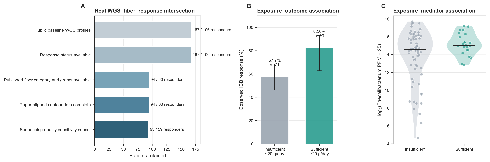
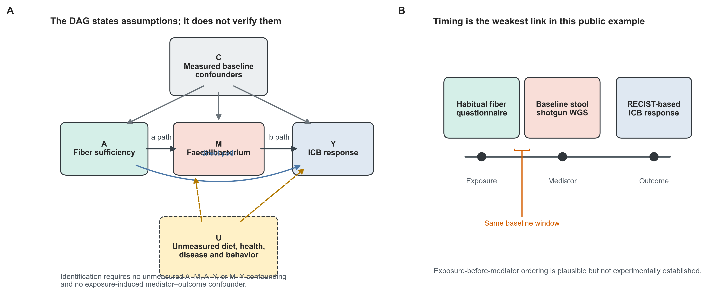
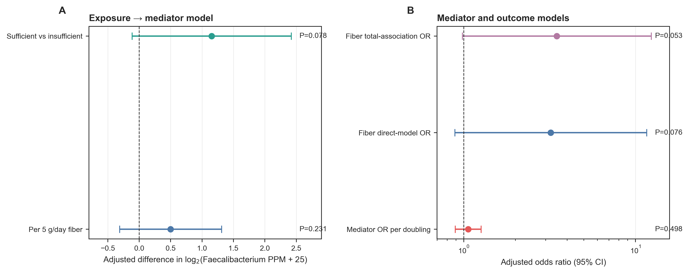
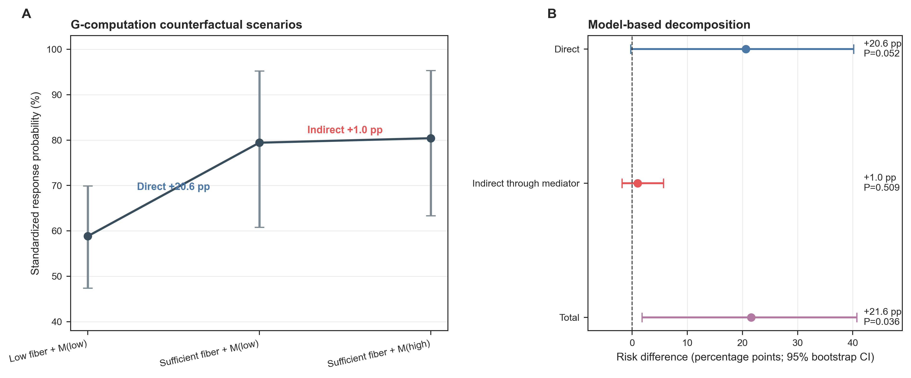
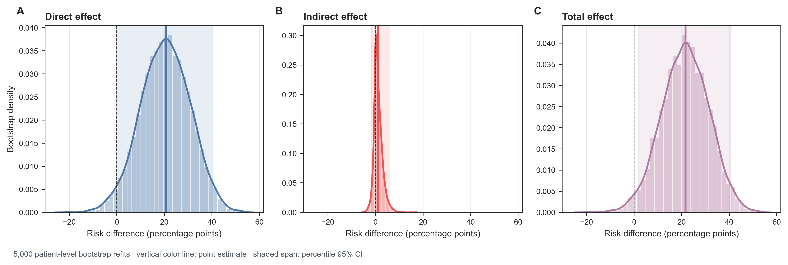
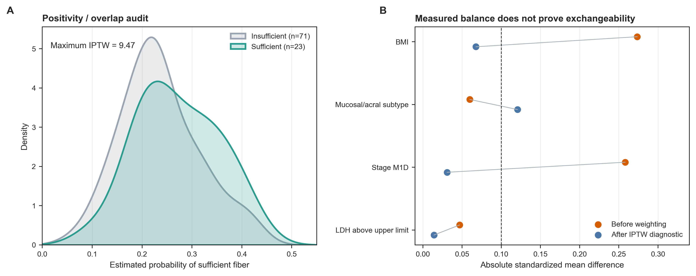
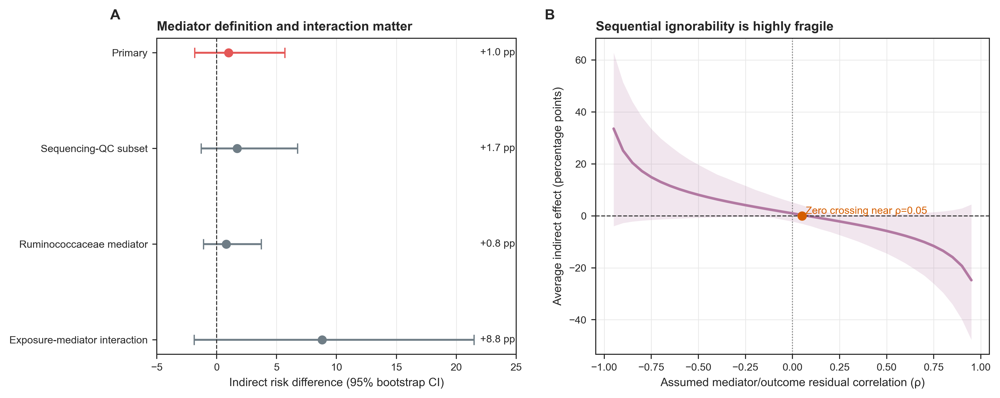

> **先给结论：**在 Spencer 公开 WGS、膳食纤维与免疫治疗 response 的 94 人交集中，没有证据表明 *Faecalibacterium* 是“纤维充足 → 更高 response”关联的主要中介。参数化 g-computation 得到 standardized total risk difference +21.6 percentage points（95% bootstrap CI +1.8 至 +40.7），direct component +20.6 points（−0.3 至 +40.1），经 *Faecalibacterium* 的 indirect component 只有 +1.0 point（−1.8 至 +5.7，$P=0.509$）。所谓“proportion mediated 4.6%”的区间从负值跨到 55.6%，不应作为稳定摘要。

这仍然不是因果中介证明。habitual-fiber questionnaire 与 baseline stool 来自同一个基线窗口，暴露先于中介的时间顺序没有被随机或重复测量建立；饮食质量、健康行为、疾病负荷和其他微生物功能可能同时影响 mediator 与 outcome。下面的分解应读作：**在明确模型和不可检验识别假设下，数据与多大的间接通路相容**。

本章沿用 Spencer 等人的黑色素瘤 immune checkpoint blockade（ICB）研究 [@spencer2021dietary]。公开工作簿有 167 位患者的 baseline stool WGS，94 人同时有 NIH Dietary Screener Questionnaire 推算的 fiber grams、论文预先定义的 20 g/day fiber category、基线 LKT PPM profile 与后续 RECIST-based response。Exposure 为 sufficient（23 人）vs insufficient（71 人），outcome 为 responder（60 人）vs non-responder（34 人），mediator 为预先指定的 *Faecalibacterium* 聚合丰度。

## 这一步对应论文里的哪张图 {#sec-target}

原研究 Figure 3A 比较 sufficient 与 insufficient fiber 的 PFS，Figure 3B 再联合 probiotic use；表 1 同时报告 fiber 与 ICB response 的 association。作者还观察到 sufficient fiber + no probiotic 的患者中 alpha diversity、Ruminococcaceae 与 *Faecalibacterium* 数值更高，但结果未达到统计显著 [@spencer2021dietary]。

{#fig-69-anchor}

这些结果提出了“fiber 是否通过 gut microbiome 影响 treatment response”的机制问题，却没有自动完成 mediation identification。论文 Figure 3 包含人群 association 与小鼠实验；本章只分析 94 人公开 WGS 交集，不把跨物种实验信息塞进同一个统计中介系数。

{#fig-69-observed}

## 理论：三条 association 不能自动拼成一条因果路径 {#sec-theory}

### 1. 先画 DAG，再写回归式

记 exposure 为 $A$、mediator 为 $M$、outcome 为 $Y$、基线混杂因素为 $C$。最小 causal diagram 包含：

$$
A\rightarrow M\rightarrow Y,\qquad A\rightarrow Y,
$$

以及 $C$ 指向 $A$、$M$、$Y$ 的箭头。真正危险的是未测因素 $U$：总体饮食、体能状态、治疗选择、疾病负荷或其他微生物功能都可能同时决定 $M$ 与 $Y$。

{#fig-69-dag}

要把分解解释成 causal mediation，至少需要 [@imai2010general; @valeri2013mediation]：

1. **Consistency**：`sufficient fiber` 与 mediator intervention 的版本足够明确；
2. **Positivity**：每种 $C$ 下都有可能处于 $A=0$ 与 $A=1$；
3. **No interference**：一位患者的饮食/微生物不改变另一位的 outcome；
4. **Exposure exchangeability**：给定 $C$ 后，没有未测的 $A$--$Y$ 与 $A$--$M$ 混杂；
5. **Mediator exchangeability**：给定 $A,C$ 后，没有未测的 $M$--$Y$ 混杂；
6. **No exposure-induced mediator–outcome confounder**：不存在被 $A$ 改变、又共同影响 $M,Y$ 的中间变量，或已用适配方法处理；
7. mediator 与 outcome 模型的 functional form 足够合理。

前五项不能靠一张 balance plot 检验。DAG 的作用是公开假设和缺口，不是给结果盖“causal”印章。

### 2. 这里估计的不是回归系数乘积

对 binary outcome，logistic outcome model 的系数不可在 risk-difference scale 上直接相加。先拟合：

$$
M = \alpha_0+\alpha_AA+\alpha_C^TC+\varepsilon_M,
$$

$$
\operatorname{logit}\{P(Y=1)\}=\beta_0+\beta_AA+\beta_MM+\beta_C^TC.
$$

再用 parametric g-computation 在经验协变量分布上标准化。令 $G_a$ 表示由 mediator model 在 $A=a$ 时生成的 mediator distribution，定义：

$$
\psi(a,a')=E_C\left[E_{M\sim G_{a'}(C)}\{P(Y=1\mid A=a,M,C)\}\right].
$$

本章的 primary decomposition 是：

$$
\text{Direct}=\psi(1,0)-\psi(0,0),
$$

$$
\text{Indirect}=\psi(1,1)-\psi(1,0),
$$

$$
\text{Total}=\psi(1,1)-\psi(0,0).
$$

它在 risk-difference scale 上严格满足 `Total = Direct + Indirect`。这里称为 **interventional-analog decomposition**；若把 $G_a$ 进一步解释为每个人的 natural mediator counterfactual，需要更强的 cross-world assumptions。多 mediator 或 exposure-induced confounding 时，interventional effects 通常更清楚 [@vansteelandt2017interventional]。

### 3. 同一“中介比例”会随效应尺度改变

Risk difference、risk ratio、odds ratio 与 log odds 上的 direct/indirect effect 不是同一个数字。尤其当 outcome 常见——本数据 response rate 64%——odds ratio 不能近似 risk ratio。

本章在 risk-difference scale 上报告 percentage points；path regressions 只用于诊断：

- sufficient fiber 对 mediator：$\hat\alpha_A=1.153$ 个 $\log_2$ 单位，95% CI −0.115--2.421，$P=0.078$；
- mediator 对 response：adjusted OR per doubling 1.062，0.893--1.262，$P=0.498$；
- fiber total-association OR 3.484，0.983--12.352，$P=0.053$；
- 加入 mediator 后 fiber OR 3.210，0.886--11.621，$P=0.076$。

“加入 M 后 A 的系数变小”不是正式中介检验；non-collapsibility alone 就能改变 logistic coefficient。

{#fig-69-paths}

### 4. exposure–mediator interaction 不能默认为零

若 $A$ 改变了 mediator 对 outcome 的作用，outcome model 应包含 $A\times M$；direct 与 indirect effect 也会随参考 exposure 改变 [@vanderweele2014explanation; @valeri2013mediation]。94 人、23 个 sufficient-fiber patients 无力稳定估计这个 interaction：2,000 次 bootstrap 中只有 1,892 次通过预设的有限系数门槛，indirect point estimate 从 +1.0 跳到 +8.8 points，95% CI 仍跨 0。

因此无 interaction 的模型适合作为简洁 primary specification，但必须把 interaction sensitivity 的剧烈变化展示出来，而不是因其不显著就删除。

### 5. 微生物 mediator 的“一个变量”必须先定义

公开 LKT table 已按“>50 PPM in ≥5% samples”过滤。本章的 primary mediator 是三个 `Genus == g__Faecalibacterium` rows 的 PPM 之和，再变换为 $\log_2(\text{PPM}+25)$；它不是 strain、metabolic activity 或 butyrate flux。

若先对 225 taxa 逐一跑 mediation，再只报告最显著 ACME，会发生 feature-selection leakage 和多重检验。这里用论文先验指定 genus，并把 26 个 `Family == f__Ruminococcaceae` rows 的聚合作为 mediator-definition sensitivity；二者 indirect effect 都接近 0。

## 准备工作 {#sec-preparation}

### 数据谱系、estimand 与算力

| 对象 | 锁定内容 |
|---|---|
| Study | Spencer et al., *Science* 2021；DOI `10.1126/science.aaz7015`；PMCID `PMC8970537` |
| Raw reads | BioProject `PRJNA770295` |
| Repository | `mda-primetr/Spencer_et_al_2021`，commit `a95b1a...b7d15` |
| Workbook | 22,718,390 bytes；SHA-256 `4fa93751...0968` |
| Analysis cohort | 94 patients；23 sufficient、71 insufficient；60 responders |
| Exposure | DSQ-derived fiber；sufficient ≥20 g/day，threshold 来自原研究 |
| Mediator | 3 个 *Faecalibacterium* LKT rows 聚合；$\log_2(\text{PPM}+25)$ |
| Outcome | study-defined ICB responder vs non-responder |
| Adjustment | primary subtype + advanced substage + LDH + BMI z-score |
| Primary estimand | standardized direct / indirect / total risk difference |
| Integration | 20-node Gaussian quadrature over normal mediator residuals |
| Uncertainty | 5,000 patient-level bootstrap；sensitivity 2,000 次 |
| Seeds | analysis `69001`；plot `20260769` |

冻结结果复核和重跑 g-computation 均约需 **2 CPU、4--8 GB RAM、<2 分钟**。从 Excel 读取与整理约需数分钟。只有在比较 profiler/database 或重新定义 mediator 时才需要从原始 WGS 重建；建议 **8--16 CPU、32 GB 以上 RAM、200 GB 以上磁盘**。

<details>
<summary><strong>安装依赖、下载真实数据，并内联统一作图函数</strong></summary>

```{bash}
#| eval: false
mamba env create -f env/multiomics-python.yml

Rscript -e 'install.packages(c(
  "mediation", "statmod", "sandwich", "mvtnorm",
  "ggplot2", "dplyr", "readr", "knitr", "jsonlite"
))'

python scripts/download_article69_mediation_data.py \
  --cache-dir db/spencer/article69
```

```{r}
set.seed(20260769)

pal_pub <- c(
  "Insufficient" = "#9AA5B1", "Sufficient" = "#2A9D8F",
  "Direct" = "#4C78A8", "Indirect" = "#E45756", "Total" = "#B279A2"
)
scale_color_pub <- function(...) ggplot2::scale_color_manual(values = pal_pub, ...)
scale_fill_pub  <- function(...) ggplot2::scale_fill_manual(values = pal_pub, ...)
theme_pub <- function(base_size = 12) {
  ggplot2::theme_bw(base_size = base_size) + ggplot2::theme(
    panel.grid.minor = ggplot2::element_blank(),
    panel.grid.major = ggplot2::element_line(color = "#ECEFF1", linewidth = 0.3),
    axis.text = ggplot2::element_text(color = "black"),
    legend.key = ggplot2::element_blank(),
    strip.background = ggplot2::element_rect(fill = "#EDF2F4", color = NA),
    plot.title.position = "plot",
    plot.caption = ggplot2::element_text(color = "#455A64", hjust = 0)
  )
}
save_pub <- function(plot, file_base, width = 210, height = 150,
                     units = "mm", dpi = 350) {
  dir.create(dirname(file_base), recursive = TRUE, showWarnings = FALSE)
  ggplot2::ggsave(paste0(file_base, ".pdf"), plot, width = width,
                  height = height, units = units,
                  device = grDevices::cairo_pdf, bg = "white")
  ggplot2::ggsave(paste0(file_base, ".png"), plot, width = width,
                  height = height, units = units, dpi = dpi, bg = "white")
  ggplot2::ggsave(paste0(file_base, ".tiff"), plot, width = width,
                  height = height, units = units, dpi = dpi,
                  compression = "lzw", bg = "white")
  invisible(plot)
}
```

</details>

### 先验收 checksum、真实交集与 feature rows

```{bash}
#| eval: false
FROZEN="$PWD/data/small/69-mediation-frozen"
sha256sum -c "$FROZEN/file-checksums.sha256"
column -ts $'\t' "$FROZEN/cohort-attrition.tsv"
column -ts $'\t' "$FROZEN/gformula-effect-summary.tsv"
```

```{r}
frozen <- "data/small/69-mediation-frozen"
cohort <- read.delim(file.path(frozen, "mediation-cohort.tsv"), check.names = FALSE)
cohort$QualitySensitivityPass <-
  tolower(as.character(cohort$QualitySensitivityPass)) == "true"

stopifnot(
  nrow(cohort) == 94,
  length(unique(cohort$SampleID)) == 94,
  sum(cohort$ExposureSufficient) == 23,
  sum(cohort$OutcomeResponder) == 60,
  all(cohort$FiberGrams[cohort$ExposureSufficient == 1] >= 20),
  all(cohort$FiberGrams[cohort$ExposureSufficient == 0] < 20)
)
knitr::kable(
  read.delim(file.path(frozen, "exposure-outcome-summary.tsv")),
  digits = 3,
  caption = "真实 exposure × outcome 分组"
)
```

## 可复制代码：从谱表到标准化中介分解 {#sec-code}

### 第 1 步：从 225-row LKT table 构造 mediator

```{r}
lkt <- read.delim(
  gzfile(file.path(frozen, "lkt-mediation-ppm.tsv.gz")),
  check.names = FALSE
)
taxonomy <- read.delim(
  file.path(frozen, "lkt-feature-map.tsv"),
  check.names = FALSE
)
faec_ids <- taxonomy$LKTFeature[taxonomy$Genus == "g__Faecalibacterium"]
stopifnot(length(faec_ids) == 3)

matrix <- as.matrix(lkt[, setdiff(names(lkt), "LKTFeature")])
rownames(matrix) <- lkt$LKTFeature
faec_ppm <- colSums(matrix[faec_ids, , drop = FALSE])
faec_ppm <- faec_ppm[cohort$SampleID]
mediator <- log2(faec_ppm + 25)

stopifnot(all.equal(
  unname(mediator), cohort$FaecalibacteriumLog2,
  tolerance = 1e-12
))
```

一个样本的聚合值为 0；25 PPM pseudocount 只定义 transform。换成 MetaPhlAn relative abundance、MAG coverage 或 pathway CPM 时，必须重新定义 feature universe、zero handling 和一单位效应含义。

### 第 2 步：固定 factor reference 与 adjustment set

```{r}
set.seed(69001)
cohort$A <- as.integer(cohort$ExposureSufficient)
cohort$Y <- as.integer(cohort$OutcomeResponder)
cohort$M <- cohort$FaecalibacteriumLog2
cohort$BMIz <- as.numeric(scale(cohort$BMI))
cohort$PrimarySubtype <- factor(
  cohort$PrimarySubtype,
  levels = c("Cutaneous_or_unknown", "Mucosal_or_acral")
)
cohort$AdvancedSubstage <- factor(
  cohort$AdvancedSubstage,
  levels = c("Stage_M1C", "Stage_M1D")
)
cohort$LDH <- factor(cohort$LDH, levels = c("No", "Yes"))

mediator_fit <- lm(
  M ~ A + PrimarySubtype + AdvancedSubstage + LDH + BMIz,
  data = cohort
)
outcome_fit <- glm(
  Y ~ A + M + PrimarySubtype + AdvancedSubstage + LDH + BMIz,
  data = cohort, family = binomial()
)
total_fit <- glm(
  Y ~ A + PrimarySubtype + AdvancedSubstage + LDH + BMIz,
  data = cohort, family = binomial()
)
```

```{r}
paths <- read.delim(
  file.path(frozen, "path-model-estimates.tsv"),
  check.names = FALSE
)
key_paths <- subset(
  paths,
  (Model == "Mediator model" & Term == "A") |
    (Model == "Outcome model" & Term %in% c("A", "M")) |
    (Model == "Total-association model" & Term == "A")
)
knitr::kable(
  key_paths[, c("Model", "Term", "Estimate", "CILower", "CIUpper",
                "OddsRatio", "OddsRatioLower", "OddsRatioUpper", "PValue")],
  digits = 3,
  caption = "路径模型是诊断，不是效应分解本身"
)
```

### 第 3 步：用 Gaussian quadrature 标准化 mediator distribution

下面把 mediator residual distribution 视为 normal，用 20-node Gaussian quadrature 积分。每个 $\psi(a,a')$ 都在 94 人的经验 $C$ 分布上平均，不取“平均患者”代替 population standardization。

```{r}
#| eval: false
library(statmod)
quadrature <- gauss.quad.prob(20, dist = "normal")

standardized_probability <- function(a_y, a_m, target = cohort) {
  mediator_data <- target
  mediator_data$A <- a_m
  mu_m <- predict(mediator_fit, newdata = mediator_data)
  sigma_m <- sigma(mediator_fit)

  integrated <- numeric(nrow(target))
  for (k in seq_along(quadrature$nodes)) {
    outcome_data <- target
    outcome_data$A <- a_y
    outcome_data$M <- mu_m + sigma_m * quadrature$nodes[k]
    integrated <- integrated + quadrature$weights[k] *
      predict(outcome_fit, newdata = outcome_data, type = "response")
  }
  mean(integrated)
}

p00 <- standardized_probability(a_y = 0, a_m = 0)
p10 <- standardized_probability(a_y = 1, a_m = 0)
p11 <- standardized_probability(a_y = 1, a_m = 1)

direct   <- p10 - p00
indirect <- p11 - p10
total    <- p11 - p00
stopifnot(all.equal(total, direct + indirect))
```

Point estimates 为 $\psi(0,0)=0.588$、$\psi(1,0)=0.794$、$\psi(1,1)=0.804$。换言之，模型把大部分 standardized response difference 放在 direct component，替换 mediator distribution 只增加约 1 percentage point。

{#fig-69-effects}

### 第 4 步：每次 bootstrap 都重拟合两条模型

不能只对固定系数生成 Monte Carlo draws；那会漏掉抽样、mediator model 与 outcome model 的不确定性。本章在每个 bootstrap patient sample 中重新拟合两条模型、重新积分、重新标准化。

```{r}
#| eval: false
set.seed(69001 + 1000)
bootstrap_once <- function(boot_data) {
  m_fit <- lm(
    M ~ A + PrimarySubtype + AdvancedSubstage + LDH + BMIz,
    data = boot_data
  )
  y_fit <- glm(
    Y ~ A + M + PrimarySubtype + AdvancedSubstage + LDH + BMIz,
    data = boot_data, family = binomial()
  )

  psi <- function(a_y, a_m) {
    mediator_data <- boot_data
    mediator_data$A <- a_m
    mu_m <- predict(m_fit, newdata = mediator_data)

    probability <- numeric(nrow(boot_data))
    for (k in seq_along(quadrature$nodes)) {
      outcome_data <- boot_data
      outcome_data$A <- a_y
      outcome_data$M <- mu_m + sigma(m_fit) * quadrature$nodes[k]
      probability <- probability + quadrature$weights[k] *
        predict(y_fit, newdata = outcome_data, type = "response")
    }
    mean(probability)
  }

  p00 <- psi(0, 0)
  p10 <- psi(1, 0)
  p11 <- psi(1, 1)
  c(
    Direct = p10 - p00,
    Indirect = p11 - p10,
    Total = p11 - p00
  )
}

bootstrap <- replicate(5000, {
  index <- sample(seq_len(nrow(cohort)), replace = TRUE)
  tryCatch(
    bootstrap_once(cohort[index, , drop = FALSE]),
    error = function(error) rep(NA_real_, 3)
  )
})
bootstrap <- t(bootstrap)
apply(bootstrap, 2, quantile, probs = c(0.025, 0.975), na.rm = TRUE)
```

实际脚本使用预构造 model matrices 与 `lm.fit()`/`glm.fit()` 加速，但 estimand 与上面的透明版本相同。5,000 次 primary refits 全部有效；interaction sensitivity 因 bootstrap separation/极端系数只保留 1,892/2,000 次，失效率本身就是小样本不稳定证据。

{#fig-69-bootstrap}

```{r}
effects <- read.delim(
  file.path(frozen, "gformula-effect-summary.tsv"),
  check.names = FALSE
)
primary_effects <- subset(
  effects,
  Variant == "Primary" & Effect %in% c("Direct", "Indirect", "Total", "ProportionMediated")
)
knitr::kable(primary_effects, digits = 3,
             caption = "Primary standardized mediation decomposition")
```

Total risk-difference bootstrap $P=0.036$，而 total-association logistic Wald $P=0.053$。它们针对不同 scale、不同 inference procedure，不应挑较小的一个宣布“显著”。中介问题的核心是 indirect effect：$P=0.509$，CI 清楚跨 0。

### 第 5 步：positivity 与 measured-confounder overlap

用 baseline $C$ 拟合 `P(A=1|C)` 只作诊断，不把 IPTW 混入 primary g-computation。estimated propensity 在 insufficient group 为 0.064--0.418，在 sufficient group 为 0.106--0.418；最大 unstabilized weight 为 9.47。23 个 exposed patients 使部分 covariate strata 的 effective support 很薄。

{#fig-69-overlap}

IPTW 后 mucosal/acral subtype 的 absolute SMD 仍为 0.121；这不是让分析改用另一套权重的理由，而是提示样本量和 overlap 限制。真正的中介识别还要求 mediator–outcome exchangeability，propensity balance 无法检验它 [@cole2008constructing]。

### 第 6 步：把不可检验假设变成敏感性曲线

作为独立实现检查，`mediation::mediate()` 用 linear mediator + probit outcome 得到 average ACME +1.16 points（95% CI −2.44--5.85，$P=0.523$），与 logistic g-computation 的 +0.99 points 一致。

`medsens()` 再假设 mediator/outcome model residual correlation 为 $\rho$。average ACME 在 $\rho$ 约 0.05 附近过 0；control/treated ACME 的零点分别约 0.05/0.10。很小的未测 residual dependence 就能改变点估计方向，说明 sequential ignorability 极为脆弱。这不是对真实 confounding 的估计，而是 robustness scale。

{#fig-69-sensitivity}

## 审计与升级 {#sec-audit}

### 先忠实保留论文证据链

原论文把 sufficient fiber 定义为 ≥20 g/day，报告 fiber 与 PFS/response 的关联，并在患者和小鼠中追踪 microbiome 与 immune readouts [@spencer2021dietary]。本章保留这个预设 exposure threshold、paper-aligned covariates、真实 baseline shotgun 与 study-defined response，不重新优化 fiber cutoff，也不从 225 taxa 中选择最容易得到 indirect effect 的 mediator。

### 今天需要加上的审计

1. **明确 estimand 与 scale**：报告 risk-difference direct/indirect/total，不用 logistic coefficient attenuation 代替。
2. **显式 timing audit**：问卷与 stool 同窗，不能声称严格 $A\rightarrow M$ 时间顺序。
3. **完整 confounding map**：分别列 A--M、A--Y、M--Y confounders 和可能的 exposure-induced confounder。
4. **positivity**：报告 propensity range、extreme weights 与每个 exposure group 的样本数。
5. **interaction**：给 $A\times M$ sensitivity；本数据从 +1.0 到 +8.8 points 的变化揭示不稳定。
6. **mediator definition**：genus 与 family aggregation 并行；不得把 taxonomic abundance 写成 metabolic flux。
7. **全流程 bootstrap**：每次重拟合 mediator/outcome models，并报告失败次数。
8. **unmeasured-confounding sensitivity**：把 sequential ignorability 的脆弱程度量化。
9. **独立设计升级**：最有价值的是 randomized fiber intervention、先测 exposure、后测 mediator、再测 outcome，并反复采样。

### 为什么这仍不能证明机制

人群中的 total association、微生物差异、mouse experiment 与 immune pathway 各自提高 plausibility，却不意味着单一 human mediator 已被识别。*Faecalibacterium* 可能只是 fiber-rich dietary pattern 的 marker；fiber 还可通过 host metabolism、其他 taxa、metabolites 或 immune pathways 影响 response。单 mediator model 把这些通路压进 direct component，不能将 direct 解读成“非微生物机制”。

## 出版级美化 {#sec-publication}

中介结果最好拆成四层图，而不是一张拥挤 path diagram：

- DAG 用箭头表示假设，未测 $U$ 用虚线；不要在 DAG 上写星号；
- observed-data panel 展示 n、exposure prevalence、outcome rate 与 mediator distribution；
- effect panel 用 percentage points 和 95% CI，保证 `direct + indirect = total`；
- sensitivity panel 单独展示 interaction、mediator definition 与 $\rho$ curve；
- `proportion mediated` 若 total 接近 0 或 CI 跨符号，移到补充材料；
- exposure、mediator、outcome 的 measurement time 放成 timeline；
- 图内文字全英文，输出 vector PDF、350 dpi PNG 与 LZW TIFF。

颜色不要暗示“绿色=因果有效”。本章绿色只代表 sufficient exposure，蓝/红/紫分别固定 direct/indirect/total；0 reference line 始终可见。

## 常见坑 {#sec-pitfalls}

::: {.callout-caution title="A→M 和 M→Y 都显著，所以有中介"}
两条回归路径显著既非必要也非充分条件；本数据两条路径都不显著。应直接估计目标 scale 上的 indirect effect 及不确定性。
:::

::: {.callout-caution title="把加入 mediator 后的系数衰减当作 proportion mediated"}
Logistic OR non-collapsibility 会使系数在没有中介时也变化。用 counterfactual standardization，且只在 total effect 稳定、direct/indirect 同向时谨慎报告比例。
:::

::: {.callout-caution title="暴露、mediator、outcome 同时测量"}
横断面三变量无法建立方向。最低升级是 exposure 在前、mediator 随后、outcome 最后；更好的是 randomized exposure 与重复 mediator measurements。
:::

::: {.callout-caution title="把 treatment 后变量放进基线 C"}
若某变量被 exposure 改变，又影响 mediator 和 outcome，直接调整可能阻断目标路径或产生 collider bias。先在 DAG 中标出时间，再选择适配 longitudinal mediation/g-method。
:::

::: {.callout-caution title="从几百个 taxa 里挑一个显著 ACME"}
这同时包含 feature selection、零值处理和多重检验。必须在 training/independent discovery 中选 mediator，或用适配 high-dimensional mediation 的方法并做外部验证。
:::

::: {.callout-caution title="把 taxon abundance 写成 metabolite mechanism"}
一个属的 DNA relative abundance 不等于 strain function、gene expression、metabolite production 或 host exposure。功能中介需要定量 metagenome/metatranscriptome/metabolomics 与来源验证。
:::

::: {.callout-caution title="ACME 不显著就证明没有中介"}
94 人、23 exposed 的 CI 仍允许约 −1.8 到 +5.7 percentage points；结果是“不足以确认该单一 mediator”，不是“间接通路为零”。
:::

## 这段 Methods 怎么写 {#sec-methods}

> Baseline dietary, stool whole-genome shotgun, and clinical-response data were obtained from the public Spencer et al. melanoma immunotherapy dataset (BioProject PRJNA770295; analysis repository commit a95b1a020b890dbe93a960dec946e197b63b7d15). The analysis included 94 patients with a study-defined dietary-fiber category, estimated daily fiber intake, an unambiguous ICB response, and complete prespecified baseline covariates. Dietary fiber sufficiency (≥20 versus <20 g/day; 23 versus 71 patients) was the exposure, and study-defined ICB response (60 responders and 34 non-responders) was the outcome. The prespecified mediator was log2(PPM + 25) of *Faecalibacterium*, aggregated across the three filtered last-known-taxon rows assigned to that genus. The mediator model was linear and the outcome model was logistic; both adjusted for melanoma primary subtype, advanced substage, LDH category, and standardized BMI. Direct, indirect, and total effects were standardized to the empirical covariate distribution on the risk-difference scale using 20-node Gaussian quadrature over the fitted mediator residual distribution. Percentile 95% confidence intervals were obtained from 5,000 patient-level bootstrap resamples in which both models and the g-computation step were repeated. Prespecified sensitivity analyses included an exposure–mediator interaction, exclusion of samples with <0.5 Gb non-human sequence or <50% assembled reads, substitution of aggregated Ruminococcaceae abundance as the mediator, and a probit residual-correlation sensitivity analysis using mediation 4.5.1. All analyses used R 4.4.1 with seed 69001.

结果句可写：

> The standardized total response-probability difference comparing sufficient with insufficient fiber was 21.6 percentage points (95% bootstrap CI 1.8 to 40.7). The model-based direct component was 20.6 points (−0.3 to 40.1), whereas the indirect component through *Faecalibacterium* was 1.0 point (−1.8 to 5.7; bootstrap P=0.509). The estimated proportion mediated was 4.6%, but its 95% interval (−16.9% to 55.6%) was unstable. Because habitual fiber and stool microbiome were measured within the same baseline window and sequential exchangeability could not be verified, these quantities were interpreted as assumption-dependent decompositions rather than proof of causal mediation.

不要删掉最后一句。它不是“自我否定”，而是让审稿人知道你分得清模型输出、identification 和机制证据。

## 换成你自己的数据怎么做 {#sec-own-data}

### 最低数据结构

一行一位独立受试者，至少包含：

| Column | Timing | Meaning |
|---|---|---|
| `id` | enrollment | 唯一主体 ID |
| `A` | exposure time | 明确定义的 exposure/intervention |
| `C_*` | exposure 前 | A--M、A--Y、M--Y baseline confounders |
| `M` | exposure 后、outcome 前 | 预设 taxon/function/metabolite mediator |
| `Y` | mediator 后 | binary/continuous/time-to-event outcome |
| `site`, `batch` | design | center、sequencing batch、assay version |

### 设计与分析顺序

1. 先画带时间的 DAG，列出每条 confounding path 和测量时点；
2. 明确 natural、interventional、controlled direct effect 中哪一个是目标；
3. 预注册 exposure contrast、mediator transform、outcome scale 与 covariates；
4. 先审计 missingness、positivity、batch/site、outliers 和 exposure prevalence；
5. 不用 A/M/Y 单因素 P 值决定是否继续；直接估计 indirect effect；
6. binary outcome 用 g-computation 或适配实现，避免 coefficient-product 误用；
7. 若存在 $A\times M$，报告 reference-specific effects 或完整 decomposition；
8. patient-level bootstrap 必须重跑所有 feature engineering 与两条模型；
9. 多 mediators、longitudinal mediators、survival outcomes 分别需要更合适的 interventional/longitudinal methods；
10. 把 unmeasured-confounding sensitivity、negative controls 和独立验证列为主结果，而非可选补图。

若研究问题真的是“fiber 通过 microbial function 改善 response”，更有力的设计是随机高纤维干预，在治疗前和治疗中重复 stool shotgun/宏转录/代谢组，记录 adherence 与 antibiotics，再评估预设 immune/clinical outcome。中介分析能组织这条证据链，不能替代时间顺序和干预。

## 参考 {#sec-references}

- Spencer 纤维、微生物与免疫治疗研究：[@spencer2021dietary]
- Counterfactual causal mediation 与 sensitivity framework：[@imai2010general]
- Exposure–mediator interaction 与 4-way decomposition：[@vanderweele2014explanation; @valeri2013mediation]
- Interventional indirect/direct effects：[@vansteelandt2017interventional]
- Positivity、extreme weights 与 IPTW 构造：[@cole2008constructing]

::: {#refs}
:::
