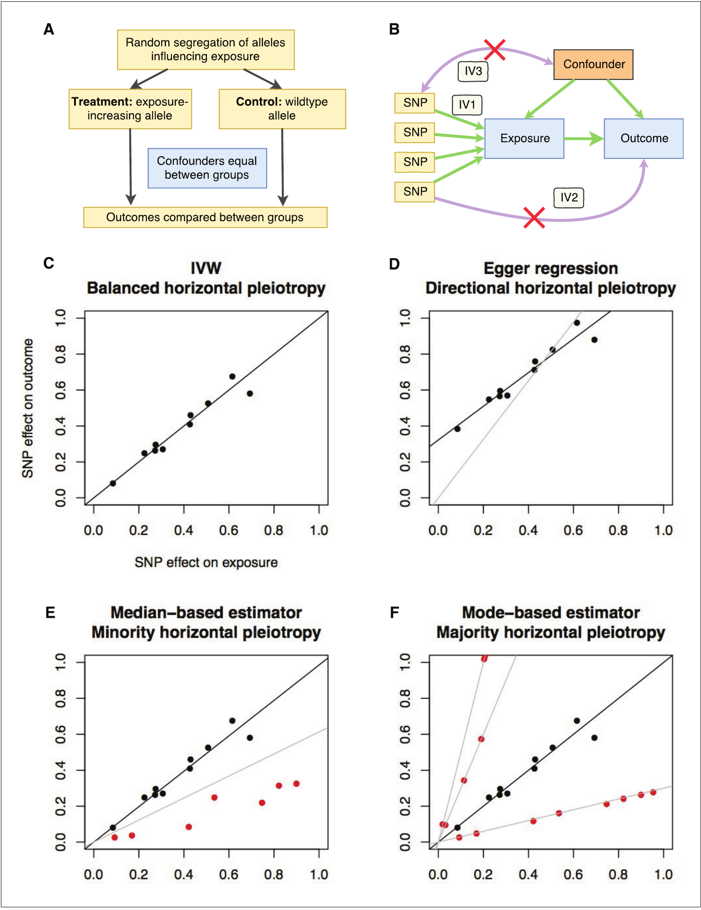
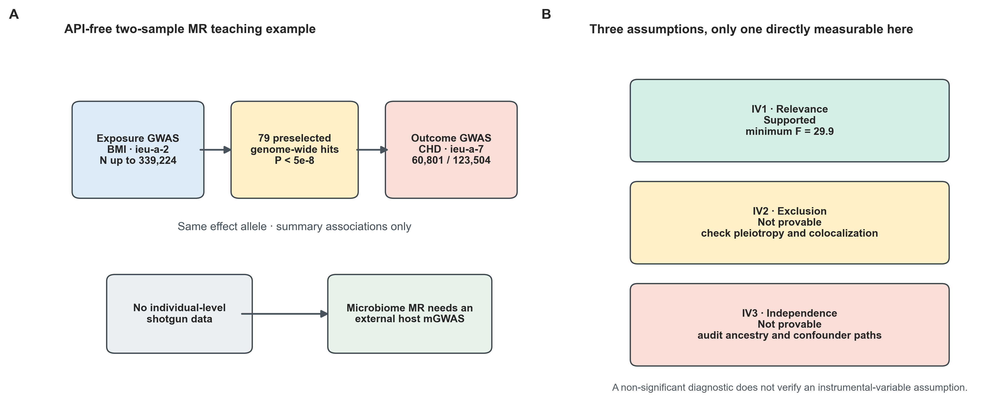
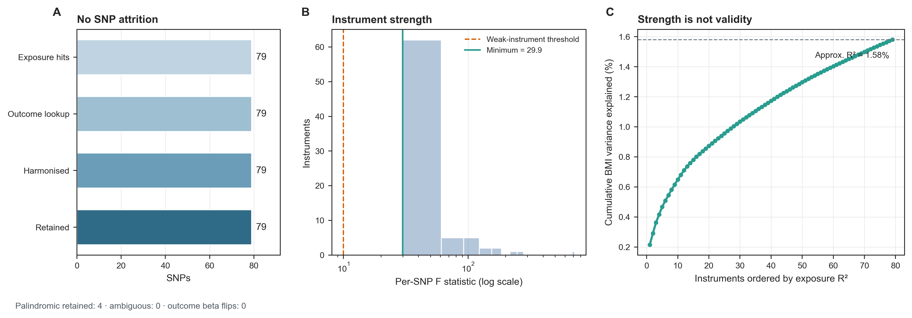
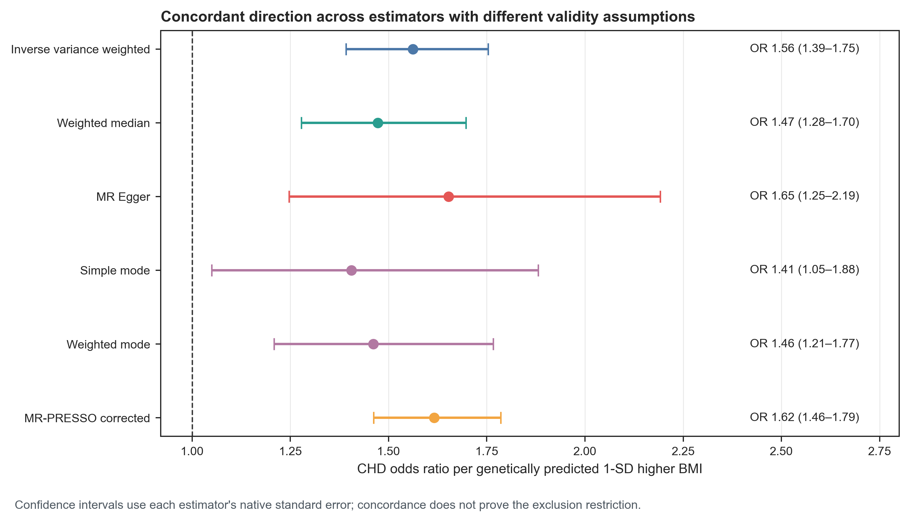
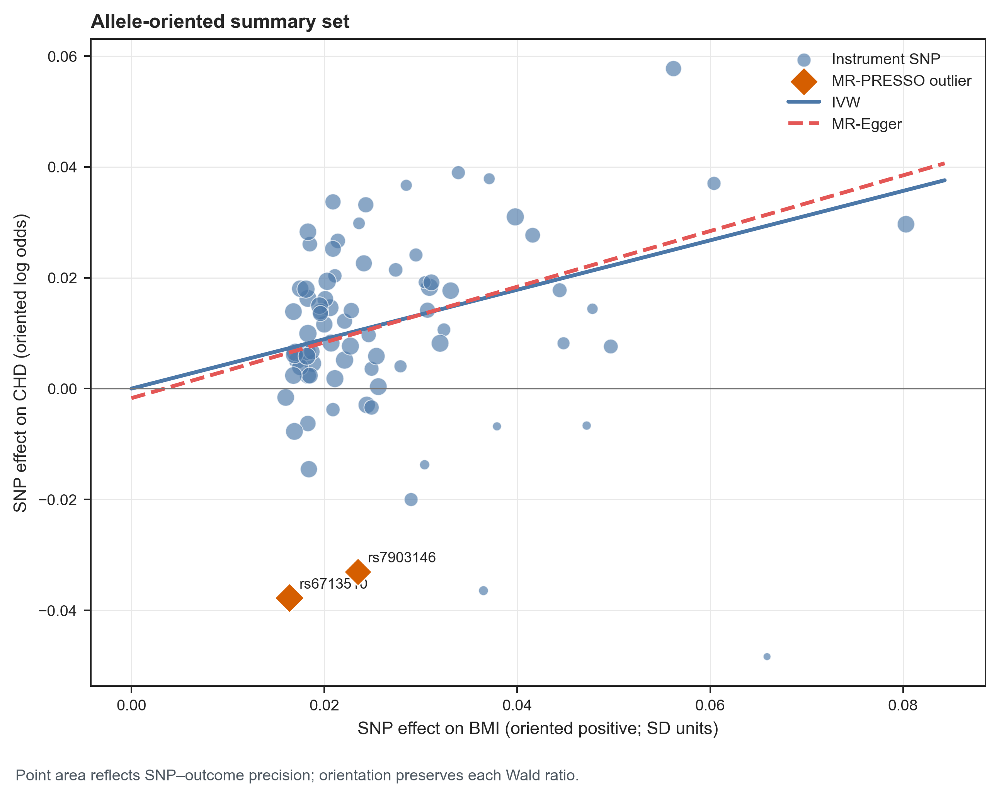
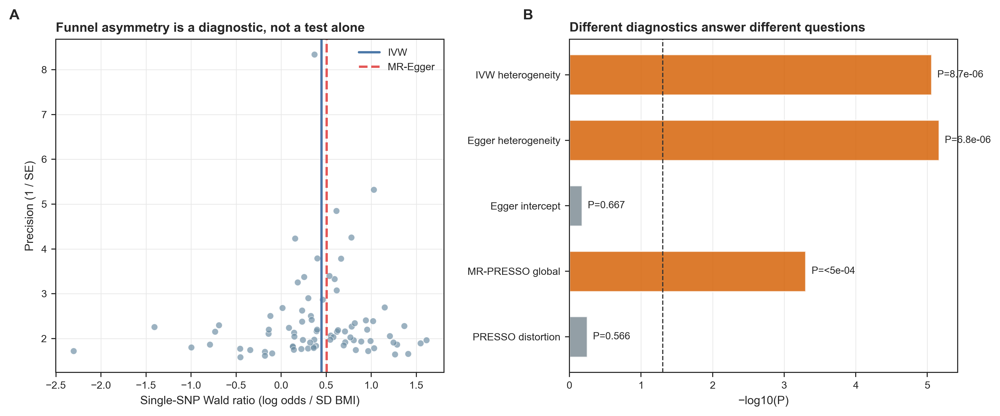
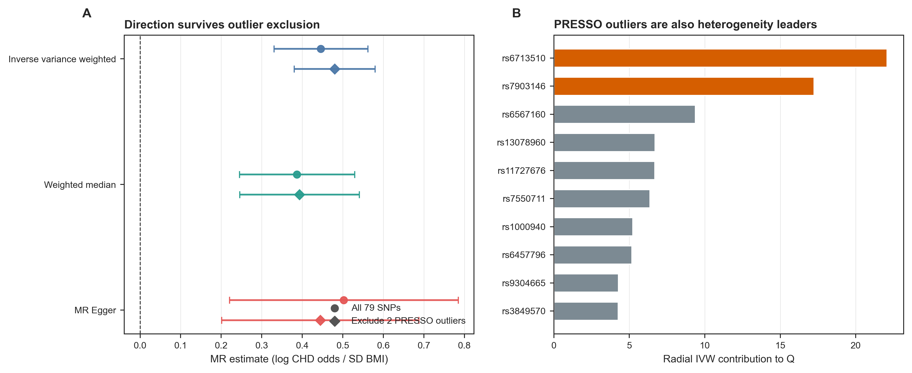
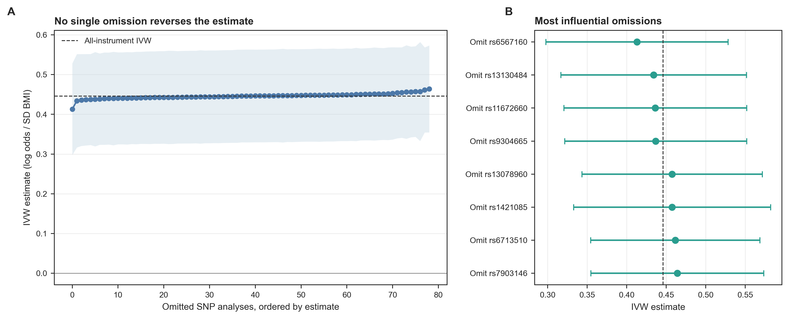
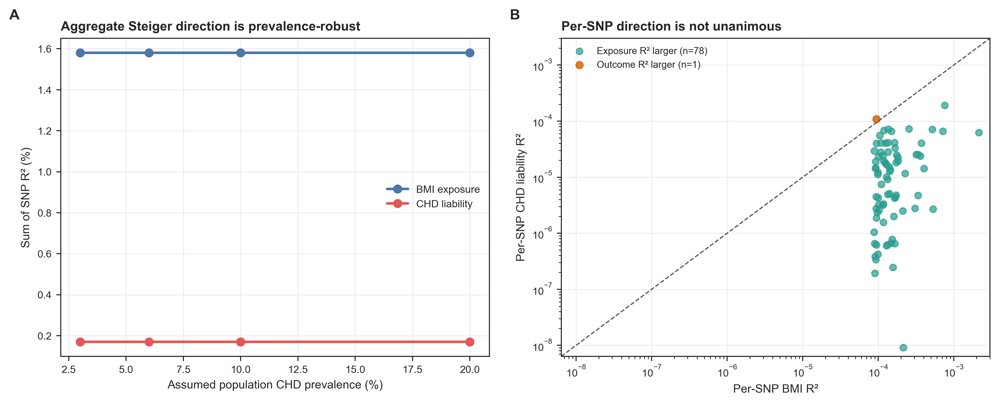

::: {.callout-important title="你还需要什么数据"}
真正的微生物组孟德尔随机化（Mendelian randomization, MR）不能从 MetaPhlAn/HUMAnN 谱表直接起步。至少需要一份**外部宿主遗传 mGWAS** 和一份**结局 GWAS**：每个变异都要有 SNP、effect/other allele、beta、SE、P value、effect-allele frequency、sample size；二分类结局还要 cases、controls 与合理的 population prevalence。还应记录 ancestry、genome build、微生物 phenotype 定义与 profiler/database 版本、LD reference/release、样本重叠和发现/验证队列。

下面使用 TwoSampleMR 官方教程中锁定的 BMI → coronary heart disease（CHD）真实示例教统计流程。它验证的是一套 MR 审计方法，**不是微生物导致冠心病的证据**。
:::

> **先给结论：**79 个 BMI 工具变量全部通过等位基因协调，minimum F=29.9；inverse-variance weighted（IVW）估计显示 genetically predicted 1-SD higher BMI 对应 CHD OR 1.56（95% CI 1.39–1.75，$P=4.0\times10^{-14}$）。weighted median、MR-Egger 和 mode estimators 方向一致。但是 IVW heterogeneity 明显（$Q=143.65$，df=78，$P=8.7\times10^{-6}$），MR-PRESSO global test 也为阳性；不能把一个很小的主效应 P 值写成“因果已证实”。

MR-PRESSO 标记 rs6713510 与 rs7903146，剔除后 OR 为 1.62（1.46–1.79），distortion test $P=0.566$；leave-one-out 的 79 个估计均为正。MR-Egger intercept $P=0.667$ 只能说明没有检测到平均定向多效性，不能证明所有工具满足 exclusion restriction。聚合 Steiger test 在 CHD prevalence 3%–20% 的假设范围内都支持 BMI → CHD，但单 SNP 仍有 1/79 不支持该方向，且测量误差会影响此检验。

## 这一步对应论文里的哪张图 {#sec-target}

MR-Base 论文 Figure 1 把三个工具变量假设与四类 estimator 的行为画在一起 [@hemani2018mrbase]：relevance 要求 SNP 与 exposure 相关；independence 要求 SNP 不受 exposure–outcome confounder 影响；exclusion restriction 要求 SNP 只能经 exposure 改变 outcome。只有第一条能被 exposure GWAS 直接量化。

{#fig-70-anchor}

这张图最重要的不是“有四种方法可选”，而是每种方法只在特定 invalid-instrument pattern 下稳健。多跑几个 estimator 并观察方向一致，属于 triangulation；它不会让共同违反的假设自动成立。

{#fig-70-design}

## 理论：MR 估计的是遗传代理暴露效应，不是“相关升级版” {#sec-theory}

### 1. 三个工具变量假设缺一不可

令 $G_j$ 为第 $j$ 个遗传工具，$X$ 为 exposure，$Y$ 为 outcome。单 SNP Wald ratio 为：

$$
\widehat\beta_j^{MR}=\frac{\widehat\beta_{Yj}}{\widehat\beta_{Xj}}.
$$

它只有在以下条件下才对应 exposure effect：

1. **Relevance（相关性）**：$G_j\rightarrow X$；常用 $F_j=(\widehat\beta_{Xj}/SE_{Xj})^2$ 检查弱工具；
2. **Independence（独立性）**：$G_j$ 不与 $X$--$Y$ 混杂因素关联；
3. **Exclusion restriction（排除限制）**：$G_j$ 不通过 $X$ 之外的路径影响 $Y$。

第二、三条是因果结构假设，不会被“GWAS P<5e-8”“F>10”或 Egger intercept 不显著证明 [@sanderson2022mr]。垂直多效性（variant → exposure 下游 mediator → outcome）可以属于目标通路；绕过 exposure 的水平多效性才违反 exclusion restriction。

### 2. 两样本设计还增加了兼容性假设

Two-sample MR 使用 exposure GWAS 的 $\widehat\beta_X$ 与 outcome GWAS 的 $\widehat\beta_Y$。两份研究还需在 ancestry、LD、allele coding、trait definition 和效应尺度上可比。若同一参与者同时进入两份 GWAS，弱工具时估计可能向 observational association 偏移；样本完全独立时，弱工具通常向零偏移 [@burgess2016overlap]。

本例 exposure 来自 Locke 等人的 BMI GWAS，研究最大样本量 339,224 [@locke2015bmi]；outcome 来自 Nikpay 等人的 CHD meta-analysis，60,801 cases 与 123,504 controls [@nikpay2015cad]。官方缓存没有 ancestry、participant overlap、LD reference/release 和 clumping 细节，因此这些项不能在分析后“推断为已验证”。

### 3. 五种估计器解决的不是同一个问题

| Estimator | 核心有效性条件 | 主要弱点 |
|---|---|---|
| IVW | balanced pleiotropy；或所有工具有效 | 一个强 invalid instrument 即可造成偏倚 |
| Weighted median | 至少 50% 的权重来自有效工具 [@bowden2016median] | 多数权重失效时仍偏倚 |
| MR-Egger | InSIDE；NOME 近似成立 [@bowden2015egger] | 功效低、对 leverage 与 measurement error 敏感 |
| Mode-based | 最大加权簇来自有效工具（ZEMPA）[@hartwig2017mode] | bandwidth 选择影响结果 |
| MR-PRESSO corrected | horizontal pleiotropy 工具少于约 50% [@verbanck2018presso] | outlier removal 不能修复共享生物通路或系统性偏倚 |

方向一致值得报告，但“每种方法都显著”不是有效性证明。更有信息量的问题是：不同假设下效应是否仍同向、异质性由谁贡献、结论是否被单一位点驱动、方向性是否依赖 prevalence 或 measurement error。

### 4. 微生物 mGWAS 的 instrument validity 尤其脆弱

微生物 phenotype 会随测序技术、zero handling、taxonomic database、药物、饮食与地理环境改变。MiBioGen 在 18,340 人、24 个队列中进行大规模宿主遗传–肠道微生物关联分析，但经过严格 study-wide threshold 后最突出的可复现信号集中在 LCT–Bifidobacterium 轴 [@kurilshikov2021mibiogen]。这说明很多 taxon 的工具少、弱或跨队列不稳定。

一个宿主位点也可能通过乳糖消化、黏膜免疫、肠道运动或药物代谢直接改变结局，而不必经目标 taxon。微生物 MR 因而更需要 bidirectional MR、negative controls、locus-level colocalization、独立 mGWAS replication 和实验三角验证 [@wade2020microbiomemr; @giambartolomei2014coloc]。

## 准备工作 {#sec-preparation}

### 数据谱系、estimand 与算力

| 对象 | 锁定内容 |
|---|---|
| Exposure | BMI；OpenGWAS ID `ieu-a-2`；Locke et al. 2015 |
| Outcome | CHD；OpenGWAS ID `ieu-a-7`；Nikpay et al. 2015 |
| Locked source | TwoSampleMR 0.7.9 `inst/extdata/vig_perform_mr.RData` |
| Source release | tag `v0.7.9`；commit `3d119f2...f2c7b` |
| Source checksum | SHA-256 `7a13b142...d63502` |
| Instruments | 79 preselected BMI variants；all exposure P<5e-8 |
| Harmonisation | `action=2`；palindromic variants use allele frequency |
| Primary estimand | CHD odds ratio per genetically predicted 1-SD higher BMI |
| Main estimator | multiplicative random-effects IVW |
| Sensitivity | weighted median/Egger/modes, Q, Egger intercept, PRESSO, radial IVW, leave-one-out, Steiger |
| Seeds | analysis `70001`；plot `20260770` |

冻结结果复核约需 **2 CPU、4 GB RAM、<1 分钟**；重新运行 2,000 次 MR-PRESSO 与全套诊断约需 **2 CPU、8 GB RAM、3–8 分钟**。这不是 shotgun 上游计算，主要门槛是获得合规、可追溯且样本足够大的 mGWAS/outcome GWAS。若本地资源不足，普通实验室服务器、HPC 登录节点的短作业或小型云实例即可。

<details>
<summary><strong>安装锁定依赖、获取真实缓存，并内联统一作图函数</strong></summary>

```{bash}
#| eval: false
Rscript -e 'install.packages(c("remotes", "MendelianRandomization",
                               "jsonlite", "knitr", "ggplot2"))'
Rscript -e 'remotes::install_github("MRCIEU/ieugwasr@v1.1.0")'
Rscript -e 'remotes::install_github("MRCIEU/TwoSampleMR@v0.7.9")'
Rscript -e 'remotes::install_github(
  "rondolab/MR-PRESSO@cece763b47e59763a7916974de43c7cb93843e41"
)'
Rscript -e 'remotes::install_github(
  "WSpiller/RadialMR@abe00170076284cb79ae711c96d3832da3879267"
)'

python scripts/download_article70_mr_data.py \
  --cache-dir db/mr/article70
```

```{r}
set.seed(20260770)

pal_pub <- c(
  "IVW" = "#4C78A8", "Weighted median" = "#2A9D8F",
  "MR-Egger" = "#E45756", "Mode" = "#B279A2",
  "Risk" = "#D55E00", "Neutral" = "#9AA5B1"
)
scale_color_pub <- function(...) ggplot2::scale_color_manual(values = pal_pub, ...)
scale_fill_pub  <- function(...) ggplot2::scale_fill_manual(values = pal_pub, ...)
theme_pub <- function(base_size = 12) {
  ggplot2::theme_bw(base_size = base_size) + ggplot2::theme(
    panel.grid.minor = ggplot2::element_blank(),
    panel.grid.major = ggplot2::element_line(color = "#ECEFF1", linewidth = 0.3),
    axis.text = ggplot2::element_text(color = "black"),
    legend.key = ggplot2::element_blank(),
    strip.background = ggplot2::element_rect(fill = "#EDF2F4", color = NA),
    plot.title.position = "plot",
    plot.caption = ggplot2::element_text(color = "#455A64", hjust = 0)
  )
}
save_pub <- function(plot, file_base, width = 210, height = 150,
                     units = "mm", dpi = 350) {
  dir.create(dirname(file_base), recursive = TRUE, showWarnings = FALSE)
  ggplot2::ggsave(paste0(file_base, ".pdf"), plot, width = width,
                  height = height, units = units,
                  device = grDevices::cairo_pdf, bg = "white")
  ggplot2::ggsave(paste0(file_base, ".png"), plot, width = width,
                  height = height, units = units, dpi = dpi, bg = "white")
  ggplot2::ggsave(paste0(file_base, ".tiff"), plot, width = width,
                  height = height, units = units, dpi = dpi,
                  compression = "lzw", bg = "white")
  invisible(plot)
}
```

</details>

### 先验收 checksum 与输入合同

```{bash}
#| eval: false
FROZEN="$PWD/data/small/70-mr-frozen"
sha256sum -c "$FROZEN/file-checksums.sha256"
column -ts $'\t' "$FROZEN/input-attrition.tsv"
column -ts $'\t' "$FROZEN/design-audit.tsv"
```

```{r}
frozen <- "data/small/70-mr-frozen"
exposure <- read.delim(
  gzfile(file.path(frozen, "bmi-instruments-raw.tsv.gz")),
  check.names = FALSE
)
outcome <- read.delim(
  gzfile(file.path(frozen, "chd-associations-raw.tsv.gz")),
  check.names = FALSE
)

stopifnot(
  nrow(exposure) == 79,
  nrow(outcome) == 79,
  setequal(exposure$SNP, outcome$SNP),
  all(exposure$pval.exposure < 5e-8),
  all(outcome$samplesize.outcome == 184305)
)

exposure_preview <- exposure[1:5, c(
  "SNP", "effect_allele.exposure", "other_allele.exposure",
  "beta.exposure", "se.exposure", "pval.exposure",
  "samplesize.exposure"
)]
exposure_preview$pval.exposure <- format(
  exposure_preview$pval.exposure,
  scientific = TRUE,
  digits = 3
)
knitr::kable(
  exposure_preview,
  digits = 4,
  caption = "锁定 BMI exposure summary statistics 的前 5 个工具"
)
```

在线重取 OpenGWAS 可用 `extract_instruments("ieu-a-2")` 与 `extract_outcome_data()`，但当前服务可能需要 JWT，catalog 与 harmonisation behavior 也会更新。可复现分析应先把合法取得的原始 associations、study metadata、checksum 与提取日期固化；API 只负责取数，不应成为每次 render 的隐性依赖。

## 可复制代码：从汇总统计到可辩护的两样本 MR {#sec-code}

### 第 1 步：先按 effect allele 协调，不按 SNP 名直接合并

同一 SNP 在两份 GWAS 中可能使用相反 effect allele。A/T 或 C/G palindromic SNP 还会在 strand flip 后保持字母集合不变；只有 effect-allele frequency 足够明确时才能判断方向。`action=2` 使用 allele frequency 处理可判定 palindrome，并删除 ambiguous variants。

```{r}
harmonisation <- read.delim(
  file.path(frozen, "harmonisation-audit.tsv"),
  check.names = FALSE
)
knitr::kable(
  harmonisation,
  caption = "Effect-allele harmonisation ledger"
)
```

本数据 4 个 palindromic variants 均可保留，ambiguous、incompatible 与 outcome beta sign flip 都为 0。这个结果不能外推到自己的 GWAS；若缺 EAF，不能把 palindromic SNP 悄悄保留。

```{r}
#| eval: false
library(TwoSampleMR)
set.seed(70001)

dat <- harmonise_data(
  exposure_dat = exposure,
  outcome_dat = outcome,
  action = 2
)
stopifnot(
  nrow(dat) == 79,
  sum(dat$mr_keep) == 79,
  sum(dat$palindromic) == 4,
  sum(dat$ambiguous) == 0
)
```

{#fig-70-harmonisation}

### 第 2 步：同时报告 per-SNP F 与 $I^2_{GX}$

```{r}
strength <- read.delim(
  file.path(frozen, "instrument-strength-summary.tsv"),
  check.names = FALSE
)
knitr::kable(
  strength,
  digits = 4,
  caption = "Instrument-strength audit"
)
```

F>10 只是 weak-instrument screening heuristic。本例 minimum F=29.9、median F=40.6、mean F=65.6，且 $I^2_{GX}=0.983$；这减轻了 MR-Egger 的 NOME concern，但不检验 population stratification、dynastic effects、assortative mating 或水平多效性。

自己计算时应使用每个 SNP 的实际 exposure sample size，而不是给所有工具填研究最大 N：

```{r}
#| eval: false
dat$FStatistic <- (dat$beta.exposure / dat$se.exposure)^2
dat$r.exposure <- get_r_from_bsen(
  dat$beta.exposure,
  dat$se.exposure,
  dat$samplesize.exposure
)
dat$R2Exposure <- dat$r.exposure^2
summary(dat$FStatistic)
Isq(dat$beta.exposure, dat$se.exposure)
sum(dat$R2Exposure)
```

### 第 3 步：主估计与稳健估计必须并排

```{r}
mr_results <- read.delim(
  file.path(frozen, "mr-estimates.tsv"),
  check.names = FALSE
)
display_mr <- mr_results[, c(
  "method", "nsnp", "b", "se", "pval",
  "or", "or_lci95", "or_uci95"
)]
knitr::kable(
  display_mr,
  digits = 4,
  col.names = c("Method", "SNPs", "Beta", "SE", "P",
                "OR", "OR lower", "OR upper"),
  caption = "BMI → CHD estimates under different validity assumptions"
)
```

IVW OR 1.56、weighted median OR 1.47、MR-Egger OR 1.65、simple mode OR 1.41、weighted mode OR 1.46，方向一致。MR-Egger 区间最宽（1.25–2.19），正是为稳健性付出的 precision 成本。

```{r}
#| eval: false
set.seed(70101)
methods <- c(
  "mr_ivw", "mr_weighted_median", "mr_egger_regression",
  "mr_simple_mode", "mr_weighted_mode"
)
fit <- mr(dat, method_list = methods)
fit <- generate_odds_ratios(fit)
```

{#fig-70-methods}

Allele-oriented scatter 保留每个 Wald ratio，同时用点面积表达 outcome precision。两个 MR-PRESSO outliers 位于主要点云之外，但它们不是仅凭肉眼挑出的。

{#fig-70-scatter}

### 第 4 步：异质性、Egger intercept 与 funnel plot 回答不同问题

```{r}
heterogeneity <- read.delim(
  file.path(frozen, "mr-heterogeneity.tsv"),
  check.names = FALSE
)
egger <- read.delim(
  file.path(frozen, "egger-intercept.tsv"),
  check.names = FALSE
)
presso_tests <- read.delim(
  file.path(frozen, "mr-presso-tests.tsv"),
  check.names = FALSE
)

knitr::kable(
  heterogeneity[, c("method", "Q", "Q_df", "Q_pval", "I2Percent")],
  digits = 4,
  caption = "Cochran-Q heterogeneity"
)
knitr::kable(
  egger[, c("egger_intercept", "se", "pval")],
  digits = 4,
  caption = "MR-Egger intercept"
)
```

IVW $I^2$ 为 45.7%，说明 SNP-specific ratios 超出 sampling error 所能解释。Egger intercept 接近 0 且 $P=0.667$，只表示没有检测到**平均方向性** pleiotropy；balanced pleiotropy、少数强离群位点和低功效都可能留下 intercept 不显著。

{#fig-70-heterogeneity}

### 第 5 步：离群分析要展示“删前—删后”，不能只保留好看的版本

```{r}
presso <- read.delim(
  file.path(frozen, "mr-presso-estimates.tsv"),
  check.names = FALSE
)
radial <- read.delim(
  file.path(frozen, "radial-ivw-outliers.tsv"),
  check.names = FALSE
)

knitr::kable(
  presso[, c("Analysis", "Estimate", "StandardError",
             "PValue", "OddsRatio", "OddsRatioLower", "OddsRatioUpper")],
  digits = 4,
  caption = "MR-PRESSO raw and outlier-corrected estimates"
)
knitr::kable(
  radial[1:min(10, nrow(radial)), ],
  digits = 4,
  caption = "Radial-IVW nominal outliers ordered by heterogeneity contribution"
)
```

MR-PRESSO 以固定 seed 和 2,000 次 null distributions 标记 rs6713510、rs7903146；corrected beta 反而从 0.446 增至 0.480，distortion coefficient −7.1%，$P=0.566$。Radial IVW 用 nominal threshold 标记 10 个工具，说明“离群数”依赖诊断定义。两者都应用来定位需查 phenome、LD 与生物通路的位点，而不是提供自动删除名单。

```{r}
#| eval: false
set.seed(71001)
presso_fit <- run_mr_presso(
  dat,
  NbDistribution = 2000,
  SignifThreshold = 0.05
)

radial_input <- format_radial(
  BXG = dat$beta.exposure,
  BYG = dat$beta.outcome,
  seBXG = dat$se.exposure,
  seBYG = dat$se.outcome,
  RSID = dat$SNP
)
radial_fit <- ivw_radial(
  radial_input,
  alpha = 0.05,
  weights = 3,
  tol = 1e-4,
  summary = FALSE
)
```

{#fig-70-outliers}

### 第 6 步：leave-one-out 查单点支配，不查“所有多效性”

```{r}
leave <- read.delim(
  file.path(frozen, "leave-one-out.tsv"),
  check.names = FALSE
)
leave_snp <- subset(leave, SNP != "All")
range(leave_snp$b)
stopifnot(
  nrow(leave_snp) == 79,
  min(leave_snp$b) > 0
)
```

逐一省略后的 IVW beta 为 0.413–0.464，没有单一 SNP 让估计跨 0 或反向。这排除了“结果完全由一个位点决定”的简单情形，却不能排除多个 SNP 经同一宿主通路共同违反 exclusion restriction。

{#fig-70-loo}

### 第 7 步：二分类结局的 Steiger test 要审计 prevalence

Steiger directionality 比较工具对 exposure 与 outcome 的解释度 [@hemani2017steiger]。CHD 是 case-control trait，outcome $R^2$ 应换算到 liability scale；population prevalence 未写在缓存中，因此不能只代入一个看似精确的数。

```{r}
steiger <- read.delim(
  file.path(frozen, "steiger-directionality.tsv"),
  check.names = FALSE
)
per_snp <- read.delim(
  file.path(frozen, "steiger-per-snp.tsv"),
  check.names = FALSE
)

knitr::kable(
  steiger,
  digits = 5,
  caption = "Aggregate Steiger direction across CHD prevalence assumptions"
)
table(per_snp$ExposureExplainsMore)
```

在 prevalence 3%、6%、10%、20% 时，aggregate exposure $R^2=0.01581$，outcome liability $R^2\approx0.00170$，均支持 BMI → CHD；per-SNP 为 78/79。Steiger test 对 exposure/outcome measurement error 敏感，尤其不能把测得更差的 microbial phenotype 自动判为“下游结局”。

{#fig-70-steiger}

## 从主效应到多效性：审计与升级 {#sec-audit}

### 先忠实复现官方范式

TwoSampleMR 官方缓存给出 79 个 BMI instruments 与对应 CHD associations；本分析保留原始 effect sizes、alleles、EAF 和 per-SNP sample size，使用 `harmonise_data(action=2)`、IVW/weighted median/MR-Egger/mode estimators、Q、Egger intercept、single-SNP 与 leave-one-out。所有随机过程固定 seed；MR-PRESSO 的 null distributions 固定为 2,000。

### 今天需要加上的审计

1. **输入 lineage**：锁定原始 RData、release、commit 与 checksum；不让在线 API 更新悄悄改变 instruments。
2. **LD 可追溯性**：官方缓存没有 clumping reference/release，Methods 只能写“preselected instruments”，不能声称已重建 independence。
3. **工具强度**：同时报告 minimum/median F、$I^2_{GX}$ 与 exposure $R^2$，不只写 P<5e-8。
4. **等位基因账本**：报告 palindrome、ambiguous、removed、sign flips 与 proxies，不能只写“harmonized”。
5. **多假设 triangulation**：IVW、median、Egger、mode 和 outlier-corrected estimate 并排，说明各自条件。
6. **异质性定位**：Q、funnel、PRESSO、radial contribution 与 leave-one-out 同时保留；不得只呈现删点后结果。
7. **方向性审计**：binary outcome 用 prevalence grid；明确 Steiger 对 measurement error 的敏感性。
8. **样本兼容性**：核对 ancestry、participant overlap、case definition、genome build 与 sample overlap；本缓存未编码的项目标为 unknown。
9. **微生物特异验证**：mGWAS discovery/replication、trait definition、profiler/database、host-pathway pleiotropy、reverse MR 和 colocalization。
10. **多重检验**：若扫描数百 taxa × outcomes，应对整个 analysis family 控制 FDR/Bonferroni，并外部复制；不能把 relaxed P<1e-5 instruments 当作与 genome-wide hits 等价。

### 为什么这个 BMI 结果仍不是模板化“因果证明”

强工具、一致方向和 leave-one-out 稳定提高了可信度；显著 Q 与 PRESSO global test 又表明工具间不一致不能忽略。更关键的是，GWAS 缓存没有独立编码 population structure、assortative mating、dynastic effect、selection bias、sample overlap 或每个位点的生物路径。MR 改变的是混杂结构，不会让 observational assumptions 消失。

对 microbiome 暴露，宿主变异往往首先改变饮食偏好、消化、免疫或肠道生理，再改变测得的 taxon。若同一宿主通路也直接影响 disease，exclusion restriction 失败。应把 MR 与 longitudinal cohort、diet/antibiotic negative controls、metabolomics、randomized intervention、gnotobiotic experiment 和 locus colocalization 组合，而不是让 MR 单独承担机制结论。

## 出版级美化 {#sec-publication}

MR 主图应让读者同时看到 effect、uncertainty 与假设边界：

- forest plot 用同一效应尺度，本例统一为 CHD OR per genetically predicted 1-SD higher BMI；
- 0 效应在 beta scale、1 在 OR scale，二者不能混画；
- scatter plot 标出 allele orientation 与 outliers，点面积只表达一种 precision；
- heterogeneity、Egger intercept、PRESSO global/distortion 分开命名，避免把不同诊断画成同一“多效性分数”；
- leave-one-out 按 estimate 排序，同时给 all-instrument reference；
- Steiger 图显示 prevalence sensitivity 与逐 SNP 例外；
- 图注写清 genome-wide threshold、instrument count、outlier rule 与是否 correction；
- 所有图内文字用英文，输出 vector PDF、360 dpi PNG 与 LZW TIFF。

不要用绿色勾号表示“causal”。本章蓝色表示 primary estimate、橙色表示警报或 outlier、灰色表示未验证项；颜色编码的是分析状态，不是结论真假。

## 常见坑 {#sec-pitfalls}

::: {.callout-caution title="F>10，所以工具一定有效"}
F 只检查 relevance。population stratification、horizontal pleiotropy、dynastic effects 与 assortative mating 仍可违反 independence 或 exclusion restriction。
:::

::: {.callout-caution title="Egger intercept 不显著，所以没有多效性"}
Egger intercept 对少数离群点和低功效不敏感，也无法证明 balanced pleiotropy 不存在。本例 intercept P=0.667，但 Q 与 PRESSO global test 明显异常。
:::

::: {.callout-caution title="自动删掉所有 radial/PRESSO outliers"}
不同方法在本例分别标记 2 与 10 个工具。先查 LD、phenome 与生物路径，报告删前删后；不要把使结果更显著作为删除标准。
:::

::: {.callout-caution title="Palindromic SNP 统一翻转或统一删除"}
A/T、C/G 是否可定向取决于两边 EAF 与频率差。保留/删除规则、ambiguous 数与 sign flips 都应进 harmonisation ledger。
:::

::: {.callout-caution title="用 relaxed P<1e-5 给每个 taxon 凑工具"}
这会放大 weak-instrument bias 与 winner's curse。若因 mGWAS 功效有限必须放宽阈值，应预注册、报告 F、使用独立 replication、校正全局多重检验，并把结论降级为探索性。
:::

::: {.callout-caution title="Steiger forward=true 就证明方向"}
Steiger 比较解释度，受 trait measurement error、case-control prevalence 与 winner's curse 影响。它是方向诊断，不替代 bidirectional MR、时间证据或实验验证。
:::

::: {.callout-caution title="把一个 host locus 等同于一个 microbial mechanism"}
LCT 等位基因可能同时改变饮食、乳糖消化与菌群。需要 locus-level colocalization、phenome-wide audit 和下游机制实验，不能只凭 taxon GWAS 标签解释路径。
:::

::: {.callout-caution title="MR estimate 显著，就写成个体干预效应"}
MR 反映终生遗传代理 exposure 的局部效应尺度，不必等于短期益生菌、饮食或药物干预效应，也不自动满足 linearity 与 homogeneity。
:::

## 这段 Methods 怎么写 {#sec-methods}

> We performed summary-data two-sample Mendelian randomization using the 79 preselected genome-wide significant body-mass-index (BMI) variants and corresponding coronary-heart-disease (CHD) associations stored in the TwoSampleMR 0.7.9 official vignette dataset. BMI associations originated from Locke et al. (maximum N=339,224), and CHD associations originated from Nikpay et al. (60,801 cases and 123,504 controls). Effect alleles were harmonized with allele-frequency-assisted handling of palindromic variants (`action=2`); all 79 variants were retained, including four non-ambiguous palindromic variants. Instrument strength was assessed using per-variant F statistics, approximate exposure R², and I²GX. The primary estimator was multiplicative random-effects inverse-variance weighting; weighted-median, MR-Egger, simple-mode, and weighted-mode estimates were prespecified sensitivity analyses. Heterogeneity and horizontal pleiotropy were evaluated using Cochran's Q, the MR-Egger intercept, MR-PRESSO with 2,000 null distributions, radial-IVW contributions to Q, single-variant estimates, and leave-one-out analysis. Steiger directionality for the binary outcome was assessed on the liability scale across assumed CHD prevalences of 3%, 6%, 10%, and 20%. Analyses used R 4.4.1, TwoSampleMR 0.7.9, ieugwasr 1.1.0, MRPRESSO 1.0, RadialMR 1.1, and seed 70001. The locked source file had SHA-256 `7a13b142...d63502`. Because the cached vignette did not encode the LD reference release, ancestry audit, or participant overlap, these design attributes were treated as unresolved rather than reconstructed retrospectively.

结果句可写：

> Genetically predicted one-standard-deviation higher BMI was associated with higher CHD odds in the primary IVW analysis (OR 1.56, 95% CI 1.39–1.75; P=4.0×10−14). Estimates were directionally concordant for the weighted-median (OR 1.47, 1.28–1.70), MR-Egger (OR 1.65, 1.25–2.19), and mode-based estimators. However, IVW heterogeneity was evident (Q=143.65, df=78; P=8.7×10−6), and the MR-PRESSO global test was significant. MR-PRESSO identified rs6713510 and rs7903146; their exclusion did not attenuate the estimate (corrected OR 1.62, 1.46–1.79; distortion-test P=0.566). These sensitivity analyses supported a positive direction but did not verify the exclusion restriction or eliminate residual horizontal pleiotropy.

最后一句应保留：它准确区分 effect estimate、diagnostic 与不可检验假设，也符合 STROBE-MR 对数据源、assumptions、sensitivity analyses 和 limitations 的报告要求 [@skrivankova2021strobemr]。

## 换成你自己的数据怎么做 {#sec-own-data}

### 最低输入结构

每行一个 variant，exposure 与 outcome 文件至少包含：

| Column | Exposure file | Outcome file | 说明 |
|---|---:|---:|---|
| `SNP` | ✓ | ✓ | rsID 或 build-明确的 chr:pos |
| `beta`, `se`, `pval` | ✓ | ✓ | 同一 effect allele 的 association |
| `effect_allele`, `other_allele` | ✓ | ✓ | 不可只给 beta |
| `eaf` | 强烈建议 | 强烈建议 | palindrome 与 strand audit |
| `samplesize` | ✓ | ✓ | 最好 per SNP |
| `ncase`, `ncontrol` | — | binary outcome | liability conversion |
| `phenotype`, `unit` | ✓ | ✓ | taxon transform、BMI SD、log odds 等 |
| `ancestry`, `build` | ✓ | ✓ | transportability、LD 与 allele check |
| `study_id`, `cohort` | ✓ | ✓ | overlap 与 replication audit |

微生物 exposure 还要记录：16S/shotgun、profiler 与 database release、feature rank、relative/absolute abundance、zero handling、prevalence filter、covariate model、batch/site、antibiotics 与 stool collection window。

### 分析顺序

1. 预注册 exposure、outcome、方向、target population 与 effect scale；
2. 在 discovery mGWAS 选择工具，在 ancestry-matched LD reference 中 clump，锁定 reference/release；
3. 优先使用 genome-wide significant 且可复制的工具；报告 relaxed threshold 的理由与 winner's curse 风险；
4. 冻结 exposure/outcome associations、metadata、checksum 与取数日期；
5. 协调 alleles，输出 palindrome/ambiguous/remove/flip/proxy ledger；
6. 报 per-SNP F、$I^2_{GX}$、exposure $R^2$，必要时用 weak-instrument-robust 方法；
7. 主估计与 median/Egger/mode 并排，报告 Q、intercept、single-SNP、leave-one-out、PRESSO/radial；
8. 二分类 trait 在 prevalence grid 上做 directionality sensitivity，并进行 reverse MR；
9. 对关键 locus 做 colocalization/fine mapping 与 phenome-wide path audit；
10. 对 taxa × outcomes 的完整 family 做多重检验，在独立 mGWAS/outcome GWAS 复制；
11. 把“遗传代理微生物特征与结局相容”与“改变该微生物可改善结局”分开措辞；
12. 用 longitudinal、intervention、metabolomics 与实验模型进行三角验证。

若缺少可重复的 mGWAS instruments，正确结论往往是“当前数据不足以做有信息量的 MR”，而不是降低 threshold 直到每个 taxon 都有 SNP。MR 的价值来自工具变量设计，不来自软件能输出一个 P 值。

## 参考 {#sec-references}

- MR-Base 平台、三个工具变量假设与 estimator patterns：[@hemani2018mrbase]
- BMI 与 CHD source GWAS：[@locke2015bmi; @nikpay2015cad]
- MR 原理与最佳实践综述：[@sanderson2022mr]
- MR-Egger、weighted median 与 mode estimators：[@bowden2015egger; @bowden2016median; @hartwig2017mode]
- MR-PRESSO 与 Steiger directionality：[@verbanck2018presso; @hemani2017steiger]
- Two-sample overlap 与 STROBE-MR：[@burgess2016overlap; @skrivankova2021strobemr]
- 微生物 MR 的工具变量挑战与 MiBioGen：[@wade2020microbiomemr; @kurilshikov2021mibiogen]
- Locus-level colocalization：[@giambartolomei2014coloc]

::: {#refs}
:::
