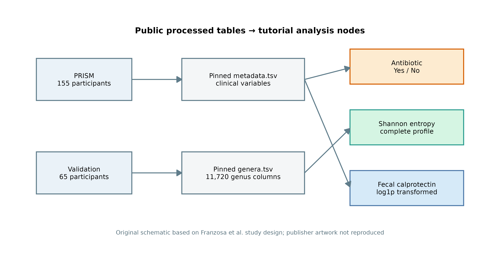
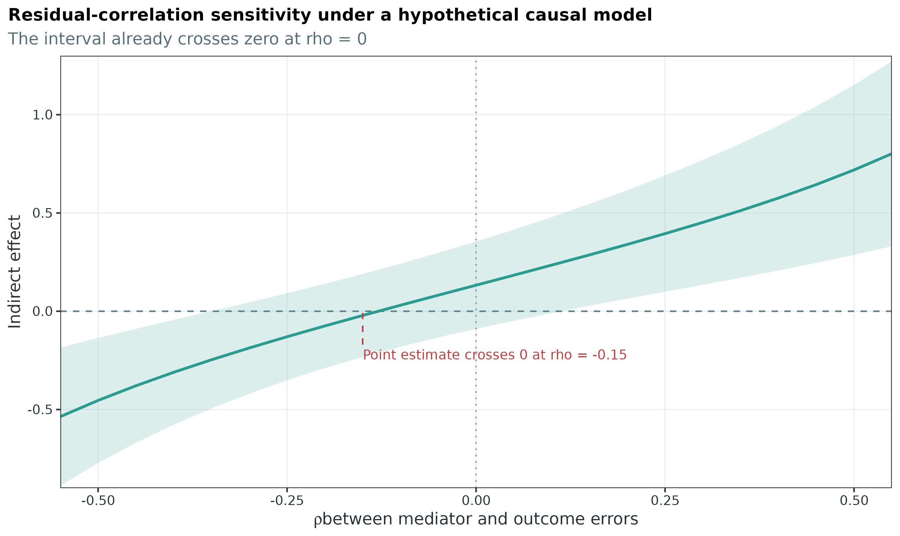
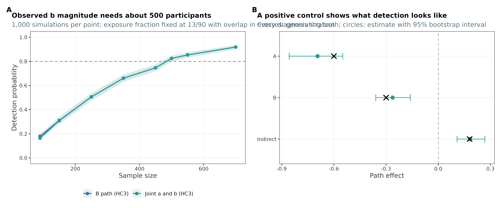

这一章处理一个具体问题：横断面数据能不能支持“抗生素 → 菌群 → 炎症”这样一条链？我们用 Franzosa 等人的 IBD 多组学资源完成一次从公开表格到结果图的分析 [@franzosa2019ibd; @muller2022curatedmultiomics]。

结论是不能。PRISM 的 90 个完整病例里只有 13 名抗生素暴露者，20 名健康对照中没有暴露者；Shannon 到 calprotectin 的区间跨 0，外部队列也没有暴露者。这些限制出现在分析的不同环节，下面从实际输出逐项定位。

## 下载本例数据与分析代码 {#sec-reader-inputs}

[数据与代码清单](https://github.com/petemeng/metagenomics-best-practices/blob/e219a2cd01609cc208a89e291cbd363ed7f2fbd8/examples/71/files.tsv)列出了本例的输入表、分析脚本和环境文件（约 0.8 MiB）。本清单不含原始 FASTQ 或大型数据库；是否需要它们取决于下文的分析起点。清单中的已计算结果仅供核对；读取结果表不等于重新运行统计模型或上游工具。

在新建文件夹中运行下面的 R 代码，下载完成后即可按正文中的相对路径读取文件。需要核验文件版本时，可使用[带完整性检查的下载脚本](https://raw.githubusercontent.com/petemeng/metagenomics-best-practices/54d211859b240c610f61d1a2ae72e605ea96f7f3/examples/71/download.R)。

```{r}
#| label: reader-input-download-71
#| eval: false
options(timeout = 600)
base_url <- "https://raw.githubusercontent.com/petemeng/metagenomics-best-practices/e219a2cd01609cc208a89e291cbd363ed7f2fbd8/"
files <- read.delim(paste0(base_url, "examples/71/files.tsv"))
for (i in seq_len(nrow(files))) {
  path <- files$path[i]
  dir.create(dirname(path), recursive = TRUE, showWarnings = FALSE)
  if (!file.exists(path)) {
    download.file(paste0(base_url, files$source[i]), path, mode = "wb")
  }
}
```

```{r}
#| label: setup-71
#| echo: true
#| results: hide
frozen <- "data/small/71-sem-frozen"
stopifnot(dir.exists(frozen))

read_frozen <- function(name) {
  read.delim(file.path(frozen, name), check.names = FALSE)
}

fmt_num <- function(x, digits = 3) {
  formatC(x, format = "f", digits = digits)
}

fmt_p <- function(x) {
  ifelse(x < 0.001, "<0.001", formatC(x, format = "f", digits = 3))
}

primary <- read_frozen("sem-primary-cohort.tsv")
validation <- read_frozen("sem-validation-cohort.tsv")
stopifnot(
  nrow(primary) == 90,
  sum(primary$Antibiotic) == 13,
  nrow(validation) == 38,
  sum(validation$Antibiotic) == 0
)
```

::: {.callout-tip title="先确定这一点"}

先检查谁能够和谁比较，再拟合路径；良好的拟合指标不能弥补时间顺序和暴露重叠的缺失。

:::

## 这一章用什么数据 {#sec-71-data}

原研究的 Figure 1 定义了 PRISM、NLIBD 和 LifeLines-DEEP 队列以及 shotgun metagenomics、代谢组和粪便 calprotectin 等观测层 [@franzosa2019ibd]。@fig-71-study-data-anchor 进一步表示本次二次分析如何从公开整理表得到三个节点；它是数据流程图，不是原论文提出的因果模型。

{#fig-71-study-data-anchor}

数据来自 `borenstein-lab/microbiome-metabolome-curated-data`，锁定 commit 为 `89a519d8c832008fbc6e650453e83e2f04858d02` [@muller2022curatedmultiomics]。下载脚本逐文件检查字节数和 SHA-256；两个输入合并后应有 220 个独立 subject。

```{r}
#| label: tbl-71-source
source_manifest <- jsonlite::read_json(
  file.path(frozen, "source-manifest.json"),
  simplifyVector = TRUE
)

source_table <- data.frame(
  File = names(source_manifest$resources),
  Size = c("18.1 MB", "39.8 kB"),
  SHA256 = substr(
    vapply(source_manifest$resources, `[[`, character(1), "sha256"),
    1, 12
  ),
  Commit = substr(source_manifest$repository_commit, 1, 12)
)
knitr::kable(source_table, caption = "锁定的公开输入文件")
```

<details class="wechat-omit">
<summary>环境配置与完整运行说明</summary>

普通笔记本即可完成这一章：建议 **2 CPU、8 GB RAM、1 GB 可用磁盘**，首次下载和 5,000 次 bootstrap 通常需要约 **3–8 分钟**。原始 FASTQ 不参与本分析。

```{bash}
#| eval: false
# Python 用于下载、整理和逐文件审计
python -m pip install "numpy>=2.0" "pandas>=2.2"

# R 用于局部模型、稳健协方差、敏感性分析和作图
Rscript -e 'install.packages(c(
  "sandwich", "lmtest", "car", "jsonlite", "mediation",
  "ggplot2", "patchwork", "knitr"
))'

# 一条命令完成下载 → 构建 → 建模 → 作图 → freeze → QA
chmod +x scripts/run_article71_sem_pipeline.sh
ARTICLE71_RUN_ROOT=results/article71-rebuild \
  bash scripts/run_article71_sem_pipeline.sh
```

完整管线使用固定 URL、checksum 和随机种子。

```{bash}
#| eval: false
# 若只想逐步执行，可拆成下面几条命令
python scripts/download_article71_sem_data.py --cache-dir db/sem/article71

python scripts/prepare_article71_sem.py \
  --cache-dir db/sem/article71 \
  --output-dir results/article71-rebuild/prepared

Rscript scripts/run_article71_sem_models.R \
  --input-dir results/article71-rebuild/prepared \
  --output-dir results/article71-rebuild/analysis

Rscript scripts/plot_article71_sem.R \
  --prepared-dir results/article71-rebuild/prepared \
  --analysis-dir results/article71-rebuild/analysis \
  --figure-dir results/article71-rebuild/figures
```

公开表经样本对齐与完整病例筛选后，得到 90 名 PRISM 参与者和 38 名外部队列参与者。下面分别检查节点定义、暴露分布和路径估计。

```{r}
#| label: theme-71
#| eval: false
# 作图函数在单篇内给全，不依赖仓库外部主题文件
pal_pub <- c(
  Exposure = "#D55E00", Microbiome = "#2A9D8F",
  Phenotype = "#4C78A8", Control = "#4C78A8",
  CD = "#E45756", UC = "#59A14F", Neutral = "#9AA5B1"
)

theme_pub <- function(base_size = 11) {
  ggplot2::theme_bw(base_size = base_size) +
    ggplot2::theme(
      panel.grid.minor = ggplot2::element_blank(),
      panel.grid.major = ggplot2::element_line(
        color = "#E9ECEF", linewidth = 0.3
      ),
      axis.text = ggplot2::element_text(color = "#263238"),
      legend.position = "bottom",
      plot.title.position = "plot"
    )
}

save_pub <- function(plot, stem, width = 10.5, height = 5.8) {
  ggplot2::ggsave(paste0(stem, ".pdf"), plot, width = width,
                  height = height, device = grDevices::cairo_pdf)
  ggplot2::ggsave(paste0(stem, ".png"), plot, width = width,
                  height = height, dpi = 360, bg = "white")
  ggplot2::ggsave(paste0(stem, ".tiff"), plot, width = width,
                  height = height, dpi = 360, compression = "lzw")
}
```

</details>

## Shannon 到底算的是什么 {#sec-71-nodes}

这次分析只设三个节点：metadata 里的 antibiotic Yes/No、完整属谱的 Shannon entropy，以及 `log1p(fecal calprotectin)`。先把定义写进表里，再画路径。这样后面出现一个系数时，我们知道它对应哪一个测量和哪一种尺度。

```{r}
#| label: tbl-71-node-definition
node_contract <- read_frozen("node-contract.tsv")
knitr::kable(node_contract, caption = "三个节点的可执行定义")
```

Shannon 使用全部 11,720 个属水平列，零丰度对熵的贡献按 0 处理。下面正是构建脚本里的核心计算；行和检查会在任何一个 profile 没有闭合到 1 时停止。

```{python}
#| eval: false
feature_columns = [c for c in genera.columns if c != "Sample"]
abundance = genera[feature_columns].to_numpy(dtype=float)

assert np.isfinite(abundance).all()
assert (abundance >= 0).all()
assert np.allclose(abundance.sum(axis=1), 1.0, atol=1e-10)

positive = abundance > 0
safe = np.where(positive, abundance, 1.0)
shannon = -(np.where(positive, abundance * np.log(safe), 0.0)).sum(axis=1)
```

{#fig-71-prespecified-dag}

::: {.callout-note title="Shannon 是组成摘要，不是菌群健康分数"}
Relative abundance 受总和为 1 的约束；某个属的比例上升，既可能来自它本身增加，也可能来自其他成员减少 [@gloor2017compositional]。Shannon 把完整组成压成一个数，适合回答“整体均匀度是否变化”，却不包含 absolute biomass，也不告诉我们是哪一组微生物承担了变化。若研究问题落在具体 taxa 或功能组合，应预先定义 CLR/ILR balance、绝对定量指标或专门的组成型中介模型。
:::

## 先看谁能和谁比较 {#sec-71-support}

路径模型不会因为 control 组没有暴露者而拒绝输出。公式照样收敛，所以样本支持要在读系数之前单独检查。

先看从公开数据到分析队列的流失。

```{r}
#| label: tbl-71-attrition
attrition <- read_frozen("sample-attrition.tsv")
knitr::kable(
  attrition[, c("Stage", "Subjects")],
  caption = "从 220 人到建模队列的 attrition ledger"
)
```

PRISM 有 155 人，完整病例留下 90 人。只报“n=90”会漏掉选择过程，因此再比较纳入者和其余 PRISM 参与者。这里报告标准化差异，不用一排缺乏功效的缺失组间 $p$ 值。

```{r}
#| label: tbl-71-complete-case
cc <- read_frozen("prism-complete-case-comparison.tsv")
cc_show <- transform(
  cc[, c(
    "Variable", "IncludedSummary", "ExcludedSummary",
    "ExcludedMissingPct", "StandardizedDifference"
  )],
  ExcludedMissingPct = round(ExcludedMissingPct, 1),
  StandardizedDifference = round(StandardizedDifference, 3)
)
names(cc_show) <- c(
  "Variable", "Included (n=90)", "Excluded (n=65)",
  "Excluded missing, %", "Signed SMD"
)
knitr::kable(cc_show, caption = "PRISM 完整病例与未纳入者的基线比较")
```

Calprotectin 在未纳入者中只观测到 3/65 人，因此它的 SMD 只能当缺失模式提示。疾病构成和 mesalamine 的绝对 SMD 分别达到约 0.38 和 0.47；完整病例不是原始 PRISM 的随机缩小版。

接着看 exposure × diagnosis。

```{r}
#| label: tbl-71-overlap
overlap <- read_frozen("antibiotic-overlap-by-diagnosis.tsv")
overlap$ExposureFraction <- sprintf("%.1f%%", 100 * overlap$ExposureFraction)
knitr::kable(overlap, caption = "PRISM：抗生素暴露按诊断分层")
```

Control 行的 exposed 是 0。若目标人群包含健康对照，数据没有提供健康人内部的暴露比较；抗生素系数主要由 CD 和 UC 患者中的 13 名使用者支撑。

```{r}
#| label: tbl-71-propensity
positivity <- read_frozen("propensity-positivity-audit.tsv")
keep <- c(
  "GLM converged", "Maximum absolute coefficient",
  "Control antibiotic exposed", "Minimum fitted propensity",
  "Maximum illustrative unstabilized weight", "Weights used for inference"
)
knitr::kable(
  positivity[match(keep, positivity$Quantity), ],
  caption = "Propensity 模型只用于暴露支持诊断"
)
```

表里 `converged=TRUE`，最大系数绝对值却是 19.38，最小 fitted propensity 只有 $2.26\times10^{-9}$。这是 diagnosis separation 留下的数值痕迹。本例不把这些 propensity 转成主分析权重：有限 overlap 下，极端权重会进一步放大方差 [@cole2008constructing; @petersen2012positivity]。

::: {.callout-warning title="建议把收敛和 positivity 分开报告"}
拟合 propensity 模型时，同时报告各混杂层的暴露计数、fitted propensity 范围和最大系数绝对值。本例最有信息量的是 control exposed=0，而不是 `converged=TRUE`。
:::

{#fig-71-data-positivity}

## 两个队列共用一把尺子 {#sec-71-scaling}

连续变量用 PRISM 完整病例的 mean/SD 标准化；binary antibiotic 保留 0→1。Validation 直接套用 PRISM 参数，不在外部队列重新计算均值和标准差。

```{r}
#| label: tbl-71-standardization
scaling <- read_frozen("standardization-parameters.tsv")
scaling$Mean <- round(scaling$Mean, 4)
scaling$SD <- round(scaling$SD, 4)
knitr::kable(scaling, caption = "主队列定义的标准化参数")
```

```{r}
#| label: code-71-apply-scaling
shannon_mean <- scaling$Mean[scaling$Variable == "Shannon"]
shannon_sd <- scaling$SD[scaling$Variable == "Shannon"]

# validation 沿用 primary 参数；这里不重新 scale(validation$Shannon)
validation$ShannonZ_check <-
  (validation$Shannon - shannon_mean) / shannon_sd

stopifnot(max(abs(
  validation$ShannonZ - validation$ShannonZ_check
)) < 1e-3) # 表中参数展示到 4 位小数，因此容许相应舍入误差
```

这样，后面的 $a=-0.904$ 可以直接读成：在同一组调整变量下，暴露者的 Shannon 平均低 0.904 个 PRISM 标准差。外部队列里的一个 SD 仍指向同一尺度。

## 把三条箭头写成回归 {#sec-71-local-paths}

现在再引入 $a$、$b$ 和 $c'$：

- $a$：antibiotic → Shannon；
- $b$：调整 antibiotic 后，Shannon → calprotectin；
- $c'$：调整 Shannon 后，antibiotic → calprotectin。

在线性、没有 exposure–mediator interaction 的设定下，间接路径写作 $ab$，总关联满足 $c=c'+ab$。piecewise SEM 在这里就是两个相互衔接的局部回归 [@lefcheck2016piecewisesem]。

```{r}
#| label: code-71-local-models
covariates <- c(
  "CD", "UC", "AgeZ", "Immunosuppressant", "Mesalamine", "Steroids"
)

# 路径 a：antibiotic → Shannon
mediator_formula <- as.formula(paste(
  "ShannonZ ~ Antibiotic +", paste(covariates, collapse = " + ")
))

# 路径 b 和 c'：Shannon + antibiotic → calprotectin
outcome_formula <- as.formula(paste(
  "LogCalprotectinZ ~ Antibiotic + ShannonZ +",
  paste(covariates, collapse = " + ")
))

# 总关联 c：antibiotic → calprotectin
total_formula <- as.formula(paste(
  "LogCalprotectinZ ~ Antibiotic +", paste(covariates, collapse = " + ")
))

mediator_fit <- lm(mediator_formula, data = primary)
outcome_fit <- lm(outcome_formula, data = primary)
total_fit <- lm(total_formula, data = primary)
```

局部系数用 HC3 heteroskedasticity-robust covariance。实际输出如下。

```{r}
#| label: tbl-71-local-paths
local_hc3 <- read_frozen("local-path-coefficients-hc3.tsv")
local_show <- rbind(
  subset(local_hc3, Model == "Microbiome node" & Term == "Antibiotic"),
  subset(local_hc3, Model == "Phenotype node" & Term %in% c("ShannonZ", "Antibiotic")),
  subset(local_hc3, Model == "Total-association node" & Term == "Antibiotic")
)
local_show$Path <- c("a", "b", "c'", "c")
local_show <- local_show[, c(
  "Path", "Term", "Estimate", "RobustSE", "CILower", "CIUpper", "PValue"
)]
local_show[, 3:6] <- round(local_show[, 3:6], 3)
local_show$PValue <- vapply(local_show$PValue, fmt_p, character(1))
knitr::kable(local_show, caption = "三个局部模型的 HC3 推断")
```

抗生素到 Shannon 的估计为 −0.904，区间没有碰到 0。问题出在 $b$：估计值 −0.147，95% CI 从 −0.369 延伸到 0.117。样本支持一个较明确的 exposure–diversity 条件关联，没有给第二段同等精度。

{#fig-71-local-paths}

## 间接效应要整条路径一起重拟合 {#sec-71-indirect}

间接效应是 $a$ 和 $b$ 的乘积。两者来自同一批人，bootstrap 时每轮只抽一次 subject index，再用这批 index 重拟合 mediator、outcome 和 total 三个模型。分别重采 $a$ 和 $b$ 会丢掉两条路径之间的抽样相关性。

```{r}
#| label: code-71-bootstrap
#| eval: false
set.seed(71001 + 1000)
B <- 5000L
boot_paths <- replicate(B, {
  index <- sample.int(nrow(primary), replace = TRUE)
  m_fit <- lm(mediator_formula, data = primary[index, ])
  y_fit <- lm(outcome_formula, data = primary[index, ])
  c_fit <- lm(total_formula, data = primary[index, ])

  a <- coef(m_fit)[["Antibiotic"]]
  b <- coef(y_fit)[["ShannonZ"]]
  direct <- coef(y_fit)[["Antibiotic"]]
  total <- coef(c_fit)[["Antibiotic"]]
  c(A = a, B = b, Direct = direct, Indirect = a * b, Total = total)
})
```

渲染时直接读完整的 5,000 次重拟合记录，并从这些记录重新计算分位数；freeze 文件不是只剩一张汇总表。

```{r}
#| label: tbl-71-path-effects
boot <- read.delim(
  gzfile(file.path(frozen, "sem-path-bootstrap.tsv.gz")),
  check.names = FALSE
)
stopifnot(nrow(boot) == 5000, sum(complete.cases(boot)) == 5000)

effects <- subset(
  read_frozen("path-effect-summary.tsv"),
  Model == "Primary Shannon path"
)
effects_show <- effects[, c(
  "Effect", "Estimate", "CILower", "CIUpper", "BootstrapP",
  "ValidBootstrap"
)]
effects_show[, 2:4] <- round(effects_show[, 2:4], 3)
effects_show$BootstrapP <- vapply(effects_show$BootstrapP, fmt_p, character(1))
knitr::kable(effects_show, caption = "5,000 次整条路径重拟合")
```

$ab=0.133$，95% bootstrap CI 为 −0.109–0.364，$P=0.284$。Direct 和 indirect 的符号相反，因此这里也不计算 proportion mediated；分母接近零或路径异号时，这个比例会非常不稳定。

{#fig-71-path-decomposition}

::: {.callout-important title="这里的 ab 是路径乘积"}
把 $ab$ 解释成反事实中介效应，需要明确 intervention、exposure 先于 mediator、mediator 先于 outcome，以及 sequential exchangeability、consistency 和 positivity [@imai2010general; @tingley2014mediation]。本例的三类数据来自同一次访视，真实用药启动时间也未知，所以正文使用“间接路径”而非“因果中介效应”。
:::

HC3 与 bootstrap 回答的任务不同：前者给单个局部回归系数提供异方差稳健区间，后者传播 $a$、$b$ 和 $c'$ 的联合抽样不确定性。若两套区间在边界附近给出不同判断，应并列报告，而不是挑选其中更显著的一套。

## 删掉 direct path 试试 {#sec-71-graph-test}

Directed separation（d-separation）只检查图里省略的边 [@shipley2009confirmatory]。删掉 antibiotic → calprotectin 后，图提出一条可检验声明：给定 Shannon 和协变量，antibiotic 与 calprotectin 条件独立。

```{r}
#| label: code-71-dsep
constrained_formula <- as.formula(paste(
  "LogCalprotectinZ ~ ShannonZ +", paste(covariates, collapse = " + ")
))
constrained_fit <- lm(constrained_formula, data = primary)

# 被省略的 direct path：在完整 outcome 模型中检验 Antibiotic
dsep_p <- summary(outcome_fit)$coefficients["Antibiotic", "Pr(>|t|)"]
fisher_c <- -2 * log(dsep_p)
fisher_p <- pchisq(fisher_c, df = 2, lower.tail = FALSE)
```

```{r}
#| label: tbl-71-dsep
fit_comparison <- read_frozen("sem-fit-comparison.tsv")
fit_show <- fit_comparison[, c(
  "Model", "AIC", "IndependenceClaims", "FisherC", "FisherDF",
  "FisherP", "Saturated"
)]
fit_show$AIC <- round(fit_show$AIC, 3)
fit_show$FisherC <- round(fit_show$FisherC, 3)
fit_show$FisherP <- ifelse(
  is.na(fit_show$FisherP), NA, sprintf("%.3f", fit_show$FisherP)
)
knitr::kable(fit_show, caption = "图级比较与 directed-separation 输出")
```

Constrained graph 的 Fisher's $C=4.655$，$P=0.098$。这表示当前样本没有在 0.05 水平拒绝那条条件独立声明；13 名暴露者提供的检验功效有限，不能据此宣布“完全中介”。

另一个结果更重要：正向饱和图和 reverse cross-sectional orientation 的 AIC 完全相同，小数点后三位也没有差别。两张图包含相同的骨架，没有新的可检验独立性声明，属于观测数据无法区分的 Markov-equivalent 表达 [@verma1990equivalence]。时间顺序或外部干预信息才能给箭头定向；AIC 在这里做不到。

{#fig-71-model-fit-dsep}

## 敏感性与外部队列能覆盖到哪里 {#sec-71-sensitivity}

### 单样本影响和 exposure support 分开看

Leave-one-out 每次删掉一人，间接路径保持为正，范围是 0.075–0.164。这项检查排除了“一个样本把符号翻过来”的情况。它没有改变 control exposed=0 这一事实，因此正文把它标成 computation stability check。

```{r}
#| label: tbl-71-loo
loo <- read_frozen("leave-one-out-paths.tsv")
loo_summary <- data.frame(
  Quantity = c("Replicates", "Minimum indirect", "Maximum indirect", "Sign changes"),
  Value = c(
    nrow(loo), min(loo$Indirect), max(loo$Indirect),
    sum(sign(loo$Indirect) != sign(mean(loo$Indirect)))
  )
)
loo_summary$Value <- round(loo_summary$Value, 3)
knitr::kable(loo_summary, caption = "Leave-one-out 只检查单样本影响")
```

{#fig-71-overlap-influence}

### Validation 只能检验它有数据的那条边

Validation 的 38 个完整病例中没有 antibiotic exposed，所以 $a$ 和 $c'$ 无法估计。仍可比较同尺度的 Shannon–calprotectin 条件关联：PRISM 为 −0.070，validation 为 0.052，两边区间都很宽。

```{r}
#| label: tbl-71-transport
transport <- read_frozen("outcome-path-transport.tsv")
transport_show <- transport[, c(
  "CohortModel", "N", "AntibioticExposed", "Estimate",
  "CILower", "CIUpper", "PValue"
)]
transport_show[, c("Estimate", "CILower", "CIUpper")] <-
  round(transport_show[, c("Estimate", "CILower", "CIUpper")], 3)
transport_show$PValue <- vapply(transport_show$PValue, fmt_p, character(1))
knitr::kable(transport_show, caption = "外部队列可估计的同变量 outcome path")
```

Faecalibacterium relative abundance 作为预先说明的替代 mediator 时，间接路径为 0.098，95% CI −0.072–0.273；结果仍不精确。这个分析只说明结论没有依赖 Shannon 这一种摘要，并没有解决组成约束。

{#fig-71-transport-sensitivity}

### 未测混杂需要量化假设

若暂时把模型当作因果中介模型，`mediation::medsens()` 可以把 mediator 和 outcome 方程残差相关系数记为 $\rho$，观察间接效应如何随未测混杂增强而变化 [@tingley2014mediation]。本例的间接效应区间在 $\rho=0$ 已经跨 0；点估计在 $\rho=-0.15$ 附近归零。

```{r}
#| label: tbl-71-medsens
rho_summary <- read_frozen("mediation-rho-summary.tsv")
knitr::kable(rho_summary, digits = 4, caption = "残差相关敏感性摘要")
```

{#fig-71-mediation-rho}

下一步工具要由研究问题决定，而不是由哪个包最熟决定：

| 数据与目标 | 可考虑的方法 | 先决条件 |
|---|---|---|
| 单个连续 mediator，目标是反事实 direct/indirect effect | `mediation` 或 `CMAverse` [@tingley2014mediation; @shi2021cmaverse] | 时间顺序、干预定义、顺序交换性和 positivity 可辩护 |
| 预先定义的微生物 balance | CLR/ILR balance；组成型中介模型 [@sohn2019compositional] | 零值处理和 balance 定义预先固定 |
| 高维 microbial mediators | microHIMA 或 LDM-med [@zhang2021microhima; @yue2022ldmmed] | 样本量、稀疏性假设和多重检验方案匹配 |

这些方法扩大了可估计对象，不会补出缺失的治疗时间，也不会替 control 组生成暴露者。

## 用已知真值检查路径估计与效力 {#sec-71-simulation}

真实数据只展示失败，会让人误以为审计流程永远只能得出否定结论。这里增加两个有 ground truth 的模拟：一个回答当前效应量需要多少信息，另一个展示同一套代码在时间顺序和 overlap 已知时能否找回路径。

### 情景化 power 曲线

每个样本量重复 1,000 次。协变量组合从 PRISM 重采，暴露比例固定为 13/90，并在每个 diagnosis stratum 强制保留暴露与未暴露；$a$、$b$、协变量系数和残差标准差使用真实模型的估计值。检测规则是 HC3 双侧 $P<0.05$。

```{r}
#| label: tbl-71-power
power <- read_frozen("path-power-simulation.tsv")
power_b <- subset(power, Target == "B path (HC3)")
power_show <- transform(
  power_b[, c("SampleSize", "Repetitions", "Power", "CILower", "CIUpper")],
  Power = sprintf("%.1f%%", 100 * Power),
  CILower = sprintf("%.1f%%", 100 * CILower),
  CIUpper = sprintf("%.1f%%", 100 * CIUpper)
)
knitr::kable(power_show, caption = "按本例效应量与暴露比例模拟的 b-path power")
```

n=90 时检出率是 18.0%。在本次测试的网格里，n=500 首次超过 80%，估计为 82.5%（Monte Carlo 95% CI 80.0%–84.8%）。这不是通用 SEM 样本量规则；只要暴露比例、效应量、缺失率、聚类结构或协变量分布改变，曲线就要重跑 [@wolf2013samplesize]。

### 有 ground truth 的 positive control

Positive control 生成 500 人，先生成 antibiotic，再生成 Shannon，最后生成 calprotectin；真实参数设为 $a=-0.60$、$b=-0.30$、$c'=-0.15$。三个 diagnosis stratum 都有暴露与未暴露者。

```{r}
#| label: tbl-71-positive-control
positive_overlap <- read_frozen("positive-control-overlap.tsv")
positive_paths <- read_frozen("positive-control-paths.tsv")
positive_paths_show <- positive_paths[
  positive_paths$Effect %in% c("A", "B", "Indirect"),
  c("Effect", "TrueValue", "Estimate", "CILower", "CIUpper")
]
positive_paths_show[, 2:5] <- round(positive_paths_show[, 2:5], 3)

knitr::kable(positive_overlap, caption = "Positive control 的 exposure overlap")
knitr::kable(positive_paths_show, caption = "同一套路径代码对已知真值的恢复")
```

三条目标区间都排除了 0，间接路径估计 0.182，覆盖真值 0.18。正向和反向 AIC 依旧完全相同：模拟器提供的时间顺序、每层 overlap 和路径区间让这个对照通过，AIC 没有承担方向识别的任务。

{#fig-71-power-positive-control}

## 区分路径关联与因果解释 {#sec-71-methods}

<details>
<summary><strong>Methods template（按自己的设计改写后使用）</strong></summary>

> We conducted a cross-sectional piecewise structural-equation analysis using one paired stool profile per participant. The prespecified graph contained antibiotic exposure, genus-profile Shannon entropy, and log1p-transformed fecal calprotectin. Continuous variables were standardized using the PRISM complete-case mean and standard deviation; the same parameters were applied to the validation cohort. Local linear models adjusted for Crohn disease, ulcerative colitis, age, immunosuppressant use, mesalamine use, and steroid use. HC3 covariance estimates were used for local coefficients. Direct, indirect, and total path uncertainty was quantified by 5,000 subject-level bootstrap resamples in which all component models were refitted using the same resampled participants. Exposure support was examined by diagnosis-stratified counts and propensity-score diagnostics. Directed-separation claims, forward/reverse graph AIC, leave-one-out estimates, residual-correlation sensitivity, and same-variable validation-cohort estimates were reported as separate audits. Analyses used R 4.4.1, mediation 4.5.1, sandwich 3.1.0, lmtest 0.9-40, car 3.1-2, ggplot2 3.5.2, and the pinned Franzosa resource commit 89a519d8c832008fbc6e650453e83e2f04858d02. Exposure, microbiome, and phenotype were measured cross-sectionally; path estimates were therefore interpreted as conditional associations.

</details>

<details>
<summary><strong>Results template（本例结果，可替换数值）</strong></summary>

> Ninety PRISM participants met the complete-case definition, including 13 with recorded antibiotic exposure. No exposed participant was present among 20 controls. Antibiotic exposure was associated with lower Shannon entropy (a = −0.904, 95% bootstrap CI −1.466 to −0.357), whereas the adjusted Shannon–calprotectin path was imprecise (b = −0.147, −0.369 to 0.117). The indirect path was 0.133 (−0.109 to 0.364; bootstrap P = 0.284). Forward and reverse saturated orientations had identical AIC values. The validation complete-case cohort contained no exposed participant; its same-variable Shannon–calprotectin coefficient was 0.052 (HC3 95% CI −0.252 to 0.357). These results did not identify a directional or causal mediation effect.

</details>

## 换到自己的研究中，先检查哪些条件？ {#sec-71-own-data}

最低输入是一张“一行一个独立研究单位”的表：

| 字段 | 最低要求 | 推荐升级 |
|---|---|---|
| `sample_id`, `subject_id` | 唯一且可追溯 | 重复测量保留 visit/time |
| exposure | 实测值与对照水平 | 剂量、启动时间、暴露窗口 |
| microbiome | 完整谱表或预先定义节点 | absolute load、CLR/ILR balance、功能节点 |
| phenotype | 独立测量 | 晚于 microbiome 的时间点 |
| confounders | 暴露前变量 | severity、site、batch、diet、baseline medication |
| grouping | cohort/site/batch | cluster bootstrap 或 mixed model 所需 ID |

建议按下面的顺序推进：

| 阶段 | 先做什么 | 保留什么证据 |
|---|---|---|
| 数据设计 | 写清 target population、干预对比和时间顺序 | DAG、采样时间轴、变量字典 |
| 节点构建 | 固定 taxa/功能范围、变换与零值策略 | 节点定义表、代码、版本 |
| 样本支持 | 画 attrition 与分层 exposure counts | 纳入/排除比较、positivity 表 |
| 局部模型 | 为每个响应选择分布和调整集 | 系数、区间、诊断 |
| 路径推断 | 同一重采样单位中重拟合全部模型 | direct/indirect/total 联合分布 |
| 外部验证 | 沿用主队列参数并声明可估计的边 | estimable / not estimable 清单 |

## 图中应该保留哪些信息？ {#sec-71-figures}

所有图都由同一个公开 R 脚本从冻结结果表生成，图内文字为英文，同时导出 PDF、360 dpi PNG 和 LZW TIFF。

```{r}
#| label: code-71-all-figures
#| eval: false
Rscript scripts/plot_article71_sem.R \
  --prepared-dir results/article71-rebuild/prepared \
  --analysis-dir results/article71-rebuild/analysis \
  --figure-dir results/article71-rebuild/figures
```

| 图 | 函数 | 直接读取的结果 |
|---|---|---|
| 71.1 | `study_anchor()` | source manifest 与原创节点示意 |
| 71.2 | `prespecified_dag()` | 预设 DAG 与 timing status |
| 71.3 | `data_positivity()` | attrition、overlap、complete-case SMD |
| 71.4 | `local_paths()` | bootstrap path summary、HC3 coefficients |
| 71.5 | `path_decomposition()` | direct/indirect/total 与 joint bootstrap |
| 71.6 | `model_fit_dsep()` | graph AIC、Fisher's C |
| 71.7 | `overlap_influence()` | propensity audit、leave-one-out |
| 71.8 | `transport_sensitivity()` | validation 与替代 mediator |
| 71.9 | `mediation_rho()` | residual-correlation sensitivity |
| 71.10 | `power_positive_control()` | power simulation 与 positive control |

完整的 10 个 `ggplot2` 函数、配色、panel layout 和三格式导出参数都在 [`scripts/plot_article71_sem.R`](https://github.com/petemeng/metagenomics-best-practices/blob/main/scripts/plot_article71_sem.R)。下面给出 power panel 的主体，展示图中的点、Monte Carlo 区间和 80% 参考线如何从表中直接生成。

```{r}
#| label: code-71-power-plot
#| eval: false
power <- read.delim("path-power-simulation.tsv")
power <- subset(power, Target == "B path (HC3)")

ggplot(power, aes(SampleSize, Power)) +
  geom_hline(yintercept = 0.80, linetype = 2, color = "#C43C39") +
  geom_ribbon(aes(ymin = CILower, ymax = CIUpper),
              fill = "#D6EAF8", alpha = 0.7) +
  geom_line(color = "#4C78A8", linewidth = 0.8) +
  geom_point(color = "#4C78A8", size = 2.2) +
  scale_y_continuous(labels = scales::label_percent()) +
  labs(x = "Sample size", y = "Detection probability",
       title = "Power depends on the planned design") +
  theme_pub()
```

## 回到最初的问题

1. 先把 exposure × 关键混杂因素的计数表放在模型前面。本例 control exposed=0 已经限定了目标人群，propensity 收敛无法改变这个数据结构。

2. 局部路径与整条路径分别报告。$a$ 的区间很窄，$b$ 和 $ab$ 的区间跨 0；“其中一条边显著”不足以支撑间接路径。

3. 饱和路径图没有留出 independence claim。正向和反向 AIC 相同是 Markov equivalence 的预期表现，方向信息应来自采样时间、干预或额外设计。

4. 样本量按计划中的效应、暴露比例、缺失和聚类结构模拟。以本章参数为例，n=90 对 $b$ 的检出率约 18%，而 n=500 才在测试网格中越过 80%。

如果研究目标需要方向性结论，数据表至少要记录 exposure timing、暴露前基线、暴露后的 microbiome，以及更晚时间点的 phenotype。

## 参考文献 {#sec-71-references}

::: {#refs}
:::
