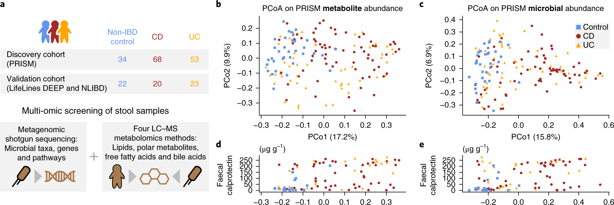
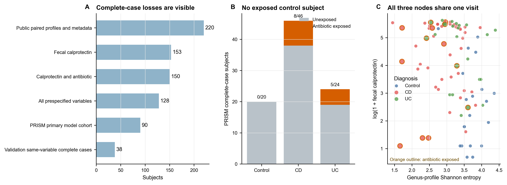
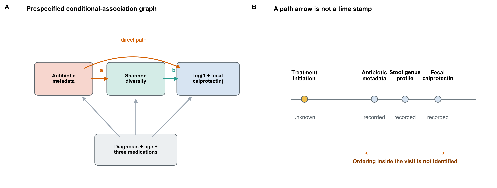
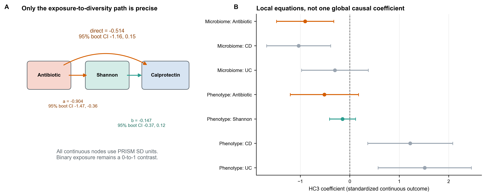
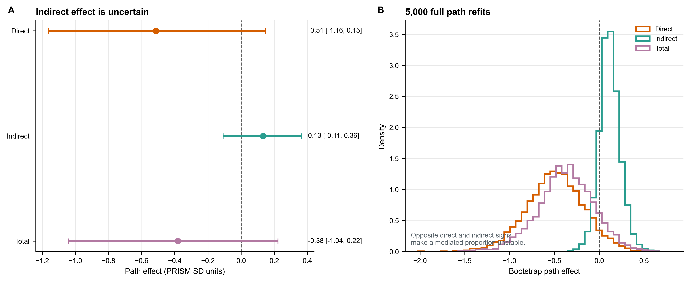
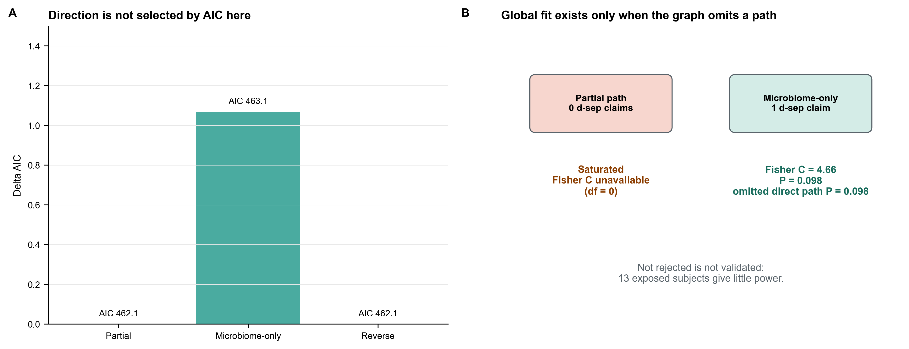
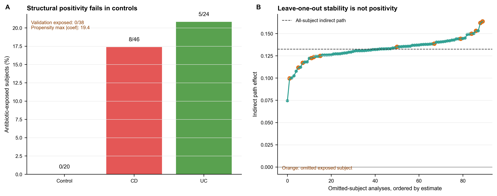
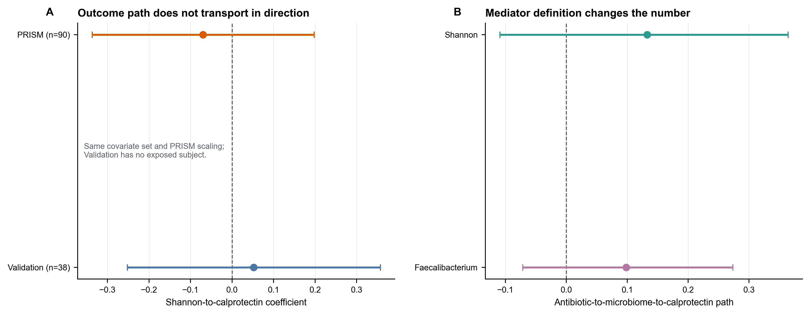

::: {.callout-important title="你还需要什么数据"}
要把自己的问题写成“环境 → 微生物 → 表型”，至少需要同一独立研究单位上的四类信息：**实测环境暴露**（时间、剂量和暴露窗口）、样本级 shotgun 谱表、**独立测量的表型**，以及足以支撑交换性假设的**混杂因素**；重复测量还要 subject/site/batch 标识。若想解释为因果中介，数据采集顺序应明确满足 exposure 先于 microbiome、microbiome 先于 phenotype，并预先规定 target population、干预对比与随访时间。

本例的 antibiotic metadata、粪便属谱和 calprotectin 来自同一次横断面访视，治疗启动时间未知。因此它可以演示 piecewise structural equation model（分段结构方程模型）的统计审计，却**不能识别因果中介**。箭头表示预先提出的条件关联方向，不是已经观测到的时间顺序。
:::

> **先给结论：**PRISM 完整病例共 90 人，只有 13 人记录为 antibiotic exposed，而且没有 antibiotic-exposed control。调整 CD、UC、年龄、immunosuppressant、mesalamine 与 steroids 后，antibiotic → Shannon 路径为 −0.904 个 PRISM 标准差（95% bootstrap CI −1.466–−0.357）；Shannon → log-calprotectin 路径为 −0.147（−0.369–0.117）。两者乘积 indirect=0.133（−0.109–0.364，bootstrap $P=0.284$），并不支持精确的间接路径。

antibiotic 的 direct path 为 −0.514（−1.163–0.145），total association 为 −0.381（−1.040–0.222）。直接与间接路径符号相反，所以不报告 proportion mediated。主图是饱和图，basis set 为空、df=0，不能用全局拟合检验验证方向；把 microbiome 与 phenotype 反向后，AIC 仍完全相同。validation 队列 0/38 人暴露，既不能验证 antibiotic 路径，同变量 Shannon–calprotectin 系数还从 −0.070 变成 0.052。

## 这一步对应论文里的哪张图 {#sec-target}

Franzosa 等人在 IBD 多组学研究 Figure 1 中展示了 PRISM、NLIBD 与 LifeLines-DEEP 队列的设计、疾病分组、shotgun metagenomics、metabolomics 和 fecal calprotectin 等观测层 [@franzosa2019ibd]。本章使用其公开整理资源中的属水平 shotgun profile 与临床 metadata；整理资源锁定于 commit `89a519d...58d02`，对应数据说明见 Muller 等 [@muller2022curatedmultiomics]。

{#fig-71-anchor}

原图给的是**数据结构**，不是“antibiotic → microbiome → inflammation”的时间证据。把 Figure 1 中的观测层抽成路径图之前，必须先写清三个节点的测量、尺度和时序限制。

{#fig-71-data}

## 理论：piecewise SEM 把一张图拆成局部条件模型 {#sec-theory}

### 1. 路径图首先是一组可证伪的条件独立假设

传统 covariance-based SEM 同时拟合整体协方差结构；piecewise SEM 则把有向图翻译成若干**局部条件模型**，每个内生节点使用适合其分布和采样结构的 `lm`、`glm` 或 mixed model [@lefcheck2016piecewisesem]。这使计数、二分类响应、随机截距和相关结构可以放入同一张图，但不会减弱每个局部模型的假设。

本例预先规定：

$$
M = \alpha_M + aA + \boldsymbol{\gamma}_M^T\mathbf C + \varepsilon_M,
$$

$$
Y = \alpha_Y + c'A + bM + \boldsymbol{\gamma}_Y^T\mathbf C + \varepsilon_Y,
$$

其中 $A$ 是 antibiotic indicator，$M$ 是 Shannon diversity，$Y$ 是 $\log(1+\text{calprotectin})$，$\mathbf C$ 包含疾病、年龄与三类药物。连续节点按 PRISM 完整病例标准化；binary exposure 保留 0→1 对比。因此 $a=-0.904$ 的含义是：在模型条件下，从未暴露变为暴露对应 Shannon 相差 −0.904 个 PRISM SD，不是“暴露增加一个 SD”。

{#fig-71-dag}

### 2. d-separation 检查“遗漏的边”，不证明保留的边有因果意义

Directed separation（d-separation）从图中列出 basis set：若某条边被省略，图会声称对应的两个变量在给定指定变量后条件独立。每条独立性声明得到 $p_i$ 后，Shipley 的 Fisher's C 为 [@shipley2009confirmatory]：

$$
C=-2\sum_{i=1}^{k}\log(p_i),\qquad C\sim\chi^2_{2k}.
$$

本例“microbiome-only”约束图省略 antibiotic → calprotectin direct path，只有一个 independence claim；$C=4.655$、df=2、$P=0.098$。这只是“在当前样本中未拒绝该遗漏边”，不是 full mediation 已验证。13 名暴露者带来的低功效完全可能让 basis-set test 看起来合格。

主 partial-path 图和 reverse graph 都保留三节点间的全部必要方向，basis set 为空，属于三节点层面的饱和图。此时 Fisher's C 不可计算；**饱和图的完美拟合不能验证模型正确**，因为它没有留下可检验的遗漏路径。

### 3. 路径乘积是代数分解，不自动等于反事实中介效应

在线性、无 exposure–mediator interaction 的局部模型中，间接路径写成 $ab$，total association 满足：

$$
c=c'+ab.
$$

本例 $a=-0.904$、$b=-0.147$，所以 $ab=0.133$；$c'=-0.514$，$c=-0.381$。代数恒等式成立，不表示 sequential exchangeability、consistency、positivity 或 temporal ordering 已成立。第 69 篇的 potential-outcome mediation 还要求明确 intervention 与 post-exposure mediator；这里同访视数据不满足这个时间合同 [@imai2010general]。

直接路径为负、间接路径为正，属于 inconsistent mediation。此时 $ab/c$ 对分母接近零和抽样波动极敏感，甚至会落在 0–100% 之外。更诚实的报告是分别给 direct、indirect、total 的 estimate 与 interval。

### 4. 微生物节点的尺度属于模型定义

shotgun relative abundance 是 compositional data：一个属的相对丰度变化必然受其余特征和总和约束 [@gloor2017compositional]。本例主节点用全部 11,720 个属列计算 Shannon entropy，避免把某一个 raw proportion 当成普通欧氏变量；但 Shannon 仍受测序深度、检测阈值、profiler 和 database release 影响，也不是“菌群健康”的潜变量。

`Faecalibacterium` sensitivity 使用 `log10(relative abundance + 1e-6)`。它只回答替换 mediator definition 后数值是否大幅改变，不应解释为 absolute biomass 或该物种的机制效应。其 indirect estimate 为 0.098（−0.072–0.273），同样跨 0。

### 5. PLS-PM 与小样本规则不能替代设计

PLS path modeling（PLS-PM）偏向预测与方差解释，适合某些 composite 构建问题；data-driven weights、较高 $R^2$ 或漂亮的 path diagram **不会赋予因果识别**。若把 Shannon、richness 和多个同源 taxa 共同命名为“microbiome health”，却没有 measurement theory、外部效度和预先规定的 reflective/formative 关系，潜变量名称只是在包装同一张谱表。

同样，不应使用“每个参数 10 个样本”决定 SEM 样本量。所需样本随 path magnitude、暴露比例、缺失、聚类、指标可靠性和要检验的 basis set 改变；应按预期数据生成机制做 Monte Carlo power/bias/coverage simulation [@wolf2013samplesize]。本例 90 人和 13 名暴露者只适合展示审计，不足以支持复杂潜变量模型。

## 准备工作 {#sec-preparation}

### 数据谱系、节点合同与算力

| 项目 | 锁定内容 |
|---|---|
| Study | Franzosa IBD 2019；DOI `10.1038/s41564-018-0306-4` |
| Curated resource | `microbiome-metabolome-curated-data` commit `89a519d...58d02` |
| Input | 220 个独立 subject；11,720 个 genus relative-abundance columns |
| Primary cohort | PRISM complete cases，n=90；13 antibiotic exposed |
| Validation | 同变量 complete cases，n=38；0 antibiotic exposed |
| Environment node | metadata antibiotic，Yes=1 / No=0 |
| Microbiome node | 全 genus profile 的 Shannon entropy，按 PRISM SD 标准化 |
| Phenotype node | `log1p(fecal calprotectin)`，按 PRISM SD 标准化 |
| Adjustment | CD、UC、AgeZ、immunosuppressant、mesalamine、steroids |
| Uncertainty | subject-level full-path bootstrap 5,000 次 |
| Seeds | analysis `71001`；plot `20260771` |

冻结结果复核约需 **2 CPU、4 GB RAM、不到 1 分钟**；从已下载的 18 MB genus table 重建队列并完成 5,000 次路径 bootstrap 约需 **2 CPU、8 GB RAM、2–6 分钟**。普通笔记本即可；没有本地 R 环境时可在 HPC 登录节点的短作业或小型云实例运行。原始 FASTQ 不参与本章渲染。

<details>
<summary><strong>安装锁定依赖、下载真实数据，并内联统一作图函数</strong></summary>

```{bash}
#| eval: false
Rscript -e 'install.packages(c(
  "piecewiseSEM", "sandwich", "lmtest", "car",
  "jsonlite", "knitr", "ggplot2"
))'

python scripts/download_article71_sem_data.py \
  --cache-dir db/sem/article71
python scripts/prepare_article71_sem.py \
  --cache-dir db/sem/article71 \
  --output-dir results/article71/prepared
Rscript scripts/run_article71_sem_models.R \
  --input-dir results/article71/prepared \
  --output-dir results/article71/analysis
```

```{r}
set.seed(20260771)

pal_pub <- c(
  "Exposure" = "#D55E00", "Microbiome" = "#2A9D8F",
  "Phenotype" = "#4C78A8", "CD" = "#E45756",
  "UC" = "#59A14F", "Control" = "#4C78A8",
  "Neutral" = "#9AA5B1"
)
scale_color_pub <- function(...) ggplot2::scale_color_manual(values = pal_pub, ...)
scale_fill_pub  <- function(...) ggplot2::scale_fill_manual(values = pal_pub, ...)
theme_pub <- function(base_size = 12) {
  ggplot2::theme_bw(base_size = base_size) + ggplot2::theme(
    panel.grid.minor = ggplot2::element_blank(),
    panel.grid.major = ggplot2::element_line(color = "#ECEFF1", linewidth = 0.3),
    axis.text = ggplot2::element_text(color = "black"),
    legend.key = ggplot2::element_blank(),
    strip.background = ggplot2::element_rect(fill = "#EDF2F4", color = NA),
    plot.title.position = "plot",
    plot.caption = ggplot2::element_text(color = "#455A64", hjust = 0)
  )
}
save_pub <- function(plot, file_base, width = 210, height = 150,
                     units = "mm", dpi = 350) {
  dir.create(dirname(file_base), recursive = TRUE, showWarnings = FALSE)
  ggplot2::ggsave(paste0(file_base, ".pdf"), plot, width = width,
                  height = height, units = units,
                  device = grDevices::cairo_pdf, bg = "white")
  ggplot2::ggsave(paste0(file_base, ".png"), plot, width = width,
                  height = height, units = units, dpi = dpi, bg = "white")
  ggplot2::ggsave(paste0(file_base, ".tiff"), plot, width = width,
                  height = height, units = units, dpi = dpi,
                  compression = "lzw", bg = "white")
  invisible(plot)
}
```

</details>

### 先验收 checksum、样本单位和节点定义

```{bash}
#| eval: false
FROZEN="$PWD/data/small/71-sem-frozen"
sha256sum -c "$FROZEN/file-checksums.sha256"
column -ts $'\t' "$FROZEN/sample-attrition.tsv"
column -ts $'\t' "$FROZEN/node-contract.tsv"
```

```{r}
frozen <- "data/small/71-sem-frozen"
primary <- read.delim(
  file.path(frozen, "sem-primary-cohort.tsv"),
  check.names = FALSE
)
validation <- read.delim(
  file.path(frozen, "sem-validation-cohort.tsv"),
  check.names = FALSE
)

stopifnot(
  nrow(primary) == 90,
  length(unique(primary$Subject)) == 90,
  sum(primary$Antibiotic) == 13,
  sum(primary$Diagnosis == "Control" & primary$Antibiotic == 1) == 0,
  nrow(validation) == 38,
  sum(validation$Antibiotic) == 0,
  all(abs(primary$ProfileSum - 1) < 1e-10)
)

knitr::kable(
  primary[1:5, c(
    "Sample", "Diagnosis", "Antibiotic", "Age",
    "Shannon", "Fecal.Calprotectin"
  )],
  digits = 3,
  caption = "PRISM 主分析队列前 5 个独立 subject"
)
```

这里每个 `Subject` 只出现一次，因此 bootstrap 的单位是 subject。若同一人有多次 stool sample，不能把行当独立个体抽样；应按 subject cluster bootstrap，并在每个局部模型中使用一致的 random-effects/correlation structure。

## 可复制代码：从三节点合同到可审计路径图 {#sec-code}

### 第 1 步：先画 attrition 与 exposure overlap，再拟合模型

```{r}
attrition <- read.delim(
  file.path(frozen, "sample-attrition.tsv"),
  check.names = FALSE
)
overlap <- read.delim(
  file.path(frozen, "antibiotic-overlap-by-diagnosis.tsv"),
  check.names = FALSE
)
knitr::kable(attrition, caption = "Complete-case attrition ledger")
knitr::kable(overlap, digits = 3, caption = "PRISM exposure overlap by diagnosis")
```

220 个公开配对样本中，153 个有 calprotectin，128 个具有全部预设变量；限制到 PRISM 后只剩 90 人。control 组为 0/20 暴露，CD 为 8/46，UC 为 5/24。这个缺口是**结构性 positivity failure**，不是增加协变量、换 link function 或把 propensity score 截断就能修好的数值问题。

### 第 2 步：从完整 relative-abundance profile 构造微生物节点

```{r}
#| eval: false
genera <- read.delim(
  "db/sem/article71/genera.tsv",
  check.names = FALSE
)
feature_columns <- setdiff(names(genera), "Sample")
stopifnot(length(feature_columns) == 11720)

x <- as.matrix(genera[, feature_columns])
storage.mode(x) <- "double"
stopifnot(all(is.finite(x)), all(x >= 0), all(abs(rowSums(x) - 1) < 1e-10))

shannon <- -rowSums(ifelse(x > 0, x * log(x), 0))
detected_genera <- rowSums(x > 0)
```

Shannon 使用自然对数并纳入全部 11,720 列。不要在计算前只保留“显著属”，否则 mediator definition 已经使用 outcome information。属谱必须锁 profiler、taxonomy database、rank collapse、normalization 与版本；即使公式一样，特征宇宙不同也会改变 entropy。

### 第 3 步：只用 primary cohort 参数标准化

```{r}
scales <- read.delim(
  file.path(frozen, "standardization-parameters.tsv"),
  check.names = FALSE
)
knitr::kable(scales, digits = 4, caption = "PRISM-reference scaling parameters")

stopifnot(
  abs(mean(primary$ShannonZ)) < 1e-12,
  abs(sd(primary$ShannonZ) - 1) < 1e-12,
  abs(mean(primary$LogCalprotectinZ)) < 1e-12,
  abs(sd(primary$LogCalprotectinZ) - 1) < 1e-12
)
```

validation 必须沿用 PRISM mean/SD，不能在外部队列重新 z-score 后再声称 coefficient 在同一尺度上。binary antibiotic 不标准化，使路径直接对应 exposed versus unexposed 对比。

### 第 4 步：把图翻译成两个局部回归

```{r}
#| eval: false
library(piecewiseSEM)
library(sandwich)
library(lmtest)
set.seed(71001)

covariates <- c(
  "CD", "UC", "AgeZ", "Immunosuppressant", "Mesalamine", "Steroids"
)
mediator_formula <- as.formula(paste(
  "ShannonZ ~ Antibiotic +", paste(covariates, collapse = " + ")
))
outcome_formula <- as.formula(paste(
  "LogCalprotectinZ ~ Antibiotic + ShannonZ +",
  paste(covariates, collapse = " + ")
))
total_formula <- as.formula(paste(
  "LogCalprotectinZ ~ Antibiotic +", paste(covariates, collapse = " + ")
))

mediator_fit <- lm(mediator_formula, data = primary)
outcome_fit <- lm(outcome_formula, data = primary)
total_fit <- lm(total_formula, data = primary)
primary_sem <- psem(mediator_fit, outcome_fit, data = primary)

lmtest::coeftest(mediator_fit, vcov. = sandwich::vcovHC(mediator_fit, type = "HC3"))
lmtest::coeftest(outcome_fit, vcov. = sandwich::vcovHC(outcome_fit, type = "HC3"))
```

HC3 standard error 处理小样本下可能的异方差；它不会修复遗漏混杂、measurement error 或 positivity。两个局部模型必须使用同一 complete-case row set，不能让 $a$ 和 $b$ 来自不同人群再直接相乘。

```{r}
local_paths <- read.delim(
  file.path(frozen, "local-path-coefficients-hc3.tsv"),
  check.names = FALSE
)
path_show <- subset(
  local_paths,
  (Model == "Microbiome node" & Term == "Antibiotic") |
    (Model == "Phenotype node" & Term %in% c("Antibiotic", "ShannonZ")) |
    (Model == "Total-association node" & Term == "Antibiotic")
)
knitr::kable(
  path_show[, c("Model", "Term", "Estimate", "RobustSE", "CILower", "CIUpper", "PValue")],
  digits = 4,
  caption = "Prespecified local paths with HC3 inference"
)
```

{#fig-71-local}

### 第 5 步：整条路径一起 bootstrap，不只对 $a$ 或 $b$ 做 delta approximation

```{r}
#| eval: false
set.seed(72001)
B <- 5000L
draws <- vector("list", B)
for (iteration in seq_len(B)) {
  index <- sample.int(nrow(primary), nrow(primary), replace = TRUE)
  d <- primary[index, , drop = FALSE]
  fit_m <- lm(mediator_formula, data = d)
  fit_y <- lm(outcome_formula, data = d)
  fit_t <- lm(total_formula, data = d)
  a <- coef(fit_m)[["Antibiotic"]]
  b <- coef(fit_y)[["ShannonZ"]]
  direct <- coef(fit_y)[["Antibiotic"]]
  total <- coef(fit_t)[["Antibiotic"]]
  draws[[iteration]] <- c(
    a = a, b = b, direct = direct,
    indirect = a * b, total = total,
    identity_error = total - direct - a * b
  )
}
draws <- as.data.frame(do.call(rbind, draws))
stopifnot(max(abs(draws$identity_error)) < 1e-10)
quantile(draws$indirect, c(0.025, 0.975))
```

实际冻结分析固定 seed `71001`，bootstrap sampling seed 为 `72001`，5,000/5,000 次 refit 有效。subject-level percentile interval 保留了 $ab$ 的偏斜分布。

```{r}
effects <- read.delim(
  file.path(frozen, "path-effect-summary.tsv"),
  check.names = FALSE
)
knitr::kable(
  effects,
  digits = 4,
  caption = "Path decomposition and mediator-definition sensitivity"
)
```

{#fig-71-decomposition}

### 第 6 步：让被省略的边进入 d-separation 审计

```{r}
#| eval: false
constrained_outcome_fit <- lm(
  LogCalprotectinZ ~ ShannonZ + CD + UC + AgeZ +
    Immunosuppressant + Mesalamine + Steroids,
  data = primary
)
constrained_sem <- psem(
  mediator_fit,
  constrained_outcome_fit,
  data = primary
)
dSep(constrained_sem)
fisherC(constrained_sem)
AIC(primary_sem, constrained_sem)
```

```{r}
fit_audit <- read.delim(
  file.path(frozen, "sem-fit-comparison.tsv"),
  check.names = FALSE
)
dsep_audit <- read.delim(
  file.path(frozen, "directed-separation-claims.tsv"),
  check.names = FALSE
)
knitr::kable(fit_audit, digits = 4, caption = "Graph-level fit audit")
knitr::kable(dsep_audit, digits = 4, caption = "Testable omitted path")
```

primary partial-path 与 reverse orientation 的 AIC 都是 462.062；两者只是把同一组三节点 local equations 的响应/预测方向重新组织，不能从 AIC 学出方向。constrained microbiome-only graph 的 AIC=463.131，Fisher's C $P=0.098$；“没有拒绝”既不等于“完全中介”，也不抵消直接路径估计本身的不确定性。

{#fig-71-fit}

### 第 7 步：把 positivity、影响点与可迁移性放在同一审计表

```{r}
positivity <- read.delim(
  file.path(frozen, "propensity-positivity-audit.tsv"),
  check.names = FALSE
)
diagnostics <- read.delim(
  file.path(frozen, "local-model-diagnostics.tsv"),
  check.names = FALSE
)
vif <- read.delim(
  file.path(frozen, "variance-inflation.tsv"),
  check.names = FALSE
)
knitr::kable(positivity, digits = 4, caption = "Positivity/propensity diagnostic")
knitr::kable(diagnostics, digits = 4, caption = "Local-model diagnostics")
stopifnot(max(vif$VIF) < 3.1)
```

propensity GLM technically converged，但 maximum absolute coefficient=19.38、minimum fitted propensity=$2.3\times10^{-9}$；这是 separation 的数值表现。因为 control 中没有暴露、validation 队列 0/38 暴露，主分析不使用该权重。强行 IPTW 只会把有限 overlap 包装成极端权重，不会创造缺失的 exposed controls。

7–8 个 observation 超过 Cook's distance $4/n$ screening threshold；leave-one-out indirect path 为 0.075–0.164，始终为正。这个稳定性只说明没有单一样本翻转 $ab$，不修复结构性 positivity、时间顺序或遗漏混杂。

{#fig-71-overlap}

### 第 8 步：外部队列只能验证它真正覆盖的路径

```{r}
transport <- read.delim(
  file.path(frozen, "outcome-path-transport.tsv"),
  check.names = FALSE
)
knitr::kable(
  transport,
  digits = 4,
  caption = "Same-variable Shannon-to-calprotectin transport check"
)
```

validation 没有 antibiotic-exposed subject，所以 exposure → microbiome、direct 和 total path 都不可估。唯一可做的是复用同一 covariate set 与 PRISM scaling，检查 constrained Shannon → calprotectin association：PRISM 为 −0.070（−0.337–0.198），validation 为 0.052（−0.252–0.357），方向改变且都不精确。不能把“validation 数据存在”写成“整个 SEM 已外部验证”。

{#fig-71-transport}

## 从路径系数到可识别性：审计与升级 {#sec-audit}

### 先忠实复现可检验的路径范式

分析先规定 antibiotic、Shannon 与 log-calprotectin 三节点，疾病、年龄和三类 medication 同时进入两个 endogenous-node equations。使用 `piecewiseSEM 2.3.0.1` 组织图与 d-separation，以 `sandwich 3.1.0`/`lmtest 0.9-40` 给出 HC3 local inference，以 `car 3.1-2` 审计 VIF；5,000 次 subject bootstrap 同时 refit mediator、outcome 与 total models。所有节点、complete-case rule、standardization reference 与 seed 均在拟合前锁定。

### 今天必须加上的七层审计

1. **测量合同**：environment 不是模糊的“生活方式”，而是 Yes/No antibiotic metadata；microbiome 是全属谱 Shannon；phenotype 是独立测得的 fecal calprotectin。
2. **时间合同**：记录 exposure start、stool collection 与 outcome assessment；没有时间顺序时只写 conditional path association。
3. **样本合同**：一人一行；多访视按 subject/site 层级建 mixed model，并在全部 local equations 中保持一致结构。
4. **overlap/positivity**：在调整前画 exposure × key confounder table；本例没有 antibiotic-exposed control，故 population-averaged intervention effect 不可由加权挽救。
5. **图级可证伪性**：报告 basis set、d-separation claims 与 Fisher's C；饱和图明确标记“global fit unavailable”。
6. **不确定性与影响点**：整路径 bootstrap、HC3、Cook/VIF/condition number、leave-one-subject-out 和 mediator-definition sensitivity 同时保留。
7. **运输边界**：外部队列逐条检查 node/scale/exposure support；覆盖不了的 path 写成 not estimable，而不是默认通过。

### 为什么显著的 $a$ path 仍不能写成机制链

antibiotic–Shannon association 较精确，却可能同时承载 indication、disease severity、hospitalization、diet、bowel preparation、其他药物和 reverse timing。把疾病类型与三类药物放进模型只处理已测、按当前形式指定的 confounders；它不能排除未测 severity，也不能判断 antibiotic metadata 发生在 stool collection 前多久。

$b$ path 在 primary 不精确，在 validation 还改变方向；$ab$ interval 跨 0。即使三条路径都显著，cross-sectional graph 仍可能由 $Y\rightarrow M$、共同原因或 selection 构成。下一步应是有明确时间轴的 repeated-measures cohort、treatment initiation 前 baseline、post-exposure microbiome、later phenotype、negative-control windows，以及必要时的 target-trial emulation，而不是继续增加同访视箭头。

### 什么时候可以升级为更复杂的 SEM

- response 非 Gaussian 时，在对应 local equation 使用合适的 `glm`/`glmm`，并检查 link-scale interpretation；
- repeated samples 用 random intercept/slope 或相关结构，不能只加 subject fixed effect 后忽略 cluster uncertainty；
- latent variable 必须有多指标 measurement model、reliability 与 external validity，不把同一 compositional profile 的多个变换当独立证据；
- feedback/cyclic graph 需要时间分辨数据和可识别的动态模型，不能在同一 cross-section 中画 reciprocal arrows；
- 样本量用预设 path、暴露 prevalence、missingness、cluster size 与 desired coverage 做 simulation，不依赖参数数目的经验倍数；
- 若目标是 causal mediation，回到 intervention、potential outcomes、post-exposure confounding 与 sequential ignorability 的设计语言，而不是靠 SEM 软件名称升级因果措辞。

## 出版级美化 {#sec-publication}

一张可投稿的 SEM 图应让读者区分**设计、估计与警报**：

- node label 写实际变量与变换，不写笼统的 “Environment”“Microbiome health”；
- arrow 上同时给 standardized coefficient 与 95% interval，不能只用线宽和星号；
- binary exposure 注明是 0→1 contrast，continuous nodes 注明 reference SD；
- direct、indirect、total 分开画，符号相反时不要给 mediated percentage；
- saturated graph 明示 “0 d-sep claims / global fit unavailable”；
- exposure support 用 counts 而非 propensity-density 的视觉平滑掩盖 0 cells；
- validation 图逐路径注明 `estimable`/`not estimable`；
- primary、sensitivity、validation 使用固定颜色语义，而不是用红绿表达真假；
- 图内全部英文，导出 vector PDF、360 dpi PNG 与 LZW TIFF；图注写清 n、bootstrap unit、transform、adjustment 和 CI 类型。

本章橙色代表 exposure/警报，青色代表 microbiome path，蓝色代表 phenotype/validation，灰色代表 adjustment 或未验证项。路径方向的颜色不表达因果强度。

## 常见坑 {#sec-pitfalls}

::: {.callout-caution title="箭头画成环境→菌群→表型，所以顺序已经成立"}
箭头是先验假设。若三类数据来自同一访视且 treatment start 未知，reverse path 与共同原因仍相容；本例正是这种情况。
:::

::: {.callout-caution title="Fisher's C 不显著，所以模型被验证"}
不显著可能来自正确的条件独立，也可能来自样本少和功效低。饱和图甚至没有 basis-set claim，不能把“无检验”写成完美拟合。
:::

::: {.callout-caution title="把 direct path 删掉，P=0.098 就是完全中介"}
这是被省略 direct path 的条件独立检验未拒绝。13 名暴露者下的低功效、结构性 positivity 与时间不明都还在；应并列报告 constrained 与 partial graph。
:::

::: {.callout-caution title="propensity model converged，可以 IPTW"}
control 中 0 人暴露导致 diagnosis-related separation；极端 fitted propensity 与大 coefficient 已发出警报。数值收敛不等于有可比较人群。
:::

::: {.callout-caution title="把 relative abundance 当作绝对微生物负荷"}
Faecalibacterium sensitivity 是 log-transformed relative abundance，受 compositional closure 影响。若科学问题是 biomass 或 absolute load，需要 spike-in、qPCR/flow cytometry 等额外测量。
:::

::: {.callout-caution title="单独 bootstrap indirect effect 的现成公式"}
$a$、$b$ 与 $c'$ 来自同一批 subject，存在联合抽样不确定性。应在每次 bootstrap 中同时重采 subject 并 refit 全部 local equations。
:::

::: {.callout-caution title="leave-one-out 稳定，所以模型稳健"}
它只排查单一 observation 支配。本例 indirect path 始终为正，仍无法修复 0 exposed controls、未测 severity、同访视顺序与外部 exposure 缺失。
:::

::: {.callout-caution title="PLS-PM 在小样本也能跑，所以适合复杂潜变量"}
算法能返回权重不等于 measurement model 合理，也不代表 bias、coverage 和 path power 足够。用预注册构念与 Monte Carlo simulation 决定设计。
:::

## 这段 Methods 怎么写 {#sec-methods}

> We conducted a cross-sectional piecewise structural equation analysis using paired genus-level shotgun-metagenomic profiles and clinical metadata from the Franzosa inflammatory-bowel-disease resource (curated-resource commit `89a519d8c832008fbc6e650453e83e2f04858d02`). The primary cohort comprised 90 PRISM participants with complete fecal-calprotectin, antibiotic, age, diagnosis, immunosuppressant, mesalamine, and steroid data; 13 participants were antibiotic exposed. The environmental node was contemporaneous antibiotic metadata (yes versus no), the microbiome node was Shannon entropy calculated over all 11,720 genus relative-abundance features, and the phenotype node was log(1 + fecal calprotectin). Age, Shannon entropy, and log-calprotectin were standardized using means and standard deviations from the PRISM primary cohort; antibiotic exposure remained a binary 0-to-1 contrast. We fitted `Shannon ~ antibiotic + covariates` and `log-calprotectin ~ antibiotic + Shannon + covariates`, adjusting both endogenous nodes for Crohn's disease, ulcerative colitis, standardized age, immunosuppressant use, mesalamine use, and steroid use. Local coefficients used HC3 standard errors. Indirect effects were calculated as the product of the antibiotic-to-Shannon and Shannon-to-calprotectin paths, with 95% percentile intervals from 5,000 subject-level bootstrap refits (seed 71001). A constrained graph omitting the direct antibiotic-to-calprotectin path was evaluated using directed-separation claims and Fisher's C. Positivity was examined before modeling by cross-tabulating exposure within diagnosis; influence, mediator-definition, reverse-orientation, and same-variable validation-cohort analyses were prespecified sensitivity checks. Analyses used R 4.4.1, piecewiseSEM 2.3.0.1, sandwich 3.1.0, lmtest 0.9-40, car 3.1-2, and jsonlite 1.8.8.

结果句可写：

> Antibiotic exposure was conditionally associated with lower genus-profile Shannon diversity (standardized path coefficient −0.904, 95% bootstrap CI −1.466 to −0.357). The conditional Shannon-to-log-calprotectin path was −0.147 (−0.369 to 0.117), yielding an indirect path estimate of 0.133 (−0.109 to 0.364; bootstrap P=0.284). The direct path was −0.514 (−1.163 to 0.145), and the total association was −0.381 (−1.040 to 0.222). The constrained graph that omitted the direct path was not rejected by the directed-separation test (Fisher's C=4.655, df=2, P=0.098), but only 13 participants were exposed, no exposed controls were observed, and no exposed participant was available in the validation cohort. Because treatment initiation, microbiome profiling, and phenotype assessment lacked a verified temporal ordering, coefficients were interpreted as conditional path associations rather than causal mediation effects.

最后一句不能删。它把 coefficient、graph-fit diagnostic 和识别边界分开，避免把横断面路径分析写成 antibiotic 通过菌群改变炎症的机制证据。

## 换成你自己的数据怎么做 {#sec-own-data}

### 最低输入结构

每行应对应一个独立分析单位或一个明确的 subject–visit，至少包含：

| Column group | 必需内容 | 审计重点 |
|---|---|---|
| ID/time | `subject_id`, `visit_id`, collection time | cluster、先后顺序、重复测量 |
| Environment | exposure、dose、start/stop、window | 0→1 或剂量 estimand、positivity |
| Microbiome | count/profile table、feature IDs | profiler/database、depth、composition |
| Phenotype | independently measured outcome | transform、assay、outcome window |
| Confounders | baseline disease severity、site、diet、medications 等 | exposure–mediator 与 mediator–outcome 两组混杂 |
| Technical | batch、library、run、storage | 是否需进入 local models |
| Hierarchy | household/site/center/subject | random effect 与 bootstrap unit |

### 实施顺序

1. 先写 target population、environment intervention/contrast、microbiome node、phenotype 和时间点；
2. 画 DAG，区分 baseline confounder、post-exposure confounder、mediator 与 outcome；
3. 锁定 profiler/database、feature rank、normalization、zero handling 和检测阈值；
4. 在 outcome-free 阶段定义 Shannon、balances、pathway score 或预注册 taxon，不按 outcome 筛 mediator；
5. 画完整病例 attrition 与 exposure × key confounder overlap，0 cell 先于回归处理；
6. primary/reference cohort 决定 transform 与 scaling，validation 沿用同一参数；
7. 每个 endogenous node 选择与分布、cluster 和 repeated measures 相容的 local model；
8. 输出每条 local coefficient、uncertainty、residual/influence/VIF 与 explained variance；
9. 列出 basis set，报告每条 d-separation claim、Fisher's C 与 saturated status；
10. 按 subject/site 合理重采，整张路径图 bootstrap；
11. 比较 reverse orientation、direct-path constrained graph、alternate microbiome definition 与 negative controls；
12. 外部验证逐条核对 node、scale、exposure support 与 covariate availability；
13. 用 Monte Carlo simulation 评估 path power、bias、coverage、missingness 与 exposure prevalence；
14. 若要因果措辞，确保 exposure→microbiome→phenotype 的时间合同，并处理 exposure-induced mediator–outcome confounding；
15. 同时提交 node contract、attrition、overlap table、model formulas、software/database versions、seed 和 frozen outputs。

若数据只有一次横断面 shotgun profile 与一次表型，最稳妥的产出是“预设图下的条件路径关联与替代图审计”。如果 treatment timing、baseline、post-exposure mediator 和 later outcome 缺失，正确升级是补采数据，而不是给箭头加粗。

## 参考 {#sec-references}

- Franzosa IBD shotgun/metabolomics study 与公开整理资源：[@franzosa2019ibd; @muller2022curatedmultiomics]
- piecewise SEM、局部估计与 d-separation：[@lefcheck2016piecewisesem; @shipley2009confirmatory]
- 反事实 causal mediation 与路径乘积的识别边界：[@imai2010general]
- 微生物相对丰度的 compositional 约束：[@gloor2017compositional]
- SEM 样本量的 simulation 证据：[@wolf2013samplesize]

::: {#refs}
:::
