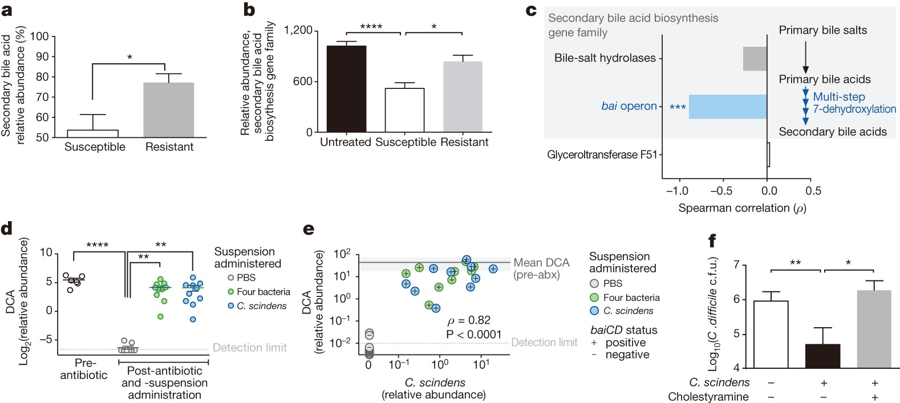
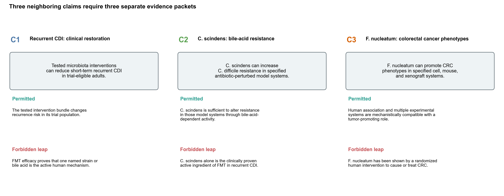
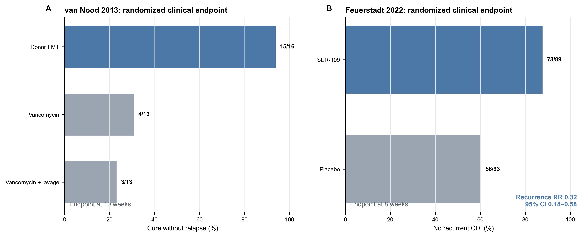
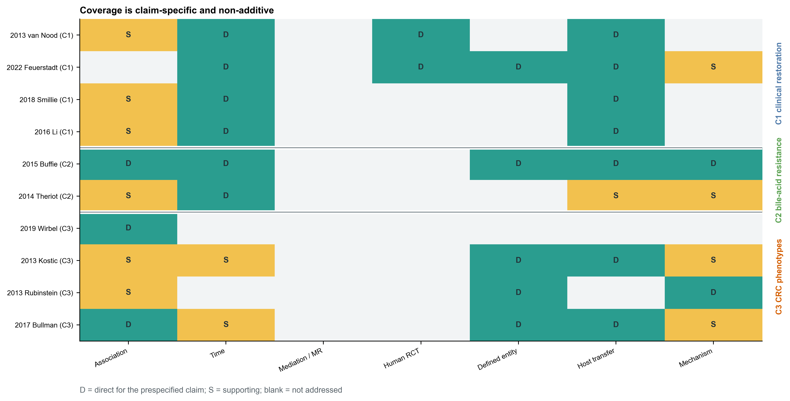
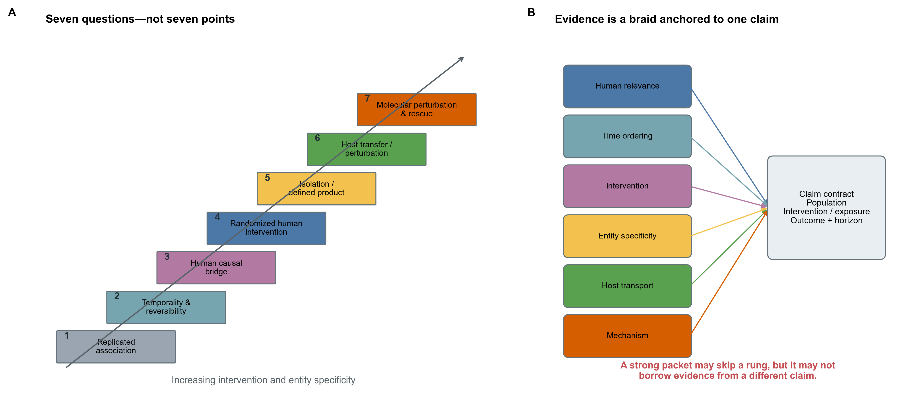
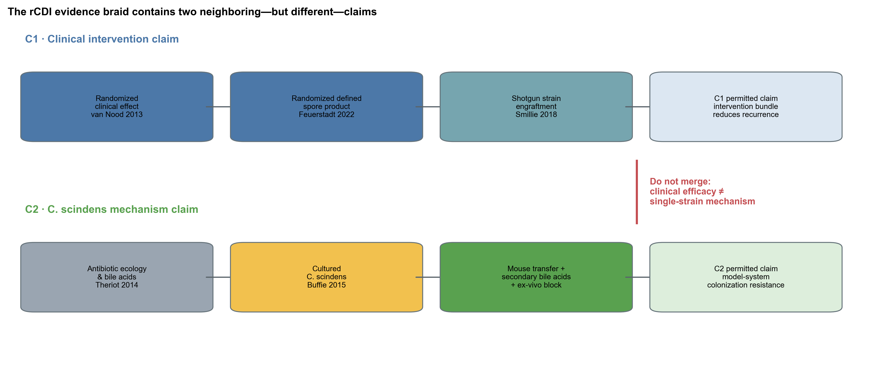
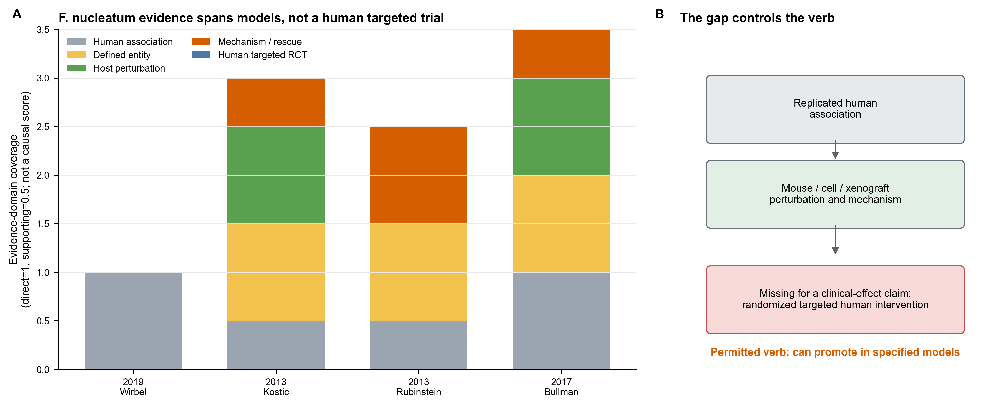
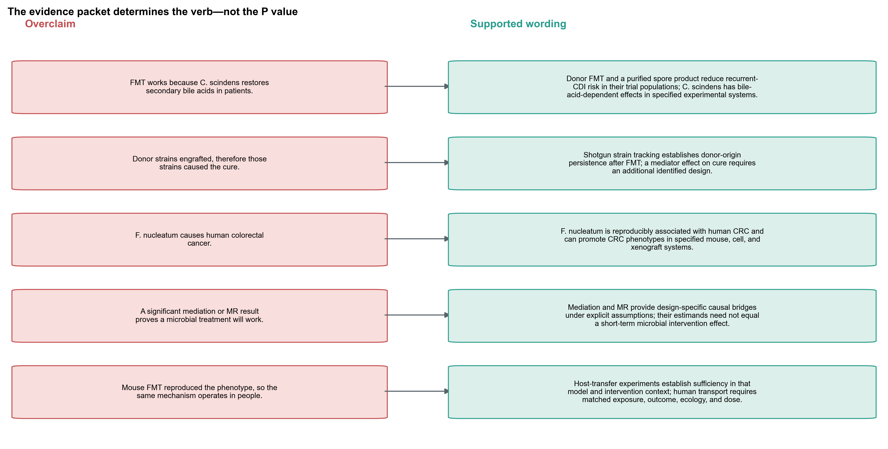
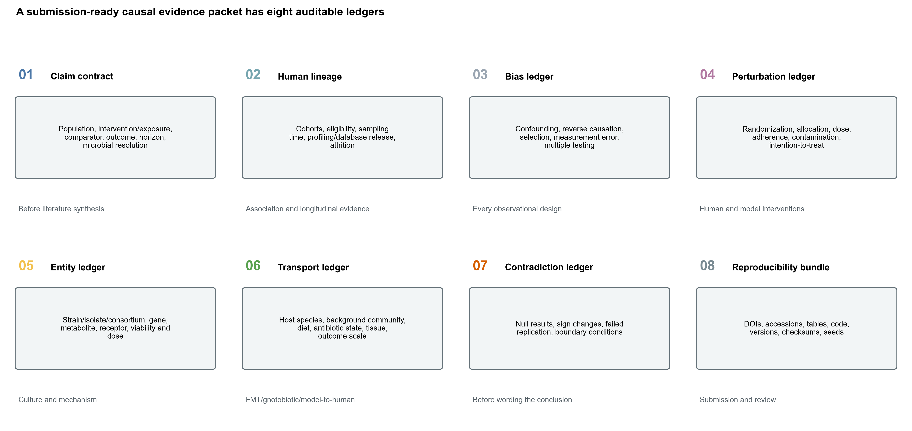

> **先给结论：**因果证据不是“关联 1 分、纵向 2 分、动物 3 分、RCT 7 分”的累计游戏。同一篇研究可以直接支持一个很窄的 claim，同时对旁边的 claim 完全没有信息。最先要锁定的不是统计方法，而是：**对谁、改变什么、与什么比较、看哪个结局、在多长时间内、微生物实体精确到什么层级。**

本章整理 10 篇 landmark primary studies，并用一篇 commensal Koch's postulates 框架文献定义审计维度 [@neville2018commensalkoch]。它是用于教学的 claim-specific evidence map，不是穷尽检索的 systematic review，也不估计 pooled effect 或 publication bias。三个 claim 必须分开：

1. 特定 donor-derived microbiota intervention 能否降低 recurrent *Clostridioides difficile* infection（rCDI）短期复发；
2. 培养的 *Clostridium scindens* 能否在指定实验系统中通过 secondary bile acid activity 增强 colonization resistance；
3. tumor-associated *Fusobacterium nucleatum* 能否在指定 cell/mouse/xenograft system 中促进 CRC phenotype。

第一个 claim 有人体随机干预；第二个有培养、host transfer 和 bile-acid-dependent inhibition；第三个有跨队列关联、动物/细胞/xenograft perturbation 与分子阻断，但没有 targeted randomized human CRC intervention。把它们压成一句“菌群已被证实导致疾病”会同时丢失 intervention、host、outcome 和 mechanism 的边界。

## 这一步对应论文里的哪张图 {#sec-target}

Buffie 等人的 Figure 4 是一张很好的机制链锚点 [@buffie2015cscindens]：antibiotic-susceptible 与 resistant mice 的 secondary bile acid abundance 不同；secondary-bile-acid biosynthesis gene family 与 susceptibility 相关；adoptive transfer 后 *C. scindens* abundance 与 deoxycholate（DCA）相连；ex-vivo inhibition 在 bile sequestration 后改变。

{#fig-72-anchor}

这张图把 association、defined organism、transfer、metabolite 和 functional perturbation 放在同一工作流中，却没有测试“给 rCDI 患者单独使用 *C. scindens* 能否减少复发”。人体 FMT 或 purified-spore RCT 也没有把 *C. scindens* 随机化。两组证据能够形成 triangulation，不能拼成一个未被任何研究直接测试的 treatment effect。

## 理论：七级阶梯其实是七个不同问题 {#sec-theory}

### 1. 先写 claim contract，再谈证据强弱

可审计的 claim 至少是六元组：

$$
\mathcal C=(P, I/E, C, O, T, U),
$$

其中 $P$ 是 target population，$I/E$ 是 intervention 或 exposure，$C$ 是 comparator，$O$ 是 outcome，$T$ 是 time horizon，$U$ 是 microbial unit（community、species、strain、gene、metabolite 或 product）。只要其中一项改变，就是另一个 claim。

“FMT 降低 rCDI 复发”和“*C. scindens* 通过 secondary bile acids 提供 colonization resistance”至少在 intervention、host、outcome 和 time horizon 上不同；不能因为生物学叙事连贯，就把一个 claim 的 RCT 证据借给另一个 claim。

{#fig-72-claims}

### 2. 关联回答“共同出现”，纵向才开始回答“先后变化”

跨队列 replicated association 可以排除“只在一个批次或人群出现”的简单解释，却不能排除 reverse causation、selection、treatment、diet 或 measurement artifact。CRC stool signature 在八个队列、768 个 metagenomes 中可迁移，支持 population-level reproducibility [@wirbel2019crc]；它不说明某个 taxon 在肿瘤发生前已经改变。

纵向设计增加时间顺序与 within-person change。FMT 后的 shotgun SNV/strain tracking 能判断 donor strain 是否出现、持续多久、与 recipient strain 如何共存 [@li2016fmtstrains; @smillie2018engraftment]。但是 post-treatment engraftment 同时受 dose、baseline niche、host compatibility 与 clinical course 影响；把“engrafted”直接写成“mediated cure”仍需额外识别条件。

### 3. 中介与 MR 是换了一套偏倚结构，不是“准实验通行证”

Mediation 需要 exposure–mediator–outcome 的时间合同、sequential exchangeability、positivity 与 mediator measurement；横断面 path product 不满足这些条件 [@imai2010general]。MR 用 host genetic variants 代理 exposure，核心是 relevance、independence 与 exclusion restriction；horizontal pleiotropy、weak instruments、population structure 和 microbial phenotype heterogeneity 仍可破坏解释 [@sanderson2022mr].

它们的价值来自**不同偏倚结构的 triangulation**。一个 observational association、一个 mediation estimate 和一个 MR estimate 同向，不等于三票表决；应逐项问它们是否共享同一 target population、microbial unit、outcome scale 和干预版本。

### 4. 人体随机干预识别的是被随机化的 intervention bundle

Randomization 可以平衡 baseline causes，并在 adherence、contamination、loss to follow-up 与 endpoint definition 被正确处理时识别 assignment effect。它不能自动拆分复合干预的 active component。

van Nood 等将 rCDI 患者随机到 donor-feces infusion、vancomycin 或 vancomycin + lavage；overall cure without relapse 分别为 15/16、4/13、3/13 [@vannood2013fmt]。ECOSPOR III 将 182 人随机到 SER-109 或 placebo，week-8 recurrence 为 11/89 与 37/93，RR=0.32（95% CI 0.18–0.58）[@feuerstadt2022ser109]。这两项试验直接支持各自 protocol/product 的 clinical effect；它们不共同随机化某一个 strain、bai operon 或 secondary bile acid。

{#fig-72-human-rct}

### 5. 培养与 defined product 把“谱表标签”变成可操纵实体

从 MetaPhlAn species abundance 到纯培养 strain，中间要跨过 strain heterogeneity、viability、dose、growth condition、gene content 和 expression。Commensal Koch's postulates 强调：候选菌与表型关联、可培养、引入易感 host 后改变表型、并能在恢复后的 host 中重新检测 [@neville2018commensalkoch]。

定义清楚并不等于临床有效。pure isolate、defined consortium、spore fraction 与 whole-stool FMT 是不同 treatment versions；即使都富含 Firmicutes，也不能假设 dose、engraftment 或 metabolites 相同。

### 6. FMT/无菌鼠/易感 host 检查 sufficiency，但 transport 不是自动的

Host-transfer experiment 可以测试一个 community 或 isolate 在特定 recipient ecology 中是否足以改变 phenotype。Germ-free/gnotobiotic model 降低背景复杂度，有利于机制分解，也可能放大正常 human gut 中被竞争、饮食和免疫状态调节的效应。

需要同时记录 donor、recipient、antibiotic pretreatment、diet、housing、host genotype、community context、dose 与 outcome。人源 FMT 在 mouse 中转移 phenotype，最稳妥的动词是“transferred in this model”，不是“caused the human disease”。

### 7. 分子 perturbation + rescue 才把路径压到 gene/metabolite/receptor

分子机制的强证据通常包括 loss-of-function、specific inhibitor、receptor block、complementation 或 metabolite add-back。Rubinstein 等把 *F. nucleatum* 的 FadA adhesin、E-cadherin binding 与 beta-catenin signaling 连起来，并用 E-cadherin-derived peptide 阻断 induced growth/signaling [@rubinstein2013fada]。这支持指定 cell/tissue context 的 pathway specificity；它不估计 FadA-targeted intervention 对人群 CRC incidence 的 effect。

{#fig-72-coverage}

## 准备工作 {#sec-preparation}

### 真实来源、提取单位与算力

| 项目 | 锁定内容 |
|---|---|
| Bibliographic source | Crossref REST API canonical metadata；11 DOI |
| Primary evidence | 10 landmark primary studies；one publication × one claim per row |
| Framework | Neville et al. commensal Koch's postulates |
| Claim contracts | C1 rCDI clinical restoration；C2 *C. scindens* mechanism；C3 *F. nucleatum* CRC phenotypes |
| Coverage codes | `Direct` / `Supporting` / `Not addressed` |
| Human randomized studies | 2（van Nood 2013；Feuerstadt 2022） |
| Shotgun strain-resolved studies | 3（Smillie、Li、Bullman） |
| Anchor | Buffie Figure 4；1,578 × 707 px；SHA-256 `aaa4276...792c9` |
| Seeds | analysis `72001`；plot `20260772` |

冻结账本复核与作图约需 **2 CPU、4 GB RAM、不到 1 分钟**。扩展成正式 systematic review 的门槛不在 RAM，而在 protocol registration、双人筛选/提取、risk-of-bias assessment、完整检索式、灰色文献和 contradiction tracking；不能用更多 CPU 替代这些步骤。

<details>
<summary><strong>下载 DOI 元数据、重建账本，并内联统一作图函数</strong></summary>

```{bash}
#| eval: false
python scripts/download_article72_evidence.py \
  --cache-dir db/evidence/article72
python scripts/prepare_article72_evidence.py \
  --cache-dir db/evidence/article72 \
  --output-dir results/article72/evidence
python scripts/plot_article72_evidence.py \
  --input-dir results/article72/evidence \
  --figure-dir figures
```

```{r}
set.seed(20260772)

pal_pub <- c(
  "Direct" = "#2A9D8F", "Supporting" = "#F2C14E",
  "Not addressed" = "#F2F4F5", "Human" = "#4C78A8",
  "Culture" = "#F2C14E", "Transfer" = "#59A14F",
  "Mechanism" = "#D55E00", "Risk" = "#C44E52"
)
scale_color_pub <- function(...) ggplot2::scale_color_manual(values = pal_pub, ...)
scale_fill_pub  <- function(...) ggplot2::scale_fill_manual(values = pal_pub, ...)
theme_pub <- function(base_size = 12) {
  ggplot2::theme_bw(base_size = base_size) + ggplot2::theme(
    panel.grid.minor = ggplot2::element_blank(),
    panel.grid.major = ggplot2::element_line(color = "#ECEFF1", linewidth = 0.3),
    axis.text = ggplot2::element_text(color = "black"),
    legend.key = ggplot2::element_blank(),
    strip.background = ggplot2::element_rect(fill = "#EDF2F4", color = NA),
    plot.title.position = "plot",
    plot.caption = ggplot2::element_text(color = "#455A64", hjust = 0)
  )
}
save_pub <- function(plot, file_base, width = 210, height = 150,
                     units = "mm", dpi = 350) {
  dir.create(dirname(file_base), recursive = TRUE, showWarnings = FALSE)
  ggplot2::ggsave(paste0(file_base, ".pdf"), plot, width = width,
                  height = height, units = units,
                  device = grDevices::cairo_pdf, bg = "white")
  ggplot2::ggsave(paste0(file_base, ".png"), plot, width = width,
                  height = height, units = units, dpi = dpi, bg = "white")
  ggplot2::ggsave(paste0(file_base, ".tiff"), plot, width = width,
                  height = height, units = units, dpi = dpi,
                  compression = "lzw", bg = "white")
  invisible(plot)
}
```

</details>

### 先验收 checksum 和 synthesis contract

```{bash}
#| eval: false
FROZEN="$PWD/data/small/72-causal-evidence-frozen"
sha256sum -c "$FROZEN/file-checksums.sha256"
column -ts $'\t' "$FROZEN/claim-contracts.tsv"
column -ts $'\t' "$FROZEN/rung-definitions.tsv"
```

```{r}
frozen <- "data/small/72-causal-evidence-frozen"
claims <- read.delim(
  file.path(frozen, "claim-contracts.tsv"),
  check.names = FALSE
)
evidence <- read.delim(
  file.path(frozen, "evidence-ledger.tsv"),
  check.names = FALSE
)
rungs <- read.delim(
  file.path(frozen, "rung-definitions.tsv"),
  check.names = FALSE
)

stopifnot(
  nrow(claims) == 3,
  nrow(evidence) == 10,
  nrow(rungs) == 7,
  identical(sort(unique(evidence$ClaimID)), c("C1", "C2", "C3")),
  all(grepl("^10\\.", evidence$DOI))
)

knitr::kable(
  claims[, c("ClaimID", "Case", "TargetPopulation",
             "InterventionOrExposure", "Outcome", "TimeHorizon")],
  caption = "Claim contract：先锁 estimand，再读 evidence"
)
```

## 可复制代码：从 DOI 清单到 evidence packet {#sec-code}

### 第 1 步：把 publication metadata 与人工证据提取分开

```{r}
publications <- read.delim(
  file.path(frozen, "publication-metadata.tsv"),
  check.names = FALSE
)
stopifnot(
  nrow(publications) == 11,
  length(unique(publications$DOI)) == 11,
  all(startsWith(publications$DOIURL, "https://doi.org/"))
)

knitr::kable(
  publications[, c("CitationKey", "Year", "FirstAuthor", "Title", "Journal", "DOI")],
  caption = "Checksum-locked canonical DOI metadata"
)
```

Crossref 只负责 bibliographic identity。`StudyDesign`、population/model、randomization、strain resolution、main observation 与 claim boundary 必须从 full text、supplement、protocol/registry 和原始数据提取，不能让标题/摘要关键词自动决定 evidence level。

本章的 10 篇主研究是为了展示审计方法而预选的 landmark set。若问题是“截至某日期全部证据是什么”，必须先注册 databases、date range、language、screening、duplicate report linkage、risk-of-bias tool 与 synthesis plan；当前表不能冒充 exhaustiveness。

### 第 2 步：一个 publication 可以覆盖多个 domain，但只能服务一个明示 claim

```{r}
ledger_preview <- evidence[, c(
  "EvidenceID", "ClaimID", "CitationKey", "Year", "StudyDesign",
  "PopulationModel", "EvidenceRole", "MainObservation", "Boundary"
)]
knitr::kable(
  ledger_preview,
  caption = "Primary-publication evidence ledger"
)
```

Buffie 2015 同时含 human/mouse association、isolate transfer、metabolomics 与 ex-vivo bile perturbation，所以 C2 的多个 domain 是 `Direct`。它对 C1 的 “clinical recurrence under a randomized human intervention” 仍是 `Not addressed`。Evidence breadth 与 claim directness 是两回事。

### 第 3 步：coverage code 不能相加成“causal score”

```{r}
coverage <- read.delim(
  file.path(frozen, "study-domain-coverage.tsv"),
  check.names = FALSE
)
stopifnot(
  nrow(coverage) == 70,
  setequal(unique(coverage$Coverage),
           c("Direct", "Supporting", "Not addressed")),
  sum(coverage$Coverage == "Direct") == 25,
  sum(coverage$Coverage == "Supporting") == 13,
  sum(coverage$Coverage == "Not addressed") == 32
)

coverage_counts <- as.data.frame.matrix(
  table(coverage$ClaimID, coverage$Coverage)
)
knitr::kable(
  coverage_counts,
  caption = "Descriptive coverage counts—not evidence weights"
)
```

`CoverageScore=0/1/2` 只用于 heatmap color mapping。绝不能求和后写“C2 得 12 分，所以比 C1 更因果”：RCT、culture 和 molecular rescue 识别的是不同对象，risk of bias 也没有进入这个数字。

{#fig-72-framework}

### 第 4 步：人体试验先保留 numerator/denominator

```{r}
trials <- read.delim(
  file.path(frozen, "human-intervention-outcomes.tsv"),
  check.names = FALSE
)
stopifnot(
  all(trials$FavorableEvents <= trials$Total),
  all.equal(trials$FavorableRate,
            trials$FavorableEvents / trials$Total,
            tolerance = 1e-12)
)
knitr::kable(
  trials,
  digits = 4,
  caption = "Randomized human intervention outcomes"
)
```

van Nood 的 donor-FMT trial 是小型 open-label RCT，interim analysis 后提前停止；Feuerstadt 的 SER-109 trial 是 double-blind phase 3 RCT。两者的 product、control、delivery 与 endpoint wording 不同。本章并排展示 observed favorable outcomes，不进行没有 protocol-level harmonization 的 pooled meta-analysis。

### 第 5 步：把临床 claim 与机制 claim 画成两条 lane

{#fig-72-rcdi}

C1 的随机试验回答“被分配到这个 product/protocol 是否改变 recurrence”；Smillie/Li 回答“哪些 donor/recipient strains 随时间出现与持续”；C2 的 Buffie/Theriot experiments 回答“指定模型的 bile-acid ecology 和 isolate sufficiency”。若要连接 C1 与 C2，需要直接测试 C2 intervention version 的人体 trial，或在 randomized product trial 中预设并识别 strain/function mediator；叙事相似不能替代这一步。

### 第 6 步：同一证据包里保留“缺的那一格”

Kostic 等在 ApcMin/+ mice 中观察到 *F. nucleatum* 加速 tumorigenesis 并改变 myeloid inflammatory signature [@kostic2013fusobacterium]；Rubinstein 等解析 FadA–E-cadherin–beta-catenin 并进行 peptide block [@rubinstein2013fada]；Bullman 等在 primary/metastatic tumors 看到 concordant strain persistence，并在 patient-derived xenografts 中用 metronidazole perturbation [@bullman2017fusobacterium]。这些实验显著超越 case-control abundance。

它们仍没有提供 targeted randomized human intervention 的 CRC prevention/treatment effect。正确的升级不是删掉空白格，而是让空白控制动词：可以写“can promote CRC phenotypes in specified models”，不能写“has been shown to cause human CRC”或“targeting it improves patient outcome”。

{#fig-72-fuso-gap}

### 第 7 步：把 overclaim 直接改写成可支持句子

```{r}
downgrades <- read.delim(
  file.path(frozen, "claim-downgrade-examples.tsv"),
  check.names = FALSE
)
knitr::kable(
  downgrades,
  caption = "From overclaim to evidence-bounded wording"
)
```

{#fig-72-downgrade}

## 从漂亮故事到可反驳结论：审计与升级 {#sec-audit}

### 1. 每条证据先写“它随机化/操纵了什么”

- case-control shotgun 随机化了什么？**没有。**它比较自然形成的 groups；
- prospective cohort 操纵了什么？通常**没有**，但增加时间顺序与 repeated measures；
- MR 操纵了什么？利用 conception 时的 allele allocation 作为 proxy，不是直接操纵 taxon；
- human RCT 操纵了什么？被分配的 product/protocol，不是 product 内每个 strain；
- gnotobiotic transfer 操纵了什么？指定 donor/community/isolate 在指定 host ecology 中的 presence/dose；
- knockout/rescue 操纵了什么？特定 gene/pathway/metabolite，前提是 perturbation specificity 成立。

如果 Methods 无法回答这句话，Results 里的 causal verb 通常已经走得太远。

### 2. C1：随机试验支持 intervention effect，不自动支持 active component

van Nood 试验显示 donor-feces infusion protocol 相对两个 vancomycin controls 的明显差异 [@vannood2013fmt]；SER-109 trial 显示 purified donor-derived Firmicutes spores 相对 placebo 降低 week-8 recurrence [@feuerstadt2022ser109]。这是真正的人体干预层证据。

但是 donor screening、antibiotic pretreatment、delivery route、spore composition、viability、dose 与 repeated administration 都属于 treatment version。`microbiome restoration` 是 product-level label；要分解到 strain/function，需要 factorial/defined intervention、mechanistic biomarker plan、mediation assumptions 与 independent replication。

### 3. C1 的 shotgun engraftment 是必要的 exposure verification，不等于 outcome mediator

Smillie 在 19 名 rCDI recipients 和 4 名 donors 中进行 longitudinal strain tracking，显示 engraftment 受 donor abundance、phylogeny 与 pre-FMT recipient context 影响 [@smillie2018engraftment]。Li 在另一 indication 中观察到 donor/recipient strains 至少共存 3 个月 [@li2016fmtstrains]。这证明 “treatment delivered” 不等于“community replaced”，也是 personalized engraftment 的依据。

要把某个 engrafted strain 写成 cure mediator，至少要处理 post-treatment confounding、exposure-induced mediator–outcome confounding、detection limit、multiple strains 和 recurrence-related missingness。仅在 responders 中比较 engraftment 会产生 outcome-conditioned selection。

### 4. C2：culture + transfer + metabolite dependence 形成 model-specific mechanism

Theriot 的 controlled antibiotic perturbation 把 microbiome/metabolome change 放在 *C. difficile* challenge 之前，显示 primary/secondary bile-acid ecology 与 susceptibility 的时间联系 [@theriot2014metabolome]。Buffie 进一步用 cultured *C. scindens*、adoptive transfer、DCA measurement 与 bile sequestration/ex-vivo inhibition 收紧机制 [@buffie2015cscindens]。

这是 association → perturbation → function 的强链条；它支持 model sufficiency，不等于 clinical necessity。Whole-stool FMT 可能通过多种冗余功能、phages、other metabolites 或 host effects 工作；即使 *C. scindens* 缺失，另一 bile-acid 7alpha-dehydroxylator 也可能提供功能。

### 5. C3：human reproducibility 与 experimental sufficiency 相互补强，也保留 human-effect gap

跨队列 stool association 降低单 cohort artifact [@wirbel2019crc]；human tumor/metastasis persistence 增加 tissue relevance [@bullman2017fusobacterium]；cultured-bacterium mouse administration、FadA block 和 PDX antibiotic perturbation提供 sufficiency/pathway evidence [@kostic2013fusobacterium; @rubinstein2013fada; @bullman2017fusobacterium]。

仍需审计：strain-specificity、oral-to-tumor route、tumor stage、antibiotic off-target effects、immune context、stool versus tissue abundance，以及是否存在 prevention/treatment target。metronidazole 降低 xenograft growth 不能区分 direct bacterial depletion、other anaerobes 与 host/tumor off-target pathways。

### 6. 主动寻找 contradiction，而不是只填满阶梯

证据包必须保留 null replication、sign change、failed engraftment、non-responder、model boundary 和 adverse outcome。一个“每格都来自正结果”的图很可能反映 selection。正式综述应：

1. 预注册检索与 exclusion；
2. 将一篇论文中的多个 experiments 拆成独立 units；
3. 链接同一 trial 的 protocol、primary report、secondary analysis 与 follow-up，避免 double counting；
4. 区分 discovery/replication 与 post-hoc validation；
5. 用设计相符的 risk-of-bias tool，而不是 journal impact；
6. 对 strain/product/host/outcome 不一致做 transport table；
7. 保留 conflicts of interest、funding 与 intervention ownership；
8. 把“不存在研究”和“未检索到研究”分开。

## 出版级美化 {#sec-publication}

因果证据图最容易在视觉上过度承诺。建议：

- 图题写完整 claim，不只写“causal evidence”；
- 每个 tile 同时显示 design、host/population、intervention/entity 和 outcome；
- `Direct` 表示对当前 claim 的直接性，不用绿色勾号表示“无偏”；
- 空白格写 `Not addressed`，不要画成失败或零效应；
- human RCT 与 animal/mechanism 使用不同 lane，不用一条连续箭头暗示自动转译；
- 原始 numerator/denominator 与 effect interval 优先于星号；
- mechanism figure 注明 cell/mouse/xenograft 与 dose；
- longitudinal strain plot 区分 donor-derived、recipient-retained 与 newly detected；
- contradiction/failed replication 用同等视觉权重呈现；
- 所有图内文字用英文，输出 vector PDF、360 dpi PNG 与 LZW TIFF。

{#fig-72-packet}

## 常见坑 {#sec-pitfalls}

::: {.callout-caution title="按证据类型加分，得到一个 causality score"}
不同 domain 识别不同 estimand，risk of bias 也不同。coverage matrix 适合找缺口，不适合求和、排序或设“及格线”。
:::

::: {.callout-caution title="FMT RCT 阳性，所以其中富集的菌都是 active ingredients"}
随机化的是 FMT/product assignment。component mechanism 需要 defined intervention、factorial contrast、mediator identification 或直接 perturbation。
:::

::: {.callout-caution title="donor strain 只在 responder 中 engraft，所以它介导疗效"}
conditioning on response、post-treatment confounding、detection limit 与 missing follow-up 都可产生这个 pattern。先画 treatment→mediator→outcome DAG，再选择识别策略。
:::

::: {.callout-caution title="无菌鼠转移了 phenotype，所以解释了 human disease"}
germ-free state、diet、host genotype、dose 和缺少竞争者都改变 effect。结论必须带 model qualifier，并在 conventionalized/defined-community hosts 中复核。
:::

::: {.callout-caution title="培养出同名 species，就等于谱表里的 causal entity"}
同一 species 内的 strain、plasmid、phage、operon 与 expression 可不同。需 genome identity、culture accession、dose、viability 和 recovered-strain tracking。
:::

::: {.callout-caution title="MR 和 observational direction 一致，所以能开发益生菌"}
MR 是 host-genetic proxy exposure 的效应，可能不等于短期增补一个 strain；还需 instrument validity、colocalization、reverse MR 和 intervention translation。
:::

::: {.callout-caution title="机制实验有 knockout/rescue，所以 population attributable risk 已知"}
mechanistic specificity 不给 prevalence、effect heterogeneity 或 clinical benefit。需要 human exposure distribution 与合适的 intervention study。
:::

::: {.callout-caution title="只引用支持链条的 landmark papers"}
教学示例可以用 landmark set，论文结论若声称完整证据则必须系统检索、双人提取并保留 null/contradictory reports。
:::

## 这段 Methods 怎么写 {#sec-methods}

> We constructed a claim-specific causal-evidence map rather than an additive causality score. Three claims were prespecified: (C1) protocol-specific donor-derived microbiota interventions reduce short-term recurrent *Clostridioides difficile* infection in trial-eligible adults; (C2) cultured bile-acid 7alpha-dehydroxylating *Clostridium scindens* increases colonization resistance in specified antibiotic-perturbed experimental systems; and (C3) tumor-associated *Fusobacterium nucleatum* promotes colorectal-cancer phenotypes in specified cell, mouse, and xenograft systems. Each claim specified the target population or host, intervention/exposure, comparator, outcome, time horizon, and microbial unit. Ten landmark primary publications were mapped to seven non-additive evidence domains: replicated human association, temporality/reversibility, a human causal bridge (mediation, Mendelian randomization, negative controls, or natural experiments), randomized human intervention, isolation/defined product, host transfer/perturbation, and molecular perturbation/rescue. A publication-domain cell was labelled `Direct` only when the reported design directly tested the prespecified claim, `Supporting` when it constrained but did not identify that claim, and `Not addressed` otherwise. Coverage codes were used solely for visualization and were not summed or interpreted as quality weights. Bibliographic identities for 11 DOI records (10 primary studies and one framework article) were obtained from Crossref and checksum locked; study design, population/model, intervention, outcomes, main observations, and claim boundaries were manually extracted from the primary reports. Randomized recurrent-CDI outcomes were retained as arm-level numerators and denominators. This landmark evidence map was not a systematic review and was not used to estimate a pooled effect, risk of bias, or publication bias. Deterministic processing used Python 3.13.2, pandas 3.0.3, and plot seed 20260772.

结果句可写：

> Randomized human evidence supported clinical effects of the tested recurrent-CDI intervention bundles: overall cure without relapse was observed in 15/16 donor-FMT recipients versus 4/13 and 3/13 participants in the two vancomycin control groups, and week-8 recurrence occurred in 11/89 SER-109 recipients versus 37/93 placebo recipients (RR 0.32, 95% CI 0.18–0.58). Longitudinal shotgun studies directly supported donor- and recipient-strain tracking after FMT but did not identify individual strains as mediators of cure. Separate culture, transfer, metabolomic, and ex-vivo experiments supported bile-acid-dependent *C. scindens* activity in specified model systems; these experiments did not test *C. scindens* monotherapy in patients. For *F. nucleatum*, replicated human association, mouse/cell/xenograft perturbation, and molecular-blocking experiments supported a model-specific tumor-promoting role, whereas a targeted randomized human intervention for CRC prevention or treatment was not represented. Conclusions were therefore bounded to the intervention, host, outcome, and time horizon tested by each claim.

最后一段的价值在于主动写出“直接支持了什么”和“没有测试什么”。这比在 Discussion 中单独加一句 “causality cannot be inferred” 更有信息量。

## 换成你自己的数据怎么做 {#sec-own-data}

### 先填 claim contract

| Field | 必填问题 |
|---|---|
| Target population / host | 哪类人、哪种动物、哪种 community context？ |
| Intervention / exposure | natural abundance、antibiotic、diet、isolate、consortium、FMT、gene knockout 还是 metabolite？ |
| Comparator | 未暴露、vehicle、placebo、active control、different donor 还是 rescue？ |
| Outcome | disease incidence、recurrence、tumor burden、colonization、metabolite 或 pathway readout？ |
| Time horizon | exposure 后多久；mediator 与 outcome 谁先？ |
| Microbial unit | community、species、strain、MAG、gene、operon、phage、metabolite 或 product lot？ |
| Estimand | assignment effect、per-protocol effect、natural indirect effect、genetic-proxy effect 或 model sufficiency？ |

### 再建立八本账

1. **Claim ledger**：每个 claim 一行，禁止把不同 intervention version 合并；
2. **Human lineage ledger**：cohort、eligibility、sampling window、assay、profiler/database、attrition；
3. **Bias ledger**：confounding、reverse causation、selection、measurement error、multiplicity；
4. **Perturbation ledger**：randomization、allocation concealment、blinding、dose、adherence、contamination、ITT；
5. **Entity ledger**：strain genome/checksum、culture accession、viability、defined consortium composition、gene/metabolite identity；
6. **Transport ledger**：human↔mouse、germ-free↔conventional、diet、antibiotic state、tissue、dose、outcome scale；
7. **Contradiction ledger**：null result、sign change、failed replication、non-responder、adverse effect；
8. **Reproducibility ledger**：DOI/accession、raw table、code、environment、database version、seed、checksum。

### 选择下一项研究，而不是下一张漂亮图

- 只有 cross-sectional association：补 prospective pre-disease sampling、negative controls 与 external cohort；
- 有 longitudinal association、时间顺序仍混杂：考虑 target-trial emulation、natural experiment、mediation/MR triangulation；
- 有 human RCT、active component 不明：加 defined product/factorial contrast、strain tracking 与 prespecified mediator plan；
- 有 candidate taxon：培养或获得 accession-明确的 isolate，锁 genome/phenotype/dose；
- 有 isolate association：做 colonization/depletion/rescue，并记录 background community；
- 有 animal transfer：复核 multiple hosts/diets/community contexts，寻找 effect modifiers；
- 有 pathway correlation：做 gene/metabolite/receptor perturbation与 complementation/add-back；
- 有强机制但无 human effect：设计安全、可制造、estimand 一致的早期 human intervention，而不是把 preclinical verb 升级。

最后把 Results 写成两列：`Evidence directly supports` 与 `Evidence does not test`。审稿人真正关心的不是阶梯爬到第几级，而是每个箭头是否由同一个 claim 下的设计承担。

## 参考 {#sec-references}

- 因果证据与 commensal Koch's postulates：[@neville2018commensalkoch]
- rCDI 人体随机干预：[@vannood2013fmt; @feuerstadt2022ser109]
- FMT 后 shotgun strain tracking：[@li2016fmtstrains; @smillie2018engraftment]
- *C. scindens*、antibiotic ecology 与 secondary bile acids：[@buffie2015cscindens; @theriot2014metabolome]
- CRC shotgun 跨队列复现：[@wirbel2019crc]
- *F. nucleatum* tumor model、FadA mechanism 与 xenograft perturbation：[@kostic2013fusobacterium; @rubinstein2013fada; @bullman2017fusobacterium]
- mediation 与 MR 的 design-specific assumptions：[@imai2010general; @sanderson2022mr]

::: {#refs}
:::
