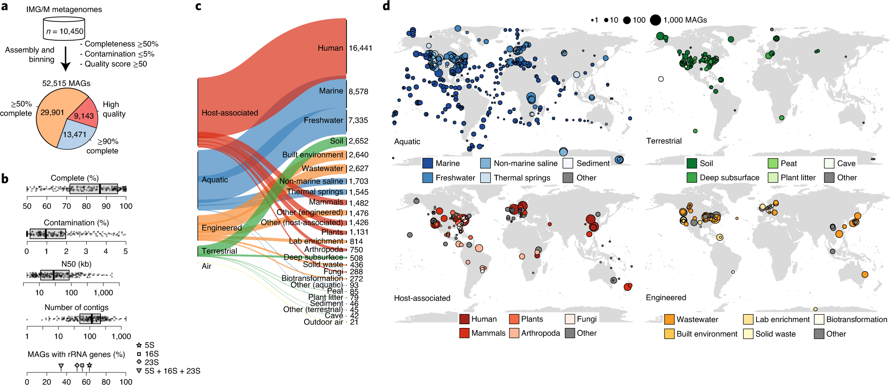
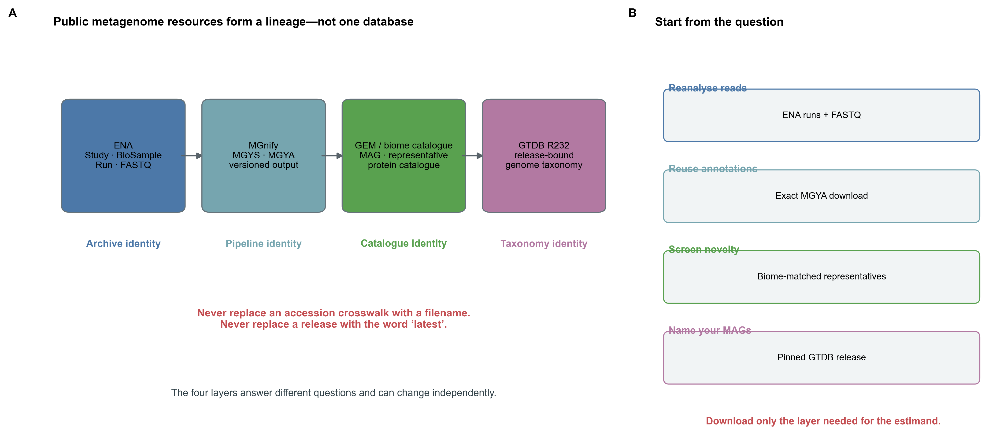
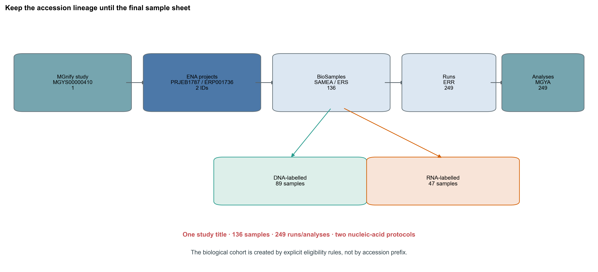
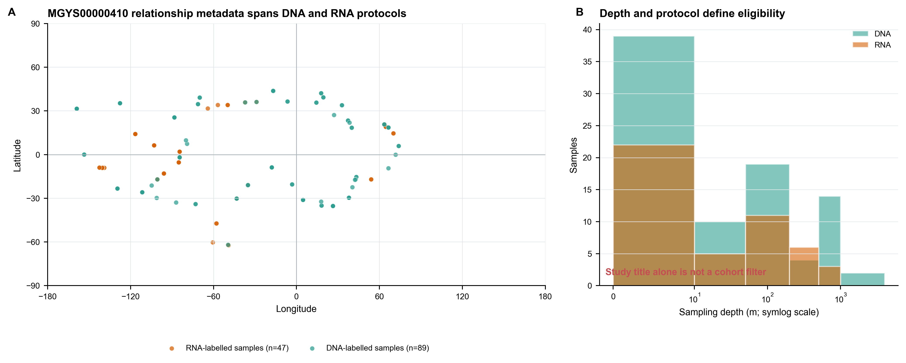
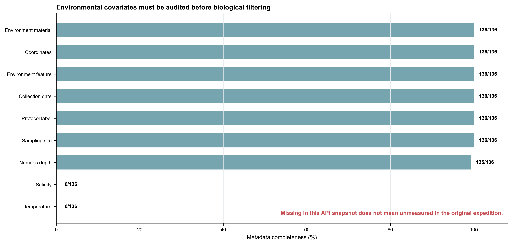
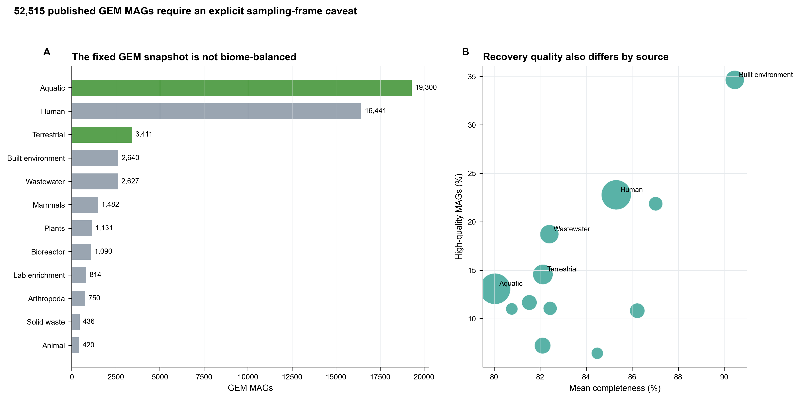
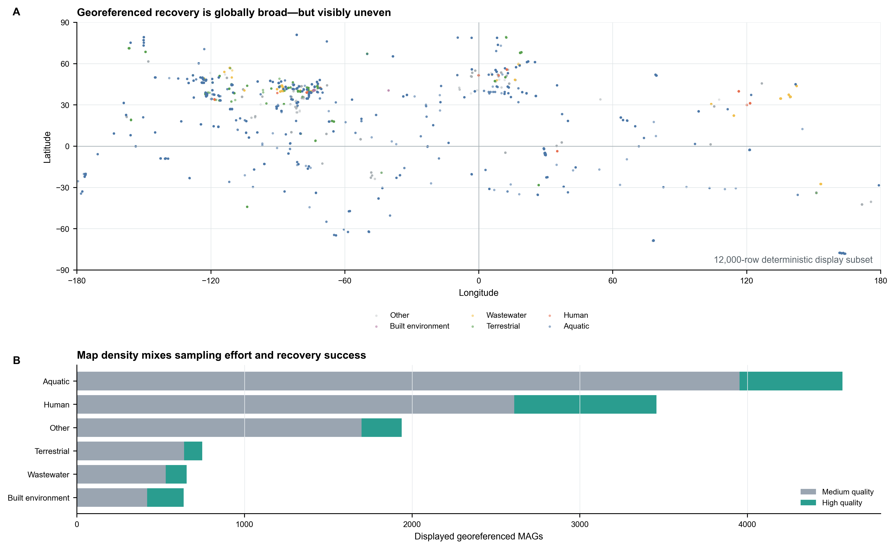
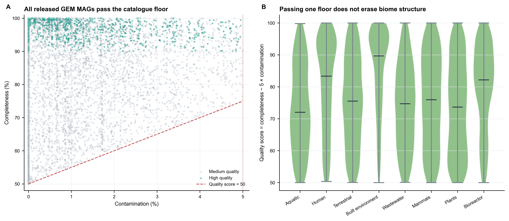
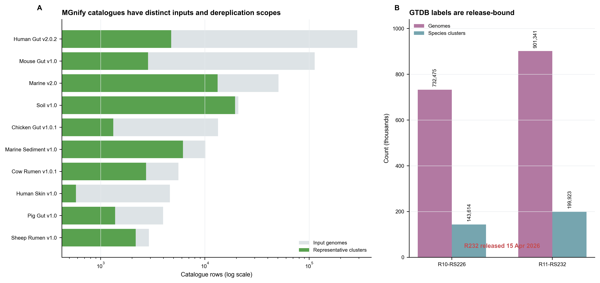

> **先给结论：**MGnify、ENA、GEM、环境 MAG catalog 与 GTDB 不是五个可互换的“宏基因组数据库”。ENA 保存原始序列及 archive identity；MGnify 提供可检索元数据和版本化标准分析；GEM 是固定论文快照；biome-specific catalog 保存去冗余代表基因组；GTDB 提供 release-bound taxonomy。真正可复现的检索必须同时锁定 **accession、统计单位、快照日期、pipeline/database release 与下载文件 checksum**。

本章用 Tara Oceans 的真实研究 `MGYS00000410` / `PRJEB1787` 建立 accession lineage [@sunagawa2015ocean]，再审计 GEM、MGnify Genomes Marine v2.0 和 GTDB R11-RS232。四条决定先写在前面：

1. 以 BioSample 或现场采样事件定义生物学单位，不能把 run 或 MGYA analysis 当独立样本；
2. 以样本级 `protocol_label` 判定 DNA/RNA，不能只读 study title；
3. catalogue representative count 表示该 catalogue 内的聚类代表数，既不是丰度，也不能跨 catalog 直接相加；
4. taxonomy 必须带 GTDB release；重分类时并排保留 original label 与 retaxonomized label。

## 这一步对应论文里的哪张图：GEM Figure 1 把资源覆盖与恢复质量分开 {#sec-target}

Nayfach 等构建 GEM（Genomes from Earth's Microbiomes）时，从 10,450 个公开 metagenomes 形成一个固定的跨生态系统 MAG 快照 [@nayfach2021gem]。Figure 1 同时展示 metagenome/MAG 的生态系统分布、地理覆盖、completeness/contamination 与 novelty，但没有把每个圆点解释成独立、均匀抽样的生态观测。

{#fig-73-anchor}

本章从官方 `genome_metadata.tsv` 重新读取到 52,515 行 MAG、18,028 个 paper-era species OTUs 与 7,304 个实际贡献至少一个 MAG 的 source metagenome IDs。后一个数字小于论文报告的 10,450 个输入 metagenomes，并不矛盾：输入过 pipeline 的 metagenome 不保证最终贡献 MAG。分母必须跟着问题走。

## 理论：公共资源的五层对象不能混成一张“样本表” {#sec-theory}

### 1. Archive 层保存身份，analysis 层保存一次版本化计算

一个最小 lineage 可以写成：

$$
\text{study}\rightarrow\text{sample}\rightarrow\text{experiment}\rightarrow
\text{run}\rightarrow\text{analysis}\rightarrow\text{derived file}.
$$

study 是项目容器；sample/BioSample 描述被取样的材料；experiment 描述 library strategy；run 是一次测序数据交付；MGYA analysis 是某条 MGnify pipeline 对 run/assembly 的一次计算。一个样本可以有多个 library、run 或 analysis。统计独立性来自采样设计，不来自 accession 字符串是否唯一。

{#fig-73-layers}

MGnify 适合发现公开研究、统一浏览元数据和复用指定 pipeline output；ENA 仍是 raw reads 与 archive lineage 的权威入口。MGnify 的 API、分析 pipeline 与 reference database 各有版本，`API v2` 不等于 “pipeline v2”，也不等于某个 taxonomy release [@richardson2023mgnify]。

### 2. MAG row、species OTU 与 catalogue representative 是三个单位

一行 MAG 是一次 genome reconstruction；多个 MAG 可来自同一 metagenome，也可属于同一 species-level cluster。catalogue representative 则是在**给定输入集合、质量过滤、ANI/AF 阈值和代表选择规则**下选出的 cluster representative。改变输入、阈值或版本，代表数就会改变。

因此，MGnify Soil v1 的 19,472 个 representatives 与 Marine v2 的 13,223 个 representatives 不能相加成“32,695 个全球物种”：两个 catalogue 没有在共同全集上全局去冗余，边界与版本也不同 [@gurbich2023mgnifygenomes]。

### 3. GTDB cluster 是 taxonomy backbone，不是生态丰度

GTDB 以 genome phylogeny、ANI 与 reference-specific species radius 维护 release-bound genome taxonomy [@parks2022gtdb; @parks2025gtdbr10]。R11-RS232 的官方 release 文件记录 901,341 genomes 和 199,923 species clusters；这些数字描述 taxonomy reference space，不代表环境中观察到的物种丰度，也不等于某个 MAG catalog 的代表数。

同一个 MAG 在两个 release 中可能换名、换 species assignment 或由 placeholder name 变成正式名称。正文结果表至少保留：`genome_id`、`original_taxonomy`、`original_release`、`retaxonomy`、`retaxonomy_release` 与 classification diagnostics。

### 4. “公开”不等于“无条件可混用”

数据公开只解决访问问题，不自动解决 library type、size fraction、DNA extraction、sequencing platform、assembly pipeline、geographic imbalance、temporal clustering、许可与数据使用条款。GEM MAG 可按其数据使用说明复用，但底层 JGI metagenomes 仍受对应 archive/policy 约束。每个 derived resource 都要回到原始 accession 与使用条款。

## 准备工作：先锁快照，再按问题决定下载规模 {#sec-preparation}

### 真实来源、版本与算力

| 资源层 | 本章锁定对象 | 本章实际下载 | 适合回答 | 不可直接回答 |
|---|---|---:|---|---|
| ENA | `PRJEB1787` / `ERP001736` | accession lineage | 原始序列身份、run | 已统一处理的 cohort effect |
| MGnify | API v2，`MGYS00000410` | 136 samples、249 analyses 的 JSON | 检索、metadata、指定 output | 生物学独立样本数 |
| GEM | DOI 固定 snapshot | 12.35 MB metadata + Figure 1 | 跨 biome MAG 覆盖与历史基准 | 当前全球物种全集 |
| MGnify Genomes | Marine v2.0，pipeline v2.3.0 | catalogue metadata | biome-matched representative search | 样本丰度、跨 catalog 物种总数 |
| GTDB | R11-RS232，2026-04-15 | VERSION、release notes、MD5 list | release-consistent taxonomy | read abundance、功能注释 |

冻结表由 **Python 3.13.2、pandas 3.0.3、NumPy 2.5.0** 生成；可移植环境文件另外锁定 Python 3.10.19、pandas 2.3.3、NumPy 2.2.6 与 Matplotlib 3.10.8。运行时版本和目标环境版本分别记录，避免把“本次实际执行”与“推荐重建环境”混写。

本章冻结表的验收与作图约需 **2 CPU、4 GB RAM、不到 1 分钟**。若只做 metadata discovery，不需要下载 FASTQ、52,515 个 GEM FASTA 或完整 GTDB-Tk package。真正用 GTDB-Tk R232 重分类时，官方压缩包为 **60.81 GB**；还要预留解压空间、索引空间与足够 RAM。共享 HPC/云盘应把数据库放到版本化只读目录，避免每位使用者重复下载。

<details>
<summary><strong>下载官方快照、生成审计表，并内联统一作图函数</strong></summary>

```{bash}
#| eval: false
python scripts/download_article73_resources.py \
  --cache-dir db/evidence/article73
python scripts/prepare_article73_resources.py \
  --cache-dir db/evidence/article73 \
  --output-dir results/article73/resources
python scripts/plot_article73_resources.py \
  --input-dir results/article73/resources \
  --figure-dir figures
```

```{r}
set.seed(20260773)

pal_pub <- c(
  "Archive" = "#4C78A8", "Analysis" = "#2A9D8F",
  "Catalogue" = "#F2C14E", "Taxonomy" = "#D55E00",
  "DNA" = "#2A9D8F", "RNA" = "#C44E52",
  "Complete" = "#2A9D8F", "Missing" = "#B8C4CE"
)
scale_color_pub <- function(...) ggplot2::scale_color_manual(values = pal_pub, ...)
scale_fill_pub  <- function(...) ggplot2::scale_fill_manual(values = pal_pub, ...)
theme_pub <- function(base_size = 12) {
  ggplot2::theme_bw(base_size = base_size) + ggplot2::theme(
    panel.grid.minor = ggplot2::element_blank(),
    panel.grid.major = ggplot2::element_line(color = "#ECEFF1", linewidth = 0.3),
    axis.text = ggplot2::element_text(color = "black"),
    legend.key = ggplot2::element_blank(),
    strip.background = ggplot2::element_rect(fill = "#EDF2F4", color = NA),
    plot.title.position = "plot",
    plot.caption = ggplot2::element_text(color = "#455A64", hjust = 0)
  )
}
save_pub <- function(plot, file_base, width = 210, height = 150,
                     units = "mm", dpi = 350) {
  dir.create(dirname(file_base), recursive = TRUE, showWarnings = FALSE)
  ggplot2::ggsave(paste0(file_base, ".pdf"), plot, width = width,
                  height = height, units = units,
                  device = grDevices::cairo_pdf, bg = "white")
  ggplot2::ggsave(paste0(file_base, ".png"), plot, width = width,
                  height = height, units = units, dpi = dpi, bg = "white")
  ggplot2::ggsave(paste0(file_base, ".tiff"), plot, width = width,
                  height = height, units = units, dpi = dpi,
                  compression = "lzw", bg = "white")
  invisible(plot)
}
```

```{bash}
#| eval: false
# 只在明确需要 retaxonomize MAG 时下载；先核对官方 MD5。
curl -fL -O \
  https://data.gtdb.ecogenomic.org/releases/release232/232.0/auxillary_files/gtdbtk_package/full_package/gtdbtk_r232_data.tar.gz
grep 'gtdbtk_r232_data.tar.gz' MD5SUM.txt
md5sum gtdbtk_r232_data.tar.gz
```

</details>

### 先验收 checksum 与对象合同

```{bash}
#| eval: false
FROZEN="$PWD/data/small/73-public-resources-frozen"
sha256sum -c "$FROZEN/file-checksums.sha256"
```

```{r}
frozen <- "data/small/73-public-resources-frozen"

registry <- read.delim(
  file.path(frozen, "resource-registry.tsv"),
  check.names = FALSE
)
crosswalk <- read.delim(
  file.path(frozen, "accession-crosswalk.tsv"),
  check.names = FALSE
)
tara_samples <- read.delim(
  file.path(frozen, "tara-samples.tsv"),
  check.names = FALSE
)
tara_analyses <- read.delim(
  file.path(frozen, "tara-analyses.tsv"),
  check.names = FALSE
)

as_bool73 <- function(x) {
  normalized <- tolower(trimws(as.character(x)))
  stopifnot(all(normalized %in% c("true", "false")))
  unname(c("true" = TRUE, "false" = FALSE)[normalized])
}
tara_samples$ValidCoordinates <- as_bool73(tara_samples$ValidCoordinates)

stopifnot(
  nrow(registry) == 5,
  nrow(tara_samples) == 136,
  nrow(tara_analyses) == 249,
  is.logical(tara_samples$ValidCoordinates),
  all(tara_samples$ValidCoordinates),
  sum(tara_samples$NucleicAcid == "DNA") == 89,
  sum(tara_samples$NucleicAcid == "RNA") == 47,
  length(unique(tara_analyses$RunAccession)) == 249,
  length(unique(tara_analyses$SampleAccession)) == 136
)

knitr::kable(
  registry[, c("Layer", "Resource", "StableIdentity", "Unit", "Boundary")],
  caption = "Five public-resource layers and their inferential boundaries"
)
```

## 可复制代码：从 Tara accession lineage 到环境 MAG 资源包 {#sec-code}

### 第 1 步：先画 accession crosswalk，不要先下载 FASTQ

```{r}
knitr::kable(
  crosswalk,
  caption = "Tara Oceans accession crosswalk in the frozen MGnify v2 snapshot"
)
```

{#fig-73-crosswalk}

这一行关系立即阻止两个伪重复错误：第一，`nrow(analysis_table)=249` 不能报告为 249 个 independent samples；第二，同一 sample 的多个 run 不可未经聚合就进入普通两独立样本检验。若研究问题以 sampling event 为单位，还要继续解析 station、depth、size fraction 与 collection time，必要时把 sample nested within station/event。

### 第 2 步：用样本级 protocol 建 shotgun-DNA eligibility

MGnify study title 描述的是 shotgun DNA prokaryotes，但 API v2 的 related samples 中有 89 个 `NUC-DNA` 与 47 个 `NUC-RNA`。标题适合发现研究，不适合作为 row-level inclusion criterion。

```{r}
dna_samples <- subset(
  tara_samples,
  NucleicAcid == "DNA" & ValidCoordinates
)
dna_analyses <- merge(
  tara_analyses,
  dna_samples[, c("SampleAccession", "SamplingSite", "DepthM",
                  "SizeFractionMicrometre", "CollectionDateStart")],
  by = "SampleAccession",
  all = FALSE
)

stopifnot(
  nrow(dna_samples) == 89,
  nrow(dna_analyses) == 149,
  all(dna_analyses$NucleicAcid == "DNA")
)

knitr::kable(
  head(dna_samples[, c("SampleAccession", "SamplingSite", "DepthM",
                       "ProtocolLabel", "SizeFractionMicrometre")], 8),
  caption = "Sample-level shotgun-DNA eligibility preview"
)
```

这里的 149 仍是 DNA analyses，不是新的 biological sample count。若多个 runs 是 lane split，应先合并 reads 或在 sample level 汇总；若是不同 size fraction/library，则应把 fraction 视为设计变量，而不是盲目相加。

{#fig-73-tara-frame}

### 第 3 步：metadata completeness 用 missingness 表，不用默认值

```{r}
completeness <- read.delim(
  file.path(frozen, "tara-metadata-completeness.tsv"),
  check.names = FALSE
)
knitr::kable(
  completeness,
  caption = "Field completeness in the frozen MGnify API snapshot"
)
```

坐标、site、protocol、date 与环境术语在 136 个 related samples 中齐全。depth annotation 也都有值，但其中 `SAMEA2623919` 的字段值是范围 `5-160`，sample title 标明单位为 m，不能伪装成一个 scalar depth；因此可直接建模的 numeric depth 是 135/136。temperature 和 salinity 在这份 API snapshot 中均为缺失。这个结果只说明**当前响应没有值**，不能写成“海水温度为 0”或“原始航次没有测温盐”。需要这些协变量时，应按 station/event/date 回到原项目的 PANGAEA/ENA metadata，记录 join key、单位与来源版本。

{#fig-73-metadata}

### 第 4 步：复用 MGnify output 时同时锁 analysis 与 pipeline lineage

```{r}
lineage <- read.delim(
  file.path(frozen, "tara-analysis-lineage.tsv"),
  check.names = FALSE
)
downloads <- read.delim(
  file.path(frozen, "tara-study-downloads.tsv"),
  check.names = FALSE
)

stopifnot(
  sum(lineage$Analyses) == 249,
  lineage$Analyses[lineage$PipelineVersion == "V2"] == 248,
  lineage$Analyses[lineage$PipelineVersion == "V3"] == 1
)
knitr::kable(lineage, caption = "MGnify analysis lineage by pipeline version")
knitr::kable(downloads, caption = "Study-level summary downloads exposed by the snapshot")
```

`MGYA...` accession 要与 exact download filename、checksum、pipeline version 和 reference database version 一起保存。把 V2/V3 summary 拼在一起前必须核对 feature space、taxonomy/function database 与 normalization 是否相同；“都是 MGnify 输出”不构成可比性证明。

### 第 5 步：用 GEM metadata 回答覆盖问题，不为画图下载 FASTA

```{r}
gem_biome <- read.delim(
  file.path(frozen, "gem-biome-summary.tsv"),
  check.names = FALSE
)
gem_preview <- read.delim(
  file.path(frozen, "gem-metadata-preview.tsv"),
  check.names = FALSE
)

stopifnot(
  sum(gem_biome$MAGs) == 52515,
  sum(gem_biome$HighQuality) == 9143,
  isTRUE(all.equal(
    gem_preview$quality_score,
    gem_preview$completeness - 5 * gem_preview$contamination,
    tolerance = 1e-8
  ))
)

knitr::kable(
  head(gem_biome[, c("EcosystemCategory", "MAGs", "Metagenomes",
                     "SpeciesOTUs", "HighQuality", "HighQualityPct")], 10),
  digits = 2,
  caption = "GEM ecosystem summary computed from the official metadata table"
)
```

{#fig-73-gem-biome}

GEM 中 Aquatic 与 Human MAG 占多数；built environment 的 high-quality percentage 较高。它们同时受 sequencing depth、community complexity、assembly/binning、quality filters 与公开数据选择影响。最安全的用途是 resource coverage、candidate genome discovery 和 fixed-snapshot benchmark，不是从 MAG 行数推断生态系统物种丰富度。

```{r}
gem_map <- read.delim(
  file.path(frozen, "gem-map-visualization-sample.tsv"),
  check.names = FALSE
)
stopifnot(
  nrow(gem_map) == 12000,
  all(gem_map$Longitude >= -180 & gem_map$Longitude <= 180),
  all(gem_map$Latitude >= -90 & gem_map$Latitude <= 90)
)
knitr::kable(
  head(gem_map, 8),
  caption = "Checksum-frozen georeferenced rows used only for plotting"
)
```

{#fig-73-gem-map}

### 第 6 步：MAG 质量必须保留原字段与当代审计

GEM 的 frozen metadata 中，52,515 个 MAG 全部满足该项目的 medium-or-better 筛选；其中 `mimag_quality` 标记为 HQ 9,143、MQ 43,372。`quality_score = completeness - 5 × contamination` 只是一个历史排序量，不是完整 MIMAG 合规证明。MIMAG high-quality draft 还涉及完整 rRNA operons、tRNAs 等项目，且今天还应补充 chimerism、strain heterogeneity 与 contamination localization [@bowers2017mimag]。

{#fig-73-gem-quality}

### 第 7 步：先选 biome catalogue，再选择 taxonomy 文件或完整 reference

```{r}
catalogues <- read.delim(
  file.path(frozen, "mgnify-catalogues.tsv"),
  check.names = FALSE
)
gtdb_history <- read.delim(
  file.path(frozen, "gtdb-release-history.tsv"),
  check.names = FALSE
)
gtdb_files <- read.delim(
  file.path(frozen, "gtdb-selected-files.tsv"),
  check.names = FALSE
)

marine <- subset(catalogues, CatalogueID == "marine-v2-0")
stopifnot(
  nrow(catalogues) == 19,
  marine$InputGenomes == 50866,
  marine$RepresentativeClusters == 13223,
  tail(gtdb_history$Release, 1) == "R11-RS232",
  gtdb_files$Bytes[gtdb_files$Purpose == "GTDB-Tk full reference package"] ==
    60806405195
)

knitr::kable(
  catalogues[, c("CatalogueID", "Scope", "RepresentativeClusters",
                 "InputGenomes", "PipelineVersion")],
  caption = "Published MGnify genome catalogues in the 2026-08-23 API snapshot"
)
knitr::kable(
  gtdb_files[, c("Purpose", "RelativePath", "Bytes", "MD5")],
  caption = "Minimum GTDB R232 downloads depend on the question"
)
```

{#fig-73-catalogue-gtdb}

只把已有 GTDB labels join 到表格时，R232 bacteria/archaea taxonomy TSV 总计约 10.20 MB compressed；运行 GTDB-Tk 才需要 60.81 GB 的完整 reference package。下载规模应由问题决定，而不是“数据库越全越专业”。

## 从“搜到数据”到可比较队列：审计与升级 {#sec-audit}

### 1. 忠实保留 resource-native identifier，再建立自己的 cohort key

原始 accession 永远保留；另建 `biological_unit_id`、`technical_unit_id` 与 `analysis_id`。Tara 例中可以把 BioSample 作为初始 sample key，再用 station、event、depth、size fraction 和 date 审核是否需要更高或更低层级。不要覆盖 accession，也不要用行号充当永久 ID。

### 2. Study title 只用于 discovery，eligibility 落到每一行

本章的 47 个 RNA-labelled samples 是一个真实反例。自动检索可用 study-level keywords 召回候选；纳入必须检查 library strategy、nucleic acid、amplicon/shotgun、paired/single-end、size fraction、host depletion 与目标 biome。无法判定的行标记 `uncertain`，不能默认为符合。

### 3. Pipeline-version harmonization 先于 batch correction

如果 feature definition 已因数据库或算法变化而不同，ComBat、中心化或相对丰度转换都不能把“不相同的特征空间”修成同一 measurement。优先选择：统一重跑 raw reads；或锁定同一 pipeline/database 的 derived outputs；无法做到时，只在明确共享的 taxonomic/functional level 上聚合，并把 processing lineage 纳入 sensitivity analysis。

### 4. Catalogue 的 absence 是“未恢复/未入库”，不是环境缺失

查询 MAG 不命中，可能因为目标环境覆盖不足、测序深度不足、assembly/binning 失败、quality threshold、dereplication、strain microdiversity 或 taxonomy release 改变。报告“not recovered in catalogue version X under criterion Y”，不要报告“该微生物不存在”。

### 5. Taxonomy 升级必须生成 mapping ledger

升级 GTDB release 时固定 query genome checksum，记录旧名、新名、classification method、ANI、AF、closest reference 与 status。结果图可显示新版名字，补充表必须让读者追到原论文 label。若一个旧 cluster split 成多个新 cluster，不能用字符串替换掩盖 one-to-many mapping。

### 6. 环境 metadata 要做单位与语义审计

temperature、salinity、depth、pH、oxygen、coordinates 都要保留原单位、转换单位、测量层次与来源。`0`、`not collected`、`not provided`、`below detection` 是不同状态。ENVO term 有助于语义统一，但 portal lineage 本身也可能错误；例如当前 catalogue API 的 `Human Skin` biome lineage 指向 oral system，自动聚合前应回查 resource page，而不是静默纠正。

## 出版级美化：一张图只表达一种资源单位 {#sec-publication}

资源图最容易用面积、点数与 bar height 制造“更多就是更丰富”的错觉。推荐四条：

1. accession 图用 flow/stack 明示 study、sample、run、analysis，不把不同层级画成同一种点；
2. catalog bar 必须写 `Representative clusters`，不写含混的 `Species`；
3. 地图 caption 写清每个点是 sample、metagenome 还是 MAG，并说明是否确定性下采样；
4. release comparison 显示 release/date，taxonomy name 或 cluster count 不脱离版本。

本章所有重绘图的轴、图例与注释均为英文，主色保持色盲友好；PDF 作为矢量稿，PNG/TIFF 以 360 dpi 导出，TIFF 使用 LZW。原论文 Figure 1 保留原图与原 panel lettering，不对 publisher image 做语义改画。

## 常见坑 {#sec-pitfalls}

::: {.callout-caution title="把 249 个 MGYA analyses 当 249 个患者/样本"}
analysis accession 是计算产物单位。先回到 BioSample 和 sampling event，检查一个样本是否有多个 run、fraction 或 pipeline analysis；统计模型的 $n$ 写 biological units。
:::

::: {.callout-caution title="看到 study title 写 DNA 就纳入全部 related samples"}
本章真实快照中 136 个 samples 包含 47 个 RNA-labelled samples。必须按 row-level protocol/library metadata 建 eligibility。
:::

::: {.callout-warning title="把缺失 temperature/salinity 填成 0"}
0 是实测数值，missing 是信息状态。回到原项目 metadata 补齐；若无法补齐，保留 NA 并评估 missingness mechanism。
:::

::: {.callout-caution title="把多个 catalogue 的 representative counts 相加成全球物种数"}
catalogues 的输入集合、版本与去冗余空间不同，可能重叠。除非把所有 genomes 放在共同 ANI/AF 合同中重新 dereplicate，否则只能分别报告。
:::

::: {.callout-caution title="用 catalog 中 MAG 行数当环境 abundance"}
MAG recovery 同时依赖 biomass、sequencing depth、community complexity、assembly、binning 和 QC。丰度要从 sample-resolved reads 回贴或 profile table 估计。
:::

::: {.callout-warning title="永远下载 latest，却不记录 release"}
API、pipeline、catalogue 与 GTDB 都会更新。保存 snapshot date、URL、file checksum、tool/database release；复现时优先读取冻结 manifest。
:::

::: {.callout-caution title="只按 taxonomy string 合并"}
同名异义、placeholder rename 与 split/merge 会造成错误 join。优先按 stable genome/sample accession，taxonomy 作为 release-bound annotation。
:::

::: {.callout-important title="公开可下载不等于所有用途都无约束"}
逐项检查 resource license/data-use statement，并回到 raw-data archive 的 consent/policy。尤其是 human-associated 与 JGI-linked source data，不要让 derived catalogue 的开放入口掩盖底层条件。
:::

## 这段 Methods 怎么写 {#sec-methods}

> Public metagenomic resources were queried on 23 August 2026. Tara Oceans study MGYS00000410 was retrieved through MGnify API v2 and linked to ENA project PRJEB1787/ERP001736. Biological samples were defined by BioSample accessions, whereas sequencing runs (ERR) and MGnify analyses (MGYA) were retained as technical and analysis units, respectively. Shotgun-DNA eligibility was determined from sample-level NUC-DNA protocol labels rather than the study title. The frozen snapshot contained 136 related samples (89 DNA and 47 RNA) and 249 runs/analyses. GEM genome_metadata.tsv (SHA-256 fd0ad382e4ec9dbc07915333b6c2e4b53257f6d3a9f47aad7da1d2cad6e83e37) was used for catalogue-level summaries. MGnify Genomes Marine v2.0 (pipeline v2.3.0) and GTDB R11-RS232 (released 15 April 2026) were used as biome-specific catalogue and taxonomy references. Catalogue representatives were not interpreted as sample abundance. Taxonomic names are release-bound; labels were retained with their database release. Deterministic visualization samples used seeds 73001 and 20260773.

Methods 还应补上：纳入/排除规则、biological unit、重复 run 的处理、下载文件名与 checksum、raw read 是否统一重跑、assembly/binning/QC 版本、GTDB-Tk 版本与数据库路径、环境变量单位、缺失处理以及 data-use/license 检查日期。

## 换成你自己的数据怎么做 {#sec-own-data}

### 先写一个 resource contract

每个候选资源至少填这些列：

| 字段 | 要写什么 |
|---|---|
| Scientific question | discovery、raw-read reanalysis、MAG novelty、taxonomy join 或 comparative genomics |
| Stable identity | study/sample/run/analysis/catalogue accession |
| Biological unit | person、station-event-depth-fraction、animal、reactor 或 plot |
| Technical unit | library、lane、run、assembly、analysis |
| Eligibility | DNA/RNA、shotgun/amplicon、host、biome、fraction、time |
| Processing lineage | tool、pipeline、reference database、parameter、version |
| Snapshot | retrieval date、URL、checksum |
| License/policy | resource terms 与底层 archive 条件 |

### 再按问题选最小下载

```{r}
download_plan <- read.delim(
  file.path(frozen, "download-decisions.tsv"),
  check.names = FALSE
)
knitr::kable(
  download_plan,
  caption = "Question-first download plan"
)
```

- 只找研究：取 study/sample metadata 与 accession crosswalk；
- 要统一重分析：取 ENA run table 和符合条件的 FASTQ；
- 要复用标准结果：取 exact MGYA file，并锁 pipeline/database；
- 要找环境 MAG：优先 biome-matched catalogue representatives，再回查质量与来源；
- 只要已有 GTDB label：下载 taxonomy/metadata TSV；
- 要给自己的 MAG 重新分类：再部署 release-matched GTDB-Tk reference。

### 最后做三张审计表

第一张是 accession lineage，回答每一行从哪里来；第二张是 comparability matrix，回答 library、pipeline、database 与 metadata 是否可比；第三张是 mapping ledger，记录 catalog/taxonomy 版本升级的一对一、一对多和未匹配。只有三张表都闭合，公共资源才从“搜到”变成可投稿的分析输入。

## 参考 {#sec-references}

- Tara Oceans 全球海洋微生物组结构与功能 [@sunagawa2015ocean]
- MGnify 数据资源与标准分析服务 [@richardson2023mgnify]
- GEM 跨生态系统 MAG catalogue [@nayfach2021gem]
- MGnify Genomes biome-specific catalogues [@gurbich2023mgnifygenomes]
- GTDB 的 genome-based、release-bound taxonomy [@parks2022gtdb; @parks2025gtdbr10]
- MIMAG genome-quality reporting standard [@bowers2017mimag]
