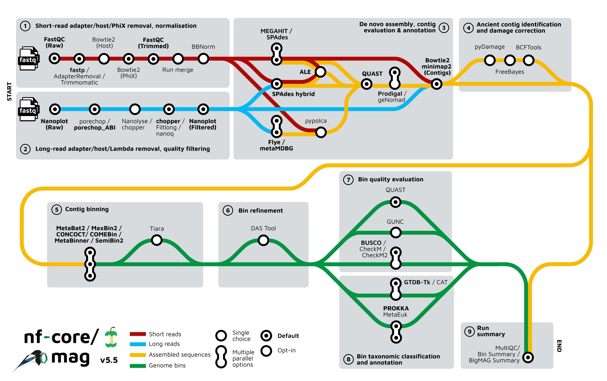
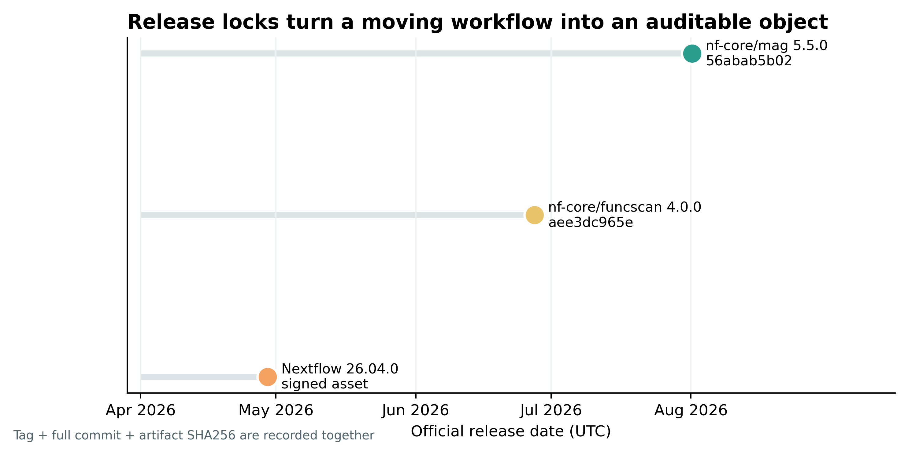
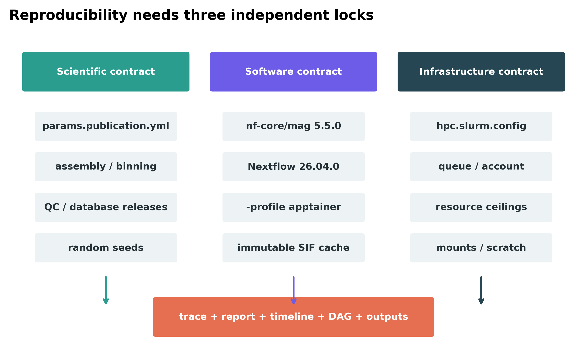
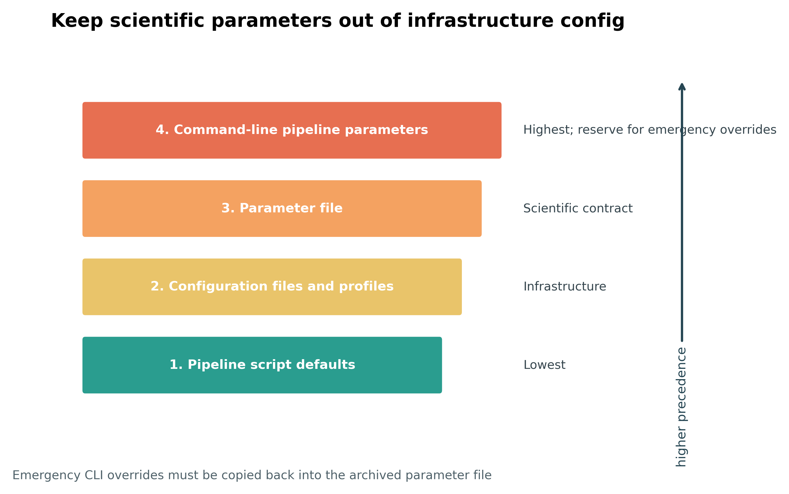
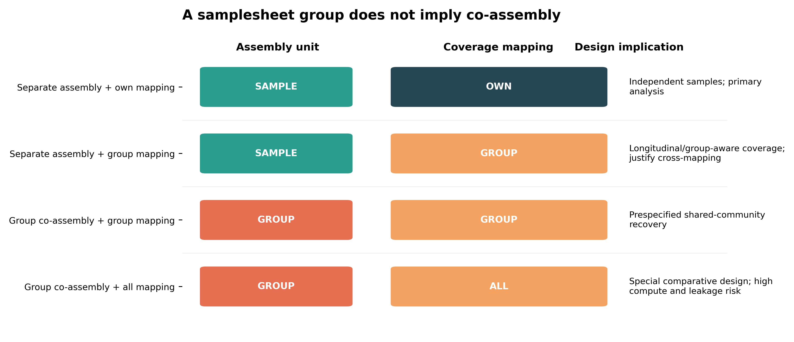
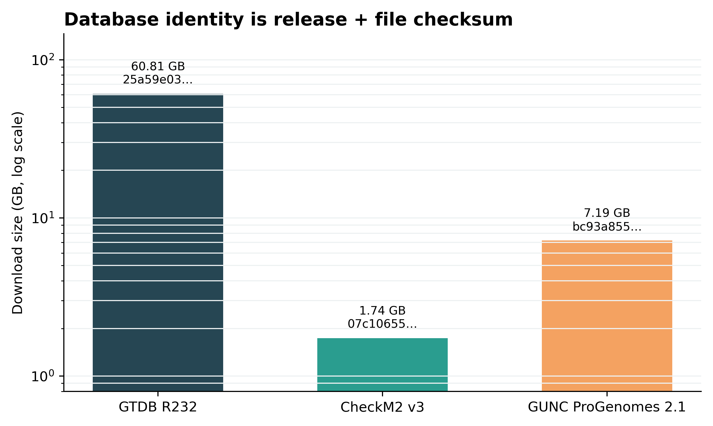
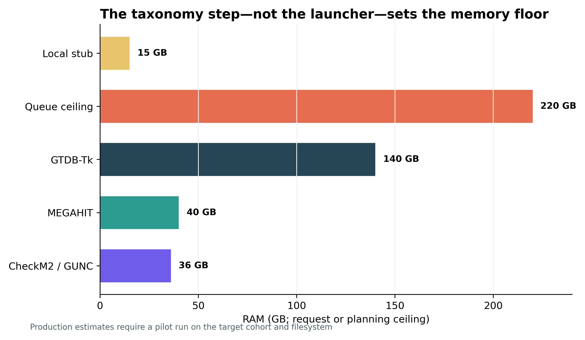
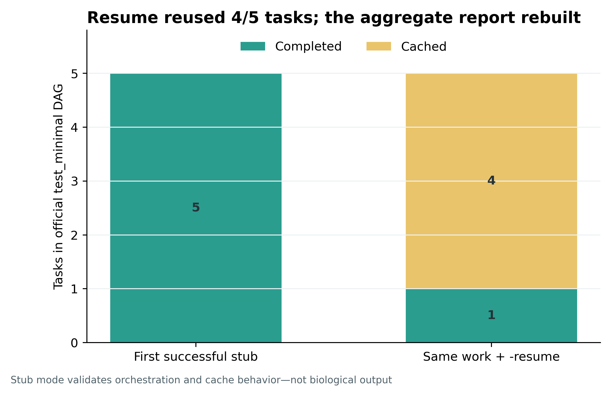
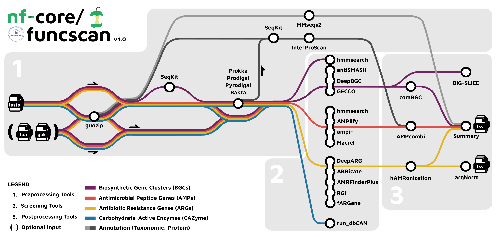
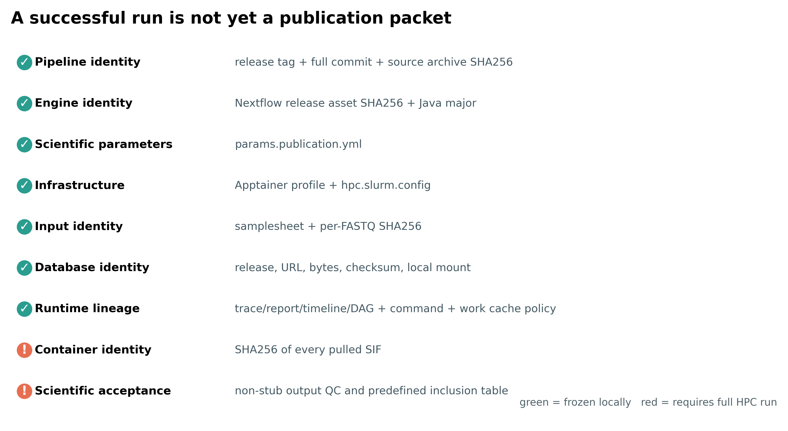

> **先给结论：**把 `fastp → MEGAHIT → MetaBAT2 → CheckM2/GUNC → GTDB-Tk` 塞进 Nextflow，并不会自动得到可复现研究。可投稿的锁定对象至少有七层：**pipeline release 与完整 commit、workflow engine、科学参数、软件容器、数据库文件、输入样本单位、运行 trace**。`-resume` 只复用 task cache，`-stub-run` 只检查控制面；两者都不能替代真实组装、MAG 质量验收和生物学审计。

这里以 nf-core/mag 5.5.0、Nextflow 26.04.0、Apptainer 与 SLURM 为主线。公开输入是 PRJEB52977 的 ERR9765746：从 checksum 标识的 ENA 文件确定性截取前 100,000 对 reads，再经第 13 篇 fastp 规则保留 99,991 对 clean reads。流程论文说明了 nf-core/mag 的 hybrid assembly、binning 与模块化设计 [@krakau2022nfcoremag]；本次执行身份进一步锁到 5.5.0 tag 对应的完整 commit `56abab5b023ce953c9c43fe21090d156ad0e18af` [@nfcoreMag550]。

::: {.callout-important title="先看算力门槛"}
本地 schema/DAG stub 验证：2–4 核、15 GB RAM ceiling、约 5 GB 磁盘，插件已缓存后通常低于 5 分钟。真实短读长 MAG 流程建议从 16–32 核、至少 72 GB RAM 起步；本例 SLURM profile 把单任务上限设为 220 GB，以容纳 GTDB-Tk 的 140 GB 首次请求并留出调度余量。工作区、容器与数据库合计建议预留至少 500 GB；单样本或小队列常见规划时间为 12–72 小时，但必须在目标文件系统上先跑一个 pilot。

没有服务器时，只在笔记本完成 samplesheet、schema、config 与 stub 检查；真实计算交给校内 HPC、受控云实例或合作方服务器。不要为了“能在笔记本跑”而把生产数据继续裁小，再把结果当正式 MAG。
:::

## 这一步对应论文里的哪张图 {#sec-target}

Krakau 等的 nf-core/mag 论文把分析对象定义为从 short/long reads 到 assembly、bins 与 genome annotation 的可移植 workflow [@krakau2022nfcoremag]。5.5.0 的官方 metromap 是该流程在 2026 年 release 上的当前实现：短读长与长读长入口、去宿主、多个 assembler/binner、bin QC、GTDB-Tk 与汇总节点都能从同一张 DAG 追到产物。

{#fig-74-mag-map}

目标不是复刻这张地图的所有分支，而是让论文里的每一个结果都能反查到：哪一个 release、哪一组参数、哪一份数据库、哪一个 task hash 与哪一张纳入表。nf-core 框架提供统一模板与模块生态 [@ewels2020nfcore]，Nextflow 提供 dataflow 调度与 task cache [@ditommaso2017nextflow]；科学选择仍由研究设计负责。

{#fig-74-release}

本次冻结的三个核心身份如下：

| Component | Release | Published (UTC) | Immutable identity |
|---|---:|---:|---|
| Nextflow | 26.04.0 | 2026-04-29 | distribution SHA256 `5e2b4a35…14870` |
| nf-core/funcscan | 4.0.0 | 2026-06-27 | commit `aee3dc965e…` |
| nf-core/mag | 5.5.0 | 2026-08-01 | commit `56abab5b02…` |

`latest`、`main`、网页上当前默认版本和“我记得当时装的是某版”都不是可接受的运行身份。

## 理论：工作流锁住的是分析契约 {#sec-theory}

### 2.1 七层身份缺一不可

一个可审计 workflow run 可以写成：

$$
R = f(P, E, \Theta, C, D, I, H),
$$

其中 $P$ 是 pipeline source，$E$ 是 engine，$\Theta$ 是科学参数，$C$ 是 container，$D$ 是数据库，$I$ 是输入及其单位，$H$ 是执行历史。只固定其中一层，结果仍会漂移。例如同一 `nf-core/mag` tag 若读取不同 GTDB release，taxonomy 就不再是同一分析；同一参数若把 `group` 从 batch 标签误当作 co-assembly 单位，assembly 与 coverage 的分母也会改变。

{#fig-74-three-locks}

- `params.publication.yml` 保存 assembler、binner、QC、数据库路径与随机种子；
- `-profile apptainer` 保存软件隔离策略，SIF 文件另做 SHA256 清单；
- `hpc.slurm.config` 保存 executor、queue、资源 ceiling、mount 与 cache；
- `pipeline_info/` 保存实际参数快照、trace、report、timeline 与 DAG；
- 独立的 MAG acceptance table 保存完整度、污染、GUNC、taxonomy 与纳入/排除原因。

把科学参数混进单位内部的 SLURM config，会让同一研究在不同集群上悄悄改变；把 queue/account 写进科学参数，又会让参数文件无法迁移。两者应分开版本控制。

### 2.2 参数优先级决定“最后到底跑了什么”

Nextflow 的有效值按 pipeline defaults、config/profile、`-params-file`、命令行 pipeline 参数逐级覆盖。Nextflow 自身选项使用单短横线，例如 `-r`、`-profile`、`-params-file`、`-resume`；pipeline 参数使用双横线，例如 `--input`。这两个命名空间混用，是最常见的静默偏差来源之一。

{#fig-74-precedence}

::: {.callout-warning title="不要把临时 CLI 覆盖留在 shell history 里"}
如果因为一次故障在命令末尾补了 `--skip_gtdbtk`，运行确实可能成功，但归档的 YAML 仍声称 GTDB-Tk 已执行。任何改变科学结果的 CLI 参数，都必须同步回写参数文件并重新生成参数快照。
:::

### 2.3 `group`、co-assembly 与 coverage mapping 是三件事

nf-core/mag 5.5.0 的 samplesheet 有 `sample`、`run` 与 `group`。相同 `sample` 的多行表示同一生物学样本的多个技术 run；`group` 为跨样本策略提供集合标签。仅填写相同 `group` 不会自动把 reads 合并成一份 assembly；真正的 pooled assembly 由 `coassemble_group: true` 启动。默认 `binning_map_mode: group` 又会把组内 reads 映射到相关 assembly，因此“是否合并组装”和“哪些 reads 进入 coverage”必须分别声明。

{#fig-74-units}

主参数把 `coassemble_group` 固定为 `false`、`binning_map_mode` 固定为 `own`。这样一份 assembly、一套 coverage 与一个 biological sample 对齐。若研究问题确实需要跨时间点或同一反应器 co-assembly，应先规定 group membership、缺失样本、跨组污染与 downstream abundance 的解释，再改参数。

### 2.4 Nextflow 与 Snakemake 锁的是同一组科学对象

Nextflow 以 channel/dataflow 组织任务，nf-core 提供成熟的社区 pipeline；Snakemake 以 rule、wildcard 与文件依赖组织 DAG [@koster2012snakemake]。二者语法不同，但审稿人需要的证据相同：workflow source commit、config、container/conda lock、database checksum、input checksum、scheduler profile、DAG、日志与最终产物。

一个项目只应有一个 scheduler owner。若 Nextflow 已向 SLURM 提交内部 task，就不要再让 Snakemake 把每个 Nextflow task 套一层 `sbatch`。更稳的边界是：Nextflow 负责 nf-core/mag 全上游，Snakemake 只把**已经固化的** MAG QC/abundance 表接到自定义下游。

## 准备工作 {#sec-preparation}

### 3.1 数据、目录与实际证据边界

真实输入来自 ERR9765746 的 99,991 对 clean reads。R1 与 R2 的 SHA256 分别为：

```text
ce438de2814a6e605cc24b00e53b697d018f325bc2a9694cece5be158ff32101  ERR9765746_clean_R1.fastq.gz
207d080cd5dc98bd10fd4af8c492fb3f2000f73e1458a9d1d77e57347f4fe459  ERR9765746_clean_R2.fastq.gz
```

这些 reads 用于 5.5.0 的 samplesheet/schema、minimal DAG 与 `-resume` 控制面验证。官方 `test_minimal` profile 加 `-stub-run` 产生的是 sentinel/zero-byte output，不包含真实 assembly、bin、CheckM2、GUNC 或 GTDB-Tk 结果。科学产物必须在 HPC 上以非 stub 模式另跑并验收。

目录约定：

```text
project/
├── input/samplesheet.csv
├── config/params.publication.yml
├── config/hpc.slurm.config
├── db/database-lock.tsv
├── containers/sif-checksums.sha256
├── work/                       # Nextflow cache; resume 依赖它
└── results/nfcore-mag-5.5.0/
    ├── pipeline_info/
    ├── Assembly/
    ├── GenomeBinning/
    └── Taxonomy/
```

### 3.2 安装与内联作图函数

<details>
<summary>展开：Java 17、Nextflow 26.04.0、依赖与作图函数</summary>

nf-core/mag 5.5.0 的 manifest 要求 Nextflow `>=26.04.0`；项目再把 engine 精确锁到 26.04.0 [@nextflow26040]。下面使用官方 distribution asset，SHA256 来自同一 GitHub release：

```bash
mamba create -n nfmag-5.5 -y -c conda-forge openjdk=17 python=3.13 \
  pandas matplotlib pillow
conda activate nfmag-5.5

curl -fL \
  https://github.com/nextflow-io/nextflow/releases/download/v26.04.0/nextflow-26.04.0-dist \
  -o nextflow-26.04.0-dist
printf '%s  %s\n' \
  '5e2b4a354b4d7634d7211b71417d61606878fb49e9b224b50ded6e2c69114870' \
  'nextflow-26.04.0-dist' | sha256sum -c -
chmod +x nextflow-26.04.0-dist
./nextflow-26.04.0-dist -version

module load apptainer
apptainer version
sbatch --version
```

Apptainer 将 container 映像作为普通文件缓存，适合共享只读 cache 与非特权 HPC 执行 [@kurtzer2017singularity; @apptainerSecurity]。集群若仍把可执行文件命名为 `singularity`，不要同时启用 `apptainer` 与 `singularity` profile；先由管理员确认实际 runtime。

作图函数直接放进分析脚本：

```python
from pathlib import Path
import matplotlib as mpl
import matplotlib.pyplot as plt

pal_pub = ["#2A9D8F", "#E9C46A", "#F4A261", "#E76F51", "#264653", "#6C5CE7"]

def theme_pub():
    mpl.rcParams.update({
        "font.family": "DejaVu Sans",
        "font.size": 10,
        "axes.spines.top": False,
        "axes.spines.right": False,
        "axes.facecolor": "white",
        "figure.facecolor": "white",
        "svg.fonttype": "none",
    })

def save_pub(fig, path, dpi=360):
    path = Path(path)
    path.parent.mkdir(parents=True, exist_ok=True)
    fig.savefig(path.with_suffix(".png"), dpi=dpi, bbox_inches="tight")
    fig.savefig(path.with_suffix(".svg"), bbox_inches="tight")

theme_pub()
```

</details>

### 3.3 数据库不是“pipeline 自动处理的细节”

{#fig-74-databases}

本次生产 contract 固定：

| Database | Release/artifact | Download | Checksum |
|---|---|---:|---|
| GTDB-Tk | R11-RS232 `gtdbtk_r232_data.tar.gz` | 60.81 GB | MD5 `25a59e0352b1fd150c589f56559767d4` |
| CheckM2 | Zenodo 14897628, dataset v3 | 1.74 GB | MD5 `07c10655620843b517d0df0c160d911f` |
| GUNC | ProGenomes 2.1 | 7.19 GB compressed | MD5 `bc93a855e0760aad5c4e5f2d0e26da46` |

CheckM2 v3 记录声明该数据库与 DIAMOND 2.1.11 兼容 [@checkm2Zenodo14897628]。数据库锁不只写 release 名；还要保存下载 URL、artifact 文件名、bytes、checksum、安装路径与验证日期。解压后的 GUNC `.dmnd` 另有 MD5 `447c9330056b02f29f30fe81fe4af4eb`。

{#fig-74-resources}

数据库下载和容器预拉取应在 login/data-transfer node 完成；compute node 只读挂载。数据库或 SIF 更新时创建新目录，不要原地覆盖旧 release。

## 可复制代码 {#sec-code}

### 4.1 下载并核验 workflow source

下载器同时核对 nf-core/mag 5.5.0、nf-core/funcscan 4.0.0、Nextflow 26.04.0、CheckM2 Zenodo 元数据与 GUNC 官方 MD5：

```bash
python scripts/download_article74_workflow.py \
  --output-dir db/evidence/article74

python scripts/download_article74_workflow.py \
  --output-dir db/evidence/article74 \
  --verify-only
```

生产调用仍显式写 `-r`：

```bash
export NXF_VER=26.04.0
export NXF_APPTAINER_CACHEDIR=/shared/containers/nf-core-mag-5.5.0

nextflow pull nf-core/mag -r 5.5.0
nextflow config nf-core/mag \
  -r 5.5.0 \
  -profile apptainer \
  -c config/hpc.slurm.config \
  -flat > audit/effective-config.txt
```

`-r 5.5.0` 解决“取哪个 tag”，full commit 与 source archive SHA256 解决“这个 tag 实际指向什么”。Methods 同时报告二者。

### 4.2 写 samplesheet：一行是一个技术 run

```csv
sample,run,group,short_reads_1,short_reads_2,short_reads_platform
ERR9765746,run1,MOCK1,data/raw/article13/ERR9765746_clean_R1.fastq.gz,data/raw/article13/ERR9765746_clean_R2.fastq.gz,ILLUMINA
```

先核对路径、pair 数与 checksum：

```bash
sha256sum data/raw/article13/ERR9765746_clean_R{1,2}.fastq.gz
gzip -t data/raw/article13/ERR9765746_clean_R1.fastq.gz
gzip -t data/raw/article13/ERR9765746_clean_R2.fastq.gz
```

多个 lane/run 属于同一个生物学样本时重复 `sample`、给不同 `run`；不同受试者或独立采样事件不能因为同组而共用 `sample`。图内与输出 label 统一使用英文/ASCII。

### 4.3 科学参数写进 `params.publication.yml`

```yaml
input: samplesheet.csv
outdir: results/nfcore-mag-5.5.0

coassemble_group: false
binning_map_mode: own

skip_spades: true
skip_spadeshybrid: true
skip_megahit: false
skip_binning: false
skip_metabat2: false
skip_maxbin2: true
skip_concoct: true
skip_comebin: true
skip_metabinner: true
skip_semibin: true
metabat_rng_seed: 1
semibin_rng_seed: 1

skip_binqc: false
run_busco: false
run_checkm: false
run_checkm2: true
checkm2_db: /shared/db/checkm2/zenodo-14897628/checkm2_db_v14897628.dmnd
run_gunc: true
gunc_database_type: progenomes
gunc_db: /shared/db/gunc/progenomes2.1/gunc_db_progenomes2.1.dmnd
skip_gtdbtk: false
gtdb_db: /shared/db/gtdb/release232/gtdbtk_r232_data.tar.gz

refine_bins_dastool: false
generate_bigmag_file: false
monochrome_logs: true
```

5.5.0 默认 `run_busco: true`，但 `run_checkm2` 与 `run_gunc` 都是 `false`。因此“使用 pipeline defaults”不等于完成 CheckM2 + GUNC + MIMAG 验收。CheckM2 估计 completeness/contamination [@chklovski2023checkm2]，GUNC 独立检查 lineage inconsistency/chimerism [@orakov2021gunc]；最终等级仍应按 MIMAG 字段逐项记录 [@bowers2017mimag]。

这里预先选择单一主 assembler 与单一主 binner，避免把多个默认分支的结果混成一个未经设计的“最佳结果”。若要比较 assembler/binner，应另立 benchmark、共同 truth/指标与选择规则。

### 4.4 基础设施写进 `hpc.slurm.config`

```groovy
params {
    config_profile_name = 'Institutional SLURM + Apptainer'
    config_profile_description =
        'Shared filesystem; databases and container cache are immutable inputs'
}

process {
    executor = 'slurm'
    queue = 'compute'
    resourceLimits = [cpus: 32, memory: 220.GB, time: 72.h]
    clusterOptions = '--account=REPLACE_WITH_ACCOUNT'
}

executor {
    queueSize = 50
    submitRateLimit = '10 sec'
}

apptainer {
    enabled = true
    autoMounts = true
    cacheDir = '/shared/containers/nf-core-mag-5.5.0'
    runOptions = '--bind /shared/db,/scratch'
}

docker.enabled = false
singularity.enabled = false
conda.enabled = false
```

先解析 config，不提交任务：

```bash
NXF_OFFLINE=true nextflow config nf-core/mag \
  -r 5.5.0 \
  -profile apptainer \
  -c hpc.slurm.config \
  -flat | grep -E \
  'manifest.version|nextflowVersion|process.executor|resourceLimits|apptainer.enabled|cacheDir|docker.enabled|singularity.enabled|conda.enabled'
```

本地解析得到 `manifest.version=5.5.0`、`process.executor=slurm`、`apptainer.enabled=true`，其余三个软件引擎均为 `false`。这证明 config 能合并，不证明本机真的执行了 Apptainer 或提交了 SLURM；两项必须在目标集群做 preflight。

### 4.5 先做 schema/DAG stub，再做真实 pilot

控制面命令使用 checksum 锁定的本地 5.5.0 source archive、真实 samplesheet、官方 `test_minimal` profile 和 `-stub-run`：

```bash
export NXF_VER=26.04.0

nextflow run /path/to/checksum-locked/nf-core-mag-5.5.0 \
  -profile test_minimal \
  -params-file params.stub.yml \
  -stub-run \
  -w work/article74/nxf-work

nextflow run /path/to/checksum-locked/nf-core-mag-5.5.0 \
  -profile test_minimal \
  -params-file params.stub.yml \
  -stub-run \
  -resume \
  -w work/article74/nxf-work
```

第一次成功运行有 5 个 stub tasks；第二次在同一 work 目录复用相同参数时，4 个上游 tasks 命中 cache，MultiQC 因聚合输入刷新而重建。

{#fig-74-resume}

```text
Run            Process                                      Status
first-success  BOWTIE2_PHIX_REMOVAL_BUILD                   COMPLETED
first-success  FASTQC_RAW                                   COMPLETED
first-success  BOWTIE2_PHIX_REMOVAL_ALIGN                   COMPLETED
first-success  FASTQC_TRIMMED                               COMPLETED
first-success  MULTIQC                                      COMPLETED
resume         first four upstream processes                CACHED
resume         MULTIQC                                      COMPLETED
```

一个有意保留的失败也很重要：设置 `NXF_OFFLINE=true` 后，5.5.0 的 nf-schema 会检查默认 CheckM 下载 URL，在完全断网环境报“file or directory does not exist”。这不是 VPN 随机错误，而是 URL existence validation 与 offline 模式的边界。处理顺序是：在有网络的 login/data-transfer node 缓存 pipeline/plugin/container 并完成 schema preflight；全离线集群则把所有 URL 参数改成 checksum 锁定的本地路径和本地 institutional config。不要用永久关闭 `validate_params` 来掩盖问题。

stub 通过后，先拿一个真实样本做非 stub pilot，确认容器、mount、数据库、queue、资源与最终文件都正常，再扩到全队列。

### 4.6 生产运行与监控

```bash
export NXF_VER=26.04.0
export NXF_APPTAINER_CACHEDIR=/shared/containers/nf-core-mag-5.5.0

nextflow run nf-core/mag \
  -r 5.5.0 \
  -profile apptainer \
  -params-file params.publication.yml \
  -c hpc.slurm.config
```

只有在修复失败原因、保留原 work 目录且确认输入/参数未被意外修改后，才加 `-resume`：

```bash
nextflow run nf-core/mag \
  -r 5.5.0 \
  -profile apptainer \
  -params-file params.publication.yml \
  -c hpc.slurm.config \
  -resume
```

监控不只看 terminal 最后一行：

```bash
squeue -u "$USER"
sacct -X -S today \
  --format=JobID,JobName%42,State,Elapsed,AllocCPUS,MaxRSS,ExitCode

find results/nfcore-mag-5.5.0/pipeline_info -maxdepth 1 -type f -print
awk -F '\t' 'NR==1 || $5 != "COMPLETED"' \
  results/nfcore-mag-5.5.0/pipeline_info/execution_trace_*.txt
```

运行结束后固定所有 SIF identity：

```bash
find "$NXF_APPTAINER_CACHEDIR" -type f \
  \( -name '*.sif' -o -name '*.img' \) -print0 \
  | sort -z \
  | xargs -0 sha256sum \
  > containers/sif-checksums.sha256
```

`-resume` 的 task hash 取决于 process、脚本、输入、参数和相关环境；它适合恢复计算，但 work cache 可能被清理、迁移失败或因 metadata 改变失效。因此永久 provenance 仍是 source/params/container/database/input/output checksum 与 trace，不是“我当时 resume 成功了”。

### 4.7 用 nf-core/funcscan 组织 ARG、AMP、BGC 与 CAZyme

nf-core/mag 负责 assembly/MAG 主干；nf-core/funcscan 4.0.0 以 contigs 或 genomes 为输入，分别开启 antimicrobial resistance gene（ARG）、antimicrobial peptide（AMP）、biosynthetic gene cluster（BGC）与 CAZyme/CGC 分支 [@nfcoreFuncscan400]。

{#fig-74-funcscan}

输入未预注释 contigs 时最小 samplesheet 为：

```csv
sample,fasta
ERR9765746,results/nfcore-mag-5.5.0/Assembly/MEGAHIT/ERR9765746.contigs.fa.gz
```

若要 dbCAN CGC/substrate prediction，输入应同时提供 `protein`、`gbk` 与坐标约定明确的 `gff`。生产参数示例：

```yaml
input: funcscan-samplesheet.csv
outdir: results/nfcore-funcscan-4.0.0
run_arg_screening: true
run_amp_screening: true
run_bgc_screening: true
run_cazyme_screening: true
run_taxa_classification: false
run_protein_annotation: false
bgc_mincontiglength: 3000
```

```bash
export NXF_VER=26.04.0
nextflow run nf-core/funcscan \
  -r 4.0.0 \
  -profile apptainer \
  -params-file params.funcscan.yml \
  -c hpc.slurm.config
```

每个分支另建 database manifest：ARG 记录 CARD/RGI、AMRFinderPlus、ABRicate 与 DeepARG；AMP 记录 DRAMP/模型；BGC 记录 antiSMASH、BiG-SLiCE、DeepBGC/GECCO；CAZyme 记录 dbCAN。4.0.0 archive 的 `usage.md` 把 CAZyme 开关写成 `run_cazyme_annotation`，但同一 release 的 executable schema 与 `nextflow.config` 使用 `run_cazyme_screening`；运行时以 checksum 锁定的 schema 为准，并把这处文档漂移写进审计。`hAMRonization`、`AMPcombi` 和 `comBGC` 统一输出格式，但“多个工具报同一 hit”仍不是实验功能验证。

### 4.8 Snakemake 接管自定义验收，而不是重复调度上游

当实验室已有 Snakemake，可让它消费不可变的 Nextflow output：

```yaml
# config.yaml
mag_release: "5.5.0"
checkm2: "results/nfcore-mag-5.5.0/GenomeBinning/QC/checkm2_summary.tsv"
gunc: "results/nfcore-mag-5.5.0/GenomeBinning/QC/gunc_summary.tsv"
gtdb: "results/nfcore-mag-5.5.0/Taxonomy/GTDB-Tk/gtdbtk_summary.tsv"
```

```python
# Snakefile
configfile: "config.yaml"

rule all:
    input:
        "publication/mag_acceptance.tsv"

rule mag_acceptance:
    input:
        checkm2=config["checkm2"],
        gunc=config["gunc"],
        gtdb=config["gtdb"]
    output:
        "publication/mag_acceptance.tsv"
    conda:
        "envs/mag-acceptance.lock.yml"
    shell:
        "python scripts/build_mag_acceptance.py "
        "--checkm2 {input.checkm2} --gunc {input.gunc} --gtdb {input.gtdb} "
        "--output {output}"
```

Snakemake 的 `config.yaml`、Snakefile commit、conda/container digest、rule DAG 和 benchmark/log 同样归档。Nextflow output 一旦作为 Snakemake input，就不要在两套系统之间共享可写 work directory。

## 审计与升级 {#sec-audit}

### 5.1 先忠实复现 2022 pipeline，再升级到 2026 contract

论文时代的核心贡献是把 short/long-read assembly、binning 与 annotation 组织进 community-maintained pipeline [@krakau2022nfcoremag]。忠实复现应先确认论文/补充材料使用的 pipeline release、参数与数据库，而不是直接拿 5.5.0 结果声称“复现原文”。升级分析则另列一栏：5.5.0 改用 GTDB R232、GTDB-Tk 2.7.2、Nextflow 26.04.0、nf-schema 2.7.2 与 MultiQC 1.34；两版结果的差异可能来自工具、数据库与参数，不应只归因于样本。

| 审计对象 | 只写“用了 nf-core/mag” | 当前应升级为 |
|---|---|---|
| Pipeline | 名字或 `latest` | release + full commit + source SHA256 |
| Engine | 未报告 | Nextflow 26.04.0 asset SHA256 + Java major |
| Software | 某个 profile | Apptainer profile + 每个 SIF SHA256 |
| Scientific choices | scattered CLI | versioned `-params-file` + effective config |
| Databases | 自动下载 | release + URL + bytes + checksum + local mount |
| Units | sample/group 未解释 | sample/run/group + assembly/coverage unit |
| Recovery | “用了 `-resume`” | cache hit trace + fixed failure cause + immutable outputs |
| MAG quality | pipeline completed | CheckM2 + GUNC + MIMAG acceptance table |

### 5.2 pipeline success、stub success 与 scientific acceptance 分开

{#fig-74-provenance}

本地证据支持四项陈述：真实 samplesheet 通过 nf-schema；锁定 engine 能解析并启动 5.5.0；minimal DAG 能完成；相同 work/参数可复用四个上游 cache。它不支持三项陈述：Apptainer 已在目标集群执行、SLURM 已成功提交、MAG 具有任何生物学质量。Methods 和补充材料必须保持这个边界。

真实运行至少验收：

1. MultiQC 与 trace 中没有隐藏的 `FAILED`、`IGNORED` 或异常重试；
2. assembly 规模、N50、read mapping 与未组装比例符合样本深度；
3. bin count、CheckM2 completeness/contamination 和 GUNC pass/fail 能逐 MAG join；
4. GTDB-Tk classification 使用 R232，低 AF/未分类 MAG 单独报告；
5. high/medium-quality MIMAG 字段完整，rRNA/tRNA 与 contamination/chimerism 不被单一分数替代；
6. 排除的 MAG 仍保留 ID、指标与原因，不能只提交“最终好看的 bins”。

### 5.3 对自动重试和资源 ceiling 做因果审计

nf-core/mag 的若干 resource request 会随 `task.attempt` 增长；部分长读长 assembler 甚至指数增长。一次 OOM 后自动加内存并成功，不代表可以删除失败记录。trace 中保留 attempt、requested/observed memory、exit code 与最终 task hash；同一 process 大量 OOM 时，先检查输入单位、co-assembly 和并发，而不是无限提高 ceiling。

### 5.4 供应链与隐私边界

容器保证的是文件系统环境隔离，不保证镜像来源可信，也不保证数据库和输入没有漂移。生产前核对 registry、SIF checksum、mount 的只读/可写边界与 Apptainer 安全模型 [@apptainerSecurity]。人源相关项目还要审查 host-removal 产物、日志中的 read/sample identifiers、云/HPC 数据地域和共享 cache 权限；不要把 host reads 或带身份元数据的 work 目录上传到公共 object storage。

## 出版级美化 {#sec-publication}

workflow 工程图的目标是让审稿人定位证据，不是把 DAG 画得更复杂。推荐固定四类图：

- **release timeline**：版本、日期、commit 与 artifact hash；
- **contract diagram**：科学参数、软件、基础设施三层分开；
- **execution-unit matrix**：assembly unit 与 coverage unit 明示；
- **runtime audit**：completed/cached/rebuilt/failed 不能合成一个“success”。

所有图内文字使用英文；版本和 hash 用等宽文本；颜色同时配合形状/符号，不靠红绿单一编码；PNG 至少 300 dpi，同时导出保留文本的 SVG。大而复杂的官方 metromap 保持原比例，不要截图后拉伸。

固定表格也应进入补充材料：

| Supplementary artifact | Minimum columns |
|---|---|
| `release-lock.tsv` | component, release, commit, artifact, bytes, SHA256, URL |
| `database-lock.tsv` | database, release, artifact, bytes, checksum, local path |
| `input-manifest.tsv` | study, sample, run, mate, records, bytes, SHA256 |
| `effective-config.txt` | merged profile/config values |
| `execution_trace.txt` | process, hash, status, exit, duration, peak RSS |
| `mag_acceptance.tsv` | MAG ID, completeness, contamination, GUNC, GTDB, MIMAG, decision |

图注必须区分 “official workflow schematic”“local stub trace”“production non-stub result”。不要把 zero-byte stub report 当成 MultiQC 结果图。

## 常见坑 {#sec-pitfalls}

::: {.callout-caution title="坑 1：`-r` 锁了 pipeline，却没锁数据库"}
GTDB、CheckM2、GUNC、CARD 与 antiSMASH database 都能独立更新。把自动下载产生的目录复制到共享只读路径，并记录 artifact checksum；Methods 报告 pipeline 和数据库两个版本轴。
:::

::: {.callout-caution title="坑 2：以为相同 group 自动 co-assembly"}
`group` 本身不是 pooled assembly 开关。分别审计 `coassemble_group` 与 `binning_map_mode`，并把 assembly/coverage unit 写入设计表。
:::

::: {.callout-caution title="坑 3：profile 叠加时启用两个容器引擎"}
`-profile apptainer,singularity` 不是“双保险”。两个 runtime 同时开启会造成冲突或不可预期选择。一个 run 只启用一个软件环境引擎。
:::

::: {.callout-caution title="坑 4：`-resume` 之后只看最后一次 stdout"}
第二次 run 可能混有 cached 与 rebuilt tasks。保留两次 trace；若输入、参数、container 或数据库改变，重新评估 cache 是否科学上可复用。
:::

::: {.callout-caution title="坑 5：stub-run 成功就开始写结果"}
stub 文件只满足 DAG 的文件契约，可能是空文件。它不执行 assembler、binner 或 QC 模型，不能产生 abundance、MAG 或 taxonomy 结论。
:::

::: {.callout-caution title="坑 6：把所有默认 assembler/binner 输出择优挑选"}
同一数据上尝试多个方案再按最好看的 N50/MAG 数择优，会引入未报告的分析自由度。主方案、benchmark 指标和选择规则应在运行前确定。
:::

::: {.callout-caution title="坑 7：完全断网时直接设置 `NXF_OFFLINE=true`"}
pipeline、plugin、institutional config、container 与所有 URL 参数必须事先本地化。5.5.0 的 URL existence validation 可在启动前失败；先做 air-gap rehearsal，不要把它归因于“网络偶尔不好”。
:::

::: {.callout-caution title="坑 8：SLURM 显示 COMPLETED 就认为科学流程完整"}
被 `errorStrategy=ignore` 的节点、空输出、低质量 bins 与 taxonomy failure 都可能存在。scheduler state、Nextflow state 与 scientific acceptance 是三张不同的表。
:::

## 这段 Methods 怎么写 {#sec-methods}

> Shotgun metagenomic reads were processed with nf-core/mag v5.5.0 (Git commit 56abab5b023ce953c9c43fe21090d156ad0e18af; source archive SHA-256 871528217457f88677e1dcd5a3822bed9d1234c3f07366652cb5f49b7a2700b3) using Nextflow v26.04.0 (distribution SHA-256 5e2b4a354b4d7634d7211b71417d61606878fb49e9b224b50ded6e2c69114870) and Java 17. Software was executed with the Apptainer profile on SLURM; the institutional configuration, task trace, execution report, timeline, DAG and checksums of all SIF images were archived. Scientific parameters were supplied through a version-controlled YAML file. Samples were assembled independently with MEGAHIT (`coassemble_group=false`), and coverage for binning was restricted to reads from the corresponding sample (`binning_map_mode=own`). MetaBAT2 and SemiBin random seeds were fixed to 1; MetaBAT2 was the prespecified primary binner. MAG completeness and contamination were assessed with CheckM2 v1.1.0 using database version 3 (Zenodo 14897628; MD5 07c10655620843b517d0df0c160d911f), and chimerism was evaluated with GUNC v1.1.0 using ProGenomes 2.1 (compressed database MD5 bc93a855e0760aad5c4e5f2d0e26da46). Taxonomy was assigned with GTDB-Tk v2.7.2 against GTDB R11-RS232 (reference package MD5 25a59e0352b1fd150c589f56559767d4). Input FASTQs, databases, containers and final outputs were checksum-verified. Stub execution was used only for schema and DAG validation; all reported biological results were derived from non-stub HPC runs and filtered with a predefined CheckM2/GUNC/MIMAG acceptance table.

若启用 funcscan，再追加：

> Functional screening was performed with nf-core/funcscan v4.0.0 (Git commit aee3dc965eb0c77267435544dda30da858763913). ARG, AMP, BGC and CAZyme/CGC branches were activated prospectively. Tool-specific database releases and checksums were recorded separately; hAMRonization, AMPcombi and comBGC outputs were treated as standardized computational predictions rather than experimental validation.

Methods 还要补齐：study/sample/run accession、raw/clean read checksum、host-removal reference、实际核数与 memory ceiling、所有参数偏离默认值、SIF checksum 文件、重试/resume 次数、被忽略的失败、MAG 纳入阈值、排除数，以及代码与 frozen packet 的永久链接。

## 换成你自己的数据怎么做 {#sec-own-data}

### 9.1 先填 analysis contract

| Question | Required decision |
|---|---|
| Biological unit | person, specimen, station-event, reactor, plot |
| Technical unit | lane/run 如何合并，重复测序如何处理 |
| Assembly unit | per sample、per subject、per group，是否允许 co-assembly |
| Coverage unit | own、group 或 all；丰度分母是什么 |
| Primary tools | 一个主 assembler/binner，还是预注册 benchmark |
| MAG acceptance | CheckM2、GUNC、MIMAG、GTDB AF 与排除规则 |
| Functional branches | ARG/AMP/BGC/CAZyme 哪些与假设直接相关 |
| Compute boundary | HPC/云、queue、数据地域、预算、保留期 |

### 9.2 再做四级 preflight

1. **静态**：samplesheet schema、FASTQ pair、checksum、参数类型、config parse；
2. **控制面**：官方 test profile 与 stub-run，检查 DAG 和 output contract；
3. **pilot**：一个真实样本非 stub，检查 container、数据库、mount、资源与全部关键产物；
4. **cohort**：全队列生产运行，固定 source/params/cache，失败后按原因决定 resume 或重跑。

### 9.3 最后冻结投稿包

```bash
sha256sum samplesheet.csv params.publication.yml hpc.slurm.config \
  > audit/config-checksums.sha256

sha256sum results/nfcore-mag-5.5.0/GenomeBinning/QC/*.tsv \
  results/nfcore-mag-5.5.0/Taxonomy/GTDB-Tk/*.tsv \
  > audit/result-table-checksums.sha256

python scripts/freeze_article74_workflow.py \
  --project-root . \
  --work-dir work/article74/prepared \
  --output-dir data/small/74-nfcore-mag-workflows-frozen

python scripts/validate_article74_workflow.py \
  --project-root . \
  --frozen-dir data/small/74-nfcore-mag-workflows-frozen \
  --qa-dir qa/article74
```

迁移到另一台机器时，先验证 checksum，再解析 effective config，随后运行同一个 pilot；不要直接从全队列 `-resume` 开始。换 pipeline release、GTDB release、container 或 scientific parameter 时创建新的 run identity，与旧结果并排比较。

## 参考 {#sec-references}

- nf-core/mag 的设计、hybrid assembly 与 binning workflow [@krakau2022nfcoremag]
- nf-core 社区 pipeline 框架 [@ewels2020nfcore]
- Nextflow 的 dataflow workflow 模型 [@ditommaso2017nextflow]
- Snakemake workflow engine [@koster2012snakemake]
- Singularity/Apptainer 科学容器与安全边界 [@kurtzer2017singularity; @apptainerSecurity]
- nf-core/mag 5.5.0 与 nf-core/funcscan 4.0.0 release [@nfcoreMag550; @nfcoreFuncscan400]
- CheckM2、GUNC 与 MIMAG genome-quality 标准 [@chklovski2023checkm2; @orakov2021gunc; @bowers2017mimag]
