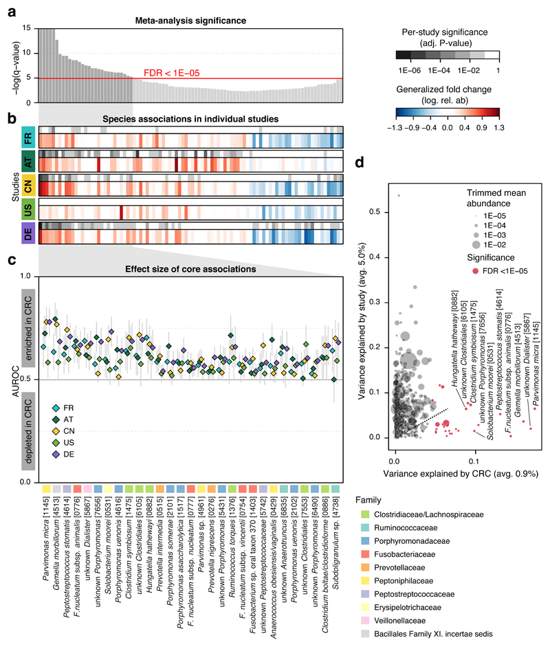
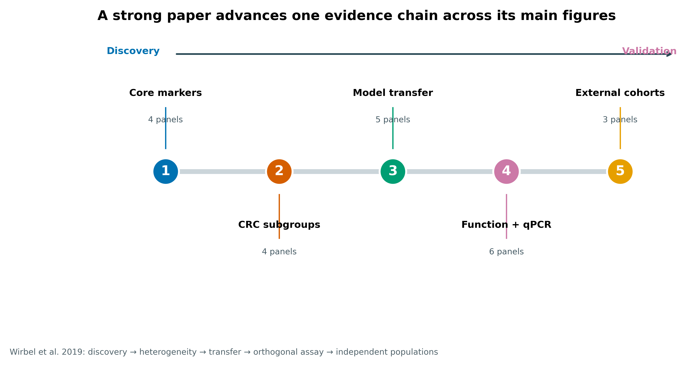
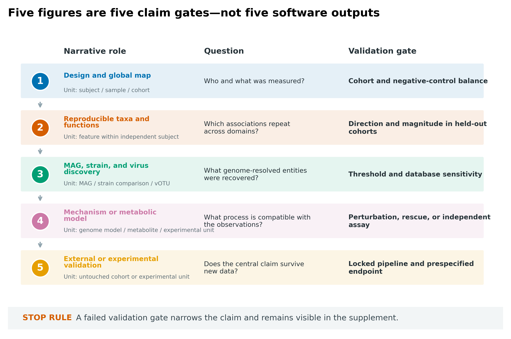
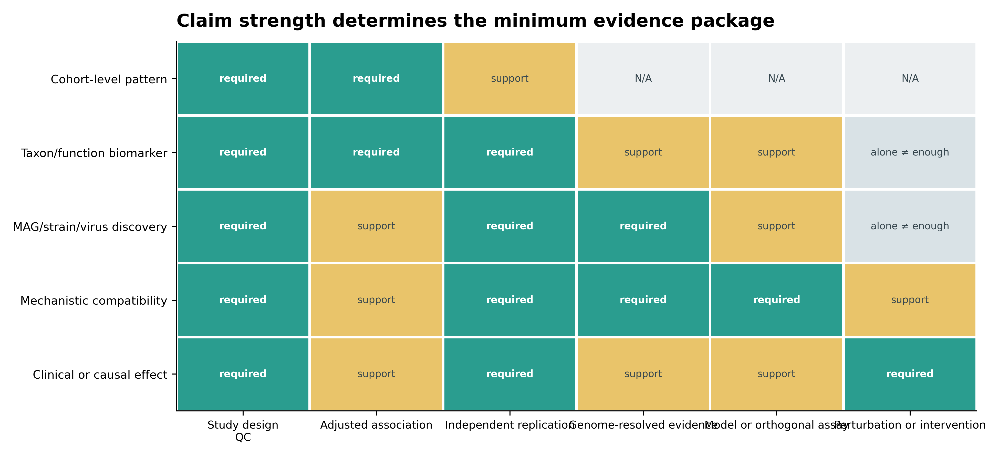
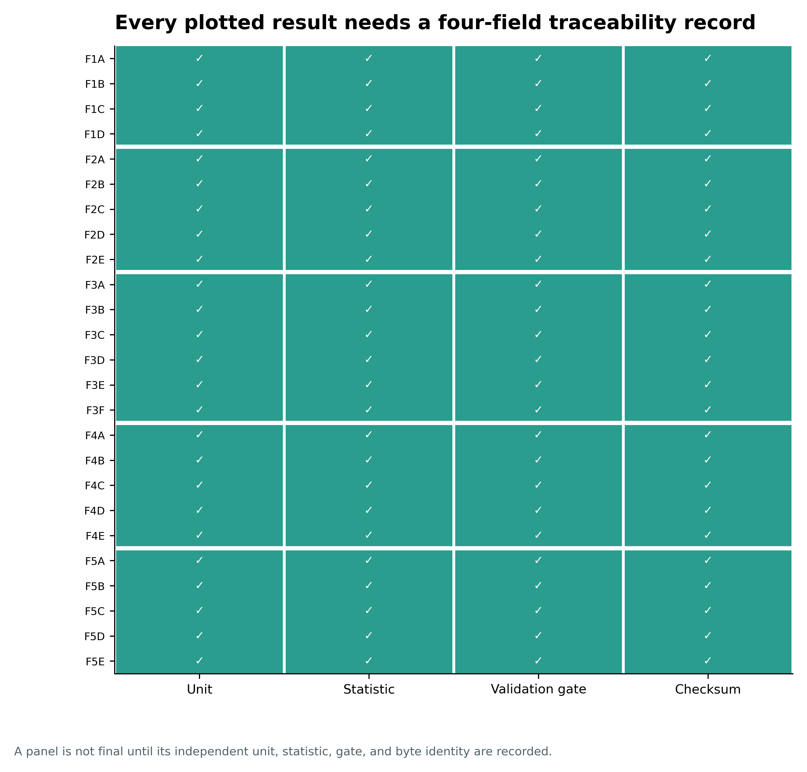
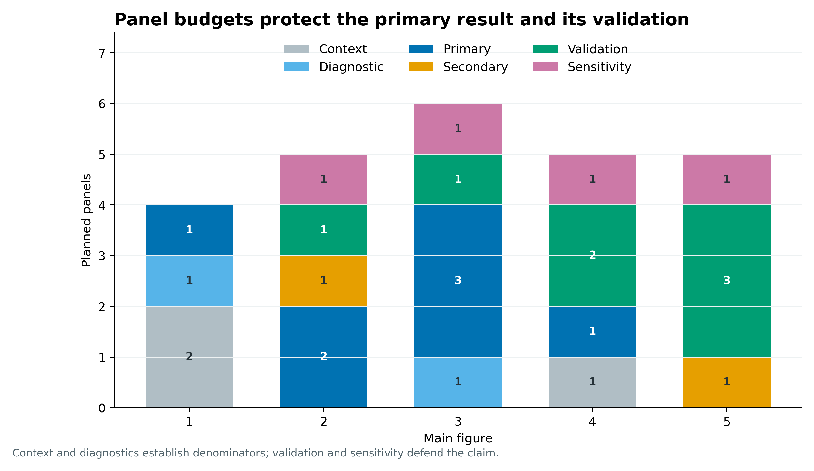
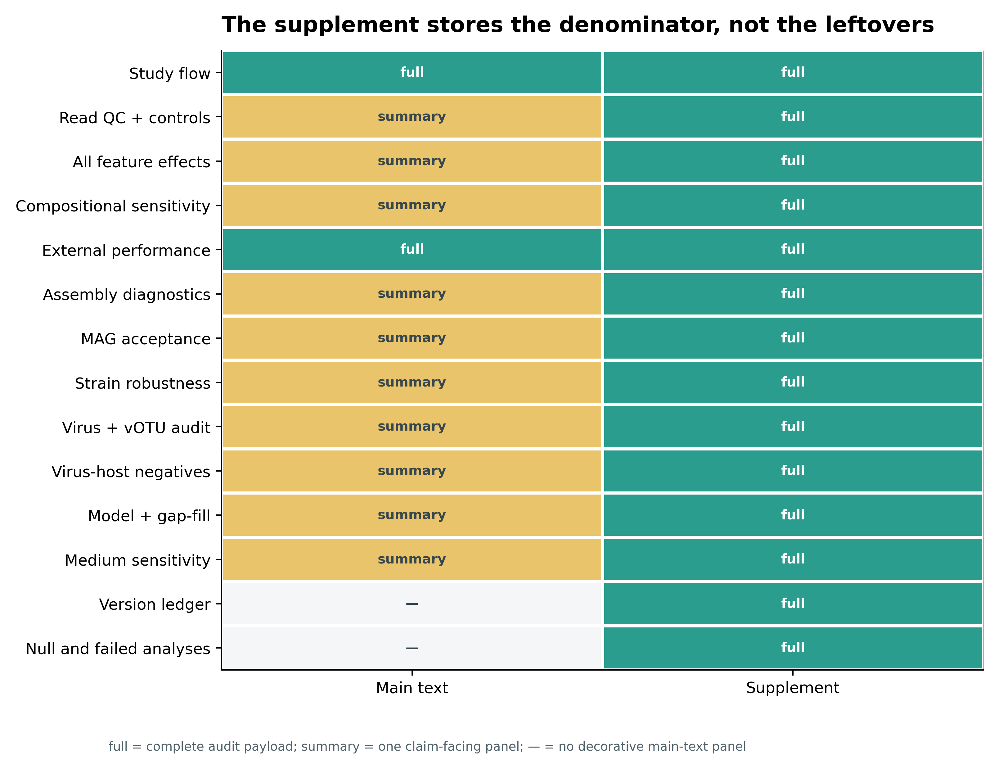
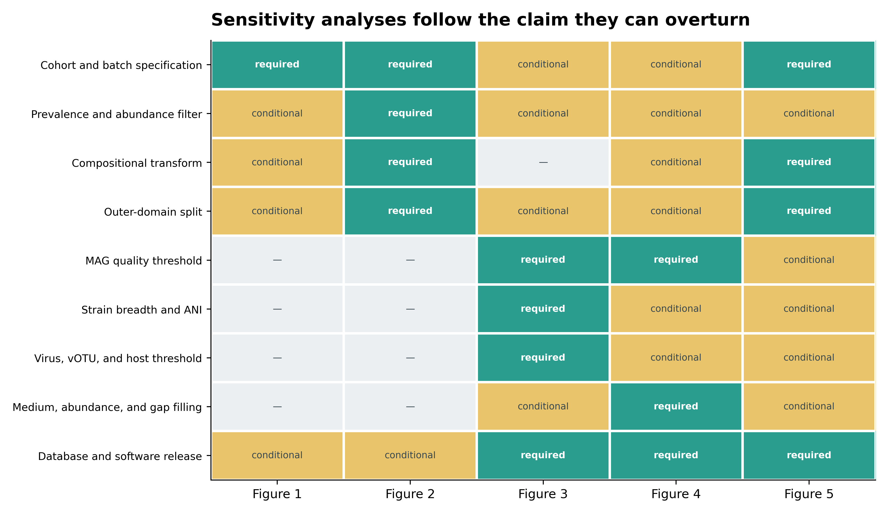
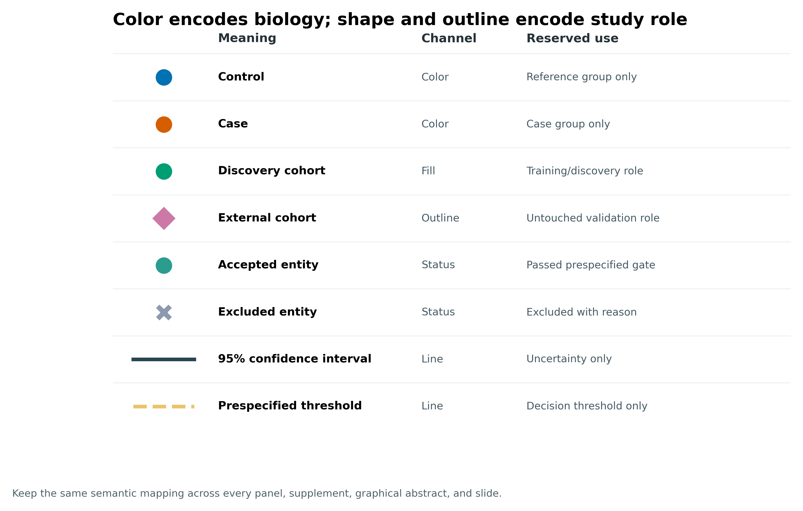
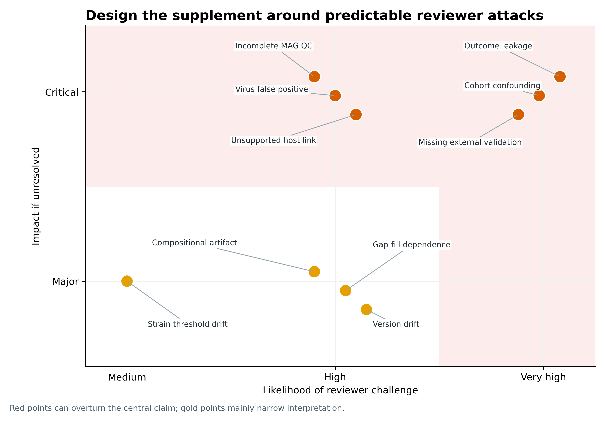

> **先给结论：**一篇完整的 shotgun 宏基因组论文，主图应沿着同一条证据链推进：**Figure 1 定义研究对象与分母，Figure 2 给出跨队列可重复的物种和功能，Figure 3 展示通过质量门槛的 MAG、菌株或病毒发现，Figure 4 把关联收窄到机制兼容性或代谢模型，Figure 5 用完全未参与筛选的队列或实验检验中心结论**。补充材料不是“放不下的图”，而是主张成立所依赖的完整 QC、全量结果、实体纳入表、数据库版本、阴性结果与敏感性分析。

本章用 Wirbel 等 2019 年 CRC 宏基因组 meta 分析的五幅主图作为结构锚点 [@wirbel2019crc]，再用本系列已经冻结的真实公开数据说明每类证据应长什么样。后者来自**不同研究、mock community 和验证 fixture**；它们只用于演示结果台账，不能把这些数值拼成同一个生物学故事。

```{r}
#| label: load-article75-ledgers
#| include: false
data_dir75 <- "data/small/75-paper-figure-organization-frozen"
if (!dir.exists(data_dir75)) {
  data_dir75 <- "../data/small/75-paper-figure-organization-frozen"
}

read_tsv75 <- function(name) {
  utils::read.delim(
    file.path(data_dir75, name),
    check.names = FALSE,
    quote = "", comment.char = "", stringsAsFactors = FALSE
  )
}

paper75 <- read_tsv75("wirbel-main-figure-ledger.tsv")
story75 <- read_tsv75("main-figure-storyboard.tsv")
panel75 <- read_tsv75("panel-register.tsv")
supp75 <- read_tsv75("main-supplement-map.tsv")
claim75 <- read_tsv75("claim-evidence-matrix.tsv")
ladder75 <- read_tsv75("evidence-language-ladder.tsv")
sense75 <- read_tsv75("sensitivity-matrix.tsv")
trace75 <- read_tsv75("result-traceability-ledger.tsv")
metric75 <- read_tsv75("series-evidence-metrics.tsv")
version75 <- read_tsv75("version-ledger-example.tsv")

stopifnot(
  nrow(paper75) == 5L,
  sum(paper75$Panels) == 22L,
  nrow(story75) == 5L,
  nrow(panel75) == 25L,
  nrow(supp75) == 14L,
  nrow(claim75) == 30L,
  nrow(sense75) == 45L,
  nrow(trace75) == 25L,
  nrow(metric75) == 13L
)
```

## 这一步对应论文里的哪张图 {#sec-target}

Wirbel 等整合五个 discovery 队列，先问哪些物种在不同研究中方向一致。Figure 1a–c 把 meta 分析显著性、逐研究效应与核心标志物强度放在同一张图；Figure 1d 则正面比较 CRC 状态和 study identity 对物种变异的解释度。它没有把“队列效应”藏进一句 limitation，而是把混杂风险画进主图 [@wirbel2019crc]。

{#fig-75-anchor}

真正值得借鉴的不是 Figure 1 的排版，而是整篇论文的推进顺序：Figure 2 解释病例内部异质性，Figure 3 检查分类模型跨研究迁移，Figure 4 从功能关联走到 DNA/RNA qPCR，Figure 5 才把中心结果放进三个独立人群。**发现、解释、迁移、正交测量、外部验证各占一个明确位置。**

{#fig-75-paper-arc}

```{r}
#| label: table-wirbel-figure-ledger
#| echo: false
knitr::kable(
  paper75[, c("SourceLabel", "Panels", "NarrativeRole", "StatisticalUnit", "ValidationRole")],
  col.names = c("Figure", "Panels", "Narrative role", "Independent unit", "Validation role"),
  caption = "Wirbel 2019 五幅主图的结构台账；图注原文只以 SHA-256 固定，表内文字为释义。"
)
```

::: {.callout-note title="原论文结构不是所有项目的固定答案"}
若研究没有 MAG、菌株或病毒发现，Figure 3 不应为了显得“组学丰富”而强行加入；可以把它让给更完整的功能验证。相反，若 genome-resolved 发现本身就是主要贡献，MAG、菌株和病毒也不一定要挤进一张图，应按中心主张拆成两幅主图。**固定的是证据门，不是软件菜单。**
:::

## 理论：主图组织的是证据，不是分析菜单 {#sec-theory}

### 2.1 先写一句主张，再决定一幅图

每幅主图先写一个可证伪句子：

1. 研究对象、采样框和测量分母足以回答目标问题；
2. 物种或功能关联在独立 domain 中方向和量级可重复；
3. genome-resolved 实体通过预先规定的质量与覆盖门槛；
4. 代谢模型或正交实验支持一个边界清楚的机制解释；
5. 中心结论在未参与选择的数据或实验中仍成立。

然后为每句主张登记三个对象：**primary result、validation gate、stop rule**。如果 validation gate 失败，结论应降级，而不是把失败 panel 移到补图后继续使用原措辞。

{#fig-75-storyboard}

设第 (f) 幅图的中心主张为 (C_f)，主结果为 (R_f)，验证结果为 (V_f)。投稿时需要满足的不是“有图”，而是：

$$
C_f \subseteq E(R_f, V_f, U_f, D_f),
$$

其中 (U_f) 是真正独立的分析单位，(D_f) 是数据与方法适用边界。图做得再漂亮，也不能让 (C_f) 超过现有证据集合 (E)。

### 2.2 panel 的独立单位决定统计量

宏基因组论文常在同一幅图混合五种单位：subject、sample、feature、MAG/vOTU 和 pair。每个点到底是什么，决定了误差线、检验、随机效应和有效样本量：

- 多时间点来自同一个人时，点数不是独立受试者数；
- 一名受试者贡献几百个物种时，物种是多重检验单位，不是重复受试者；
- MAG 完整度和污染是 genome-level 质量属性，不能用 reads 数扩充样本量；
- strain pair 或 virus–host pair 共享样本或参考基因组时，pair 并非彼此独立；
- metabolic flux 来自模型与培养基假设，solver 解的数量不是生物学重复。

因此 panel register 至少要有 `AnalysisUnit`、`Statistic`、`Gate` 和 `ResultID`。图注再从台账自动生成，避免在排版阶段临时猜测 (n)。

### 2.3 主张越强，证据包越厚

“本队列观察到差异”“跨队列 biomarker”“发现新 vOTU”“与某代谢机制兼容”“产生临床或因果效应”需要的证据不同。尤其要守住三条边界：相关不等于外部 biomarker；代谢潜力不等于体内通量；宿主预测不等于正在感染或产生因果生态效应。

{#fig-75-claim-evidence}

MIMAG 要求把 MAG 的完整度、污染、rRNA、tRNA 与质量等级放在可追踪记录中 [@bowers2017mimag]；MIUViG 对病毒序列来源、质量、分类与宿主证据提出对应记录要求 [@roux2019miuvig]。这些表不是主图的替代品，而是主图中每一个 genome-resolved 点的审计底座。

### 2.4 补图保存分母、全量结果和失败路径

主图做信息压缩，补图负责保持可审计性。判断某项内容放哪，不看“漂不漂亮”，看它与中心主张的关系：

- 没它就无法理解中心结果：主图；
- 没它就无法判断中心结果是否可信：主图摘要 + 补充材料全量；
- 它定义纳入、排除、数据库或敏感性边界：Methods + 补充材料；
- 它是阴性或失败分析：补充材料，并在主文相应位置诚实引用；
- 它只是另一个软件输出、没有新问题：删除。

## 准备工作 {#sec-preparation}

### 3.1 数据、算力与证据边界

本章不重跑 FASTQ、组装或分箱。输入是一个小型、checksum-covered 投稿设计包：锚定论文的 DOI、五幅主图成员哈希和释义台账，以及不同公开示例的结果摘要。完整 XML 和动态 ZIP 仅在下载区核验，不进入冻结包；ZIP 外层时间戳可能变化，因此锁定的是其中五个 JPEG 成员，而不是外层压缩文件。

| Stage | CPU | RAM | Disk | Time |
|---|---:|---:|---:|---:|
| Verify Europe PMC XML and five members | 1 | <1 GB | about 6 MB | seconds to 2 min |
| Build all ledgers | 1 | <1 GB | <10 MB | seconds |
| Render nine vector/raster diagrams | 1 | 1–2 GB | about 5 MB | <1 min |
| Quarto render and QA | 1 | 2–4 GB | <100 MB | about 1–3 min |

这里的 8 队列/771 人、23 个 MAG、菌株比较、病毒 mock community、代谢模型和因果证据指标来自不同章节的数据对象。**它们不是同一批样本，也不共同支持任何疾病机制。**换成自己的论文时，只能登记同一 analysis contract 下真实生成的结果。

### 3.2 下载锚定资料并核验成员

```{bash}
#| eval: false
python3 scripts/download_article75_paper.py \
  --output-dir downloads/article75

python3 scripts/download_article75_paper.py \
  --output-dir downloads/article75 \
  --verify-only

python3 scripts/prepare_article75_storyboard.py \
  --project-root . \
  --evidence-dir downloads/article75 \
  --output-dir results/75-paper-figure-organization
```

全文 XML 的固定 SHA-256 为 `b6363f2dcf652a352546e8550b43673ffc6518047e35bd722d1f60653e5793a8`。下载器还核验 DOI `10.1038/s41591-019-0406-6`、题名、Figure 1–5 与 ZIP 成员名的一一对应，以及五个成员各自的 SHA-256。

### 3.3 安装依赖并内联作图函数

<details>
<summary>展开：R/Python 依赖、随机状态与出版级导出函数</summary>

```bash
mamba create -n article75 -y -c conda-forge \
  python=3.13 pandas=3.0 matplotlib=3.10 pillow=12.2 pyyaml=6.0 \
  r-base=4.4 r-ggplot2=3.5 r-knitr r-scales
conda activate article75
```

```{r}
#| eval: false
set.seed(20260775)

pal_pub <- c(
  Control = "#0072B2", Case = "#D55E00",
  Discovery = "#009E73", External = "#CC79A7",
  Threshold = "#E9C46A", Excluded = "#8D99AE"
)

theme_pub <- function(base_size = 10) {
  ggplot2::theme_classic(base_size = base_size) +
    ggplot2::theme(
      plot.title = ggplot2::element_text(face = "bold"),
      legend.position = "top",
      axis.text = ggplot2::element_text(color = "#263238"),
      strip.background = ggplot2::element_blank(),
      strip.text = ggplot2::element_text(face = "bold")
    )
}

save_pub <- function(plot, stem, width = 180, height = 120) {
  ggplot2::ggsave(
    paste0(stem, ".pdf"), plot,
    width = width, height = height, units = "mm",
    device = grDevices::cairo_pdf
  )
  ggplot2::ggsave(
    paste0(stem, ".png"), plot,
    width = width, height = height, units = "mm",
    dpi = 360, bg = "white"
  )
}
```

</details>

::: {.callout-important title="先冻结结论，再让美工开始排版"}
当 panel 还会因阈值、样本排除或模型选择而变化时，不要先在 Illustrator 里手工拼版。先冻结 `ResultID → source table → statistic → validation gate → checksum`，再批量导出 panel。否则最终 PDF 很容易混入不同分析批次。
:::

## 可复制代码 {#sec-code}

### 4.1 先建 result ledger，而不是先开画布

下面是一份最小结果登记函数。`claim_id` 指向中心主张，`unit` 写真正独立单位，`source_sha256` 锁定产生该结果的表；不要把图片文件名当唯一溯源。

```{r}
#| eval: false
new_result_record <- function(
  result_id, claim_id, figure, panel,
  unit, statistic, validation_gate,
  source_table, source_sha256,
  code_file, output_file
) {
  stopifnot(
    grepl("^F[1-9][A-Z]$", result_id),
    nzchar(unit), nzchar(statistic), nzchar(validation_gate),
    grepl("^[0-9a-f]{64}$", source_sha256)
  )
  data.frame(
    ResultID = result_id,
    ClaimID = claim_id,
    Figure = figure,
    Panel = panel,
    AnalysisUnit = unit,
    Statistic = statistic,
    ValidationGate = validation_gate,
    SourceTable = source_table,
    SourceSHA256 = source_sha256,
    CodeFile = code_file,
    OutputFile = output_file,
    stringsAsFactors = FALSE
  )
}
```

一个结果进入主图前，至少通过以下检查：

```{r}
#| eval: false
assert_result_ledger <- function(x) {
  required <- c(
    "ResultID", "ClaimID", "Figure", "Panel", "AnalysisUnit",
    "Statistic", "ValidationGate", "SourceTable", "SourceSHA256",
    "CodeFile", "OutputFile"
  )
  stopifnot(
    all(required %in% names(x)),
    !anyDuplicated(x$ResultID),
    all(nzchar(x$AnalysisUnit)),
    all(nzchar(x$Statistic)),
    all(nzchar(x$ValidationGate)),
    all(grepl("^[0-9a-f]{64}$", x$SourceSHA256))
  )
  invisible(TRUE)
}
```

{#fig-75-traceability}

### 4.2 给五幅主图分配 panel budget

主图 panel 数不是越多越好。每幅图至少保留一个 primary panel 和一个 validation/sensitivity panel；context 与 diagnostic 只保留读懂分母所必需的部分。

```{r}
#| label: table-panel-budget
#| echo: false
panel_budget75 <- as.data.frame.matrix(table(panel75$Figure, panel75$PanelRole))
panel_budget75$Figure <- rownames(panel_budget75)
rownames(panel_budget75) <- NULL
panel_budget75 <- panel_budget75[, c("Figure", setdiff(names(panel_budget75), "Figure"))]
knitr::kable(panel_budget75, caption = "五幅主图的 panel 角色预算。")
```

{#fig-75-panel-budget}

一个实用的删图顺序是：先删重复软件视图，再删没有独立问题的描述图，最后把完整 QC 和阈值网格迁入补充材料。不要先删 external validation、阴性对照或不确定性。

### 4.3 同时写 main map 与 supplement map

```{r}
#| eval: false
place_result <- function(claim_distance, needed_for_trust, full_audit) {
  main <- if (claim_distance == 0L) "full" else if (needed_for_trust) "summary" else "none"
  supplement <- if (full_audit || needed_for_trust) "full" else "optional"
  data.frame(Main = main, Supplement = supplement)
}

place_result(
  claim_distance = 1L,
  needed_for_trust = TRUE,
  full_audit = TRUE
)
# Main = summary; Supplement = full
```

{#fig-75-main-supp}

推荐的补充材料目录如下：

1. sample flow、排除原因、metadata dictionary 与缺失模式；
2. reads QC、去宿主、阴性/空白对照和测序批次；
3. 所有物种、基因、通路的 effect size、CI、P、FDR、prevalence；
4. compositional transform、过滤阈值和协变量敏感性；
5. 完整外部预测、校准、domain shift 与失败队列；
6. assembly/binning 指标和每个 MAG 的纳入/排除原因；
7. strain breadth、ANI、marker、树拓扑与阈值审计；
8. virus caller 交集、CheckV、vOTU、分类、丰度和宿主证据等级；
9. 每个代谢模型的 gap-fill burden、medium、solver 与 abundance sensitivity；
10. 软件、数据库、容器、参数、随机种子和 checksum；
11. 阴性、null、未收敛和预先计划但无法估计的分析；
12. 数据、代码、MAG/vOTU accession 与 result-to-source ledger。

### 4.4 用真实结果测试图的证据边界

下面的指标来自不同公开对象，目的不是组成一篇虚构论文，而是检查图注能否说清分析单位和边界。

```{r}
#| label: table-series-evidence-metrics
#| echo: false
knitr::kable(
  metric75[, c("Domain", "Metric", "Value", "Unit", "EvidenceBoundary")],
  col.names = c("Domain", "Metric", "Value", "Unit", "Boundary"),
  caption = "来自不同公开数据与 fixture 的结果登记示例；不得跨行合并为生物学结论。"
)
```

例如，8 个完整 CRC 队列的 771 名受试者可支撑 cross-cohort LODO 图；层级 bootstrap 的 macro AUROC 为 0.779（95% CI 0.711–0.832），但 (I^2=52.1\%\) 仍要在主文显示。另一个 MAG fixture 有 23 个通过审计的 bins，其中 4 个 high-quality、19 个 medium-quality；这只能说明 acceptance table 如何组织，不能与 CRC 模型相连。病毒 mock community 的 12 个 vOTU、代谢模型的 48 个模型和 virus-host 阴性对照同理。

### 4.5 让敏感性分析跟着可被推翻的主张走

敏感性分析不是最后统一做一张“大杂烩热图”。它应回答：改变哪个合理选择，会让哪一幅主图的结论改变？

{#fig-75-sensitivity}

```{r}
#| eval: false
required_sensitivity <- subset(
  sense75,
  Requirement == "Required",
  select = c(SensitivityAxis, Figure)
)
split(required_sensitivity$SensitivityAxis, required_sensitivity$Figure)
```

这张矩阵应在看最终 P 值和 AUC 前冻结。若先看结果再只展示“最稳定”的阈值，就是选择性报告。

### 4.6 冻结投稿包

```{bash}
#| eval: false
MPLCONFIGDIR=/tmp/article75-mpl \
python3 scripts/plot_article75_storyboard.py \
  --input-dir results/75-paper-figure-organization \
  --figures-dir figures/article75

python3 scripts/freeze_article75_storyboard.py \
  --project-root . \
  --work-dir results/75-paper-figure-organization \
  --output-dir data/small/75-paper-figure-organization-frozen

(cd data/small/75-paper-figure-organization-frozen && \
  sha256sum -c file-checksums.sha256)
```

冻结包不应只含最终 PNG。至少保留 result ledger、panel register、claim matrix、完整 TSV、输入/输出 checksum、环境锁、生成脚本、数据库版本表和原图权利边界。

## 审计与升级 {#sec-audit}

### 5.1 先忠实复现 2019 年的证据顺序

Wirbel 2019 的主干是 read-based species/function meta analysis：逐研究效应、blocked test、单队列迁移、LOSO、多疾病 specificity、qPCR 和三个独立人群 [@wirbel2019crc]。复现时先保持这些 estimand 和数据分层，不应用今天的工具名称替换后宣称“逐值复刻”。尤其要记录：

- 原分析与当前 curatedMetagenomicData 的 profile、数据库和样本口径不同；
- study-to-study transfer 与真正的 N−1/LODO 回答不同问题；
- Figure 2 的病例亚组结果是探索性结构，不应升级成稳定亚型；
- qPCR 支持特定基因的 DNA/RNA 测量，不等于验证整个因果机制；
- 独立病例–对照队列验证不等于筛查人群的临床效用。

### 5.2 再按当前标准补齐 genome-resolved 分支

今天的 shotgun 项目可能多出 MAG、菌株、病毒和代谢模型。新增分支必须增加对应的质量门，而不是只增加一个彩色 panel：

- MAG：CheckM2/marker quality、GUNC、MIMAG 字段、GTDB release、contig/graph 边界与纳入原因 [@bowers2017mimag; @chklovski2023checkm2; @orakov2021gunc]；
- 菌株：coverage breadth、SNP/ANI 阈值、marker 数、alignment sites、reference sampling 与 topology sensitivity [@olm2021instrain; @truong2017strainphlan]；
- 病毒：至少两类发现证据、CheckV quality、vOTU ANI + alignment fraction、分类 release、丰度 breadth 与宿主证据等级 [@roux2019miuvig; @nayfach2021checkv]；
- 代谢模型：input MAG quality、GPR coverage、gap-fill burden、medium、abundance、solver、alternative optimum 与外部代谢物/实验验证 [@diener2020micom]。

若其中一条分支只有描述性输出，标题和结论就停在“discovery”或“prediction”，不要借 Figure 4 的位置把它写成 mechanism。

### 5.3 用证据阶梯约束措辞

```{r}
#| label: table-evidence-language
#| echo: false
knitr::kable(
  ladder75,
  col.names = c("Rung", "Evidence", "Allowed wording", "Forbidden leap"),
  caption = "结论措辞必须停在已达到的最高证据层。"
)
```

最危险的跳跃常发生在三处：

1. “associated with” 直接写成 “drives”；
2. “genetic potential/model-predicted exchange” 直接写成 “produces/transfers in vivo”；
3. “predicted host” 直接画成正在感染该物种的实线箭头。

证据链可以支持更具体的假设，但不能凭图形箭头制造更强结论。

## 出版级美化 {#sec-publication}

### 6.1 一套语义只占一个视觉通道

颜色优先编码生物学组别；shape、outline 或 line type 再编码 discovery/external、included/excluded 与 threshold/CI。不要让红色在 Figure 2 表示病例、Figure 3 表示 high-quality MAG、Figure 4 又表示正 flux。

{#fig-75-style}

建议全稿固定：

- `Control` 蓝、`Case` 橙红；
- discovery cohort 实心、external cohort 空心或菱形；
- accepted entity 绿色、excluded entity 灰色并保留排除原因；
- 95% CI 用深色实线，prespecified threshold 用黄色虚线；
- 物种名斜体，MAG/vOTU ID 使用固定格式；
- panel label 统一为粗体小写或大写，但全稿只选一种；
- 图内轴、图例、注释一律英文，中文解释留在正文和图注。

### 6.2 图注要能离开正文单独成立

每个 panel 的图注按同一顺序写：

> **What was measured → independent unit and n → grouping/exclusion → statistic and sidedness → multiplicity correction → interval/error bar definition → validation status → abbreviation and database release.**

不要只写 “Data are mean ± SD”。需要明确 SD 是生物学重复之间的离散、bootstrap 不确定性，还是模型在外层队列之间的波动。

### 6.3 导出同时保留矢量与高分辨率位图

- 线图、森林图、散点和示意图：PDF/SVG 为权威源；
- 热图和高密度 raster：至少 300–600 dpi，检查缩放后的标签；
- 所有 panel 使用相同物理字号，不靠不同缩放“看起来一样”；
- 最终拼图前用期刊目标栏宽检查 100% 大小；
- PDF/SVG 中保留可搜索英文文字，提交前嵌入字体；
- PNG/TIFF 只作为投稿系统或公众号兼容副本。

## 常见坑 {#sec-pitfalls}

{#fig-75-reviewer-map}

::: {.callout-caution title="坑 1：按软件分主图"}
“MetaPhlAn 一图、HUMAnN 一图、CheckM2 一图、GTDB-Tk 一图”只说明跑了哪些工具，没有说明每幅图回答什么问题。把同一主张需要的物种、功能、效应量和验证放在一起；工具版本进入 Methods 与版本台账。
:::

::: {.callout-caution title="坑 2：把 external validation 藏进补图"}
若论文标题或摘要宣称 biomarker、generalizable、robust 或 clinical relevance，完整 external cohort/experiment 就是主结果。只展示 discovery CV，把外测失败放补图，会让整个证据顺序倒置。
:::

::: {.callout-caution title="坑 3：只展示 high-quality MAG，隐藏所有淘汰对象"}
主图可以突出少数代表 MAG；补充材料必须列出所有 bins 的 completeness、contamination、GUNC、MIMAG tier、taxonomy、纳入状态和排除原因。否则 genome selection 无法审计。
:::

::: {.callout-caution title="坑 4：把 strain tree 当传播证据"}
近邻关系可能来自 reference sampling、marker 缺失、coverage 或树方法。没有纵向、流行病学接触和足够分辨率时，树支持 genetic similarity，不自动支持 transmission。
:::

::: {.callout-caution title="坑 5：virus-host 箭头没有证据等级"}
integrated prophage、CRISPR spacer、long-read/Hi-C、iPHoP、k-mer 和 co-abundance 的 claim ceiling 不同。图中线型、透明度或边框必须映射 evidence tier；仅 composition/co-abundance 不能画成确定宿主。
:::

::: {.callout-caution title="坑 6：模型有 flux 就写机制成立"}
FBA/MICOM 输出依赖 genome annotation、gap filling、培养基、abundance 和 objective。主图至少展示 medium/gap-fill sensitivity；若没有代谢物、转录、培养或 perturbation，措辞停在 model-predicted potential。
:::

::: {.callout-caution title="坑 7：所有失败结果都消失"}
不收敛模型、零生长样本、低质量病毒、外测失败队列和预先计划但不可估计的比较，都是结果边界。保留它们，说明原因，并在结论中降级；不要只存于个人临时目录。
:::

::: {.callout-caution title="坑 8：同一批数据完成筛选、调参和验证"}
随机拆 sample 不能模拟新医院、新国家或新批次。外层按目标 domain 留出，所有过滤、transform、feature selection、超参数和 cutoff 只在 training domains 决定；最后一次 external test 不再回流。
:::

## 这段 Methods 怎么写 {#sec-methods}

下面模板同时覆盖主图规划、结果台账、敏感性和版本冻结。方括号替换成真实项目值；没有做的分支应删除，不能保留成含糊占位。

> **Figure organization and result provenance.** Main figures were prespecified around five claim-level evidence gates: study design and global structure; cross-domain taxonomic and functional associations; genome-resolved MAG, strain, and viral discoveries; mechanistic or metabolic-model compatibility; and external-cohort or experimental validation. Each panel was assigned a stable result identifier linked to its independent analysis unit, source table, statistical estimand, validation criterion, generating script, output artifact, and SHA-256 checksum. Main-text panels reported the primary estimate and the validation result required to support the corresponding claim. Complete per-sample quality metrics, all tested features, MAG acceptance records, strain and vOTU threshold audits, virus-host evidence tiers, model gap-filling and medium-sensitivity results, null or failed analyses, and software/database/container checksums were retained in the Supplementary Information. External cohorts or experiments were excluded from feature selection, preprocessing estimation, model tuning, and decision-threshold selection. Sensitivity analyses were prespecified for cohort/batch specification, prevalence filtering, compositional transformation, genome-quality thresholds, strain breadth/ANI, viral and host-linkage thresholds, metabolic medium and gap filling, and database release. Figure text and legends used a manuscript-wide semantic color/shape contract, and figures were exported as vector PDF/SVG plus 360-dpi PNG. Downstream statistical tables were generated in R v4.4.1 with ggplot2 v3.5.1; the storyboard and checksum audit used Python v3.13.2, pandas v3.0.3, matplotlib v3.10.9, and Pillow v12.2.0. All stochastic operations used seed 20260775. Database releases, artifact names, checksums, and access dates are reported in Supplementary Table [X].

对于真实生物学分析，还要在同一段或相邻段落补齐：每个工具版本、完整参数、数据库 release、sample/subject 数、重复结构、协变量、检验双侧性、多重校正、CI 方法、outer split、预设阈值和排除标准。只写“default parameters were used”不够。

## 换成你自己的数据怎么做 {#sec-own-data}

### 9.1 先准备九张权威表

开始拼图前，至少准备：

1. `sample-ledger.tsv`：subject、sample、cohort、time、condition、batch、exclusion；
2. `read-qc.tsv`：raw/clean/host reads、depth、controls、QC pass；
3. `feature-effects.tsv`：taxon/function、effect、CI、P、FDR、prevalence、cohort heterogeneity；
4. `external-predictions.tsv`：outer cohort、truth、score、locked cutoff、calibration；
5. `mag-acceptance.tsv`：completeness、contamination、GUNC、MIMAG、taxonomy、status、reason；
6. `strain-virus-ledger.tsv`：breadth、ANI/p-distance、marker、CheckV、vOTU、host evidence；
7. `metabolic-model-ledger.tsv`：model ID、GPR、gap fill、medium、solver、growth/flux、sensitivity；
8. `version-ledger.tsv`：tool、container、database、release、artifact、checksum；
9. `result-ledger.tsv`：每个 ResultID 的 claim、unit、statistic、gate、source、code、output、checksum。

表没有完成，就说明相应图还没有完成。

### 9.2 按研究类型选择主干，不必强行五类全做

- **read-based association paper**：F1 design/QC；F2 taxa/functions；F3 heterogeneity/interaction；F4 predictive or orthogonal assay；F5 external cohort。
- **genome-resolved discovery paper**：F1 design/assembly；F2 MAG yield/quality；F3 phylogeny/novelty；F4 strain/virus/function；F5 independent recovery or experiment。
- **mechanistic paper**：F1 cohort observation；F2 focal taxon/function；F3 genome/strain evidence；F4 model + perturbation/rescue；F5 independent human/animal/experimental validation。
- **resource/catalog paper**：F1 sampling frame；F2 recovery/quality；F3 taxonomy/novelty；F4 biogeography/function；F5 benchmark and external utility。

只保留与中心问题相关的分支。一个没有病毒研究设计和合适文库的项目，不需要为了“完整”增加 virus figure。

### 9.3 建立版本台账

```{r}
#| label: table-version-ledger
#| echo: false
knitr::kable(
  version75,
  col.names = c("Layer", "Resource", "Release", "Artifact", "Checksum", "Boundary"),
  caption = "版本台账示例。read-based 与 genome-resolved 行来自不同示例，不能视为一次联合运行。"
)
```

版本表必须记录真正参与结果生成的 artifact，而不是写当前网页上的 latest。数据库更新后新建目录和新结果，不要原地覆盖旧 release。

### 9.4 投稿前执行四级 gate

**Claim gate**

- 每幅主图能否用一句可证伪的话概括？
- 标题、摘要和箭头是否超过证据阶梯？
- validation 失败时，主张是否同步降级？

**Statistical gate**

- 每个 panel 的独立单位和 (n) 是否明确？
- effect size、CI、FDR、校准和 heterogeneity 是否优先于星号？
- outer cohort/experiment 是否完全未参与选择？

**Genome-resolved gate**

- 每个 MAG/vOTU/strain/host link 能否追到质量、阈值和数据库？
- 低质量、未定和排除对象是否仍在全量表？
- metabolic result 是否同时报告 medium、gap fill 和 evidence ceiling？

**Reproducibility gate**

- 每个 ResultID 能否追到 source table、script、environment、output 和 checksum？
- 图内文字是否全英文，矢量和 360-dpi 位图是否都存在？
- 数据、代码、MAG/vOTU accession 与 availability statement 是否互相一致？

最后在一个干净目录重建一次投稿包；随机抽取至少一个主图 panel、一个 MAG、一个 vOTU 和一个 external prediction，从图反向追到原始行与命令。任何一条链断开，就先修台账，不要继续排版。

## 参考 {#sec-references}

- Wirbel J, et al. *Nature Medicine* (2019): CRC fecal metagenome meta-analysis and cross-study validation [@wirbel2019crc].
- Bowers RM, et al. *Nature Biotechnology* (2017): MIMAG genome reporting standards [@bowers2017mimag].
- Roux S, et al. *Nature Biotechnology* (2019): MIUViG virus genome reporting standards [@roux2019miuvig].
- Olm MR, et al. *Nature Biotechnology* (2021): inStrain population genomics [@olm2021instrain].
- Truong DT, et al. *Genome Research* (2017): StrainPhlAn strain phylogenetics [@truong2017strainphlan].
- Nayfach S, et al. *Nature Biotechnology* (2021): CheckV viral genome quality [@nayfach2021checkv].
- Diener C, et al. *mSystems* (2020): MICOM community metabolic modeling [@diener2020micom].
