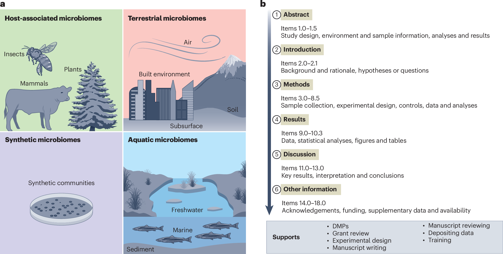
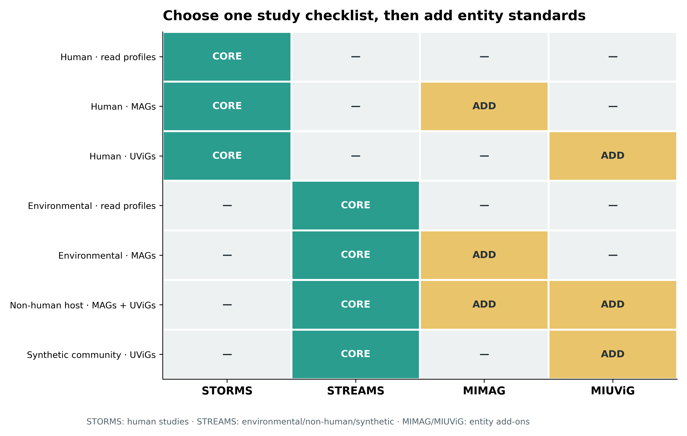
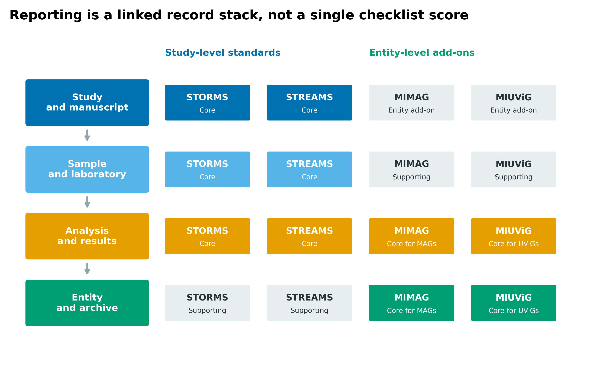
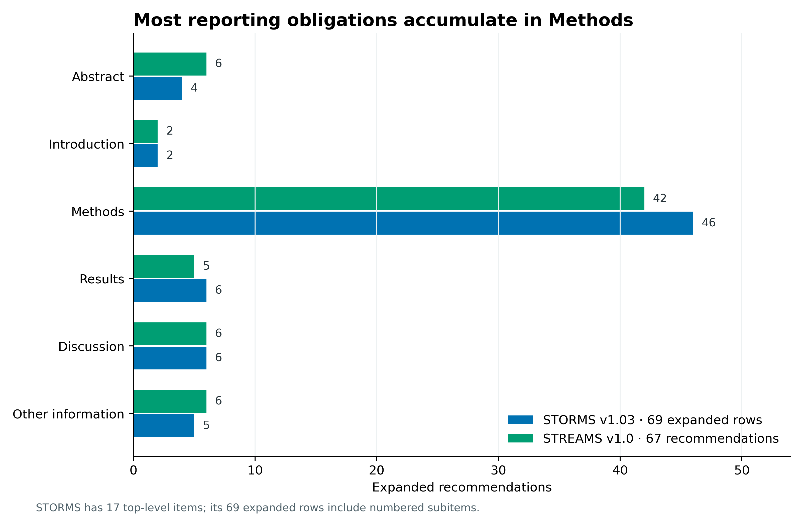
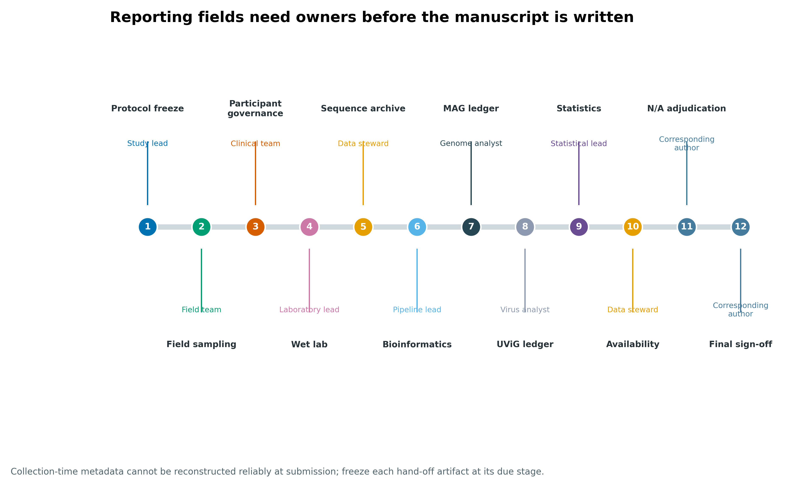
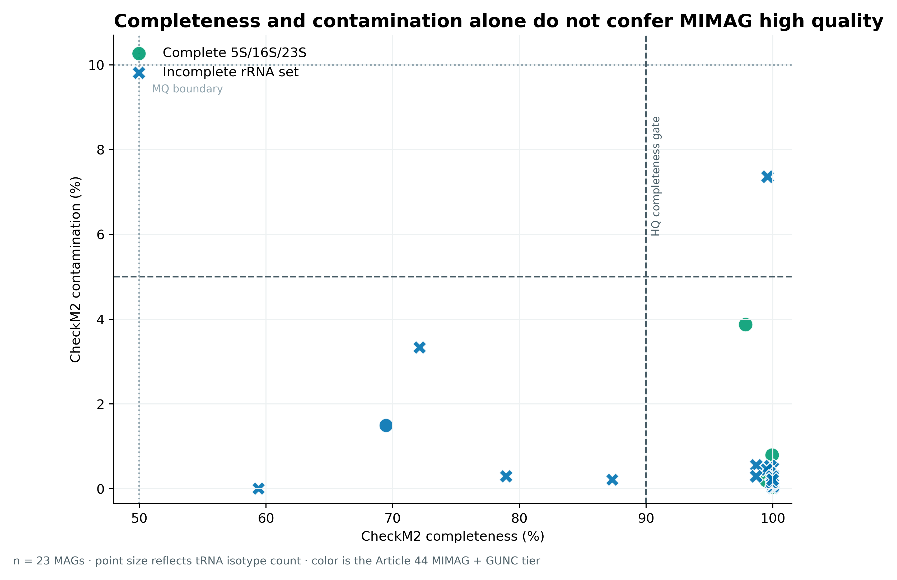
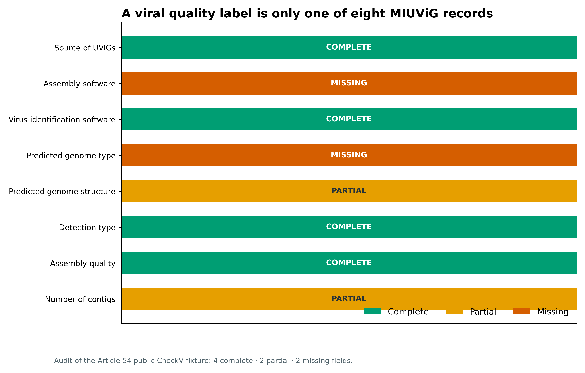
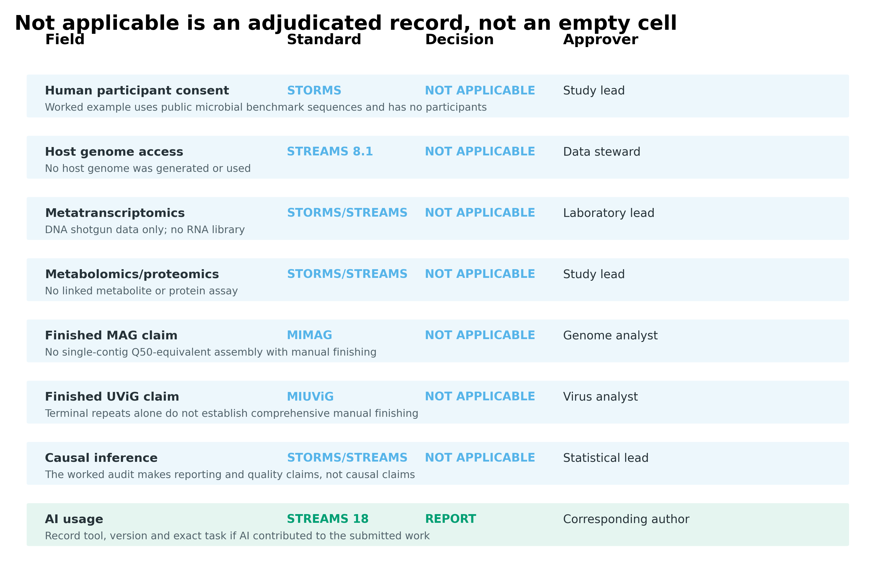
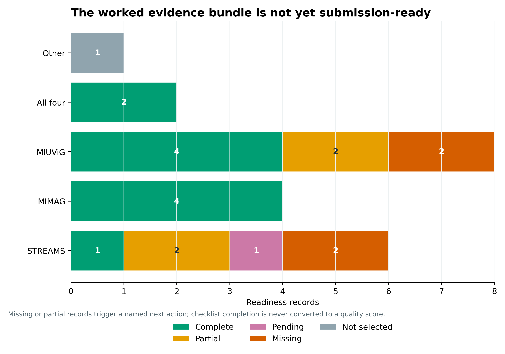
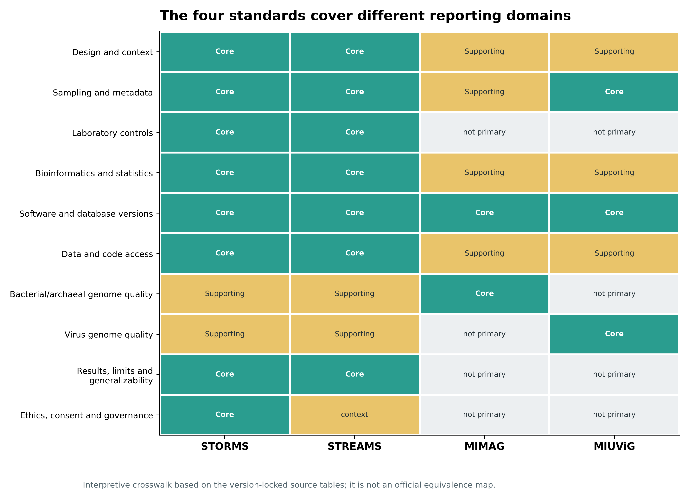

> **先给结论：**人体微生物组研究先用 **STORMS**，环境、非人宿主或合成微生物组研究先用 **STREAMS**；报告细菌或古菌 SAG/MAG 时再加 **MIMAG**，报告未培养病毒基因组（uncultivated virus genome, UViG）时再加 **MIUViG**。前两者约束研究设计、方法、结果与开放性，后两者约束逐基因组实体记录。它们互补，不能互相替代；清单也**不是研究质量评分**。

```{r}
#| label: load-article76-ledgers
#| include: false
data_dir76 <- "data/small/76-reporting-standards-frozen"
if (!dir.exists(data_dir76)) {
  data_dir76 <- "../data/small/76-reporting-standards-frozen"
}

read_tsv76 <- function(name) {
  utils::read.delim(
    file.path(data_dir76, name),
    check.names = FALSE,
    quote = "", comment.char = "", stringsAsFactors = FALSE
  )
}

items76 <- read_tsv76("checklist-items.tsv")
sections76 <- read_tsv76("checklist-section-counts.tsv")
selection76 <- read_tsv76("standard-selection-matrix.tsv")
layers76 <- read_tsv76("reporting-layer-map.tsv")
crosswalk76 <- read_tsv76("standards-crosswalk.tsv")
mimag_def76 <- read_tsv76("mimag-quality-criteria.tsv")
miuvig_def76 <- read_tsv76("miuvig-mandatory-metadata.tsv")
mag76 <- read_tsv76("article44-mimag-compliance.tsv")
virus76 <- read_tsv76("article54-miuvig-compliance.tsv")
owners76 <- read_tsv76("field-responsibility-matrix.tsv")
na76 <- read_tsv76("not-applicable-ledger.tsv")
ready76 <- read_tsv76("submission-readiness.tsv")

as_bool76 <- function(x) {
  unname(c("true" = TRUE, "false" = FALSE)[tolower(as.character(x))])
}

for (column in c(
  "GUNCPass", "Complete5S", "Complete16S", "Complete23S",
  "CompleteRRNASet", "CoreVsExtendedAgreement"
)) {
  mag76[[column]] <- as_bool76(mag76[[column]])
}
na76$ReasonRecorded <- as_bool76(na76$ReasonRecorded)

stopifnot(
  nrow(items76) == 136L,
  sum(items76$Standard == "STORMS") == 69L,
  sum(items76$Standard == "STREAMS") == 67L,
  nrow(mag76) == 23L,
  sum(mag76$Article44ExtendedTier == "High quality") == 4L,
  nrow(virus76) == 8L,
  sum(virus76$Status == "Complete") == 4L,
  nrow(owners76) == 12L,
  nrow(ready76) == 21L
)
```

## 这一步对应论文里的哪张图 {#sec-target}

STREAMS 的 Figure 1a 先划定适用对象：非人宿主相关、陆地、水体和合成微生物组；Figure 1b 再把 67 条建议映射到 Abstract、Introduction、Methods、Results、Discussion 和 Other information 六个论文部分 [@kelliher2025streams]。这张图最重要的信号不是“有一张清单”，而是**报告从研究问题开始，贯穿样本、实验、分析、结果解释与数据可用性**。

{#fig-76-anchor}

STORMS 面向人体微生物组，正式论文概括为 17 个一级条目 [@mirzayi2021storms]；v1.03 工作簿把子条目展开后共有 69 行 [@storms2021zenodo]。STREAMS v1.0 工作簿的正式 `STREAMS_final` 页签则有 67 行 [@streams2025zenodo]。两者都覆盖六个论文部分，但适用人群、伦理语境、环境元数据与样本治理不同。

::: {.callout-important title="先按研究对象选主清单"}
人粪便、口腔、皮肤或其他人体样本，即使分析的是病毒，也以 STORMS 为主清单；土壤、水体、植物、动物、建筑环境或合成群落以 STREAMS 为主清单。是否产生 MAG 或 UViG 决定是否叠加 MIMAG/MIUViG，不改变主清单。
:::

## 理论：为什么这么做 {#sec-theory}

### 2.1 不是四选一，而是“一张主清单 + 实体附加标准”

STORMS 和 STREAMS 回答“这项研究如何设计、实施、分析和公开”；MIMAG 与 MIUViG 回答“这个基因组实体至少要附带哪些信息”。因此标准集合可写成：

$$
S = S_{study}(context) \cup S_{entity}(reported\ genomes),
$$

其中人体语境的 $S_{study}$ 为 STORMS，环境/非人宿主/合成群落语境为 STREAMS；当结果包含 MAG 或 UViG 时，$S_{entity}$ 分别加入 MIMAG 或 MIUViG。

{#fig-76-selection}

这条规则能避免两个高频错误：只交一张 MIMAG 表却没有交代采样、阴性对照、统计模型与数据访问；或填完 STORMS/STREAMS，却没有逐 MAG/UViG 报告质量与来源。

### 2.2 把报告拆成四层相互链接的记录

有效报告至少有四层：

1. **study/manuscript**：研究问题、设计、伦理、偏倚、结果与限制；
2. **sample/laboratory**：样本 ID、时间地点、保存、提取、试剂批次和对照；
3. **analysis/results**：软件、数据库、参数、统计单位、缺失值和敏感性分析；
4. **entity/archive**：每个 MAG/UViG 的质量字段、序列 ID、文件哈希与 accession。

{#fig-76-layers}

这些层必须通过稳定 ID 相连：`subject_id → sample_id → library_id → run_accession → MAG_id/UViG_id`。只有“样本表”和“基因组表”而没有 ID crosswalk，读者仍无法判断某个实体来自哪个样本、哪次处理和哪个分析版本。

### 2.3 Methods 是清单最密集的部分

STORMS v1.03 的 69 个展开条目中有 46 个落在 Methods，STREAMS v1.0 的 67 条中有 42 条落在 Methods。等到写稿末期再补清单，最容易缺失的正是无法从结果文件倒推的信息：采样时间、保存温度、试剂 lot、随机化、阴性对照、批次与非默认参数。

{#fig-76-sections}

因此清单应在 protocol freeze 时初始化，每个条目至少有 `status`、`owner`、`evidence_location`、`due_stage` 与 `not_applicable_reason`，而不是投稿前由一人凭记忆打勾。

### 2.4 MIMAG 的质量等级是多条件门，不是完整度单指标

MIMAG 的压缩标准 [@bowers2017mimag] 要求：

| Quality level | Completion | Contamination | Additional assembly requirement |
|---|---:|---:|---|
| Finished | complete | — | single contiguous sequence, no gap/ambiguity, Q50-equivalent consensus |
| High-quality draft | >90% | <5% | 23S/16S/5S rRNA genes and at least 18 tRNAs |
| Medium-quality draft | ≥50% | <10% | assembly statistics reported |
| Low-quality draft | <50% | <10% | assembly statistics reported |

“CheckM2 completeness >90% 且 contamination <5%”只能让一个 MAG 成为 high-quality **候选**。rRNA/tRNA 条件没过，不能升为 high-quality。GUNC 的谱系一致性不是 MIMAG 原表中的等级条件，但能补充完整度/污染估计对嵌合 bin 不敏感的缺口 [@orakov2021gunc]。

### 2.5 MIUViG 的质量标签只是八个必填字段之一

MIUViG 为 UViG 要求八类 mandatory metadata：来源、组装软件、病毒识别软件、预测基因组类型、预测结构、检测类型、组装质量和 contig 数 [@roux2019miuvig]。其 high-quality draft 指完整或达到预期基因组长度的 90%；finished 还要求单一无 gap/ambiguity 的连续序列和全面人工审阅。DTR/ITR 或软件给出的 `complete` 预测不能自动等同于 finished。

## 准备工作 {#sec-preparation}

### 3.1 数据版本、证据边界与算力

| Source | Locked version | Identity | Local role |
|---|---|---|---|
| STORMS workbook | v1.03 | Zenodo `10.5281/zenodo.5714305` | human-study checklist |
| STREAMS workbook | v1.0 | Zenodo `10.5281/zenodo.15014818` | environmental/non-human/synthetic checklist |
| MIMAG full text | 2017 | DOI `10.1038/nbt.3893` | Table 1 quality criteria |
| MIUViG full text | 2019 | DOI `10.1038/nbt.4306` | Tables 1–2 metadata and quality criteria |
| MAG audit | Article 44 frozen bundle | 23 public benchmark MAG records | worked MIMAG audit |
| UViG audit | Article 54 frozen bundle | 46 CheckV fixture sequences | worked MIUViG audit |

STREAMS 工作簿还包含 `STREAMS`、`STREAMS v2.0`、`STREAMS_simplified1` 与 `Group 4` 等开发页签；v1.0 分析只读取 **`STREAMS_final`**。不能因为文件里出现“v2.0”字样，就把未正式发布的页签混进已发表 v1.0。

| Stage | CPU | RAM | Disk | Time |
|---|---:|---:|---:|---:|
| Download and checksum five source files | 1 | <1 GB | <2 MB | seconds to 2 min |
| Parse two workbooks and two XML tables | 1 | <1 GB | <10 MB | seconds |
| Build nine diagrams | 1 | 1–2 GB | about 6 MB | <1 min |
| Quarto render and QA | 1 | 2–4 GB | <100 MB | about 1–3 min |

第 44 篇 MAG 和第 54 篇病毒 fixture 来自不同公共数据对象，仅用于分别审计 MIMAG 与 MIUViG 字段，不能拼成同一项生物学发现。

### 3.2 下载、语义核验与派生表

```{bash}
#| eval: false
python3 scripts/download_article76_standards.py \
  --output-dir downloads/article76

python3 scripts/download_article76_standards.py \
  --output-dir downloads/article76 \
  --verify-only

python3 scripts/prepare_article76_standards.py \
  --project-root . \
  --evidence-dir downloads/article76 \
  --output-dir results/76-reporting-standards

python3 scripts/plot_article76_standards.py \
  --input-dir results/76-reporting-standards \
  --figures-dir figures/article76
```

下载器不只比较文件名：它核验两个工作簿版本与条目数、两份 XML 的 DOI、STREAMS 原图尺寸，以及每个文件的固定体积与 SHA-256。这样能区分网络中断、上游文件替换和解析页签选错三类问题。

### 3.3 安装依赖并内联作图函数

<details>
<summary>展开：Python/R 依赖、随机状态和出版级导出函数</summary>

```bash
mamba create -n article76 -y -c conda-forge \
  python=3.13 pandas=3.0 openpyxl=3.1 matplotlib=3.10 pillow=12.2 pyyaml=6.0 \
  r-base=4.4 r-ggplot2=3.5 r-knitr r-scales r-jsonlite
conda activate article76
```

```{r}
#| eval: false
set.seed(20260776)

pal_pub <- c(
  "Complete" = "#009E73", "Partial" = "#E69F00",
  "Missing" = "#D55E00", "Pending" = "#CC79A7",
  "STORMS" = "#0072B2", "STREAMS" = "#009E73",
  "MIMAG" = "#E69F00", "MIUViG" = "#CC79A7"
)

scale_color_pub <- function(...) {
  ggplot2::scale_color_manual(values = pal_pub, ...)
}

scale_fill_pub <- function(...) {
  ggplot2::scale_fill_manual(values = pal_pub, ...)
}

theme_pub <- function(base_size = 10, base_family = "sans") {
  ggplot2::theme_classic(base_size = base_size, base_family = base_family) +
    ggplot2::theme(
      plot.title.position = "plot",
      plot.title = ggplot2::element_text(face = "bold", size = base_size + 3),
      plot.caption = ggplot2::element_text(color = "grey35", hjust = 0),
      legend.title = ggplot2::element_blank(),
      legend.position = "bottom",
      strip.background = ggplot2::element_blank(),
      strip.text = ggplot2::element_text(face = "bold")
    )
}

save_pub <- function(plot, stem, width = 180, height = 120) {
  ggplot2::ggsave(
    paste0(stem, ".pdf"), plot = plot,
    width = width, height = height, units = "mm", device = grDevices::cairo_pdf
  )
  ggplot2::ggsave(
    paste0(stem, ".png"), plot = plot,
    width = width, height = height, units = "mm", dpi = 360, bg = "white"
  )
}
```

</details>

## 可复制代码 {#sec-code}

### 4.1 从官方清单读起，保留来源行与版本

解析后的长表保留 `WorkbookSheet`、`SourceRow`、`ItemNumber`、推荐正文和附加指导。STORMS 的 `4.10` 在 Excel 内部数值仍是 `4.1`，但单元格格式为两位小数；解析器同时读取值与格式，避免把 `4.10 Replication` 错并到 `4.1 Specimen collection`。

```{r}
#| label: table-checklist-head
#| echo: false
knitr::kable(
  head(items76[, c(
    "Standard", "ManuscriptSection", "ItemNumber", "Item", "Recommendation"
  )], 8),
  col.names = c("Standard", "Section", "Item", "Topic", "Recommendation"),
  caption = "版本锁定后的清单长表前八行。"
)
```

```r
items <- utils::read.delim(
  "data/small/76-reporting-standards-frozen/checklist-items.tsv",
  check.names = FALSE, quote = "", comment.char = "",
  stringsAsFactors = FALSE
)

table(items$Standard)
# STORMS  STREAMS
#     69       67

with(items, table(Standard, ManuscriptSection))
```

每条记录后续增加四列即可进入项目台账：

```r
checklist <- transform(
  items,
  Status = "Not assessed",       # Complete / Partial / Missing / N/A
  Owner = NA_character_,
  EvidenceLocation = NA_character_,
  NotApplicableReason = NA_character_
)
```

### 4.2 用研究情境生成标准集合

```{r}
#| label: select-standards
select_standards76 <- function(
  context = c("human", "environmental", "non-human host", "synthetic"),
  report_mags = FALSE,
  report_uvigs = FALSE
) {
  context <- match.arg(context)
  selected <- if (context == "human") "STORMS" else "STREAMS"
  if (isTRUE(report_mags)) selected <- c(selected, "MIMAG")
  if (isTRUE(report_uvigs)) selected <- c(selected, "MIUViG")
  selected
}

select_standards76(
  context = "environmental",
  report_mags = TRUE,
  report_uvigs = TRUE
)
```

这个函数不根据 sequencing platform 选择 STORMS 或 STREAMS，因为决定因素是研究对象与治理语境；shotgun、amplicon、metatranscriptome 只改变哪些条目适用和 Methods 如何填写。

### 4.3 把清单分配给真正拥有信息的人

采样日期应由 field team 在采样时登记，kit/lot 和 controls 由 laboratory lead 冻结，软件/数据库/参数由 pipeline lead 导出，统计单位和敏感性分析由 statistical lead 签字。让 corresponding author 在投稿前追忆全部字段，会把事实记录变成不可靠的叙述。

{#fig-76-owners}

```{r}
#| label: table-owner-ledger
#| echo: false
knitr::kable(
  owners76[, c("Order", "Milestone", "Owner", "RequiredArtifact", "Due")],
  col.names = c("Order", "Milestone", "Owner", "Required artifact", "Due"),
  caption = "报告字段的责任矩阵。"
)
```

### 4.4 对 23 个真实 MAG 逐实体重算 MIMAG 门槛

第 44 篇冻结了 23 个 MAG 的 CheckM2、GUNC、完整 5S/16S/23S 和 tRNA isotype 记录。下面的重算先执行 MIMAG core gate，再与加入 GUNC pass 的扩展 gate 对照 [@chklovski2023checkm2; @orakov2021gunc]。

```{r}
#| label: recompute-mimag
mimag_recomputed76 <- with(
  mag76,
  ifelse(
    CheckM2Completeness > 90 & CheckM2Contamination < 5 &
      CompleteRRNASet & TRNAIsotypes >= 18,
    "High quality",
    ifelse(
      CheckM2Completeness >= 50 & CheckM2Contamination < 10,
      "Medium quality",
      "Low/failed"
    )
  )
)

stopifnot(all(mimag_recomputed76 == mag76$MIMAGCoreTier))

data.frame(
  Tier = c("High quality", "Medium quality", "Low/failed"),
  MAGs = as.integer(table(factor(
    mag76$Article44ExtendedTier,
    levels = c("High quality", "Medium quality", "Low/failed")
  )))
)
```

{#fig-76-mimag}

23 个 MAG 中有 17 个先达到 >90/<5 候选象限，但最终只有 4 个同时满足完整 5S/16S/23S 与至少 18 个 tRNA isotypes；19 个归为 medium quality。所有 23 个在此数据集都通过 GUNC，所以 MIMAG core tier 与 Article 44 扩展 tier 一致。若 GUNC 失败，应保留 core tier 与 chimera warning 两列，而不是静默覆盖原始字段。

### 4.5 用八个 mandatory fields 审计 UViG 结果包

第 54 篇的 46 条 CheckV 公共 fixture 序列有 geNomad、VirSorter2、CheckV、vOTU 和 terminal-repeat 结果。按 MIUViG Table 1 审计后，八个 mandatory fields 中 4 个 complete、2 个 partial、2 个 missing。

```{r}
#| label: table-miuvig-audit
#| echo: false
knitr::kable(
  virus76[, c("MandatoryMetadata", "Status", "EvidenceOrGap")],
  col.names = c("Mandatory metadata", "Status", "Evidence or explicit gap"),
  caption = "Article 54 病毒 fixture 的 MIUViG 必填字段审计。"
)
```

{#fig-76-miuvig}

关键点是：CheckV 为全部 46 条序列给出 quality category，并不代表 MIUViG 已完成。fixture 没有携带上游 assembly software/parameters，也没有为每条 UViG 记录 DNA/RNA 与 strandedness；这些缺口必须显示为 missing，而不是从序列文件名猜测。

### 4.6 N/A 必须有理由和批准人

“不适用”是一个判断，不是空白。每条 N/A 至少记录标准条目、适用性理由、批准人和日期；若只是暂时没有信息，状态应是 `Missing` 或 `Pending`，不能用 N/A 隐藏。

{#fig-76-na}

```{r}
#| label: audit-na-ledger
stopifnot(
  all(na76$ReasonRecorded),
  all(nchar(na76$Reason) >= 25),
  all(nchar(na76$Approver) >= 4)
)

na76[, c("Field", "StandardItem", "Disposition", "Approver")]
```

### 4.7 设置投稿就绪门，不计算完成率

把 status 汇总成计数，是为了暴露阻断项，不是为了产生“87% 合规”之类的分数。样本元数据、assembly provenance 或 accession 缺失时，即使其余条目都填完，也可能无法复现或提交。

{#fig-76-ready}

```{r}
#| label: submission-gate
blocking76 <- subset(
  ready76,
  Status %in% c("Missing", "Pending")
)

blocking76[, c(
  "ReadinessField", "Standard", "Status", "EvidenceOrNextAction"
)]

submission_ready76 <- nrow(blocking76) == 0L
stopifnot(!submission_ready76)
```

这份 worked audit 有 11 项 complete、4 项 partial、4 项 missing、1 项 pending 和 1 项 not selected。阻断项包括样本元数据、assembly software、predicted genome type、page/line links 与 AI contribution statement；修复动作已逐行记录。

### 4.8 冻结清单、图件与 QA

```{bash}
#| eval: false
python3 scripts/freeze_article76_standards.py \
  --project-root . \
  --work-dir results/76-reporting-standards \
  --output-dir data/small/76-reporting-standards-frozen

quarto render chapters/76-reporting-standards.qmd

python3 scripts/validate_article76_standards.py \
  --project-root . \
  --frozen-dir data/small/76-reporting-standards-frozen \
  --chapter chapters/76-reporting-standards.qmd \
  --rendered-html _site/chapters/76-reporting-standards.html \
  --qa-dir qa/article76
```

冻结包保存 136 条清单记录、四套标准定义、23 个 MAG 和 8 个 UViG 字段的审计、责任矩阵、N/A ledger、readiness gate、源码、环境与逐文件 SHA-256。

## 审计与升级 {#sec-audit}

### 5.1 STORMS 与 STREAMS 不能按“哪个更新”互换

STREAMS 发表时间更晚，但它不是 STORMS 的通用替代版。STORMS 针对人体研究的参与者、临床变量、伦理、知情同意和受保护数据；STREAMS 强化环境/宿主时空语境、样本保存、host data、FAIR/CARE、环境治理和样本可用性。选择错误会让真正关键的上下文字段变成“看似不适用”。

### 5.2 交叉表是导航，不是官方等价关系

下图按十个 reporting domains 标出四套标准的核心或支持作用。它是基于版本锁定源表构建的解释性 crosswalk，不是四个标准组织发布的逐条映射。投稿时仍须提交期刊要求的原始 checklist，并保留 item-level page/line location。

{#fig-76-crosswalk}

### 5.3 旧阈值要保留，当前风险要追加

忠实报告 MIMAG 等级时应保留其原始定义；当前分析再追加：

- CheckM2 版本、数据库 release 和 per-genome 结果；
- GUNC 或等价的谱系一致性/嵌合审计；
- rRNA/tRNA 检测工具与参数；
- assembly graph、coverage 与 contamination 证据；
- GTDB-Tk 数据库 release 和分类结果；
- 每个 MAG FASTA 的 SHA-256 与 sequence accession。

追加字段不能偷偷改写 MIMAG 的原始含义。最清楚的设计是 `MIMAGCoreTier`、`ChimeraStatus`、`ExtendedAcceptance` 三列并存。

### 5.4 病毒“完整”预测不能跳到 finished

MIUViG finished 需要全面人工审阅和编辑；terminal repeat、CheckV complete 或单 contig 都只是证据的一部分。应同时报告来源、detection type、结构预测、contig/segment 关系、质量方法和 uncertainty。无法判定 strandedness 或 segmented genome membership 时，写 `Unknown` 并解释，而不是用最常见的 dsDNA 假设补齐。

### 5.5 清单版本必须和投稿日期绑定

STORMS 使用 v1.03，STREAMS 使用 v1.0；工作簿、DOI、下载日期与 SHA-256 都写入 source manifest。若投稿前清单更新，应新建一次 migration audit：列出新增、删除、改名条目及处理结果，不覆盖原台账。STREAMS 的 AI usage 条目还要同时核对投稿当日的期刊政策，因为相关要求会变化。

## 出版级美化 {#sec-figure}

报告标准图不应变成密集勾选墙。推荐三种视觉语义：

- 绿色只表示 `Core` 或 `Complete`，黄色表示 `Add/Partial`，橙色表示 `Missing`；
- 图中所有文字使用英文，正文解释使用中文；
- heatmap 每格同时写文字，不能只靠颜色区分；
- N/A 用独立语义，不和 Missing 共用灰色；
- 原论文锚定图单独声明权利边界，原创图同时导出 SVG 与 360 dpi PNG；
- caption 说明分母、版本、是否官方 crosswalk，以及 complete/partial 的判定对象。

对于长 checklist，不建议在主图展示 67/69 行；主图显示 section counts 和 blocking items，完整 item-level ledger 放补充材料或数据仓库。MIMAG/MIUViG 图则必须保留逐实体分母，不能只展示最终质量比例。

## 常见坑 {#sec-pitfalls}

::: {.callout-caution title="坑 1：把 STORMS、STREAMS、MIMAG、MIUViG 当成四选一"}
研究级清单和实体级标准解决不同问题。正确组合是 STORMS 或 STREAMS 为主，按结果实体叠加 MIMAG/MIUViG。
:::

::: {.callout-caution title="坑 2：用完成率证明研究质量"}
清单提高透明度，但“100% 填写”不保证设计无偏、统计有效或结论正确。一个关键 Missing 字段也可能阻断复现，不能被大量容易填写的 Complete 稀释。
:::

::: {.callout-caution title="坑 3：所有空白都填 N/A"}
N/A 必须有适用性理由和批准人。暂时找不到、尚未生成或不愿公开分别是 Missing、Pending 或 Restricted，不是 Not applicable。
:::

::: {.callout-caution title="坑 4：只给每个 MAG 一对 completeness/contamination"}
MIMAG high-quality 还要完整 5S/16S/23S 与至少 18 个 tRNA；当前实践还应补充嵌合审计、数据库版本、序列哈希和 accession。
:::

::: {.callout-caution title="坑 5：把 CheckV complete 或 DTR 写成 MIUViG finished"}
finished 需要全面人工审阅与编辑。quality category 之外，八类 mandatory metadata 也要逐 UViG 记录。
:::

::: {.callout-caution title="坑 6：混读工作簿里的开发页签"}
STREAMS v1.0 使用正式 `STREAMS_final`。文件中出现的 draft 或 v2 开发页签不能和已发表版本拼接；页签名、版本、DOI 与哈希应同时锁定。
:::

::: {.callout-caution title="坑 7：投稿前才向实验人员追要元数据"}
采样时间、温度、kit lot、对照和 batch 很可能无法可靠追溯。protocol、collection、library、run、figure 和 submission 各阶段都要有 hand-off artifact。
:::

## 这段 Methods 怎么写 {#sec-methods}

下面模板对应“环境/非人宿主 shotgun + MAG + UViG”的组合；人体研究把 STREAMS 段替换为 STORMS，并加入伦理、参与者与受控访问细节。

> **Reporting standards.** Reporting was audited against STREAMS v1.0 (Zenodo DOI: 10.5281/zenodo.15014818), using the published `STREAMS_final` worksheet containing 67 recommendations across six manuscript sections. For studies involving human participants, the corresponding study-level checklist is STORMS v1.03 (Zenodo DOI: 10.5281/zenodo.5714305; Mirzayi et al., 2021). Each checklist record contained an item identifier, status, responsible owner, manuscript or repository location, and a reason and approver when marked not applicable. Checklist completion was used as a reporting gate and not as a score of study quality.
>
> **MAG records.** Bacterial and archaeal MAGs were reported according to MIMAG (DOI: 10.1038/nbt.3893). Completeness and contamination were estimated with CheckM2 v1.1.0 using database v3 (Zenodo DOI: 10.5281/zenodo.14897628). High-quality draft status required >90% completeness, <5% contamination, complete 5S, 16S and 23S rRNA genes, and at least 18 tRNA isotypes. Lineage consistency was additionally assessed with GUNC v1.1.0 and the ProGenomes2.1 database; this extension was reported separately from the MIMAG core tier.
>
> **UViG records.** Uncultivated virus genomes were reported according to MIUViG (DOI: 10.1038/nbt.4306). Per-UViG records included dataset source, assembly software and parameters, virus-identification software and thresholds, predicted genome type and structure, detection type, assembly-quality category, and number of contigs. Viral sequence quality was assessed with CheckV v1.1.1 and database v1.5 (release date 2023-01-10). Terminal repeats or predicted completeness alone were not interpreted as evidence of a finished genome.
>
> **Provenance and availability.** Checklist workbooks, database releases, software versions, non-default parameters, sequence and table identifiers, and SHA-256 checksums were frozen before submission. Missing, partial, pending, restricted and not-applicable states were retained as distinct values. Raw data, processed profiles, genome FASTA files, item-level reporting ledgers, source code and environment specifications were linked through stable sample and entity identifiers and deposited with persistent accessions or DOIs.

Methods 里还要填真实的 sample size、采样/保存/提取、sequencer、read length/depth、QC、host depletion、assembly/binning、统计模型、多重检验、数据 accession 与代码 commit；上面的版本段不能替代这些研究事实。

## 换成你自己的数据怎么做 {#sec-own-data}

### 9.1 先定义 context 和实体范围

项目启动时写一个最小 `reporting-contract.yml`：

```yaml
study_context: environmental       # human / environmental / non-human host / synthetic
reports_mags: true
reports_uvigs: true
study_checklist:
  name: STREAMS
  version: "1.0"
  doi: 10.5281/zenodo.15014818
  sheet: STREAMS_final
entity_standards:
  - {name: MIMAG, doi: 10.1038/nbt.3893}
  - {name: MIUViG, doi: 10.1038/nbt.4306}
snapshot_date: 2026-08-23
```

人体研究还需要伦理批准号、知情同意过程、participant/sample 匿名 ID crosswalk 和受控访问路径；环境或非人宿主研究需要空间坐标/尺度、时间、环境变量、宿主物种与生理状态、许可和样本治理信息。

### 9.2 建三张核心表

1. `study_checklist.tsv`：`standard_version, item_id, status, owner, evidence_location, reason, approver, reviewed_at`；
2. `mag_ledger.tsv`：`mag_id, fasta_sha256, sample_ids, completeness_method, completeness, contamination, rRNA_5S, rRNA_16S, rRNA_23S, tRNA_isotypes, mimag_tier, chimera_status, accession`；
3. `uvig_ledger.tsv`：MIUViG 八个 mandatory fields，加 `sequence_sha256, completeness_method, uncertainty, accession`。

三张表通过稳定 `sample_id`、`library_id` 和 entity ID 连接。不要用 Excel 行号或临时文件名作永久主键。

### 9.3 每个里程碑跑一次阻断审计

```r
ledger <- read.delim("study_checklist.tsv", check.names = FALSE)

allowed <- c("Complete", "Partial", "Missing", "Pending", "Restricted", "Not applicable")
stopifnot(all(ledger$status %in% allowed))

bad_na <- subset(
  ledger,
  status == "Not applicable" &
    (is.na(reason) | !nzchar(reason) | is.na(approver) | !nzchar(approver))
)
stopifnot(nrow(bad_na) == 0L)

blocking <- subset(ledger, status %in% c("Missing", "Pending"))
write.table(
  blocking, "submission-blockers.tsv",
  sep = "\t", row.names = FALSE, quote = FALSE
)
```

最终提交物应包含：填好的原始 checklist、page/line location、完整 MAG/UViG ledger、原始与处理后数据 accession、代码 release/commit、环境锁、数据库版本、文件校验和、数据字典、ID crosswalk、许可/限制说明和所有 blocking item 的关闭记录。

## 参考 {#sec-references}

- STORMS 人体微生物组报告指南及 v1.03 清单 [@mirzayi2021storms; @storms2021zenodo]。
- STREAMS 环境与非人宿主微生物组报告指南及 v1.0 工作簿 [@kelliher2025streams; @streams2025zenodo]。
- MIMAG：细菌与古菌 SAG/MAG 的最低信息和质量等级 [@bowers2017mimag]。
- MIUViG：未培养病毒基因组的最低信息与质量类别 [@roux2019miuvig]。
- CheckM2 与 GUNC：MAG 完整度/污染估计和谱系一致性补充审计 [@chklovski2023checkm2; @orakov2021gunc]。
