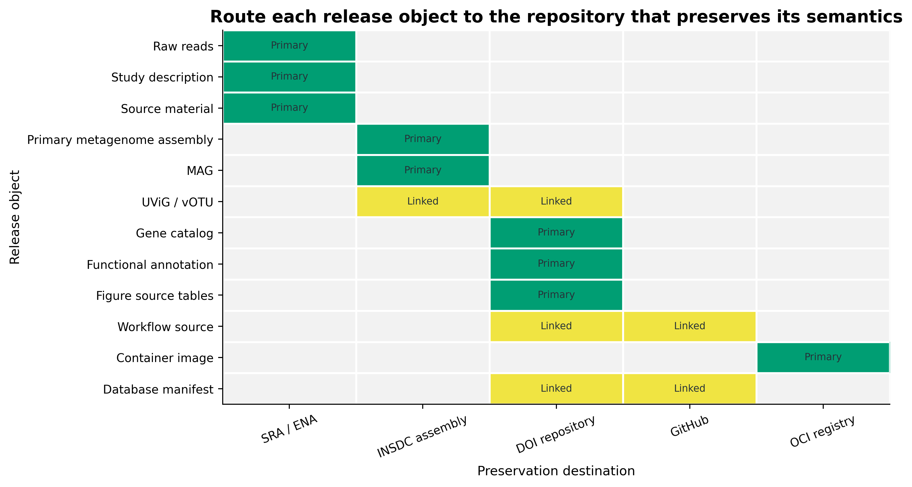
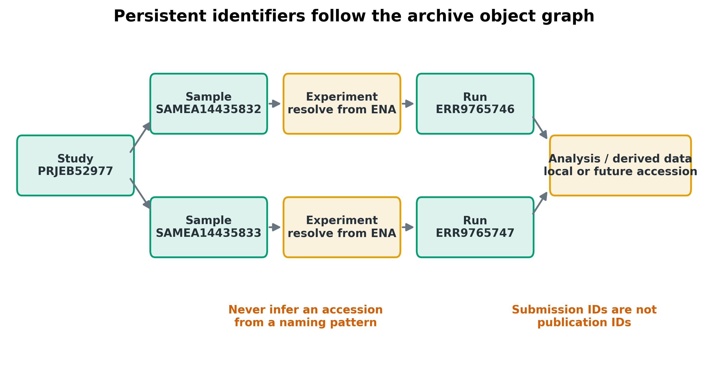
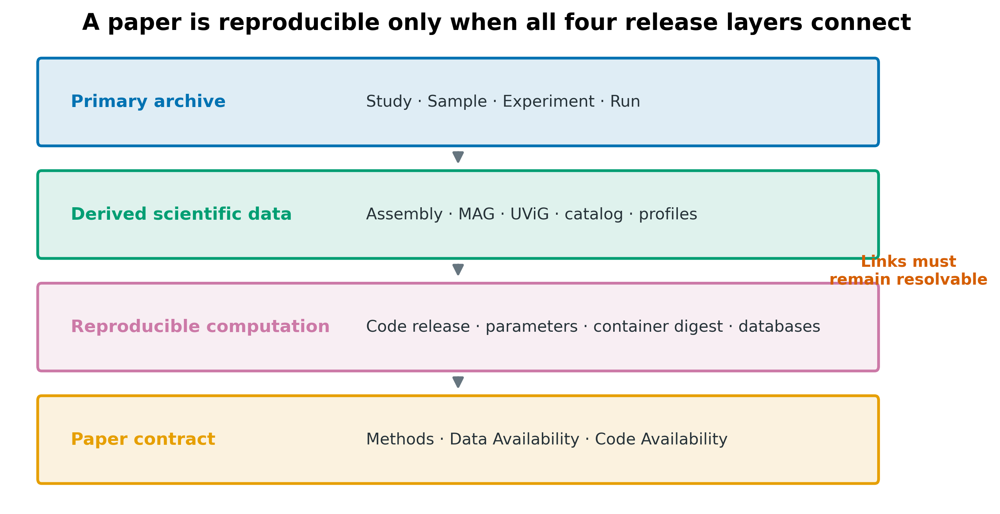
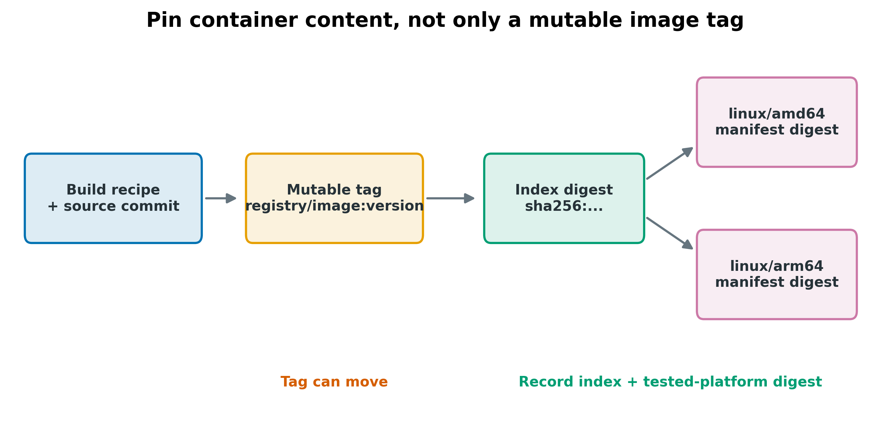
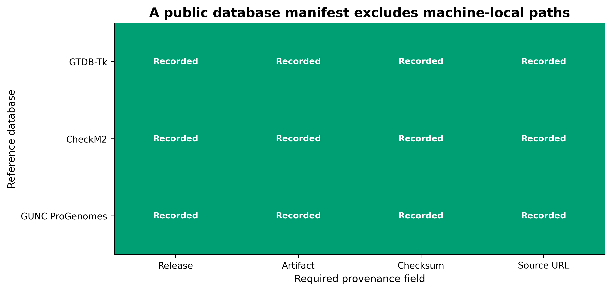
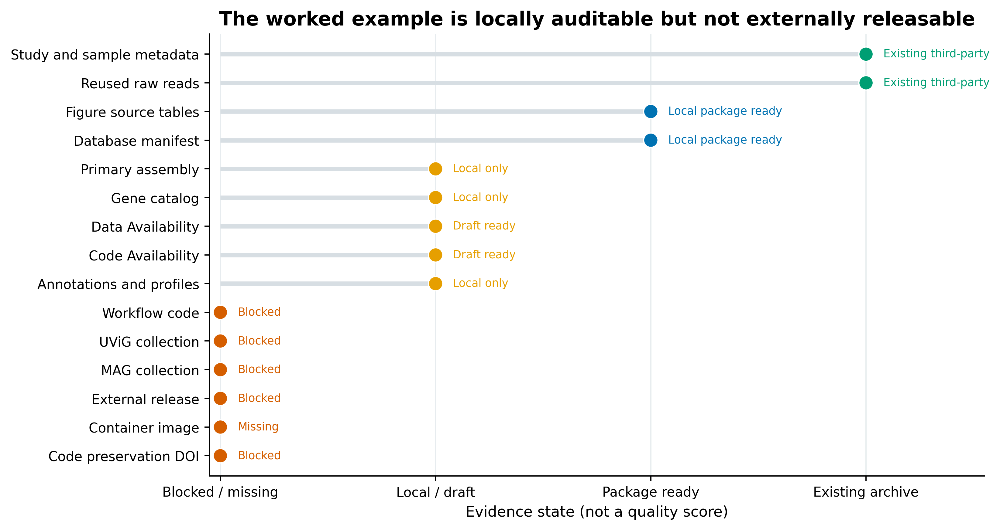
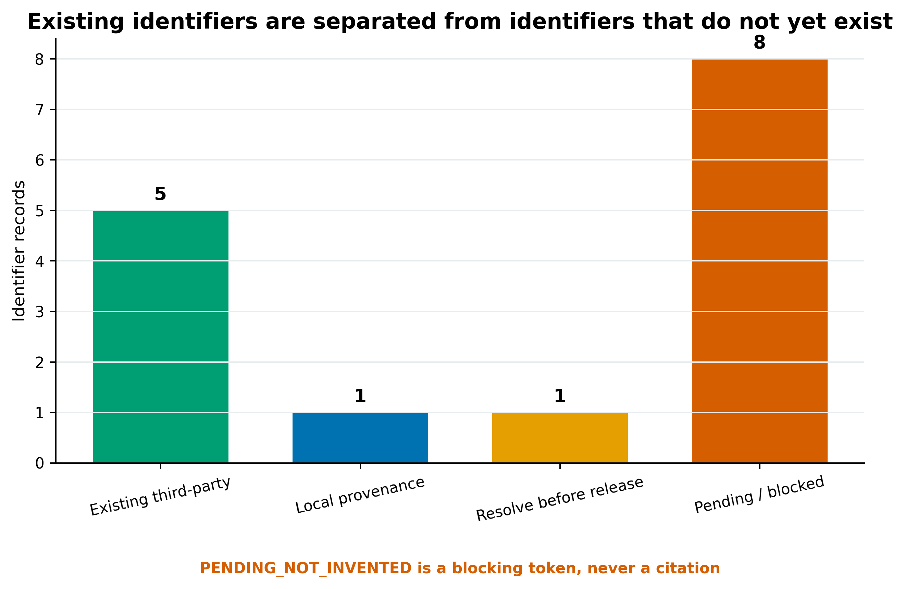
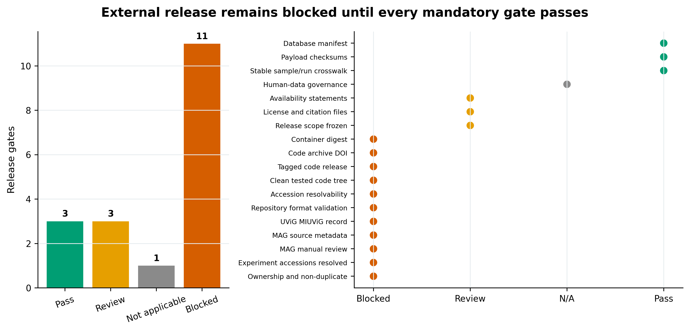
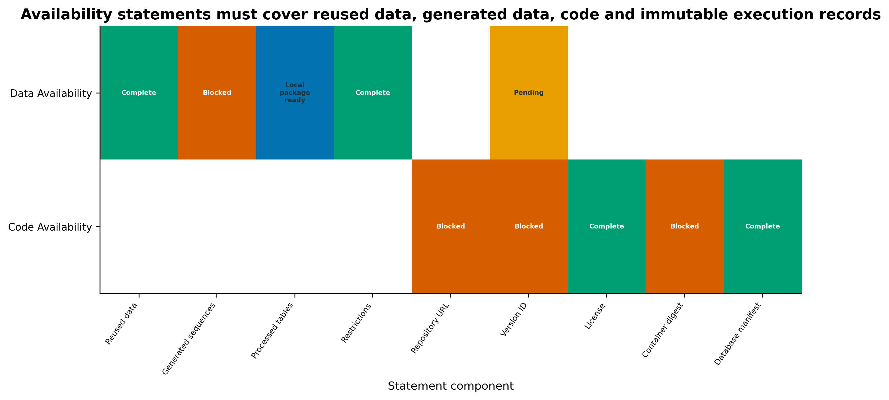

> **先给结论：**原始 reads、组装、MAG/UViG、gene catalog、分析表、代码和容器应按**对象语义**分别归档，再用稳定标识符把它们串起来。SRA/ENA 的 Run accession 不能代替 processed table 的 DOI；GitHub tag 不能代替版本化代码 DOI；Docker tag 不能代替 OCI digest；本地 SHA-256 包也**不是一次公开发布**。只有 accession/DOI/digest 已真实产生并可解析时，才能写进定稿。

```{r}
#| label: load-article77-release-ledgers
#| include: false
set.seed(20260777)

data_dir77 <- "data/small/77-data-code-genome-submission-frozen"
if (!dir.exists(data_dir77)) {
  data_dir77 <- "../data/small/77-data-code-genome-submission-frozen"
}

read_tsv77 <- function(name) {
  utils::read.delim(
    file.path(data_dir77, name),
    check.names = FALSE,
    quote = "", comment.char = "", stringsAsFactors = FALSE
  )
}

routes77 <- read_tsv77("repository-routing-matrix.tsv")
objects77 <- read_tsv77("object-relationship.tsv")
ids77 <- read_tsv77("identifier-registry.tsv")
artifacts77 <- read_tsv77("release-artifact-manifest.tsv")
ready77 <- read_tsv77("release-readiness.tsv")
gates77 <- read_tsv77("release-gate-ledger.tsv")
db77 <- read_tsv77("database-manifest-public.tsv")
container77 <- read_tsv77("container-ledger.tsv")
data_avail77 <- read_tsv77("data-availability-components.tsv")
code_avail77 <- read_tsv77("code-availability-components.tsv")
packet77 <- read_tsv77("package-index.tsv")

as_bool77 <- function(x) {
  unname(c("true" = TRUE, "false" = FALSE)[tolower(as.character(x))])
}
ready77$ExternalReady <- as_bool77(ready77$ExternalReady)

stopifnot(
  nrow(routes77) == 15L,
  nrow(objects77) == 14L,
  nrow(ids77) == 15L,
  sum(ids77$State == "EXISTING_THIRD_PARTY") == 5L,
  nrow(gates77) == 18L,
  sum(gates77$Status == "Blocked") == 11L,
  !any(ready77$ExternalReady),
  nrow(db77) == 3L,
  !"LocalPath" %in% names(db77)
)
```

## 这一步对应论文里的哪张图 {#sec-target}

ten Hoopen 等人的 Figure 2 把宏基因组归档拆成五种相连对象：**Study、Sample、Experiment、Run、Analysis** [@tenhoopen2017metagenomic]。Study 描述研究范围，Sample 描述生物材料，Experiment 描述建库和测序设计，Run 指向原始 reads 文件，Analysis 承接 assembly、分类/功能注释等派生结果。图中的箭头比“把所有文件扔进一个网盘”重要得多：归档的核心是可追溯关系，不只是文件存在。

{#fig-77-anchor}

今天的仓库界面和字段模板已经更新，但对象关系仍然成立。NCBI 当前文档明确区分 BioProject/Study、BioSample/Sample、Experiment 与 Run [@ncbi2026srametadata]；ENA 的 reads、primary metagenome assembly 和 MAG 提交流程也都要求先有 Study/Sample，并保留与下层 reads 的链接 [@ena2026readsubmission; @ena2026primarymetagenome; @ena2026magsubmission]。

::: {.callout-important title="先画对象图，再打开提交门户"}
投稿前先做一张 `internal_sample_id → BioSample → Experiment → Run → Assembly → MAG/UViG/catalog` crosswalk。若某个箭头没有真实标识符或来源证据，就把它列为阻断门；不要根据 accession 的外观猜一个编号。
:::

## 理论：为什么这么做 {#sec-theory}

### 2.1 仓库按对象语义分工，不按“哪个能上传”分工

SRA/ENA 的核心职责是保存 primary sequence data 及其标准元数据。NCBI SRA 接收 raw 或 minimally processed reads，不接收 assembly/consensus/contigs；read archive 还需要逐碱基质量信息，单独 FASTA 不够 [@ncbi2026srasubmit; @ncbi2026sraportal; @ncbi2026sraformats]。assembly、MAG 和 UViG 是派生序列对象，要走对应的 genome/analysis 路径；gene catalog、annotation、abundance matrix 与 figure-source table 通常更适合带 DOI 的通用数据仓库。

{#fig-77-routing}

可把归档关系写成：

$$
R = (O, I, E, V),
$$

其中 $O$ 是对象类型，$I$ 是持久标识符，$E$ 是对象之间的有向边，$V$ 是版本与校验和。缺少任一项都可能造成“文件找得到，但无法证明它属于哪个样本、哪个分析版本或哪张图”。

### 2.2 accession 是对象身份，不是上传回执

同一研究里常见多层 ID：BioProject/Study、BioSample/Sample、Experiment、Run、Assembly、Genome。NCBI 的 `SUB#` 和 ENA 的 `ERZ...` 属于提交跟踪或内部处理标识，不是论文最终引用的公共 accession [@ncbi2026sraportal; @ena2026magsubmission]。同理，Webin-CLI 的 `-validate` 只验证本地包，`-submit` 才触发外部提交；验证成功也不等于 accession 已发布。

{#fig-77-object-graph}

本章公共输入来自 `PRJEB52977`：

| Object | Existing identifier | Relationship |
|---|---|---|
| Study | `PRJEB52977` | public third-party project |
| Sample 1 | `SAMEA14435832` | source of `ERR9765746` |
| Sample 2 | `SAMEA14435833` | source of `ERR9765747` |
| Run 1 | `ERR9765746` | paired FASTQ |
| Run 2 | `ERR9765747` | paired FASTQ |

这些 accession 只能用于**引用原研究并复用数据**，不能重新提交、不能改称本项目新产生的数据。所有尚未真实获得的 accession/DOI/digest 统一写作 `PENDING_NOT_INVENTED`；它是阻断标记，不是占位 accession。

### 2.3 数据发布、代码发布和执行环境是三条不同的版本链

数据 DOI 锁定某版 scientific payload；代码 release 锁定程序与工作流；OCI digest 锁定容器内容。三者共同指向同一篇稿件，但不能互相代替。

{#fig-77-layers}

Zenodo record 同时包含 metadata、files 和 DOI；已发布记录的 DOI 与文件不可直接覆盖，更新应创建新版本 [@zenodo2026records; @zenodo2026versioning]。GitHub 的 `CITATION.cff` 能提供首选引用信息，但长期保存仍需发布 release 并归档到 Zenodo；每版 release 应有对应版本 DOI [@github2026citation; @github2026zenodo]。

### 2.4 tag 可变，digest 才描述容器内容

`registry/image:1.0` 是人类可读标签，可以被重新指向；`sha256:...` digest 按内容寻址。多架构镜像还至少有两层：multi-platform **index digest** 指向平台集合，platform **manifest digest** 指向如 `linux/amd64` 的具体镜像 [@docker2026digests]。Methods 只写 image tag，无法保证审稿人拉到同一内容。

### 2.5 数据库也是输入数据，必须进入版本清单

“使用 GTDB、CheckM2 和 GUNC 数据库”不够。至少记录：release、实际 artifact、checksum、source URL 与下载日期。服务器路径只对一台机器有意义，不应出现在公开清单；公开清单保留能让别人重新定位和核验的字段。

## 准备工作 {#sec-preparation}

### 3.1 本章数据、权限与计算资源

本章读取真实公共 ENA 记录及已固化的小型审计表，不上传任何外部服务：

| Evidence | Fixed identity | Role |
|---|---|---|
| raw reads | `PRJEB52977`; `ERR9765746/7` | archive object example |
| raw file manifest | four paired FASTQ rows | URL, ENA MD5, bytes |
| gene catalog summary | `megahit-mix-primary` | 93,782 representative genes; logical FNA/FAA hashes |
| MAG review packet | 12 technical candidates | five submission gates remain blocked |
| virus fixture audit | 46 sequences | independent example; MIUViG incomplete |
| workflow locks | nf-core/mag 5.5.0; Nextflow 26.04.0 | code/runtime provenance |
| database locks | GTDB R232 (R11-RS232); CheckM2 DB v3; GUNC ProGenomes 2.1 | public database manifest |

MAG 与病毒证据来自不同公共对象，不能拼成同一个生物学研究。gene catalog 的 summary 保存了代表序列的逻辑 SHA-256，但代表 FNA/FAA payload 没有在本章 staging，因此状态是 `LOCAL_LOGICAL_RECORD`，不能声称已公开。

| Stage | CPU | RAM | Disk | Time |
|---|---:|---:|---:|---:|
| Parse policies and local ledgers | 1 | <1 GB | <20 MB | seconds |
| Build local checksum packet | 1 | <1 GB | <50 MB | seconds |
| Generate nine figures | 1 | 1–2 GB | about 8 MB | <1 min |
| Quarto render and QA | 1 | 2–4 GB | <100 MB | about 1–3 min |
| Upload real FASTQ/assembly/catalog | 4–16 recommended | 8–32 GB | payload × 1.5–2 | minutes to days |

没有服务器时，可在笔记本完成 metadata、manifest、checksums、Data/Code Availability 和小型派生表打包；TB 级 FASTQ/assembly 传输放到稳定网络的 HPC 登录节点或机构数据传输服务。敏感人体宏基因组还需先审查知情同意、宿主序列与受控访问路径；FAIR 不等于把受限文件公开下载。

### 3.2 获取官方证据并生成本地发布包

```{bash}
#| eval: false
python3 scripts/download_article77_release_sources.py \
  --output-dir downloads/article77

python3 scripts/download_article77_release_sources.py \
  --output-dir downloads/article77 \
  --verify-only

python3 scripts/prepare_article77_release.py \
  --project-root . \
  --evidence-dir downloads/article77 \
  --output-dir results/77-data-code-genome-submission

python3 scripts/plot_article77_release.py \
  --input-dir results/77-data-code-genome-submission \
  --figures-dir figures/article77
```

官方在线文档会变化。本地 policy registry 的快照日期为 **2026-08-23**；正式提交当天必须重查 NCBI/ENA 字段模板、文件格式、release policy 和期刊可用性声明要求。

### 3.3 安装依赖并内联作图函数

<details>
<summary>展开：Python/R 依赖、随机状态和出版级导出函数</summary>

```bash
mamba create -n article77 -y -c conda-forge \
  python=3.13 pandas=3.0 matplotlib=3.10 pillow=12.2 pyyaml=6.0 \
  r-base=4.4 r-ggplot2=3.5 r-knitr r-scales
conda activate article77
```

```{r}
#| eval: false
set.seed(20260777)

pal_pub <- c(
  "Existing third-party" = "#009E73", "Complete" = "#009E73",
  "Local package ready" = "#0072B2", "Local only" = "#E69F00",
  "Draft ready" = "#E69F00", "Blocked" = "#D55E00",
  "Missing" = "#D55E00", "Review" = "#CC79A7"
)

scale_color_pub <- function(...) {
  ggplot2::scale_color_manual(values = pal_pub, drop = FALSE, ...)
}

scale_fill_pub <- function(...) {
  ggplot2::scale_fill_manual(values = pal_pub, drop = FALSE, ...)
}

theme_pub <- function(base_size = 10, base_family = "sans") {
  ggplot2::theme_minimal(base_size = base_size, base_family = base_family) +
    ggplot2::theme(
      panel.grid.minor = ggplot2::element_blank(),
      plot.title = ggplot2::element_text(face = "bold"),
      legend.position = "bottom",
      axis.text = ggplot2::element_text(color = "#263238")
    )
}

save_pub <- function(plot, filename, width = 8.5, height = 5) {
  ggplot2::ggsave(filename, plot, width = width, height = height,
                  units = "in", dpi = 350, bg = "white")
  ggplot2::ggsave(sub("\\.png$", ".pdf", filename), plot,
                  width = width, height = height, units = "in",
                  device = grDevices::cairo_pdf, bg = "white")
}
```

</details>

## 可复制代码 {#sec-code}

### 4.1 从 accession crosswalk 开始

先展示对象表，而不是先写上传命令：

```{r}
#| label: show-archive-objects
knitr::kable(
  objects77[1:8, c("ObjectType", "Identifier", "Parent", "IdentifierState")],
  align = c("l", "l", "l", "l")
)
```

生产项目至少准备以下列：

```text
internal_subject_id
internal_sample_id
bioproject_or_study_accession
biosample_or_sample_accession
experiment_accession
run_accession
assembly_accession
derived_biosample_accession
mag_or_uvig_accession
catalog_release_doi
```

`internal_*` 可以在研究开始时生成；archive accession 必须由仓库真实返回。缺失时保留空值和阻断状态，不要用 `PRJNA000000`、`SAMN00000000` 或“看起来合理”的 ERX 编号填表。

### 4.2 给 raw reads 做可验证 manifest

公共示例有 2 个 Run、4 个 paired FASTQ，合计约 8.40 GB；每个文件保留 ENA 报告的 MD5、bytes 与下载 URL。

```{r}
#| label: show-raw-artifact-manifest
raw77 <- artifacts77[artifacts77$AssetClass == "Raw read", ]
knitr::kable(
  raw77[, c("Artifact", "PersistentIdentifier", "ChecksumType", "Checksum", "Bytes", "State")],
  align = c("l", "l", "l", "l", "r", "l")
)
```

下载后同时验证 archive checksum 与本地 SHA-256：

```bash
md5sum ERR9765746_1.fastq.gz ERR9765746_2.fastq.gz
sha256sum ERR9765746_1.fastq.gz ERR9765746_2.fastq.gz \
  > ERR9765746.sha256
sha256sum --check ERR9765746.sha256
```

BioProject 与 BioSample 是 SRA 提交前置对象：BioProject 描述研究目标，BioSample 描述被测生物材料 [@ncbi2026bioprojectbiosample]。paired mates 属于同一个 Run；不同样本或不同实验不能为了少填表而塞进同一个 Run [@ncbi2026srametadata]。

::: {.callout-warning title="人体宏基因组先做数据治理"}
人体宏基因组可能夹带宿主 reads。公开上传前要核对 consent、伦理审批、去宿主流程和 archive 的访问政策；需要受控访问时，应公开可发现的元数据与申请路径，而不是公开受限 reads。
:::

### 4.3 把 `validate` 与 `submit` 分成两次审批

ENA Webin-CLI 的 reads manifest 应引用已经注册的 Study/Sample，并写全 library/platform 文件关系 [@ena2026readsubmission]：

```bash
# 只验证，不产生外部提交
java -jar webin-cli.jar \
  -context reads \
  -manifest manifests/reads-manifest.txt \
  -inputDir payload/raw \
  -outputDir validation/reads \
  -validate

# 仅在 ownership、consent、metadata、checksum 与 release date 审批后执行
java -jar webin-cli.jar \
  -context reads \
  -manifest manifests/reads-manifest.txt \
  -inputDir payload/raw \
  -outputDir submission/reads \
  -submit
```

同样，primary metagenome assembly 用 genome context、assembly manifest 与 FASTA，并强链接原始 Run [@ena2026primarymetagenome]：

```bash
java -jar webin-cli.jar \
  -context genome \
  -manifest manifests/primary-assembly-manifest.txt \
  -inputDir payload/assembly \
  -outputDir validation/primary-assembly \
  -validate
```

manifest 字段以提交当天官方模板为准。不要把 `-validate` 输出、`SUB#` 或 `ERZ...` 写成论文 accession；等 archive 完成处理后，核对最终 Study/Sample/Run/Assembly accession 能从公开页面解析并互相链接。

### 4.4 MAG：质量通过仍不等于拥有提交资格

MAG 提交不仅看 completeness/contamination。NCBI/ENA 还需要来源关系、derived sample metadata、规范 organism name 和适用的 MIMAG package [@ncbi2026magfaq; @ncbi2026mimag; @ena2026magsubmission]。本地 MAG 审核包的 12 个技术候选仍有 5 个阻断门：

```{r}
#| label: show-mag-release-gates
mag_gate_names77 <- c(
  "Ownership and non-duplicate", "MAG manual review", "MAG source metadata",
  "Repository format validation", "Accession resolvability"
)
knitr::kable(
  gates77[gates77$Gate %in% mag_gate_names77,
          c("Gate", "Status", "EvidenceOrNextAction", "Owner")],
  align = c("l", "l", "l", "l")
)
```

关键边界是 ownership：这些 MAG 来自公共教程 mock 数据，不是一个新的 submitter-owned genome study，因此**不能重新提交**。在自己的项目中，每个准备公开的 MAG 还要确认：

- 非冗余代表选择已冻结，避免同一物种同一 biome 重复提交；
- MIMAG/CheckM2/GUNC、rRNA/tRNA、contig/coverage 异常和人工复核有逐 MAG 记录；
- source reads、primary assembly、原始 BioSample 与 derived MAG BioSample 能回链；
- organism name 与 NCBI/ENA taxonomy 协调完成，不把 GTDB lineage 直接当作 NCBI 批准名；
- 先运行 `-validate`，人工审阅 manifest 和 FASTA，再审批 `-submit`。

### 4.5 UViG/vOTU：序列、聚类和 MIUViG 要一起交代

UViG release 至少包含：序列 FASTA、vOTU membership、来源 Run/assembly、识别软件、预测 genome type/structure、detection type、CheckV quality 与 contig 数。NCBI 当前提供 MIUVIG BioSample package 6.0 [@ncbi2026miuvig]。本地病毒 fixture 的 assembly software 与 predicted genome type 缺失，并且不是本项目拥有的研究数据，因此保持 blocked。

不能把以下概念混为一谈：

- vOTU 是相似性聚类单元；
- UViG 是待报告的病毒基因组实体；
- `complete` 软件预测不是 finished genome；
- vOTU representative 不自动获得 sequence accession；
- 第三方 regression fixture 不自动获得重新提交权。

### 4.6 gene catalog、annotation 和 figure source data 用版本化数据包

gene catalog 不只交一个 `representatives.faa`。最低可复用单元包括：

```text
representatives.fna
representatives.faa
membership.tsv
gene-annotation.tsv
sample-by-gene-abundance.tsv
catalog-build-parameters.json
database-manifest.tsv
README.md
data-dictionary.tsv
SHA256SUMS
```

本例 `megahit-mix-primary` 有 **93,782** 个代表基因；FNA 逻辑 SHA-256 为 `86b1d6b5dd5bc812b0a6b6d1612f6d0aba8ef8fbff6425ebc627c6d539f3a6f0`，FAA 为 `005a26d60eaa357ff328b97071b49fe1d580f4e8e488bca1ba49f22dfd01ac17`。但文件未进入 staging，哈希记录不能代替 payload。

```bash
find release-v1 -type f ! -name SHA256SUMS -print0 \
  | sort -z \
  | xargs -0 sha256sum > release-v1/SHA256SUMS

cd release-v1
sha256sum --check SHA256SUMS
```

Zenodo 发布后 DOI 与文件不可直接替换；更新数据时创建新 version，保留版本间链接 [@zenodo2026records; @zenodo2026versioning]。论文应引用**实际用于分析的版本 DOI**，而不是只引用 concept DOI 或项目首页。

### 4.7 代码：clean commit → signed tag → GitHub release → version DOI

```bash
git status --short
python3 -m pytest
quarto render

git tag -s v1.0.0 -m "Manuscript analysis release v1.0.0"
git push origin v1.0.0
gh release create v1.0.0 \
  --verify-tag \
  --title "Manuscript analysis v1.0.0" \
  --notes-file CHANGELOG.md
```

仓库还应包含 `LICENSE`、`CITATION.cff`、环境锁、参数、测试和最小运行说明。若 GitHub 与 Zenodo 已连接，公开 GitHub release 后由 Zenodo 归档，并把返回的 version DOI 写入 `CITATION.cff` 与 Code Availability [@github2026citation; @github2026zenodo]。不可变 release 可进一步锁住 tag 与 assets，但仍需保存 DOI 和 checksum 证据 [@github2026immutable]。

### 4.8 容器：同时记 index digest 与实测平台 digest

{#fig-77-container}

```bash
docker buildx build \
  --platform linux/amd64,linux/arm64 \
  --tag REGISTRY/PROJECT/analysis:v1.0.0 \
  --push .

# 记录 multi-platform index digest 与平台列表
docker buildx imagetools inspect \
  REGISTRY/PROJECT/analysis:v1.0.0

# 保存原始 OCI index，再提取各 platform manifest digest
docker buildx imagetools inspect --raw \
  REGISTRY/PROJECT/analysis:v1.0.0 \
  > container-index.json
jq -r '.manifests[] | [.platform.os, .platform.architecture, .digest] | @tsv' \
  container-index.json > container-platform-digests.tsv
```

最后从 digest 启动 smoke test，而不是从 tag 启动：

```bash
docker pull REGISTRY/PROJECT/analysis@sha256:INDEX_DIGEST
docker run --rm \
  REGISTRY/PROJECT/analysis@sha256:PLATFORM_MANIFEST_DIGEST \
  workflow --version
```

### 4.9 公共数据库清单删除本机路径

```{r}
#| label: show-public-database-manifest
knitr::kable(
  db77[, c("Database", "Release", "Artifact", "ChecksumType", "Checksum")],
  align = c("l", "l", "l", "l", "l")
)
```

{#fig-77-database}

可用下面的 Python 代码从内部 ledger 生成公开版：

```python
import pandas as pd

db = pd.read_csv("internal/database-lock.tsv", sep="\t")
required = ["Database", "Release", "Artifact", "ChecksumType", "Checksum", "SourceURL"]
assert db[required].notna().all().all()

public = db[required].copy()       # explicitly excludes LocalPath
assert "LocalPath" not in public.columns
public.to_csv("release-v1/database-manifest.tsv", sep="\t", index=False)
```

### 4.10 Data Availability 与 Code Availability 分开写

期刊的 Data Availability 要覆盖**新产生和复用的数据**，给出 persistent identifier；有限制时写明原因与访问程序 [@nature2026dataavailability]。Code Availability 单独列 repository、release tag、commit、version DOI、license、container digest 和 database manifest。

```{r}
#| label: show-availability-components
availability77 <- rbind(
  transform(data_avail77[, c("Component", "Status")], Statement = "Data Availability"),
  transform(code_avail77[, c("Component", "Status")], Statement = "Code Availability")
)
knitr::kable(
  availability77[, c("Statement", "Component", "Status")],
  align = c("l", "l", "l")
)
```

## 审计与升级 {#sec-audit}

### 5.1 从“有链接”升级为“每个对象都能解析”

过去常在补充材料里放一个 SRA project 和一个 GitHub 主分支。今天应逐层审计：

1. Study/Sample/Experiment/Run 是否真实存在且互相链接；
2. assembly、MAG/UViG 是否回指 source reads 与 sample；
3. processed data 是否有固定版本、数据字典、校验和与 DOI；
4. code DOI 是否对应 manuscript release，而不是最新 main；
5. container 是否有 index 与实测平台 digest；
6. database manifest 是否能重新下载并核验；
7. Data/Code Availability 中每个标识符是否已解析。

### 5.2 当前示例为什么不能对外提交

{#fig-77-readiness}

```{r}
#| label: current-release-readiness
knitr::kable(
  ready77[, c("ReleaseObject", "Status", "EvidenceOrNextAction")],
  align = c("l", "l", "l")
)
```

这里的判断不是“完成率评分”，而是 gate-based decision。`Existing third-party` 表示可引用既有 archive record；`Local package ready` 表示本地证据齐全但尚未获得 DOI；`Blocked/Missing` 表示不能进入外部发布。

{#fig-77-identifiers}

### 5.3 18 道发布门必须逐项过

{#fig-77-gates}

最容易被忽视的门不是 checksum，而是：

- **ownership/non-duplicate**：公共教程数据不能改头换面再提交；
- **human-data governance**：知情同意与宿主序列治理必须先于开放；
- **repository validation**：验证报告与最终 accession 都要留档；
- **clean tested release**：脏工作树的 commit 不能代表论文版本；
- **identifier resolvability**：`PENDING_NOT_INVENTED` 必须在定稿前被真实 ID 替换或把对应声明删除；
- **database/container identity**：不能只报工具名、数据库名或 tag。

### 5.4 当前文档不是永久政策

NCBI/ENA package version、必填字段、受理范围、Zenodo 限额、GitHub release policy 和期刊要求都可能变化。本地快照能复现本次判断，却不能替代提交当天的官方文档。每个 mutable source 都带 `RecheckAtSubmission=Yes`，变更后要更新 policy assertion、Methods 与 validation evidence。

## 出版级美化 {#sec-style}

发布图不是装饰，而是让读者检查“数据在哪里、标识符属于谁、哪些仍未发布”。建议正文保留三类图：

- **object graph**：只画实际存在的 accession，未知节点明确显示 unresolved；
- **routing matrix**：一眼区分 archive、DOI repository、code host 和 OCI registry；
- **release gate plot**：红色只表示阻断，不把 local-ready 染成“已发布”的绿色。

{#fig-77-availability}

图内文字统一英文，颜色同时配合位置与文字标签，避免只靠红绿判断。PNG 用 350 dpi 供公众号，SVG/PDF 用于网页和投稿；每张图的 source table、脚本、版本与 SHA-256 同时进入 release packet。

## 常见坑 {#sec-pitfalls}

::: {.callout-caution title="坑 1：把 SRA project 当成所有数据的下载地址"}
SRA/ENA Run 解决 raw reads；gene catalog、annotation、abundance matrix 与 figure source data 仍要单独归档。Data Availability 要逐类说明，不能只写一个 BioProject。
:::

::: {.callout-caution title="坑 2：把上传回执写成 accession"}
`SUB#`、`ERZ...`、validation directory 和 portal submission name 都不是最终论文标识符。定稿前逐个点击/查询正式 accession，确认公开状态和父子关系。
:::

::: {.callout-caution title="坑 3：从 Run 名称猜 Experiment accession"}
archive 对象有固定关系，但编号模式不是 API。应从 ENA/NCBI record 解析真实 Experiment；查不到就保持 unresolved。
:::

::: {.callout-caution title="坑 4：技术质量通过就提交公共 MAG"}
MIMAG/CheckM2/GUNC 通过不代表拥有数据、没有重复 submission、taxonomy 名称已协调、source metadata 完整或人工审核完成。ownership 是独立硬门。
:::

::: {.callout-caution title="坑 5：把 GitHub main、release tag 和 DOI 当成一回事"}
main 会移动；tag 可能被重指；GitHub release 是发布事件；Zenodo version DOI 是保存记录。Methods 与 Code Availability 要给 exact tag、commit 和 version DOI。
:::

::: {.callout-caution title="坑 6：容器只写 `image:latest`"}
tag 不锁内容；多架构镜像还要区分 index digest 与 platform manifest digest。写清实际测试平台，并从 digest 重跑 smoke test。
:::

::: {.callout-caution title="坑 7：数据库清单泄露本机路径，却没有 checksum"}
服务器内部绝对路径对读者无用，也可能暴露内部结构。公开版只保留 release、artifact、checksum、source URL 与 retrieval date。
:::

::: {.callout-caution title="坑 8：在 Data Availability 里承诺尚不存在的 DOI"}
未发布时使用内部阻断标记；final proof 前必须替换为可解析 DOI/accession。若某资产最终不发布，应重写声明和研究限制，不能保留虚构标识符。
:::

## 这段 Methods 怎么写 {#sec-methods}

### 8.1 Methods 模板

> Raw shotgun metagenomic reads were archived under BioProject/Study **[PROJECT_ACCESSION]**, BioSamples **[BIOSAMPLE_ACCESSIONS]**, and Runs **[RUN_ACCESSIONS]**. Primary metagenome assemblies and eligible MAG/UViG records were deposited under **[ASSEMBLY_AND_GENOME_ACCESSIONS]**, with explicit links to source samples and runs. Processed profiles, the nonredundant gene catalog, annotations, data dictionaries, and figure-source tables were released as dataset version **[DATA_RELEASE]** at **[DATA_VERSION_DOI]**. Analysis code was frozen at release **[CODE_TAG]**, commit **[COMMIT_SHA]**, and version DOI **[CODE_VERSION_DOI]**. The tested container **[REGISTRY/IMAGE]** was pinned by OCI index digest **[INDEX_DIGEST]** and **[PLATFORM]** manifest digest **[PLATFORM_DIGEST]**. Reference resources were locked to GTDB-Tk **R11-RS232**, CheckM2 database **version 3** (Zenodo record 14897628), and GUNC **1.1.0 / ProGenomes 2.1**, with artifact checksums and source URLs reported in the database manifest. Release manifests and figures were generated with Python **3.13.2**, pandas **3.0.3**, and fixed seed **20260777**.

只有真实使用这些版本时才保留版本号；换了数据库或平台，就同步更新 manifest、Methods、结果和图。

### 8.2 Data Availability 模板

> Raw sequence reads are available from **[SRA_OR_ENA]** under BioProject/Study **[PROJECT_ACCESSION]**, BioSamples **[BIOSAMPLE_ACCESSIONS]**, and Runs **[RUN_ACCESSIONS]**. The primary metagenome assemblies and MAG/UViG records are available under **[ASSEMBLY_AND_GENOME_ACCESSIONS]**. Version **[DATA_RELEASE]** of the gene catalog, annotations, abundance tables, and figure-source data is archived at **[DATA_DOI]**. Controlled files, if any, are available through **[CONTROLLED_REPOSITORY]** under **[ACCESS_PROCEDURE]**; public metadata remain available at **[METADATA_ACCESSION]**.

### 8.3 Code Availability 模板

> Analysis code is available at **[PUBLIC_REPOSITORY_URL]**, release **[RELEASE_TAG]**, commit **[COMMIT_SHA]**, and archived as version DOI **[CODE_VERSION_DOI]**. The tested container is **[REGISTRY/IMAGE]**, pinned by multi-platform index digest **[OCI_INDEX_DIGEST]** and tested-platform manifest digest **[OCI_PLATFORM_DIGEST]** for **[PLATFORM]**. Workflow parameters, software locks, tests, and database manifests are included in the archived release.

当前公共示例只能诚实写成：复用的 reads 位于 `PRJEB52977`、`SAMEA14435832/3`、`ERR9765746/7`；本地 assembly、MAG、UViG、gene catalog、figure source 与代码**尚未作为新研究产物发布**，没有新的 accession/DOI/digest，不能称为 publicly released dataset。

## 换成你自己的数据怎么做 {#sec-own-data}

### 9.1 在采样前建立对象和责任人

先定 BioProject/Study 范围、BioSample package、内部 sample ID、consent/伦理范围、release date 和 data steward。人体项目同时确定 host-read screening 与 controlled-access 策略；环境项目先锁 MIxS/环境 package 字段，避免样本采完才发现经纬度、日期或环境材料缺失。

### 9.2 按发布包目录收集，而不是投稿前四处找文件

```{r}
#| label: show-release-package-index
knitr::kable(
  packet77[, c("Order", "PackageObject", "SuggestedPath", "Purpose")],
  align = c("r", "l", "l", "l")
)
```

每次 figure freeze 后更新 source table 和 checksum；每次 workflow/database/container 变化后更新 version ledger。不要保存所有巨大临时文件，但 raw reads、关键 assembly、最终 MAG/UViG、gene catalog、processed tables、参数与 provenance 必须有明确去向。

### 9.3 用硬门做最终放行

提交前要求以下项目全部有负责人签字：

1. ownership、non-duplicate 与人类数据治理；
2. Study/Sample/Experiment/Run crosswalk；
3. MAG MIMAG/GUNC/人工审核与 UViG MIUViG；
4. repository format validation 与最终 accession；
5. processed data DOI、数据字典和 SHA256SUMS；
6. clean tested code、signed tag、GitHub release 与 version DOI；
7. OCI index/platform digest 与 digest-pinned smoke test；
8. public database manifest、license、CITATION.cff；
9. Data Availability 与 Code Availability 中所有 ID 可解析；
10. manuscript、supplement、repository landing page 的版本一致。

任何 mandatory gate 未通过，状态都保持 blocked。延迟提交比发布错误 accession、重复 MAG、敏感 reads 或无法重现的容器更容易修复。

## 参考

- 宏基因组归档对象模型与分析结果保存：@tenhoopen2017metagenomic。
- NCBI SRA 范围、对象、格式与 BioProject/BioSample：@ncbi2026srasubmit; @ncbi2026sraportal; @ncbi2026srametadata; @ncbi2026sraformats; @ncbi2026bioprojectbiosample。
- NCBI MAG/MIUVIG submission packages：@ncbi2026magfaq; @ncbi2026mimag; @ncbi2026miuvig。
- ENA raw reads、primary metagenome assembly 与 MAG：@ena2026readsubmission; @ena2026primarymetagenome; @ena2026magsubmission。
- Zenodo records/versioning 与 GitHub citation/release preservation：@zenodo2026records; @zenodo2026versioning; @github2026citation; @github2026zenodo; @github2026immutable。
- OCI image digests：@docker2026digests。
- Data Availability statement：@nature2026dataavailability。
