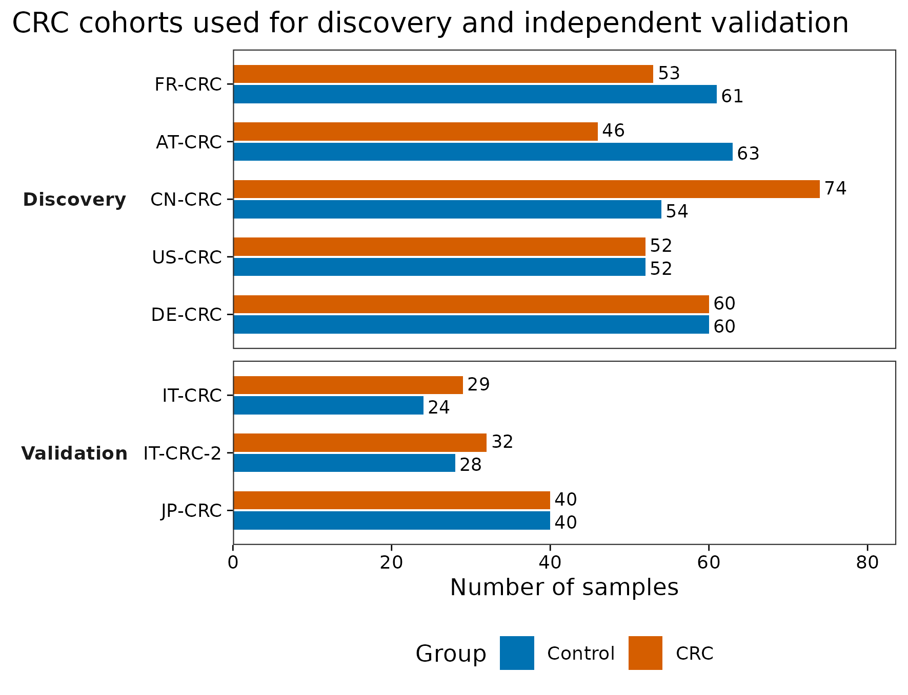
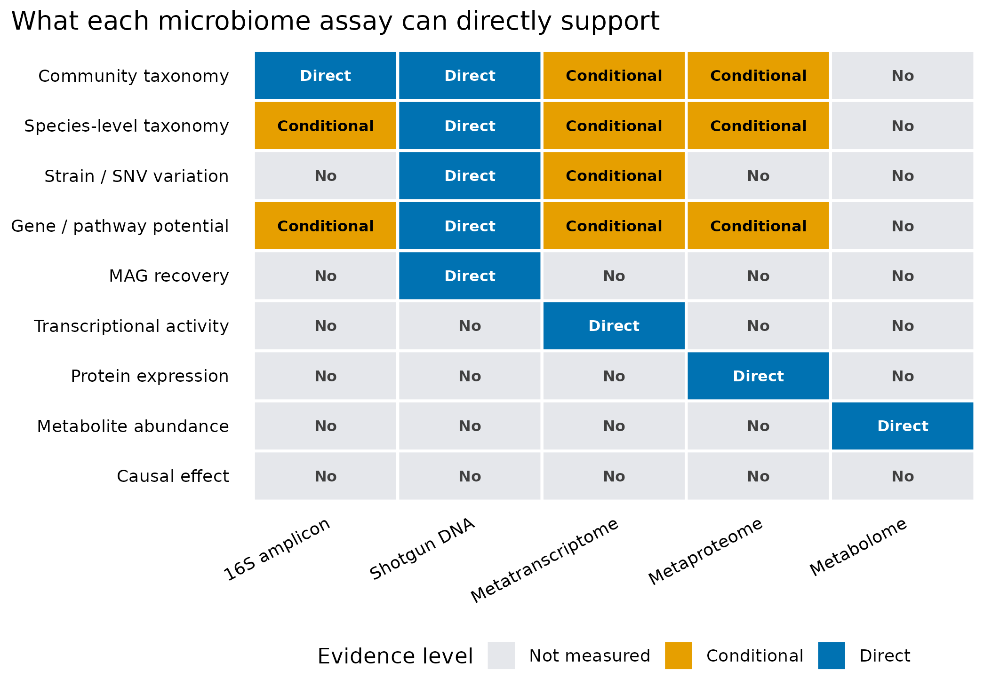

::: {.callout-tip title="先确定主要结论需要哪一层测量"}

DNA 检出不等于表达、代谢通量或因果作用；问题需要哪一层证据，就补哪一层数据。

:::

## 先确定要测的是组成、功能潜力，还是实际活动 {#sec-target}

Wirbel 等在 2019 年的 CRC shotgun meta-analysis 中先面对一个很现实的问题：不同国家、实验流程和人群产生的结果能否共同支持一个疾病信号？论文 **Figure 1** 展示跨研究仍一致的 CRC 相关物种，**Figure 3** 检查分类模型能否迁移到其他研究，**Figure 5** 再用三个独立队列验证结果 [@wirbel2019crc]。

公开元数据记录了发现队列与独立验证队列的样本构成：

::: {layout-ncol=2}
{#fig-crc-cohorts}

{#fig-assay-boundaries}
:::

图 @fig-crc-cohorts 说明“跨队列”首先是一种研究设计，而不是换一个绘图函数。图 @fig-assay-boundaries 则给所有结果加上一条解释上限：**shotgun metagenomics 测的是样本中的 DNA；它能支持物种、基因、MAG 和菌株层分析，但不能单独证明转录活性、蛋白表达、代谢通量或因果作用。**

::: {.callout-important title="先问测到了哪一层，再问用什么软件"}
检测到丁酸合成基因，只能说明存在相应遗传潜力。要说这些基因正在转录，需要宏转录组；要说蛋白已经表达，需要宏蛋白组；要说丁酸真的形成并发生变化，需要代谢组或靶向定量；要说它导致了疾病，还需要时间顺序、干预和机制证据。
:::

### 先确定主要结论需要哪一层测量

如果问题是疾病相关的物种组成，先得到统一处理的样本谱和可信的队列内比较；若问题是某条功能是否执行，DNA 基因丰度就不是足够的终点。增加 MAG、网络或机器学习，不会自动补上转录、代谢或时间顺序的缺口。分析路线应围绕一个主要结论展开，其他层用于回答尚未解决的具体问题。

这里八个队列的意义也不只是把样本数相加。五个发现队列用于提出候选，三个独立队列检验这些候选是否能迁移；若在看到验证结果后反复改特征和参数，那些队列就不再是未见验证集。测得更多层与得到更强证据，是两件需要分别证明的事。

## 八个队列，怎样区分发现与验证 {#sec-code}

### 16S 回答“谁可能在那里”，shotgun 还能查看“携带了什么” {#sec-theory}

16S/18S/ITS 扩增子只测一个标记区域，适合低成本描述群落结构，但分类分辨率受引物、扩增区域和参考库限制。由 16S 推断功能时，得到的是参考基因组映射出的**预测功能**，不是样本中直接测到的基因 [@knight2018best]。

Shotgun metagenomics 对样本中的 DNA 进行非靶向测序。它可以走三条相互关联但产物不同的路线：

1. **Reference-based read profiling：**reads 直接与 marker 或参考数据库比较，得到物种和功能谱；
2. **Gene / contig-centric：**先组装或建立基因目录，再分析基因、ARG、CAZyme、BGC、病毒和质粒 contig；
3. **Genome-resolved：**将 contig 分箱为 MAG，再做分类、系统发育、菌株、泛基因组和代谢重建。

这三层都依赖测序深度、数据库覆盖、序列相似性和质量控制。复杂环境中的未知物种越多，纯参考比对的未分类比例通常越高；组装和分箱则会受到群落复杂度、低丰度和近缘菌株混合影响 [@quince2017shotgun]。

### “功能潜力”不是“功能活性”

DNA 层能够回答某个基因或通路是否可被检出、丰度是否关联于条件、可能属于哪个物种或 MAG。它不能直接回答：

- 这个基因采样时是否正在转录；
- 对应蛋白是否已经形成；
- 反应是否真的发生、方向和通量是多少；
- 观察到的代谢物来自哪个微生物、宿主还是饮食；
- 微生物变化是疾病原因、疾病结果还是共同混杂造成。

Integrative Human Microbiome Project 将宏基因组与转录组、蛋白组、代谢组和宿主信息联合，正是因为单一 DNA 层无法覆盖动态活动和宿主—微生物机制 [@ihmp2019]。


作者仓库将 `FR-CRC`、`AT-CRC`、`CN-CRC`、`US-CRC`、`DE-CRC` 定义为发现/meta-analysis 队列，将 `IT-CRC`、`IT-CRC-2`、`JP-CRC` 定义为独立验证队列。这样得到 5 个发现队列的 575 个样本，以及 3 个验证队列的 193 个样本。

### 从 2019 复现到当前研究设计 {#sec-audit}

Wirbel 研究给出的关键升级不是“换一个分类器”，而是把证据从单队列推进到多队列训练和独立验证。公开仓库清楚区分了 5 个 reference studies、3 个 external CRC studies 和非 CRC 疾病队列；这种分层应在分析前固定，不能看完结果再挑验证集。

复现时还要审计四个边界：

1. **不要混淆 profiler 谱系。** 该 Zenodo 物种文件名明确记录 `mOTUs2.0.0`。`curatedMetagenomicData` 当前提供的是 MetaPhlAn3/HUMAnN3 统一重处理结果；它们不是同一张表，也不能冒充 MetaPhlAn4 输出。
2. **同一版本统一重处理。** 若升级 profiler 或数据库，应把所有队列用同一版本重跑，并把旧版复现和新版敏感性分析分开报告。
3. **预处理必须留在训练边界内。** 特征筛选、标准化、缺失处理和超参数选择都不能偷看留出队列。真正 LODO 是用 N−1 个完整队列训练，只在第 N 个从未参与建模的队列测试。
4. **DNA 关联不能升级成活性或因果。** 蛋白降解、黏液利用或胆汁酸相关基因富集是功能潜力证据；要描述实际活动，应补转录、蛋白、代谢物或实验验证。

::: {.callout-note title="数据谱系卡片"}
```text
Study:            Wirbel et al. CRC metagenome meta-analysis
Public record:    Zenodo 3517209, version 1.0
Input used here:  meta_all.tsv
Input checksum:   MD5 da18b10fdabae6308329e80b73991f84
Raw reads:        PRJEB27928, PRJEB10878, PRJEB12449,
                  ERP008729, ERP005534, SRP136711, DRA006684
Profile source:   author-provided analysis inputs
Profiler lineage: mOTUs 2.0.0 for the published species profile
Feature type:     cohort metadata only in article 01
Unit:             sample counts
Normalization:    none
Reprocessed:      cohort counts regenerated from the public metadata
License:          CC BY 4.0
```
:::

::: {.callout-caution title="九个最容易把结论说过头的地方"}
1. **把“metagenomics”当成 16S 的同义词。** 16S 是 marker-gene amplicon；这里的 shotgun metagenomics 是非靶向群落 DNA 测序。
2. **把基因存在写成基因表达。** DNA 只支持功能潜力，表达需要 RNA 或蛋白证据。
3. **把通路丰度写成代谢通量。** HUMAnN、基因目录或 MAG 注释不能直接测通量。
4. **把相对丰度写成绝对数量。** 没有外部定量参照时，不知道每克或每毫升的真实负荷。
5. **把物种相关写成菌株传播。** 传播至少需要菌株级 SNV/基因组证据，并排除共同来源。
6. **把 bin 直接叫高质量 MAG。** 完整度、污染、GUNC、rRNA/tRNA、组装图和人工检查缺一不可。
7. **把同队列交叉验证写成外部验证。** 真正外部验证的测试队列在训练、特征选择和调参阶段完全不可见。
8. **把数据库没检出写成不存在。** “0”可能是深度不足、参考库缺失、阈值过滤或宿主 reads 挤占造成。
9. **把横断面关联写成因果。** 疾病、药物、饮食、年龄和采样流程都可能产生相同模式。
:::

## 需要绝对数量或功能活动时，还缺什么？

### shotgun 也不是绝对定量

常规 shotgun 丰度仍受总 DNA 量、宿主 DNA 比例、提取效率、基因组大小、测序深度和组成约束影响。某个物种相对丰度升高，既可能是它增加，也可能是其他成员减少。若科学问题要求“每克粪便多少细胞”或“每毫升多少 ARG copies”，需要 spike-in、流式计数、qPCR/ddPCR 或其他外部定量参照。

<details>
<summary><strong>深入：九类问题分别需要什么证据</strong></summary>

| 问题 | shotgun DNA 能否支持 | 还需补什么 |
|---|---|---|
| 样本里有哪些物种？ | 可以，但依赖参考库、阈值和覆盖度 | mock、阴性对照、工具敏感性分析 |
| 是否存在某个基因或通路？ | 可以描述 DNA 潜力 | identity、coverage、基因长度与数据库版本 |
| 功能属于谁？ | 可用 stratified profile、contig、MAG 或长读连接推断 | 组装图、覆盖度、嵌合与污染检查 |
| 是否有菌株差异或传播？ | 深度足够时可分析 SNV、marker phylogeny 和 accessory genes | 排除共同来源、批次和种水平相似 |
| 基因是否正在表达？ | 不能 | 宏转录组 |
| 蛋白是否表达？ | 不能 | 宏蛋白组 |
| 代谢物是否形成？ | 不能 | 代谢组或靶向化学定量 |
| 微生物绝对数量是否变化？ | 常规相对谱不能 | spike-in、流式、qPCR/ddPCR |
| 是否造成疾病或表型？ | 不能由横断面 DNA 关联证明 | 纵向、干预、培养、FMT/无菌动物和机制实验 |

</details>


这张表的编码含义是：

- `0`：该组学没有直接测量这一层；
- `1`：结果依赖参考库、间接推断、额外归属步骤或覆盖度；
- `2`：该组学直接测量了对应分子层，但仍需质控和统计验证。

即使标为 `Direct`，也不等于“结论自动正确”。例如宏转录组直接测 RNA，但仍存在 RNA 提取、rRNA 去除、宿主 RNA、基因归属和组成型问题。

## 换到自己的研究中，先检查哪些条件？ {#sec-yourdata}

### 先写一张“问题—证据—数据”表

在下载 FASTQ 或安装数据库前，先完成下面四列：

| Scientific question | Required evidence | Available data | Claim limit |
|---|---|---|---|
| Which species differ? | shotgun taxonomic profile + covariates | FASTQ / species table | association |
| Which genes are carried? | gene/pathway profile or assembly | DNA reads / contigs | functional potential |
| Are the genes active? | matched metatranscriptome | RNA reads | transcription |
| Is the metabolite produced? | matched metabolomics + standards | peak table / concentrations | abundance, not flux unless measured |
| Does it cause the phenotype? | temporal/intervention/mechanistic evidence | longitudinal or experiment | causal only at supported level |

若 `Required evidence` 在 `Available data` 中不存在，正确做法是降低结论强度或补实验，而不是增加更多统计模型。

### 队列表只需要五列

把自己的研究设计整理为：

```text
SampleID    Cohort    Role          Group      Batch
S001        Center_A  Discovery     Control    Run1
S002        Center_A  Discovery     Case       Run1
S101        Center_B  Validation    Control    Run2
S102        Center_B  Validation    Case       Run2
```

`Role` 必须在看结果前确定。若只有一个中心或一个批次，就只能报告内部交叉验证；不要把随机拆出的 20% 样本称作“独立外部队列”。

## 回到最初的问题

shotgun metagenomics 的优势不是“比 16S 图更多”，而是把证据推进到物种、基因、contig、MAG 和菌株层，并能追问“功能可能属于谁”。它的上限同样明确：**DNA 告诉我们群落具备什么遗传潜力，不自动告诉我们当时做了什么，更不自动证明为什么会发生。**

CRC 公开数据还展示了第二条主线：可投稿的证据不仅来自分辨率，也来自独立队列、明确训练边界和可审计数据谱系。

## 参考文献 {#sec-refs}

- Quince C, Walker AW, Simpson JT, Loman NJ, Segata N. Shotgun metagenomics, from sampling to analysis. *Nature Biotechnology*. 2017;35:833–844. <https://doi.org/10.1038/nbt.3935>
- Knight R, Vrbanac A, Taylor BC, et al. Best practices for analysing microbiomes. *Nature Reviews Microbiology*. 2018;16:410–422. <https://doi.org/10.1038/s41579-018-0029-9>
- Integrative HMP Research Network Consortium. The Integrative Human Microbiome Project. *Nature*. 2019;569:641–648. <https://doi.org/10.1038/s41586-019-1238-8>
- Wirbel J, Pyl PT, Kartal E, et al. Meta-analysis of fecal metagenomes reveals global microbial signatures that are specific for colorectal cancer. *Nature Medicine*. 2019;25:679–689. <https://doi.org/10.1038/s41591-019-0406-6>
- Wirbel J, et al. Public analysis data, Zenodo record 3517209, version 1.0, CC BY 4.0. <https://doi.org/10.5281/zenodo.3517209>
- Bowers RM, Kyrpides NC, Stepanauskas R, et al. Minimum information about a single amplified genome and a metagenome-assembled genome. *Nature Biotechnology*. 2017;35:725–731. <https://doi.org/10.1038/nbt.3893>
